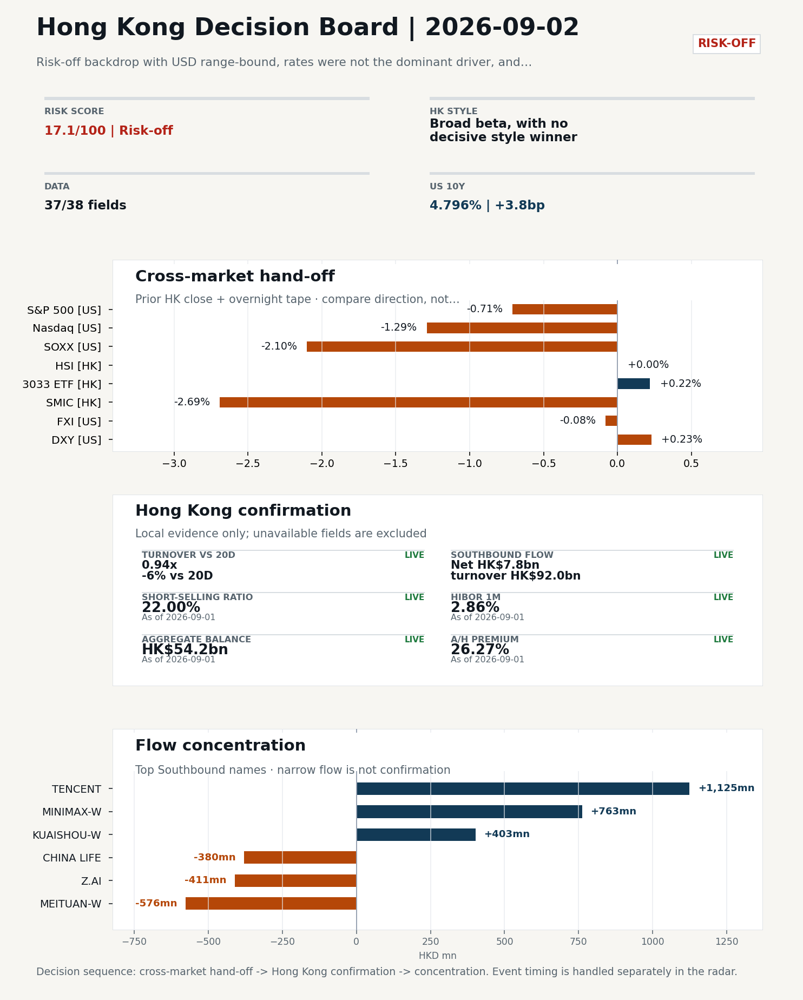
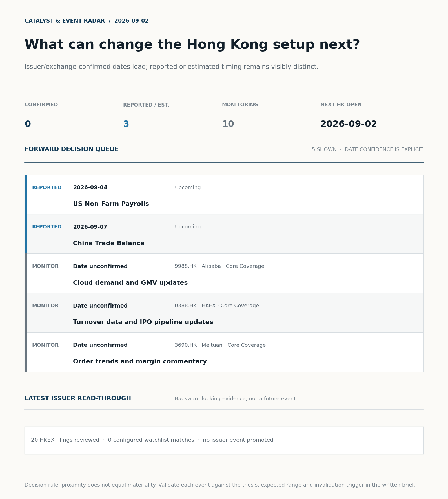
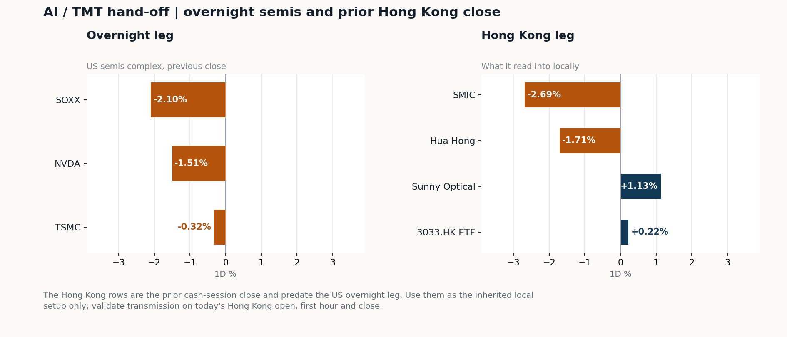
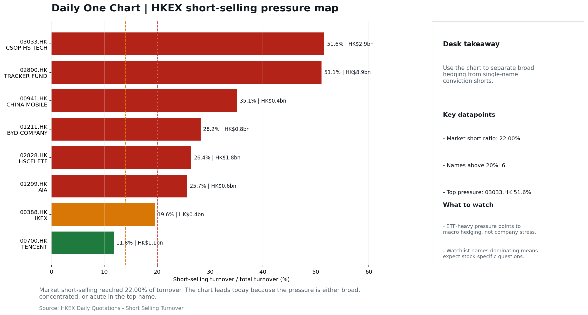

# Morning Research Workbench | 2026-09-02

> **Commute reading route:** `Layer 1 scan (5 min)` → `Layer 2 deep read` → `Layer 3 and appendix if time allows`
>
> Mode: `Trading Daily` | Keep the report execution-oriented: what mattered in the completed session, what can move Hong Kong leadership, and what needs fast follow-up.

_Data through: US/global `2026-09-01` | HK `2026-09-01` | A-share `2026-09-01` | Generated `2026-09-02 07:18:55`_

## Executive Summary

- **Did yesterday's call work?** NO CALL - The 2026-09-01 report published no directional call (neutral regime).
- **What changed overnight?** Semis led lower: SOXX -2.10%, NVDA -1.51%, TSMC -0.32%. HSI +0.00% and 3033.HK +0.22%.
- **What it means for AI/TMT** No decisive style winner - Broad beta, with no decisive style winner, a 0.05pp spread. Avoid forcing a growth-versus-value call; let volume, Southbound concentration, and the first-hour relative tape identify leadership.
- **What to watch today** Next scheduled catalyst: US Non-Farm Payrolls on 2026-09-04. Confirm if SMIC and Hua Hong open in the same direction as the overnight leg and hold it through the first hour; invalidate if they track HSCEI instead.

## Layer 1 | Scan (5 min)

### 1.1 Yesterday's Call
**Verdict: NO CALL.** The 2026-09-01 report published no directional call (neutral regime).

**Recent record.** 6 confirmed / 4 broken over the last 10 scoreable calls (60.0% hit rate). This is a directional close-to-close diagnostic, not a track record.

### 1.2 Opening Decision Board

**Global-to-Hong Kong signals**

_Decision-useful subset: each row states the implication and the next test. Descriptive secondary monitors are kept out of the five-minute scan._

| Signal | Last / move | Interpretation | Confirmation / invalidation |
| --- | --- | --- | --- |
| S&P 500 | 7,631.47 / -0.71% | Broad US risk fell without a clear driver in today's fields; treat it as beta, not a signal. | Watch whether Nasdaq and offshore-China proxies move the same way. |
| Nasdaq 100 | 29,077.22 / -1.29% | Growth lagged broad beta, warning that headline risk-on may not transmit cleanly to the 3033.HK ETF proxy. | 3033.HK versus HSI leadership carries the read; rising yields would undo it. |
| Hang Seng Index | 25,566.99 / +0.00% | The headline index was flat; style leadership and flow matter more than direction. | Southbound participation decides whether this is investable or just a print. |
| Hang Seng TECH ETF (3033.HK) | 4.5320 / +0.22% | Hong Kong growth led broad beta, improving the platform/internet style signal. | Needs a stable CNH and Southbound buying to become a duration signal. |
| Semiconductors (SOXX) | 500.31 / **-2.10%** | Semis underperformed the Nasdaq by 0.81pp, so this is a cycle move rather than broad growth weakness. | SMIC and Hua Hong at the open show whether it transmits to Hong Kong. |
| US 10Y | 4.7960% / +3.8bp | The yield proxy rose, tightening the discount-rate backdrop for long-duration Hong Kong growth. | Read it through 3033.HK relative performance, not the index level. |
| USD/CNH | 6.7165 / +0.05% | CNH was stable, removing an immediate FX impulse but not confirming equity direction. | FXI and Southbound flow decide whether this reaches Hong Kong equities. |
| VIX | 16.34 / **+9.52%** | Higher implied volatility raises the tail-risk premium and weakens risk-on conviction. | Falling volatility on narrowing breadth is a warning, not support. |

_Secondary monitors retained in the source bundle: SMIC (0981.HK), CSI 300, China 10Y, CN-US 10Y spread, DXY, USD/HKD, Brent crude, COMEX gold, Copper._

**Hong Kong local confirmation**

| Check | Value | Status | Source / as of | Why it matters |
| --- | --- | --- | --- | --- |
| Main Board turnover vs 20D | 0.94x \| -6% vs 20D | Live local | HKEX \| 2026-09-01 | Trailing 20-session average turnover was HK$253.1bn. |
| Southbound / Northbound net flow | Southbound Net HK$7.8bn \| turnover HK$92.0bn \| Northbound Turnover RMB273.3bn \| net not reported | Live local | HKEX Connect \| 2026-09-01 | Southbound net buy is calculated from HKEX disclosed buy and sell turnover. |
| Short-selling ratio | 22.00% | Live local | HKEX \| 2026-09-01 | Official HKEX stock-level short-selling table, aggregated as a share of total market turnover. |
| AH premium index | 26.27% | Live public | Yahoo \| 2026-09-01 | Fixed 10-name basket, equal-weighted, both legs priced on the same date; comparable across dates. Covered-pair average was +24.72% across 18 pairs. |
| USD/HKD spot vs band | 7.8389 \| band 7.7500 to 7.8500 | Live quote + local | Yahoo \| 2026-09-01 | Mid-band: 111 pips from the weak side and 889 pips from the strong side, so the peg is not an active constraint. Official Convertibility Undertakings define the linked-rate stress boundaries for USD/HKD. |
| HIBOR 1M | 2.86% | Live local | HKMA \| 2026-09-01 | 1M HIBOR is the cleanest quick read for Hong Kong funding conditions and equity-duration pressure. |
| Hong Kong leadership | Broad beta, with no decisive style winner | Proxy | HSI / HSCEI / 3033.HK ETF relative \| 2026-09-01 | Use HSI / HSCEI / 3033.HK ETF relative moves as the opening style read. |

**Risk state and evidence**

**Composite risk score:** `17.1/100` | **Regime:** `Risk-off`

| Component | Score impact | Evidence |
| --- | --- | --- |
| US beta | -4.3 | S&P 500 -0.71% |
| HK growth ETF proxy | +1.1 | 3033.HK ETF +0.22% |
| Semis complex | -9 | SOXX -2.10% |
| Offshore China proxy | -0.4 | FXI -0.08% |
| Dollar pressure | -2.3 | DXY +0.23% |
| Volatility | -10 | VIX +9.52% |
| HK short-selling | -8 | Short-selling ratio 22.00% |
| HK turnover | +0 | Turnover 0.94x 20D |

_Base 50 plus the component deltas above. Semis complex entered the score on 2026-08-22; earlier scores in the ledger exclude it._

**Morning Checklist**

1. **VIX +9.52%**
 High-frequency data | Higher volatility argues for tighter sizing and tighter stops. (second-order macro context)
2. **Risk-off backdrop with USD range-bound, rates were not the dominant driver, and Nasdaq 100 outperformed FXI**
 Overnight regime | Start by deciding whether the day is about Risk-off conditions or a style pivot.
3. **China NBS Manufacturing PMI (Past expected window (unverified))**
 Macro / policy | Growth direction, cyclicals, and manufacturing-chain pricing | Industries: Machinery, Building materials, Industrials
4. **China Caixin Manufacturing PMI (Past expected window (unverified))**
 Macro / policy | Growth direction, cyclicals, and manufacturing-chain pricing | Industries: Machinery, Building materials, Industrials

## Visual Dashboard

**Catalyst & Event Radar**

**Chart read:** No issuer/exchange-confirmed event date is populated; 3 reported or estimated timing item(s) and 10 undated trigger(s) remain explicit.

_Source: Public calendars, issuer disclosures and configured research watchlists_
## Layer 2 | Core Research (20-30 min)

### 2.1 Global-to-Hong Kong Transmission
**Market Setup**
**Core tape.** Overnight US action confirmed a risk-off regime into the 2 September Hong Kong session, with S&P 500 -0.71% and Nasdaq 100 -1.29% on 1 September US close.
**Main driver.** The cross-asset split was clean: VIX +9.52%, oil +5.90%, SOXX -2.10%, NVDA -1.51%, gold -2.48%, while the dollar was range-bound and US rates were not the dominant driver per the attribution read.
**HK relevance.** Prior-HK tape on 31 August was flat and balanced (HSI 0.00%, HSCEI +0.27%, 3033.HK +0.22%), with FXI -0.08% overnight, so the overseas move is a fresh bearish impulse rather than a confirmation of an existing HK downtrend.

**Key Drivers**
- Short-selling pressure: HKEX short-selling ratio 22.00% (93rd pct of last 60 sessions), flagged as the top attribution score at 4.9.
- Oil and geopolitics: WTI +5.90% splits the read between energy support and margin/headline pressure on cyclicals and insurers.
- US growth-style transmission: Nasdaq 100 -1.29% and SOXX -2.10% drag HK growth, internet and semis names into the open.
- Global equity beta: S&P 500 -0.71% with VIX +9.52% sets a risk-off backdrop.

**Hong Kong Read-Through**
**Opening implication.** For today's Hong Kong open (target_hk_session 2026-09-02), expect a softer tape led by SMIC (0981.HK), Hua Hong (1347.HK) and growth/internet names via 3033.HK, with HSCEI likely to lag if oil stays bid. Tighter sizing is warranted given 22.0% short-selling, VIX +9.52%, and SOXX -2.10%; any relief rally needs HSI breadth plus Southbound flow (last print +HK$7.8bn) to confirm before adding risk. Watch first-hour relative tape: a sustained 0.5pp split between 3033.HK and HSCEI with flow backing is the trigger to reclassify leadership. If the next Hong Kong session (2026-09-03) follows the Friday US NFP, position for continued two-way risk rather than a one-way beta call.
_Hong Kong style leadership and flow confirmation are set out in the Hong Kong review below._

**Watch Points**
- USD composite moved higher by +0.02pct intraday, with a 0.211pct range.
- Main turning points appeared around 2026-09-01 08:25 trough / 2026-09-01 08:45 peak / 2026-09-01 09:00 trough, suggesting event-driven repricing rather than a clean one-way USD move.
- The biggest cross-asset divergence was Nasdaq 100 versus FXI, a spread of 0.356pct.
- Gold moved -2.48pct intraday with a 2.746pct high-low range.

**Curated overnight stories**
1. **Fed Governor Barr says he will support a rate hike if inflation does not ease**
 Why it matters: Hawkish Fed commentary into the September meeting shifts the US rates path, which directly drives USD, US yields, and the global risk appetite that frames Hong Kong opens.
 HK read-through: Sets the backdrop for HK property, insurers, and high-beta growth; a firmer USD/yields bias is consistent with the flagged risk-off tape and FXI underperforming Nasdaq 100.
2. **Aon to acquire USI to build a 'premiere middle market' insurance brokerage platform**
 Why it matters: Large financial-sector M&A can reset sector valuations and signal capital-allocation appetite among US financials.
 HK read-through: Most relevant for HK-listed insurance and brokerage names via valuation read-across; second-order read for Chinese insurers on M&A premium benchmarking.
3. **Prediction market traders see August job creation rebounding**
 Why it matters: Positioning into Friday's NFP shapes rates, USD, and risk-asset tone; today's tape needs to be read against that binary risk.
 HK read-through: Pre-NFP positioning argues for range-bound HK opens with sensitivity to US tech and FXI; watch for any pre-print leak or desk color in US hours.
4. **China NBS and Caixin Manufacturing PMIs flagged past expected window (unverified)**
 Why it matters: Manufacturing PMIs are the cleanest read on China cyclicals and pricing power for industrials and materials, but the unverified status here limits reliability.
 HK read-through: Direct input for HK industrials, machinery, and building materials; however.
5. **Overnight risk-off backdrop: VIX +9.52%, USD range-bound, Nasdaq 100 outperforming FXI**
 Why it matters: Defines the regime for the 2 September session: volatility is up, rates are not the main driver, and the US-vs-China tape is split.
 HK read-through: Supports a defensive tilt within the Hang Seng and argues for tighter sizing; relative strength in US tech vs FXI limits upside for HK tech reopen plays.

**AI / TMT hand-off**

**Overnight leg.** The overnight semis leg was risk-off at -1.31% average (SOXX -2.10%, NVDA -1.51%, TSMC -0.32%).
**Hong Kong expression.** SMIC, Hua Hong and Sunny Optical are under the most pressure at the open, and 3033.HK should be tested before the Hang Seng Index.
**Observable test.** Confirm if SMIC and Hua Hong open in the same direction as the overnight leg and hold it through the first hour; invalidate if they track HSCEI instead, which would mean local flow is overriding the global cycle.

| Name | Role in the chain | 1D | Leg |
| --- | --- | --- | --- |
| SOXX | Semis complex | -2.10% | overnight |
| NVDA | AI capex narrative | -1.51% | overnight |
| TSMC | Foundry demand | -0.32% | overnight |
| SMIC | Leading-edge / domestic substitution | -2.69% | Hong Kong |
| Hua Hong | Mature-node pricing cycle | -1.71% | Hong Kong |
| Sunny Optical | Hardware and optics supply chain | +1.13% | Hong Kong |
| 3033.HK ETF | Broad HK tech beta | +0.22% | Hong Kong |

**Clock discipline.** The Hong Kong rows are the prior cash-session close and predate the US overnight leg. Use them as the inherited local setup only; validate transmission on today's Hong Kong open, first hour and close.

### 2.2 Hong Kong Local Tape and Flow
**Local Tape Setup**
**Local read.** Set up the 2 September Hong Kong session as a US-led risk-off tape into a flat prior-HK base, so leadership rather than index direction is the test.
**Verification point.** HSI was 0.00% on 31 August with HSCEI +0.27% and 3033.HK +0.22%.
**Risk to watch.** Funding is not the constraint (HIBOR 1M 2.86%, Aggregate Balance HK$54.2bn, USD/HKD mid-band) and Northbound net-buy is undisclosed, so the Southbound print (net +HK$7.8bn on HK$92.0bn turnover, 1 September) is the only clean flow cross-check.

**Style and Local Leadership**
**Style call.** Broad beta, with no decisive style winner.
- **Evidence:** 3033.HK and HSCEI were separated by only 0.05pp (+0.22% versus +0.27%)
- **Portfolio meaning:** Avoid forcing a growth-versus-value call; let volume, Southbound concentration, and the first-hour relative tape identify leadership.
- **Cross-market read:** Hang Seng +0.00% / HSCEI +0.27% / 3033.HK ETF +0.22%. Offshore China proxy FXI -0.08% and USD/CNH +0.05% frame cross-border risk appetite. USD/HKD last traded around 7.8389, which keeps the Hong Kong funding lens in focus.

**Flow Confirmation**
Official Stock Connect evidence is available; the Flow Tracker confirms whether local money supports the price action.

**Follow-Through Checklist**
**Follow-through check.** Confirmation test for the open: watch whether 3033.HK trades down >0.5pp versus HSCEI in the first hour on flow-backed volume, and whether SMIC/1347.HK hold the prior session's lows.
**Failure condition.** Reclassify the tape when either 3033.HK or HSCEI opens a sustained 0.5pp relative lead with flow confirmation.

**Cross-asset attribution**

| Driver | Direction | Score | Evidence | HK implication |
| --- | --- | --- | --- | --- |
| Short-selling pressure | drag | 4.9 | HKEX short-selling ratio was 22.00%. | Elevated short activity argues for extra confirmation before chasing rebounds. |
| Oil and geopolitics | mixed | 4.21 | Oil moved +5.26%. | Split the read between energy/cyclicals support and margin/geopolitical pressure. |
| US growth-style transmission | drag | 1.81 | Nasdaq 100 moved -1.29%. | Hong Kong growth and platform names should be tested first at the open. |
| Global equity beta | drag | 0.71 | S&P 500 moved -0.71%. | Broad beta matters if Hong Kong breadth confirms the overseas signal. |

**Local flow evidence**

**Flow Takeaways**
- Short-selling pressure is elevated, so local rebounds need cleaner breadth and flow confirmation.
- Stock Connect Southbound: net HK$7.8bn on turnover HK$92.0bn (as of 2026-09-01).
- Stock Connect Northbound: turnover RMB273.3bn; public file provides total turnover/top active names, not full net-buy.
- AH premium: fixed 10-name basket +26.27% (comparable across dates); covered-pair average +24.72% over 18 pairs; widest premium: China Communications Construction 94.69%.

**Stock Connect Southbound Active Names**

| # | Ticker | Name | Buy | Sell | Net buy | HKEX turnover rank |
| --- | --- | --- | --- | --- | --- | --- |
| 1 | 00700.HK | TENCENT | HK$2,586.5mn | HK$1,462.0mn | HK$1,124.5mn | 3 |
| 2 | 00100.HK | MINIMAX-W | HK$3,864.9mn | HK$3,102.3mn | HK$762.6mn | 1 |
| 3 | 03690.HK | MEITUAN-W | HK$251.6mn | HK$827.9mn | HK$-576.3mn | 5 |
| 4 | 02513.HK | Z.AI | HK$2,917.7mn | HK$3,328.6mn | HK$-411.0mn | 2 |
| 5 | 01024.HK | KUAISHOU-W | HK$1,391.1mn | HK$988.4mn | HK$402.8mn | 6 |

**AH Premium Dispersion**

| Name | A ticker | H ticker | Premium | As of |
| --- | --- | --- | --- | --- |
| China Communications Construction | 601800.SS | 1800.HK | +94.69% | 2026-09-01 |
| China Railway Construction | 601186.SS | 1186.HK | +59.27% | 2026-09-01 |
| China Life | 601628.SS | 2628.HK | +50.85% | 2026-09-01 |

**HKEX Short-Selling Watch**

| Ticker | Name | Short ratio | Short turnover | Total turnover |
| --- | --- | --- | --- | --- |
| 00388.HK | HKEX | 19.57% | HK$0.4bn | HK$2.2bn |
| 00700.HK | TENCENT | 11.79% | HK$1.1bn | HK$9.0bn |
| 00941.HK | CHINA MOBILE | 35.10% | HK$0.4bn | HK$1.0bn |

- **Short-value leaders:** 02800.HK TRACKER FUND (HK$8.9bn); 03033.HK CSOP HS TECH (HK$2.9bn); 02828.HK HSCEI ETF (HK$1.8bn); 09988.HK BABA-W (HK$1.7bn).

### 2.3 Macro Transmission
**Desk read.** Use the calendar table and released data below as the primary macro read.

**Macro watchpoints**
- Whether the unverified China NBS and Caixin Manufacturing PMI prints are officially released and how H-share cyclicals (machinery, building
- US Treasury yields and DXY into the HK open, since the next confirmed macro catalyst is US NFP on 2026-09-04 and the HKD/HIBOR setup is
- SMIC, Hua Hong and 3033.HK price action as the first HK test of the SOXX -2.10% and NVDA -1.51% tape, given their direct read-through flag.
- Whether the +5.90% WTI move is treated as geopolitical or demand-driven, before repositioning HK energy or shipping names.

| Time | Region | Event | Status | Desk read |
| --- | --- | --- | --- | --- |
| | CN | China NBS Manufacturing PMI | Past expected window (unverified) | Impact: Growth direction, cyclicals, and manufacturing-chain pricing \| Attention: 5/5 \| Industries: Machinery, Building materials, Industrials |
| | CN | China Caixin Manufacturing PMI | Past expected window (unverified) | Impact: Growth direction, cyclicals, and manufacturing-chain pricing \| Attention: 3/5 \| Industries: Machinery, Building materials, Industrials |
| | US | US Non-Farm Payrolls | Upcoming | Impact: Watch whether it changes the day's core market narrative \| Attention: 5/5 \| Industries: Market-wide |
| | CN | China Trade Balance | Upcoming | Impact: Watch whether it changes the day's core market narrative \| Attention: 3/5 \| Industries: Market-wide |

**Positioning and risk backdrop**

- Detailed local flow evidence is covered under Flow Tracker and Attribution; keep this section focused on options, hedging, and macro-positioning risk.

### 2.4 Company Micro Research and Catalysts

| Grade | Sector | Headline | Why it matters | Horizon |
| --- | --- | --- | --- | --- |
| A | Financials | Aon CEO says insurance broker seeks to build 'premiere middle market | Capital allocation or shareholder-return events can trigger a valuation | Medium-term trend |

**Company Event Takeaway**
**Desk read.** No Hong Kong-listed company beat or missed estimates overnight.
**Why it matters.** The overnight HKEXnews tape carried eight small-cap profit warnings (00333.HK, 01496.HK, 00875.HK, 01152.HK, 01255.HK, 01518.HK, 01561.HK, 08270.HK), all graded C with headline-only extracts, so magnitude is not parsed and no EPS impact should be inferred yet.
**Follow-up.** In the wider news flow, Aon's deal to buy USI is the only A-grade item, with read-through to Hong Kong Financials; the global tone is risk-off with USD range-bound and Nasdaq 100 outperforming FXI.

**LLM Quick Takes**
- **0700.HK** | Earnings date 2026-11-12 (71 days out). Estimate comparison unavailable; no immediate catalyst. Next check: revisit consensus when Q3 China gaming and ads data print.
- **9988.HK** | Fact: closed -3.33% at 110.40, mid-range (54% of 60-session band). Motley Fool piece flags collapsed profits/cash flow amid AI and commerce spend. Investor read…
- **3690.HK** | Earnings date 2026-11-26 (85 days out). Estimate comparison unavailable; no immediate catalyst. Next check: monitor local services and delivery unit economics into print.
- **0388.HK** | Fact: closed -2.91% at 405.60, top of 60-session range (80%). Earnings 2026-11-04. Investor read: price action at range high warrants a turnover/IPO-pipeline check before calling a trend…

Decision filter<h4>No immediate portfolio catalyst: 20 official filings were screened and the low-signal market set stays aggregated.</h4>
20 profit warnings

<strong>20</strong>Official filings

<strong>0</strong>Watchlist hits

<strong>0</strong>Actionable events

<strong>No event cleared the portfolio decision filter.</strong>

Broad-market filings remain traceable in the source appendix; they are not expanded here without a watchlist, estimate or liquidity read-through.

<strong>Coverage boundary.</strong> sell-side rating changes, IPO / grey-market monitor were not decision-grade in this run; their absence is not treated as confirmation that no event exists.

**Core coverage requiring follow-up**

**Core coverage**

| Name | Ticker | Last | 1D | Range position | Morning note |
| --- | --- | --- | --- | --- | --- |
| Alibaba | 9988.HK | 110.40 | -3.33% | Mid-range | Down 3.33% on the session, mid-range at 54% of its 60-session band. |
| HKEX | 0388.HK | 405.60 | -2.91% | Top of range | Down 2.91% on the session, in the top quartile of its 60-session range (80%). |

**Recent headlines for Alibaba:**
- [Alibaba Is Down 60% From Its All-Time High. Is This the Once-in-a-Decade Setup That Patient Investors Wait For?](https://www.fool.com/investing/2026/09/01/alibaba-is-down-60-from-its-all-time-high-is-this/) (Motley Fool)

**Priority follow-up**

| Name | Ticker | Last | 1D | Range position | Morning note |
| --- | --- | --- | --- | --- | --- |
| BYD Company | 1211.HK | 88.25 | +1.20% | Mid-range | Marginally higher (+1.20%), mid-range at 70% of its 60-session band. |
| AIA | 1299.HK | 75.95 | -0.39% | Mid-range | Marginally lower (-0.39%), mid-range at 61% of its 60-session band. |

**Recent headlines for BYD Company:**
- [BYD (SEHK:1211) Overseas Sales Take The Lead, Is The Discount Too Hard To Ignore?](https://finance.yahoo.com/markets/stocks/articles/byd-sehk-1211-overseas-sales-210833147.html) (Simply Wall St.)

### 2.5 Morning Meeting Questions
**Q1. Short selling was very high at 22.0% - who is positioned against this market?**
- **Evidence:** Short-selling ratio 22.0% (93rd pct of the last 60 sessions, very high).
- **How to answer:** Check the concentration before reading it as bearish: ETF-heavy short turnover is macro hedging, while single-name pressure is company-specific. The HKEX short-selling table in this report separates the two.

## Layer 3 | Session Playbook (8-12 min)

### 3.1 Base Case and Scenario Map
**Starting posture.** Broad beta, with no decisive style winner (medium confidence); composite risk `17.1/100` (Risk-off). Avoid forcing a growth-versus-value call; let volume, Southbound concentration, and the first-hour relative tape identify leadership.

**Scenario map**

| Scenario | Observable trigger | Interpretation | Research response |
| --- | --- | --- | --- |
| Selective growth confirms | 3033.HK keeps a >0.5pp first-hour lead over HSCEI; SMIC and Hua Hong stop lagging broad beta; CNH is stable. | The prior style split has live price confirmation, but is not yet broad China risk-on. | Prioritize internet/platform relative strength; verify participation again at the close. |
| Broad beta takes over | HSI and HSCEI rise together, breadth improves and the 3033.HK lead narrows without turning negative. | Leadership is broadening from a style trade into market beta. | Expand the research set from growth leaders to financials, SOEs and index-heavy names. |
| Risk-off continuation | 3033.HK loses its lead, semis underperform HSCEI and CNH depreciation accelerates. | The prior divergence was a temporary pocket of strength rather than a durable hand-off. | Treat rebounds as unconfirmed; focus on balance-sheet, catalyst and crowding risk. |

**Clocked validation scorecard**

| Window | Check | Prior evidence | Pass condition | What it decides |
| --- | --- | --- | --- | --- |
| 09:30-10:30 | 3033.HK vs HSCEI | -0.05pp at the prior close | 3033.HK retains >0.5pp relative lead | Whether growth leadership survives the open |
| 09:30-10:30 | Semiconductor hand-off | SMIC -2.69%; Hua Hong Semiconductor -1.71% | Stabilise after the open; at least one stops underperforming HSCEI | Whether overnight semis pressure is contained locally |
| 09:30-10:30 | HSI price zone | 25,567 vs 25,500 / 26,000 reference grid | Hold above the lower grid or reclaim the upper grid with breadth | Whether broad beta is stabilising; grid is derived, not technical analysis |
| 09:30-10:30 | USD/CNH | 6.7165 \| +0.05% | No acceleration in CNH depreciation | Whether FX permits a clean Hong Kong risk extension |
| At close | Turnover | 0.94x \| -6% vs 20D | At least 1.0x the 20-session average | Whether the move had normal participation |
| At close | Southbound | Net HK$7.8bn \| turnover HK$92.0bn | Net buying remains positive and broadens beyond one or two names | Whether mainland money confirms the price move |
| At close | Short pressure | 22.00% | Falls versus the prior verified reading (22.00%) | Whether rebound conviction improved |

**Upgrade rule.** Confirm a broad-beta session only if HSI breadth and turnover improve without a sharp 3033.HK-versus-HSCEI split.
**Kill switch.** Reclassify the tape when either 3033.HK or HSCEI opens a sustained 0.5pp relative lead with flow confirmation.
**Clock discipline.** At 07:30, same-day Southbound, turnover and short-selling outcomes are not known. Use the first-hour price/FX checks provisionally and make the final classification only after the close.
**Event clock.** No same-day decision-grade item is populated; the nearest reported/estimated item is US Non-Farm Payrolls on 2026-09-04. Verify the issuer or official calendar before relying on the date.

### 3.2 Daily One Chart
**Daily One Chart | HKEX short-selling pressure map**

**Chart read.** Market short-selling reached 22.00% of turnover.
**Why it matters.** The chart leads today because the pressure is either broad, concentrated, or acute in the top name.

_Source: HKEX Daily Quotations - Short Selling Turnover_

## Optional Appendix | Traceability and Performance (10-15 min)

### Report Metadata
> Date policy: Review date 2026-09-01 is treated as `Trading Daily`. | Global (US/Europe) data date is 2026-09-01; adapter effective date is 2026-09-01 and summary date is 2026-09-01. | Hong Kong local data date is 2026-09-01; role: same-session local cash tape.
> Market data quality: Coverage: `37/38` | Missing: `1`
> Report quality: `90.8/100` | Grade `B` | Status `manual review`

### Report Quality and Validation
- **Quality score:** 90.8/100 | **Grade:** B | **Status:** manual review
- **Run summary:** 8 healthy | 2 caveat | 0 failed
- **Release recommendation:** Manual review | Fact validation produced a release-blocking error; automatic distribution is blocked.

| Source | Status | Bucket |
| --- | --- | --- |
| Macro calendar | partial | caveat |
| Risk and sentiment feed | partial | caveat |

**Desk-use guidance summary:** 1 blocking | 0 advisory

**Desk-use guidance**
- **Blocking:** Fact validation has a release-blocking finding; review it before distribution.
- **Grade capped:** 1 prose defect(s) detected: 1 unbalanced_bracket.

**Quality warnings**
- Narrative fact-check guardrail produced warnings; review the validation table before relying on narrative sections.

**Narrative fact-check guardrail**
- Checked 41 numeric claims; 1 numeric mismatch(es), 0 logic warning(s); 13 structured claims, 0 source/text warning(s); 1 critical, 0 review.
- **Deterministic fallback fields:** macro_takeaway, tasks.macro_interpretation.paragraph, tasks.overnight_review.paragraph

| Severity | Field | Claim | Type | Claimed | Expected | Snippet |
| --- | --- | --- | --- | --- | --- | --- |
| critical | deep_read_setup | Gold | change_pct | -2.48 | -1.27 | VIX +9.52%, oil +5.90%, SOXX -2.10%, NVDA -1.51%, gold -2.48%, while the dollar was range-bound and US rates we |

_Full component weights, per-source freshness, adapter status and provenance records are archived with this report under `audit/` rather than printed here._

### Historical Signal Performance
- **Readiness:** exploratory with caveats | 69 observations | 91 active signal dates | next-close entry, 10bps cost, no same-day returns.
- **Interpretation boundary:** exploratory until a benchmark reaches 252 sessions and 100 active-signal sessions.
- **Data-quality caveat:** 23 conflicting price revision(s) and 6 non-session observation(s) remain in the research ledger.
- **Daily-use boundary:** cumulative return, Sharpe and the performance chart stay out of the daily commute edition until the sample and trading-calendar gates pass; use Yesterday's Call instead.

### Source Links
- [Aon CEO says insurance broker seeks to build 'premiere middle market platform' with purchase of rival USI](https://www.cnbc.com/2026/08/31/aon-ceo-says-usi-deal-seeks-to-build-premiere-middle-market-insurance-platform.html) (cnbc_markets)
- [Alibaba Is Down 60% From Its All-Time High. Is This the Once-in-a-Decade Setup That Patient Investors Wait For?](https://www.fool.com/investing/2026/09/01/alibaba-is-down-60-from-its-all-time-high-is-this/) (Motley Fool)
- [Meituan (MPNGF) (Q2 2026) Earnings Call Highlights: Record Revenue and Strategic AI Pivot Drive...](https://finance.yahoo.com/markets/stocks/articles/meituan-mpngf-q2-2026-earnings-190123345.html) (GuruFocus.com)
- [Meituan Returns to Profit as Food-Delivery Competition Eases](https://www.wsj.com/business/earnings/meituan-returns-to-profit-as-food-delivery-competition-eases-1026a0e9?siteid=yhoof2&yptr=yahoo) (The Wall Street Journal)
- [What Is Tencent Holdings (SEHK:700) Building With Its New AI Cloud And Gaming Tools?](https://finance.yahoo.com/technology/ai/articles/tencent-holdings-sehk-700-building-210705313.html) (Simply Wall St.)
- [Tencent's Enflame IPO Prices Its AI Dependency at 62 Times Sales](https://finance.yahoo.com/technology/ai/articles/tencents-enflame-ipo-prices-ai-180238163.html) (GuruFocus.com)
- [BYD (SEHK:1211) Overseas Sales Take The Lead, Is The Discount Too Hard To Ignore?](https://finance.yahoo.com/markets/stocks/articles/byd-sehk-1211-overseas-sales-210833147.html) (Simply Wall St.)
- [00333.HK Profit warning / alert announcement](http://www1.hkexnews.hk/listedco/listconews/sehk/2026/0831/2026083100934.pdf) (HKEXnews)
- [01496.HK Profit warning / alert announcement](http://www1.hkexnews.hk/listedco/listconews/sehk/2026/0831/2026083100716.pdf) (HKEXnews)
- [00875.HK Profit warning / alert announcement](http://www1.hkexnews.hk/listedco/listconews/sehk/2026/0828/2026082801978.pdf) (HKEXnews)
- [01152.HK Profit warning / alert announcement](http://www1.hkexnews.hk/listedco/listconews/sehk/2026/0828/2026082800863.pdf) (HKEXnews)
- [01255.HK Profit warning / alert announcement](http://www1.hkexnews.hk/listedco/listconews/sehk/2026/0828/2026082802456.pdf) (HKEXnews)
- [01518.HK Profit warning / alert announcement](http://www1.hkexnews.hk/listedco/listconews/sehk/2026/0828/2026082804114.pdf) (HKEXnews)
- [01561.HK Profit warning / alert announcement](http://www1.hkexnews.hk/listedco/listconews/sehk/2026/0828/2026082802706.pdf) (HKEXnews)
- [08270.HK Profit warning / alert announcement](http://www1.hkexnews.hk/listedco/listconews/gem/2026/0828/2026082800571.pdf) (HKEXnews)
