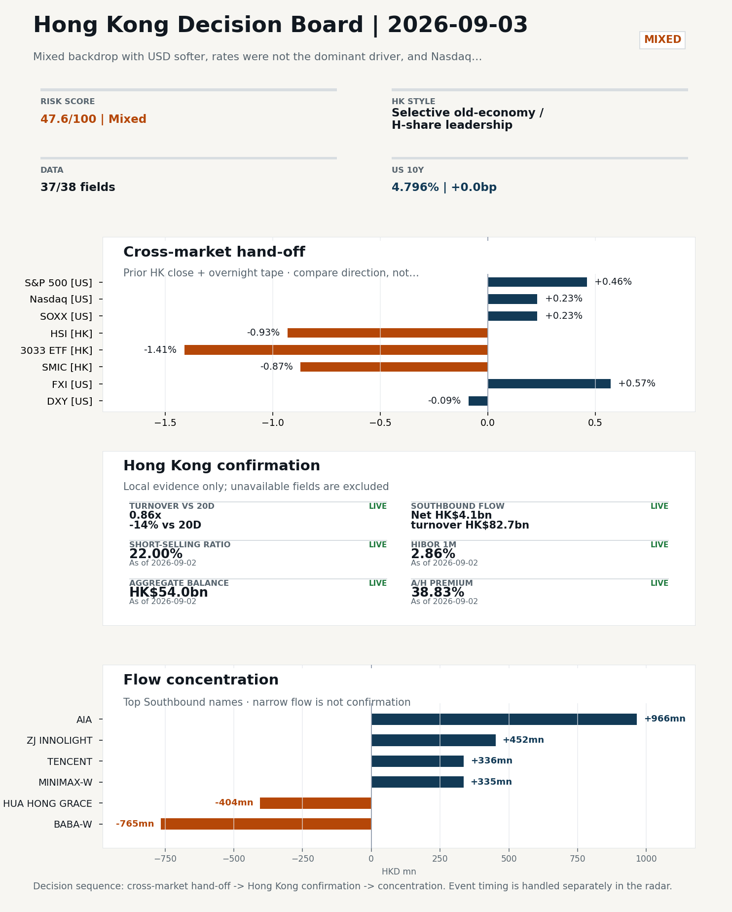
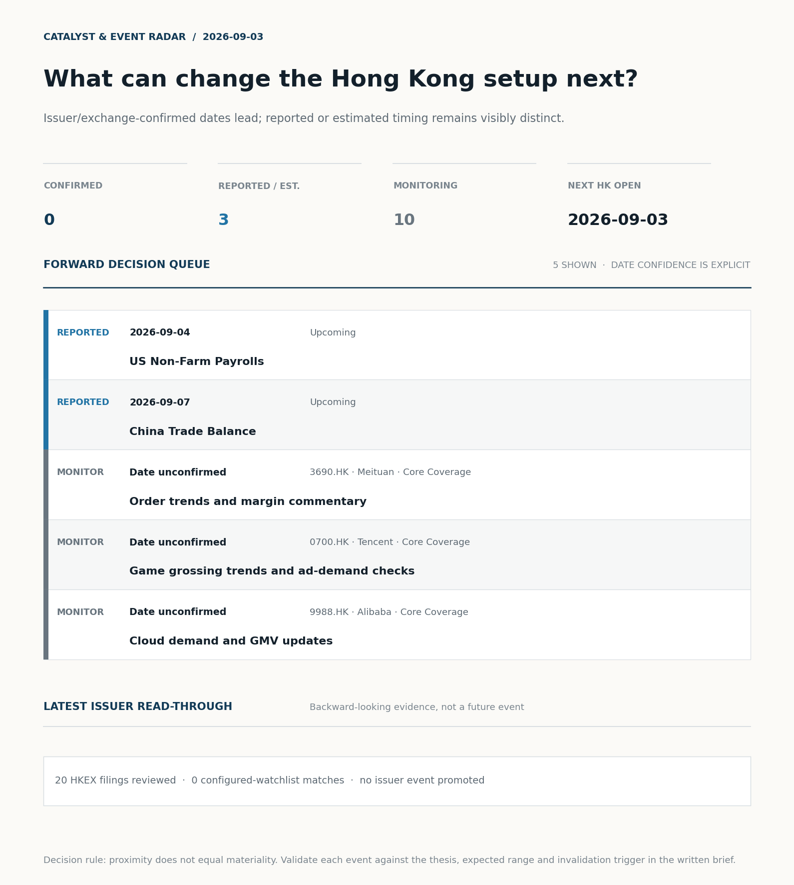
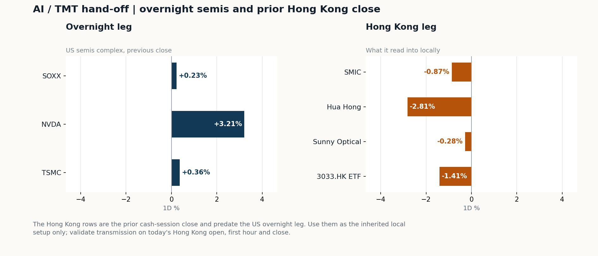
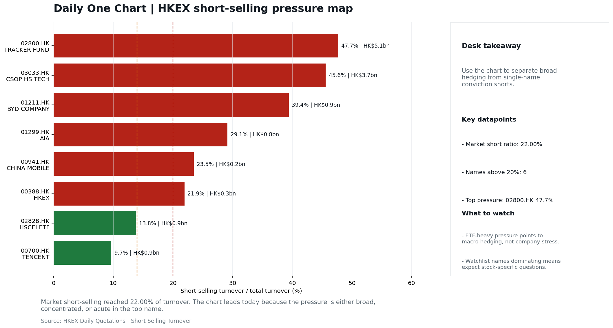

# Morning Research Workbench | 2026-09-03

> **Commute reading route:** `Layer 1 scan (5 min)` → `Layer 2 deep read` → `Layer 3 and appendix if time allows`
>
> Mode: `Trading Daily` | Keep the report execution-oriented: what mattered in the completed session, what can move Hong Kong leadership, and what needs fast follow-up.

_Data through: US/global `2026-09-02` | HK `2026-09-02` | A-share `2026-09-02` | Generated `2026-09-03 07:19:49`_

## Executive Summary

- **Did yesterday's call work?** NO CALL - The 2026-09-02 report published no directional call because release was blocked on quality.
- **What changed overnight?** Semis led higher: SOXX +0.23%, NVDA +3.21%, TSMC +0.36%. HSI -0.93% and 3033.HK -1.41%.
- **What it means for AI/TMT** Style, not beta - Selective old-economy / H-share leadership, a 0.82pp spread. Treat banks, energy, telecoms, and SOE yield as the cleaner relative expression; growth beta still needs proof.
- **What to watch today** Next scheduled catalyst: US Non-Farm Payrolls on 2026-09-04. Confirm if SMIC and Hua Hong open in the same direction as the overnight leg and hold it through the first hour; invalidate if they track HSCEI instead.

## Layer 1 | Scan (5 min)

### 1.1 Yesterday's Call
**Verdict: NO CALL.** The 2026-09-02 report published no directional call because release was blocked on quality.

**Recent record.** 6 confirmed / 4 broken over the last 10 scoreable calls (60.0% hit rate). This is a directional close-to-close diagnostic, not a track record.

### 1.2 Opening Decision Board

**Global-to-Hong Kong signals**

_Decision-useful subset: each row states the implication and the next test. Descriptive secondary monitors are kept out of the five-minute scan._

| Signal | Last / move | Interpretation | Confirmation / invalidation |
| --- | --- | --- | --- |
| S&P 500 | 7,666.60 / +0.46% | Broad US risk rose as volatility drained out of the tape, which sets the external floor Hong Kong opens against. Falling volatility confirms lower near-term stress. | Watch whether Nasdaq and offshore-China proxies move the same way. |
| Nasdaq 100 | 29,143.33 / +0.23% | Growth lagged broad beta, warning that headline risk-on may not transmit cleanly to the 3033.HK ETF proxy. | 3033.HK versus HSI leadership carries the read; rising yields would undo it. |
| Hang Seng Index | 25,329.73 / -0.93% | Broad beta fell with no single driver visible in today's fields. | Southbound participation decides whether this is investable or just a print. |
| Hang Seng TECH ETF (3033.HK) | 4.4680 / -1.41% | Hong Kong growth lagged, so broad-index strength is not yet a duration signal. | Needs a stable CNH and Southbound buying to become a duration signal. |
| Semiconductors (SOXX) | 501.44 / +0.23% | Semis moved with the Nasdaq, so the tape is broad rather than cycle-specific. | SMIC and Hua Hong at the open show whether it transmits to Hong Kong. |
| US 10Y | 4.7960% / +0.0bp | The yield proxy was stable and did not materially change the valuation backdrop. | Read it through 3033.HK relative performance, not the index level. |
| USD/CNH | 6.7125 / -0.08% | A stronger offshore renminbi supports the external-risk backdrop for Hong Kong equities. | FXI and Southbound flow decide whether this reaches Hong Kong equities. |
| VIX | 15.20 / **-6.98%** | Lower implied volatility reduces near-term stress, but is supportive only if equity breadth confirms. | Falling volatility on narrowing breadth is a warning, not support. |

_Secondary monitors retained in the source bundle: SMIC (0981.HK), CSI 300, China 10Y, CN-US 10Y spread, DXY, USD/HKD, Brent crude, COMEX gold, Copper._

**Hong Kong local confirmation**

| Check | Value | Status | Source / as of | Why it matters |
| --- | --- | --- | --- | --- |
| Main Board turnover vs 20D | 0.86x \| -14% vs 20D | Live local | HKEX \| 2026-09-02 | Trailing 20-session average turnover was HK$252.2bn. |
| Southbound / Northbound net flow | Southbound Net HK$4.1bn \| turnover HK$82.7bn \| Northbound Turnover RMB244.8bn \| net not reported | Live local | HKEX Connect \| 2026-09-02 | Southbound net buy is calculated from HKEX disclosed buy and sell turnover. |
| Short-selling ratio | 22.00% | Live local | HKEX \| 2026-09-02 | Official HKEX stock-level short-selling table, aggregated as a share of total market turnover. |
| AH premium index | 38.83% | Live public | Yahoo \| 2026-09-02 | Equal-weighted average across 14 A/H pairs that resolved today. Composition varies by day, so the level is not comparable with prior reports (fixed basket incomplete [trimmed] |
| USD/HKD spot vs band | 7.8407 \| band 7.7500 to 7.8500 | Live quote + local | Yahoo \| 2026-09-02 | Mid-band: 93 pips from the weak side and 907 pips from the strong side, so the peg is not an active constraint. Official Convertibility Undertakings define the linked-rate stress boundaries for USD/HKD. |
| HIBOR 1M | 2.86% | Live local | HKMA \| 2026-09-02 | 1M HIBOR is the cleanest quick read for Hong Kong funding conditions and equity-duration pressure. |
| Hong Kong leadership | Selective old-economy / H-share leadership | Proxy | HSI / HSCEI / 3033.HK ETF relative \| 2026-09-02 | Use HSI / HSCEI / 3033.HK ETF relative moves as the opening style read. |

**Risk state and evidence**

**Composite risk score:** `47.6/100` | **Regime:** `Mixed`

| Component | Score impact | Evidence |
| --- | --- | --- |
| US beta | +2.8 | S&P 500 +0.46% |
| HK growth ETF proxy | -7.0 | 3033.HK ETF -1.41% |
| Semis complex | +1.2 | SOXX +0.23% |
| Offshore China proxy | +2.8 | FXI +0.57% |
| Dollar pressure | +0.9 | DXY -0.09% |
| Volatility | +10 | VIX -6.98% |
| HK short-selling | -8 | Short-selling ratio 22.00% |
| HK turnover | -5 | Turnover 0.86x 20D |

_Base 50 plus the component deltas above. Semis complex entered the score on 2026-08-22; earlier scores in the ledger exclude it._

**Morning Checklist**

1. **Mixed backdrop with USD softer, rates were not the dominant driver, and Nasdaq 100 outperformed FXI**
 Overnight regime | Start by deciding whether the day is about Mixed conditions or a style pivot.
2. **China NBS Manufacturing PMI (Past expected window (unverified))**
 Macro / policy | Growth direction, cyclicals, and manufacturing-chain pricing | Industries: Machinery, Building materials, Industrials
3. **China Caixin Manufacturing PMI (Past expected window (unverified))**
 Macro / policy | Growth direction, cyclicals, and manufacturing-chain pricing | Industries: Machinery, Building materials, Industrials
4. **US Non-Farm Payrolls (Upcoming)**
 Macro / policy | Watch whether it changes the day's core market narrative | Industries: Market-wide

## Visual Dashboard

**Catalyst & Event Radar**

**Chart read:** No issuer/exchange-confirmed event date is populated; 3 reported or estimated timing item(s) and 10 undated trigger(s) remain explicit.

_Source: Public calendars, issuer disclosures and configured research watchlists_
## Layer 2 | Core Research (20-30 min)

### 2.1 Global-to-Hong Kong Transmission
**Market Setup**
**Core tape.** Prior-HK session (2 Sep) closed with the HSI -0.93% and HSCEI -0.59%, while the 3033.HK TECH proxy fell -1.41%.
**Main driver.** The split signals that yesterday's Hong Kong drawdown was locally driven rather than a global risk-off impulse.
**HK relevance.** Today's open (3 Sep) needs to test whether offshore China leadership confirms or whether HSCEI old-economy leadership persists with cleaner breadth.

**Key Drivers**
- HK short-selling ratio at 22.00% (92nd pct of last 60 sessions) and turnover at 0.86x 20-day average confirm prior-HK weakness was supply-heavy and thin-liquidity rather than macro-driven.
- Offshore China proxy FXI +0.57% alongside a softer USD (-0.20% intraday) and USD/CNH -0.08% argues against a broad China risk-off read.
- AI capex narrative re-energised: NVDA +3.21% post HPE AI-server beat, SOXX +0.23%, TSMC ADR +0.36%, supporting HK AI supply-chain read-across but not enough to lift HK names in the prior session.
- Fed messaging split (Williams benign, Barr/Warsh hawkish) caps duration rally, limiting the USD-weakness tailwind for HK property and rate-sensitive yield names.

**Hong Kong Read-Through**
**Opening implication.** For the 3 Sep open, watch whether HSCEI extends its leadership over 3033.HK with turnover above 0.86x 20D and short-selling ratio easing from 22.00%.
_Hong Kong style leadership and flow confirmation are set out in the Hong Kong review below._

**Watch Points**
- USD composite moved lower by -0.20pct intraday, with a 0.392pct range.
- Main turning points appeared around 2026-09-02 08:10 peak / 2026-09-02 08:35 peak / 2026-09-02 09:05 peak, suggesting event-driven repricing rather than a clean one-way USD move.
- The biggest cross-asset divergence was Nasdaq 100 versus FXI, a spread of 0.385pct.
- Gold moved +1.85pct intraday with a 2.062pct high-low range.

**Curated overnight stories**
1. ****
 Why it matters: Defines the cross-asset backdrop for the 3 September HK open: weaker USD is a tailwind for HK property and offshore CNH assets.
 HK read-through: Supports HK property, insurers, and CNH-sensitive names; headwind for relative-performance trades that assume China internet catch-up. Watch HSCEI vs. NDX spread at the open.
2. **HPE follows Dell with an AI-server earnings beat, with an analyst noting better profit**
 Why it matters: Reinforces that AI server demand is broadening beyond hyperscalers into enterprise and sovereign buyers.
 HK read-through: Read-across to HK AI hardware / supply chain (foundry, HBM-adjacent packaging, power-cooling, EMS).
3. **Fed messaging split: Williams attributes the yield surge to strong economic prospects**
 Why it matters: Hawkish-dovish split at the Fed keeps the front end from rallying.
 HK read-through: Caps upside in HK property and high-dividend utilities; reinforces a barbell of growth (AI-linked) versus yield rather than a broad beta lift.
4. **Aon to acquire USI to build a 'premiere middle-market platform'**
 Why it matters: A material insurance brokerage consolidation in the US can reset valuation comps and prompt capital-return reactions across the global insurance and brokerage complex.
 HK read-through: Most relevant for HK-listed insurance leaders and brokers; secondary read-across to Aon-related HK distribution partners. Low direct China link.
5. **China NBS and Caixin Manufacturing PMI prints for August (expected window**
 Why it matters: These are the single most important data points for HK cyclicals today; the direction will set the tape for industrials, materials, and machinery at the 3 September open.
 HK read-through: Stronger prints support machinery, building materials, and industrials; weaker prints extend the defensive / AI-barbell stance. Note: we do not have verified actual values.

**AI / TMT hand-off**

**Overnight leg.** The overnight semis leg was risk-on at +1.27% average (SOXX +0.23%, NVDA +3.21%, TSMC +0.36%).
**Hong Kong expression.** SMIC, Hua Hong and Sunny Optical are best placed at the open, and 3033.HK should be tested before the Hang Seng Index.
**Observable test.** Confirm if SMIC and Hua Hong open in the same direction as the overnight leg and hold it through the first hour; invalidate if they track HSCEI instead, which would mean local flow is overriding the global cycle.

| Name | Role in the chain | 1D | Leg |
| --- | --- | --- | --- |
| SOXX | Semis complex | +0.23% | overnight |
| NVDA | AI capex narrative | +3.21% | overnight |
| TSMC | Foundry demand | +0.36% | overnight |
| SMIC | Leading-edge / domestic substitution | -0.87% | Hong Kong |
| Hua Hong | Mature-node pricing cycle | -2.81% | Hong Kong |
| Sunny Optical | Hardware and optics supply chain | -0.28% | Hong Kong |
| 3033.HK ETF | Broad HK tech beta | -1.41% | Hong Kong |

**Clock discipline.** The Hong Kong rows are the prior cash-session close and predate the US overnight leg. Use them as the inherited local setup only; validate transmission on today's Hong Kong open, first hour and close.

### 2.2 Hong Kong Local Tape and Flow
**Local Tape Setup**
**Local read.** Prior-HK (2 Sep) was locally weak: HSI -0.93%, HSCEI -0.59%, 3033.HK TECH proxy -1.41% on 0.86x 20D turnover, with the 22.00% short-selling ratio flagging supply-heavy, thin-liquidation conditions rather than macro risk-off.
**Verification point.** Overnight-US ran counter-direction (S&P 500 +0.46%, Nasdaq 100 +0.23%, FXI +0.57%, DXY -0.09%), and Southbound net buy of HK$4.1bn on HK$82.7bn turnover shows onshore bid stayed selective into internet/AI names.
**Risk to watch.** The split sets up a confirmation test: whether HSCEI can hold its relative lead over 3033.HK with cleaner breadth and easing short activity, or whether offshore-China leadership from FXI pulls HK growth back.

**Style and Local Leadership**
**Style call.** Selective old-economy / H-share leadership.
- **Evidence:** HSCEI beat 3033.HK by 0.82pp (-0.59% versus -1.41%)
- **Portfolio meaning:** Treat banks, energy, telecoms, and SOE yield as the cleaner relative expression; growth beta still needs proof.
- **Cross-market read:** Hang Seng -0.93% / HSCEI -0.59% / 3033.HK ETF -1.41%. Offshore China proxy FXI +0.57% and USD/CNH -0.08% frame cross-border risk appetite. USD/HKD last traded around 7.8407, which keeps the Hong Kong funding lens in focus.

**Flow Confirmation**
Official Stock Connect evidence is available; the Flow Tracker confirms whether local money supports the price action.

**Follow-Through Checklist**
**Follow-through check.** Watch (1) whether 3033.HK TECH proxy closes gap toward FXI's +0.57% overnight or lags further.
**Failure condition.** Invalidate if 3033.HK retakes leadership while CNH firms and local participation broadens.

**Cross-asset attribution**

| Driver | Direction | Score | Evidence | HK implication |
| --- | --- | --- | --- | --- |
| Short-selling pressure | drag | 4.9 | HKEX short-selling ratio was 22.00%. | Elevated short activity argues for extra confirmation before chasing rebounds. |
| Hong Kong participation | drag | 1.41 | Main Board turnover was 0.86x the 20-session average. | Thin turnover makes index moves easier to fade. |

**Local flow evidence**

**Flow Takeaways**
- Short-selling pressure is elevated, so local rebounds need cleaner breadth and flow confirmation.
- Stock Connect Southbound: net HK$4.1bn on turnover HK$82.7bn (as of 2026-09-02).
- Stock Connect Northbound: turnover RMB244.8bn; public file provides total turnover/top active names, not full net-buy.
- AH premium: covered-pair average +38.83% over 14 pairs. Composition varies by day, so this level is not comparable with prior reports; widest premium: Bank of China 116.57%.

**Stock Connect Southbound Active Names**

| # | Ticker | Name | Buy | Sell | Net buy | HKEX turnover rank |
| --- | --- | --- | --- | --- | --- | --- |
| 1 | 01299.HK | AIA | HK$993.6mn | HK$27.8mn | HK$965.8mn | 9 |
| 2 | 09988.HK | BABA-W | HK$912.9mn | HK$1,677.8mn | HK$-764.9mn | 2 |
| 3 | 03308.HK | ZJ INNOLIGHT | HK$666.8mn | HK$214.9mn | HK$451.9mn | 10 |
| 4 | 01347.HK | HUA HONG GRACE | HK$126.5mn | HK$530.7mn | HK$-404.2mn | 8 |
| 5 | 00700.HK | TENCENT | HK$3,018.2mn | HK$2,681.7mn | HK$336.5mn | 1 |

**AH Premium Dispersion**

| Name | A ticker | H ticker | Premium | As of |
| --- | --- | --- | --- | --- |
| Bank of China | 601988.SS | 3988.HK | +116.57% | 2026-09-02 |
| China Communications Construction | 601800.SS | 1800.HK | +93.53% | 2026-09-02 |
| China Railway | 601390.SS | 0390.HK | +51.24% | 2026-09-02 |

**HKEX Short-Selling Watch**

| Ticker | Name | Short ratio | Short turnover | Total turnover |
| --- | --- | --- | --- | --- |
| 00388.HK | HKEX | 21.93% | HK$0.3bn | HK$1.5bn |
| 00700.HK | TENCENT | 9.68% | HK$0.9bn | HK$9.3bn |
| 00941.HK | CHINA MOBILE | 23.49% | HK$0.2bn | HK$0.7bn |

- **Short-value leaders:** 02800.HK TRACKER FUND (HK$5.1bn); 03033.HK CSOP HS TECH (HK$3.7bn); 09988.HK BABA-W (HK$2.1bn); 07709.HK XL2CSOPHYNIX (HK$1.9bn).

### 2.3 Macro Transmission
**Desk read.** Use the calendar table and released data below as the primary macro read.

**Macro watchpoints**
- Verify the official NBS and Caixin August Manufacturing PMI prints and reaction before drawing any cyclical H-share conclusion.
- Track US yields and DXY tonight into payrolls; a softer USD that persists into the HK open would reinforce the Nasdaq-versus-FXI leadership gap
- Monitor whether the AI capex theme (NVDA +3.21%, TSMC ADR +0.36%) holds into the 2026-09-03 HK session as the primary support for HK tech
- Watch HIBOR and any HKMA balance-sheet signals post-payrolls for the duration read in HK equities.

| Time | Region | Event | Status | Desk read |
| --- | --- | --- | --- | --- |
| | CN | China NBS Manufacturing PMI | Past expected window (unverified) | Impact: Growth direction, cyclicals, and manufacturing-chain pricing \| Attention: 5/5 \| Industries: Machinery, Building materials, Industrials |
| | CN | China Caixin Manufacturing PMI | Past expected window (unverified) | Impact: Growth direction, cyclicals, and manufacturing-chain pricing \| Attention: 3/5 \| Industries: Machinery, Building materials, Industrials |
| | US | US Non-Farm Payrolls | Upcoming | Impact: Watch whether it changes the day's core market narrative \| Attention: 5/5 \| Industries: Market-wide |
| | CN | China Trade Balance | Upcoming | Impact: Watch whether it changes the day's core market narrative \| Attention: 3/5 \| Industries: Market-wide |

**Positioning and risk backdrop**

- Detailed local flow evidence is covered under Flow Tracker and Attribution; keep this section focused on options, hedging, and macro-positioning risk.

### 2.4 Company Micro Research and Catalysts

| Grade | Sector | Headline | Why it matters | Horizon |
| --- | --- | --- | --- | --- |
| A | Financials | Aon CEO says insurance broker seeks to build 'premiere middle market | Capital allocation or shareholder-return events can trigger a valuation | Medium-term trend |
| A | Semiconductors and AI | HPE follows in Dell's footsteps as it rides the AI server boom to a | This can directly reshape earnings forecasts and the valuation framework | Short-term catalyst |

**Company Event Takeaway**
**Desk read.** Session close on 2 Sep was thin on company-specific catalysts, with the more relevant signal coming from US peers.
**Why it matters.** HPE's reported AI-server beat (above Dell on customer mix, per cited analyst read) is the most estimate-relevant item for the Hong Kong tape.
**Follow-up.** Aon's USI deal is a capital-allocation story that should be mapped into the Hong Kong insurance complex via AIA (1299.HK).

**LLM Quick Takes**
- **3690.HK** | Core coverage. Closed +2.74% at 78.75, mid-range at 49% of 60-session band. Two attached Q2-result headlines (revenue ~RMB104.6bn, core local commerce back to profit, Keeta progress)…
- **1211.HK** | Priority follow-up. Closed -3.40% at 85.25, mid-range at 57%. No headline provided, so the move is unexplained by the supplied facts. Next check…
- **1299.HK** | Priority follow-up. Closed +0.07% at 76.00, mid-range at 61%. No direct catalyst in the supplied data; Aon/USI news is a US M&A signal that maps indirectly into the insurance complex via…
- **0700.HK** | Core coverage. Closed -0.72% at 438.2, mid-range at 33%. No headline attached and no earnings until 12 Nov per calendar, so the session move is marginal and should not be read as a…

Decision filter<h4>No immediate portfolio catalyst: 20 official filings were screened and the low-signal market set stays aggregated.</h4>
20 profit warnings

<strong>20</strong>Official filings

<strong>0</strong>Watchlist hits

<strong>0</strong>Actionable events

<strong>No event cleared the portfolio decision filter.</strong>

Broad-market filings remain traceable in the source appendix; they are not expanded here without a watchlist, estimate or liquidity read-through.

<strong>Coverage boundary.</strong> sell-side rating changes, IPO / grey-market monitor were not decision-grade in this run; their absence is not treated as confirmation that no event exists.

**Core coverage requiring follow-up**

**Core coverage**

| Name | Ticker | Last | 1D | Range position | Morning note |
| --- | --- | --- | --- | --- | --- |
| Meituan | 3690.HK | 78.75 | +2.74% | Mid-range | Up 2.74% on the session, mid-range at 49% of its 60-session band. |
| Tencent | 0700.HK | 438.20 | -0.72% | Mid-range | Marginally lower (-0.72%), mid-range at 33% of its 60-session band. |

**Recent headlines for Meituan:**
- [Meituan (MPNGF) (Q2 2026) Earnings Call Highlights: Record Revenue and Strategic AI Pivot Drive...](https://finance.yahoo.com/markets/stocks/articles/meituan-mpngf-q2-2026-earnings-190123345.html) (GuruFocus.com)

**Priority follow-up**

| Name | Ticker | Last | 1D | Range position | Morning note |
| --- | --- | --- | --- | --- | --- |
| BYD Company | 1211.HK | 85.25 | -3.40% | Mid-range | Down 3.40% on the session, mid-range at 57% of its 60-session band. |
| AIA | 1299.HK | 76.00 | +0.07% | Mid-range | Marginally higher (+0.07%), mid-range at 61% of its 60-session band. |

### 2.5 Morning Meeting Questions
**Q1. The index fell but Southbound bought - is the move real?**
- **Evidence:** HSI -0.93% against Southbound net +4.1bn HKD.
- **How to answer:** Treat it as unconfirmed. Price and mainland flow disagreed, so the price move was not driven by Southbound participation; it needs another session of confirmation before being read as a trend.

**Q2. Short selling was very high at 22.0% - who is positioned against this market?**
- **Evidence:** Short-selling ratio 22.0% (92nd pct of the last 60 sessions, very high).
- **How to answer:** Check the concentration before reading it as bearish: ETF-heavy short turnover is macro hedging, while single-name pressure is company-specific. The HKEX short-selling table in this report separates the two.

## Layer 3 | Session Playbook (8-12 min)

### 3.1 Base Case and Scenario Map
**Starting posture.** Selective old-economy / H-share leadership (medium confidence); composite risk `47.6/100` (Mixed). Treat banks, energy, telecoms, and SOE yield as the cleaner relative expression; growth beta still needs proof.

**Scenario map**

| Scenario | Observable trigger | Interpretation | Research response |
| --- | --- | --- | --- |
| Selective growth confirms | 3033.HK keeps a >0.5pp first-hour lead over HSCEI; SMIC and Hua Hong stop lagging broad beta; CNH is stable. | The prior style split has live price confirmation, but is not yet broad China risk-on. | Prioritize internet/platform relative strength; verify participation again at the close. |
| Broad beta takes over | HSI and HSCEI rise together, breadth improves and the 3033.HK lead narrows without turning negative. | Leadership is broadening from a style trade into market beta. | Expand the research set from growth leaders to financials, SOEs and index-heavy names. |
| Risk-off continuation | 3033.HK loses its lead, semis underperform HSCEI and CNH depreciation accelerates. | The prior divergence was a temporary pocket of strength rather than a durable hand-off. | Treat rebounds as unconfirmed; focus on balance-sheet, catalyst and crowding risk. |

**Clocked validation scorecard**

| Window | Check | Prior evidence | Pass condition | What it decides |
| --- | --- | --- | --- | --- |
| 09:30-10:30 | 3033.HK vs HSCEI | -0.82pp at the prior close | 3033.HK retains >0.5pp relative lead | Whether growth leadership survives the open |
| 09:30-10:30 | Semiconductor hand-off | SMIC -0.87%; Hua Hong Semiconductor -2.81% | Stabilise after the open; at least one stops underperforming HSCEI | Whether overnight semis pressure is contained locally |
| 09:30-10:30 | HSI price zone | 25,330 vs 25,000 / 25,500 reference grid | Hold above the lower grid or reclaim the upper grid with breadth | Whether broad beta is stabilising; grid is derived, not technical analysis |
| 09:30-10:30 | USD/CNH | 6.7125 \| -0.08% | No acceleration in CNH depreciation | Whether FX permits a clean Hong Kong risk extension |
| At close | Turnover | 0.86x \| -14% vs 20D | At least 1.0x the 20-session average | Whether the move had normal participation |
| At close | Southbound | Net HK$4.1bn \| turnover HK$82.7bn | Net buying remains positive and broadens beyond one or two names | Whether mainland money confirms the price move |
| At close | Short pressure | 22.00% | Falls versus the prior verified reading (22.00%) | Whether rebound conviction improved |

**Upgrade rule.** Confirm if HSCEI keeps outperforming 3033.HK with healthy turnover and broad Southbound participation.
**Kill switch.** Invalidate if 3033.HK retakes leadership while CNH firms and local participation broadens.
**Clock discipline.** At 07:30, same-day Southbound, turnover and short-selling outcomes are not known. Use the first-hour price/FX checks provisionally and make the final classification only after the close.
**Event clock.** No same-day decision-grade item is populated; the nearest reported/estimated item is US Non-Farm Payrolls on 2026-09-04. Verify the issuer or official calendar before relying on the date.

### 3.2 Conditional Theme Deep Dive

| Field | Read |
| --- | --- |
| Theme | China Exports and Supply-Chain Relocation |
| Angle for the day | Track tariffs, trade policy, shipping, and manufacturing orders to see whether export resilience is still the cleaner China macro expression. |

**Theme desk read**
**Core thesis.** The weekly China Exports and Supply-Chain Relocation angle remains the cleaner expression of mainland macro right now, and the overnight tape is consistent with that framing rather than contradicting it.
**Evidence.** The USD softer, non-rates-driven backdrop, with Nasdaq 100 outperforming FXI, argues that leadership is coming from the AI capex complex rather than from a broad China re-rating.
**What to test.** Within the supplied signals, NVDA +3.21% is the strongest cross-border read-through and should bias HK tech sentiment into the 2026-09-03 session.

**Signals to keep in mind**
- VIX -6.98%: Lower volatility signals easing stress in the tape.
- NVDA +3.21%: The AI capex narrative supports; expect it to reach HK through sentiment before earnings.

**LLM watch items:**
- Verify whether 1211.HK's -3.40% session move ties to a specific export, tariff, or pricing headline before treating mid-range levels as a setup
- Track the 2026-09-04 US Non-Farm Payrolls print for any reset to the USD-soft / non-rates narrative, since HK exposure is indirect via Fed path and
- Use the 2026-09-07 China Trade Balance release as the next clean test of the export-resilience thesis
- Confirm the 2026-08-31 NBS and 2026-09-01 Caixin Manufacturing PMI prints from official sources, as both are flagged past expected window and

**Related names to keep close:**

| Name | Ticker | Bucket | Morning read |
| --- | --- | --- | --- |
| BYD Company | 1211.HK | Priority follow-up | Down 3.40% on the session, mid-range at 57% of its 60-session band. |
| China Mobile | 0941.HK | Priority follow-up | Unchanged on the session, mid-range at 72% of its 60-session band. |

**Upcoming catalysts tied to the theme:**
- 2026-09-07 | China Trade Balance | Watch whether it changes the day's core market narrative

### 3.3 Daily One Chart
**Daily One Chart | HKEX short-selling pressure map**

**Chart read.** Market short-selling reached 22.00% of turnover.
**Why it matters.** The chart leads today because the pressure is either broad, concentrated, or acute in the top name.

_Source: HKEX Daily Quotations - Short Selling Turnover_

## Optional Appendix | Traceability and Performance (10-15 min)

### Report Metadata
> Date policy: Review date 2026-09-02 is treated as `Trading Daily`. | Global (US/Europe) data date is 2026-09-02; adapter effective date is 2026-09-02 and summary date is 2026-09-02. | Hong Kong local data date is 2026-09-02; role: same-session local cash tape.
> Market data quality: Coverage: `37/38` | Missing: `1`
> Report quality: `92.6/100` | Grade `B` | Status `usable with caveats`

### Report Quality and Validation
- **Quality score:** 92.6/100 | **Grade:** B | **Status:** usable with caveats
- **Run summary:** 8 healthy | 2 caveat | 0 failed
- **Release recommendation:** Send with caveats | The report is usable, but the advisory guidance should travel with it so readers understand the data gaps.

| Source | Status | Bucket |
| --- | --- | --- |
| Macro calendar | partial | caveat |
| Risk and sentiment feed | partial | caveat |

**Desk-use guidance summary:** 0 blocking | 1 advisory

**Desk-use guidance**
- **Advisory:** Questionable narrative fields were removed; use the deterministic fallback copy and review the audit trail.
- **Grade capped:** 3 prose defect(s) detected: 3 unbalanced_bracket.

| Weak component | Score | Read |
| --- | --- | --- |
| Report prose | 40.0 | 3 prose defect(s) detected: 3 unbalanced_bracket. |

**Quality warnings**
- Report prose is weak: 3 prose defect(s) detected: 3 unbalanced_bracket.
- Narrative fact-check guardrail produced warnings; review the validation table before relying on narrative sections.

**Narrative fact-check guardrail**
- Checked 35 numeric claims; 0 numeric mismatch(es), 0 logic warning(s); 13 structured claims, 0 source/text warning(s); 0 critical, 0 review. Replaced 6 unsafe narrative field(s) with deterministic fallback copy.
- **Deterministic fallback fields:** macro_takeaway, news_summary, selected_news[0].headline, tasks.macro_interpretation.paragraph, tasks.news_selection.selected_news[0].headline, tasks.news_selection.summary

_Full component weights, per-source freshness, adapter status and provenance records are archived with this report under `audit/` rather than printed here._

### Historical Signal Performance
- **Readiness:** exploratory with caveats | 69 observations | 92 active signal dates | next-close entry, 10bps cost, no same-day returns.
- **Interpretation boundary:** exploratory until a benchmark reaches 252 sessions and 100 active-signal sessions.
- **Data-quality caveat:** 23 conflicting price revision(s) and 6 non-session observation(s) remain in the research ledger.
- **Daily-use boundary:** cumulative return, Sharpe and the performance chart stay out of the daily commute edition until the sample and trading-calendar gates pass; use Yesterday's Call instead.

### Source Links
- [Aon CEO says insurance broker seeks to build 'premiere middle market platform' with purchase of rival USI](https://www.cnbc.com/2026/08/31/aon-ceo-says-usi-deal-seeks-to-build-premiere-middle-market-insurance-platform.html) (cnbc_markets)
- [HPE follows in Dell's footsteps as it rides the AI server boom to a big earnings beat](https://www.marketwatch.com/story/hpe-follows-in-dells-footsteps-as-it-rides-the-ai-server-boom-to-a-big-earnings-beat-ec46eaea?mod=mw_rss_topstories) (wsj_markets)
- [Meituan (MPNGF) (Q2 2026) Earnings Call Highlights: Record Revenue and Strategic AI Pivot Drive...](https://finance.yahoo.com/markets/stocks/articles/meituan-mpngf-q2-2026-earnings-190123345.html) (GuruFocus.com)
- [Meituan Returns to Profit as Food-Delivery Competition Eases](https://www.wsj.com/business/earnings/meituan-returns-to-profit-as-food-delivery-competition-eases-1026a0e9?siteid=yhoof2&yptr=yahoo) (The Wall Street Journal)
- [Alibaba Is Down 60% From Its All-Time High. Is This the Once-in-a-Decade Setup That Patient Investors Wait For?](https://www.fool.com/investing/2026/09/01/alibaba-is-down-60-from-its-all-time-high-is-this/) (Motley Fool)
- [00333.HK Profit warning / alert announcement](http://www1.hkexnews.hk/listedco/listconews/sehk/2026/0831/2026083100934.pdf) (HKEXnews)
- [01496.HK Profit warning / alert announcement](http://www1.hkexnews.hk/listedco/listconews/sehk/2026/0831/2026083100716.pdf) (HKEXnews)
- [00875.HK Profit warning / alert announcement](http://www1.hkexnews.hk/listedco/listconews/sehk/2026/0828/2026082801978.pdf) (HKEXnews)
- [01152.HK Profit warning / alert announcement](http://www1.hkexnews.hk/listedco/listconews/sehk/2026/0828/2026082800863.pdf) (HKEXnews)
- [01255.HK Profit warning / alert announcement](http://www1.hkexnews.hk/listedco/listconews/sehk/2026/0828/2026082802456.pdf) (HKEXnews)
- [01518.HK Profit warning / alert announcement](http://www1.hkexnews.hk/listedco/listconews/sehk/2026/0828/2026082804114.pdf) (HKEXnews)
- [01561.HK Profit warning / alert announcement](http://www1.hkexnews.hk/listedco/listconews/sehk/2026/0828/2026082802706.pdf) (HKEXnews)
- [08270.HK Profit warning / alert announcement](http://www1.hkexnews.hk/listedco/listconews/gem/2026/0828/2026082800571.pdf) (HKEXnews)
