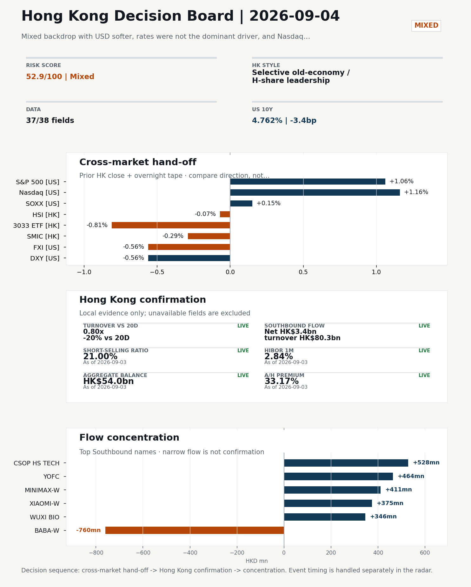
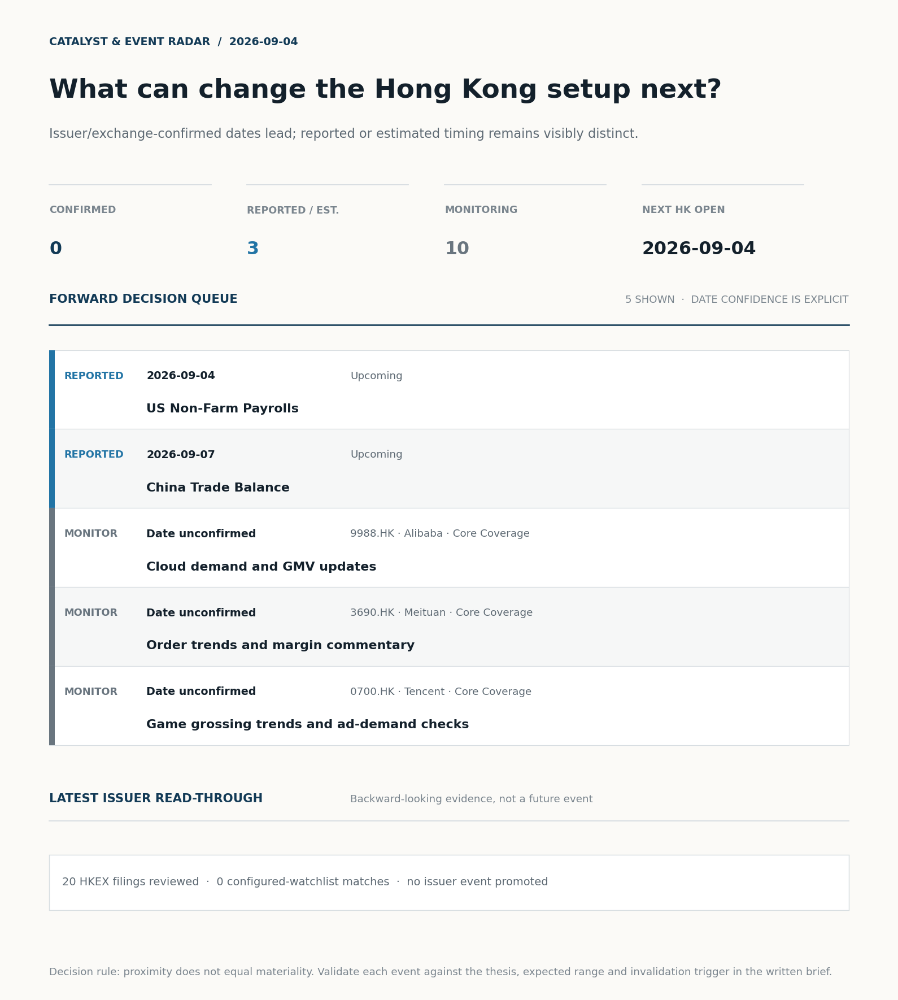
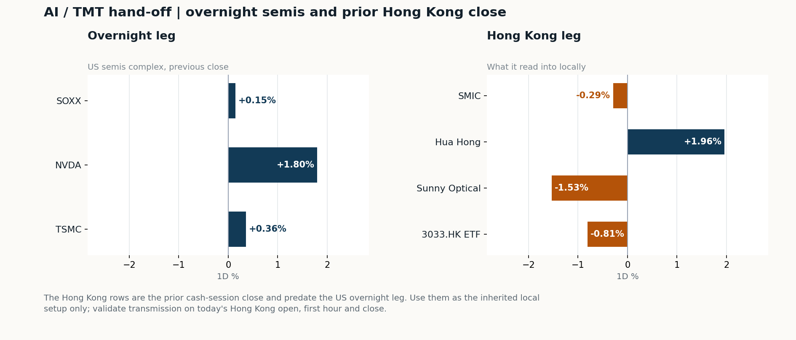
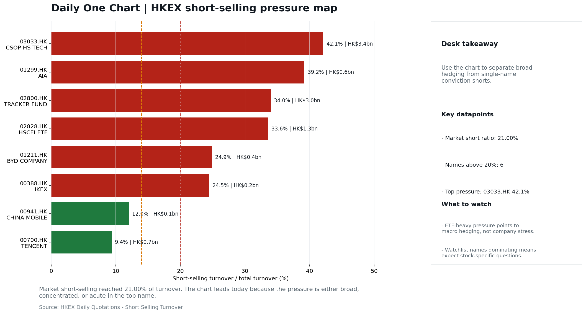

# Morning Research Workbench | 2026-09-04

> **Commute reading route:** `Layer 1 scan (5 min)` → `Layer 2 deep read` → `Layer 3 and appendix if time allows`
>
> Mode: `Trading Daily` | Keep the report execution-oriented: what mattered in the completed session, what can move Hong Kong leadership, and what needs fast follow-up.

_Data through: US/global `2026-09-03` | HK `2026-09-03` | A-share `2026-09-03` | Generated `2026-09-04 07:17:33`_

## Executive Summary

- **Did yesterday's call work?** NO CALL - The 2026-09-03 report published no directional call (neutral regime).
- **What changed overnight?** Semis led higher: SOXX +0.15%, NVDA +1.80%, TSMC +0.36%. HSI -0.07% and 3033.HK -0.81%.
- **What it means for AI/TMT** Style, not beta - Selective old-economy / H-share leadership, a 0.66pp spread. Treat banks, energy, telecoms, and SOE yield as the cleaner relative expression; growth beta still needs proof.
- **What to watch today** US Non-Farm Payrolls. Confirm if SMIC and Hua Hong open in the same direction as the overnight leg and hold it through the first hour; invalidate if they track HSCEI instead.

## Layer 1 | Scan (5 min)

### 1.1 Yesterday's Call
**Verdict: NO CALL.** The 2026-09-03 report published no directional call (neutral regime).

**Recent record.** 6 confirmed / 4 broken over the last 10 scoreable calls (60.0% hit rate). This is a directional close-to-close diagnostic, not a track record.

### 1.2 Opening Decision Board

**Global-to-Hong Kong signals**

_Decision-useful subset: each row states the implication and the next test. Descriptive secondary monitors are kept out of the five-minute scan._

| Signal | Last / move | Interpretation | Confirmation / invalidation |
| --- | --- | --- | --- |
| S&P 500 | 7,747.71 / +1.06% | Broad US risk rose as volatility drained out of the tape, which sets the external floor Hong Kong opens against. Falling volatility confirms lower near-term stress. | Watch whether Nasdaq and offshore-China proxies move the same way. |
| Nasdaq 100 | 29,482.32 / +1.16% | Growth tracked broad beta, so the move looks market-wide rather than duration-led. | 3033.HK versus HSI leadership carries the read; rising yields would undo it. |
| Hang Seng Index | 25,311.21 / -0.07% | The index was carried by old-economy and H-share names, not by broad participation: 3033.HK differs by 0.74pp. | Southbound participation decides whether this is investable or just a print. |
| Hang Seng TECH ETF (3033.HK) | 4.4320 / -0.81% | Hong Kong growth lagged, so broad-index strength is not yet a duration signal. | Needs a stable CNH and Southbound buying to become a duration signal. |
| Semiconductors (SOXX) | 502.20 / +0.15% | Semis underperformed the Nasdaq by 1.01pp, so this is a cycle move rather than broad growth weakness. | SMIC and Hua Hong at the open show whether it transmits to Hong Kong. |
| US 10Y | 4.7620% / -3.4bp | The yield proxy fell, easing the valuation headwind for duration-sensitive equities. | Read it through 3033.HK relative performance, not the index level. |
| USD/CNH | 6.7145 / +0.01% | CNH was stable, removing an immediate FX impulse but not confirming equity direction. | FXI and Southbound flow decide whether this reaches Hong Kong equities. |
| VIX | 14.32 / **-5.79%** | Lower implied volatility reduces near-term stress, but is supportive only if equity breadth confirms. | Falling volatility on narrowing breadth is a warning, not support. |

_Secondary monitors retained in the source bundle: SMIC (0981.HK), CSI 300, China 10Y, CN-US 10Y spread, DXY, USD/HKD, Brent crude, COMEX gold, Copper._

**Hong Kong local confirmation**

| Check | Value | Status | Source / as of | Why it matters |
| --- | --- | --- | --- | --- |
| Main Board turnover vs 20D | 0.80x \| -20% vs 20D | Live local | HKEX \| 2026-09-03 | Trailing 20-session average turnover was HK$249.1bn. |
| Southbound / Northbound net flow | Southbound Net HK$3.4bn \| turnover HK$80.3bn \| Northbound Turnover RMB242.7bn \| net not reported | Live local | HKEX Connect \| 2026-09-03 | Southbound net buy is calculated from HKEX disclosed buy and sell turnover. |
| Short-selling ratio | 21.00% | Live local | HKEX \| 2026-09-03 | Official HKEX stock-level short-selling table, aggregated as a share of total market turnover. |
| AH premium index | 33.17% | Live public | Yahoo \| 2026-09-03 | Equal-weighted average across 18 A/H pairs that resolved today. Composition varies by day, so the level is not comparable with prior reports (fixed basket incomplete: missing China Merchants Bank). [trimmed] |
| USD/HKD spot vs band | 7.8416 \| band 7.7500 to 7.8500 | Live quote + local | Yahoo \| 2026-09-03 | Mid-band: 84 pips from the weak side and 916 pips from the strong side, so the peg is not an active constraint. Official Convertibility Undertakings define the linked-rate stress boundaries for USD/HKD. |
| HIBOR 1M | 2.84% | Live local | HKMA \| 2026-09-03 | 1M HIBOR is the cleanest quick read for Hong Kong funding conditions and equity-duration pressure. |
| Hong Kong leadership | Selective old-economy / H-share leadership | Proxy | HSI / HSCEI / 3033.HK ETF relative \| 2026-09-03 | Use HSI / HSCEI / 3033.HK ETF relative moves as the opening style read. |

**Risk state and evidence**

**Composite risk score:** `52.9/100` | **Regime:** `Mixed`

| Component | Score impact | Evidence |
| --- | --- | --- |
| US beta | +6.4 | S&P 500 +1.06% |
| HK growth ETF proxy | -4.1 | 3033.HK ETF -0.81% |
| Semis complex | +0.8 | SOXX +0.15% |
| Offshore China proxy | -2.8 | FXI -0.56% |
| Dollar pressure | +5.6 | DXY -0.56% |
| Volatility | +10 | VIX -5.79% |
| HK short-selling | -8 | Short-selling ratio 21.00% |
| HK turnover | -5 | Turnover 0.80x 20D |

_Base 50 plus the component deltas above. Semis complex entered the score on 2026-08-22; earlier scores in the ledger exclude it._

**Morning Checklist**

1. **Mixed backdrop with USD softer, rates were not the dominant driver, and Nasdaq 100 outperformed FXI**
 Overnight regime | Start by deciding whether the day is about Mixed conditions or a style pivot.
2. **China NBS Manufacturing PMI (Past expected window (unverified))**
 Macro / policy | Growth direction, cyclicals, and manufacturing-chain pricing | Industries: Machinery, Building materials, Industrials
3. **China Caixin Manufacturing PMI (Past expected window (unverified))**
 Macro / policy | Growth direction, cyclicals, and manufacturing-chain pricing | Industries: Machinery, Building materials, Industrials
4. **US Non-Farm Payrolls (Upcoming)**
 Macro / policy | Watch whether it changes the day's core market narrative | Industries: Market-wide

## Visual Dashboard

**Catalyst & Event Radar**

**Chart read:** No issuer/exchange-confirmed event date is populated; 3 reported or estimated timing item(s) and 10 undated trigger(s) remain explicit.

_Source: Public calendars, issuer disclosures and configured research watchlists_
## Layer 2 | Core Research (20-30 min)

### 2.1 Global-to-Hong Kong Transmission
**Market Setup**
**Core tape.** Overnight US closed constructive: S&P 500 +1.06% and Nasdaq 100 +1.16% on a softer USD (DXY -0.42% intraday) with VIX down 5.79%, while offshore China did not confirm the tone (FXI -0.56%).
**Main driver.** The Hong Kong tape into this open was already weak on 2026-09-03 - HSI -0.07%, HSCEI -0.15%, 3033.HK ETF -0.81% - so a follow-through to the US bid is not pre-loaded.
**HK relevance.** Driver decomposition flags elevated HK short-selling (21.00%) and 0.80x turnover as drags that offset supportive US growth-style transmission, keeping conviction limited.

**Key Drivers**
- US growth-style leadership: Nasdaq 100 +1.16% with NVDA +1.80% supports HK tech and platform read-through, but 3033.HK ETF lagged on 2026-09-03 (-0.81%), so transmission is unproven.
- Dollar softer: DXY -0.42% intraday with USD/CNH +0.01% keeps CNH stable, modestly supportive of HK follow-through; pair with Fed-speak adds a hawkish counterweight.
- HK positioning drags: short-selling 21.00% (85th pct of 60 sessions) and Main Board turnover 0.80x 20D argue against chasing rebounds absent cleaner breadth and Southbound confirmation beyond the prior +HK$3.4bn net buy.

**Hong Kong Read-Through**
**Opening implication.** Carry the overnight tape into the Hong Kong open using the style and flow evidence in the Hong Kong review rather than the headline index alone.
_Hong Kong style leadership and flow confirmation are set out in the Hong Kong review below._

**Watch Points**
- USD composite moved lower by -0.42pct intraday, with a 0.715pct range.
- Main turning points appeared around 2026-09-03 08:10 peak / 2026-09-03 08:35 trough / 2026-09-03 08:55 peak, suggesting event-driven repricing rather than a clean one-way USD move.
- The biggest cross-asset divergence was Nasdaq 100 versus FXI, a spread of 0.23pct.
- Gold moved +1.13pct intraday with a 2.079pct high-low range.

**Curated overnight stories**
1. **China hits back at G20 statement on its reliance on exports, accusing them of 'promoting**
 Why it matters: Signals Beijing is publicly contesting the G20 framing of China as export-dependent, raising the risk of rhetorical escalation around tariffs and industrial policy just as…
 HK read-through: Most relevant for Hong Kong exporters, industrials, and policy-sensitive cyclicals; also feeds sentiment around Southbound allocation toward Mainland-exposed names.
2. **Fed Governor Barr says he'll support rate hike if inflation doesn't ease**
 Why it matters: Adds a hawkish voice to the FOMC at a time when the US rates curve has already pushed higher on stronger-activity commentary.
 HK read-through: Drives USD/rates direction, which sets the tape for Hong Kong growth, internet, and biotech, and pressures the HKMA liquidity framing.
3. **New York Fed's Williams says yield surge due to strong economic prospects**
 Why it matters: Reframes the recent backup in US yields as a growth-positive rather than inflation-negative story, which complicates the read-through to Asia's rate-sensitive sectors.
 HK read-through: Combined with Barr, keeps the rates bias firm; limits multiple expansion in Hong Kong duration-sensitive names (REITs, utilities, high-beta growth).
4. **China NBS Manufacturing PMI (Past expected window (unverified))**
 Why it matters: First-tier read on Mainland manufacturing momentum; data integrity caveat applies because the release is flagged as past the expected window and unverified.
 HK read-through: Direct input for Hong Kong industrials, machinery, building materials, and cyclicals; needs fast follow-up to confirm the official print before positioning.
5. **Aon CEO says insurance broker seeks to build 'premiere middle market platform' with**
 Why it matters: A sizable US insurance brokerage tie-up that can reset valuation references for the global insurance brokerage peer set.
 HK read-through: Secondary read-through to Hong Kong-listed insurance brokers and composite insurers; useful as a cross-check rather than a direct catalyst for HK leadership names.

**AI / TMT hand-off**

**Overnight leg.** The overnight semis leg was risk-on at +0.77% average (SOXX +0.15%, NVDA +1.80%, TSMC +0.36%).
**Hong Kong expression.** SMIC, Hua Hong and Sunny Optical are best placed at the open, and 3033.HK should be tested before the Hang Seng Index.
**Observable test.** Confirm if SMIC and Hua Hong open in the same direction as the overnight leg and hold it through the first hour; invalidate if they track HSCEI instead, which would mean local flow is overriding the global cycle.

| Name | Role in the chain | 1D | Leg |
| --- | --- | --- | --- |
| SOXX | Semis complex | +0.15% | overnight |
| NVDA | AI capex narrative | +1.80% | overnight |
| TSMC | Foundry demand | +0.36% | overnight |
| SMIC | Leading-edge / domestic substitution | -0.29% | Hong Kong |
| Hua Hong | Mature-node pricing cycle | +1.96% | Hong Kong |
| Sunny Optical | Hardware and optics supply chain | -1.53% | Hong Kong |
| 3033.HK ETF | Broad HK tech beta | -0.81% | Hong Kong |

**Clock discipline.** The Hong Kong rows are the prior cash-session close and predate the US overnight leg. Use them as the inherited local setup only; validate transmission on today's Hong Kong open, first hour and close.

### 2.2 Hong Kong Local Tape and Flow
**Local Tape Setup**
**Local read.** Hong Kong opens 2026-09-04 into a split tape: the US closed constructive (S&P 500 +1.06%, Nasdaq 100 +1.16%, NVDA +1.80% on DXY -0.56%).
**Verification point.** Local flow evidence reinforces the caution: short-selling at 21.00% of turnover (the dominant drag in the driver decomposition) and Main Board turnover at 0.80x the 20D average argue against chasing any US-led gap-up.
**Risk to watch.** Southbound net was positive at HK$3.4bn on HK$80.3bn turnover, with concentrated buys in MINIMAX-W (+HK$411m), TENCENT (+HK$288m), and a heavy CSOP HS TECH (3033) buy (+HK$528m).

**Style and Local Leadership**
**Style call.** Selective old-economy / H-share leadership.
- **Evidence:** HSCEI beat 3033.HK by 0.66pp (-0.15% versus -0.81%)
- **Portfolio meaning:** Treat banks, energy, telecoms, and SOE yield as the cleaner relative expression; growth beta still needs proof.
- **Cross-market read:** Hang Seng -0.07% / HSCEI -0.15% / 3033.HK ETF -0.81%. Offshore China proxy FXI -0.56% and USD/CNH +0.01% frame cross-border risk appetite. USD/HKD last traded around 7.8416, which keeps the Hong Kong funding lens in focus.

**Flow Confirmation**
Official Stock Connect evidence is available; the Flow Tracker confirms whether local money supports the price action.

**Follow-Through Checklist**
**Follow-through check.** Confirmation test for a 2026-09-04 growth-led open: (1) 3033.HK ETF outperforms HSCEI intraday with turnover above the 249.1bn 20D average.
**Failure condition.** Invalidate if 3033.HK retakes leadership while CNH firms and local participation broadens.

**Cross-asset attribution**

| Driver | Direction | Score | Evidence | HK implication |
| --- | --- | --- | --- | --- |
| Short-selling pressure | drag | 4.2 | HKEX short-selling ratio was 21.00%. | Elevated short activity argues for extra confirmation before chasing rebounds. |
| Hong Kong participation | drag | 2.0 | Main Board turnover was 0.80x the 20-session average. | Thin turnover makes index moves easier to fade. |
| US growth-style transmission | supportive | 1.62 | Nasdaq 100 moved +1.16%. | Hong Kong growth and platform names should be tested first at the open. |
| Global equity beta | supportive | 1.06 | S&P 500 moved +1.06%. | Broad beta matters if Hong Kong breadth confirms the overseas signal. |
| Dollar / CNH pressure | supportive | 0.84 | DXY -0.56% / USD-CNH +0.01% | A stable or softer CNH makes Hong Kong follow-through more credible. |

**Local flow evidence**

**Flow Takeaways**
- Short-selling pressure is elevated, so local rebounds need cleaner breadth and flow confirmation.
- Stock Connect Southbound: net HK$3.4bn on turnover HK$80.3bn (as of 2026-09-03).
- Stock Connect Northbound: turnover RMB242.7bn; public file provides total turnover/top active names, not full net-buy.
- AH premium: covered-pair average +33.17% over 18 pairs. Composition varies by day, so this level is not comparable with prior reports; widest premium: China Communications Construction 95.22%.

**Stock Connect Southbound Active Names**

| # | Ticker | Name | Buy | Sell | Net buy | HKEX turnover rank |
| --- | --- | --- | --- | --- | --- | --- |
| 1 | 09988.HK | BABA-W | HK$1,419.7mn | HK$2,180.1mn | HK$-760.4mn | 2 |
| 2 | 03033.HK | CSOP HS TECH | HK$529.6mn | HK$1.4mn | HK$528.2mn | 10 |
| 3 | 06869.HK | YOFC | HK$1,921.0mn | HK$1,457.4mn | HK$463.7mn | 3 |
| 4 | 00100.HK | MINIMAX-W | HK$2,120.7mn | HK$1,709.7mn | HK$410.9mn | 1 |
| 5 | 01810.HK | XIAOMI-W | HK$1,002.8mn | HK$627.9mn | HK$374.9mn | 8 |

**AH Premium Dispersion**

| Name | A ticker | H ticker | Premium | As of |
| --- | --- | --- | --- | --- |
| China Communications Construction | 601800.SS | 1800.HK | +95.22% | 2026-09-03 |
| China Railway Construction | 601186.SS | 1186.HK | +60.17% | 2026-09-03 |
| China Life | 601628.SS | 2628.HK | +53.18% | 2026-09-03 |

**HKEX Short-Selling Watch**

| Ticker | Name | Short ratio | Short turnover | Total turnover |
| --- | --- | --- | --- | --- |
| 00388.HK | HKEX | 24.46% | HK$0.2bn | HK$1.0bn |
| 00700.HK | TENCENT | 9.37% | HK$0.7bn | HK$7.6bn |
| 00941.HK | CHINA MOBILE | 12.03% | HK$0.1bn | HK$0.8bn |

- **Short-value leaders:** 03033.HK CSOP HS TECH (HK$3.4bn); 02800.HK TRACKER FUND (HK$3.0bn); 07709.HK XL2CSOPHYNIX (HK$2.5bn); 01810.HK XIAOMI-W (HK$1.4bn).

### 2.3 Macro Transmission
**Desk read.** The completed global session offered a mixed, not uniformly risk-on, setup: a softer USD, falling VIX, NVIDIA strength, higher copper and bitcoin point to easier stress conditions and selective demand for growth.

**Market sensitivity.** For Hong Kong, this supports monitoring tech leadership while leaving the broader market vulnerable to changes in the policy narrative.

**HK implication.** Today's US Non-Farm Payrolls release is the key macro event; its effect on Hong Kong would operate through the Fed path, then the HKMA, HIBOR and the valuation of duration-sensitive equities.

**Macro watchpoints**
- US Non-Farm Payrolls and any resulting change in the Fed-path narrative, with follow-through in US yields and USD/HKD conditions.
- HKMA settings, HIBOR and Hong Kong duration-sensitive equities after the payrolls release.
- Whether Hong Kong tech sustains the positive read-through from NVIDIA's 1.80% rise and Nasdaq 100 outperformance versus FXI.
- Whether lower VIX and stronger copper, bitcoin and risk assets translate into broader Hong Kong participation or remain selective.

| Time | Region | Event | Status | Desk read |
| --- | --- | --- | --- | --- |
| | CN | China NBS Manufacturing PMI | Past expected window (unverified) | Impact: Growth direction, cyclicals, and manufacturing-chain pricing \| Attention: 5/5 \| Industries: Machinery, Building materials, Industrials |
| | CN | China Caixin Manufacturing PMI | Past expected window (unverified) | Impact: Growth direction, cyclicals, and manufacturing-chain pricing \| Attention: 3/5 \| Industries: Machinery, Building materials, Industrials |
| | US | US Non-Farm Payrolls | Upcoming | Impact: Watch whether it changes the day's core market narrative \| Attention: 5/5 \| Industries: Market-wide |
| | CN | China Trade Balance | Upcoming | Impact: Watch whether it changes the day's core market narrative \| Attention: 3/5 \| Industries: Market-wide |
| | CN | China CPI / PPI | Upcoming | Impact: China demand strength, PPI pass-through, and policy-easing odds \| Attention: 3/5 \| Industries: Consumer, Materials, Property |

**Positioning and risk backdrop**

- Detailed local flow evidence is covered under Flow Tracker and Attribution; keep this section focused on options, hedging, and macro-positioning risk.

### 2.4 Company Micro Research and Catalysts

| Grade | Sector | Headline | Why it matters | Horizon |
| --- | --- | --- | --- | --- |
| A | Financials | Aon CEO says insurance broker seeks to build 'premiere middle market | Capital allocation or shareholder-return events can trigger a valuation | Medium-term trend |

**Company Event Takeaway**
**Desk read.** Hong Kong session 2026-09-03 closed with leadership divergence rather than a single tape driver.
**Why it matters.** Core internet holdings were weak: Alibaba (9988.HK) -2.18% to HK$107.50 with news flow questioning whether instant-retail scale can convert subsidies into profits, and Meituan (3690.HK) -1.40% to HK$77.65 despite prior-period results highlighting a return to profit and core local-commerce positivity.
**Follow-up.** Insurance was the relative bright spot, with AIA (1299.HK) +1.71% to HK$76.76 sitting near the top of its 60-session band, while BYD (1211.HK) edged +0.53% to HK$85.70.

**LLM Quick Takes**
- **9988.HK** | Fact: -2.18% to HK$107.50, mid-range at 47% of 60-session band; attached news questions whether instant-retail scale can replace subsidies with returns. Investor read…
- **3690.HK** | Fact: -1.40% to HK$77.65, mid-range at 45%; prior Q2 results (Q2 2026) cited 14.4% revenue growth and a return to core local-commerce profit. Investor read…
- **1299.HK** | Fact: +1.71% to HK$76.76, top quartile of 60-session range at 75%; no attached news. Investor read: relative strength is consistent with the insurance sector tailwind from the Aon-USI M&A…
- **1211.HK** | Fact: +0.53% to HK$85.70, mid-range at 59%; no attached news. Investor read: neutral session; the next 2026-10-29 print is the first hard catalyst. Next check…

Decision filter<h4>No immediate portfolio catalyst: 20 official filings were screened and the low-signal market set stays aggregated.</h4>
20 profit warnings

<strong>20</strong>Official filings

<strong>0</strong>Watchlist hits

<strong>0</strong>Actionable events

<strong>No event cleared the portfolio decision filter.</strong>

Broad-market filings remain traceable in the source appendix; they are not expanded here without a watchlist, estimate or liquidity read-through.

<strong>Coverage boundary.</strong> sell-side rating changes, IPO / grey-market monitor were not decision-grade in this run; their absence is not treated as confirmation that no event exists.

**Core coverage requiring follow-up**

**Core coverage**

| Name | Ticker | Last | 1D | Range position | Morning note |
| --- | --- | --- | --- | --- | --- |
| Alibaba | 9988.HK | 107.50 | -2.18% | Mid-range | Down 2.18% on the session, mid-range at 47% of its 60-session band. |
| Meituan | 3690.HK | 77.65 | -1.40% | Mid-range | Marginally lower (-1.40%), mid-range at 45% of its 60-session band. |

**Recent headlines for Alibaba:**
- [Alibaba's $178 Billion One-Hour Market Still Lacks a Profit Scoreboard I](https://finance.yahoo.com/markets/stocks/articles/alibabas-178-billion-one-hour-214031153.html) (GuruFocus.com)
**Recent headlines for Meituan:**
- [Meituan (MPNGF) (Q2 2026) Earnings Call Highlights: Record Revenue and Strategic AI Pivot Drive...](https://finance.yahoo.com/markets/stocks/articles/meituan-mpngf-q2-2026-earnings-190123345.html) (GuruFocus.com)

**Priority follow-up**

| Name | Ticker | Last | 1D | Range position | Morning note |
| --- | --- | --- | --- | --- | --- |
| AIA | 1299.HK | 76.76 | +1.71% | Top of range | Marginally higher (+1.71%), in the top quartile of its 60-session range (75%). |
| BYD Company | 1211.HK | 85.70 | +0.53% | Mid-range | Marginally higher (+0.53%), mid-range at 59% of its 60-session band. |

### 2.5 Morning Meeting Questions
No divergence, tail reading or coverage gap stood out today, so there is no obvious follow-up question beyond the base case above.

## Layer 3 | Session Playbook (8-12 min)

### 3.1 Base Case and Scenario Map
**Starting posture.** Selective old-economy / H-share leadership (medium confidence); composite risk `52.9/100` (Mixed). Treat banks, energy, telecoms, and SOE yield as the cleaner relative expression; growth beta still needs proof.

**Scenario map**

| Scenario | Observable trigger | Interpretation | Research response |
| --- | --- | --- | --- |
| Selective growth confirms | 3033.HK keeps a >0.5pp first-hour lead over HSCEI; SMIC and Hua Hong stop lagging broad beta; CNH is stable. | The prior style split has live price confirmation, but is not yet broad China risk-on. | Prioritize internet/platform relative strength; verify participation again at the close. |
| Broad beta takes over | HSI and HSCEI rise together, breadth improves and the 3033.HK lead narrows without turning negative. | Leadership is broadening from a style trade into market beta. | Expand the research set from growth leaders to financials, SOEs and index-heavy names. |
| Risk-off continuation | 3033.HK loses its lead, semis underperform HSCEI and CNH depreciation accelerates. | The prior divergence was a temporary pocket of strength rather than a durable hand-off. | Treat rebounds as unconfirmed; focus on balance-sheet, catalyst and crowding risk. |

**Clocked validation scorecard**

| Window | Check | Prior evidence | Pass condition | What it decides |
| --- | --- | --- | --- | --- |
| 09:30-10:30 | 3033.HK vs HSCEI | -0.66pp at the prior close | 3033.HK retains >0.5pp relative lead | Whether growth leadership survives the open |
| 09:30-10:30 | Semiconductor hand-off | SMIC -0.29%; Hua Hong Semiconductor +1.96% | Stabilise after the open; at least one stops underperforming HSCEI | Whether overnight semis pressure is contained locally |
| 09:30-10:30 | HSI price zone | 25,311 vs 25,000 / 25,500 reference grid | Hold above the lower grid or reclaim the upper grid with breadth | Whether broad beta is stabilising; grid is derived, not technical analysis |
| 09:30-10:30 | USD/CNH | 6.7145 \| +0.01% | No acceleration in CNH depreciation | Whether FX permits a clean Hong Kong risk extension |
| At close | Turnover | 0.80x \| -20% vs 20D | At least 1.0x the 20-session average | Whether the move had normal participation |
| At close | Southbound | Net HK$3.4bn \| turnover HK$80.3bn | Net buying remains positive and broadens beyond one or two names | Whether mainland money confirms the price move |
| At close | Short pressure | 21.00% | Falls versus the prior verified reading (21.00%) | Whether rebound conviction improved |

**Upgrade rule.** Confirm if HSCEI keeps outperforming 3033.HK with healthy turnover and broad Southbound participation.
**Kill switch.** Invalidate if 3033.HK retakes leadership while CNH firms and local participation broadens.
**Clock discipline.** At 07:30, same-day Southbound, turnover and short-selling outcomes are not known. Use the first-hour price/FX checks provisionally and make the final classification only after the close.
**Event clock.** Same-day decision items: US Non-Farm Payrolls, US Non-Farm Payrolls.

### 3.2 Daily One Chart
**Daily One Chart | HKEX short-selling pressure map**

**Chart read.** Market short-selling reached 21.00% of turnover.
**Why it matters.** The chart leads today because the pressure is either broad, concentrated, or acute in the top name.

_Source: HKEX Daily Quotations - Short Selling Turnover_

## Optional Appendix | Traceability and Performance (10-15 min)

### Report Metadata
> Date policy: Review date 2026-09-03 is treated as `Trading Daily`. | Global (US/Europe) data date is 2026-09-03; adapter effective date is 2026-09-03 and summary date is 2026-09-03. | Hong Kong local data date is 2026-09-03; role: same-session local cash tape.
> Market data quality: Coverage: `37/38` | Missing: `1`
> Report quality: `95.6/100` | Grade `A` | Status `usable with caveats`

### Report Quality and Validation
- **Quality score:** 95.6/100 | **Grade:** A | **Status:** usable with caveats
- **Run summary:** 8 healthy | 2 caveat | 0 failed
- **Release recommendation:** Send with caveats | The report is usable, but the advisory guidance should travel with it so readers understand the data gaps.

| Source | Status | Bucket |
| --- | --- | --- |
| Macro calendar | partial | caveat |
| Risk and sentiment feed | partial | caveat |

**Desk-use guidance summary:** 0 blocking | 1 advisory

**Desk-use guidance**
- **Advisory:** Questionable narrative fields were removed; use the deterministic fallback copy and review the audit trail.

**Quality warnings**
- Narrative fact-check guardrail produced warnings; review the validation table before relying on narrative sections.

**Narrative fact-check guardrail**
- Checked 43 numeric claims; 0 numeric mismatch(es), 0 logic warning(s); 14 structured claims, 0 source/text warning(s); 0 critical, 0 review. Replaced 3 unsafe narrative field(s) with deterministic fallback copy.
- **Deterministic fallback fields:** overnight_hk_implication, tasks.overnight_review.drivers[3], tasks.overnight_review.hk_open_implication

_Full component weights, per-source freshness, adapter status and provenance records are archived with this report under `audit/` rather than printed here._

### Historical Signal Performance
- **Readiness:** exploratory with caveats | 69 observations | 93 active signal dates | next-close entry, 10bps cost, no same-day returns.
- **Interpretation boundary:** exploratory until a benchmark reaches 252 sessions and 100 active-signal sessions.
- **Data-quality caveat:** 23 conflicting price revision(s) and 6 non-session observation(s) remain in the research ledger.
- **Daily-use boundary:** cumulative return, Sharpe and the performance chart stay out of the daily commute edition until the sample and trading-calendar gates pass; use Yesterday's Call instead.

### Source Links
- [Aon CEO says insurance broker seeks to build 'premiere middle market platform' with purchase of rival USI](https://www.cnbc.com/2026/08/31/aon-ceo-says-usi-deal-seeks-to-build-premiere-middle-market-insurance-platform.html) (cnbc_markets)
- [Alibaba's $178 Billion One-Hour Market Still Lacks a Profit Scoreboard I](https://finance.yahoo.com/markets/stocks/articles/alibabas-178-billion-one-hour-214031153.html) (GuruFocus.com)
- [Top Analyst Reports for Amazon, AbbVie & Alibaba](https://finance.yahoo.com/markets/stocks/articles/top-analyst-reports-amazon-abbvie-195200595.html) (Zacks)
- [Meituan (MPNGF) (Q2 2026) Earnings Call Highlights: Record Revenue and Strategic AI Pivot Drive...](https://finance.yahoo.com/markets/stocks/articles/meituan-mpngf-q2-2026-earnings-190123345.html) (GuruFocus.com)
- [Meituan Returns to Profit as Food-Delivery Competition Eases](https://www.wsj.com/business/earnings/meituan-returns-to-profit-as-food-delivery-competition-eases-1026a0e9?siteid=yhoof2&yptr=yahoo) (The Wall Street Journal)
- [Tencent Claims Its New Model Outshines Moonshot and Z.AI. What That Means for TCEHY Stock Here.](https://www.barchart.com/story/news/4411192/tencent-claims-its-new-model-outshines-moonshot-and-z-ai-what-that-means-for-tcehy-stock-here) (Barchart)
- [Tencent Rose as Its AI Chip Bet Draws 6,109 Times Demand](https://finance.yahoo.com/technology/ai/articles/tencent-rose-ai-chip-bet-160606298.html) (GuruFocus.com)
- [00333.HK Profit warning / alert announcement](http://www1.hkexnews.hk/listedco/listconews/sehk/2026/0831/2026083100934.pdf) (HKEXnews)
- [01496.HK Profit warning / alert announcement](http://www1.hkexnews.hk/listedco/listconews/sehk/2026/0831/2026083100716.pdf) (HKEXnews)
- [00875.HK Profit warning / alert announcement](http://www1.hkexnews.hk/listedco/listconews/sehk/2026/0828/2026082801978.pdf) (HKEXnews)
- [01152.HK Profit warning / alert announcement](http://www1.hkexnews.hk/listedco/listconews/sehk/2026/0828/2026082800863.pdf) (HKEXnews)
- [01255.HK Profit warning / alert announcement](http://www1.hkexnews.hk/listedco/listconews/sehk/2026/0828/2026082802456.pdf) (HKEXnews)
- [01518.HK Profit warning / alert announcement](http://www1.hkexnews.hk/listedco/listconews/sehk/2026/0828/2026082804114.pdf) (HKEXnews)
- [01561.HK Profit warning / alert announcement](http://www1.hkexnews.hk/listedco/listconews/sehk/2026/0828/2026082802706.pdf) (HKEXnews)
- [08270.HK Profit warning / alert announcement](http://www1.hkexnews.hk/listedco/listconews/gem/2026/0828/2026082800571.pdf) (HKEXnews)
