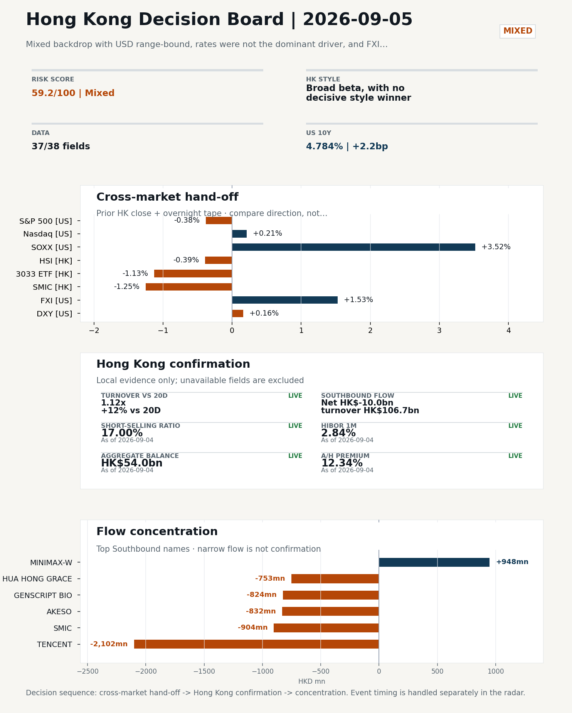
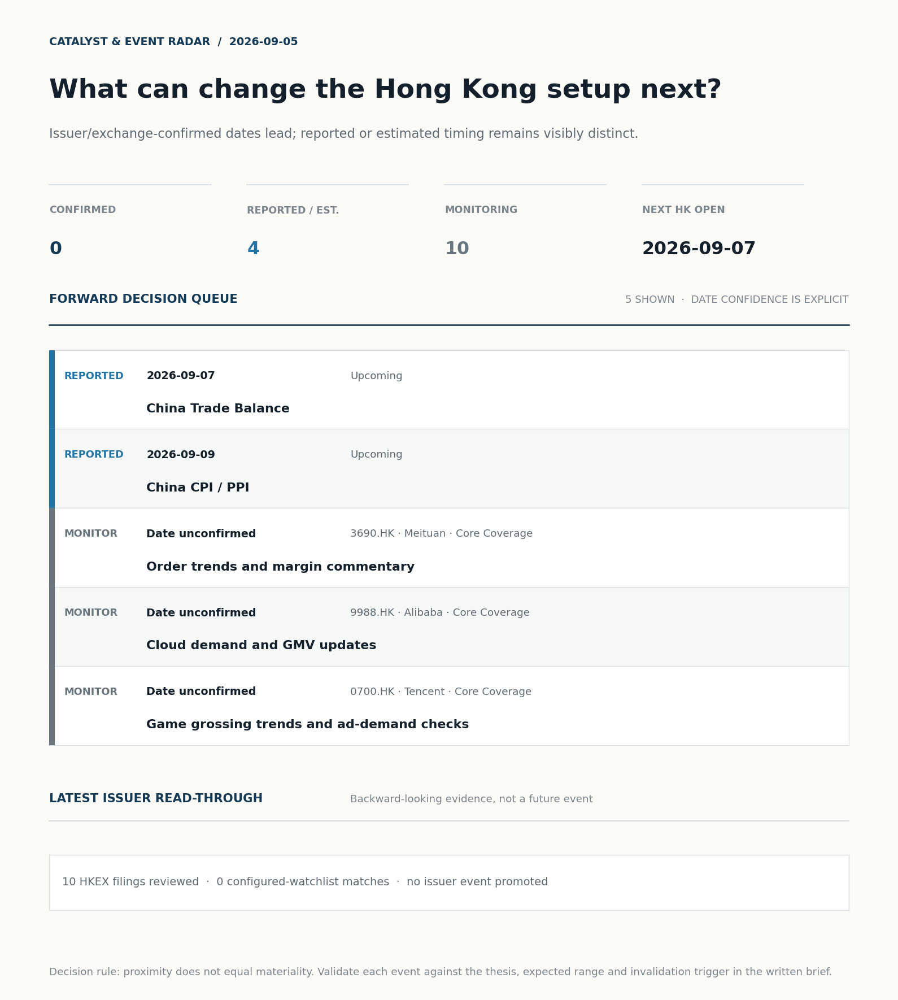
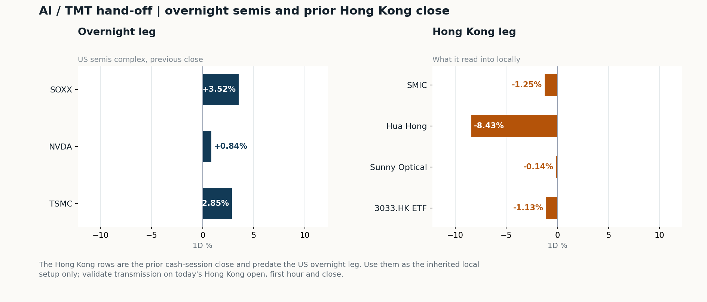
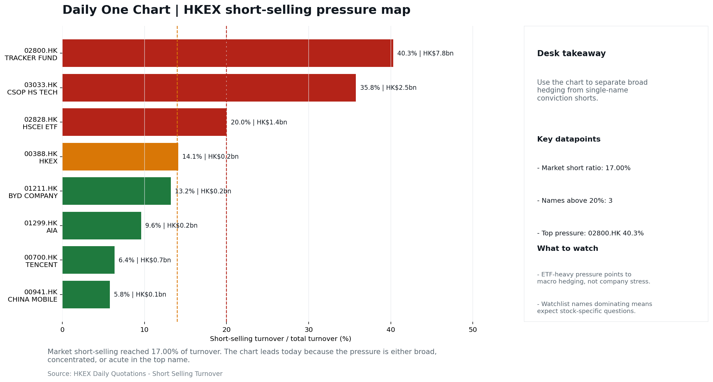

# Morning Research Workbench | 2026-09-05

> **Commute reading route:** `Layer 1 scan (5 min)` → `Layer 2 deep read` → `Layer 3 and appendix if time allows`
>
> Mode: `Trading Daily` | Review Friday's completed session; treat Saturday as a non-trading prep day.

_Data through: US/global `2026-09-04` | HK `2026-09-04` | A-share `2026-09-04` | Generated `2026-09-05 07:04:26`_

## Executive Summary

- **Did yesterday's call work?** NO CALL - The 2026-09-04 report published no directional call (neutral regime).
- **What changed overnight?** Semis led higher: SOXX +3.52%, NVDA +0.84%, TSMC +2.85%. HSI -0.39% and 3033.HK -1.13%.
- **What it means for AI/TMT** No decisive style winner - Broad beta, with no decisive style winner, a 0.36pp spread. Avoid forcing a growth-versus-value call; let volume, Southbound concentration, and the first-hour relative tape identify leadership.
- **What to watch today** Next scheduled catalyst: China Trade Balance on 2026-09-07. Confirm if SMIC and Hua Hong open in the same direction as the overnight leg and hold it through the first hour; invalidate if they track HSCEI instead.

## Layer 1 | Scan (5 min)

### 1.1 Yesterday's Call
**Verdict: NO CALL.** The 2026-09-04 report published no directional call (neutral regime).

**Recent record.** 6 confirmed / 4 broken over the last 10 scoreable calls (60.0% hit rate). This is a directional close-to-close diagnostic, not a track record.

### 1.2 Opening Decision Board

**Global-to-Hong Kong signals**

_Decision-useful subset: each row states the implication and the next test. Descriptive secondary monitors are kept out of the five-minute scan._

| Signal | Last / move | Interpretation | Confirmation / invalidation |
| --- | --- | --- | --- |
| S&P 500 | 7,718.60 / -0.38% | Broad US risk fell without a clear driver in today's fields; treat it as beta, not a signal. | Watch whether Nasdaq and offshore-China proxies move the same way. |
| Nasdaq 100 | 29,544.15 / +0.21% | Growth outperformed broad beta, a supportive style signal for Hong Kong internet and platform names. Growth advanced despite higher yields, showing momentum resilience but also higher reversal sensitivity. | 3033.HK versus HSI leadership carries the read; rising yields would undo it. |
| Hang Seng Index | 25,213.31 / -0.39% | The index was carried by old-economy and H-share names, not by broad participation: 3033.HK differs by 0.74pp. | Southbound participation decides whether this is investable or just a print. |
| Hang Seng TECH ETF (3033.HK) | 4.3820 / -1.13% | Hong Kong growth lagged, so broad-index strength is not yet a duration signal. | Needs a stable CNH and Southbound buying to become a duration signal. |
| Semiconductors (SOXX) | 519.86 / **+3.52%** | Semis led the Nasdaq by 3.31pp, putting the AI capex trade back in front. | SMIC and Hua Hong at the open show whether it transmits to Hong Kong. |
| US 10Y | 4.7840% / +2.2bp | The yield proxy rose, tightening the discount-rate backdrop for long-duration Hong Kong growth. | Read it through 3033.HK relative performance, not the index level. |
| USD/CNH | 6.7045 / -0.16% | A stronger offshore renminbi supports the external-risk backdrop for Hong Kong equities. | FXI and Southbound flow decide whether this reaches Hong Kong equities. |
| VIX | 14.53 / +1.47% | Higher implied volatility raises the tail-risk premium and weakens risk-on conviction. | Falling volatility on narrowing breadth is a warning, not support. |

_Secondary monitors retained in the source bundle: SMIC (0981.HK), CSI 300, China 10Y, CN-US 10Y spread, DXY, USD/HKD, Brent crude, COMEX gold, Copper._

**Hong Kong local confirmation**

| Check | Value | Status | Source / as of | Why it matters |
| --- | --- | --- | --- | --- |
| Main Board turnover vs 20D | 1.12x \| +12% vs 20D | Live local | HKEX \| 2026-09-04 | Trailing 20-session average turnover was HK$246.3bn. |
| Southbound / Northbound net flow | Southbound Net HK$-10.0bn \| turnover HK$106.7bn \| Northbound Turnover RMB274.2bn \| net not reported | Live local | HKEX Connect \| 2026-09-04 | Southbound net buy is calculated from HKEX disclosed buy and sell turnover. |
| Short-selling ratio | 17.00% | Live local | HKEX \| 2026-09-04 | Official HKEX stock-level short-selling table, aggregated as a share of total market turnover. |
| AH premium index | 12.34% | Live public | Yahoo \| 2026-09-04 | Fixed 10-name basket, equal-weighted, both legs priced on the same date; comparable across dates. Covered-pair average was +26.20% across 17 pairs. |
| USD/HKD spot vs band | 7.8407 \| band 7.7500 to 7.8500 | Live quote + local | Yahoo \| 2026-09-04 | Mid-band: 93 pips from the weak side and 907 pips from the strong side, so the peg is not an active constraint. Official Convertibility Undertakings define the linked-rate stress boundaries for USD/HKD. |
| HIBOR 1M | 2.84% | Live local | HKMA \| 2026-09-04 | 1M HIBOR is the cleanest quick read for Hong Kong funding conditions and equity-duration pressure. |
| Hong Kong leadership | Broad beta, with no decisive style winner | Proxy | HSI / HSCEI / 3033.HK ETF relative \| 2026-09-04 | Use HSI / HSCEI / 3033.HK ETF relative moves as the opening style read. |

**Risk state and evidence**

**Composite risk score:** `59.2/100` | **Regime:** `Mixed`

| Component | Score impact | Evidence |
| --- | --- | --- |
| US beta | -2.3 | S&P 500 -0.38% |
| HK growth ETF proxy | -5.6 | 3033.HK ETF -1.13% |
| Semis complex | +9 | SOXX +3.52% |
| Offshore China proxy | +7.7 | FXI +1.53% |
| Dollar pressure | -1.6 | DXY +0.16% |
| Volatility | -2.9 | VIX +1.47% |
| HK short-selling | +0 | Short-selling ratio 17.00% |
| HK turnover | +5 | Turnover 1.12x 20D |

_Base 50 plus the component deltas above. Semis complex entered the score on 2026-08-22; earlier scores in the ledger exclude it._

**Morning Checklist**

1. **Mixed backdrop with USD range-bound, rates were not the dominant driver, and FXI outperformed Nasdaq 100**
 Overnight regime | Start by deciding whether the day is about Mixed conditions or a style pivot.
2. **US Non-Farm Payrolls (Past expected window (unverified))**
 Macro / policy | Watch whether it changes the day's core market narrative | Industries: Market-wide
3. **China Caixin Manufacturing PMI (Past expected window (unverified))**
 Macro / policy | Growth direction, cyclicals, and manufacturing-chain pricing | Industries: Machinery, Building materials, Industrials
4. **[A] Aon CEO says insurance broker seeks to build 'premiere middle market platform' with purchase of rival USI**
 News / announcements | Capital allocation or shareholder-return events can trigger a valuation reset

## Visual Dashboard

**Catalyst & Event Radar**

**Chart read:** No issuer/exchange-confirmed event date is populated; 4 reported or estimated timing item(s) and 10 undated trigger(s) remain explicit.

_Source: Public calendars, issuer disclosures and configured research watchlists_
## Layer 2 | Core Research (20-30 min)

### 2.1 Global-to-Hong Kong Transmission
**Market Setup**
**Core tape.** Overnight US trade (2026-09-04) was mixed.
**Main driver.** The Dollar was range-bound rather than trending, and the VIX ticked up only 1.47%, so the move looks like a sector rotation within risk rather than a clean risk-off day.
**HK relevance.** Rates were not the dominant driver, but a senior Fed voice reframing the US yield backup as growth-driven keeps the USD/HKD linked-rate lens relevant into the 2026-09-07 Hong Kong open.

**Key Drivers**
- AI/semis leadership was the cleanest overnight signal.
- Offshore China outperformed US tech on a relative basis (FXI +1.53% vs Nasdaq 100 +0.21%), suggesting the China-sensitive bid came from a China-specific channel rather than a broad global risk-on wave.
- USD was range-bound (DXY +0.16%) and VIX rose only 1.47% despite the S&P 500 -0.38%, indicating the equity pullback was rotation-driven, not a fresh risk-off shock.
- The Williams "strong economic prospects" framing of the US yield backup reframes the rates move as growth- rather than policy-driven.

**Hong Kong Read-Through**
**Opening implication.** A constructive 2026-09-07 open is credible only if the AI/semis bid (SOXX, TSM) and the FXI outperformance transmit into HK names.
_Hong Kong style leadership and flow confirmation are set out in the Hong Kong review below._

**Watch Points**
- USD composite moved higher by +0.10pct intraday, with a 0.244pct range.
- Main turning points appeared around 2026-09-04 08:15 peak / 2026-09-04 08:30 peak / 2026-09-04 08:50 trough, suggesting event-driven repricing rather than a clean one-way USD move.
- The biggest cross-asset divergence was FXI versus Nasdaq 100, a spread of 0.51pct.
- Gold moved -0.84pct intraday with a 2.414pct high-low range.

**Curated overnight stories**
1. **China hits back at G20 statement on its reliance on exports, accusing them of 'promoting**
 Why it matters: Adds a fresh layer of trade-policy friction just ahead of the Hong Kong session and the upcoming China Trade Balance release.
 HK read-through: Direct read-across to Hong Kong exporters, industrials, and China-sensitive cyclicals; can pressure sentiment if it lifts protectionism risk premia into Monday.
2. **New York Fed's Williams says yield surge due to strong economic prospects**
 Why it matters: A senior Fed voice reframing the backup in US yields as growth-driven rather than policy-driven matters for the global rates corridor and USD path.
 HK read-through: Bears on the USD/HKD setup and on Hong Kong duration proxies (REITs, utilities) if the 'soft-landing' framing holds.
3. **Aon CEO says insurance broker seeks to build 'premiere middle market platform' with**
 Why it matters: Capital-allocation event in global insurance brokerage; can reset valuation framing for large brokers and intermediaries.
 HK read-through: Most relevant for HK-listed insurance and brokerage names as a relative-pricing reference; second-order read for large-cap Financials sentiment.
4. **Micron is doubling down on AI memory chips, increasing production capacity of a**
 Why it matters: Confirms continued AI-driven memory capex and product-mix improvement, supporting the AI hardware cycle thesis.
 HK read-through: Read-across to HK-listed semiconductor and AI hardware names; supportive for the AI/Hardware basket that has driven recent Hang Seng Tech relative performance vs Nasdaq.
5. **S&P downgrades Senegal after government unveils debt rework, says distressed exchange or**
 Why it matters: EM sovereign-distress signal with potential spillover to EM credit risk premia and Frontier/EM equity sentiment.
 HK read-through: Limited direct Hong Kong impact; mainly a watch item for EM-exposed financials and for risk appetite at the margin if EM stress broadens.

**AI / TMT hand-off**

**Overnight leg.** The overnight semis leg was risk-on at +2.40% average (SOXX +3.52%, NVDA +0.84%, TSMC +2.85%).
**Hong Kong expression.** SMIC, Hua Hong and Sunny Optical are best placed at the open, and 3033.HK should be tested before the Hang Seng Index.
**Observable test.** Confirm if SMIC and Hua Hong open in the same direction as the overnight leg and hold it through the first hour; invalidate if they track HSCEI instead, which would mean local flow is overriding the global cycle.

| Name | Role in the chain | 1D | Leg |
| --- | --- | --- | --- |
| SOXX | Semis complex | +3.52% | overnight |
| NVDA | AI capex narrative | +0.84% | overnight |
| TSMC | Foundry demand | +2.85% | overnight |
| SMIC | Leading-edge / domestic substitution | -1.25% | Hong Kong |
| Hua Hong | Mature-node pricing cycle | -8.43% | Hong Kong |
| Sunny Optical | Hardware and optics supply chain | -0.14% | Hong Kong |
| 3033.HK ETF | Broad HK tech beta | -1.13% | Hong Kong |

**Clock discipline.** The Hong Kong rows are the prior cash-session close and predate the US overnight leg. Use them as the inherited local setup only; validate transmission on today's Hong Kong open, first hour and close.
**Single-name outlier.** Hua Hong -8.43% moved far outside the rest of the Hong Kong leg. Treat as company-specific until checked; do not read it as a cycle signal.

### 2.2 Hong Kong Local Tape and Flow
**Local Tape Setup**
**Local read.** Hong Kong and A-share follow-through should be judged through style leadership, not index direction alone.
**Verification point.** The prior local session was clearly a H-share-and-tech soft patch (HSI -0.39%, HSCEI -0.77%, 3033.HK -1.13%) on 1.12x 20-day turnover and a HK$10.0bn Southbound net sell.
**Risk to watch.** Northbound net-buy is not in the public file today, so confirmation from that side is incomplete.

**Style and Local Leadership**
**Style call.** Broad beta, with no decisive style winner.
- **Evidence:** 3033.HK and HSCEI were separated by only 0.36pp (-1.13% versus -0.77%)
- **Portfolio meaning:** Avoid forcing a growth-versus-value call; let volume, Southbound concentration, and the first-hour relative tape identify leadership.
- **Cross-market read:** Hang Seng -0.39% / HSCEI -0.77% / 3033.HK ETF -1.13%. Offshore China proxy FXI +1.53% and USD/CNH -0.16% frame cross-border risk appetite. USD/HKD last traded around 7.8407, which keeps the Hong Kong funding lens in focus.

**Flow Confirmation**
Official Stock Connect evidence is available; the Flow Tracker confirms whether local money supports the price action.

**Follow-Through Checklist**
**Follow-through check.** Watch (i) whether 0981.HK SMIC and 1347.HK Hua Hong open firm versus yesterday's close, (ii) whether 3033.HK reclaims its prior close on volume above 0.83x and 2828.HK stabilises, (iii) whether the first-hour Southbound net switches from yesterday's -HK$10.0bn toward neutral or positive, and (iv) whether USD/HKD stays inside the 7.7500-7.8500 band with 1M HIBOR near 2.84% so the linked-rate lens does not become a constraint. If 3033.HK outperforms 2828.HK at the open AND Northbound prints positive within the first hour, the call upgrades from mixed-rotation to confirmed growth/AI-semis leadership.
**Failure condition.** Reclassify the tape when either 3033.HK or HSCEI opens a sustained 0.5pp relative lead with flow confirmation.

**Cross-asset attribution**

| Driver | Direction | Score | Evidence | HK implication |
| --- | --- | --- | --- | --- |
| Hong Kong participation | supportive | 1.24 | Main Board turnover was 1.12x the 20-session average. | Higher participation makes local price action more credible. |

**Local flow evidence**

**Flow Takeaways**
- Hong Kong participation is active and short pressure is not excessive, so local confirmation looks healthier.
- Stock Connect Southbound: net HK$-10.0bn on turnover HK$106.7bn (as of 2026-09-04).
- Stock Connect Northbound: turnover RMB274.2bn; public file provides total turnover/top active names, not full net-buy.
- AH premium: fixed 10-name basket +12.34% (comparable across dates); covered-pair average +26.20% over 17 pairs; widest premium: Everbright Bank 80.46%.

**Stock Connect Southbound Active Names**

| # | Ticker | Name | Buy | Sell | Net buy | HKEX turnover rank |
| --- | --- | --- | --- | --- | --- | --- |
| 1 | 00700.HK | TENCENT | HK$1,322.3mn | HK$3,424.3mn | HK$-2,102.0mn | 1 |
| 2 | 00100.HK | MINIMAX-W | HK$3,734.5mn | HK$2,786.8mn | HK$947.6mn | 1 |
| 3 | 00981.HK | SMIC | HK$1,808.4mn | HK$2,712.1mn | HK$-903.7mn | 2 |
| 4 | 09926.HK | AKESO | HK$929.2mn | HK$1,760.8mn | HK$-831.5mn | 7 |
| 5 | 01548.HK | GENSCRIPT BIO | HK$957.3mn | HK$1,781.7mn | HK$-824.4mn | 8 |

**AH Premium Dispersion**

| Name | A ticker | H ticker | Premium | As of |
| --- | --- | --- | --- | --- |
| Everbright Bank | 601818.SS | 6818.HK | +80.46% | 2026-09-04 |
| China Railway Construction | 601186.SS | 1186.HK | +60.97% | 2026-09-04 |
| China Communications Construction | 601800.SS | 1800.HK | +57.28% | 2026-09-04 |

**HKEX Short-Selling Watch**

| Ticker | Name | Short ratio | Short turnover | Total turnover |
| --- | --- | --- | --- | --- |
| 00388.HK | HKEX | 14.12% | HK$0.2bn | HK$1.5bn |
| 00700.HK | TENCENT | 6.36% | HK$0.7bn | HK$10.7bn |
| 00941.HK | CHINA MOBILE | 5.79% | HK$0.1bn | HK$1.5bn |

- **Short-value leaders:** 02800.HK TRACKER FUND (HK$7.8bn); 03033.HK CSOP HS TECH (HK$2.5bn); 07709.HK XL2CSOPHYNIX (HK$1.5bn); 02513.HK Z.AI (HK$1.4bn).

### 2.3 Macro Transmission
**Desk read.** Today's note frames a pre-positioning setup for Monday's Hong Kong open after a US session where rates were not the dominant driver, the dollar stayed range-bound, and FXI outperformed the Nasdaq 100.

**Market sensitivity.** The macro agenda is front-loaded with two China-demand prints that matter more than usual for H-share earnings direction.

**HK implication.** Caixin's private-exporter skew means it can diverge from the NBS series and feeds directly into machinery, building materials, and industrials pricing in HK.

**Macro watchpoints**
- Sep-7 China Trade Balance: whether export momentum extends or breaks, with direct read into shipping, electronics, and the industrial complex.
- Sep-9 China CPI/PPI: PPI is the cleaner signal for H-share margin direction; weak PPI would tilt odds toward further policy easing.
- US rates and DXY follow-through after Sep-4 NFP: the channel into HK is Fed path -> HKMA -> HIBOR -> HK equity duration, so verify the official
- HK semis (SMIC, Hua Hong) vs. SOXX/TSMC: confirm the foundry read is still firm into the Monday open before leaning on the AI-supply-chain tape.

| Time | Region | Event | Status | Desk read |
| --- | --- | --- | --- | --- |
| | US | US Non-Farm Payrolls | Past expected window (unverified) | Impact: Watch whether it changes the day's core market narrative \| Attention: 5/5 \| Industries: Market-wide |
| | CN | China Caixin Manufacturing PMI | Past expected window (unverified) | Impact: Growth direction, cyclicals, and manufacturing-chain pricing \| Attention: 3/5 \| Industries: Machinery, Building materials, Industrials |
| | CN | China Trade Balance | Upcoming | Impact: Watch whether it changes the day's core market narrative \| Attention: 3/5 \| Industries: Market-wide |
| | CN | China CPI / PPI | Upcoming | Impact: China demand strength, PPI pass-through, and policy-easing odds \| Attention: 3/5 \| Industries: Consumer, Materials, Property |

**Positioning and risk backdrop**

- Detailed local flow evidence is covered under Flow Tracker and Attribution; keep this section focused on options, hedging, and macro-positioning risk.

### 2.4 Company Micro Research and Catalysts

| Grade | Sector | Headline | Why it matters | Horizon |
| --- | --- | --- | --- | --- |
| A | Financials | Aon CEO says insurance broker seeks to build 'premiere middle market | Capital allocation or shareholder-return events can trigger a valuation | Medium-term trend |
| A | Financials | S&P Downgrades Senegal After Government Unveils Debt Rework | This signals a marginal shift in sell-side consensus | Short-term catalyst |

**Company Event Takeaway**
**Desk read.** For the 4 September completed session, the most relevant company event is Meituan's strong 5.28% rise amid recent reports of 14.4% Q2 revenue growth, a return to profit, core local commerce profitability, and Keeta's international progress.
**Why it matters.** This is a positive fundamental read, but no consensus estimate was supplied, so beat, miss or inline cannot be established and there is no basis for a rating change.
**Follow-up.** Alibaba rose 2.42%, while coverage suggests a general cloud-gain narrative; again, estimate comparison and formal rating data are unavailable.

**LLM Quick Takes**
- **3690.HK** | Fact: Meituan rose 5.28% to HK$81.75. Recent reports cite 14.4% Q2 revenue growth, a return to profit, core local commerce profitability and Keeta's international progress.…
- **9988.HK** | Fact: Alibaba rose 2.42% to HK$110.10; attached coverage referenced cloud gains and improving margins, without underlying estimate detail. Beat/miss logic…
- **1299.HK** | Fact: AIA edged up 0.96% to HK$77.50 and was at 82.6% of its 60-session range; no recent company news was supplied. Beat/miss logic and rating implication: not assessable. Peer relevance…
- **1211.HK** | Fact: BYD rose 0.53% to HK$86.15; no company news was supplied and the next identified catalyst is weekly sales data and model rollout cadence. Beat/miss logic and rating implication…

Decision filter<h4>No immediate portfolio catalyst: 10 official filings were screened and the low-signal market set stays aggregated.</h4>
10 profit warnings

<strong>10</strong>Official filings

<strong>0</strong>Watchlist hits

<strong>0</strong>Actionable events

<strong>No event cleared the portfolio decision filter.</strong>

Broad-market filings remain traceable in the source appendix; they are not expanded here without a watchlist, estimate or liquidity read-through.

<strong>Coverage boundary.</strong> sell-side rating changes, IPO / grey-market monitor were not decision-grade in this run; their absence is not treated as confirmation that no event exists.

**Core coverage requiring follow-up**

**Core coverage**

| Name | Ticker | Last | 1D | Range position | Morning note |
| --- | --- | --- | --- | --- | --- |
| Meituan | 3690.HK | 81.75 | +5.28% | Mid-range | Up 5.28% on the session, mid-range at 59% of its 60-session band. |
| Alibaba | 9988.HK | 110.10 | +2.42% | Mid-range | Up 2.42% on the session, mid-range at 53% of its 60-session band. |

**Recent headlines for Meituan:**
- [Meituan (MPNGF) (Q2 2026) Earnings Call Highlights: Record Revenue and Strategic AI Pivot Drive...](https://finance.yahoo.com/markets/stocks/articles/meituan-mpngf-q2-2026-earnings-190123345.html) (GuruFocus.com)
**Recent headlines for Alibaba:**
- [The Zacks Analyst Blog Highlights Amazon.com, AbbVie, Alibaba and Lulu's Fashion Lounge](https://finance.yahoo.com/markets/stocks/articles/zacks-analyst-blog-highlights-amazon-132900412.html) (Zacks)

**Priority follow-up**

| Name | Ticker | Last | 1D | Range position | Morning note |
| --- | --- | --- | --- | --- | --- |
| AIA | 1299.HK | 77.50 | +0.96% | Top of range | Marginally higher (+0.96%), in the top quartile of its 60-session range (83%). |
| BYD Company | 1211.HK | 86.15 | +0.53% | Mid-range | Marginally higher (+0.53%), mid-range at 61% of its 60-session band. |

### 2.5 Morning Meeting Questions
No divergence, tail reading or coverage gap stood out today, so there is no obvious follow-up question beyond the base case above.

## Layer 3 | Session Playbook (8-12 min)

### 3.1 Base Case and Scenario Map
**Starting posture.** Broad beta, with no decisive style winner (medium confidence); composite risk `59.2/100` (Mixed). Avoid forcing a growth-versus-value call; let volume, Southbound concentration, and the first-hour relative tape identify leadership.

**Scenario map**

| Scenario | Observable trigger | Interpretation | Research response |
| --- | --- | --- | --- |
| Selective growth confirms | 3033.HK keeps a >0.5pp first-hour lead over HSCEI; SMIC and Hua Hong stop lagging broad beta; CNH is stable. | The prior style split has live price confirmation, but is not yet broad China risk-on. | Prioritize internet/platform relative strength; verify participation again at the close. |
| Broad beta takes over | HSI and HSCEI rise together, breadth improves and the 3033.HK lead narrows without turning negative. | Leadership is broadening from a style trade into market beta. | Expand the research set from growth leaders to financials, SOEs and index-heavy names. |
| Risk-off continuation | 3033.HK loses its lead, semis underperform HSCEI and CNH depreciation accelerates. | The prior divergence was a temporary pocket of strength rather than a durable hand-off. | Treat rebounds as unconfirmed; focus on balance-sheet, catalyst and crowding risk. |

**Clocked validation scorecard**

| Window | Check | Prior evidence | Pass condition | What it decides |
| --- | --- | --- | --- | --- |
| 09:30-10:30 | 3033.HK vs HSCEI | -0.36pp at the prior close | 3033.HK retains >0.5pp relative lead | Whether growth leadership survives the open |
| 09:30-10:30 | Semiconductor hand-off | SMIC -1.25%; Hua Hong Semiconductor -8.43% | Stabilise after the open; at least one stops underperforming HSCEI | Whether overnight semis pressure is contained locally |
| 09:30-10:30 | HSI price zone | 25,213 vs 25,000 / 25,500 reference grid | Hold above the lower grid or reclaim the upper grid with breadth | Whether broad beta is stabilising; grid is derived, not technical analysis |
| 09:30-10:30 | USD/CNH | 6.7045 \| -0.16% | No acceleration in CNH depreciation | Whether FX permits a clean Hong Kong risk extension |
| At close | Turnover | 1.12x \| +12% vs 20D | At least 1.0x the 20-session average | Whether the move had normal participation |
| At close | Southbound | Net HK$-10.0bn \| turnover HK$106.7bn | Net buying remains positive and broadens beyond one or two names | Whether mainland money confirms the price move |
| At close | Short pressure | 17.00% | Falls versus the prior verified reading (17.00%) | Whether rebound conviction improved |

**Upgrade rule.** Confirm a broad-beta session only if HSI breadth and turnover improve without a sharp 3033.HK-versus-HSCEI split.
**Kill switch.** Reclassify the tape when either 3033.HK or HSCEI opens a sustained 0.5pp relative lead with flow confirmation.
**Clock discipline.** At 07:30, same-day Southbound, turnover and short-selling outcomes are not known. Use the first-hour price/FX checks provisionally and make the final classification only after the close.
**Event clock.** No same-day decision-grade item is populated; the nearest reported/estimated item is China Trade Balance on 2026-09-07. Verify the issuer or official calendar before relying on the date.

### 3.2 Daily One Chart
**Daily One Chart | HKEX short-selling pressure map**

**Chart read.** Market short-selling reached 17.00% of turnover.
**Why it matters.** The chart leads today because the pressure is either broad, concentrated, or acute in the top name.

_Source: HKEX Daily Quotations - Short Selling Turnover_

## Optional Appendix | Traceability and Performance (10-15 min)

### Report Metadata
> Date policy: Review date 2026-09-04 is treated as `Trading Daily`. | Global (US/Europe) data date is 2026-09-04; adapter effective date is 2026-09-04 and summary date is 2026-09-04. | Hong Kong local data date is 2026-09-04; role: same-session local cash tape.
> Market data quality: Coverage: `37/38` | Missing: `1`
> Report quality: `95.6/100` | Grade `A` | Status `usable with caveats`

### Report Quality and Validation
- **Quality score:** 95.6/100 | **Grade:** A | **Status:** usable with caveats
- **Run summary:** 8 healthy | 2 caveat | 0 failed
- **Release recommendation:** Send with caveats | The report is usable, but the advisory guidance should travel with it so readers understand the data gaps.

| Source | Status | Bucket |
| --- | --- | --- |
| Macro calendar | partial | caveat |
| Risk and sentiment feed | partial | caveat |

**Narrative fact-check guardrail**
- Checked 36 numeric claims; 0 numeric mismatch(es), 0 logic warning(s); 14 structured claims, 0 source/text warning(s); 0 critical, 0 review.

_Full component weights, per-source freshness, adapter status and provenance records are archived with this report under `audit/` rather than printed here._

### Historical Signal Performance
- **Readiness:** exploratory with caveats | 69 observations | 94 active signal dates | next-close entry, 10bps cost, no same-day returns.
- **Interpretation boundary:** exploratory until a benchmark reaches 252 sessions and 100 active-signal sessions.
- **Data-quality caveat:** 23 conflicting price revision(s) and 6 non-session observation(s) remain in the research ledger.
- **Daily-use boundary:** cumulative return, Sharpe and the performance chart stay out of the daily commute edition until the sample and trading-calendar gates pass; use Yesterday's Call instead.

### Source Links
- [Aon CEO says insurance broker seeks to build 'premiere middle market platform' with purchase of rival USI](https://www.cnbc.com/2026/08/31/aon-ceo-says-usi-deal-seeks-to-build-premiere-middle-market-insurance-platform.html) (cnbc_markets)
- [S&P Downgrades Senegal After Government Unveils Debt Rework](https://www.bloomberg.com/news/articles/2026-09-04/s-p-downgrades-senegal-after-government-unveils-debt-rework) (bloomberg_markets)
- [Meituan (MPNGF) (Q2 2026) Earnings Call Highlights: Record Revenue and Strategic AI Pivot Drive...](https://finance.yahoo.com/markets/stocks/articles/meituan-mpngf-q2-2026-earnings-190123345.html) (GuruFocus.com)
- [Meituan Returns to Profit as Food-Delivery Competition Eases](https://www.wsj.com/business/earnings/meituan-returns-to-profit-as-food-delivery-competition-eases-1026a0e9?siteid=yhoof2&yptr=yahoo) (The Wall Street Journal)
- [The Zacks Analyst Blog Highlights Amazon.com, AbbVie, Alibaba and Lulu's Fashion Lounge](https://finance.yahoo.com/markets/stocks/articles/zacks-analyst-blog-highlights-amazon-132900412.html) (Zacks)
- [00722.HK Profit warning / alert announcement](http://www1.hkexnews.hk/listedco/listconews/sehk/2026/0904/2026090402367.pdf) (HKEXnews)
- [00333.HK Profit warning / alert announcement](http://www1.hkexnews.hk/listedco/listconews/sehk/2026/0831/2026083100934.pdf) (HKEXnews)
- [01496.HK Profit warning / alert announcement](http://www1.hkexnews.hk/listedco/listconews/sehk/2026/0831/2026083100716.pdf) (HKEXnews)
- [00875.HK Profit warning / alert announcement](http://www1.hkexnews.hk/listedco/listconews/sehk/2026/0828/2026082801978.pdf) (HKEXnews)
- [01152.HK Profit warning / alert announcement](http://www1.hkexnews.hk/listedco/listconews/sehk/2026/0828/2026082800863.pdf) (HKEXnews)
- [01255.HK Profit warning / alert announcement](http://www1.hkexnews.hk/listedco/listconews/sehk/2026/0828/2026082802456.pdf) (HKEXnews)
- [01518.HK Profit warning / alert announcement](http://www1.hkexnews.hk/listedco/listconews/sehk/2026/0828/2026082804114.pdf) (HKEXnews)
- [01561.HK Profit warning / alert announcement](http://www1.hkexnews.hk/listedco/listconews/sehk/2026/0828/2026082802706.pdf) (HKEXnews)
