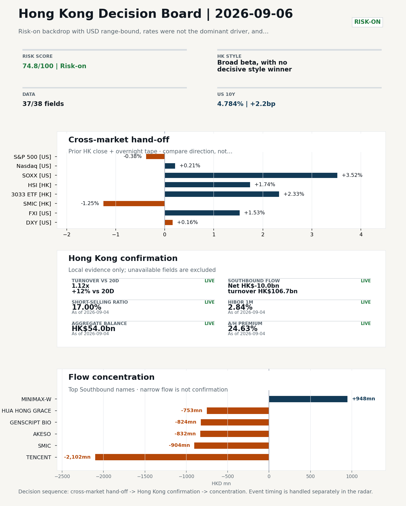
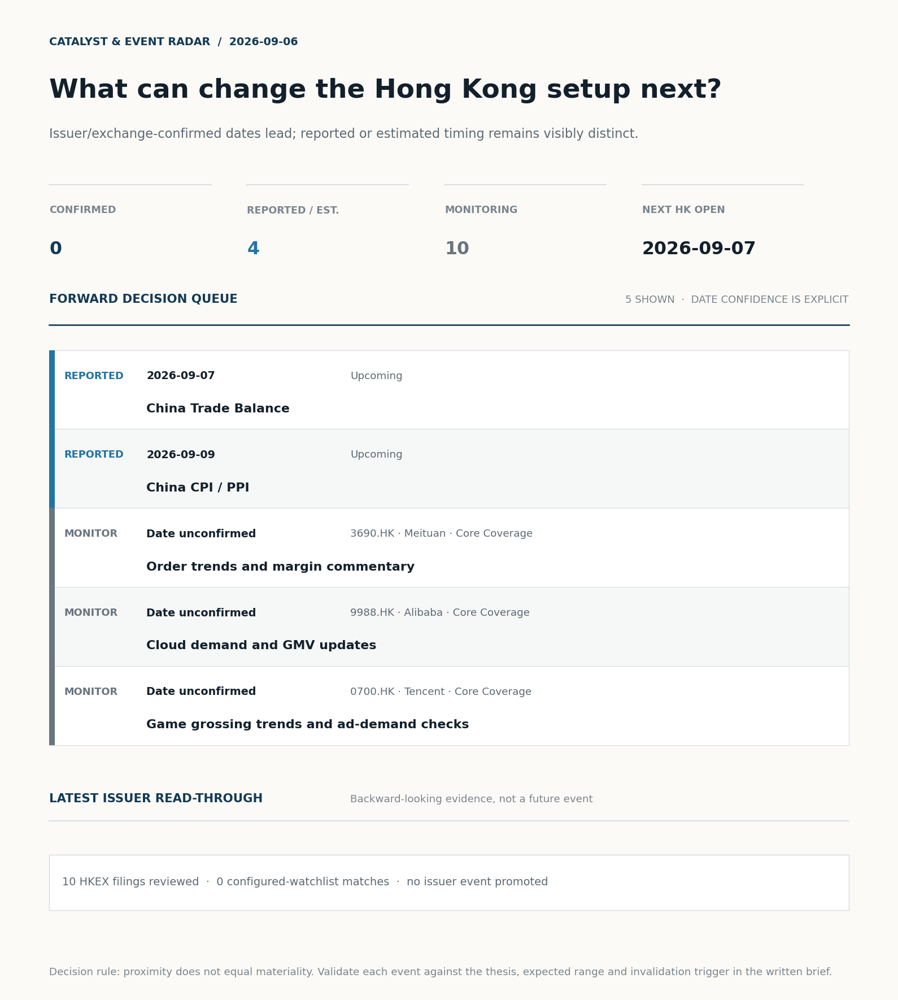
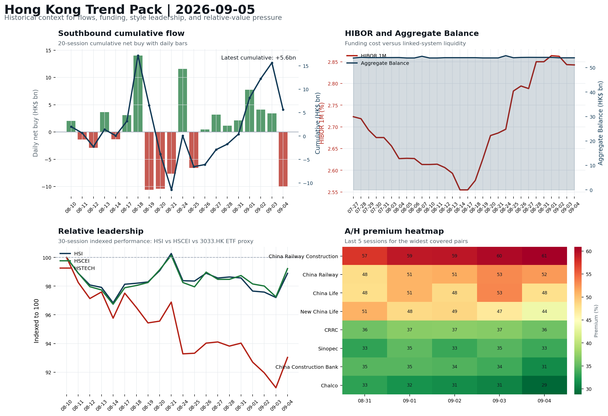

# Morning Research Workbench | 2026-09-06

> **Commute reading route:** `Layer 1 scan (5 min)` → `Layer 2 deep read` → `Layer 3 and appendix if time allows`
>
> Mode: `Weekly Review` | Synthesize the completed Hong Kong week into next-week preparation rather than treating Sunday as a fresh session.

_Data through: US/global `2026-09-04` | HK `2026-09-04` | A-share `2026-09-04` | Generated `2026-09-06 06:54:32`_

## Executive Summary

- **Did yesterday's call work?** NO CALL - The 2026-09-05 report published no directional call (neutral regime).
- **What changed overnight?** Semis led higher: SOXX +3.52%, NVDA +0.84%, TSMC +2.85%. HSI +1.74% and 3033.HK +2.33%.
- **What it means for AI/TMT** No decisive style winner - Broad beta, with no decisive style winner, a 0.31pp spread. Avoid forcing a growth-versus-value call; let volume, Southbound concentration, and the first-hour relative tape identify leadership.
- **What to watch today** Next scheduled catalyst: China Trade Balance on 2026-09-07. Confirm if SMIC and Hua Hong open in the same direction as the overnight leg and hold it through the first hour; invalidate if they track HSCEI instead.

## Layer 1 | Weekly Scan (5 min)

### 1.1 Last Week's Call
**Verdict: NO CALL.** The 2026-09-05 report published no directional call (neutral regime).

**Recent record.** 6 confirmed / 4 broken over the last 10 scoreable calls (60.0% hit rate). This is a directional close-to-close diagnostic, not a track record.

### 1.2 Opening Decision Board

**Global-to-Hong Kong signals**

_Decision-useful subset: each row states the implication and the next test. Descriptive secondary monitors are kept out of the five-minute scan._

| Signal | Last / move | Interpretation | Confirmation / invalidation |
| --- | --- | --- | --- |
| S&P 500 | 7,718.60 / -0.38% | Broad US risk fell without a clear driver in today's fields; treat it as beta, not a signal. | Watch whether Nasdaq and offshore-China proxies move the same way. |
| Nasdaq 100 | 29,544.15 / +0.21% | Growth outperformed broad beta, a supportive style signal for Hong Kong internet and platform names. Growth advanced despite higher yields, showing momentum resilience but also higher reversal sensitivity. | 3033.HK versus HSI leadership carries the read; rising yields would undo it. |
| Hang Seng Index | 25,650.87 / **+1.74%** | The index was carried by growth and platform names, not by broad participation: 3033.HK differs by 0.59pp. | Southbound participation decides whether this is investable or just a print. |
| Hang Seng TECH ETF (3033.HK) | 4.4840 / **+2.33%** | Hong Kong growth led broad beta, improving the platform/internet style signal. | Needs a stable CNH and Southbound buying to become a duration signal. |
| Semiconductors (SOXX) | 519.86 / **+3.52%** | Semis led the Nasdaq by 3.31pp, putting the AI capex trade back in front. | SMIC and Hua Hong at the open show whether it transmits to Hong Kong. |
| US 10Y | 4.7840% / +2.2bp | The yield proxy rose, tightening the discount-rate backdrop for long-duration Hong Kong growth. | Read it through 3033.HK relative performance, not the index level. |
| USD/CNH | 6.7045 / -0.16% | A stronger offshore renminbi supports the external-risk backdrop for Hong Kong equities. | FXI and Southbound flow decide whether this reaches Hong Kong equities. |
| VIX | 14.53 / +1.47% | Higher implied volatility raises the tail-risk premium and weakens risk-on conviction. | Falling volatility on narrowing breadth is a warning, not support. |

_Secondary monitors retained in the source bundle: SMIC (0981.HK), CSI 300, China 10Y, CN-US 10Y spread, DXY, USD/HKD, Brent crude, COMEX gold, Copper._

**Hong Kong local confirmation**

| Check | Value | Status | Source / as of | Why it matters |
| --- | --- | --- | --- | --- |
| Main Board turnover vs 20D | 1.12x \| +12% vs 20D | Live local | HKEX \| 2026-09-04 | Trailing 20-session average turnover was HK$246.3bn. |
| Southbound / Northbound net flow | Southbound Net HK$-10.0bn \| turnover HK$106.7bn \| Northbound Turnover RMB274.2bn \| net not reported | Live local | HKEX Connect \| 2026-09-04 | Southbound net buy is calculated from HKEX disclosed buy and sell turnover. |
| Short-selling ratio | 17.00% | Live local | HKEX \| 2026-09-04 | Official HKEX stock-level short-selling table, aggregated as a share of total market turnover. |
| AH premium index | 24.63% | Live public | Yahoo \| 2026-09-04 | Fixed 10-name basket, equal-weighted, both legs priced on the same date; comparable across dates. Covered-pair average was +27.28% across 18 pairs. |
| USD/HKD spot vs band | 7.8400 \| band 7.7500 to 7.8500 | Live quote + local | Yahoo \| 2026-09-04 | Mid-band: 100 pips from the weak side and 900 pips from the strong side, so the peg is not an active constraint. Official Convertibility Undertakings define the linked-rate stress boundaries for USD/HKD. |
| HIBOR 1M | 2.84% | Live local | HKMA \| 2026-09-04 | 1M HIBOR is the cleanest quick read for Hong Kong funding conditions and equity-duration pressure. |
| Hong Kong leadership | Broad beta, with no decisive style winner | Proxy | HSI / HSCEI / 3033.HK ETF relative \| 2026-09-04 | Use HSI / HSCEI / 3033.HK ETF relative moves as the opening style read. |

**Risk state and evidence**

**Composite risk score:** `74.8/100` | **Regime:** `Risk-on`

| Component | Score impact | Evidence |
| --- | --- | --- |
| US beta | -2.3 | S&P 500 -0.38% |
| HK growth ETF proxy | +10 | 3033.HK ETF +2.33% |
| Semis complex | +9 | SOXX +3.52% |
| Offshore China proxy | +7.7 | FXI +1.53% |
| Dollar pressure | -1.6 | DXY +0.16% |
| Volatility | -2.9 | VIX +1.47% |
| HK short-selling | +0 | Short-selling ratio 17.00% |
| HK turnover | +5 | Turnover 1.12x 20D |

_Base 50 plus the component deltas above. Semis complex entered the score on 2026-08-22; earlier scores in the ledger exclude it._

**Next Week Checklist**

1. **Risk-on backdrop with USD range-bound, rates were not the dominant driver, and FXI outperformed Nasdaq 100**
 Still-moving markets | No fresh Hong Kong cash session is assumed; use global active assets and policy/event flow to prepare the next open.
2. **US Non-Farm Payrolls (Past expected window (unverified))**
 Macro / policy | Watch whether it changes the day's core market narrative | Industries: Market-wide
3. **[A] Aon CEO says insurance broker seeks to build 'premiere middle market platform' with purchase of rival USI**
 News / announcements | Capital allocation or shareholder-return events can trigger a valuation reset
4. **China Trade Balance (Upcoming)**
 Macro / policy | Watch whether it changes the day's core market narrative | Industries: Market-wide

## Visual Dashboard

**Catalyst & Event Radar**

**Chart read:** No issuer/exchange-confirmed event date is populated; 4 reported or estimated timing item(s) and 10 undated trigger(s) remain explicit.

_Source: Public calendars, issuer disclosures and configured research watchlists_
## Layer 2 | Core Research (20-30 min)

### 2.1 Global-to-Hong Kong Transmission
> Weekly review mode: synthesize the completed Hong Kong week, retain the main cross-asset and policy lessons, and convert them into next-week preparation rather than treating Saturday as a fresh cash-market session.

**Market Setup**
**Core tape.** The completed Hong Kong week (2026-08-31 to 2026-09-04) closed risk-on with USD range-bound and rates not the dominant driver, as FXI outperformed Nasdaq 100 overnight into the prior 2026-09-04 HK close.
**Main driver.** Leadership was broad and balanced: 3033.HK ETF +2.33% and HSCEI +2.02% sat within 0.31pp of each other, so conviction is limited despite Main Board turnover at 1.12x the 20-day average.
**HK relevance.** A -HK$10.0bn Southbound net sell on the final session argues against over-reading the breadth.

**Key Drivers**
- FXI outperforming Nasdaq 100 by 0.51pp overnight supported the offshore-China leg of the prior HK rally, consistent with the supplied driver decomposition that anchors the risk-on read.
- Main Board turnover at 1.12x the 20-day average (vs HK$246.3bn trailing average) supports credibility of the price move, though the -HK$10.0bn Southbound net sell tempers conviction on local money follow-through.
- 3033.HK ETF versus HSCEI spread of only 0.31pp indicates balanced style leadership rather than a decisive growth-versus-value winner, so the next session should be read off HSI breadth and Southbound concentration rather than a pre-set style call.
- US semis strength (SOXX +3.52%, TSMC +2.85%) did not transmit cleanly to HK semis (SMIC -1.25%, Hua Hong -8.43%), flagging that the prior-week HK tape was not a clean AI/foundry expression despite supportive overseas signals.

**Hong Kong Read-Through**
**Opening implication.** Carry the prior week's broad-beta base case into the 2026-09-07 open, but re-classify leadership only if 3033.HK ETF or HSCEI opens a sustained 0.5pp relative lead with flow confirmation.
_Hong Kong style leadership and flow confirmation are set out in the Hong Kong review below._

**Watch Points**
- USD composite moved higher by +0.10pct intraday, with a 0.244pct range.
- Main turning points appeared around 2026-09-04 08:15 peak / 2026-09-04 08:30 peak / 2026-09-04 08:50 trough, suggesting event-driven repricing rather than a clean one-way USD move.
- The biggest cross-asset divergence was FXI versus Nasdaq 100, a spread of 0.51pct.
- Gold moved -0.86pct intraday with a 2.414pct high-low range.

**Weekly Review Map**
- Weekly review window: 2026-08-31 to 2026-09-04. Core regime: Risk-on backdrop with USD range-bound, rates were not the dominant driver, and FXI outperformed Nasdaq 100. Hong Kong leadership: Leadership was broad and balanced.
- Method note: Trend summary uses the latest available five observations from the Hong Kong Trend Pack inputs.

**Cross-asset weekly dashboard**

| Asset | Latest move | Weekly read |
| --- | --- | --- |
| S&P 500 | -0.38% | Risk appetite |
| Nasdaq 100 | +0.21% | Growth style |
| Hang Seng Index | +1.74% | Hong Kong beta |
| Hang Seng TECH ETF (3033.HK) | +2.33% | Hong Kong growth / internet proxy |
| DXY | +0.16% | Global liquidity |
| US 10Y Treasury Yield | +2.2bp | Rates path |
| Gold | -1.38% | Hedge / real yields |
| VIX | +1.47% | Volatility and hedging |

**Hong Kong / China weekly tape**

| Signal | Latest move | Read |
| --- | --- | --- |
| Hang Seng Index | +1.74% | Hong Kong beta |
| Hang Seng China Enterprises Index | +2.02% | China SOE / H-share tone |
| Hang Seng TECH ETF (3033.HK) | +2.33% | Hong Kong growth / internet proxy |
| China Large-Cap (FXI) | +1.53% | China sentiment |
| USD/CNH | -0.16% | China FX sentiment |
| USD/HKD | -0.02% | Hong Kong funding lens |

**Five-session trend evidence**
_Window: 2026-08-31 to 2026-09-04_

| Signal | Five-session change | Latest | Desk read |
| --- | --- | --- | --- |
| Southbound flow | +7.4bn over 5 sessions | -10.0bn | 4/5 positive sessions; cumulative buying is the flow-confirmation test for next week. |
| HKD funding | HIBOR -1bp; Aggregate Balance -0.2bn | 2.84% / HK$54.0bn | Funding stress matters if HIBOR rises while Aggregate Balance contracts. |
| HK style leadership | HSCEI led (+0.5pp); HSTECH lagged (-1.0pp) | HSCEI leadership | Use HSI / HSCEI / 3033.HK ETF spread to separate broad beta from growth-led rerating. |
| A/H premium dispersion | -0.9pp average change | 41.7% average premium | Premium narrowing can support H-share relative demand |

**Flow and attribution clues**
- :

**Next-week desk questions**
- Did Southbound flow confirm the index move, or was the week mainly offshore beta without local money follow-through?
- Did HIBOR and Aggregate Balance point to benign funding, or should tighter HKD liquidity be part of next week's risk case?
- Was leadership broad enough beyond the 3033.HK ETF / platform beta proxy, or was the week concentrated in a narrow style pocket?
- Which dated macro, policy, earnings, or IPO catalyst can realistically change the next-week narrative?
- What single data point would invalidate the base-case market pulse by Monday or Tuesday morning?

**Key developments to retain**

| Bucket | Item | Why it matters |
| --- | --- | --- |
| A | Aon CEO says insurance broker seeks to build 'premiere middle | Capital allocation or shareholder-return events can trigger a valuation reset |
| Past expected window (unverified) | US Non-Farm Payrolls | Watch whether it changes the day's core market narrative |
| Upcoming | China Trade Balance | Watch whether it changes the day's core market narrative |
| Upcoming | China CPI / PPI | China demand strength, PPI pass-through, and policy-easing odds |

**Next-week playbook**

| Date | Catalyst | Desk read |
| --- | --- | --- |
| 2026-09-07 | China Trade Balance | Watch whether it changes the day's core market narrative |
| 2026-09-09 | China CPI / PPI | China demand strength, PPI pass-through, and policy-easing odds |
| 2026-09-12 | China Aggregate Financing / New Loans | Watch whether it changes risk budgets or the theme-trading cadence |
| 2026-09-12 | US CPI | Watch whether it changes risk budgets or the theme-trading cadence |

**Curated overnight stories**
1. **China hits back at G20 statement on its reliance on exports, accusing them of 'promoting**
 Why it matters: It signals China is pushing back on multilateral criticism of its export-led growth model.
 HK read-through: Relevant for Hong Kong-exposed exporters, trade-sensitive industrials, and China policy sentiment heading into next week.
2. **New York Fed's Williams says yield surge due to strong economic prospects**
 Why it matters: It is senior US rate-speak reframing the recent yield move as growth-driven rather than a policy-tightening signal, which feeds the global rates narrative.
 HK read-through: Sets the tone for US Treasury direction into the 2026-09-07 open.
3. **Aon CEO says insurance broker seeks to build 'premiere middle market platform' with**
 Why it matters: Large US insurance-broker M&A is a capital-allocation event that can reset sector valuation comps and read across to global brokers and financial intermediaries.
 HK read-through: Most relevant for Hong Kong-listed insurance and financial-intermediary names with US comparables.
4. **White House has vetted candidates for key CFTC vacancies, sources tell CNBC**
 Why it matters: CFTC personnel decisions affect US derivatives and crypto regulatory posture, which can influence global risk-asset sentiment and crypto-related Hong Kong names.
 HK read-through: Indirect read-across only; secondary for the Hong Kong open but worth tracking for crypto and digital-asset-exposed Hong Kong listings given Bitcoin's third consecutive…
5. **Bitcoin heads for third winning week in a row as macro pressures mount**
 Why it matters: It documents persistent crypto strength into a risk-on tape, relevant for sentiment framing even though the driver is not clearly identified from the supplied facts.
 HK read-through: Relevant for Hong Kong-listed crypto and digital-asset-exposed names and as a sentiment gauge. The 'macro pressures mount' phrasing is not explained by the supplied facts.

**AI / TMT hand-off**

**Overnight leg.** The overnight semis leg was risk-on at +2.40% average (SOXX +3.52%, NVDA +0.84%, TSMC +2.85%).
**Hong Kong expression.** SMIC, Hua Hong and Sunny Optical are best placed at the open, and 3033.HK should be tested before the Hang Seng Index.
**Observable test.** Confirm if SMIC and Hua Hong open in the same direction as the overnight leg and hold it through the first hour; invalidate if they track HSCEI instead, which would mean local flow is overriding the global cycle.

| Name | Role in the chain | 1D | Leg |
| --- | --- | --- | --- |
| SOXX | Semis complex | +3.52% | overnight |
| NVDA | AI capex narrative | +0.84% | overnight |
| TSMC | Foundry demand | +2.85% | overnight |
| SMIC | Leading-edge / domestic substitution | -1.25% | Hong Kong |
| Hua Hong | Mature-node pricing cycle | -8.43% | Hong Kong |
| Sunny Optical | Hardware and optics supply chain | -0.14% | Hong Kong |
| 3033.HK ETF | Broad HK tech beta | +2.33% | Hong Kong |

**Clock discipline.** The Hong Kong rows are the prior cash-session close and predate the US overnight leg. Use them as the inherited local setup only; validate transmission on today's Hong Kong open, first hour and close.
**Single-name outlier.** Hua Hong -8.43%, 3033.HK ETF +2.33% moved far outside the rest of the Hong Kong leg. Treat as company-specific until checked; do not read it as a cycle signal.

### 2.2 Hong Kong Local Tape and Flow
**Local Tape Setup**
**Local read.** The completed Hong Kong week (2026-08-31 to 2026-09-04) closed risk-on with USD range-bound and rates not the dominant driver.
**Verification point.** Style leadership was balanced rather than decisive: 3033.HK ETF +2.33% and HSCEI +2.02% sat within 0.31pp, so the week does not cleanly separate growth from SOE/value.
**Risk to watch.** The unresolved read-through is the semis split, with US SOXX +3.52% and TSMC +2.85% failing to transmit to SMIC -1.25% and Hua Hong -8.43%, and a -HK$10.0bn Southbound net sell on the final session argues against over-interpreting breadth.

**Style and Local Leadership**
**Style call.** Broad beta, with no decisive style winner.
- **Evidence:** 3033.HK and HSCEI were separated by only 0.31pp (+2.33% versus +2.02%)
- **Portfolio meaning:** Avoid forcing a growth-versus-value call; let volume, Southbound concentration, and the first-hour relative tape identify leadership.
- **Cross-market read:** Hang Seng +1.74% / HSCEI +2.02% / 3033.HK ETF +2.33%. Offshore China proxy FXI +1.53% and USD/CNH -0.16% frame cross-border risk appetite. USD/HKD last traded around 7.8400, which keeps the Hong Kong funding lens in focus.

**Flow Confirmation**
Official Stock Connect evidence is available; the Flow Tracker confirms whether local money supports the price action.

**Follow-Through Checklist**
**Follow-through check.** Actionable confirmation test for the 2026-09-07 open: (1) 3033.HK ETF relative to HSCEI opens a sustained >0.5pp lead with above-1.0x volume and positive Southbound net flow in the first hour, confirming growth leadership.
**Failure condition.** Reclassify the tape when either 3033.HK or HSCEI opens a sustained 0.5pp relative lead with flow confirmation.

**Cross-asset attribution**

| Driver | Direction | Score | Evidence | HK implication |
| --- | --- | --- | --- | --- |
| Hong Kong participation | supportive | 1.24 | Main Board turnover was 1.12x the 20-session average. | Higher participation makes local price action more credible. |

**Local flow evidence**

**Flow Takeaways**
- Hong Kong participation is active and short pressure is not excessive, so local confirmation looks healthier.
- Stock Connect Southbound: net HK$-10.0bn on turnover HK$106.7bn (as of 2026-09-04).
- Stock Connect Northbound: turnover RMB274.2bn; public file provides total turnover/top active names, not full net-buy.
- AH premium: fixed 10-name basket +24.63% (comparable across dates); covered-pair average +27.28% over 18 pairs; widest premium: China Railway Construction 60.92%.

**Stock Connect Southbound Active Names**

| # | Ticker | Name | Buy | Sell | Net buy | HKEX turnover rank |
| --- | --- | --- | --- | --- | --- | --- |
| 1 | 00700.HK | TENCENT | HK$1,322.3mn | HK$3,424.3mn | HK$-2,102.0mn | 1 |
| 2 | 00100.HK | MINIMAX-W | HK$3,734.5mn | HK$2,786.8mn | HK$947.6mn | 1 |
| 3 | 00981.HK | SMIC | HK$1,808.4mn | HK$2,712.1mn | HK$-903.7mn | 2 |
| 4 | 09926.HK | AKESO | HK$929.2mn | HK$1,760.8mn | HK$-831.5mn | 7 |
| 5 | 01548.HK | GENSCRIPT BIO | HK$957.3mn | HK$1,781.7mn | HK$-824.4mn | 8 |

**AH Premium Dispersion**

| Name | A ticker | H ticker | Premium | As of |
| --- | --- | --- | --- | --- |
| China Railway Construction | 601186.SS | 1186.HK | +60.92% | 2026-09-04 |
| China Railway | 601390.SS | 0390.HK | +52.22% | 2026-09-04 |
| China Life | 601628.SS | 2628.HK | +47.90% | 2026-09-04 |

**HKEX Short-Selling Watch**

| Ticker | Name | Short ratio | Short turnover | Total turnover |
| --- | --- | --- | --- | --- |
| 00388.HK | HKEX | 14.12% | HK$0.2bn | HK$1.5bn |
| 00700.HK | TENCENT | 6.36% | HK$0.7bn | HK$10.7bn |
| 00941.HK | CHINA MOBILE | 5.79% | HK$0.1bn | HK$1.5bn |

- **Short-value leaders:** 02800.HK TRACKER FUND (HK$7.8bn); 03033.HK CSOP HS TECH (HK$2.5bn); 07709.HK XL2CSOPHYNIX (HK$1.5bn); 02513.HK Z.AI (HK$1.4bn).

### 2.3 Macro Transmission
**Desk read.** Weekly review window 2026-08-31 to 2026-09-04: Hong Kong traded in a risk-on regime with a range-bound USD and rates not the dominant driver.

**Market sensitivity.** Southbound flow turned supportive (+7.4bn over 5 sessions, 4/5 positive) while the latest session showed a -10.0bn print, so cumulative buying is the flow-confirmation test for the 9/7 open.

**HK implication.** HKD funding stayed benign (HIBOR -1bp to 2.84%, Aggregate Balance -0.2bn to HK$54.0bn); a HIBOR rise combined with further Aggregate Balance contraction is the watchable stress signal.

**Macro watchpoints**
- China Trade Balance on 9/7: export surprise versus consensus is the first test of shipping, electronics, and industrial-complex leadership into
- China CPI/PPI on 9/9: PPI print is the more useful series for H-share margin direction and for repricing policy-easing odds.
- Southbound flow on 9/7: whether the -10.0bn latest print extends or reverses is the direct test of whether last week's +7.4bn cumulative buying
- HIBOR and Aggregate Balance into 9/7: a HIBOR rise paired with Aggregate Balance contraction is the trigger condition for tightening the

| Time | Region | Event | Status | Desk read |
| --- | --- | --- | --- | --- |
| | US | US Non-Farm Payrolls | Past expected window (unverified) | Impact: Watch whether it changes the day's core market narrative \| Attention: 5/5 \| Industries: Market-wide |
| | CN | China Trade Balance | Upcoming | Impact: Watch whether it changes the day's core market narrative \| Attention: 3/5 \| Industries: Market-wide |
| | CN | China CPI / PPI | Upcoming | Impact: China demand strength, PPI pass-through, and policy-easing odds \| Attention: 3/5 \| Industries: Consumer, Materials, Property |

**Positioning and risk backdrop**

- Detailed local flow evidence is covered under Flow Tracker and Attribution; keep this section focused on options, hedging, and macro-positioning risk.

### 2.4 Company Micro Research and Catalysts

| Grade | Sector | Headline | Why it matters | Horizon |
| --- | --- | --- | --- | --- |
| A | Financials | Aon CEO says insurance broker seeks to build 'premiere middle market | Capital allocation or shareholder-return events can trigger a valuation | Medium-term trend |

**Company Event Takeaway**
**Desk read.** The completed HK week (2026-08-31 to 2026-09-04) ran in a risk-on tape with rates not the dominant driver and FXI outperforming the Nasdaq 100.
**Why it matters.** Core-coverage internet names led the move.
**Follow-up.** The Hang Seng TECH ETF (3033.HK, +2.33%) and HSCEI ETF (2828.HK, +2.22%, at the top of its 60-session band) confirmed that both growth and H-share leadership participated, so next week we frame the question as whether the rally can broaden beyond a catalyst-led internet move.

**LLM Quick Takes**
- **3690.HK** | Fact: +5.28% on the reference session to HK$81.75, mid-range at 59% of its 60-session band; Q2 results showed core local commerce returning to profit and Keeta's international expansion.…
- **9988.HK** | Fact: +2.42% to HK$110.10, mid-range at 53%; HK$80bn (US$10.2bn) placement disclosed alongside the Wan3.0 launch, with the source flagging shareholder-funded AI investment as the open…
- **1299.HK** | Fact: +0.96% to HK$77.50, top of 60-session range at 82.6%; no attached headlines. Investor read: monitor-only - top-of-range positioning with no fresh news means the stock is not…
- **1211.HK** | Fact: +0.53% to HK$86.15, mid-range at 61%; no attached headlines; earnings window is 2026-10-29 (53 days out). Investor read…

Decision filter<h4>No immediate portfolio catalyst: 10 official filings were screened and the low-signal market set stays aggregated.</h4>
10 profit warnings

<strong>10</strong>Official filings

<strong>0</strong>Watchlist hits

<strong>0</strong>Actionable events

<strong>No event cleared the portfolio decision filter.</strong>

Broad-market filings remain traceable in the source appendix; they are not expanded here without a watchlist, estimate or liquidity read-through.

<strong>Coverage boundary.</strong> sell-side rating changes, IPO / grey-market monitor were not decision-grade in this run; their absence is not treated as confirmation that no event exists.

**Core coverage requiring follow-up**

**Core coverage**

| Name | Ticker | Last | 1D | Range position | Morning note |
| --- | --- | --- | --- | --- | --- |
| Meituan | 3690.HK | 81.75 | +5.28% | Mid-range | Up 5.28% on the session, mid-range at 59% of its 60-session band. |
| Alibaba | 9988.HK | 110.10 | +2.42% | Mid-range | Up 2.42% on the session, mid-range at 53% of its 60-session band. |

**Recent headlines for Meituan:**
- [Meituan (MPNGF) (Q2 2026) Earnings Call Highlights: Record Revenue and Strategic AI Pivot Drive...](https://finance.yahoo.com/markets/stocks/articles/meituan-mpngf-q2-2026-earnings-190123345.html) (GuruFocus.com)
**Recent headlines for Alibaba:**
- [Alibaba's Wan3.0 Expands Its AI Ambitions, Could Shareholders Be Paying the Bill?](https://finance.yahoo.com/technology/ai/articles/alibaba-wan3-0-expands-ai-000524030.html) (Insider Monkey)

**Priority follow-up**

| Name | Ticker | Last | 1D | Range position | Morning note |
| --- | --- | --- | --- | --- | --- |
| AIA | 1299.HK | 77.50 | +0.96% | Top of range | Marginally higher (+0.96%), in the top quartile of its 60-session range (83%). |
| BYD Company | 1211.HK | 86.15 | +0.53% | Mid-range | Marginally higher (+0.53%), mid-range at 61% of its 60-session band. |

### 2.5 Morning Meeting Questions
**Q1. The index rose but Southbound sold - is the move real?**
- **Evidence:** HSI +1.74% against Southbound net -10.0bn HKD.
- **How to answer:** Treat it as unconfirmed. Price and mainland flow disagreed, so the price move was not driven by Southbound participation; it needs another session of confirmation before being read as a trend.

## Layer 3 | Session Playbook (8-12 min)

### 3.1 Base Case and Scenario Map
**Starting posture.** Broad beta, with no decisive style winner (medium confidence); composite risk `74.8/100` (Risk-on). Avoid forcing a growth-versus-value call; let volume, Southbound concentration, and the first-hour relative tape identify leadership.

**Scenario map**

| Scenario | Observable trigger | Interpretation | Research response |
| --- | --- | --- | --- |
| Selective growth confirms | 3033.HK keeps a >0.5pp first-hour lead over HSCEI; SMIC and Hua Hong stop lagging broad beta; CNH is stable. | The prior style split has live price confirmation, but is not yet broad China risk-on. | Prioritize internet/platform relative strength; verify participation again at the close. |
| Broad beta takes over | HSI and HSCEI rise together, breadth improves and the 3033.HK lead narrows without turning negative. | Leadership is broadening from a style trade into market beta. | Expand the research set from growth leaders to financials, SOEs and index-heavy names. |
| Risk-off continuation | 3033.HK loses its lead, semis underperform HSCEI and CNH depreciation accelerates. | The prior divergence was a temporary pocket of strength rather than a durable hand-off. | Treat rebounds as unconfirmed; focus on balance-sheet, catalyst and crowding risk. |

**Clocked validation scorecard**

| Window | Check | Prior evidence | Pass condition | What it decides |
| --- | --- | --- | --- | --- |
| 09:30-10:30 | 3033.HK vs HSCEI | +0.31pp at the prior close | 3033.HK retains >0.5pp relative lead | Whether growth leadership survives the open |
| 09:30-10:30 | Semiconductor hand-off | SMIC -1.25%; Hua Hong Semiconductor -8.43% | Stabilise after the open; at least one stops underperforming HSCEI | Whether overnight semis pressure is contained locally |
| 09:30-10:30 | HSI price zone | 25,651 vs 25,500 / 26,000 reference grid | Hold above the lower grid or reclaim the upper grid with breadth | Whether broad beta is stabilising; grid is derived, not technical analysis |
| 09:30-10:30 | USD/CNH | 6.7045 \| -0.16% | No acceleration in CNH depreciation | Whether FX permits a clean Hong Kong risk extension |
| At close | Turnover | 1.12x \| +12% vs 20D | At least 1.0x the 20-session average | Whether the move had normal participation |
| At close | Southbound | Net HK$-10.0bn \| turnover HK$106.7bn | Net buying remains positive and broadens beyond one or two names | Whether mainland money confirms the price move |
| At close | Short pressure | 17.00% | Falls versus the prior verified reading (17.00%) | Whether rebound conviction improved |

**Upgrade rule.** Confirm a broad-beta session only if HSI breadth and turnover improve without a sharp 3033.HK-versus-HSCEI split.
**Kill switch.** Reclassify the tape when either 3033.HK or HSCEI opens a sustained 0.5pp relative lead with flow confirmation.
**Clock discipline.** At 07:30, same-day Southbound, turnover and short-selling outcomes are not known. Use the first-hour price/FX checks provisionally and make the final classification only after the close.
**Event clock.** No same-day decision-grade item is populated; the nearest reported/estimated item is China Trade Balance on 2026-09-07. Verify the issuer or official calendar before relying on the date.

### 3.2 Daily One Chart
**Daily One Chart | HKEX short-selling pressure map**

**Chart read.** Market short-selling reached 17.00% of turnover.
**Why it matters.** The chart leads today because the pressure is either broad, concentrated, or acute in the top name.

_Source: HKEX Daily Quotations - Short Selling Turnover_

### 3.3 Hong Kong Trend Pack
**Hong Kong Trend Pack**

**Trend read.** Four historical lenses: Southbound cumulative flow, HKMA funding and liquidity, HSI/HSCEI/3033.HK ETF relative leadership, and A/H premium dispersion.

_Source: HKEX Stock Connect, HKMA liquidity data, and public Yahoo Finance quotes_

## Optional Appendix | Traceability and Performance (10-15 min)

### Report Metadata
> Date policy: Review date 2026-09-05 is treated as `Weekly Review`. | Global (US/Europe) data date is 2026-09-04; adapter effective date is 2026-09-04 and summary date is 2026-09-04. | Hong Kong local data date is 2026-09-04; role: last completed HK/China cash-market reference tape.
> Market data quality: Coverage: `37/38` | Missing: `1`
> Report quality: `95.6/100` | Grade `A` | Status `usable with caveats`

### Report Quality and Validation
- **Quality score:** 95.6/100 | **Grade:** A | **Status:** usable with caveats
- **Run summary:** 8 healthy | 2 caveat | 0 failed
- **Release recommendation:** Send with caveats | The report is usable, but the advisory guidance should travel with it so readers understand the data gaps.

| Source | Status | Bucket |
| --- | --- | --- |
| Macro calendar | partial | caveat |
| Risk and sentiment feed | partial | caveat |

**Narrative fact-check guardrail**
- Checked 24 numeric claims; 0 numeric mismatch(es), 0 logic warning(s); 13 structured claims, 0 source/text warning(s); 0 critical, 0 review.

_Full component weights, per-source freshness, adapter status and provenance records are archived with this report under `audit/` rather than printed here._

### Historical Signal Performance
- **Readiness:** exploratory with caveats | 69 observations | 94 active signal dates | next-close entry, 10bps cost, no same-day returns.
- **Interpretation boundary:** exploratory until a benchmark reaches 252 sessions and 100 active-signal sessions.
- **Data-quality caveat:** 23 conflicting price revision(s) and 6 non-session observation(s) remain in the research ledger.
- **Daily-use boundary:** cumulative return, Sharpe and the performance chart stay out of the daily commute edition until the sample and trading-calendar gates pass; use Yesterday's Call instead.

### Source Links
- [Aon CEO says insurance broker seeks to build 'premiere middle market platform' with purchase of rival USI](https://www.cnbc.com/2026/08/31/aon-ceo-says-usi-deal-seeks-to-build-premiere-middle-market-insurance-platform.html) (cnbc_markets)
- [Meituan (MPNGF) (Q2 2026) Earnings Call Highlights: Record Revenue and Strategic AI Pivot Drive...](https://finance.yahoo.com/markets/stocks/articles/meituan-mpngf-q2-2026-earnings-190123345.html) (GuruFocus.com)
- [Meituan Returns to Profit as Food-Delivery Competition Eases](https://www.wsj.com/business/earnings/meituan-returns-to-profit-as-food-delivery-competition-eases-1026a0e9?siteid=yhoof2&yptr=yahoo) (The Wall Street Journal)
- [Alibaba's Wan3.0 Expands Its AI Ambitions, Could Shareholders Be Paying the Bill?](https://finance.yahoo.com/technology/ai/articles/alibaba-wan3-0-expands-ai-000524030.html) (Insider Monkey)
- [00722.HK Profit warning / alert announcement](http://www1.hkexnews.hk/listedco/listconews/sehk/2026/0904/2026090402367.pdf) (HKEXnews)
- [00333.HK Profit warning / alert announcement](http://www1.hkexnews.hk/listedco/listconews/sehk/2026/0831/2026083100934.pdf) (HKEXnews)
- [01496.HK Profit warning / alert announcement](http://www1.hkexnews.hk/listedco/listconews/sehk/2026/0831/2026083100716.pdf) (HKEXnews)
- [00875.HK Profit warning / alert announcement](http://www1.hkexnews.hk/listedco/listconews/sehk/2026/0828/2026082801978.pdf) (HKEXnews)
- [01152.HK Profit warning / alert announcement](http://www1.hkexnews.hk/listedco/listconews/sehk/2026/0828/2026082800863.pdf) (HKEXnews)
- [01255.HK Profit warning / alert announcement](http://www1.hkexnews.hk/listedco/listconews/sehk/2026/0828/2026082802456.pdf) (HKEXnews)
- [01518.HK Profit warning / alert announcement](http://www1.hkexnews.hk/listedco/listconews/sehk/2026/0828/2026082804114.pdf) (HKEXnews)
- [01561.HK Profit warning / alert announcement](http://www1.hkexnews.hk/listedco/listconews/sehk/2026/0828/2026082802706.pdf) (HKEXnews)
