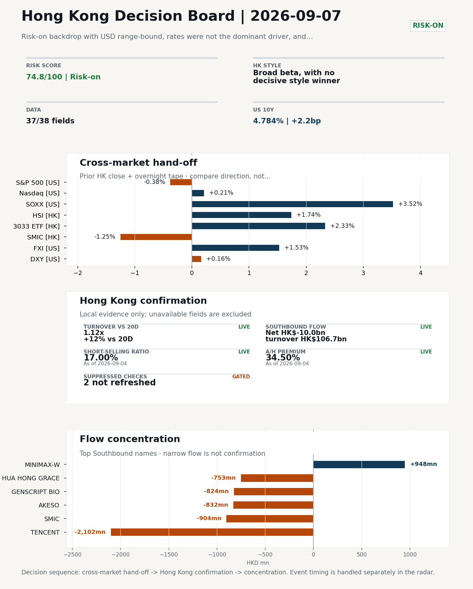
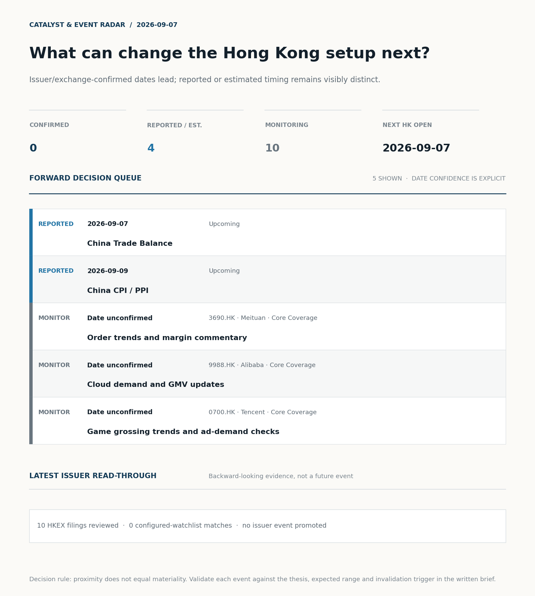

# Morning Research Workbench | 2026-09-07

> **Commute reading route:** `Layer 1 scan (5 min)` → `Layer 2 deep read` → `Layer 3 and appendix if time allows`
>
> Mode: `Week Ahead` | Use Friday's close as the baseline, lay out the week's calendar, and name the key things to watch.

_Data through: US/global `2026-09-04` | HK `2026-09-04` | A-share `2026-09-04` | Generated `2026-09-07 06:54:54`_

## Executive Summary

- **Did yesterday's call work?** NO CALL - The 2026-09-05 report published no directional call (neutral regime).
- **What changed overnight?** Semis led higher: SOXX +3.52%, NVDA +0.84%, TSMC +2.85%. HSI +1.74% and 3033.HK +2.33%.
- **What it means for AI/TMT** No decisive style winner - Broad beta, with no decisive style winner, a 0.31pp spread. Avoid forcing a growth-versus-value call; let volume, Southbound concentration, and the first-hour relative tape identify leadership.
- **What to watch today** China Trade Balance. Confirm if SMIC and Hua Hong open in the same direction as the overnight leg and hold it through the first hour; invalidate if they track HSCEI instead.

## Layer 1 | Reset (5 min)

### 1.1 Last Session's Call
**Verdict: NO CALL.** The 2026-09-05 report published no directional call (neutral regime).

**Recent record.** 6 confirmed / 4 broken over the last 10 scoreable calls (60.0% hit rate). This is a directional close-to-close diagnostic, not a track record.

### 1.2 Opening Decision Board

**Global-to-Hong Kong signals**

_Decision-useful subset: each row states the implication and the next test. Descriptive secondary monitors are kept out of the five-minute scan._

| Signal | Last / move | Interpretation | Confirmation / invalidation |
| --- | --- | --- | --- |
| S&P 500 | 7,718.60 / -0.38% | Broad US risk fell without a clear driver in today's fields; treat it as beta, not a signal. | Watch whether Nasdaq and offshore-China proxies move the same way. |
| Nasdaq 100 | 29,544.15 / +0.21% | Growth outperformed broad beta, a supportive style signal for Hong Kong internet and platform names. Growth advanced despite higher yields, showing momentum resilience but also higher reversal sensitivity. | 3033.HK versus HSI leadership carries the read; rising yields would undo it. |
| Hang Seng Index | 25,650.87 / **+1.74%** | The index was carried by growth and platform names, not by broad participation: 3033.HK differs by 0.59pp. | Southbound participation decides whether this is investable or just a print. |
| Hang Seng TECH ETF (3033.HK) | 4.4840 / **+2.33%** | Hong Kong growth led broad beta, improving the platform/internet style signal. | Needs a stable CNH and Southbound buying to become a duration signal. |
| Semiconductors (SOXX) | 519.86 / **+3.52%** | Semis led the Nasdaq by 3.31pp, putting the AI capex trade back in front. | SMIC and Hua Hong at the open show whether it transmits to Hong Kong. |
| US 10Y | 4.7840% / +2.2bp | The yield proxy rose, tightening the discount-rate backdrop for long-duration Hong Kong growth. | Read it through 3033.HK relative performance, not the index level. |
| USD/CNH | 6.7045 / -0.16% | A stronger offshore renminbi supports the external-risk backdrop for Hong Kong equities. | FXI and Southbound flow decide whether this reaches Hong Kong equities. |
| VIX | 14.53 / +1.47% | Higher implied volatility raises the tail-risk premium and weakens risk-on conviction. | Falling volatility on narrowing breadth is a warning, not support. |

_Secondary monitors retained in the source bundle: SMIC (0981.HK), CSI 300, China 10Y, CN-US 10Y spread, DXY, USD/HKD, Brent crude, COMEX gold, Copper._

**Hong Kong local confirmation**

_Coverage gate: 1 unavailable local checks are suppressed here and retained in validation metadata._

| Check | Value | Status | Source / as of | Why it matters |
| --- | --- | --- | --- | --- |
| Main Board turnover vs 20D | 1.12x \| +12% vs 20D | Live local | HKEX \| 2026-09-04 | Trailing 20-session average turnover was HK$246.3bn. |
| Southbound / Northbound net flow | Southbound Net HK$-10.0bn \| turnover HK$106.7bn \| Northbound Turnover RMB274.2bn \| net not reported | Live local | HKEX Connect \| 2026-09-04 | Southbound net buy is calculated from HKEX disclosed buy and sell turnover. |
| Short-selling ratio | 17.00% | Live local | HKEX \| 2026-09-04 | Official HKEX stock-level short-selling table, aggregated as a share of total market turnover. |
| AH premium index | 34.50% | Live public | Yahoo \| 2026-09-04 | Equal-weighted average across 16 A/H pairs that resolved today. Composition varies by day, so the level is not comparable with prior reports (fixed basket incomplete: missing Ping An). [trimmed] |
| USD/HKD spot vs band | 7.8400 | Live quote | Yahoo \| 2026-09-04 | Mid-band: 100 pips from the weak side and 900 pips from the strong side, so the peg is not an active constraint. |
| Hong Kong leadership | Broad beta, with no decisive style winner | Proxy | HSI / HSCEI / 3033.HK ETF relative \| 2026-09-04 | Use HSI / HSCEI / 3033.HK ETF relative moves as the opening style read. |

**Risk state and evidence**

**Composite risk score:** `74.8/100` | **Regime:** `Risk-on`

| Component | Score impact | Evidence |
| --- | --- | --- |
| US beta | -2.3 | S&P 500 -0.38% |
| HK growth ETF proxy | +10 | 3033.HK ETF +2.33% |
| Semis complex | +9 | SOXX +3.52% |
| Offshore China proxy | +7.7 | FXI +1.53% |
| Dollar pressure | -1.6 | DXY +0.16% |
| Volatility | -2.9 | VIX +1.47% |
| HK short-selling | +0 | Short-selling ratio 17.00% |
| HK turnover | +5 | Turnover 1.12x 20D |

_Base 50 plus the component deltas above. Semis complex entered the score on 2026-08-22; earlier scores in the ledger exclude it._

**This Week Checklist**

1. **Risk-on backdrop with USD range-bound, rates were not the dominant driver, and FXI outperformed Nasdaq 100**
 Still-moving markets | No fresh Hong Kong cash session is assumed; use global active assets and policy/event flow to prepare the next open.
2. **US Non-Farm Payrolls (Past expected window (unverified))**
 Macro / policy | Watch whether it changes the day's core market narrative | Industries: Market-wide
3. **China Aggregate Financing / New Loans (Upcoming)**
 Macro / policy | Credit expansion, domestic demand chains, and financials | Industries: Banks, Property chain, Infrastructure
4. **US CPI (Upcoming)**
 Macro / policy | Rates expectations, the dollar, and growth-equity valuation | Industries: Technology, Internet, Brokers

## Visual Dashboard

**Catalyst & Event Radar**

**Chart read:** No issuer/exchange-confirmed event date is populated; 4 reported or estimated timing item(s) and 10 undated trigger(s) remain explicit.

_Source: Public calendars, issuer disclosures and configured research watchlists_
## Layer 2 | Core Research (20-30 min)

### 2.1 This Week at a Glance
**Week Ahead Map**
- Week ahead (2026-09-07 to 2026-09-11) opens against a `Risk-on` backdrop, using Friday's close (2026-09-04) as the baseline.

**This Week's Key Events**

| Date | Type | Event | Why it matters |
| --- | --- | --- | --- |
| 2026-09-07 | Upcoming | China Trade Balance | Watch whether it changes the day's core market narrative |
| 2026-09-09 | Upcoming | China CPI / PPI | China demand strength, PPI pass-through, and policy-easing odds |

**This Week's Calendar**
_Market open per day: HK ✓/✗, US ✓/✗, CN ✓/✗._

| Day | Markets open | Dated catalysts |
| --- | --- | --- |
| 2026-09-07 Mon | HK✓ US✗ CN✓ | China Trade Balance |
| 2026-09-08 Tue | HK✓ US✓ CN✓ | - |
| 2026-09-09 Wed | HK✓ US✓ CN✓ | China CPI / PPI |
| 2026-09-10 Thu | HK✓ US✓ CN✓ | - |
| 2026-09-11 Fri | HK✓ US✓ CN✓ | - |

**Base Case / Risk Case**
- **Base case:** Risk-on continuation: leadership stays with growth / platform names and the 3033.HK ETF proxy, supported by flows.
- **Risk case:** A hawkish macro surprise or a sharp USD/CNH leg higher unwinds the risk-on bias and rotates into defensives.

**What to Watch This Week**

| Watch | Why | Invalidation |
| --- | --- | --- |
| Open vs Friday's close (2026-09-04) | Whether the opening gap holds or fades is the first signal of the week. | The gap fades within the first session. |
| Southbound flow | Confirm the index move with local money, not offshore beta. | Southbound stays net-sell while HSI rallies. |
| HSI vs 3033.HK ETF leadership | Growth-led or value-led decides the week's style. | Reclassify the tape when either 3033.HK or HSCEI opens a sustained 0.5pp |
| USD/CNH and USD/HKD | FX stability is the precondition for a clean risk-on extension. | CNH breaks its recent range or USD/HKD tests the weak side. |
| Turnover vs 20-day | Thin participation makes any index move easier to fade. | The index move happens on turnover below 0.9x the 20-day average. |
| First catalyst: China Trade Balance | Watch whether it changes the day's core market narrative | The catalyst resolves against the base case. |

**Weekend Digest**

| Channel | Signal | Why |
| --- | --- | --- |
| News | Aon CEO says insurance broker seeks to build 'premiere middle market | Capital allocation or shareholder-return events can trigger a valuation reset |
| Vol | VIX +1.47% | Keep tracking it to confirm whether the core daily narrative is holding. |
| Crypto | Bitcoin -1.97% | Keep tracking it to confirm whether the core daily narrative is holding. |
| Commodities | Gold -1.38% | Keep tracking it to confirm whether the core daily narrative is holding. |
| FX | USD/CNH -0.16% | Keep tracking it to confirm whether the core daily narrative is holding. |

**Monday Morning Questions**
- Which single dated catalyst this week is most likely to change the base case?
- Does Southbound flow confirm or contradict the overnight cross-asset tone?
- Is the week likely to be beta-led or driven by a narrow style pocket?
- What data point would invalidate the base case by mid-week?

### 2.3 Macro Transmission
**Desk read.** The week ahead (2026-09-07 to 2026-09-11) opens against a Risk-on backdrop, with Friday's 2026-09-04 close as the baseline.

**Market sensitivity.** The macro sequence matters because it can quickly reset the rates-and-dollar backdrop that is currently supporting HK risk appetite.

**HK implication.** Monday's China Trade Balance is the first read on external demand and feeds into shipping, electronics, and the industrial complex; it is unlikely to be a market-mover on its own but sets the tone for the data flow.

**Macro watchpoints**
- China Trade Balance on Monday for export momentum and any surprise in the surplus; first test of the China-demand channel.
- China CPI/PPI on Wednesday, with PPI pass-through the more relevant read for H-share margins and policy-easing odds.
- UST yields and DXY into Thursday-Friday as the working proxy for the 2026-09-12 US CPI print
- USD/CNH range and USD/HKD weak-side as the precondition for clean risk-on extension

| Time | Region | Event | Status | Desk read |
| --- | --- | --- | --- | --- |
| | US | US Non-Farm Payrolls | Past expected window (unverified) | Impact: Watch whether it changes the day's core market narrative \| Attention: 5/5 \| Industries: Market-wide |
| | CN | China Aggregate Financing / New Loans | Upcoming | Impact: Credit expansion, domestic demand chains, and financials \| Attention: 5/5 \| Industries: Banks, Property chain, Infrastructure |
| | US | US CPI | Upcoming | Impact: Rates expectations, the dollar, and growth-equity valuation \| Attention: 5/5 \| Industries: Technology, Internet, Brokers |
| | CN | China Trade Balance | Upcoming | Impact: Watch whether it changes the day's core market narrative \| Attention: 3/5 \| Industries: Market-wide |
| | CN | China CPI / PPI | Upcoming | Impact: China demand strength, PPI pass-through, and policy-easing odds \| Attention: 3/5 \| Industries: Consumer, Materials, Property |

**Positioning and risk backdrop**

- Detailed local flow evidence is covered under Flow Tracker and Attribution; keep this section focused on options, hedging, and macro-positioning risk.

### 2.4 Company Micro Research and Catalysts

| Grade | Sector | Headline | Why it matters | Horizon |
| --- | --- | --- | --- | --- |
| A | Financials | Aon CEO says insurance broker seeks to build 'premiere middle market | Capital allocation or shareholder-return events can trigger a valuation | Medium-term trend |

**Company Event Takeaway**
**Desk read.** Week ahead (target HK session 2026-09-07; next trading day 2026-09-08).
**Why it matters.** Baseline is the 2026-09-04 close, set against a risk-on backdrop where USD stayed range-bound, rates were not the driver, and FXI outperformed NDX.
**Follow-up.** Calendar is light on confirmed company events.

**LLM Quick Takes**
- **3690.HK** | Q2 2026 print on 2026-08-28: revenue +14.4% YoY to RMB104.6bn, core local commerce returned to profit, Keeta ramp cited. Stock closed +5.28% at HK$81.75 on 2026-09-04. Catalyst watch…
- **9988.HK** | HK$80bn (~US$10.2bn) share placement flagged alongside the Wan3.0 AI video-model launch on 2026-09-05; Burry disclosed he sold his stake on 2026-08-23.…
- **1211.HK** | Next event window is the 2026-10-29 print. Closed +0.53% at HK$86.15 on 2026-09-04 (61% of range). No estimate comparison available, so set up the model now and use interim weekly sales…
- **0941.HK** | Next event is 2026-10-20. No estimate comparison supplied. Telecom defensives are the relevant HK peer set…

Decision filter<h4>No immediate portfolio catalyst: 10 official filings were screened and the low-signal market set stays aggregated.</h4>
10 profit warnings

<strong>10</strong>Official filings

<strong>0</strong>Watchlist hits

<strong>0</strong>Actionable events

<strong>No event cleared the portfolio decision filter.</strong>

Broad-market filings remain traceable in the source appendix; they are not expanded here without a watchlist, estimate or liquidity read-through.

<strong>Coverage boundary.</strong> sell-side rating changes, IPO / grey-market monitor were not decision-grade in this run; their absence is not treated as confirmation that no event exists.

**Core coverage requiring follow-up**

**Core coverage**

| Name | Ticker | Last | 1D | Range position | Morning note |
| --- | --- | --- | --- | --- | --- |
| Meituan | 3690.HK | 81.75 | +5.28% | Mid-range | Up 5.28% on the session, mid-range at 59% of its 60-session band. |
| Alibaba | 9988.HK | 110.10 | +2.42% | Mid-range | Up 2.42% on the session, mid-range at 53% of its 60-session band. |

**Recent headlines for Meituan:**
- [Meituan (MPNGF) (Q2 2026) Earnings Call Highlights: Record Revenue and Strategic AI Pivot Drive...](https://finance.yahoo.com/markets/stocks/articles/meituan-mpngf-q2-2026-earnings-190123345.html) (GuruFocus.com)
**Recent headlines for Alibaba:**
- [Michael Burry Says He Sold Alibaba, Calling It Pricey Before $10.2 Billion Share Sale](https://finance.yahoo.com/markets/stocks/articles/michael-burry-says-sold-alibaba-224525107.html) (Insider Monkey)

**Priority follow-up**

| Name | Ticker | Last | 1D | Range position | Morning note |
| --- | --- | --- | --- | --- | --- |
| AIA | 1299.HK | 77.50 | +0.96% | Top of range | Marginally higher (+0.96%), in the top quartile of its 60-session range (83%). |
| BYD Company | 1211.HK | 86.15 | +0.53% | Mid-range | Marginally higher (+0.53%), mid-range at 61% of its 60-session band. |

### 2.5 Morning Meeting Questions
**Q1. The index rose but Southbound sold - is the move real?**
- **Evidence:** HSI +1.74% against Southbound net -10.0bn HKD.
- **How to answer:** Treat it as unconfirmed. Price and mainland flow disagreed, so the price move was not driven by Southbound participation; it needs another session of confirmation before being read as a trend.

## Layer 3 | Session Playbook (8-12 min)

### 3.1 Base Case and Scenario Map
**Starting posture.** Broad beta, with no decisive style winner (medium confidence); composite risk `74.8/100` (Risk-on). Avoid forcing a growth-versus-value call; let volume, Southbound concentration, and the first-hour relative tape identify leadership.

**Scenario map**

| Scenario | Observable trigger | Interpretation | Research response |
| --- | --- | --- | --- |
| Selective growth confirms | 3033.HK keeps a >0.5pp first-hour lead over HSCEI; SMIC and Hua Hong stop lagging broad beta; CNH is stable. | The prior style split has live price confirmation, but is not yet broad China risk-on. | Prioritize internet/platform relative strength; verify participation again at the close. |
| Broad beta takes over | HSI and HSCEI rise together, breadth improves and the 3033.HK lead narrows without turning negative. | Leadership is broadening from a style trade into market beta. | Expand the research set from growth leaders to financials, SOEs and index-heavy names. |
| Risk-off continuation | 3033.HK loses its lead, semis underperform HSCEI and CNH depreciation accelerates. | The prior divergence was a temporary pocket of strength rather than a durable hand-off. | Treat rebounds as unconfirmed; focus on balance-sheet, catalyst and crowding risk. |

**Clocked validation scorecard**

| Window | Check | Prior evidence | Pass condition | What it decides |
| --- | --- | --- | --- | --- |
| 09:30-10:30 | 3033.HK vs HSCEI | +0.31pp at the prior close | 3033.HK retains >0.5pp relative lead | Whether growth leadership survives the open |
| 09:30-10:30 | Semiconductor hand-off | SMIC -1.25%; Hua Hong Semiconductor -8.43% | Stabilise after the open; at least one stops underperforming HSCEI | Whether overnight semis pressure is contained locally |
| 09:30-10:30 | HSI price zone | 25,651 vs 25,500 / 26,000 reference grid | Hold above the lower grid or reclaim the upper grid with breadth | Whether broad beta is stabilising; grid is derived, not technical analysis |
| 09:30-10:30 | USD/CNH | 6.7045 \| -0.16% | No acceleration in CNH depreciation | Whether FX permits a clean Hong Kong risk extension |
| At close | Turnover | 1.12x \| +12% vs 20D | At least 1.0x the 20-session average | Whether the move had normal participation |
| At close | Southbound | Net HK$-10.0bn \| turnover HK$106.7bn | Net buying remains positive and broadens beyond one or two names | Whether mainland money confirms the price move |
| At close | Short pressure | 17.00% | Falls versus the prior verified reading (17.00%) | Whether rebound conviction improved |

**Upgrade rule.** Confirm a broad-beta session only if HSI breadth and turnover improve without a sharp 3033.HK-versus-HSCEI split.
**Kill switch.** Reclassify the tape when either 3033.HK or HSCEI opens a sustained 0.5pp relative lead with flow confirmation.
**Clock discipline.** At 07:30, same-day Southbound, turnover and short-selling outcomes are not known. Use the first-hour price/FX checks provisionally and make the final classification only after the close.
**Event clock.** Same-day decision items: China Trade Balance, China Trade Balance.

### 3.2 Conditional Theme Deep Dive

| Field | Read |
| --- | --- |
| Theme | AI and Compute Chain |
| Angle for the day | Track whether global AI capex, semis, cloud, and server demand are still carrying offshore China internet and hardware sentiment. |

**Theme desk read**
**Core thesis.** Heading into the week, the AI and Compute Chain lens stays the most useful frame for offshore China internet and hardware.
**Evidence.** The China-side spark is Alibaba, where the 9/5 flow (HK$80bn placement, Wan3.0 release, Burry's disclosed sale) ties AI capex and shareholder-return mechanics into the same story.
**What to test.** AIA at 83% of range is best treated as a marginal-information gauge rather than a theme signal.

**Signals to keep in mind**
- Aon CEO says insurance broker seeks to build 'premiere middle market platform' with purchase of rival USI
- SOXX +3.52%: Semis rallied, giving HK semis and platform beta a supportive open.
- TSMC +2.85%: Foundry demand read is firmer, which transmits to SMIC and Hua Hong most directly.

**LLM watch items:**
- US CPI (Sep 12): confirm or break the benign-Fed-path assumption underpinning the current risk-on tape; primary risk to HK growth duration if hot.
- China Aggregate Financing / New Loans (Sep 12): first clean test of domestic credit impulse
- China Trade Balance (Sep 7): early-week read on export momentum into electronics, shipping, and the industrial complex.
- Alibaba (9988.HK) post-placement follow-through: whether Wan3.0 and AI capex narrative offset the Burry/sale overhang and feed into Tencent and the
- SOXX and TSMC overnight path: confirm whether Friday's semi-led bid is being digested or extending into Monday's HK open, with SMIC and Hua Hong as

**Related names to keep close:**

| Name | Ticker | Bucket | Morning read |
| --- | --- | --- | --- |
| Alibaba | 9988.HK | Core coverage | Up 2.42% on the session, mid-range at 53% of its 60-session band. |
| Tencent | 0700.HK | Core coverage | Up 2.26% on the session, mid-range at 39% of its 60-session band. |
| AIA | 1299.HK | Priority follow-up | Marginally higher (+0.96%), in the top quartile of its 60-session range (83%). |

**Upcoming catalysts tied to the theme:**
- 2026-09-12 | China Aggregate Financing / New Loans | Credit expansion, domestic demand chains, and financials

**Relevant headlines:**
- [Aon CEO says insurance broker seeks to build 'premiere middle market platform' with purchase of rival USI](https://www.cnbc.com/2026/08/31/aon-ceo-says-usi-deal-seeks-to-build-premiere-middle-market-insurance-platform.html)

### 3.3 Daily One Chart
**Daily One Chart | HKEX short-selling pressure map**

**Chart read.** Market short-selling reached 17.00% of turnover.
**Why it matters.** The chart leads today because the pressure is either broad, concentrated, or acute in the top name.

_Source: HKEX Daily Quotations - Short Selling Turnover_

## Optional Appendix | Traceability and Performance (10-15 min)

### Report Metadata
> Date policy: Review date 2026-09-06 is treated as `Week Ahead`. | Global (US/Europe) data date is 2026-09-04; adapter effective date is 2026-09-04 and summary date is 2026-09-04. | Hong Kong local data date is 2026-09-04; role: last completed HK/China cash-market reference tape.
> Market data quality: Coverage: `37/38` | Missing: `1`
> Report quality: `91.4/100` | Grade `A` | Status `usable with caveats`

### Report Quality and Validation
- **Quality score:** 91.4/100 | **Grade:** A | **Status:** usable with caveats
- **Run summary:** 8 healthy | 2 caveat | 0 failed
- **Release recommendation:** Send with caveats | The report is usable, but the advisory guidance should travel with it so readers understand the data gaps.

| Source | Status | Bucket |
| --- | --- | --- |
| Macro calendar | partial | caveat |
| Risk and sentiment feed | partial | caveat |
| Weak component | Score | Read |
| --- | --- | --- |
| Hong Kong local metrics | 54.1 | 5 live, 3 proxy, 3 unavailable local checks. |

**Quality warnings**
- Hong Kong local metrics is weak: 5 live, 3 proxy, 3 unavailable local checks.

**Narrative fact-check guardrail**
- Checked 22 numeric claims; 0 numeric mismatch(es), 0 logic warning(s); 15 structured claims, 0 source/text warning(s); 0 critical, 0 review.

_Full component weights, per-source freshness, adapter status and provenance records are archived with this report under `audit/` rather than printed here._

### Historical Signal Performance
- **Readiness:** exploratory with caveats | 69 observations | 94 active signal dates | next-close entry, 10bps cost, no same-day returns.
- **Interpretation boundary:** exploratory until a benchmark reaches 252 sessions and 100 active-signal sessions.
- **Data-quality caveat:** 23 conflicting price revision(s) and 6 non-session observation(s) remain in the research ledger.
- **Daily-use boundary:** cumulative return, Sharpe and the performance chart stay out of the daily commute edition until the sample and trading-calendar gates pass; use Yesterday's Call instead.

### Source Links
- [Aon CEO says insurance broker seeks to build 'premiere middle market platform' with purchase of rival USI](https://www.cnbc.com/2026/08/31/aon-ceo-says-usi-deal-seeks-to-build-premiere-middle-market-insurance-platform.html) (cnbc_markets)
- [Meituan (MPNGF) (Q2 2026) Earnings Call Highlights: Record Revenue and Strategic AI Pivot Drive...](https://finance.yahoo.com/markets/stocks/articles/meituan-mpngf-q2-2026-earnings-190123345.html) (GuruFocus.com)
- [Meituan Returns to Profit as Food-Delivery Competition Eases](https://www.wsj.com/business/earnings/meituan-returns-to-profit-as-food-delivery-competition-eases-1026a0e9?siteid=yhoof2&yptr=yahoo) (The Wall Street Journal)
- [Michael Burry Says He Sold Alibaba, Calling It Pricey Before $10.2 Billion Share Sale](https://finance.yahoo.com/markets/stocks/articles/michael-burry-says-sold-alibaba-224525107.html) (Insider Monkey)
- [Alibaba's Wan3.0 Expands Its AI Ambitions, Could Shareholders Be Paying the Bill?](https://finance.yahoo.com/technology/ai/articles/alibaba-wan3-0-expands-ai-000524030.html) (Insider Monkey)
- [00722.HK Profit warning / alert announcement](http://www1.hkexnews.hk/listedco/listconews/sehk/2026/0904/2026090402367.pdf) (HKEXnews)
- [00333.HK Profit warning / alert announcement](http://www1.hkexnews.hk/listedco/listconews/sehk/2026/0831/2026083100934.pdf) (HKEXnews)
- [01496.HK Profit warning / alert announcement](http://www1.hkexnews.hk/listedco/listconews/sehk/2026/0831/2026083100716.pdf) (HKEXnews)
- [00875.HK Profit warning / alert announcement](http://www1.hkexnews.hk/listedco/listconews/sehk/2026/0828/2026082801978.pdf) (HKEXnews)
- [01152.HK Profit warning / alert announcement](http://www1.hkexnews.hk/listedco/listconews/sehk/2026/0828/2026082800863.pdf) (HKEXnews)
- [01255.HK Profit warning / alert announcement](http://www1.hkexnews.hk/listedco/listconews/sehk/2026/0828/2026082802456.pdf) (HKEXnews)
- [01518.HK Profit warning / alert announcement](http://www1.hkexnews.hk/listedco/listconews/sehk/2026/0828/2026082804114.pdf) (HKEXnews)
- [01561.HK Profit warning / alert announcement](http://www1.hkexnews.hk/listedco/listconews/sehk/2026/0828/2026082802706.pdf) (HKEXnews)
