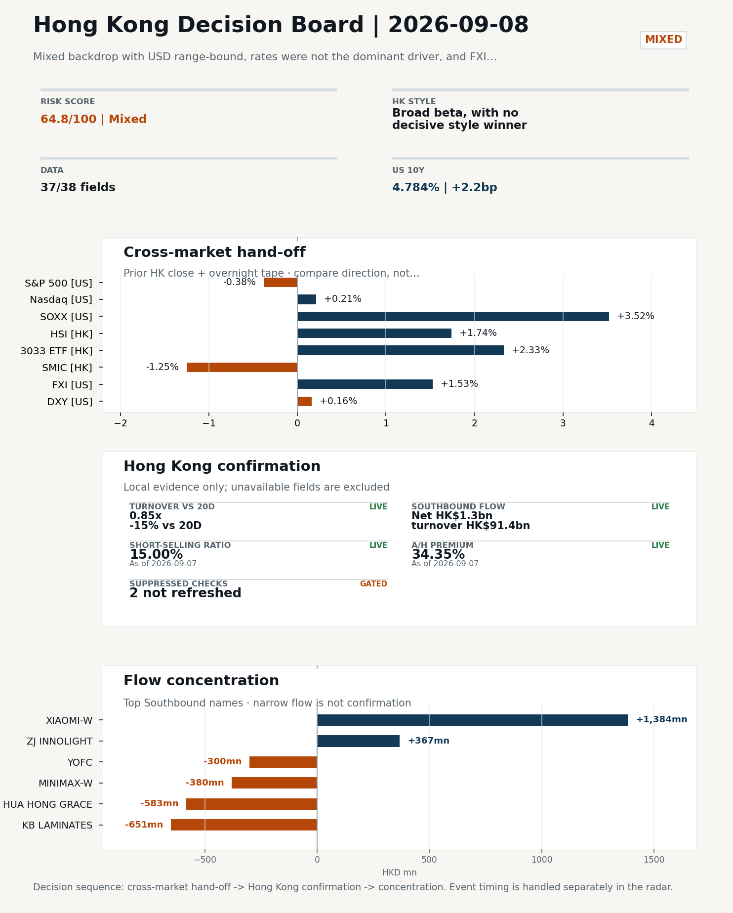
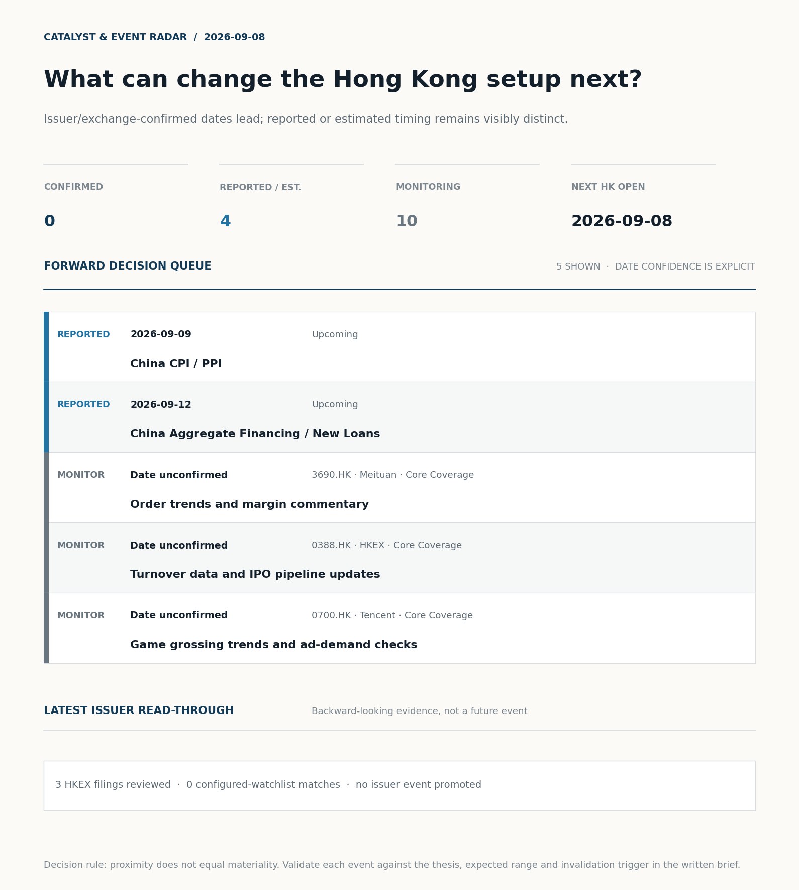
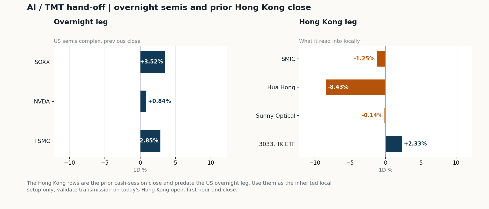
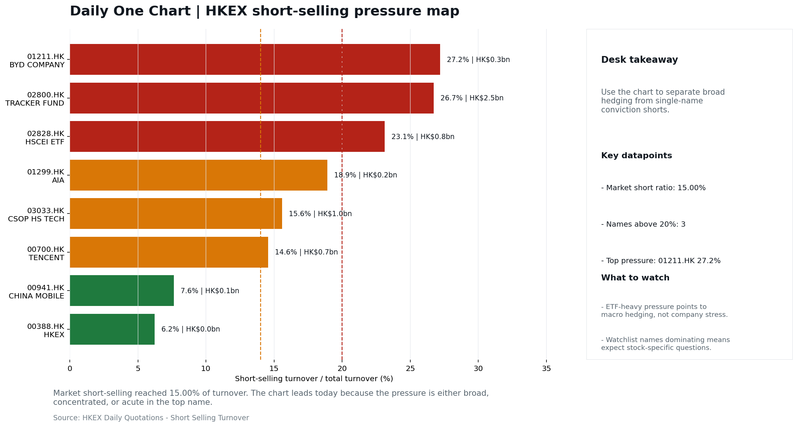

# Morning Research Workbench | 2026-09-08

> **Commute reading route:** `Layer 1 scan (5 min)` → `Layer 2 deep read` → `Layer 3 and appendix if time allows`
>
> Mode: `Trading Daily` | Keep the report execution-oriented: what mattered in the completed session, what can move Hong Kong leadership, and what needs fast follow-up.

_Data through: US/global `2026-09-04` | HK `2026-09-07` | A-share `2026-09-07` | Generated `2026-09-08 07:30:55`_

## Executive Summary

- **Did yesterday's call work?** NO CALL - The 2026-09-05 report published no directional call (neutral regime).
- **What changed overnight?** Semis led higher: SOXX +3.52%, NVDA +0.84%, TSMC +2.85%. HSI +1.74% and 3033.HK +2.33%.
- **What it means for AI/TMT** No decisive style winner - Broad beta, with no decisive style winner, a 0.31pp spread. Avoid forcing a growth-versus-value call; let volume, Southbound concentration, and the first-hour relative tape identify leadership.
- **What to watch today** Next scheduled catalyst: China Aggregate Financing / New Loans on 2026-09-12. Confirm if SMIC and Hua Hong open in the same direction as the overnight leg and hold it through the first hour; invalidate if they track HSCEI instead.

## Layer 1 | Scan (5 min)

### 1.1 Yesterday's Call
**Verdict: NO CALL.** The 2026-09-05 report published no directional call (neutral regime).

**Recent record.** 6 confirmed / 4 broken over the last 10 scoreable calls (60.0% hit rate). This is a directional close-to-close diagnostic, not a track record.

### 1.2 Opening Decision Board

**Global-to-Hong Kong signals**

_Coverage gate: 1 unavailable market fields are suppressed from the main table; source status remains in the appendix._

_Decision-useful subset: each row states the implication and the next test. Descriptive secondary monitors are kept out of the five-minute scan._

| Signal | Last / move | Interpretation | Confirmation / invalidation |
| --- | --- | --- | --- |
| S&P 500 | 7,718.60 / -0.38% | Broad US risk fell without a clear driver in today's fields; treat it as beta, not a signal. | Watch whether Nasdaq and offshore-China proxies move the same way. |
| Nasdaq 100 | 29,544.15 / +0.21% | Growth outperformed broad beta, a supportive style signal for Hong Kong internet and platform names. Growth advanced despite higher yields, showing momentum resilience but also higher reversal sensitivity. | 3033.HK versus HSI leadership carries the read; rising yields would undo it. |
| Hang Seng Index | 25,650.87 / **+1.74%** | The index was carried by growth and platform names, not by broad participation: 3033.HK differs by 0.59pp. | Southbound participation decides whether this is investable or just a print. |
| Hang Seng TECH ETF (3033.HK) | 4.4840 / **+2.33%** | Hong Kong growth led broad beta, improving the platform/internet style signal. | Needs a stable CNH and Southbound buying to become a duration signal. |
| Semiconductors (SOXX) | 519.86 / **+3.52%** | Semis led the Nasdaq by 3.31pp, putting the AI capex trade back in front. | SMIC and Hua Hong at the open show whether it transmits to Hong Kong. |
| US 10Y | 4.7840% / +2.2bp | The yield proxy rose, tightening the discount-rate backdrop for long-duration Hong Kong growth. | Read it through 3033.HK relative performance, not the index level. |
| USD/CNH | 6.7045 / -0.16% | A stronger offshore renminbi supports the external-risk backdrop for Hong Kong equities. | FXI and Southbound flow decide whether this reaches Hong Kong equities. |
| VIX | 14.53 / +1.47% | Higher implied volatility raises the tail-risk premium and weakens risk-on conviction. | Falling volatility on narrowing breadth is a warning, not support. |

_Secondary monitors retained in the source bundle: SMIC (0981.HK), CSI 300, China 10Y, DXY, USD/HKD, Brent crude, COMEX gold, Copper._

**Hong Kong local confirmation**

_Coverage gate: 1 unavailable local checks are suppressed here and retained in validation metadata._

| Check | Value | Status | Source / as of | Why it matters |
| --- | --- | --- | --- | --- |
| Main Board turnover vs 20D | 0.85x \| -15% vs 20D | Live local | HKEX \| 2026-09-07 | Trailing 20-session average turnover was HK$247.2bn. |
| Southbound / Northbound net flow | Southbound Net HK$1.3bn \| turnover HK$91.4bn \| Northbound Turnover RMB271.4bn \| net not reported | Live local | HKEX Connect \| 2026-09-07 | Southbound net buy is calculated from HKEX disclosed buy and sell turnover. |
| Short-selling ratio | 15.00% | Live local | HKEX \| 2026-09-07 | Official HKEX stock-level short-selling table, aggregated as a share of total market turnover. |
| AH premium index | 34.35% | Live public | Yahoo \| 2026-09-07 | Equal-weighted average across 17 A/H pairs that resolved today. Composition varies by day, so the level is not comparable with prior reports (fixed basket incomplete: missing Bank of China). [trimmed] |
| USD/HKD spot vs band | 7.8400 | Live quote | Yahoo \| 2026-09-04 | Mid-band: 100 pips from the weak side and 900 pips from the strong side, so the peg is not an active constraint. |
| Hong Kong leadership | Broad beta, with no decisive style winner | Proxy | HSI / HSCEI / 3033.HK ETF relative \| 2026-09-04 | Use HSI / HSCEI / 3033.HK ETF relative moves as the opening style read. |

**Risk state and evidence**

**Composite risk score:** `64.8/100` | **Regime:** `Mixed`

| Component | Score impact | Evidence |
| --- | --- | --- |
| US beta | -2.3 | S&P 500 -0.38% |
| HK growth ETF proxy | +10 | 3033.HK ETF +2.33% |
| Semis complex | +9 | SOXX +3.52% |
| Offshore China proxy | +7.7 | FXI +1.53% |
| Dollar pressure | -1.6 | DXY +0.16% |
| Volatility | -2.9 | VIX +1.47% |
| HK short-selling | +0 | Short-selling ratio 15.00% |
| HK turnover | -5 | Turnover 0.85x 20D |

_Base 50 plus the component deltas above. Semis complex entered the score on 2026-08-22; earlier scores in the ledger exclude it._

**Morning Checklist**

1. **Mixed backdrop with USD range-bound, rates were not the dominant driver, and FXI outperformed Nasdaq 100**
 Overnight regime | Start by deciding whether the day is about Mixed conditions or a style pivot.
2. **US Non-Farm Payrolls (Past expected window (unverified))**
 Macro / policy | Watch whether it changes the day's core market narrative | Industries: Market-wide
3. **China Trade Balance (Past expected window (unverified))**
 Macro / policy | Watch whether it changes the day's core market narrative | Industries: Market-wide
4. **China Aggregate Financing / New Loans (Upcoming)**
 Macro / policy | Credit expansion, domestic demand chains, and financials | Industries: Banks, Property chain, Infrastructure

## Visual Dashboard

**Catalyst & Event Radar**

**Chart read:** No issuer/exchange-confirmed event date is populated; 4 reported or estimated timing item(s) and 10 undated trigger(s) remain explicit.

_Source: Public calendars, issuer disclosures and configured research watchlists_
## Layer 2 | Core Research (20-30 min)

### 2.1 Global-to-Hong Kong Transmission
**Market Setup**
**Core tape.** Overnight US tape was mixed: the S&P 500 slipped 0.38% while Nasdaq 100 added 0.21%, and semis were the clear leadership pocket with SOXX +3.52% and TSMC ADR +2.85% as the AI/memory narrative re-asserted itself.
**Main driver.** USD was range-bound and rates were not the dominant driver, so the FXI-versus-Nasdaq 100 spread of 0.51pp reads as offshore China keeping pace with US tech rather than chasing it.
**HK relevance.** Hong Kong-relevant catalysts were light.

**Key Drivers**
- AI/memory re-rating lifted SOXX (+3.52%) and TSMC (+2.85%), with NVDA (+0.84%) providing a steadier capex tailwind.
- Rates and USD were not the dominant drivers.
- China's $54bn capital injection into banks and insurers was received defensively (stocks fell on the headline).
- China's G20 pushback on the export-led growth narrative adds tactical friction for HK-listed export-sensitive names (tech hardware, consumer electronics, logistics) even as the broader EM complex rallied to its highest since June on tech leadership.

**Hong Kong Read-Through**
**Opening implication.** For today's HK open (2026-09-08), the constructive overnight-US semis tape argues for a firmer start in HK tech and AI-linked names, with SOXX and TSMC as the most direct lead indicators. A leadership bid is more credible if 3033.HK confirms and HSCEI participation holds without SMIC/Hua Hong dragging, given their prior-session divergence (SMIC -1.25%, Hua Hong -8.43%) sits against the SOXX rally and needs fast follow-up. Avoid over-positioning into Financials until the next session confirms whether China's capital injection is being absorbed; watch HSI turnover versus 0.85x 20D for confirmation that the broad-beta tape is regathering participation. If FXI fails to extend or the 3033.HK-versus-HSCEI spread widens beyond 0.5pp with flow confirmation by mid-morning, reclassify the tape from balanced beta into a more decisive leadership read.
_Hong Kong style leadership and flow confirmation are set out in the Hong Kong review below._

**Watch Points**
- USD composite moved higher by +0.10pct intraday, with a 0.244pct range.
- Main turning points appeared around 2026-09-04 08:15 peak / 2026-09-04 08:30 peak / 2026-09-04 08:50 trough, suggesting event-driven repricing rather than a clean one-way USD move.
- The biggest cross-asset divergence was FXI versus Nasdaq 100, a spread of 0.51pct.
- Gold moved -0.86pct intraday with a 2.414pct high-low range.

**Curated overnight stories**
1. **China says it will pump $54 billion into banks and insurers - but their stocks still fell**
 Why it matters: A direct policy capital injection into Chinese banks and insurers signals intent to shore up capital and confidence, yet the initial market reaction was negative, suggesting…
 HK read-through: Relevant to HK-listed Chinese bank and insurance ADRs and H-shares; read-through to Financials leadership and to Mainland banks proxy exposure.
2. **China hits back at G20 statement on its reliance on exports, accusing them of 'promoting**
 Why it matters: Beijing is publicly pushing back on characterisation of its growth model.
 HK read-through: Tactically negative sentiment for export-sensitive HK names (tech hardware, consumer electronics, logistics).
3. **Why the launch of OpenAI's latest Astra model reignited the memory-chip trade**
 Why it matters: Validation of an AI product cycle and a recovery in memory-chip sentiment since late July improves order visibility for the upstream chain.
 HK read-through: Read-through to HK-listed memory and semis names and equipment suppliers; supports the AI/semis leadership theme that has been a market mover.
4. **Aon CEO says insurance broker seeks to build 'premiere middle market platform' with**
 Why it matters: Capital-allocation and consolidation news in a major insurance broker can reset peer valuations and draw attention to the insurance distribution value chain.
 HK read-through: HK implication is second-order: insurance brokers and larger HK insurance names may see relative-value discussion, but direct earnings impact is limited.
5. **EM Stocks Jump to Highest Since June as Tech Offsets Higher Oil**
 Why it matters: Cross-asset confirmation that the AI/tech rally is doing the heavy lifting for emerging markets even as oil is a drag, framing the current leadership for offshore-China…
 HK read-through: Constructive framing for HK tech/internet leadership and for South-bound sentiment toward EM beta; reinforces the existing market theme rather than changing it.

**AI / TMT hand-off**

**Overnight leg.** The overnight semis leg was risk-on at +2.40% average (SOXX +3.52%, NVDA +0.84%, TSMC +2.85%).
**Hong Kong expression.** SMIC, Hua Hong and Sunny Optical are best placed at the open, and 3033.HK should be tested before the Hang Seng Index.
**Observable test.** Confirm if SMIC and Hua Hong open in the same direction as the overnight leg and hold it through the first hour; invalidate if they track HSCEI instead, which would mean local flow is overriding the global cycle.

| Name | Role in the chain | 1D | Leg |
| --- | --- | --- | --- |
| SOXX | Semis complex | +3.52% | overnight |
| NVDA | AI capex narrative | +0.84% | overnight |
| TSMC | Foundry demand | +2.85% | overnight |
| SMIC | Leading-edge / domestic substitution | -1.25% | Hong Kong |
| Hua Hong | Mature-node pricing cycle | -8.43% | Hong Kong |
| Sunny Optical | Hardware and optics supply chain | -0.14% | Hong Kong |
| 3033.HK ETF | Broad HK tech beta | +2.33% | Hong Kong |

**Clock discipline.** The Hong Kong rows are the prior cash-session close and predate the US overnight leg. Use them as the inherited local setup only; validate transmission on today's Hong Kong open, first hour and close.
**Single-name outlier.** Hua Hong -8.43%, 3033.HK ETF +2.33% moved far outside the rest of the Hong Kong leg. Treat as company-specific until checked; do not read it as a cycle signal.

### 2.2 Hong Kong Local Tape and Flow
**Local Tape Setup**
**Local read.** Hong Kong and A-share follow-through on 2026-09-08 should be judged through style leadership and turnover, not index direction alone.
**Verification point.** The local tape on 2026-09-07 was already leadership-led.
**Risk to watch.** Conviction is capped by Main Board turnover at 0.85x the 20D average (-15% vs 20D) and an elevated short-selling ratio of 15.00%, which argues for confirmation before extending the read.

**Style and Local Leadership**
**Style call.** Broad beta, with no decisive style winner.
- **Evidence:** 3033.HK and HSCEI were separated by only 0.31pp (+2.33% versus +2.02%)
- **Portfolio meaning:** Avoid forcing a growth-versus-value call; let volume, Southbound concentration, and the first-hour relative tape identify leadership.
- **Cross-market read:** Hang Seng +1.74% / HSCEI +2.02% / 3033.HK ETF +2.33%. Offshore China proxy FXI +1.53% and USD/CNH -0.16% frame cross-border risk appetite. USD/HKD last traded around 7.8400, which keeps the Hong Kong funding lens in focus.

**Flow Confirmation**
Official Stock Connect evidence is available; the Flow Tracker confirms whether local money supports the price action.

**Follow-Through Checklist**
**Follow-through check.** At the 2026-09-08 open, confirm (a) 3033.HK continues to outperform HSCEI by mid-morning, (b) Main Board turnover rebuilds back toward the HK$247.2bn 20D baseline, and (c) SMIC/Hua Hong stabilise rather than extend the prior-session decline.
**Failure condition.** Reclassify the tape when either 3033.HK or HSCEI opens a sustained 0.5pp relative lead with flow confirmation.

**Cross-asset attribution**

| Driver | Direction | Score | Evidence | HK implication |
| --- | --- | --- | --- | --- |
| Hong Kong participation | drag | 1.52 | Main Board turnover was 0.85x the 20-session average. | Thin turnover makes index moves easier to fade. |

**Local flow evidence**

**Flow Takeaways**
- Turnover is light versus the 20-session baseline, so local moves have weaker conviction.
- Stock Connect Southbound: net HK$1.3bn on turnover HK$91.4bn (as of 2026-09-07).
- Stock Connect Northbound: turnover RMB271.4bn; public file provides total turnover/top active names, not full net-buy.
- AH premium: covered-pair average +34.35% over 17 pairs. Composition varies by day, so this level is not comparable with prior reports; widest premium: Everbright Bank 83.85%.

**Stock Connect Southbound Active Names**

| # | Ticker | Name | Buy | Sell | Net buy | HKEX turnover rank |
| --- | --- | --- | --- | --- | --- | --- |
| 1 | 01810.HK | XIAOMI-W | HK$1,873.5mn | HK$489.6mn | HK$1,384.0mn | 6 |
| 2 | 01888.HK | KB LAMINATES | HK$1,235.3mn | HK$1,885.8mn | HK$-650.5mn | 4 |
| 3 | 01347.HK | HUA HONG GRACE | HK$316.1mn | HK$899.1mn | HK$-583.0mn | 9 |
| 4 | 00100.HK | MINIMAX-W | HK$3,191.6mn | HK$3,571.5mn | HK$-379.8mn | 1 |
| 5 | 03308.HK | ZJ INNOLIGHT | HK$513.3mn | HK$145.9mn | HK$367.5mn | 10 |

**AH Premium Dispersion**

| Name | A ticker | H ticker | Premium | As of |
| --- | --- | --- | --- | --- |
| Everbright Bank | 601818.SS | 6818.HK | +83.85% | 2026-09-07 |
| China Railway Construction | 601186.SS | 1186.HK | +60.59% | 2026-09-07 |
| China Communications Construction | 601800.SS | 1800.HK | +57.42% | 2026-09-07 |

**HKEX Short-Selling Watch**

| Ticker | Name | Short ratio | Short turnover | Total turnover |
| --- | --- | --- | --- | --- |
| 00388.HK | HKEX | 6.22% | HK$0.0bn | HK$0.7bn |
| 00700.HK | TENCENT | 14.56% | HK$0.7bn | HK$4.6bn |
| 00941.HK | CHINA MOBILE | 7.64% | HK$0.1bn | HK$1.1bn |

- **Short-value leaders:** 02800.HK TRACKER FUND (HK$2.5bn); 01810.HK XIAOMI-W (HK$2.4bn); 02513.HK Z.AI (HK$1.0bn); 03033.HK CSOP HS TECH (HK$1.0bn).

### 2.3 Macro Transmission
**Desk read.** Today's Hong Kong session opens into a mixed but not fragile tape: the prior US session left USD range-bound, rates were not the dominant driver, and FXI outperformed the Nasdaq 100.

**Market sensitivity.** The completed 2026-09-04 US Non-Farm Payrolls and the 2026-09-07 China Trade Balance sit inside their expected windows but remain unverified against official releases.

**HK implication.** The two events that can actually reprice the tape this week are the 2026-09-09 China CPI/PPI and the 2026-09-12 US CPI, paired with the 2026-09-12 China Aggregate Financing / New Loans.

**Macro watchpoints**
- Verification of the 2026-09-04 US Non-Farm Payrolls and 2026-09-07 China Trade Balance prints against official releases before using them in
- China CPI/PPI on 2026-09-09: watch PPI specifically as the read-through to H-share margins, materials, and property chain.
- China Aggregate Financing / New Loans on 2026-09-12: watch whether the credit impulse extends the cyclicals and banks trade, or fails to confirm.
- US CPI on 2026-09-12: primary driver of the Fed path, HKMA, HIBOR, and HK equity duration under the peg.

| Time | Region | Event | Status | Desk read |
| --- | --- | --- | --- | --- |
| | US | US Non-Farm Payrolls | Past expected window (unverified) | Impact: Watch whether it changes the day's core market narrative \| Attention: 5/5 \| Industries: Market-wide |
| | CN | China Trade Balance | Past expected window (unverified) | Impact: Watch whether it changes the day's core market narrative \| Attention: 3/5 \| Industries: Market-wide |
| | CN | China Aggregate Financing / New Loans | Upcoming | Impact: Credit expansion, domestic demand chains, and financials \| Attention: 5/5 \| Industries: Banks, Property chain, Infrastructure |
| | US | US CPI | Upcoming | Impact: Rates expectations, the dollar, and growth-equity valuation \| Attention: 5/5 \| Industries: Technology, Internet, Brokers |
| | CN | China CPI / PPI | Upcoming | Impact: China demand strength, PPI pass-through, and policy-easing odds \| Attention: 3/5 \| Industries: Consumer, Materials, Property |

**Positioning and risk backdrop**

- Detailed local flow evidence is covered under Flow Tracker and Attribution; keep this section focused on options, hedging, and macro-positioning risk.

### 2.4 Company Micro Research and Catalysts

| Grade | Sector | Headline | Why it matters | Horizon |
| --- | --- | --- | --- | --- |
| A | Financials | Aon CEO says insurance broker seeks to build 'premiere middle market | Capital allocation or shareholder-return events can trigger a valuation | Medium-term trend |
| B | Semiconductors and AI | Why the launch of OpenAI's latest Astra model reignited the | This is more about order visibility and product-cycle validation | Short-term catalyst |

**Company Event Takeaway**
**Desk read.** The completed Hong Kong session (2026-09-07) closed mixed with a growth-versus-old-economy split.
**Why it matters.** This argues against a single narrative driver; rather, the tape read suggests tech re-engagement on the OpenAI Astra memory-chip story and a continuation trade in H-shares.
**Follow-up.** Within Core coverage, Meituan (3690.HK) slipped 2.08% despite the Aug-28 print of Q2 revenue RMB104.6bn (+14.4%) and a return to core local-commerce profit, implying the result was already in price and the move is positioning rather than fundamental.

**LLM Quick Takes**
- **3690.HK** | Fact: closed -2.08% at 80.05, mid-range (53% of 60-session band). Read: move looks positioning-led; the 28-Aug Q2 print (RMB104.6bn revenue, +14.4% YoY…
- **0388.HK** | Fact: closed -1.17% at 404.0, top quartile of 60-session range (78%). Read: pullback from the top of range is consistent with profit-taking, not a turnover deterioration signal.…
- **1211.HK** | Fact: closed -1.92% at 84.5, mid-range (54%). Read: no fresh catalyst in the tape; move looks like a continuation of recent volatility rather than an event-driven re-rating. Next check…
- **0941.HK** | Fact: closed -0.69% at 79.1, mid-range (68%). Read: defensives gave back modestly with no specific catalyst; thesis on yield and digital-infrastructure capex unchanged. Next check…

Decision filter<h4>No immediate portfolio catalyst: 3 official filings were screened and the low-signal market set stays aggregated.</h4>
3 profit warnings

<strong>3</strong>Official filings

<strong>0</strong>Watchlist hits

<strong>0</strong>Actionable events

<strong>No event cleared the portfolio decision filter.</strong>

Broad-market filings remain traceable in the source appendix; they are not expanded here without a watchlist, estimate or liquidity read-through.

<strong>Coverage boundary.</strong> sell-side rating changes, IPO / grey-market monitor were not decision-grade in this run; their absence is not treated as confirmation that no event exists.

**Core coverage requiring follow-up**

**Core coverage**

| Name | Ticker | Last | 1D | Range position | Morning note |
| --- | --- | --- | --- | --- | --- |
| Meituan | 3690.HK | 80.05 | -2.08% | Mid-range | Down 2.08% on the session, mid-range at 53% of its 60-session band. |
| HKEX | 0388.HK | 404.00 | -1.17% | Top of range | Marginally lower (-1.17%), in the top quartile of its 60-session range (78%). |

**Recent headlines for Meituan:**
- [Meituan (MPNGF) (Q2 2026) Earnings Call Highlights: Record Revenue and Strategic AI Pivot Drive...](https://finance.yahoo.com/markets/stocks/articles/meituan-mpngf-q2-2026-earnings-190123345.html) (GuruFocus.com)

**Priority follow-up**

| Name | Ticker | Last | 1D | Range position | Morning note |
| --- | --- | --- | --- | --- | --- |
| BYD Company | 1211.HK | 84.50 | -1.92% | Mid-range | Marginally lower (-1.92%), mid-range at 54% of its 60-session band. |
| China Mobile | 0941.HK | 79.10 | -0.69% | Mid-range | Marginally lower (-0.69%), mid-range at 68% of its 60-session band. |

### 2.5 Morning Meeting Questions
No divergence, tail reading or coverage gap stood out today, so there is no obvious follow-up question beyond the base case above.

## Layer 3 | Session Playbook (8-12 min)

### 3.1 Base Case and Scenario Map
**Starting posture.** Broad beta, with no decisive style winner (medium confidence); composite risk `64.8/100` (Mixed). Avoid forcing a growth-versus-value call; let volume, Southbound concentration, and the first-hour relative tape identify leadership.

**Scenario map**

| Scenario | Observable trigger | Interpretation | Research response |
| --- | --- | --- | --- |
| Selective growth confirms | 3033.HK keeps a >0.5pp first-hour lead over HSCEI; SMIC and Hua Hong stop lagging broad beta; CNH is stable. | The prior style split has live price confirmation, but is not yet broad China risk-on. | Prioritize internet/platform relative strength; verify participation again at the close. |
| Broad beta takes over | HSI and HSCEI rise together, breadth improves and the 3033.HK lead narrows without turning negative. | Leadership is broadening from a style trade into market beta. | Expand the research set from growth leaders to financials, SOEs and index-heavy names. |
| Risk-off continuation | 3033.HK loses its lead, semis underperform HSCEI and CNH depreciation accelerates. | The prior divergence was a temporary pocket of strength rather than a durable hand-off. | Treat rebounds as unconfirmed; focus on balance-sheet, catalyst and crowding risk. |

**Clocked validation scorecard**

| Window | Check | Prior evidence | Pass condition | What it decides |
| --- | --- | --- | --- | --- |
| 09:30-10:30 | 3033.HK vs HSCEI | +0.31pp at the prior close | 3033.HK retains >0.5pp relative lead | Whether growth leadership survives the open |
| 09:30-10:30 | Semiconductor hand-off | SMIC -1.25%; Hua Hong Semiconductor -8.43% | Stabilise after the open; at least one stops underperforming HSCEI | Whether overnight semis pressure is contained locally |
| 09:30-10:30 | HSI price zone | 25,651 vs 25,500 / 26,000 reference grid | Hold above the lower grid or reclaim the upper grid with breadth | Whether broad beta is stabilising; grid is derived, not technical analysis |
| 09:30-10:30 | USD/CNH | 6.7045 \| -0.16% | No acceleration in CNH depreciation | Whether FX permits a clean Hong Kong risk extension |
| At close | Turnover | 0.85x \| -15% vs 20D | At least 1.0x the 20-session average | Whether the move had normal participation |
| At close | Southbound | Net HK$1.3bn \| turnover HK$91.4bn | Net buying remains positive and broadens beyond one or two names | Whether mainland money confirms the price move |
| At close | Short pressure | 15.00% | Falls versus the prior verified reading (15.00%) | Whether rebound conviction improved |

**Upgrade rule.** Confirm a broad-beta session only if HSI breadth and turnover improve without a sharp 3033.HK-versus-HSCEI split.
**Kill switch.** Reclassify the tape when either 3033.HK or HSCEI opens a sustained 0.5pp relative lead with flow confirmation.
**Clock discipline.** At 07:30, same-day Southbound, turnover and short-selling outcomes are not known. Use the first-hour price/FX checks provisionally and make the final classification only after the close.
**Event clock.** No same-day decision-grade item is populated; the nearest reported/estimated item is China CPI / PPI on 2026-09-09. Verify the issuer or official calendar before relying on the date.

### 3.2 Conditional Theme Deep Dive

| Field | Read |
| --- | --- |
| Theme | China Consumption Recovery |
| Angle for the day | Focus on whether travel, retail, internet local services, and premium consumption data still support a demand-repair narrative. |

**Theme desk read**
**Core thesis.** The China Consumption Recovery theme remains an execution question rather than a confirmed trend.
**Evidence.** The near-term evidence set is mixed: the stronger semiconductor tape provides a supportive opening for Hong Kong platform beta, while Meituan fell 2.08% to HK$80.05 and remains near the middle of its 60-session range.
**What to test.** Its reported Q2 revenue growth, return to core local-commerce profit, and easing food-delivery competition support the operating narrative.

**Signals to keep in mind**
- SOXX +3.52%: Semis rallied, giving HK semis and platform beta a supportive open.
- TSMC +2.85%: Foundry demand read is firmer, which transmits to SMIC and Hua Hong most directly.

**LLM watch items:**
- Meituan order trends and margin commentary; the catalyst date is not supplied.
- China activity data on 15 September: industrial production, retail sales, and fixed-asset investment.
- China aggregate financing and new loans on 12 September for domestic-demand implications.
- US CPI on 12 September for the rates, dollar, and growth-equity valuation setup.
- Whether the semiconductor-led supportive open extends to Hong Kong platform beta, while checking Meituan for a fundamental or regulatory reason not

**Related names to keep close:**

| Name | Ticker | Bucket | Morning read |
| --- | --- | --- | --- |
| Meituan | 3690.HK | Core coverage | Down 2.08% on the session, mid-range at 53% of its 60-session band. |

**Upcoming catalysts tied to the theme:**
- 2026-09-15 | China Activity Data (IP / Retail Sales / FAI) | Watch whether it changes risk budgets or the theme-trading cadence

### 3.3 Daily One Chart
**Daily One Chart | HKEX short-selling pressure map**

**Chart read.** Market short-selling reached 15.00% of turnover.
**Why it matters.** The chart leads today because the pressure is either broad, concentrated, or acute in the top name.

_Source: HKEX Daily Quotations - Short Selling Turnover_

## Optional Appendix | Traceability and Performance (10-15 min)

### Report Metadata
> Date policy: Review date 2026-09-07 is treated as `Trading Daily`. | Global (US/Europe) data date is 2026-09-04; adapter effective date is 2026-09-04 and summary date is 2026-09-04. | Hong Kong local data date is 2026-09-07; role: same-session local cash tape.
> Market data quality: Coverage: `37/38` | Fallbacks used: `2` | Missing: `1`
> Report quality: `90.4/100` | Grade `B` | Status `usable with caveats`

### Report Quality and Validation
- **Quality score:** 90.4/100 | **Grade:** B | **Status:** usable with caveats
- **Run summary:** 8 healthy | 2 caveat | 0 failed
- **Release recommendation:** Send with caveats | The report is usable, but the advisory guidance should travel with it so readers understand the data gaps.

| Source | Status | Bucket |
| --- | --- | --- |
| Macro calendar | partial | caveat |
| Risk and sentiment feed | partial | caveat |

- **Grade capped:** 1 prose defect(s) detected: 1 unbalanced_bracket.

| Weak component | Score | Read |
| --- | --- | --- |
| Hong Kong local metrics | 54.1 | 5 live, 3 proxy, 3 unavailable local checks. |

**Quality warnings**
- Hong Kong local metrics is weak: 5 live, 3 proxy, 3 unavailable local checks.

**Narrative fact-check guardrail**
- Checked 30 numeric claims; 0 numeric mismatch(es), 0 logic warning(s); 15 structured claims, 0 source/text warning(s); 0 critical, 0 review.

_Full component weights, per-source freshness, adapter status and provenance records are archived with this report under `audit/` rather than printed here._

### Historical Signal Performance
- **Readiness:** exploratory with caveats | 69 observations | 94 active signal dates | next-close entry, 10bps cost, no same-day returns.
- **Interpretation boundary:** exploratory until a benchmark reaches 252 sessions and 100 active-signal sessions.
- **Data-quality caveat:** 23 conflicting price revision(s) and 6 non-session observation(s) remain in the research ledger.
- **Daily-use boundary:** cumulative return, Sharpe and the performance chart stay out of the daily commute edition until the sample and trading-calendar gates pass; use Yesterday's Call instead.

### Source Links
- [Aon CEO says insurance broker seeks to build 'premiere middle market platform' with purchase of rival USI](https://www.cnbc.com/2026/08/31/aon-ceo-says-usi-deal-seeks-to-build-premiere-middle-market-insurance-platform.html) (cnbc_markets)
- [Why the launch of OpenAI's latest Astra model reignited the memory-chip trade](https://www.marketwatch.com/story/why-the-launch-of-openais-latest-astra-model-reignited-the-memory-chip-trade-809e2edb?mod=mw_rss_topstories) (wsj_markets)
- [Meituan (MPNGF) (Q2 2026) Earnings Call Highlights: Record Revenue and Strategic AI Pivot Drive...](https://finance.yahoo.com/markets/stocks/articles/meituan-mpngf-q2-2026-earnings-190123345.html) (GuruFocus.com)
- [Meituan Returns to Profit as Food-Delivery Competition Eases](https://www.wsj.com/business/earnings/meituan-returns-to-profit-as-food-delivery-competition-eases-1026a0e9?siteid=yhoof2&yptr=yahoo) (The Wall Street Journal)
- [Tencent Slips 1% While Its AI-Chip Bet Attacks Nvidia's China Moat](https://finance.yahoo.com/technology/ai/articles/tencent-slips-1-while-ai-215226124.html) (GuruFocus.com)
- [Alibaba vs. Coupang: Which Asia Retail Powerhouse Stock Is a Better Buy in 2026?](https://www.fool.com/coverage/better-buy/2026/09/07/alibaba-vs-coupang-which-asia-retail-powerhouse-stock-is-a-better-buy-in-2026/) (Motley Fool)
- [Alibaba vs. Shopify: Which Retail Platform Is a Better Buy in 2026?](https://www.fool.com/coverage/better-buy/2026/09/07/alibaba-vs-shopify-which-retail-platform-is-a-better-buy-in-2026/) (Motley Fool)
- [00722.HK Profit warning / alert announcement](http://www1.hkexnews.hk/listedco/listconews/sehk/2026/0904/2026090402367.pdf) (HKEXnews)
- [00333.HK Profit warning / alert announcement](http://www1.hkexnews.hk/listedco/listconews/sehk/2026/0831/2026083100934.pdf) (HKEXnews)
- [01496.HK Profit warning / alert announcement](http://www1.hkexnews.hk/listedco/listconews/sehk/2026/0831/2026083100716.pdf) (HKEXnews)
