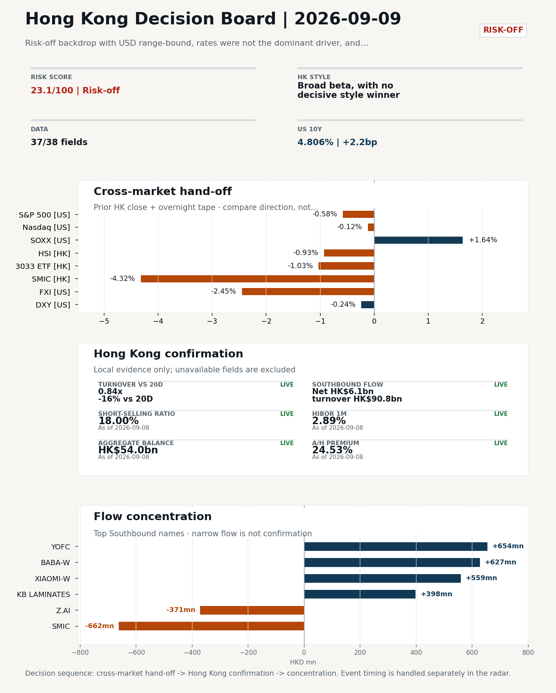
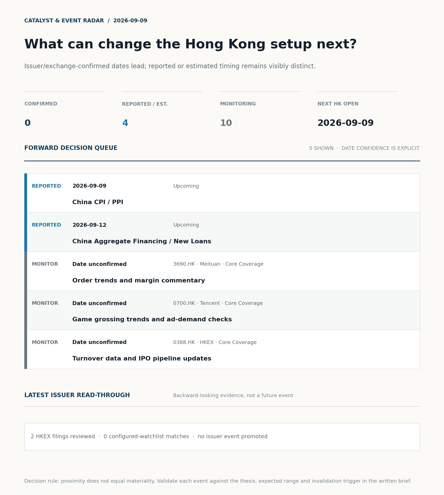
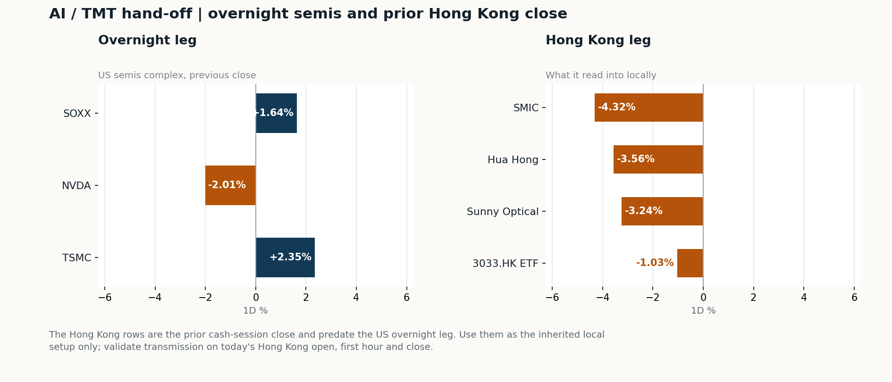
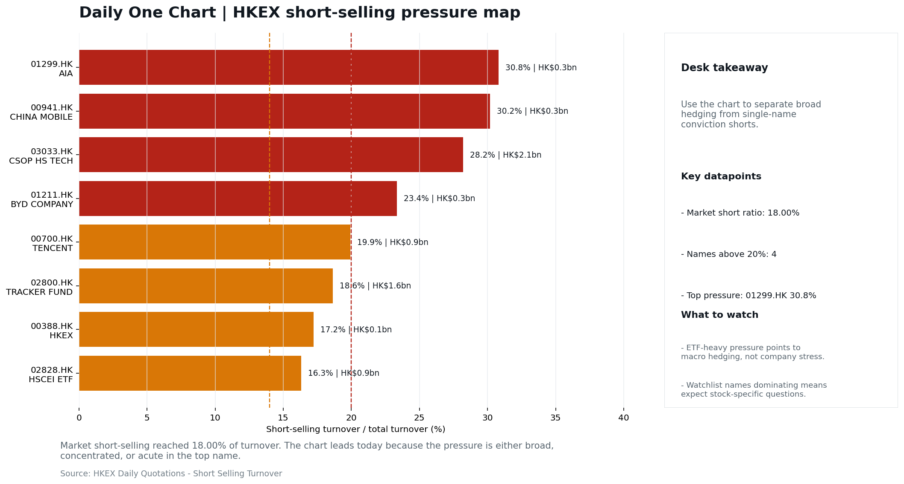

# Morning Research Workbench | 2026-09-09

> **Commute reading route:** `Layer 1 scan (5 min)` → `Layer 2 deep read` → `Layer 3 and appendix if time allows`
>
> Mode: `Trading Daily` | Keep the report execution-oriented: what mattered in the completed session, what can move Hong Kong leadership, and what needs fast follow-up.

_Data through: US/global `2026-09-08` | HK `2026-09-08` | A-share `2026-09-08` | Generated `2026-09-09 07:24:34`_

## Executive Summary

- **Did yesterday's call work?** NO CALL - The 2026-09-08 report published no directional call (neutral regime).
- **What changed overnight?** Semis led higher: SOXX +1.64%, NVDA -2.01%, TSMC +2.35%. HSI -0.93% and 3033.HK -1.03%.
- **What it means for AI/TMT** No decisive style winner - Broad beta, with no decisive style winner, a 0.43pp spread. Avoid forcing a growth-versus-value call; let volume, Southbound concentration, and the first-hour relative tape identify leadership.
- **What to watch today** China CPI / PPI. Confirm if SMIC and Hua Hong open in the same direction as the overnight leg and hold it through the first hour; invalidate if they track HSCEI instead.

## Layer 1 | Scan (5 min)

### 1.1 Yesterday's Call
**Verdict: NO CALL.** The 2026-09-08 report published no directional call (neutral regime).

**Recent record.** 6 confirmed / 4 broken over the last 10 scoreable calls (60.0% hit rate). This is a directional close-to-close diagnostic, not a track record.

### 1.2 Opening Decision Board

**Global-to-Hong Kong signals**

_Decision-useful subset: each row states the implication and the next test. Descriptive secondary monitors are kept out of the five-minute scan._

| Signal | Last / move | Interpretation | Confirmation / invalidation |
| --- | --- | --- | --- |
| S&P 500 | 7,673.52 / -0.58% | Broad US risk fell without a clear driver in today's fields; treat it as beta, not a signal. | Watch whether Nasdaq and offshore-China proxies move the same way. |
| Nasdaq 100 | 29,507.70 / -0.12% | Growth outperformed broad beta, a supportive style signal for Hong Kong internet and platform names. | 3033.HK versus HSI leadership carries the read; rising yields would undo it. |
| Hang Seng Index | 25,413.12 / -0.93% | Broad beta fell with no single driver visible in today's fields. | Southbound participation decides whether this is investable or just a print. |
| Hang Seng TECH ETF (3033.HK) | 4.4380 / -1.03% | Growth and broad beta moved together; there is no decisive style rotation yet. | Needs a stable CNH and Southbound buying to become a duration signal. |
| Semiconductors (SOXX) | 528.40 / **+1.64%** | Semis led the Nasdaq by 1.76pp, putting the AI capex trade back in front. | SMIC and Hua Hong at the open show whether it transmits to Hong Kong. |
| US 10Y | 4.8060% / +2.2bp | The yield proxy rose, tightening the discount-rate backdrop for long-duration Hong Kong growth. | Read it through 3033.HK relative performance, not the index level. |
| USD/CNH | 6.7040 / -0.01% | CNH was stable, removing an immediate FX impulse but not confirming equity direction. | FXI and Southbound flow decide whether this reaches Hong Kong equities. |
| VIX | 15.72 / **+2.75%** | Higher implied volatility raises the tail-risk premium and weakens risk-on conviction. | Falling volatility on narrowing breadth is a warning, not support. |

_Secondary monitors retained in the source bundle: SMIC (0981.HK), CSI 300, China 10Y, CN-US 10Y spread, DXY, USD/HKD, Brent crude, COMEX gold, Copper._

**Hong Kong local confirmation**

| Check | Value | Status | Source / as of | Why it matters |
| --- | --- | --- | --- | --- |
| Main Board turnover vs 20D | 0.84x \| -16% vs 20D | Live local | HKEX \| 2026-09-08 | Trailing 20-session average turnover was HK$245.6bn. |
| Southbound / Northbound net flow | Southbound Net HK$6.1bn \| turnover HK$90.8bn \| Northbound Turnover RMB266.0bn \| net not reported | Live local | HKEX Connect \| 2026-09-08 | Southbound net buy is calculated from HKEX disclosed buy and sell turnover. |
| Short-selling ratio | 18.00% | Live local | HKEX \| 2026-09-08 | Official HKEX stock-level short-selling table, aggregated as a share of total market turnover. |
| AH premium index | 24.53% | Live public | Yahoo \| 2026-09-08 | Fixed 10-name basket, equal-weighted, both legs priced on the same date; comparable across dates. Covered-pair average was +43.26% across 17 pairs. |
| USD/HKD spot vs band | 7.8399 \| band 7.7500 to 7.8500 | Live quote + local | Yahoo \| 2026-09-08 | Mid-band: 101 pips from the weak side and 899 pips from the strong side, so the peg is not an active constraint. Official Convertibility Undertakings define the linked-rate stress boundaries for USD/HKD. |
| HIBOR 1M | 2.89% | Live local | HKMA \| 2026-09-08 | 1M HIBOR is the cleanest quick read for Hong Kong funding conditions and equity-duration pressure. |
| Hong Kong leadership | Broad beta, with no decisive style winner | Proxy | HSI / HSCEI / 3033.HK ETF relative \| 2026-09-08 | Use HSI / HSCEI / 3033.HK ETF relative moves as the opening style read. |

**Risk state and evidence**

**Composite risk score:** `23.1/100` | **Regime:** `Risk-off`

| Component | Score impact | Evidence |
| --- | --- | --- |
| US beta | -3.5 | S&P 500 -0.58% |
| HK growth ETF proxy | -5.2 | 3033.HK ETF -1.03% |
| Semis complex | +8.2 | SOXX +1.64% |
| Offshore China proxy | -8 | FXI -2.45% |
| Volatility | -5.5 | VIX +2.75% |
| HK short-selling | -8 | Short-selling ratio 18.00% |
| HK turnover | -5 | Turnover 0.84x 20D |
| Excluded (stale) | +0.0 | Not scored: DXY (stale 2d) |

_Base 50 plus the component deltas above. Semis complex entered the score on 2026-08-22; earlier scores in the ledger exclude it._

**Morning Checklist**

1. **Risk-off backdrop with USD range-bound, rates were not the dominant driver, and Nasdaq 100 outperformed FXI**
 Overnight regime | Start by deciding whether the day is about Risk-off conditions or a style pivot.
2. **China Trade Balance (Past expected window (unverified))**
 Macro / policy | Watch whether it changes the day's core market narrative | Industries: Market-wide
3. **China Aggregate Financing / New Loans (Upcoming)**
 Macro / policy | Credit expansion, domestic demand chains, and financials | Industries: Banks, Property chain, Infrastructure
4. **US CPI (Upcoming)**
 Macro / policy | Rates expectations, the dollar, and growth-equity valuation | Industries: Technology, Internet, Brokers

## Visual Dashboard

**Catalyst & Event Radar**

**Chart read:** No issuer/exchange-confirmed event date is populated; 4 reported or estimated timing item(s) and 10 undated trigger(s) remain explicit.

_Source: Public calendars, issuer disclosures and configured research watchlists_
## Layer 2 | Core Research (20-30 min)

### 2.1 Global-to-Hong Kong Transmission
**Market Setup**
**Core tape.** Overnight US trade (2026-09-08) stayed inside the same risk-off backdrop that defined the prior Hong Kong session: S&P 500 fell 0.58% and Nasdaq 100 was nearly flat at -0.12%.
**Main driver.** Rates were not the dominant driver as USD moved in a tight range; instead oil (+3.05% / +1.44% intraday) and elevated HK short-selling (18.00%) carried the risk premium.
**HK relevance.** The tape therefore reads as risk-off with no decisive US style winner, and no overnight Hong Kong catalyst strong enough to force a regime change into the 2026-09-09 open.

**Key Drivers**
- Oil/geopolitics: crude +3.05% with a 2.948% intraday range created a split read, supporting energy but pressuring margins and risk appetite across US equities.
- Short-selling pressure: HKEX short-selling ratio at 18.00% is elevated, arguing that local rebounds need cleaner breadth and flow confirmation before they are chased.
- HK participation: Main Board turnover ran at 0.84x the 20-day average, so index moves are easier to fade and conviction is limited despite +HK$6.1bn Southbound net buying.
- Cross-asset divergence: Nasdaq 100 outperformed FXI by 2.33pp (-0.12% vs -2.45%), with USD essentially flat, so the move is risk-off idiosyncratic rather than a rates-led USD story.

**Hong Kong Read-Through**
**Opening implication.** For the 2026-09-09 HK open, treat the session as a confirmation test of the prior risk-off tape rather than a fresh catalyst.
_Hong Kong style leadership and flow confirmation are set out in the Hong Kong review below._

**Watch Points**
- USD composite moved higher by +0.01pct intraday, with a 0.321pct range.
- Main turning points appeared around 2026-09-08 08:05 peak / 2026-09-08 08:20 peak / 2026-09-08 08:40 peak, suggesting event-driven repricing rather than a clean one-way USD move.
- The biggest cross-asset divergence was Nasdaq 100 versus FXI, a spread of 0.097pct.
- Gold moved -2.03pct intraday with a 2.115pct high-low range.

**Curated overnight stories**
1. **China says it will pump $54 billion into banks and insurers - but their stocks still fell**
 Why it matters: Signals ongoing state support for financial-sector balance sheets, yet the negative equity reaction suggests the market is reading the package as insufficient to offset…
 HK read-through: Most relevant for Hong Kong-listed China banks and insurers.
2. **China banks snap up bonds to seek returns as loan slump deepens**
 Why it matters: Confirms the loan-to-bond reallocation theme in the mainland financial system and reinforces that loan growth - not capital adequacy - is the binding constraint.
 HK read-through: Maps to Hong Kong-listed China bank earnings quality, net interest margin assumptions, and any bank names exposed to property/mortgage books.
3. **China's AI-fueled IPO boom delivers six-figure windfalls to retail investors**
 Why it matters: Frames retail enthusiasm around the China AI/semiconductor primary-market pipeline, which can spill into secondary sentiment for listed names with similar narratives.
 HK read-through: Read-across to Hong Kong-listed China AI and semiconductor names and to the broader China Internet complex; flag as sentiment/context only, not an earnings catalyst.
4. **Google, Blackstone venture faces delays at data-center sites**
 Why it matters: Highlights execution risk in large-scale AI infrastructure build-outs, which can feed back into capex expectations and competitive positioning across the global AI stack.
 HK read-through: Indirect read-across to Hong Kong-listed China Internet and semiconductors via AI capex and inference demand narratives.

**AI / TMT hand-off**

**Overnight leg.** The overnight semis leg was risk-on at +0.66% average (SOXX +1.64%, NVDA -2.01%, TSMC +2.35%).
**Hong Kong expression.** SMIC, Hua Hong and Sunny Optical are best placed at the open, and 3033.HK should be tested before the Hang Seng Index.
**Observable test.** Confirm if SMIC and Hua Hong open in the same direction as the overnight leg and hold it through the first hour; invalidate if they track HSCEI instead, which would mean local flow is overriding the global cycle.

| Name | Role in the chain | 1D | Leg |
| --- | --- | --- | --- |
| SOXX | Semis complex | +1.64% | overnight |
| NVDA | AI capex narrative | -2.01% | overnight |
| TSMC | Foundry demand | +2.35% | overnight |
| SMIC | Leading-edge / domestic substitution | -4.32% | Hong Kong |
| Hua Hong | Mature-node pricing cycle | -3.56% | Hong Kong |
| Sunny Optical | Hardware and optics supply chain | -3.24% | Hong Kong |
| 3033.HK ETF | Broad HK tech beta | -1.03% | Hong Kong |

**Clock discipline.** The Hong Kong rows are the prior cash-session close and predate the US overnight leg. Use them as the inherited local setup only; validate transmission on today's Hong Kong open, first hour and close.

### 2.2 Hong Kong Local Tape and Flow
**Local Tape Setup**
**Local read.** Hong Kong opens into a risk-off tape where the prior cash session already priced the offshore-China weakness: HSCEI -1.46% led the HSI -0.93% lower.
**Verification point.** Flow conditions argue against chasing any relief bid.
**Risk to watch.** Cross-market read-through stays mixed, as US semis strength (TSMC +2.35%, SOXX +1.64%) failed to pull SMIC (-4.32%) or Hua Hong (-3.56%) higher, leaving AI-capex confirmation incomplete on the Hong Kong side.

**Style and Local Leadership**
**Style call.** Broad beta, with no decisive style winner.
- **Evidence:** 3033.HK and HSCEI were separated by only 0.43pp (-1.03% versus -1.46%)
- **Portfolio meaning:** Avoid forcing a growth-versus-value call; let volume, Southbound concentration, and the first-hour relative tape identify leadership.
- **Cross-market read:** Hang Seng -0.93% / HSCEI -1.46% / 3033.HK ETF -1.03%. Offshore China proxy FXI -2.45% and USD/CNH -0.01% frame cross-border risk appetite. USD/HKD last traded around 7.8399, which keeps the Hong Kong funding lens in focus.

**Flow Confirmation**
Official Stock Connect evidence is available; the Flow Tracker confirms whether local money supports the price action.

**Follow-Through Checklist**
**Follow-through check.** Confirmation test for the 2026-09-09 open: HSI breadth improves (advancers > decliners) AND Main Board turnover reclaims the 20-day average within the first 30 minutes.
**Failure condition.** Reclassify the tape when either 3033.HK or HSCEI opens a sustained 0.5pp relative lead with flow confirmation.

**Cross-asset attribution**

| Driver | Direction | Score | Evidence | HK implication |
| --- | --- | --- | --- | --- |
| Oil and geopolitics | mixed | 2.58 | Oil moved +3.23%. | Split the read between energy/cyclicals support and margin/geopolitical pressure. |
| Short-selling pressure | drag | 2.1 | HKEX short-selling ratio was 18.00%. | Elevated short activity argues for extra confirmation before chasing rebounds. |
| Hong Kong participation | drag | 1.61 | Main Board turnover was 0.84x the 20-session average. | Thin turnover makes index moves easier to fade. |

**Local flow evidence**

**Flow Takeaways**
- Short-selling pressure is elevated, so local rebounds need cleaner breadth and flow confirmation.
- Stock Connect Southbound: net HK$6.1bn on turnover HK$90.8bn (as of 2026-09-08).
- Stock Connect Northbound: turnover RMB266.0bn; public file provides total turnover/top active names, not full net-buy.
- AH premium: fixed 10-name basket +24.53% (comparable across dates); covered-pair average +43.26% over 17 pairs; widest premium: Chalco 155.1%.

**Stock Connect Southbound Active Names**

| # | Ticker | Name | Buy | Sell | Net buy | HKEX turnover rank |
| --- | --- | --- | --- | --- | --- | --- |
| 1 | 00981.HK | SMIC | HK$1,818.3mn | HK$2,480.7mn | HK$-662.4mn | 2 |
| 2 | 06869.HK | YOFC | HK$2,231.5mn | HK$1,577.0mn | HK$654.4mn | 3 |
| 3 | 09988.HK | BABA-W | HK$862.4mn | HK$234.9mn | HK$627.4mn | 4 |
| 4 | 01810.HK | XIAOMI-W | HK$1,262.2mn | HK$702.7mn | HK$559.5mn | 8 |
| 5 | 01888.HK | KB LAMINATES | HK$1,433.5mn | HK$1,035.2mn | HK$398.3mn | 6 |

**AH Premium Dispersion**

| Name | A ticker | H ticker | Premium | As of |
| --- | --- | --- | --- | --- |
| Chalco | 601600.SS | 2600.HK | +155.10% | 2026-09-08 |
| China Communications Construction | 601800.SS | 1800.HK | +98.83% | 2026-09-08 |
| Everbright Bank | 601818.SS | 6818.HK | +83.12% | 2026-09-08 |

**HKEX Short-Selling Watch**

| Ticker | Name | Short ratio | Short turnover | Total turnover |
| --- | --- | --- | --- | --- |
| 00388.HK | HKEX | 17.23% | HK$0.1bn | HK$0.7bn |
| 00700.HK | TENCENT | 19.93% | HK$0.9bn | HK$4.5bn |
| 00941.HK | CHINA MOBILE | 30.18% | HK$0.3bn | HK$0.9bn |

- **Short-value leaders:** 01810.HK XIAOMI-W (HK$2.3bn); 03033.HK CSOP HS TECH (HK$2.1bn); 02800.HK TRACKER FUND (HK$1.6bn); 07709.HK XL2CSOPHYNIX (HK$1.2bn).

### 2.3 Macro Transmission
**Desk read.** Use the calendar table and released data below as the primary macro read.

**Macro watchpoints**
- China CPI/PPI on 9 September: PPI pass-through is the key signal for H-share margin revisions, especially in materials and property-linked names.
- Unverified China Trade Balance (7 Sep window): confirm official release before using it to justify shipping, electronics or industrial-complex
- VIX at 15.72 with +2.75% on the session: monitor whether the volatility uptick persists into the HK open
- SOXX and TSMC ADR strength vs NVDA weakness: split within tech leadership - watch whether HK semis (SMIC, Hua Hong) and platform names can hold

| Time | Region | Event | Status | Desk read |
| --- | --- | --- | --- | --- |
| | CN | China Trade Balance | Past expected window (unverified) | Impact: Watch whether it changes the day's core market narrative \| Attention: 3/5 \| Industries: Market-wide |
| | CN | China Aggregate Financing / New Loans | Upcoming | Impact: Credit expansion, domestic demand chains, and financials \| Attention: 5/5 \| Industries: Banks, Property chain, Infrastructure |
| | US | US CPI | Upcoming | Impact: Rates expectations, the dollar, and growth-equity valuation \| Attention: 5/5 \| Industries: Technology, Internet, Brokers |
| | CN | China CPI / PPI | Upcoming | Impact: China demand strength, PPI pass-through, and policy-easing odds \| Attention: 3/5 \| Industries: Consumer, Materials, Property |

**Positioning and risk backdrop**

- Detailed local flow evidence is covered under Flow Tracker and Attribution; keep this section focused on options, hedging, and macro-positioning risk.

### 2.4 Company Micro Research and Catalysts
No high-conviction sector story cleared the main-report relevance gate for this run.

**Company Event Takeaway**
**Desk read.** Trading daily note for 2026-09-08 (target HK session 2026-09-09).
**Why it matters.** Risk-off backdrop with USD range-bound and Nasdaq 100 outperforming FXI; rates were not the dominant driver, so today's marginal moves in HK are best read as positioning and single-name news rather than macro repricing.
**Follow-up.** On the core Internet tape, Meituan (3690.HK) closed +0.69% at 80.6 (mid-range, 55% of band) and Tencent (0700.HK) -0.68% at 435.4 (29% of band).

**LLM Quick Takes**
- **0700.HK** | Fact: closed -0.68% at 435.4, 29% of 60-session range; latest headline focuses on Enflame AI-chip build and Nvidia China moat. Investor read…
- **3690.HK** | Fact: closed +0.69% at 80.6, 55% of 60-session range; Q2 print already digested (RMB104.6bn revenue, core local commerce profitable, Keeta traction). Investor read: no fresh catalyst…
- **1211.HK** | Fact: closed -0.77% at 83.85, mid-range (51%). Investor read: no fresh catalyst; thesis unchanged. Next check: weekly sales data and model rollout cadence…
- **1299.HK** | Fact: closed -0.26% at 76.9, top of 60-session range (76%). Investor read: positioning stretched but no fresh catalyst; thesis unchanged. Next check: NBV trends and agency momentum…

Decision filter<h4>No immediate portfolio catalyst: 2 official filings were screened and the low-signal market set stays aggregated.</h4>
2 profit warnings

<strong>2</strong>Official filings

<strong>0</strong>Watchlist hits

<strong>0</strong>Actionable events

<strong>No event cleared the portfolio decision filter.</strong>

Broad-market filings remain traceable in the source appendix; they are not expanded here without a watchlist, estimate or liquidity read-through.

<strong>Coverage boundary.</strong> sell-side rating changes, IPO / grey-market monitor were not decision-grade in this run; their absence is not treated as confirmation that no event exists.

**Core coverage requiring follow-up**

**Core coverage**

| Name | Ticker | Last | 1D | Range position | Morning note |
| --- | --- | --- | --- | --- | --- |
| Meituan | 3690.HK | 80.60 | +0.69% | Mid-range | Marginally higher (+0.69%), mid-range at 55% of its 60-session band. |
| Tencent | 0700.HK | 435.40 | -0.68% | Mid-range | Marginally lower (-0.68%), mid-range at 29% of its 60-session band. |

**Recent headlines for Meituan:**
- [Meituan (MPNGF) (Q2 2026) Earnings Call Highlights: Record Revenue and Strategic AI Pivot Drive...](https://finance.yahoo.com/markets/stocks/articles/meituan-mpngf-q2-2026-earnings-190123345.html) (GuruFocus.com)
**Recent headlines for Tencent:**
- [Tencent Slips 1% While Its AI-Chip Bet Attacks Nvidia's China Moat](https://finance.yahoo.com/technology/ai/articles/tencent-slips-1-while-ai-215226124.html) (GuruFocus.com)

**Priority follow-up**

| Name | Ticker | Last | 1D | Range position | Morning note |
| --- | --- | --- | --- | --- | --- |
| BYD Company | 1211.HK | 83.85 | -0.77% | Mid-range | Marginally lower (-0.77%), mid-range at 51% of its 60-session band. |
| AIA | 1299.HK | 76.90 | -0.26% | Top of range | Marginally lower (-0.26%), in the top quartile of its 60-session range (76%). |

### 2.5 Morning Meeting Questions
**Q1. The index fell but Southbound bought - is the move real?**
- **Evidence:** HSI -0.93% against Southbound net +6.1bn HKD.
- **How to answer:** Treat it as unconfirmed. Price and mainland flow disagreed, so the price move was not driven by Southbound participation; it needs another session of confirmation before being read as a trend.

## Layer 3 | Session Playbook (8-12 min)

### 3.1 Base Case and Scenario Map
**Starting posture.** Broad beta, with no decisive style winner (medium confidence); composite risk `23.1/100` (Risk-off). Avoid forcing a growth-versus-value call; let volume, Southbound concentration, and the first-hour relative tape identify leadership.

**Scenario map**

| Scenario | Observable trigger | Interpretation | Research response |
| --- | --- | --- | --- |
| Selective growth confirms | 3033.HK keeps a >0.5pp first-hour lead over HSCEI; SMIC and Hua Hong stop lagging broad beta; CNH is stable. | The prior style split has live price confirmation, but is not yet broad China risk-on. | Prioritize internet/platform relative strength; verify participation again at the close. |
| Broad beta takes over | HSI and HSCEI rise together, breadth improves and the 3033.HK lead narrows without turning negative. | Leadership is broadening from a style trade into market beta. | Expand the research set from growth leaders to financials, SOEs and index-heavy names. |
| Risk-off continuation | 3033.HK loses its lead, semis underperform HSCEI and CNH depreciation accelerates. | The prior divergence was a temporary pocket of strength rather than a durable hand-off. | Treat rebounds as unconfirmed; focus on balance-sheet, catalyst and crowding risk. |

**Clocked validation scorecard**

| Window | Check | Prior evidence | Pass condition | What it decides |
| --- | --- | --- | --- | --- |
| 09:30-10:30 | 3033.HK vs HSCEI | +0.43pp at the prior close | 3033.HK retains >0.5pp relative lead | Whether growth leadership survives the open |
| 09:30-10:30 | Semiconductor hand-off | SMIC -4.32%; Hua Hong Semiconductor -3.56% | Stabilise after the open; at least one stops underperforming HSCEI | Whether overnight semis pressure is contained locally |
| 09:30-10:30 | HSI price zone | 25,413 vs 25,000 / 25,500 reference grid | Hold above the lower grid or reclaim the upper grid with breadth | Whether broad beta is stabilising; grid is derived, not technical analysis |
| 09:30-10:30 | USD/CNH | 6.704 \| -0.01% | No acceleration in CNH depreciation | Whether FX permits a clean Hong Kong risk extension |
| At close | Turnover | 0.84x \| -16% vs 20D | At least 1.0x the 20-session average | Whether the move had normal participation |
| At close | Southbound | Net HK$6.1bn \| turnover HK$90.8bn | Net buying remains positive and broadens beyond one or two names | Whether mainland money confirms the price move |
| At close | Short pressure | 18.00% | Falls versus the prior verified reading (18.00%) | Whether rebound conviction improved |

**Upgrade rule.** Confirm a broad-beta session only if HSI breadth and turnover improve without a sharp 3033.HK-versus-HSCEI split.
**Kill switch.** Reclassify the tape when either 3033.HK or HSCEI opens a sustained 0.5pp relative lead with flow confirmation.
**Clock discipline.** At 07:30, same-day Southbound, turnover and short-selling outcomes are not known. Use the first-hour price/FX checks provisionally and make the final classification only after the close.
**Event clock.** Same-day decision items: China CPI / PPI, China CPI / PPI.

### 3.2 Daily One Chart
**Daily One Chart | HKEX short-selling pressure map**

**Chart read.** Market short-selling reached 18.00% of turnover.
**Why it matters.** The chart leads today because the pressure is either broad, concentrated, or acute in the top name.

_Source: HKEX Daily Quotations - Short Selling Turnover_

## Optional Appendix | Traceability and Performance (10-15 min)

### Report Metadata
> Date policy: Review date 2026-09-08 is treated as `Trading Daily`. | Global (US/Europe) data date is 2026-09-08; adapter effective date is 2026-09-08 and summary date is 2026-09-08. | Hong Kong local data date is 2026-09-08; role: same-session local cash tape.
> Market data quality: Coverage: `37/38` | Stale items (>1d): `1` | Missing: `1`
> Report quality: `95.6/100` | Grade `A` | Status `usable with caveats`

### Report Quality and Validation
- **Quality score:** 95.6/100 | **Grade:** A | **Status:** usable with caveats
- **Run summary:** 8 healthy | 2 caveat | 0 failed
- **Release recommendation:** Send with caveats | The report is usable, but the advisory guidance should travel with it so readers understand the data gaps.

| Source | Status | Bucket |
| --- | --- | --- |
| Macro calendar | partial | caveat |
| Risk and sentiment feed | partial | caveat |

**Desk-use guidance summary:** 0 blocking | 1 advisory

**Desk-use guidance**
- **Advisory:** Questionable narrative fields were removed; use the deterministic fallback copy and review the audit trail.

**Quality warnings**
- Narrative fact-check guardrail produced warnings; review the validation table before relying on narrative sections.

**Narrative fact-check guardrail**
- Checked 16 numeric claims; 0 numeric mismatch(es), 0 logic warning(s); 14 structured claims, 0 source/text warning(s); 0 critical, 0 review. Replaced 2 unsafe narrative field(s) with deterministic fallback copy.
- **Deterministic fallback fields:** macro_takeaway, tasks.macro_interpretation.paragraph

_Full component weights, per-source freshness, adapter status and provenance records are archived with this report under `audit/` rather than printed here._

### Historical Signal Performance
- **Readiness:** exploratory with caveats | 69 observations | 96 active signal dates | next-close entry, 10bps cost, no same-day returns.
- **Interpretation boundary:** exploratory until a benchmark reaches 252 sessions and 100 active-signal sessions.
- **Data-quality caveat:** 23 conflicting price revision(s) and 6 non-session observation(s) remain in the research ledger.
- **Daily-use boundary:** cumulative return, Sharpe and the performance chart stay out of the daily commute edition until the sample and trading-calendar gates pass; use Yesterday's Call instead.

### Source Links
- [Meituan (MPNGF) (Q2 2026) Earnings Call Highlights: Record Revenue and Strategic AI Pivot Drive...](https://finance.yahoo.com/markets/stocks/articles/meituan-mpngf-q2-2026-earnings-190123345.html) (GuruFocus.com)
- [Meituan Returns to Profit as Food-Delivery Competition Eases](https://www.wsj.com/business/earnings/meituan-returns-to-profit-as-food-delivery-competition-eases-1026a0e9?siteid=yhoof2&yptr=yahoo) (The Wall Street Journal)
- [Tencent Slips 1% While Its AI-Chip Bet Attacks Nvidia's China Moat](https://finance.yahoo.com/technology/ai/articles/tencent-slips-1-while-ai-215226124.html) (GuruFocus.com)
- [Veteran Analyst Delivers Stark Warning on Alibaba Stock](https://finance.yahoo.com/markets/stocks/articles/veteran-analyst-delivers-stark-warning-131944166.html) (GuruFocus.com)
- [08547.HK Profit warning / alert announcement](http://www1.hkexnews.hk/listedco/listconews/gem/2026/0908/2026090800520.pdf) (HKEXnews)
- [00722.HK Profit warning / alert announcement](http://www1.hkexnews.hk/listedco/listconews/sehk/2026/0904/2026090402367.pdf) (HKEXnews)
