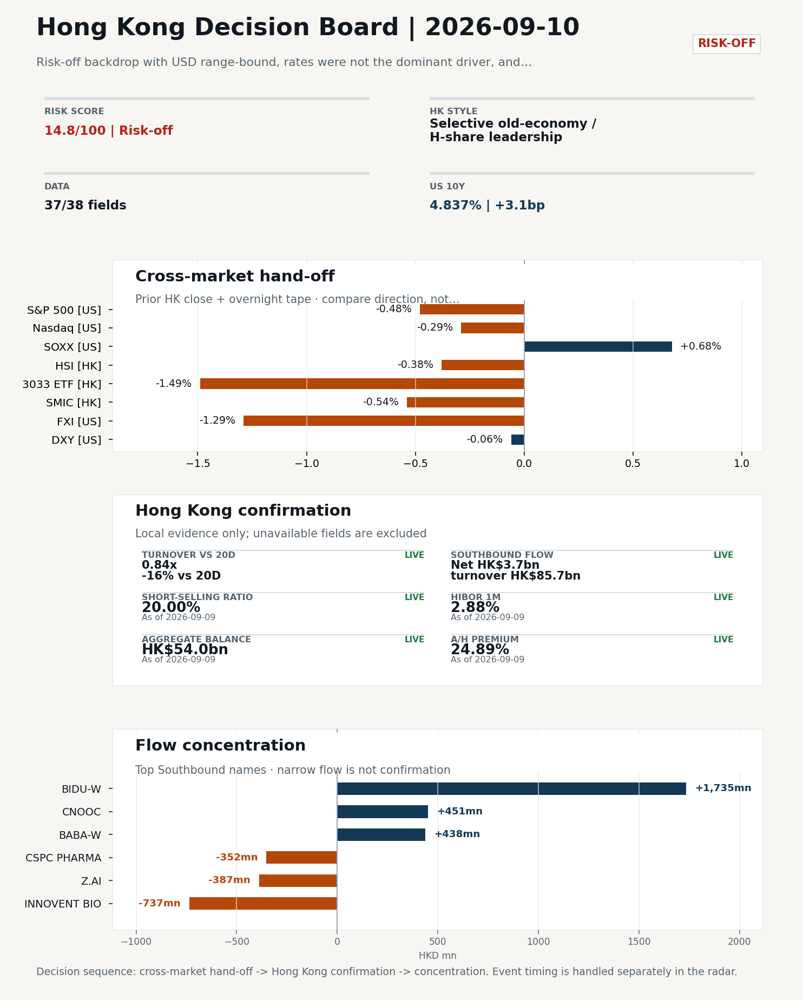
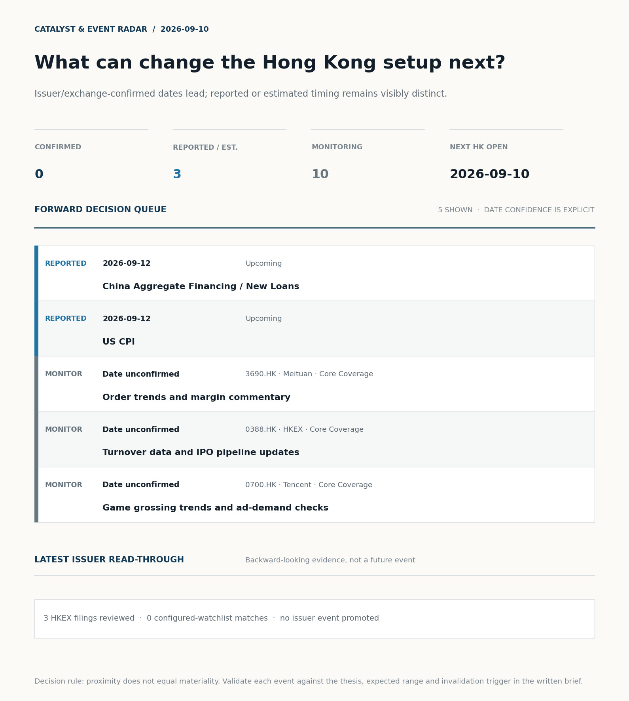
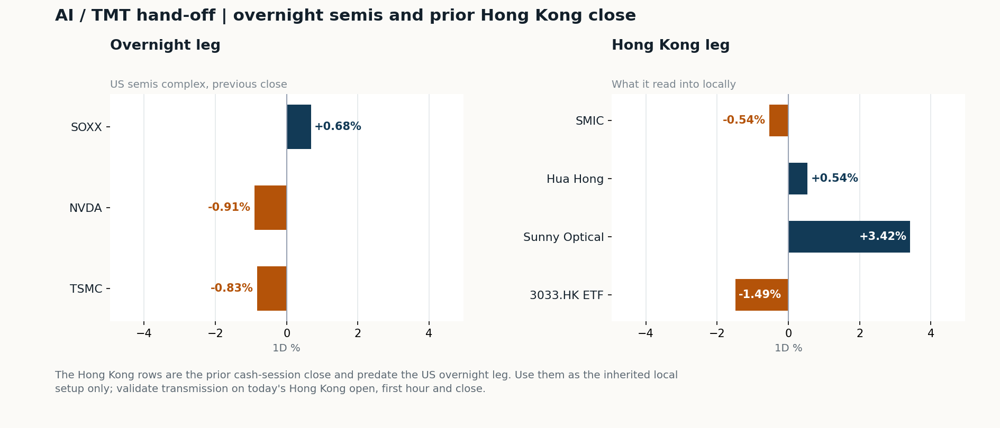
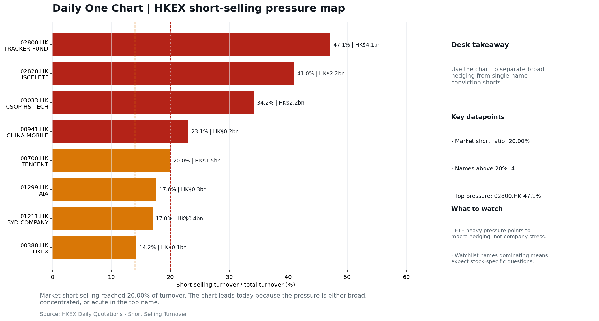

# Morning Research Workbench | 2026-09-10

> **Commute reading route:** `Layer 1 scan (5 min)` → `Layer 2 deep read` → `Layer 3 and appendix if time allows`
>
> Mode: `Trading Daily` | Keep the report execution-oriented: what mattered in the completed session, what can move Hong Kong leadership, and what needs fast follow-up.

_Data through: US/global `2026-09-09` | HK `2026-09-09` | A-share `2026-09-09` | Generated `2026-09-10 07:14:48`_

## Executive Summary

- **Did yesterday's call work?** UNRESOLVED - No comparable next close is available yet, so the call is still open.
- **What changed overnight?** Semis led lower: SOXX +0.68%, NVDA -0.91%, TSMC -0.83%. HSI -0.38% and 3033.HK -1.49%.
- **What it means for AI/TMT** Style, not beta - Selective old-economy / H-share leadership, a 1.11pp spread. Treat banks, energy, telecoms, and SOE yield as the cleaner relative expression; growth beta still needs proof.
- **What to watch today** Next scheduled catalyst: China Aggregate Financing / New Loans on 2026-09-12. Watch whether SMIC and Hua Hong trade with HSCEI rather than with the overnight semis leg.

## Layer 1 | Scan (5 min)

### 1.1 Yesterday's Call
**Verdict: UNRESOLVED.** No comparable next close is available yet, so the call is still open.

**Recent record.** 6 confirmed / 4 broken over the last 10 scoreable calls (60.0% hit rate). This is a directional close-to-close diagnostic, not a track record.

### 1.2 Opening Decision Board

**Global-to-Hong Kong signals**

_Decision-useful subset: each row states the implication and the next test. Descriptive secondary monitors are kept out of the five-minute scan._

| Signal | Last / move | Interpretation | Confirmation / invalidation |
| --- | --- | --- | --- |
| S&P 500 | 7,636.36 / -0.48% | Broad US risk fell without a clear driver in today's fields; treat it as beta, not a signal. | Watch whether Nasdaq and offshore-China proxies move the same way. |
| Nasdaq 100 | 29,421.55 / -0.29% | Growth outperformed broad beta, a supportive style signal for Hong Kong internet and platform names. | 3033.HK versus HSI leadership carries the read; rising yields would undo it. |
| Hang Seng Index | 25,317.18 / -0.38% | The index was carried by old-economy and H-share names, not by broad participation: 3033.HK differs by 1.11pp. | Southbound participation decides whether this is investable or just a print. |
| Hang Seng TECH ETF (3033.HK) | 4.3720 / -1.49% | Hong Kong growth lagged, so broad-index strength is not yet a duration signal. | Needs a stable CNH and Southbound buying to become a duration signal. |
| Semiconductors (SOXX) | 532.00 / +0.68% | Semis led the Nasdaq by 0.97pp, putting the AI capex trade back in front. | SMIC and Hua Hong at the open show whether it transmits to Hong Kong. |
| US 10Y | 4.8370% / +3.1bp | The yield proxy rose, tightening the discount-rate backdrop for long-duration Hong Kong growth. | Read it through 3033.HK relative performance, not the index level. |
| USD/CNH | 6.7045 / +0.00% | CNH was stable, removing an immediate FX impulse but not confirming equity direction. | FXI and Southbound flow decide whether this reaches Hong Kong equities. |
| VIX | 16.46 / **+4.71%** | Higher implied volatility raises the tail-risk premium and weakens risk-on conviction. | Falling volatility on narrowing breadth is a warning, not support. |

_Secondary monitors retained in the source bundle: SMIC (0981.HK), CSI 300, China 10Y, CN-US 10Y spread, DXY, USD/HKD, Brent crude, COMEX gold, Copper._

**Hong Kong local confirmation**

| Check | Value | Status | Source / as of | Why it matters |
| --- | --- | --- | --- | --- |
| Main Board turnover vs 20D | 0.84x \| -16% vs 20D | Live local | HKEX \| 2026-09-09 | Trailing 20-session average turnover was HK$245.4bn. |
| Southbound / Northbound net flow | Southbound Net HK$3.7bn \| turnover HK$85.7bn \| Northbound Turnover RMB246.1bn \| net not reported | Live local | HKEX Connect \| 2026-09-09 | Southbound net buy is calculated from HKEX disclosed buy and sell turnover. |
| Short-selling ratio | 20.00% | Live local | HKEX \| 2026-09-09 | Official HKEX stock-level short-selling table, aggregated as a share of total market turnover. |
| AH premium index | 24.89% | Live public | Yahoo \| 2026-09-09 | Fixed 10-name basket, equal-weighted, both legs priced on the same date; comparable across dates. Covered-pair average was +33.95% across 19 pairs. |
| USD/HKD spot vs band | 7.8414 \| band 7.7500 to 7.8500 | Live quote + local | Yahoo \| 2026-09-09 | Mid-band: 86 pips from the weak side and 914 pips from the strong side, so the peg is not an active constraint. Official Convertibility Undertakings define the linked-rate stress boundaries for USD/HKD. |
| HIBOR 1M | 2.88% | Live local | HKMA \| 2026-09-09 | 1M HIBOR is the cleanest quick read for Hong Kong funding conditions and equity-duration pressure. |
| Hong Kong leadership | Selective old-economy / H-share leadership | Proxy | HSI / HSCEI / 3033.HK ETF relative \| 2026-09-09 | Use HSI / HSCEI / 3033.HK ETF relative moves as the opening style read. |

**Risk state and evidence**

**Composite risk score:** `14.8/100` | **Regime:** `Risk-off`

| Component | Score impact | Evidence |
| --- | --- | --- |
| US beta | -2.9 | S&P 500 -0.48% |
| HK growth ETF proxy | -7.5 | 3033.HK ETF -1.49% |
| Semis complex | +3.4 | SOXX +0.68% |
| Offshore China proxy | -6.5 | FXI -1.29% |
| Dollar pressure | +0.6 | DXY -0.06% |
| Volatility | -9.4 | VIX +4.71% |
| HK short-selling | -8 | Short-selling ratio 20.00% |
| HK turnover | -5 | Turnover 0.84x 20D |

_Base 50 plus the component deltas above. Semis complex entered the score on 2026-08-22; earlier scores in the ledger exclude it._

**Morning Checklist**

1. **Risk-off backdrop with USD range-bound, rates were not the dominant driver, and Nasdaq 100 outperformed FXI**
 Overnight regime | Start by deciding whether the day is about Risk-off conditions or a style pivot.
2. **China Trade Balance (Past expected window (unverified))**
 Macro / policy | Watch whether it changes the day's core market narrative | Industries: Market-wide
3. **China CPI / PPI (Past expected window (unverified))**
 Macro / policy | China demand strength, PPI pass-through, and policy-easing odds | Industries: Consumer, Materials, Property
4. **China Aggregate Financing / New Loans (Upcoming)**
 Macro / policy | Credit expansion, domestic demand chains, and financials | Industries: Banks, Property chain, Infrastructure

## Visual Dashboard

**Catalyst & Event Radar**

**Chart read:** No issuer/exchange-confirmed event date is populated; 3 reported or estimated timing item(s) and 10 undated trigger(s) remain explicit.

_Source: Public calendars, issuer disclosures and configured research watchlists_
## Layer 2 | Core Research (20-30 min)

### 2.1 Global-to-Hong Kong Transmission
**Market Setup**
**Core tape.** Overnight US session was risk-off and rangebound in the dollar, with Nasdaq 100 outperforming FXI by 0.73pp on the cross.
**Main driver.** China sentiment led the downside: FXI fell 1.29% and prior-HK 3033.HK was -1.49%, versus a comparatively orderly S&P 500 at -0.48%.
**HK relevance.** The move was concentrated in offshore-China and HK growth proxies rather than in US mega-caps, consistent with elevated HK short-selling at 20.00% and turnover at only 0.84x the 20-day average.

**Key Drivers**
- Nasdaq 100 outperformed FXI by 0.73pp, showing the drag was China/HK-led rather than US-led, even as S&P 500 fell 0.48% and NVDA/TSM slipped 0.91%/0.83%.
- Short-selling ratio of 20.00% combined with Main Board turnover at 0.84x the 20-day average keeps conviction low and makes rebounds easier to fade.
- Oil +4.26% and copper +1.77% point to a commodity bid that is supportive for energy/cyclicals but a margin/geopolitics headwind for the rest of the tape.
- FXI -1.29% confirmed the prior-HK direction (HSI/HSCEI -0.38%) and the mainland $54bn bank/insurer recap headline landed without a positive tape reaction, reinforcing the risk-off read.

**Hong Kong Read-Through**
**Opening implication.** For the 2026-09-10 HK session, expect a defensive-leaning open with HSCEI/old-economy leadership over 3033.HK likely to persist.
_Hong Kong style leadership and flow confirmation are set out in the Hong Kong review below._

**Watch Points**
- USD composite moved higher by +0.03pct intraday, with a 0.207pct range.
- Main turning points appeared around 2026-09-09 08:15 trough / 2026-09-09 08:50 peak / 2026-09-09 09:10 peak, suggesting event-driven repricing rather than a clean one-way USD move.
- The biggest cross-asset divergence was Nasdaq 100 versus FXI, a spread of 0.731pct.
- Gold moved +0.64pct intraday with a 1.344pct high-low range.

**Curated overnight stories**
1. **China says it will pump $54 billion into banks and insurers - but their stocks still fell**
 Why it matters: Signals ongoing state recapitalisation of the financial system while the initial market reaction was negative, indicating scepticism on transmission to earnings or capital…
 HK read-through: Direct read-through to HK-listed Chinese banks (ICBC, CCB, ABC, BOC, BoCom) and the insurers (Ping An, AIA, China Life).
2. **China's EV makers shift gears to focus on humanoids as car market slows**
 Why it matters: Flags a strategic pivot by Chinese EV names toward humanoid robotics as auto demand cools, which reframes long-term TAM for components, sensors and AI hardware exposure.
 HK read-through: Most relevant for HK-listed EV/auto leaders and component suppliers, plus listed proxies for humanoid/cobot supply chains.
3. **China Trade Balance, CPI/PPI and Aggregate Financing/New Loans on the near-term calendar**
 Why it matters: The next batch of China activity, price and credit prints will set the policy-easing narrative and shape demand-side expectations for the mainland and HK.
 HK read-through: Property, materials, industrials and banks are most sensitive to credit and PPI surprises; consumer discretionary is sensitive to CPI/Trade.
4. **US CPI (upcoming) and broader risk-off overnight backdrop with USD range-bound**
 Why it matters: Rates were not the dominant driver overnight, but the upcoming US CPI print will reset USD and global rate expectations, which steers flows into HK.
 HK read-through: A hot print would pressure HK rate-sensitive growth/internet and could lift the HK dollar-funded side; a soft print supports HK tech and the southbound bid.
5. **Adani Enterprises shares jump as airport unit enters into $1 billion fundraising deal**
 Why it matters: Emerging-markets corporate action headline with limited direct HK linkage, but illustrates ongoing EM primary-capital activity.
 HK read-through: Indirect read-through to HK-listed infrastructure/airport peers and EM sentiment; we do not have evidence of a direct transmission channel, so impact is flagged as low.

**AI / TMT hand-off**

**Overnight leg.** The overnight semis leg was flat (-0.35% average), so it does not set the direction for Hong Kong tech today.
**Hong Kong expression.** Let local flow and style leadership drive the tech read rather than the overnight tape.
**Observable test.** Watch whether SMIC and Hua Hong trade with HSCEI rather than with the overnight semis leg.

| Name | Role in the chain | 1D | Leg |
| --- | --- | --- | --- |
| SOXX | Semis complex | +0.68% | overnight |
| NVDA | AI capex narrative | -0.91% | overnight |
| TSMC | Foundry demand | -0.83% | overnight |
| SMIC | Leading-edge / domestic substitution | -0.54% | Hong Kong |
| Hua Hong | Mature-node pricing cycle | +0.54% | Hong Kong |
| Sunny Optical | Hardware and optics supply chain | +3.42% | Hong Kong |
| 3033.HK ETF | Broad HK tech beta | -1.49% | Hong Kong |

**Clock discipline.** The Hong Kong rows are the prior cash-session close and predate the US overnight leg. Use them as the inherited local setup only; validate transmission on today's Hong Kong open, first hour and close.

### 2.2 Hong Kong Local Tape and Flow
**Local Tape Setup**
**Local read.** Hong Kong opens into a confirmed risk-off tape with the drag concentrated in HK growth rather than US beta.
**Verification point.** Local flow is thin and defensive: Main Board turnover 0.84x the 20-session average, short-selling at 20.00% of turnover, and the highest stock-level short ratios sit in HSTECH ETFs (03067.HK 71.89%, 07226.HK 70.62%) rather than single names.
**Risk to watch.** Cross-asset signals split: WTI +4.16% and USO inflow support energy/cyclicals while gold +0.64% flags a mild defensive bid, and the $54bn mainland bank/insurer recap landed without a positive tape reaction.

**Style and Local Leadership**
**Style call.** Selective old-economy / H-share leadership.
- **Evidence:** HSCEI beat 3033.HK by 1.11pp (-0.38% versus -1.49%)
- **Portfolio meaning:** Treat banks, energy, telecoms, and SOE yield as the cleaner relative expression; growth beta still needs proof.
- **Cross-market read:** Offshore China proxy FXI -1.29% and USD/CNH +0.00% frame cross-border risk appetite. USD/HKD last traded around 7.8414, which keeps the Hong Kong funding lens in focus.

**Flow Confirmation**
Official Stock Connect evidence is available; the Flow Tracker confirms whether local money supports the price action.

**Follow-Through Checklist**
**Follow-through check.** For 2026-09-10 HK open: (1) If 3033.HK reclaims HSI/HSCEI on turnover >1.0x 20D and short-selling ratio drops below ~17%, the overnight China-led drag is reversing and growth leadership is confirmed.
**Failure condition.** Invalidate if 3033.HK retakes leadership while CNH firms and local participation broadens.

**Cross-asset attribution**

| Driver | Direction | Score | Evidence | HK implication |
| --- | --- | --- | --- | --- |
| Short-selling pressure | drag | 3.5 | HKEX short-selling ratio was 20.00%. | Elevated short activity argues for extra confirmation before chasing rebounds. |
| Oil and geopolitics | mixed | 3.33 | Oil moved +4.16%. | Split the read between energy/cyclicals support and margin/geopolitical pressure. |
| Hong Kong participation | drag | 1.65 | Main Board turnover was 0.84x the 20-session average. | Thin turnover makes index moves easier to fade. |

**Local flow evidence**

**Flow Takeaways**
- Short-selling pressure is elevated, so local rebounds need cleaner breadth and flow confirmation.
- Stock Connect Southbound: net HK$3.7bn on turnover HK$85.7bn (as of 2026-09-09).
- Stock Connect Northbound: turnover RMB246.1bn; public file provides total turnover/top active names, not full net-buy.
- AH premium: fixed 10-name basket +24.89% (comparable across dates); covered-pair average +33.95% over 19 pairs; widest premium: China Communications Construction 99.26%.

**Stock Connect Southbound Active Names**

| # | Ticker | Name | Buy | Sell | Net buy | HKEX turnover rank |
| --- | --- | --- | --- | --- | --- | --- |
| 1 | 09888.HK | BIDU-W | HK$1,756.9mn | HK$22.1mn | HK$1,734.8mn | 2 |
| 2 | 01801.HK | INNOVENT BIO | HK$21.5mn | HK$758.1mn | HK$-736.5mn | 6 |
| 3 | 00883.HK | CNOOC | HK$1,260.2mn | HK$809.0mn | HK$451.2mn | 4 |
| 4 | 09988.HK | BABA-W | HK$848.3mn | HK$410.4mn | HK$437.9mn | 7 |
| 5 | 02513.HK | Z.AI | HK$1,194.8mn | HK$1,582.1mn | HK$-387.3mn | 3 |

**AH Premium Dispersion**

| Name | A ticker | H ticker | Premium | As of |
| --- | --- | --- | --- | --- |
| China Communications Construction | 601800.SS | 1800.HK | +99.26% | 2026-09-09 |
| Everbright Bank | 601818.SS | 6818.HK | +84.82% | 2026-09-09 |
| China Railway Construction | 601186.SS | 1186.HK | +61.40% | 2026-09-09 |

**HKEX Short-Selling Watch**

| Ticker | Name | Short ratio | Short turnover | Total turnover |
| --- | --- | --- | --- | --- |
| 00388.HK | HKEX | 14.23% | HK$0.1bn | HK$0.9bn |
| 00700.HK | TENCENT | 19.99% | HK$1.5bn | HK$7.7bn |
| 00941.HK | CHINA MOBILE | 23.05% | HK$0.2bn | HK$0.7bn |

- **Short-value leaders:** 02800.HK TRACKER FUND (HK$4.1bn); 03033.HK CSOP HS TECH (HK$2.2bn); 02828.HK HSCEI ETF (HK$2.2bn); 00700.HK TENCENT (HK$1.5bn).

### 2.3 Macro Transmission
**Desk read.** The macro agenda into the 10 September HK session is dominated by two unverified China prints already in the rear-view window - the 7 September Trade Balance and the 9 September CPI/PPI - and two confirmed upcoming catalysts on 12 September: China Aggregate Financing/New Loans and US CPI, followed by China activity data (IP/Retail Sales/FAI) on 15 September.

**Market sensitivity.** The 9 September session closed in a risk-off regime with USD range-bound and the rate channel not dominant, while VIX jumped 4.71% and WTI added 4.26%; rates have therefore not yet been the transmission belt for the move.

**HK implication.** Because HKD is pegged, any US CPI surprise on Friday is the cleanest channel into HK equity duration via HIBOR and the HKMA balance, with NVDA (-0.91%) and TSMC (-0.83%) overnight confirming that HK tech leadership remains the marginal driver rather than China cyclicals.

**Macro watchpoints**
- Verify the official 9 September China CPI/PPI print and 7 September Trade Balance before leaning on a margin or demand thesis
- US CPI on 12 September as the primary channel into HK equity duration via the HIBOR/HKMA peg - any surprise resets the rates-and-dollar backdrop.
- China Aggregate Financing/New Loans on 12 September for a fresh read on the credit impulse and the Banks/property-chain/infrastructure rotation.
- China activity data (IP/Retail Sales/FAI) on 15 September to confirm or overturn any near-term consumer-discretionary leadership.

| Time | Region | Event | Status | Desk read |
| --- | --- | --- | --- | --- |
| | CN | China Trade Balance | Past expected window (unverified) | Impact: Watch whether it changes the day's core market narrative \| Attention: 3/5 \| Industries: Market-wide |
| | CN | China CPI / PPI | Past expected window (unverified) | Impact: China demand strength, PPI pass-through, and policy-easing odds \| Attention: 3/5 \| Industries: Consumer, Materials, Property |
| | CN | China Aggregate Financing / New Loans | Upcoming | Impact: Credit expansion, domestic demand chains, and financials \| Attention: 5/5 \| Industries: Banks, Property chain, Infrastructure |
| | US | US CPI | Upcoming | Impact: Rates expectations, the dollar, and growth-equity valuation \| Attention: 5/5 \| Industries: Technology, Internet, Brokers |
| | CN | China Activity Data (IP / Retail Sales / FAI) | Upcoming | Impact: Consumer resilience, growth expectations, and risk-asset pricing \| Attention: 5/5 \| Industries: Consumer, E-commerce, Consumer discretionary |

**Positioning and risk backdrop**

- Detailed local flow evidence is covered under Flow Tracker and Attribution; keep this section focused on options, hedging, and macro-positioning risk.

### 2.4 Company Micro Research and Catalysts
No high-conviction sector story cleared the main-report relevance gate for this run.

**Company Event Takeaway**
**Desk read.** Hong Kong opens 2026-09-10 with a risk-off global tape and no rating actions to anchor the day.
**Why it matters.** Among coverage names, Meituan (3690.HK) is the only stock with a material session move (-3.47% at 77.8) and sits mid-range.
**Follow-up.** BYD (1211.HK) is down 2.44% and the CNBC piece on Chinese EV makers rotating R&D toward humanoids is worth flagging as a multi-quarter capital-allocation narrative for 1211.HK and the Hong Kong-listed EV complex, not as a same-day earnings input.

**LLM Quick Takes**
- **3690.HK** | Closed -3.47% at 77.8, mid-range at 46% of 60-session band. Last reported quarter (Q2 2026) showed 14.4% revenue growth and core local commerce returning to profit, so today's move is not…
- **1211.HK** | Closed -2.44% at 81.8, mid-range at 42% of 60-session band. Sector context: CNBC flags Chinese EV makers shifting engineering focus to humanoids as auto demand slows, which is relevant…
- **0388.HK** | Closed -0.40% at 400.4, mid-range at 72% of 60-session band. Treat as a turnover/IPO proxy rather than a signal today; no company-specific catalyst supplied. Next check…
- **1299.HK** | Closed +0.07% at 76.95, top of range (77% of 60-session band). No supplied catalyst; remains a read-through for mainland visitor activity and HK financial sentiment. Next check…

Decision filter<h4>No immediate portfolio catalyst: 3 official filings were screened and the low-signal market set stays aggregated.</h4>
3 profit warnings

<strong>3</strong>Official filings

<strong>0</strong>Watchlist hits

<strong>0</strong>Actionable events

<strong>No event cleared the portfolio decision filter.</strong>

Broad-market filings remain traceable in the source appendix; they are not expanded here without a watchlist, estimate or liquidity read-through.

<strong>Coverage boundary.</strong> sell-side rating changes, IPO / grey-market monitor were not decision-grade in this run; their absence is not treated as confirmation that no event exists.

**Core coverage requiring follow-up**

**Core coverage**

| Name | Ticker | Last | 1D | Range position | Morning note |
| --- | --- | --- | --- | --- | --- |
| Meituan | 3690.HK | 77.80 | -3.47% | Mid-range | Down 3.47% on the session, mid-range at 46% of its 60-session band. |
| HKEX | 0388.HK | 400.40 | -0.40% | Mid-range | Marginally lower (-0.40%), mid-range at 72% of its 60-session band. |

**Recent headlines for Meituan:**
- [Meituan (MPNGF) (Q2 2026) Earnings Call Highlights: Record Revenue and Strategic AI Pivot Drive...](https://finance.yahoo.com/markets/stocks/articles/meituan-mpngf-q2-2026-earnings-190123345.html) (GuruFocus.com)

**Priority follow-up**

| Name | Ticker | Last | 1D | Range position | Morning note |
| --- | --- | --- | --- | --- | --- |
| BYD Company | 1211.HK | 81.80 | -2.44% | Mid-range | Down 2.44% on the session, mid-range at 42% of its 60-session band. |
| AIA | 1299.HK | 76.95 | +0.07% | Top of range | Marginally higher (+0.07%), in the top quartile of its 60-session range (77%). |

### 2.5 Morning Meeting Questions
**Q1. The index fell but Southbound bought - is the move real?**
- **Evidence:** HSI -0.38% against Southbound net +3.7bn HKD.
- **How to answer:** Treat it as unconfirmed. Price and mainland flow disagreed, so the price move was not driven by Southbound participation; it needs another session of confirmation before being read as a trend.

**Q2. The index was -0.38% but tech lagged at -1.49% - what drove the split?**
- **Evidence:** HSI -0.38% versus 3033.HK -1.49%, a 1.11pp spread.
- **How to answer:** This was a style move, not a beta move: the 1.11pp spread means index direction alone does not describe the session. Old-economy and H-share names carried the index while growth lagged.

## Layer 3 | Session Playbook (8-12 min)

### 3.1 Base Case and Scenario Map
**Starting posture.** Selective old-economy / H-share leadership (medium confidence); composite risk `14.8/100` (Risk-off). Treat banks, energy, telecoms, and SOE yield as the cleaner relative expression; growth beta still needs proof.

**Scenario map**

| Scenario | Observable trigger | Interpretation | Research response |
| --- | --- | --- | --- |
| Selective growth confirms | 3033.HK keeps a >0.5pp first-hour lead over HSCEI; SMIC and Hua Hong stop lagging broad beta; CNH is stable. | The prior style split has live price confirmation, but is not yet broad China risk-on. | Prioritize internet/platform relative strength; verify participation again at the close. |
| Broad beta takes over | HSI and HSCEI rise together, breadth improves and the 3033.HK lead narrows without turning negative. | Leadership is broadening from a style trade into market beta. | Expand the research set from growth leaders to financials, SOEs and index-heavy names. |
| Risk-off continuation | 3033.HK loses its lead, semis underperform HSCEI and CNH depreciation accelerates. | The prior divergence was a temporary pocket of strength rather than a durable hand-off. | Treat rebounds as unconfirmed; focus on balance-sheet, catalyst and crowding risk. |

**Clocked validation scorecard**

| Window | Check | Prior evidence | Pass condition | What it decides |
| --- | --- | --- | --- | --- |
| 09:30-10:30 | 3033.HK vs HSCEI | -1.11pp at the prior close | 3033.HK retains >0.5pp relative lead | Whether growth leadership survives the open |
| 09:30-10:30 | Semiconductor hand-off | SMIC -0.54%; Hua Hong Semiconductor +0.54% | Stabilise after the open; at least one stops underperforming HSCEI | Whether overnight semis pressure is contained locally |
| 09:30-10:30 | HSI price zone | 25,317 vs 25,000 / 25,500 reference grid | Hold above the lower grid or reclaim the upper grid with breadth | Whether broad beta is stabilising; grid is derived, not technical analysis |
| 09:30-10:30 | USD/CNH | 6.7045 \| +0.00% | No acceleration in CNH depreciation | Whether FX permits a clean Hong Kong risk extension |
| At close | Turnover | 0.84x \| -16% vs 20D | At least 1.0x the 20-session average | Whether the move had normal participation |
| At close | Southbound | Net HK$3.7bn \| turnover HK$85.7bn | Net buying remains positive and broadens beyond one or two names | Whether mainland money confirms the price move |
| At close | Short pressure | 20.00% | Falls versus the prior verified reading (20.00%) | Whether rebound conviction improved |

**Upgrade rule.** Confirm if HSCEI keeps outperforming 3033.HK with healthy turnover and broad Southbound participation.
**Kill switch.** Invalidate if 3033.HK retakes leadership while CNH firms and local participation broadens.
**Clock discipline.** At 07:30, same-day Southbound, turnover and short-selling outcomes are not known. Use the first-hour price/FX checks provisionally and make the final classification only after the close.
**Event clock.** No same-day decision-grade item is populated; the nearest reported/estimated item is China Aggregate Financing / New Loans on 2026-09-12. Verify the issuer or official calendar before relying on the date.

### 3.2 Daily One Chart
**Daily One Chart | HKEX short-selling pressure map**

**Chart read.** Market short-selling reached 20.00% of turnover.
**Why it matters.** The chart leads today because the pressure is either broad, concentrated, or acute in the top name.

_Source: HKEX Daily Quotations - Short Selling Turnover_

## Optional Appendix | Traceability and Performance (10-15 min)

### Report Metadata
> Date policy: Review date 2026-09-09 is treated as `Trading Daily`. | Global (US/Europe) data date is 2026-09-09; adapter effective date is 2026-09-09 and summary date is 2026-09-09. | Hong Kong local data date is 2026-09-09; role: same-session local cash tape.
> Market data quality: Coverage: `37/38` | Missing: `1`
> Report quality: `88.1/100` | Grade `B` | Status `manual review`

### Report Quality and Validation
- **Quality score:** 88.1/100 | **Grade:** B | **Status:** manual review
- **Run summary:** 8 healthy | 2 caveat | 0 failed
- **Release recommendation:** Manual review | Fact validation produced a release-blocking error; automatic distribution is blocked.

| Source | Status | Bucket |
| --- | --- | --- |
| Macro calendar | partial | caveat |
| Risk and sentiment feed | partial | caveat |

**Desk-use guidance summary:** 1 blocking | 0 advisory

**Desk-use guidance**
- **Blocking:** Fact validation has a release-blocking finding; review it before distribution.

| Weak component | Score | Read |
| --- | --- | --- |
| Fact-check guardrail | 50.0 | Checked 24 numeric claims; 2 numeric mismatch(es), 0 logic warning(s); 14 structured claims, 0 source/text warning(s); 2 critical, 0 review. |

**Quality warnings**
- Fact-check guardrail is weak: Checked 24 numeric claims; 2 numeric mismatch(es), 0 logic warning(s); 14 structured claims, 0 source/text warning(s); 2 critical, 0 review.
- Narrative fact-check guardrail produced warnings; review the validation table before relying on narrative sections.

**Narrative fact-check guardrail**
- Checked 24 numeric claims; 2 numeric mismatch(es), 0 logic warning(s); 14 structured claims, 0 source/text warning(s); 2 critical, 0 review.
- **Deterministic fallback fields:** tasks.hk_review.paragraph, tasks.overnight_review.paragraph

| Severity | Field | Claim | Type | Claimed | Expected | Snippet |
| --- | --- | --- | --- | --- | --- | --- |
| critical | deep_read_setup | Gold | change_pct | 0.64 | 1.2 | er +1.77% suggest a demand/geopolitics mix, while gold +0.64% flags a mild defensive bid. |
| critical | hk_review_setup | Gold | change_pct | 0.64 | 1.2 | 16% and USO inflow support energy/cyclicals while gold +0.64% flags a mild defensive bid, and the $54bn mainlan |

_Full component weights, per-source freshness, adapter status and provenance records are archived with this report under `audit/` rather than printed here._

### Historical Signal Performance
- **Readiness:** exploratory with caveats | 69 observations | 97 active signal dates | next-close entry, 10bps cost, no same-day returns.
- **Interpretation boundary:** exploratory until a benchmark reaches 252 sessions and 100 active-signal sessions.
- **Data-quality caveat:** 23 conflicting price revision(s) and 6 non-session observation(s) remain in the research ledger.
- **Daily-use boundary:** cumulative return, Sharpe and the performance chart stay out of the daily commute edition until the sample and trading-calendar gates pass; use Yesterday's Call instead.

### Source Links
- [Meituan (MPNGF) (Q2 2026) Earnings Call Highlights: Record Revenue and Strategic AI Pivot Drive...](https://finance.yahoo.com/markets/stocks/articles/meituan-mpngf-q2-2026-earnings-190123345.html) (GuruFocus.com)
- [Meituan Returns to Profit as Food-Delivery Competition Eases](https://www.wsj.com/business/earnings/meituan-returns-to-profit-as-food-delivery-competition-eases-1026a0e9?siteid=yhoof2&yptr=yahoo) (The Wall Street Journal)
- [Tencent Slips Before Its $912 Million AI-Chip Bet Debuts](https://finance.yahoo.com/technology/ai/articles/tencent-slips-912-million-ai-185244984.html) (GuruFocus.com)
- [Tencent Slips 1% While Its AI-Chip Bet Attacks Nvidia's China Moat](https://finance.yahoo.com/technology/ai/articles/tencent-slips-1-while-ai-215226124.html) (GuruFocus.com)
- [Alibaba Drops 2.6% as U.S. Turns AI Distillation Into a Security Threat](https://finance.yahoo.com/technology/ai/articles/alibaba-drops-2-6-u-180815461.html) (GuruFocus.com)
- [02293.HK Profit warning / alert announcement](http://www1.hkexnews.hk/listedco/listconews/sehk/2026/0909/2026090900364.pdf) (HKEXnews)
- [08547.HK Profit warning / alert announcement](http://www1.hkexnews.hk/listedco/listconews/gem/2026/0908/2026090800520.pdf) (HKEXnews)
- [00722.HK Profit warning / alert announcement](http://www1.hkexnews.hk/listedco/listconews/sehk/2026/0904/2026090402367.pdf) (HKEXnews)
