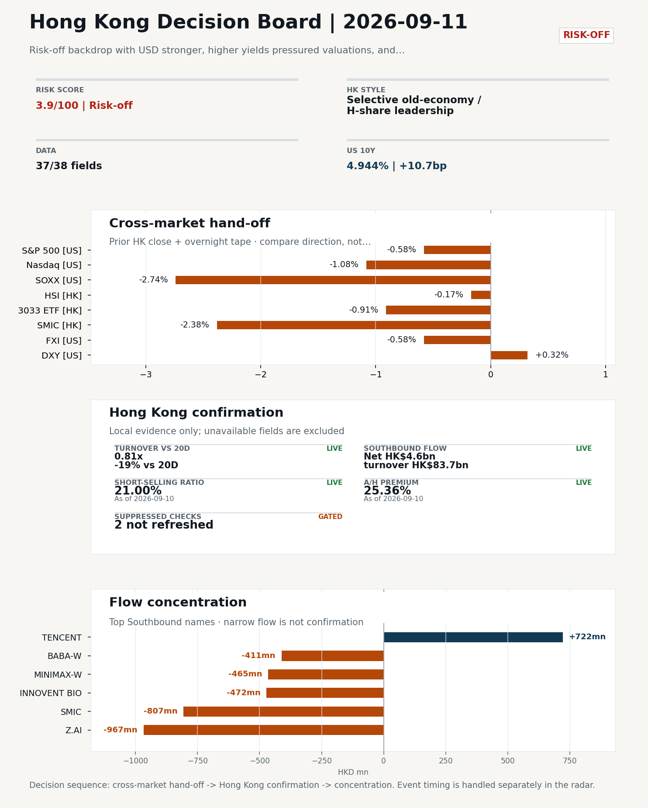
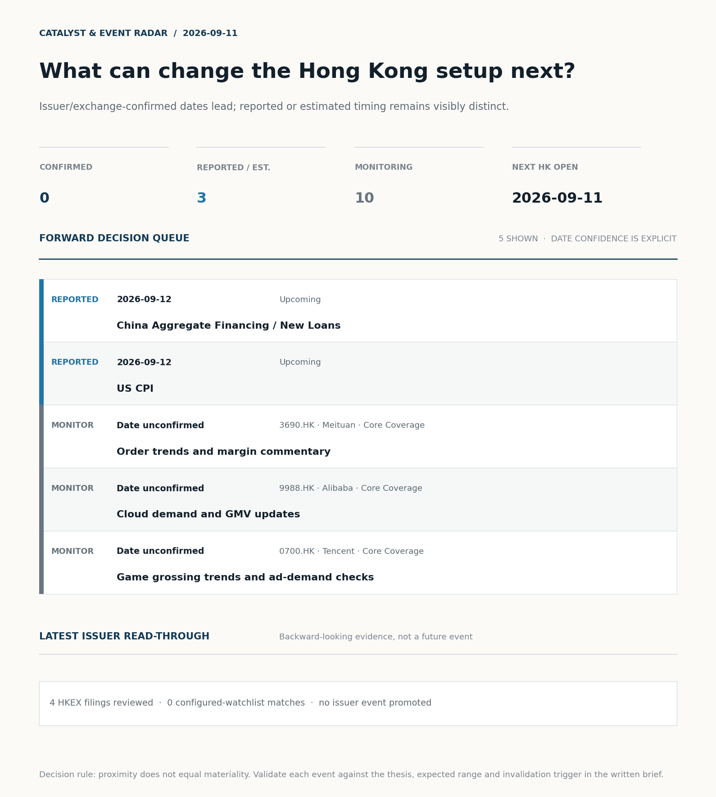
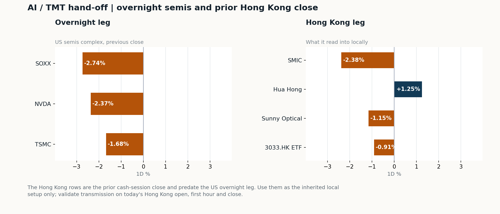
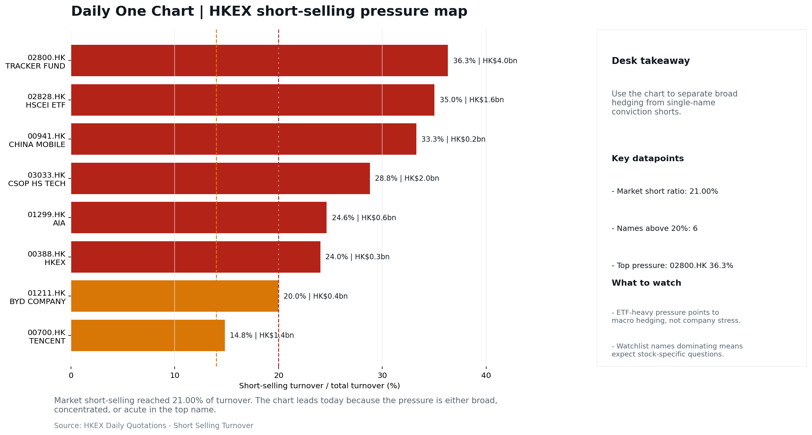

# Morning Research Workbench | 2026-09-11

> **Commute reading route:** `Layer 1 scan (5 min)` → `Layer 2 deep read` → `Layer 3 and appendix if time allows`
>
> Mode: `Trading Daily` | Keep the report execution-oriented: what mattered in the completed session, what can move Hong Kong leadership, and what needs fast follow-up.

_Data through: US/global `2026-09-10` | HK `2026-09-10` | A-share `2026-09-10` | Generated `2026-09-11 07:10:41`_

## Executive Summary

- **Did yesterday's call work?** NO CALL - The 2026-09-10 report published no directional call because release was blocked on quality.
- **What changed overnight?** Semis led lower: SOXX -2.74%, NVDA -2.37%, TSMC -1.68%. HSI -0.17% and 3033.HK -0.91%.
- **What it means for AI/TMT** Style, not beta - Selective old-economy / H-share leadership, a 0.57pp spread. Treat banks, energy, telecoms, and SOE yield as the cleaner relative expression; growth beta still needs proof.
- **What to watch today** Next scheduled catalyst: China Aggregate Financing / New Loans on 2026-09-12. Confirm if SMIC and Hua Hong open in the same direction as the overnight leg and hold it through the first hour; invalidate if they track HSCEI instead.

## Layer 1 | Scan (5 min)

### 1.1 Yesterday's Call
**Verdict: NO CALL.** The 2026-09-10 report published no directional call because release was blocked on quality.

**Recent record.** 6 confirmed / 4 broken over the last 10 scoreable calls (60.0% hit rate). This is a directional close-to-close diagnostic, not a track record.

### 1.2 Opening Decision Board

**Global-to-Hong Kong signals**

_Decision-useful subset: each row states the implication and the next test. Descriptive secondary monitors are kept out of the five-minute scan._

| Signal | Last / move | Interpretation | Confirmation / invalidation |
| --- | --- | --- | --- |
| S&P 500 | 7,591.70 / -0.58% | Broad US risk fell without a clear driver in today's fields; treat it as beta, not a signal. | Watch whether Nasdaq and offshore-China proxies move the same way. |
| Nasdaq 100 | 29,103.51 / -1.08% | Growth lagged broad beta, warning that headline risk-on may not transmit cleanly to the 3033.HK ETF proxy. | 3033.HK versus HSI leadership carries the read; rising yields would undo it. |
| Hang Seng Index | 25,274.96 / -0.17% | The index was carried by old-economy and H-share names, not by broad participation: 3033.HK differs by 0.74pp. | Southbound participation decides whether this is investable or just a print. |
| Hang Seng TECH ETF (3033.HK) | 4.3320 / -0.91% | Hong Kong growth lagged, so broad-index strength is not yet a duration signal. | Needs a stable CNH and Southbound buying to become a duration signal. |
| Semiconductors (SOXX) | 517.43 / **-2.74%** | Semis underperformed the Nasdaq by 1.66pp, so this is a cycle move rather than broad growth weakness. | SMIC and Hua Hong at the open show whether it transmits to Hong Kong. |
| US 10Y | 4.9440% / +10.7bp | The yield proxy rose, tightening the discount-rate backdrop for long-duration Hong Kong growth. | Read it through 3033.HK relative performance, not the index level. |
| USD/CNH | 6.7145 / +0.14% | A higher USD/CNH means a weaker offshore renminbi, a headwind for offshore-China sentiment. | FXI and Southbound flow decide whether this reaches Hong Kong equities. |
| VIX | 17.84 / **+8.38%** | Higher implied volatility raises the tail-risk premium and weakens risk-on conviction. | Falling volatility on narrowing breadth is a warning, not support. |

_Secondary monitors retained in the source bundle: SMIC (0981.HK), CSI 300, China 10Y, CN-US 10Y spread, DXY, USD/HKD, Brent crude, COMEX gold, Copper._

**Hong Kong local confirmation**

_Coverage gate: 1 unavailable local checks are suppressed here and retained in validation metadata._

| Check | Value | Status | Source / as of | Why it matters |
| --- | --- | --- | --- | --- |
| Main Board turnover vs 20D | 0.81x \| -19% vs 20D | Live local | HKEX \| 2026-09-10 | Trailing 20-session average turnover was HK$244.8bn. |
| Southbound / Northbound net flow | Southbound Net HK$4.6bn \| turnover HK$83.7bn \| Northbound Turnover RMB223.7bn \| net not reported | Live local | HKEX Connect \| 2026-09-10 | Southbound net buy is calculated from HKEX disclosed buy and sell turnover. |
| Short-selling ratio | 21.00% | Live local | HKEX \| 2026-09-10 | Official HKEX stock-level short-selling table, aggregated as a share of total market turnover. |
| AH premium index | 25.36% | Live public | Yahoo \| 2026-09-10 | Fixed 10-name basket, equal-weighted, both legs priced on the same date; comparable across dates. Covered-pair average was +31.09% across 17 pairs. |
| USD/HKD spot vs band | 7.8422 | Live quote | Yahoo \| 2026-09-10 | 78 pips from the weak-side CU (7.8500); monitor HKMA operations and the aggregate balance for a funding squeeze. |
| Hong Kong leadership | Selective old-economy / H-share leadership | Proxy | HSI / HSCEI / 3033.HK ETF relative \| 2026-09-10 | Use HSI / HSCEI / 3033.HK ETF relative moves as the opening style read. |

**Risk state and evidence**

**Composite risk score:** `3.9/100` | **Regime:** `Risk-off`

| Component | Score impact | Evidence |
| --- | --- | --- |
| US beta | -3.5 | S&P 500 -0.58% |
| HK growth ETF proxy | -4.5 | 3033.HK ETF -0.91% |
| Semis complex | -9 | SOXX -2.74% |
| Offshore China proxy | -2.9 | FXI -0.58% |
| Dollar pressure | -3.2 | DXY +0.32% |
| Volatility | -10 | VIX +8.38% |
| HK short-selling | -8 | Short-selling ratio 21.00% |
| HK turnover | -5 | Turnover 0.81x 20D |

_Base 50 plus the component deltas above. Semis complex entered the score on 2026-08-22; earlier scores in the ledger exclude it._

**Morning Checklist**

1. **Risk-off backdrop with USD stronger, higher yields pressured valuations, and Nasdaq 100 outperformed FXI**
 Overnight regime | Start by deciding whether the day is about Risk-off conditions or a style pivot.
2. **VIX +8.38%**
 High-frequency data | Higher volatility argues for tighter sizing and tighter stops. (second-order macro context)
3. **China Trade Balance (Past expected window (unverified))**
 Macro / policy | Watch whether it changes the day's core market narrative | Industries: Market-wide
4. **China CPI / PPI (Past expected window (unverified))**
 Macro / policy | China demand strength, PPI pass-through, and policy-easing odds | Industries: Consumer, Materials, Property

## Visual Dashboard

**Catalyst & Event Radar**

**Chart read:** No issuer/exchange-confirmed event date is populated; 3 reported or estimated timing item(s) and 10 undated trigger(s) remain explicit.

_Source: Public calendars, issuer disclosures and configured research watchlists_
## Layer 2 | Core Research (20-30 min)

### 2.1 Global-to-Hong Kong Transmission
**Market Setup**
**Core tape.** Prior-HK session (2026-09-10) closed in a selective risk-off mode: HSCEI outperformed 3033.HK ETF by 0.57pp (-0.34% vs -0.91%), with SMIC -2.38% and SOXX -2.74% dragging the growth side.
**Main driver.** Overnight-US turned more defensive: S&P 500 -0.58%, Nasdaq 100 -1.08%, NVDA -2.37%, TSMC ADR -1.68%, while DXY firmed +0.32% and US 10Y yields rose +10.7bp, leaving FXI -0.58%.
**HK relevance.** The core question for today is whether the SOXX/NVDA weakness and the stronger dollar reach HK through SMIC and 3033.HK, or whether the H-share/old-economy leadership holds.

**Key Drivers**
- Oil +8.20% on the prior-HK tape and the overnight geopolitics impulse split the read between energy/cyclicals support and margin pressure.
- US 10Y +10.7bp and DXY +0.32% pressure long-duration growth and offshore China.
- Nasdaq 100 -1.08% with NVDA -2.37% and TSMC ADR -1.68% directly threaten 3033.HK and SMIC at the open.
- HK participation is thin (turnover 0.81x 20D) and short-selling ratio 21.00% (84th pct) argue against chasing any rebound without cleaner breadth and Southbound follow-through beyond the +HK$4.6bn net buy.

**Hong Kong Read-Through**
**Opening implication.** For today's HK session (2026-09-11), expect downside pressure on 3033.HK and SMIC first, with HSCEI, banks, energy, telecoms and SOE yield better placed to hold relative value if USD stays firm and US yields do not roll over. A constructive open requires CNH to stabilize and 3033.HK to retake leadership with broader Southbound participation; otherwise, fade bounces given the thin turnover and elevated short ratio. For the next HK session (2026-09-14), the key follow-up is whether the semis complex stabilizes with NVDA/TSMC/SOXX and whether Hua Hong's prior-day strength extends, which would be the first sign that the growth beta is repairing.
_Hong Kong style leadership and flow confirmation are set out in the Hong Kong review below._

**Watch Points**
- USD composite moved higher by +0.36pct intraday, with a 0.424pct range.
- Main turning points appeared around 2026-09-10 08:10 trough / 2026-09-10 08:25 trough / 2026-09-10 08:40 peak, suggesting event-driven repricing rather than a clean one-way USD move.
- The biggest cross-asset divergence was Nasdaq 100 versus FXI, a spread of 0.426pct.
- Gold moved -2.18pct intraday with a 2.657pct high-low range.

**Curated overnight stories**
1. **China's EV makers shift gears to focus on humanoids as car market slows**
 Why it matters: It reframes the growth narrative for a sector where the core auto market is slowing, and reintroduces humanoid robotics as a forward-looking theme.
 HK read-through: Most relevant for HK-listed EV names and adjacent robotics/automation plays; valuation upside depends on credibility of the robotics pivot rather than near-term car sales.
2. **Stocks making the biggest moves premarket/midday: Meta, Apple, Macy's, Casey's, Signet**
 Why it matters: US consumer and mega-cap moves set the tape for ADRs and the Hang Seng's tech/consumer components into the Asia open.
 HK read-through: Read-through to HK internet/consumer names and US-listed China ADRs; secondary read-through for HK retailers with US exposure.
3. **Ant International partners with Visa, Mastercard on developing AI payments**
 Why it matters: It ties a major China fintech affiliate to global card networks around AI-driven payments, a strategic adjacency for Ant Group.
 HK read-through: Indirect read-through to HK-listed fintech and payments names; relevance is narrative/strategic rather than an immediate earnings driver.
4. **OpenAI targets work of Wall Street junior bankers with new ChatGPT for Financial Services**
 Why it matters: A direct AI displacement signal for entry-level finance workflows; supports the productivity-AI capex theme.
 HK read-through: Limited direct HK impact; relevant only as a sentiment backdrop for HK-listed AI-exposed software/cloud names if any.
5. **Adani Enterprises shares jump as airport unit enters into $1 billion fundraising deal**
 Why it matters: Emerging-market capital-markets activity and a large dollar-denominated EM raise can shift EM risk appetite intraday.
 HK read-through: Indirect; mainly a gauge of EM risk appetite and dollar funding conditions that interact with the USD-stronger regime.

**AI / TMT hand-off**

**Overnight leg.** The overnight semis leg was risk-off at -2.26% average (SOXX -2.74%, NVDA -2.37%, TSMC -1.68%).
**Hong Kong expression.** SMIC, Hua Hong and Sunny Optical are under the most pressure at the open, and 3033.HK should be tested before the Hang Seng Index.
**Observable test.** Confirm if SMIC and Hua Hong open in the same direction as the overnight leg and hold it through the first hour; invalidate if they track HSCEI instead, which would mean local flow is overriding the global cycle.

| Name | Role in the chain | 1D | Leg |
| --- | --- | --- | --- |
| SOXX | Semis complex | -2.74% | overnight |
| NVDA | AI capex narrative | -2.37% | overnight |
| TSMC | Foundry demand | -1.68% | overnight |
| SMIC | Leading-edge / domestic substitution | -2.38% | Hong Kong |
| Hua Hong | Mature-node pricing cycle | +1.25% | Hong Kong |
| Sunny Optical | Hardware and optics supply chain | -1.15% | Hong Kong |
| 3033.HK ETF | Broad HK tech beta | -0.91% | Hong Kong |

**Clock discipline.** The Hong Kong rows are the prior cash-session close and predate the US overnight leg. Use them as the inherited local setup only; validate transmission on today's Hong Kong open, first hour and close.

### 2.2 Hong Kong Local Tape and Flow
**Local Tape Setup**
**Local read.** Prior-HK closed in selective risk-off.
**Verification point.** Overnight US turned more defensive (Nasdaq 100 -1.08%, NVDA -2.37%, TSMC -1.68%, SOXX -2.74%) on a +10.7bp US 10Y move and DXY +0.32%, with FXI -0.58% confirming the move is broad rather than US-mega-cap-only.
**Risk to watch.** For the 11 September open, expect downside pressure on 3033.HK and SMIC first, with HSCEI, banks, energy and telecoms better placed if USD stays firm and US yields do not roll over.

**Style and Local Leadership**
**Style call.** Selective old-economy / H-share leadership.
- **Evidence:** HSCEI beat 3033.HK by 0.57pp (-0.34% versus -0.91%)
- **Portfolio meaning:** Treat banks, energy, telecoms, and SOE yield as the cleaner relative expression; growth beta still needs proof.
- **Cross-market read:** Hang Seng -0.17% / HSCEI -0.34% / 3033.HK ETF -0.91%. Offshore China proxy FXI -0.58% and USD/CNH +0.14% frame cross-border risk appetite. USD/HKD last traded around 7.8422, which keeps the Hong Kong funding lens in focus.

**Flow Confirmation**
Official Stock Connect evidence is available; the Flow Tracker confirms whether local money supports the price action.

**Follow-Through Checklist**
**Follow-through check.** Watch the 3033.HK vs HSCEI relative line into 10:30 HKT: confirmation requires 3033.HK to outperform HSCEI with turnover above 0.81x 20D and CNH flat to firmer.
**Failure condition.** Invalidate if 3033.HK retakes leadership while CNH firms and local participation broadens.

**Cross-asset attribution**

| Driver | Direction | Score | Evidence | HK implication |
| --- | --- | --- | --- | --- |
| Oil and geopolitics | mixed | 6.18 | Oil moved +7.72%. | Split the read between energy/cyclicals support and margin/geopolitical pressure. |
| Short-selling pressure | drag | 4.2 | HKEX short-selling ratio was 21.00%. | Elevated short activity argues for extra confirmation before chasing rebounds. |
| Hong Kong participation | drag | 1.88 | Main Board turnover was 0.81x the 20-session average. | Thin turnover makes index moves easier to fade. |
| Rates impulse | drag | 1.6 | US 10Y yield moved +10.7bp. | Lower yields help long-duration growth; higher yields pressure valuation-sensitive |
| US growth-style transmission | drag | 1.51 | Nasdaq 100 moved -1.08%. | Hong Kong growth and platform names should be tested first at the open. |
| Dollar / CNH pressure | drag | 0.48 | DXY +0.32% / USD-CNH +0.14% | A stable or softer CNH makes Hong Kong follow-through more credible. |

**Local flow evidence**

**Flow Takeaways**
- Short-selling pressure is elevated, so local rebounds need cleaner breadth and flow confirmation.
- Stock Connect Southbound: net HK$4.6bn on turnover HK$83.7bn (as of 2026-09-10).
- Stock Connect Northbound: turnover RMB223.7bn; public file provides total turnover/top active names, not full net-buy.
- AH premium: fixed 10-name basket +25.36% (comparable across dates); covered-pair average +31.09% over 17 pairs; widest premium: China Railway Construction 62.29%.

**Stock Connect Southbound Active Names**

| # | Ticker | Name | Buy | Sell | Net buy | HKEX turnover rank |
| --- | --- | --- | --- | --- | --- | --- |
| 1 | 02513.HK | Z.AI | HK$2,086.1mn | HK$3,053.5mn | HK$-967.4mn | 1 |
| 2 | 00981.HK | SMIC | HK$1,207.2mn | HK$2,013.9mn | HK$-806.7mn | 3 |
| 3 | 00700.HK | TENCENT | HK$2,710.0mn | HK$1,988.3mn | HK$721.7mn | 1 |
| 4 | 01801.HK | INNOVENT BIO | HK$58.5mn | HK$530.8mn | HK$-472.3mn | 10 |
| 5 | 00100.HK | MINIMAX-W | HK$1,385.4mn | HK$1,850.4mn | HK$-465.1mn | 3 |

**AH Premium Dispersion**

| Name | A ticker | H ticker | Premium | As of |
| --- | --- | --- | --- | --- |
| China Railway Construction | 601186.SS | 1186.HK | +62.29% | 2026-09-10 |
| China Communications Construction | 601800.SS | 1800.HK | +58.61% | 2026-09-10 |
| China Railway | 601390.SS | 0390.HK | +52.48% | 2026-09-10 |

**HKEX Short-Selling Watch**

| Ticker | Name | Short ratio | Short turnover | Total turnover |
| --- | --- | --- | --- | --- |
| 00388.HK | HKEX | 24.03% | HK$0.3bn | HK$1.1bn |
| 00700.HK | TENCENT | 14.81% | HK$1.4bn | HK$9.5bn |
| 00941.HK | CHINA MOBILE | 33.26% | HK$0.2bn | HK$0.7bn |

- **Short-value leaders:** 02800.HK TRACKER FUND (HK$4.0bn); 03033.HK CSOP HS TECH (HK$2.0bn); 01810.HK XIAOMI-W (HK$1.8bn); 07709.HK XL2CSOPHYNIX (HK$1.7bn).

### 2.3 Macro Transmission
**Desk read.** The macro setup into the 11 September Hong Kong session is risk-off, with USD firmer, US yields higher, and a clear Nasdaq 100 / FXI dispersion that keeps the leadership burden on US tech rather than China beta.

**Market sensitivity.** The current agenda is dominated by two near-term releases: China aggregate financing / new loans and the US CPI, both dated 12 September.

**HK implication.** CPI is the more direct driver of Hong Kong rates and duration under the peg.

**Macro watchpoints**
- US CPI on 12 September and the implied repricing of the Fed path, HIBOR and HK duration-sensitive names.
- China aggregate financing / new loans on 12 September for credit impulse, H-share earnings revisions, and the property / bank complex.
- PPI and trade balance readings (past expected window per the agenda, marked unverified)
- Semis read-through: SOXX and NVDA overnight tone as the first test for SMIC, Hua Hong and 3033.HK at the open.

| Time | Region | Event | Status | Desk read |
| --- | --- | --- | --- | --- |
| | CN | China Trade Balance | Past expected window (unverified) | Impact: Watch whether it changes the day's core market narrative \| Attention: 3/5 \| Industries: Market-wide |
| | CN | China CPI / PPI | Past expected window (unverified) | Impact: China demand strength, PPI pass-through, and policy-easing odds \| Attention: 3/5 \| Industries: Consumer, Materials, Property |
| | CN | China Aggregate Financing / New Loans | Upcoming | Impact: Credit expansion, domestic demand chains, and financials \| Attention: 5/5 \| Industries: Banks, Property chain, Infrastructure |
| | US | US CPI | Upcoming | Impact: Rates expectations, the dollar, and growth-equity valuation \| Attention: 5/5 \| Industries: Technology, Internet, Brokers |
| | CN | China Activity Data (IP / Retail Sales / FAI) | Upcoming | Impact: Consumer resilience, growth expectations, and risk-asset pricing \| Attention: 5/5 \| Industries: Consumer, E-commerce, Consumer discretionary |

**Positioning and risk backdrop**

- Detailed local flow evidence is covered under Flow Tracker and Attribution; keep this section focused on options, hedging, and macro-positioning risk.

### 2.4 Company Micro Research and Catalysts
No high-conviction sector story cleared the main-report relevance gate for this run.

**LLM Quick Takes**
- **3690.HK** | Fact: -3.92% on the session, mid-range at 35% of the 60-session band; no fresh company news attached. Investor read…
- **9988.HK** | Fact: -2.64% on the session, mid-range at 45% of the 60-session band, with an Alibaba AI-distillation geopolitical-risk headline published 10 September. Investor read…
- **1211.HK** | Fact: -2.75% on the session, mid-range at 32% of the 60-session band; no company-specific news attached, and the EV/humanoid story is graded C with low propagation score. Investor read…
- **1299.HK** | Fact: -2.14% on the session, mid-range at 59% of the 60-session band; no company news attached. Investor read…

Decision filter<h4>No immediate portfolio catalyst: 4 official filings were screened and the low-signal market set stays aggregated.</h4>
4 profit warnings

<strong>4</strong>Official filings

<strong>0</strong>Watchlist hits

<strong>0</strong>Actionable events

<strong>No event cleared the portfolio decision filter.</strong>

Broad-market filings remain traceable in the source appendix; they are not expanded here without a watchlist, estimate or liquidity read-through.

<strong>Coverage boundary.</strong> sell-side rating changes, IPO / grey-market monitor were not decision-grade in this run; their absence is not treated as confirmation that no event exists.

**Core coverage requiring follow-up**

**Core coverage**

| Name | Ticker | Last | 1D | Range position | Morning note |
| --- | --- | --- | --- | --- | --- |
| Meituan | 3690.HK | 74.75 | -3.92% | Mid-range | Down 3.92% on the session, mid-range at 35% of its 60-session band. |
| Alibaba | 9988.HK | 106.90 | -2.64% | Mid-range | Down 2.64% on the session, mid-range at 45% of its 60-session band. |

**Recent headlines for Meituan:**
- [Meituan (MPNGF) (Q2 2026) Earnings Call Highlights: Record Revenue and Strategic AI Pivot Drive...](https://finance.yahoo.com/markets/stocks/articles/meituan-mpngf-q2-2026-earnings-190123345.html) (GuruFocus.com)
**Recent headlines for Alibaba:**
- [Alibaba Drops as Washington Turns AI Distillation Into Geopolitical Risk](https://finance.yahoo.com/technology/ai/articles/alibaba-drops-washington-turns-ai-184335216.html) (GuruFocus.com)

**Priority follow-up**

| Name | Ticker | Last | 1D | Range position | Morning note |
| --- | --- | --- | --- | --- | --- |
| BYD Company | 1211.HK | 79.55 | -2.75% | Mid-range | Down 2.75% on the session, mid-range at 32% of its 60-session band. |
| AIA | 1299.HK | 75.30 | -2.14% | Mid-range | Down 2.14% on the session, mid-range at 59% of its 60-session band. |

### 2.5 Morning Meeting Questions
No divergence, tail reading or coverage gap stood out today, so there is no obvious follow-up question beyond the base case above.

## Layer 3 | Session Playbook (8-12 min)

### 3.1 Base Case and Scenario Map
**Starting posture.** Selective old-economy / H-share leadership (medium confidence); composite risk `3.9/100` (Risk-off). Treat banks, energy, telecoms, and SOE yield as the cleaner relative expression; growth beta still needs proof.

**Scenario map**

| Scenario | Observable trigger | Interpretation | Research response |
| --- | --- | --- | --- |
| Selective growth confirms | 3033.HK keeps a >0.5pp first-hour lead over HSCEI; SMIC and Hua Hong stop lagging broad beta; CNH is stable. | The prior style split has live price confirmation, but is not yet broad China risk-on. | Prioritize internet/platform relative strength; verify participation again at the close. |
| Broad beta takes over | HSI and HSCEI rise together, breadth improves and the 3033.HK lead narrows without turning negative. | Leadership is broadening from a style trade into market beta. | Expand the research set from growth leaders to financials, SOEs and index-heavy names. |
| Risk-off continuation | 3033.HK loses its lead, semis underperform HSCEI and CNH depreciation accelerates. | The prior divergence was a temporary pocket of strength rather than a durable hand-off. | Treat rebounds as unconfirmed; focus on balance-sheet, catalyst and crowding risk. |

**Clocked validation scorecard**

| Window | Check | Prior evidence | Pass condition | What it decides |
| --- | --- | --- | --- | --- |
| 09:30-10:30 | 3033.HK vs HSCEI | -0.57pp at the prior close | 3033.HK retains >0.5pp relative lead | Whether growth leadership survives the open |
| 09:30-10:30 | Semiconductor hand-off | SMIC -2.38%; Hua Hong Semiconductor +1.25% | Stabilise after the open; at least one stops underperforming HSCEI | Whether overnight semis pressure is contained locally |
| 09:30-10:30 | HSI price zone | 25,275 vs 25,000 / 25,500 reference grid | Hold above the lower grid or reclaim the upper grid with breadth | Whether broad beta is stabilising; grid is derived, not technical analysis |
| 09:30-10:30 | USD/CNH | 6.7145 \| +0.14% | No acceleration in CNH depreciation | Whether FX permits a clean Hong Kong risk extension |
| At close | Turnover | 0.81x \| -19% vs 20D | At least 1.0x the 20-session average | Whether the move had normal participation |
| At close | Southbound | Net HK$4.6bn \| turnover HK$83.7bn | Net buying remains positive and broadens beyond one or two names | Whether mainland money confirms the price move |
| At close | Short pressure | 21.00% | Falls versus the prior verified reading (21.00%) | Whether rebound conviction improved |

**Upgrade rule.** Confirm if HSCEI keeps outperforming 3033.HK with healthy turnover and broad Southbound participation.
**Kill switch.** Invalidate if 3033.HK retakes leadership while CNH firms and local participation broadens.
**Clock discipline.** At 07:30, same-day Southbound, turnover and short-selling outcomes are not known. Use the first-hour price/FX checks provisionally and make the final classification only after the close.
**Event clock.** No same-day decision-grade item is populated; the nearest reported/estimated item is China Aggregate Financing / New Loans on 2026-09-12. Verify the issuer or official calendar before relying on the date.

### 3.2 Daily One Chart
**Daily One Chart | HKEX short-selling pressure map**

**Chart read.** Market short-selling reached 21.00% of turnover.
**Why it matters.** The chart leads today because the pressure is either broad, concentrated, or acute in the top name.

_Source: HKEX Daily Quotations - Short Selling Turnover_

## Optional Appendix | Traceability and Performance (10-15 min)

### Report Metadata
> Date policy: Review date 2026-09-10 is treated as `Trading Daily`. | Global (US/Europe) data date is 2026-09-10; adapter effective date is 2026-09-10 and summary date is 2026-09-10. | Hong Kong local data date is 2026-09-10; role: same-session local cash tape.
> Market data quality: Coverage: `37/38` | Missing: `1`
> Report quality: `91.4/100` | Grade `A` | Status `usable with caveats`

### Report Quality and Validation
- **Quality score:** 91.4/100 | **Grade:** A | **Status:** usable with caveats
- **Run summary:** 8 healthy | 2 caveat | 0 failed
- **Release recommendation:** Send with caveats | The report is usable, but the advisory guidance should travel with it so readers understand the data gaps.

| Source | Status | Bucket |
| --- | --- | --- |
| Macro calendar | partial | caveat |
| Risk and sentiment feed | partial | caveat |

**Desk-use guidance summary:** 0 blocking | 1 advisory

**Desk-use guidance**
- **Advisory:** Questionable narrative fields were removed; use the deterministic fallback copy and review the audit trail.

| Weak component | Score | Read |
| --- | --- | --- |
| Hong Kong local metrics | 54.1 | 5 live, 3 proxy, 3 unavailable local checks. |

**Quality warnings**
- Hong Kong local metrics is weak: 5 live, 3 proxy, 3 unavailable local checks.
- Narrative fact-check guardrail produced warnings; review the validation table before relying on narrative sections.

**Narrative fact-check guardrail**
- Checked 35 numeric claims; 0 numeric mismatch(es), 0 logic warning(s); 14 structured claims, 0 source/text warning(s); 0 critical, 0 review. Replaced 6 unsafe narrative field(s) with deterministic fallback copy.
- **Deterministic fallback fields:** company_takeaway, news_summary, tasks.company_commentary.paragraph, tasks.news_selection.summary, tasks.theme_deep_dive.paragraph, theme_paragraph

_Full component weights, per-source freshness, adapter status and provenance records are archived with this report under `audit/` rather than printed here._

### Historical Signal Performance
- **Readiness:** exploratory with caveats | 69 observations | 98 active signal dates | next-close entry, 10bps cost, no same-day returns.
- **Interpretation boundary:** exploratory until a benchmark reaches 252 sessions and 100 active-signal sessions.
- **Data-quality caveat:** 23 conflicting price revision(s) and 6 non-session observation(s) remain in the research ledger.
- **Daily-use boundary:** cumulative return, Sharpe and the performance chart stay out of the daily commute edition until the sample and trading-calendar gates pass; use Yesterday's Call instead.

### Source Links
- [Meituan (MPNGF) (Q2 2026) Earnings Call Highlights: Record Revenue and Strategic AI Pivot Drive...](https://finance.yahoo.com/markets/stocks/articles/meituan-mpngf-q2-2026-earnings-190123345.html) (GuruFocus.com)
- [Meituan Returns to Profit as Food-Delivery Competition Eases](https://www.wsj.com/business/earnings/meituan-returns-to-profit-as-food-delivery-competition-eases-1026a0e9?siteid=yhoof2&yptr=yahoo) (The Wall Street Journal)
- [Alibaba Drops as Washington Turns AI Distillation Into Geopolitical Risk](https://finance.yahoo.com/technology/ai/articles/alibaba-drops-washington-turns-ai-184335216.html) (GuruFocus.com)
- [Tencent's $1.64 Billion Enflame Stake Faces a 4.16% Float Squeeze](https://finance.yahoo.com/markets/stocks/articles/tencents-1-64-billion-enflame-181118843.html) (GuruFocus.com)
- [00491.HK Profit warning / alert announcement](http://www1.hkexnews.hk/listedco/listconews/sehk/2026/0910/2026091001011.pdf) (HKEXnews)
- [02293.HK Profit warning / alert announcement](http://www1.hkexnews.hk/listedco/listconews/sehk/2026/0909/2026090900364.pdf) (HKEXnews)
- [08547.HK Profit warning / alert announcement](http://www1.hkexnews.hk/listedco/listconews/gem/2026/0908/2026090800520.pdf) (HKEXnews)
- [00722.HK Profit warning / alert announcement](http://www1.hkexnews.hk/listedco/listconews/sehk/2026/0904/2026090402367.pdf) (HKEXnews)
