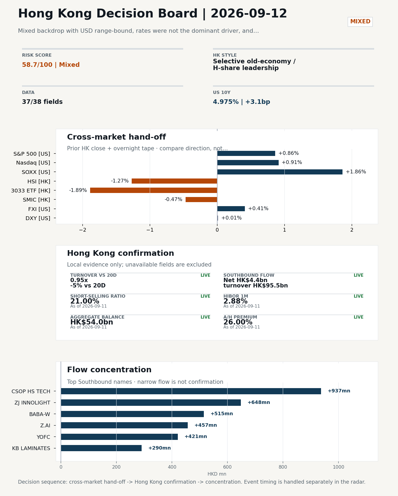
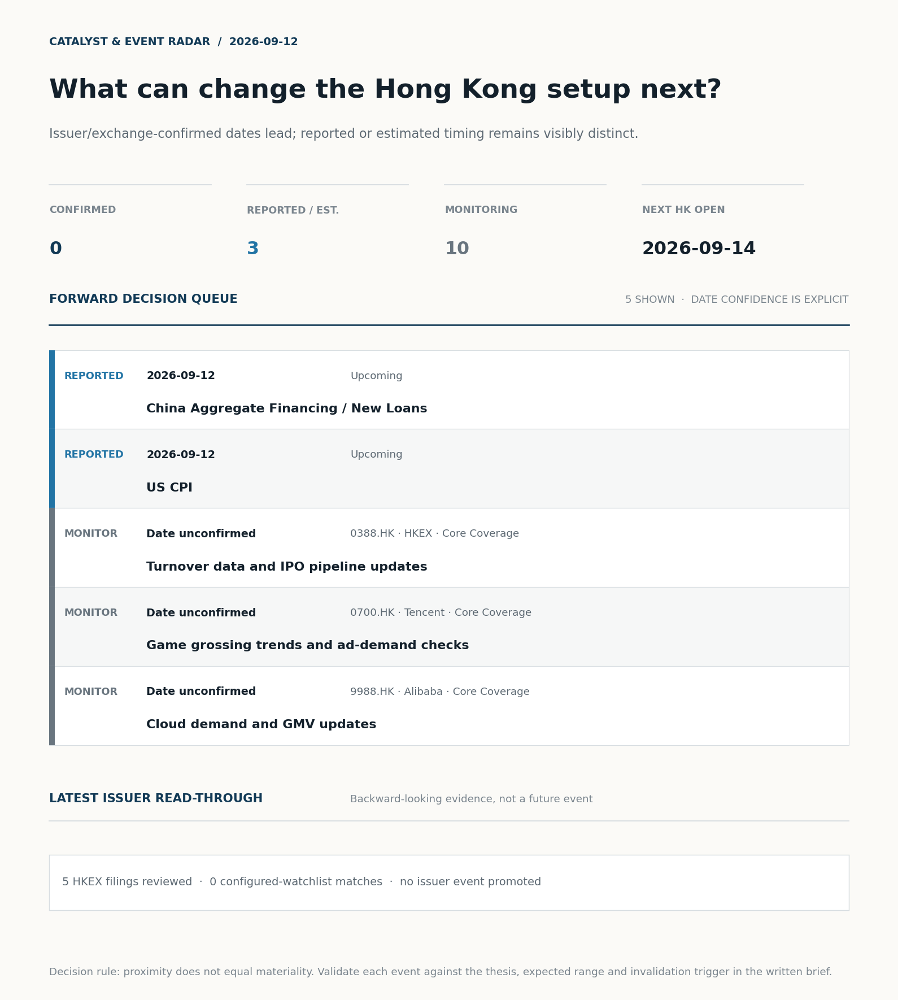
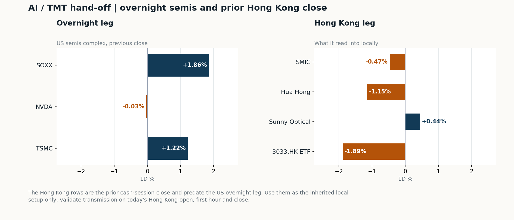
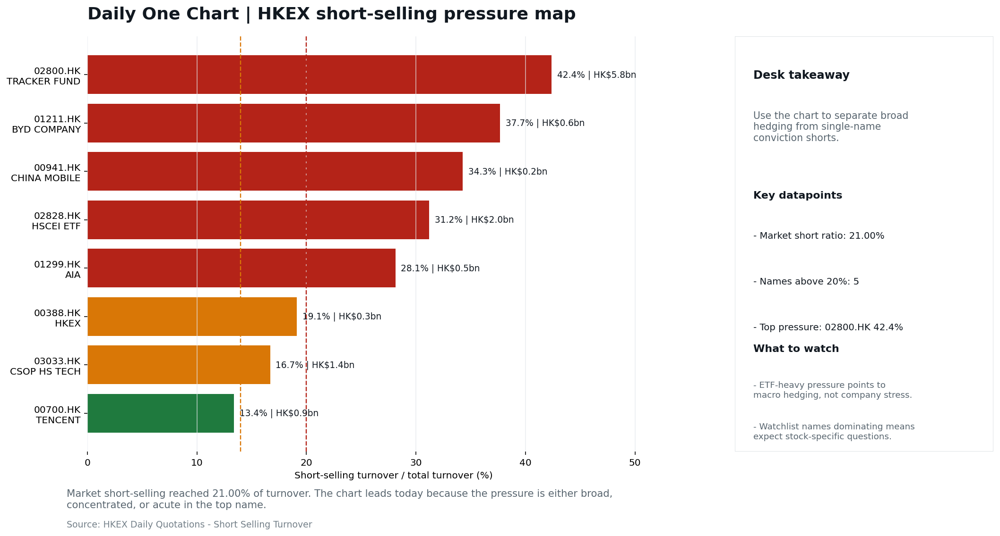

# Morning Research Workbench | 2026-09-12

> **Commute reading route:** `Layer 1 scan (5 min)` → `Layer 2 deep read` → `Layer 3 and appendix if time allows`
>
> Mode: `Trading Daily` | Review Friday's completed session; treat Saturday as a non-trading prep day.

_Data through: US/global `2026-09-11` | HK `2026-09-11` | A-share `2026-09-11` | Generated `2026-09-12 07:16:40`_

## Executive Summary

- **Did yesterday's call work?** UNRESOLVED - No comparable next close is available yet, so the call is still open.
- **What changed overnight?** Semis led higher: SOXX +1.86%, NVDA -0.03%, TSMC +1.22%. HSI -1.27% and 3033.HK -1.89%.
- **What it means for AI/TMT** Style, not beta - Selective old-economy / H-share leadership, a 0.76pp spread. Treat banks, energy, telecoms, and SOE yield as the cleaner relative expression; growth beta still needs proof.
- **What to watch today** China Aggregate Financing / New Loans. Confirm if SMIC and Hua Hong open in the same direction as the overnight leg and hold it through the first hour; invalidate if they track HSCEI instead.

## Layer 1 | Scan (5 min)

### 1.1 Yesterday's Call
**Verdict: UNRESOLVED.** No comparable next close is available yet, so the call is still open.

**Recent record.** 6 confirmed / 4 broken over the last 10 scoreable calls (60.0% hit rate). This is a directional close-to-close diagnostic, not a track record.

### 1.2 Opening Decision Board

**Global-to-Hong Kong signals**

_Decision-useful subset: each row states the implication and the next test. Descriptive secondary monitors are kept out of the five-minute scan._

| Signal | Last / move | Interpretation | Confirmation / invalidation |
| --- | --- | --- | --- |
| S&P 500 | 7,656.98 / +0.86% | Broad US risk rose as volatility drained out of the tape, which sets the external floor Hong Kong opens against. Falling volatility confirms lower near-term stress. | Watch whether Nasdaq and offshore-China proxies move the same way. |
| Nasdaq 100 | 29,368.44 / +0.91% | Growth tracked broad beta, so the move looks market-wide rather than duration-led. Growth advanced despite higher yields, showing momentum resilience but also higher reversal sensitivity. | 3033.HK versus HSI leadership carries the read; rising yields would undo it. |
| Hang Seng Index | 24,954.47 / -1.27% | The index was carried by old-economy and H-share names, not by broad participation: 3033.HK differs by 0.62pp. | Southbound participation decides whether this is investable or just a print. |
| Hang Seng TECH ETF (3033.HK) | 4.2500 / **-1.89%** | Hong Kong growth lagged, so broad-index strength is not yet a duration signal. | Needs a stable CNH and Southbound buying to become a duration signal. |
| Semiconductors (SOXX) | 527.07 / **+1.86%** | Semis led the Nasdaq by 0.95pp, putting the AI capex trade back in front. | SMIC and Hua Hong at the open show whether it transmits to Hong Kong. |
| US 10Y | 4.9750% / +3.1bp | The yield proxy rose, tightening the discount-rate backdrop for long-duration Hong Kong growth. | Read it through 3033.HK relative performance, not the index level. |
| USD/CNH | 6.7080 / -0.07% | A stronger offshore renminbi supports the external-risk backdrop for Hong Kong equities. | FXI and Southbound flow decide whether this reaches Hong Kong equities. |
| VIX | 15.84 / **-11.21%** | Lower implied volatility reduces near-term stress, but is supportive only if equity breadth confirms. | Falling volatility on narrowing breadth is a warning, not support. |

_Secondary monitors retained in the source bundle: SMIC (0981.HK), CSI 300, China 10Y, CN-US 10Y spread, DXY, USD/HKD, Brent crude, COMEX gold, Copper._

**Hong Kong local confirmation**

| Check | Value | Status | Source / as of | Why it matters |
| --- | --- | --- | --- | --- |
| Main Board turnover vs 20D | 0.95x \| -5% vs 20D | Live local | HKEX \| 2026-09-11 | Trailing 20-session average turnover was HK$241.5bn. |
| Southbound / Northbound net flow | Southbound Net HK$4.4bn \| turnover HK$95.5bn \| Northbound Turnover RMB291.3bn \| net not reported | Live local | HKEX Connect \| 2026-09-11 | Southbound net buy is calculated from HKEX disclosed buy and sell turnover. |
| Short-selling ratio | 21.00% | Live local | HKEX \| 2026-09-11 | Official HKEX stock-level short-selling table, aggregated as a share of total market turnover. |
| AH premium index | 26.00% | Live public | Yahoo \| 2026-09-11 | Fixed 10-name basket, equal-weighted, both legs priced on the same date; comparable across dates. Covered-pair average was +41.60% across 18 pairs. |
| USD/HKD spot vs band | 7.8412 \| band 7.7500 to 7.8500 | Live quote + local | Yahoo \| 2026-09-11 | Mid-band: 88 pips from the weak side and 912 pips from the strong side, so the peg is not an active constraint. Official Convertibility Undertakings define the linked-rate stress boundaries for USD/HKD. |
| HIBOR 1M | 2.88% | Live local | HKMA \| 2026-09-11 | 1M HIBOR is the cleanest quick read for Hong Kong funding conditions and equity-duration pressure. |
| Hong Kong leadership | Selective old-economy / H-share leadership | Proxy | HSI / HSCEI / 3033.HK ETF relative \| 2026-09-11 | Use HSI / HSCEI / 3033.HK ETF relative moves as the opening style read. |

**Risk state and evidence**

**Composite risk score:** `58.7/100` | **Regime:** `Mixed`

| Component | Score impact | Evidence |
| --- | --- | --- |
| US beta | +5.2 | S&P 500 +0.86% |
| HK growth ETF proxy | -9.4 | 3033.HK ETF -1.89% |
| Semis complex | +9 | SOXX +1.86% |
| Offshore China proxy | +2.0 | FXI +0.41% |
| Dollar pressure | -0.1 | DXY +0.01% |
| Volatility | +10 | VIX -11.21% |
| HK short-selling | -8 | Short-selling ratio 21.00% |
| HK turnover | +0 | Turnover 0.95x 20D |

_Base 50 plus the component deltas above. Semis complex entered the score on 2026-08-22; earlier scores in the ledger exclude it._

**Morning Checklist**

1. **VIX -11.21%**
 High-frequency data | Lower volatility signals easing stress in the tape. (second-order macro context)
2. **Mixed backdrop with USD range-bound, rates were not the dominant driver, and Nasdaq 100 outperformed FXI**
 Overnight regime | Start by deciding whether the day is about Mixed conditions or a style pivot.
3. **China CPI / PPI (Past expected window (unverified))**
 Macro / policy | China demand strength, PPI pass-through, and policy-easing odds | Industries: Consumer, Materials, Property
4. **China Aggregate Financing / New Loans (Upcoming)**
 Macro / policy | Credit expansion, domestic demand chains, and financials | Industries: Banks, Property chain, Infrastructure

## Visual Dashboard

**Catalyst & Event Radar**

**Chart read:** No issuer/exchange-confirmed event date is populated; 3 reported or estimated timing item(s) and 10 undated trigger(s) remain explicit.

_Source: Public calendars, issuer disclosures and configured research watchlists_
## Layer 2 | Core Research (20-30 min)

### 2.1 Global-to-Hong Kong Transmission
**Market Setup**
**Core tape.** Prior HK session (2026-09-10) closed with old-economy / H-share leadership: HSCEI -1.13% beat 3033.HK -1.89% by 0.76pp, with short-selling elevated at 21.0% and turnover at 0.95x the 20-day average.
**Main driver.** Overnight US tape was constructive but selectively so: S&P 500 +0.86% and Nasdaq 100 +0.91%, with semis leading (SOXX +1.86%, TSM +1.22%) while NVDA was flat and FXI lagged at +0.41%.
**HK relevance.** The key tension is that overseas-US growth/AI signals improved, yet prior-HK evidence still showed pressure on growth and platform beta.

**Key Drivers**
- Short-selling pressure remained the dominant drag into the prior HK close (21.0% short-selling ratio, 83rd percentile of the last 60 sessions), which caps conviction on a clean rebound despite supportive overseas signals.
- US growth-style transmission was supportive overnight.
- Oil moved -2.43% (chart read -3.08% intraday with a 4.35% range), a mixed signal.
- Global equity beta was modestly supportive (S&P 500 +0.86%).

**Hong Kong Read-Through**
**Opening implication.** For the 2026-09-14 HK open, the cleanest read is selective: use overnight SOXX (+1.86%) and TSM (+1.22%) as the trigger to test HK semis (SMIC, Hua Hong) and platform names.
_Hong Kong style leadership and flow confirmation are set out in the Hong Kong review below._

**Watch Points**
- USD composite moved higher by +0.12pct intraday, with a 0.285pct range.
- Main turning points appeared around 2026-09-11 08:05 trough / 2026-09-11 08:30 peak / 2026-09-11 08:50 peak, suggesting event-driven repricing rather than a clean one-way USD move.
- The biggest cross-asset divergence was Nasdaq 100 versus FXI, a spread of 0.117pct.
- Gold moved +0.94pct intraday with a 2.175pct high-low range.

**Curated overnight stories**
1. **JD.com unit settles SEC 'sham transactions' claim for US$500,000**
 Why it matters: A unit-level, dollar-small settlement of historical revenue-recognition allegations against a major China internet retailer. The financial penalty is immaterial.
 HK read-through: Direct read-through to HK-listed China internet names and ADRs of peers. Likely a sentiment/overhang item rather than a fundamental driver.
2. **China EV makers shift focus to humanoids as car market slows**
 Why it matters: Signals capital and R&D reallocation within China's autos/EV complex toward humanoid robotics, against a backdrop of slowing EV sales and weaker share prices.
 HK read-through: Relevant for HK-listed EV names and any Hong Kong listings with robotics exposure. Sector narrative, not an immediate earnings catalyst.
3. **Ant International partners with Visa and Mastercard on AI payments**
 Why it matters: Cross-border payments collaboration involving Ant's international arm with two global card networks, framed around AI-driven payments.
 HK read-through: Potential read-through to HK-listed fintech/payments names and the broader China internet ecosystem. Strategic partnership only.
4. **iPhone foldable enters China's crowded foldable market - faces a price test**
 Why it matters: Apple's first foldable reportedly launching into China's highly competitive foldable segment, with pricing the key adoption variable.
 HK read-through: Read-through to HK-listed Apple supply chain names (handsets, components). Demand intensity depends on pricing vs. domestic foldable rivals; supply-chain tone only.
5. **Mixed overnight regime: USD range-bound, rates not dominant, Nasdaq 100 outperformed FXI**
 Why it matters: Sets the framing for today's HK session: style tilt toward US tech/AI, weak China beta, no clear rates or FX driver.
 HK read-through: Suggests HK is more likely to follow offshore-China and A-share tape (incl. upcoming China CPI/PPI and aggregate financing) than US equity beta.

**AI / TMT hand-off**

**Overnight leg.** The overnight semis leg was risk-on at +1.02% average (SOXX +1.86%, NVDA -0.03%, TSMC +1.22%).
**Hong Kong expression.** SMIC, Hua Hong and Sunny Optical are best placed at the open, and 3033.HK should be tested before the Hang Seng Index.
**Observable test.** Confirm if SMIC and Hua Hong open in the same direction as the overnight leg and hold it through the first hour; invalidate if they track HSCEI instead, which would mean local flow is overriding the global cycle.

| Name | Role in the chain | 1D | Leg |
| --- | --- | --- | --- |
| SOXX | Semis complex | +1.86% | overnight |
| NVDA | AI capex narrative | -0.03% | overnight |
| TSMC | Foundry demand | +1.22% | overnight |
| SMIC | Leading-edge / domestic substitution | -0.47% | Hong Kong |
| Hua Hong | Mature-node pricing cycle | -1.15% | Hong Kong |
| Sunny Optical | Hardware and optics supply chain | +0.44% | Hong Kong |
| 3033.HK ETF | Broad HK tech beta | -1.89% | Hong Kong |

**Clock discipline.** The Hong Kong rows are the prior cash-session close and predate the US overnight leg. Use them as the inherited local setup only; validate transmission on today's Hong Kong open, first hour and close.

### 2.2 Hong Kong Local Tape and Flow
**Local Tape Setup**
**Local read.** Hong Kong's 2026-09-14 open should be read through style leadership, not the prior HSI -1.27% drawdown alone.
**Verification point.** The overnight US tape was constructive for growth (Nasdaq 100 +0.91%, SOXX +1.86%, TSM +1.22%) but the prior 3033.HK session already closed at -1.89% versus HSCEI -1.13%, with Southbound net buying of HK$4.4bn not enough to offset a 21.0% short-selling ratio.
**Risk to watch.** Confirmation rather than reversal is the operative test, given USD range-bound, oil -2.98% and VIX -11.21% framing a calmer but not risk-on regime.

**Style and Local Leadership**
**Style call.** Selective old-economy / H-share leadership.
- **Evidence:** HSCEI beat 3033.HK by 0.76pp (-1.13% versus -1.89%)
- **Portfolio meaning:** Treat banks, energy, telecoms, and SOE yield as the cleaner relative expression; growth beta still needs proof.
- **Cross-market read:** Hang Seng -1.27% / HSCEI -1.13% / 3033.HK ETF -1.89%. Offshore China proxy FXI +0.41% and USD/CNH -0.07% frame cross-border risk appetite. USD/HKD last traded around 7.8412, which keeps the Hong Kong funding lens in focus.

**Flow Confirmation**
Official Stock Connect evidence is available; the Flow Tracker confirms whether local money supports the price action.

**Follow-Through Checklist**
**Follow-through check.** Watch whether 3033.HK opens above its prior close and outperforms HSCEI within the first 30 minutes, short-selling ratio prints below 18%, and Main Board turnover reclaims >1.0x the 20D average (HK$241.5bn) with concurrent Southbound net buying. Confirmation also requires A-share CSI 300 and onshore semis (Cambricon, Naura, Gigadevice) to trade firm, since Northbound net-buy data is unavailable and only turnover (RMB291.3bn) is provided. FXI (+0.41% / 0.77x volume ratio) staying below QQQ's tape rules out a broad risk-on chase; a clean style turn requires both HK semis and CSOP HS TECH (03033.HK) to lead over the Tracker Fund (2800.HK).
**Failure condition.** Invalidate if 3033.HK retakes leadership while CNH firms and local participation broadens.

**Cross-asset attribution**

| Driver | Direction | Score | Evidence | HK implication |
| --- | --- | --- | --- | --- |
| Short-selling pressure | drag | 4.2 | HKEX short-selling ratio was 21.00%. | Elevated short activity argues for extra confirmation before chasing rebounds. |
| Oil and geopolitics | supportive | 2.38 | Oil moved -2.98%. | Split the read between energy/cyclicals support and margin/geopolitical pressure. |
| US growth-style transmission | supportive | 1.27 | Nasdaq 100 moved +0.91%. | Hong Kong growth and platform names should be tested first at the open. |
| Global equity beta | supportive | 0.86 | S&P 500 moved +0.86%. | Broad beta matters if Hong Kong breadth confirms the overseas signal. |

**Local flow evidence**

**Flow Takeaways**
- Short-selling pressure is elevated, so local rebounds need cleaner breadth and flow confirmation.
- Stock Connect Southbound: net HK$4.4bn on turnover HK$95.5bn (as of 2026-09-11).
- Stock Connect Northbound: turnover RMB291.3bn; public file provides total turnover/top active names, not full net-buy.
- AH premium: fixed 10-name basket +26.00% (comparable across dates); covered-pair average +41.60% over 18 pairs; widest premium: CRRC 120.37%.

**Stock Connect Southbound Active Names**

| # | Ticker | Name | Buy | Sell | Net buy | HKEX turnover rank |
| --- | --- | --- | --- | --- | --- | --- |
| 1 | 03033.HK | CSOP HS TECH | HK$939.5mn | HK$2.6mn | HK$936.9mn | 5 |
| 2 | 03308.HK | ZJ INNOLIGHT | HK$1,586.7mn | HK$938.7mn | HK$648.0mn | 5 |
| 3 | 09988.HK | BABA-W | HK$797.2mn | HK$282.5mn | HK$514.7mn | 3 |
| 4 | 02513.HK | Z.AI | HK$2,212.3mn | HK$1,754.9mn | HK$457.3mn | 2 |
| 5 | 06869.HK | YOFC | HK$2,858.9mn | HK$2,437.8mn | HK$421.1mn | 1 |

**AH Premium Dispersion**

| Name | A ticker | H ticker | Premium | As of |
| --- | --- | --- | --- | --- |
| CRRC | 601766.SS | 1766.HK | +120.37% | 2026-09-11 |
| China Railway | 601390.SS | 0390.HK | +113.98% | 2026-09-11 |
| China Communications Construction | 601800.SS | 1800.HK | +97.96% | 2026-09-11 |

**HKEX Short-Selling Watch**

| Ticker | Name | Short ratio | Short turnover | Total turnover |
| --- | --- | --- | --- | --- |
| 00388.HK | HKEX | 19.12% | HK$0.3bn | HK$1.5bn |
| 00700.HK | TENCENT | 13.39% | HK$0.9bn | HK$6.7bn |
| 00941.HK | CHINA MOBILE | 34.27% | HK$0.2bn | HK$0.7bn |

- **Short-value leaders:** 02800.HK TRACKER FUND (HK$5.8bn); 02828.HK HSCEI ETF (HK$2.0bn); 07709.HK XL2CSOPHYNIX (HK$1.5bn); 03033.HK CSOP HS TECH (HK$1.4bn).

### 2.3 Macro Transmission
**Desk read.** The macro window for the next HK cash session (2026-09-14) is dominated by two same-week releases: China Aggregate Financing / New Loans on 2026-09-12 and US CPI on 2026-09-12.

**Market sensitivity.** The US print is the primary external lever for HK.

**HK implication.** The China credit release is the domestic counterpart, conditioning banks, the property chain and infrastructure into the Monday open.

**Macro watchpoints**
- US CPI release on 2026-09-12 and the resulting move in US yields and DXY ahead of Monday's HK open, given the peg transmits to HIBOR and HK
- China Aggregate Financing / New Loans on 2026-09-12 for any signal on credit impulse, with banks, property chain and infrastructure most
- Whether the 2026-09-09 China CPI/PPI print is officially confirmed; the dataset is flagged unverified, so margin-pass-through conclusions are
- Nasdaq 100 vs. FXI leadership into Monday's open - Friday's divergence is the cleanest near-term sentiment tell for HK tech.

| Time | Region | Event | Status | Desk read |
| --- | --- | --- | --- | --- |
| | CN | China CPI / PPI | Past expected window (unverified) | Impact: China demand strength, PPI pass-through, and policy-easing odds \| Attention: 3/5 \| Industries: Consumer, Materials, Property |
| | CN | China Aggregate Financing / New Loans | Upcoming | Impact: Credit expansion, domestic demand chains, and financials \| Attention: 5/5 \| Industries: Banks, Property chain, Infrastructure |
| | US | US CPI | Upcoming | Impact: Rates expectations, the dollar, and growth-equity valuation \| Attention: 5/5 \| Industries: Technology, Internet, Brokers |
| | CN | China Activity Data (IP / Retail Sales / FAI) | Upcoming | Impact: Consumer resilience, growth expectations, and risk-asset pricing \| Attention: 5/5 \| Industries: Consumer, E-commerce, Consumer discretionary |

**Positioning and risk backdrop**

- Detailed local flow evidence is covered under Flow Tracker and Attribution; keep this section focused on options, hedging, and macro-positioning risk.

### 2.4 Company Micro Research and Catalysts
No high-conviction sector story cleared the main-report relevance gate for this run.

**Company Event Takeaway**
**Desk read.** No fresh HK-listed earnings prints or rating actions on 2026-09-11 to reset near-term estimates.
**Why it matters.** The five profit-warning filings (01023.HK, 00491.HK, 02293.HK, 08547.HK, 00722.HK) are all small-cap, headline-only, and non-watchlist, so they aggregate into sector noise rather than a thesis change.
**Follow-up.** Two external news threads matter for HK read-throughs.

**LLM Quick Takes**
- **0700.HK** | Fact: closed at HK$428.4 (+0.66%), bottom 21% of 60-session band; one attached headline notes Tencent's Enflame stake marked up ~$3bn on Enflame's 179% debut. Investor read…
- **9988.HK** | Fact: no fresh disclosure on 2026-09-11; next earnings window 2026-11-24 (73 days). Investor read: indirectly relevant via the JD.com/SEC settlement story for governance optics, but…
- **3690.HK** | Fact: no fresh disclosure on 2026-09-11; next earnings window 2026-11-26 (75 days). Investor read: not directly implicated by today's news flow…
- **0388.HK** | Fact: closed at HK$392.6 (-1.11%), mid-range at 59% of 60-session band; next earnings window 2026-11-04 (53 days). Investor read: tape is a marginal information channel, not a signal…

Decision filter<h4>No immediate portfolio catalyst: 5 official filings were screened and the low-signal market set stays aggregated.</h4>
5 profit warnings

<strong>5</strong>Official filings

<strong>0</strong>Watchlist hits

<strong>0</strong>Actionable events

<strong>No event cleared the portfolio decision filter.</strong>

Broad-market filings remain traceable in the source appendix; they are not expanded here without a watchlist, estimate or liquidity read-through.

<strong>Coverage boundary.</strong> sell-side rating changes, IPO / grey-market monitor were not decision-grade in this run; their absence is not treated as confirmation that no event exists.

**Core coverage requiring follow-up**

**Core coverage**

| Name | Ticker | Last | 1D | Range position | Morning note |
| --- | --- | --- | --- | --- | --- |
| HKEX | 0388.HK | 392.60 | -1.11% | Mid-range | Marginally lower (-1.11%), mid-range at 59% of its 60-session band. |
| Tencent | 0700.HK | 428.40 | +0.66% | Bottom of range | Marginally higher (+0.66%), still in the bottom quartile of its 60-session range (21%). |

**Recent headlines for Tencent:**
- [Tencent's Enflame Stake Gains Nearly $3 Billion in One Day](https://finance.yahoo.com/technology/ai/articles/tencents-enflame-stake-gains-nearly-181434736.html) (GuruFocus.com)

**Priority follow-up**

| Name | Ticker | Last | 1D | Range position | Morning note |
| --- | --- | --- | --- | --- | --- |
| BYD Company | 1211.HK | 79.85 | +0.38% | Mid-range | Marginally higher (+0.38%), mid-range at 33% of its 60-session band. |
| AIA | 1299.HK | 75.05 | -0.33% | Mid-range | Marginally lower (-0.33%), mid-range at 56% of its 60-session band. |

### 2.5 Morning Meeting Questions
**Q1. The index fell but Southbound bought - is the move real?**
- **Evidence:** HSI -1.27% against Southbound net +4.4bn HKD.
- **How to answer:** Treat it as unconfirmed. Price and mainland flow disagreed, so the price move was not driven by Southbound participation; it needs another session of confirmation before being read as a trend.

## Layer 3 | Session Playbook (8-12 min)

### 3.1 Base Case and Scenario Map
**Starting posture.** Selective old-economy / H-share leadership (medium confidence); composite risk `58.7/100` (Mixed). Treat banks, energy, telecoms, and SOE yield as the cleaner relative expression; growth beta still needs proof.

**Scenario map**

| Scenario | Observable trigger | Interpretation | Research response |
| --- | --- | --- | --- |
| Selective growth confirms | 3033.HK keeps a >0.5pp first-hour lead over HSCEI; SMIC and Hua Hong stop lagging broad beta; CNH is stable. | The prior style split has live price confirmation, but is not yet broad China risk-on. | Prioritize internet/platform relative strength; verify participation again at the close. |
| Broad beta takes over | HSI and HSCEI rise together, breadth improves and the 3033.HK lead narrows without turning negative. | Leadership is broadening from a style trade into market beta. | Expand the research set from growth leaders to financials, SOEs and index-heavy names. |
| Risk-off continuation | 3033.HK loses its lead, semis underperform HSCEI and CNH depreciation accelerates. | The prior divergence was a temporary pocket of strength rather than a durable hand-off. | Treat rebounds as unconfirmed; focus on balance-sheet, catalyst and crowding risk. |

**Clocked validation scorecard**

| Window | Check | Prior evidence | Pass condition | What it decides |
| --- | --- | --- | --- | --- |
| 09:30-10:30 | 3033.HK vs HSCEI | -0.76pp at the prior close | 3033.HK retains >0.5pp relative lead | Whether growth leadership survives the open |
| 09:30-10:30 | Semiconductor hand-off | SMIC -0.47%; Hua Hong Semiconductor -1.15% | Stabilise after the open; at least one stops underperforming HSCEI | Whether overnight semis pressure is contained locally |
| 09:30-10:30 | HSI price zone | 24,954 vs 24,500 / 25,000 reference grid | Hold above the lower grid or reclaim the upper grid with breadth | Whether broad beta is stabilising; grid is derived, not technical analysis |
| 09:30-10:30 | USD/CNH | 6.708 \| -0.07% | No acceleration in CNH depreciation | Whether FX permits a clean Hong Kong risk extension |
| At close | Turnover | 0.95x \| -5% vs 20D | At least 1.0x the 20-session average | Whether the move had normal participation |
| At close | Southbound | Net HK$4.4bn \| turnover HK$95.5bn | Net buying remains positive and broadens beyond one or two names | Whether mainland money confirms the price move |
| At close | Short pressure | 21.00% | Falls versus the prior verified reading (21.00%) | Whether rebound conviction improved |

**Upgrade rule.** Confirm if HSCEI keeps outperforming 3033.HK with healthy turnover and broad Southbound participation.
**Kill switch.** Invalidate if 3033.HK retakes leadership while CNH firms and local participation broadens.
**Clock discipline.** At 07:30, same-day Southbound, turnover and short-selling outcomes are not known. Use the first-hour price/FX checks provisionally and make the final classification only after the close.
**Event clock.** Same-day decision items: China Aggregate Financing / New Loans, US CPI.

### 3.2 Conditional Theme Deep Dive

| Field | Read |
| --- | --- |
| Theme | AI and Compute Chain |
| Angle for the day | Track whether global AI capex, semis, cloud, and server demand are still carrying offshore China internet and hardware sentiment. |

**Theme desk read**
**Core thesis.** The AI and Compute Chain theme is still the right frame, but the supporting signals on 2026-09-11 are mixed rather than directional, which argues for keeping the angle in rotation.
**Evidence.** The supportive layer is clear: SOXX +1.86% and TSMC ADR +1.22% give HK semis and platform beta a cleaner open into Monday, and the VIX -11.21% print removes a stress overlay that had been weighing on growth-equity duration.
**What to test.** Against that, the tape-level cues for the specific names we track are marginal.

**Signals to keep in mind**
- JD.com Unit Agrees to Pay SEC $500,000 Over 'Sham Transactions': Assess whether the story can propagate through the China Internet value
- China's EV makers shift gears to focus on humanoids as car market slows: Assess whether the story can propagate through the Autos and EV
- VIX -11.21%: Lower volatility signals easing stress in the tape.
- SOXX +1.86%: Semis rallied, giving HK semis and platform beta a supportive open.

**LLM watch items:**
- US CPI on 2026-09-12: outcome drives the duration read for HK tech and platform names into the HK open on 2026-09-15.
- China Aggregate Financing / New Loans on 2026-09-12: sets the credit-impulse tone for domestic demand chains and HK financials/banks.
- China Activity Data (IP / Retail Sales / FAI) on 2026-09-15: broadest monthly read on domestic demand
- SOXX and TSMC ADR follow-through into the 2026-09-14 HK session: confirms whether the supportive semi open is durable or just a one-day gap.
- JD.com SEC settlement propagation check across China Internet peers (Tencent, Alibaba)

**Related names to keep close:**

| Name | Ticker | Bucket | Morning read |
| --- | --- | --- | --- |
| Tencent | 0700.HK | Core coverage | Marginally higher (+0.66%), still in the bottom quartile of its 60-session range (21%). |
| Alibaba | 9988.HK | Core coverage | Marginally higher (+0.56%), mid-range at 47% of its 60-session band. |
| AIA | 1299.HK | Priority follow-up | Marginally lower (-0.33%), mid-range at 56% of its 60-session band. |

**Upcoming catalysts tied to the theme:**
- 2026-09-12 | China Aggregate Financing / New Loans | Credit expansion, domestic demand chains, and financials
- 2026-09-15 | China Activity Data (IP / Retail Sales / FAI) | Consumer resilience, growth expectations, and risk-asset pricing

**Relevant headlines:**
- [JD.com Unit Agrees to Pay SEC $500,000 Over 'Sham Transactions'](https://www.bloomberg.com/news/articles/2026-09-11/jd-com-unit-agrees-to-pay-sec-500-000-over-sham-transactions)
- [China's EV makers shift gears to focus on humanoids as car market slows](https://www.cnbc.com/2026/09/09/chinas-ev-makers-shift-gears-to-focus-on-humanoids-as-car-market-slows.html)

### 3.3 Daily One Chart
**Daily One Chart | HKEX short-selling pressure map**

**Chart read.** Market short-selling reached 21.00% of turnover.
**Why it matters.** The chart leads today because the pressure is either broad, concentrated, or acute in the top name.

_Source: HKEX Daily Quotations - Short Selling Turnover_

## Optional Appendix | Traceability and Performance (10-15 min)

### Report Metadata
> Date policy: Review date 2026-09-11 is treated as `Trading Daily`. | Global (US/Europe) data date is 2026-09-11; adapter effective date is 2026-09-11 and summary date is 2026-09-11. | Hong Kong local data date is 2026-09-11; role: same-session local cash tape.
> Market data quality: Coverage: `37/38` | Missing: `1`
> Report quality: `95.6/100` | Grade `A` | Status `usable with caveats`

### Report Quality and Validation
- **Quality score:** 95.6/100 | **Grade:** A | **Status:** usable with caveats
- **Run summary:** 8 healthy | 2 caveat | 0 failed
- **Release recommendation:** Send with caveats | The report is usable, but the advisory guidance should travel with it so readers understand the data gaps.

| Source | Status | Bucket |
| --- | --- | --- |
| Macro calendar | partial | caveat |
| Risk and sentiment feed | partial | caveat |

**Narrative fact-check guardrail**
- Checked 34 numeric claims; 0 numeric mismatch(es), 0 logic warning(s); 13 structured claims, 0 source/text warning(s); 0 critical, 0 review.

_Full component weights, per-source freshness, adapter status and provenance records are archived with this report under `audit/` rather than printed here._

### Historical Signal Performance
- **Readiness:** exploratory with caveats | 69 observations | 99 active signal dates | next-close entry, 10bps cost, no same-day returns.
- **Interpretation boundary:** exploratory until a benchmark reaches 252 sessions and 100 active-signal sessions.
- **Data-quality caveat:** 23 conflicting price revision(s) and 6 non-session observation(s) remain in the research ledger.
- **Daily-use boundary:** cumulative return, Sharpe and the performance chart stay out of the daily commute edition until the sample and trading-calendar gates pass; use Yesterday's Call instead.

### Source Links
- [Tencent's Enflame Stake Gains Nearly $3 Billion in One Day](https://finance.yahoo.com/technology/ai/articles/tencents-enflame-stake-gains-nearly-181434736.html) (GuruFocus.com)
- [Alibaba Gains as Anthropic Alleges 151 Million Illicit Exchanges](https://finance.yahoo.com/technology/ai/articles/alibaba-gains-anthropic-alleges-151-211148363.html) (GuruFocus.com)
- [Meituan (MPNGF) (Q2 2026) Earnings Call Highlights: Record Revenue and Strategic AI Pivot Drive...](https://finance.yahoo.com/markets/stocks/articles/meituan-mpngf-q2-2026-earnings-190123345.html) (GuruFocus.com)
- [Meituan Returns to Profit as Food-Delivery Competition Eases](https://www.wsj.com/business/earnings/meituan-returns-to-profit-as-food-delivery-competition-eases-1026a0e9?siteid=yhoof2&yptr=yahoo) (The Wall Street Journal)
- [China Mobile (SEHK:941): A Closer Look at Valuation After Steady Share Price Gains This Year](https://finance.yahoo.com/news/china-mobile-sehk-941-closer-154022664.html) (Simply Wall St.)
- [01023.HK Profit warning / alert announcement](http://www1.hkexnews.hk/listedco/listconews/sehk/2026/0911/2026091100569.pdf) (HKEXnews)
- [00491.HK Profit warning / alert announcement](http://www1.hkexnews.hk/listedco/listconews/sehk/2026/0910/2026091001011.pdf) (HKEXnews)
- [02293.HK Profit warning / alert announcement](http://www1.hkexnews.hk/listedco/listconews/sehk/2026/0909/2026090900364.pdf) (HKEXnews)
- [08547.HK Profit warning / alert announcement](http://www1.hkexnews.hk/listedco/listconews/gem/2026/0908/2026090800520.pdf) (HKEXnews)
- [00722.HK Profit warning / alert announcement](http://www1.hkexnews.hk/listedco/listconews/sehk/2026/0904/2026090402367.pdf) (HKEXnews)
