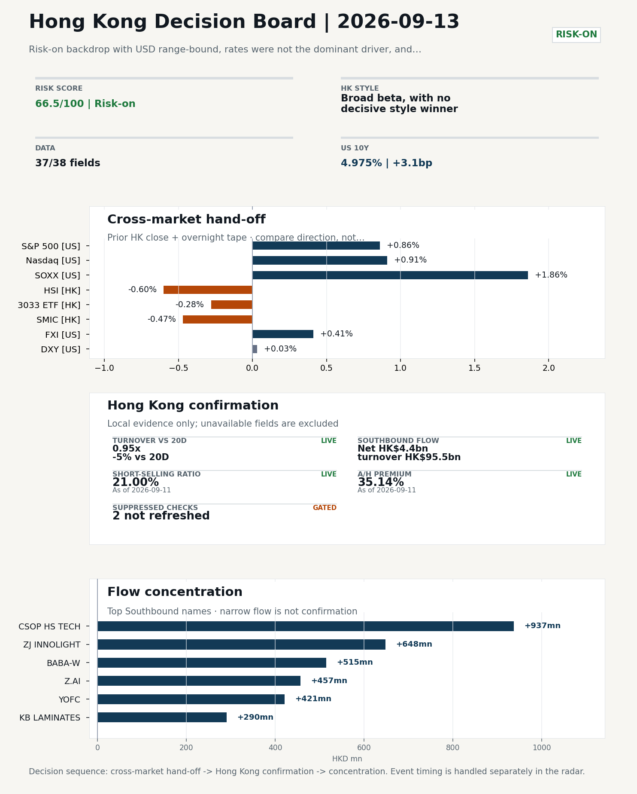
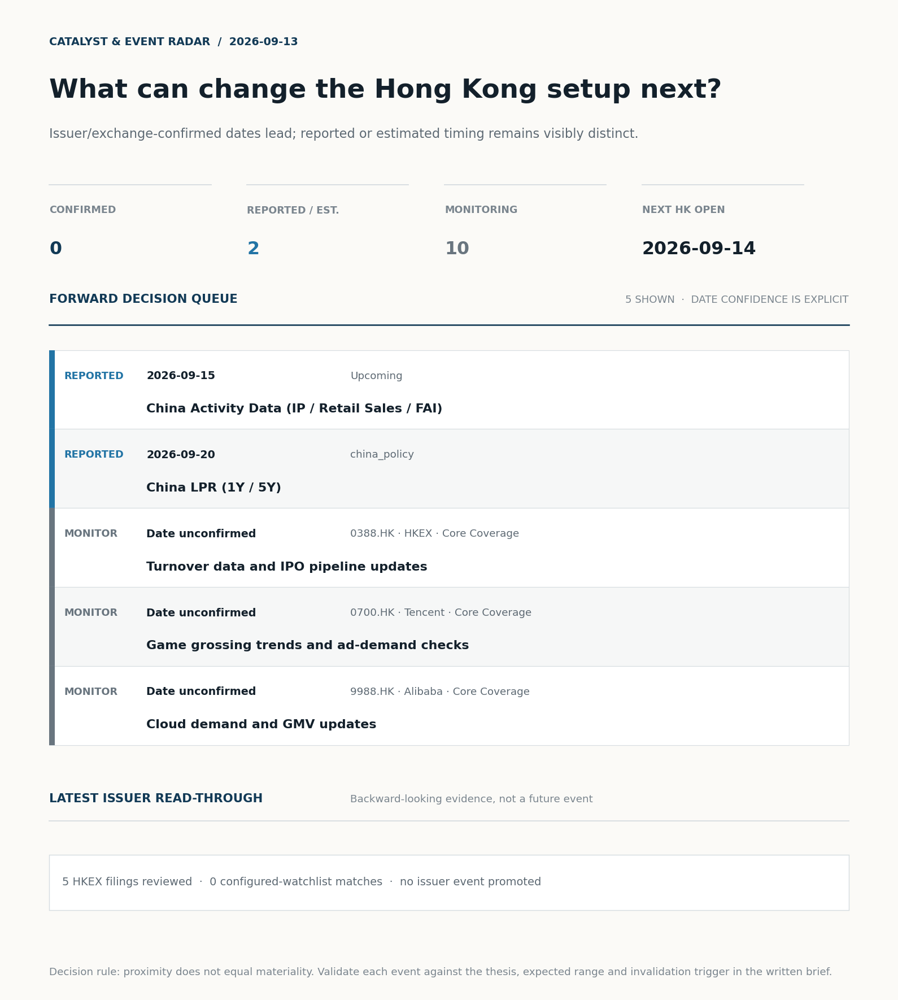
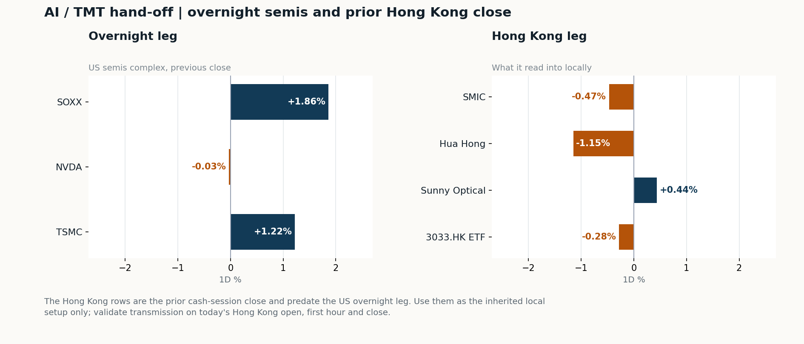
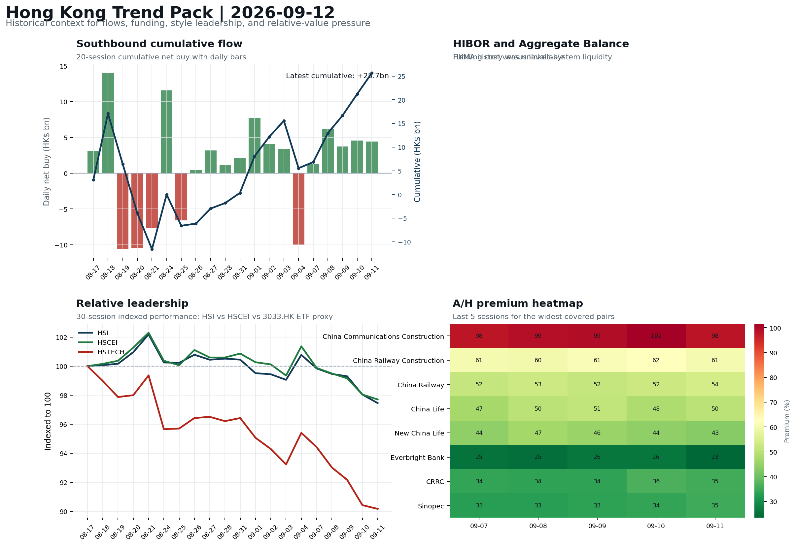

# Morning Research Workbench | 2026-09-13

> **Commute reading route:** `Layer 1 scan (5 min)` → `Layer 2 deep read` → `Layer 3 and appendix if time allows`
>
> Mode: `Weekly Review` | Synthesize the completed Hong Kong week into next-week preparation rather than treating Sunday as a fresh session.

_Data through: US/global `2026-09-11` | HK `2026-09-11` | A-share `2026-09-11` | Generated `2026-09-13 07:04:15`_

## Executive Summary

- **Did yesterday's call work?** NO CALL - The 2026-09-12 report published no directional call (neutral regime).
- **What changed overnight?** Semis led higher: SOXX +1.86%, NVDA -0.03%, TSMC +1.22%. HSI -0.60% and 3033.HK -0.28%.
- **What it means for AI/TMT** No decisive style winner - Broad beta, with no decisive style winner, a 0.06pp spread. Avoid forcing a growth-versus-value call; let volume, Southbound concentration, and the first-hour relative tape identify leadership.
- **What to watch today** Next scheduled catalyst: China Activity Data (IP / Retail Sales / FAI) on 2026-09-15. Confirm if SMIC and Hua Hong open in the same direction as the overnight leg and hold it through the first hour; invalidate if they track HSCEI instead.

## Layer 1 | Weekly Scan (5 min)

### 1.1 Last Week's Call
**Verdict: NO CALL.** The 2026-09-12 report published no directional call (neutral regime).

**Recent record.** 6 confirmed / 4 broken over the last 10 scoreable calls (60.0% hit rate). This is a directional close-to-close diagnostic, not a track record.

### 1.2 Opening Decision Board

**Global-to-Hong Kong signals**

_Decision-useful subset: each row states the implication and the next test. Descriptive secondary monitors are kept out of the five-minute scan._

| Signal | Last / move | Interpretation | Confirmation / invalidation |
| --- | --- | --- | --- |
| S&P 500 | 7,656.98 / +0.86% | Broad US risk rose as volatility drained out of the tape, which sets the external floor Hong Kong opens against. Falling volatility confirms lower near-term stress. | Watch whether Nasdaq and offshore-China proxies move the same way. |
| Nasdaq 100 | 29,368.44 / +0.91% | Growth tracked broad beta, so the move looks market-wide rather than duration-led. Growth advanced despite higher yields, showing momentum resilience but also higher reversal sensitivity. | 3033.HK versus HSI leadership carries the read; rising yields would undo it. |
| Hang Seng Index | 24,805.63 / -0.60% | Broad beta fell with no single driver visible in today's fields. | Southbound participation decides whether this is investable or just a print. |
| Hang Seng TECH ETF (3033.HK) | 4.2380 / -0.28% | Hong Kong growth led broad beta, improving the platform/internet style signal. | Needs a stable CNH and Southbound buying to become a duration signal. |
| Semiconductors (SOXX) | 527.07 / **+1.86%** | Semis led the Nasdaq by 0.95pp, putting the AI capex trade back in front. | SMIC and Hua Hong at the open show whether it transmits to Hong Kong. |
| US 10Y | 4.9750% / +3.1bp | The yield proxy rose, tightening the discount-rate backdrop for long-duration Hong Kong growth. | Read it through 3033.HK relative performance, not the index level. |
| USD/CNH | 6.7075 / -0.08% | A stronger offshore renminbi supports the external-risk backdrop for Hong Kong equities. | FXI and Southbound flow decide whether this reaches Hong Kong equities. |
| VIX | 15.84 / **-11.21%** | Lower implied volatility reduces near-term stress, but is supportive only if equity breadth confirms. | Falling volatility on narrowing breadth is a warning, not support. |

_Secondary monitors retained in the source bundle: SMIC (0981.HK), CSI 300, China 10Y, CN-US 10Y spread, DXY, USD/HKD, Brent crude, COMEX gold, Copper._

**Hong Kong local confirmation**

_Coverage gate: 1 unavailable local checks are suppressed here and retained in validation metadata._

| Check | Value | Status | Source / as of | Why it matters |
| --- | --- | --- | --- | --- |
| Main Board turnover vs 20D | 0.95x \| -5% vs 20D | Live local | HKEX \| 2026-09-11 | Trailing 20-session average turnover was HK$241.5bn. |
| Southbound / Northbound net flow | Southbound Net HK$4.4bn \| turnover HK$95.5bn \| Northbound Turnover RMB291.3bn \| net not reported | Live local | HKEX Connect \| 2026-09-11 | Southbound net buy is calculated from HKEX disclosed buy and sell turnover. |
| Short-selling ratio | 21.00% | Live local | HKEX \| 2026-09-11 | Official HKEX stock-level short-selling table, aggregated as a share of total market turnover. |
| AH premium index | 35.14% | Live public | Yahoo \| 2026-09-11 | Equal-weighted average across 17 A/H pairs that resolved today. Composition varies by day, so the level is not comparable with prior reports (fixed basket incomplete: missing China Construction Bank). [trimmed] |
| USD/HKD spot vs band | 7.8412 | Live quote | Yahoo \| 2026-09-11 | Mid-band: 88 pips from the weak side and 912 pips from the strong side, so the peg is not an active constraint. |
| Hong Kong leadership | Broad beta, with no decisive style winner | Proxy | HSI / HSCEI / 3033.HK ETF relative \| 2026-09-11 | Use HSI / HSCEI / 3033.HK ETF relative moves as the opening style read. |

**Risk state and evidence**

**Composite risk score:** `66.5/100` | **Regime:** `Risk-on`

| Component | Score impact | Evidence |
| --- | --- | --- |
| US beta | +5.2 | S&P 500 +0.86% |
| HK growth ETF proxy | -1.4 | 3033.HK ETF -0.28% |
| Semis complex | +9 | SOXX +1.86% |
| Offshore China proxy | +2.0 | FXI +0.41% |
| Dollar pressure | -0.3 | DXY +0.03% |
| Volatility | +10 | VIX -11.21% |
| HK short-selling | -8 | Short-selling ratio 21.00% |
| HK turnover | +0 | Turnover 0.95x 20D |

_Base 50 plus the component deltas above. Semis complex entered the score on 2026-08-22; earlier scores in the ledger exclude it._

**Next Week Checklist**

1. **VIX -11.21%**
 High-frequency data | Lower volatility signals easing stress in the tape. (second-order macro context)
2. **Risk-on backdrop with USD range-bound, rates were not the dominant driver, and Nasdaq 100 outperformed FXI**
 Still-moving markets | No fresh Hong Kong cash session is assumed; use global active assets and policy/event flow to prepare the next open.
3. **China Aggregate Financing / New Loans (Past expected window (unverified))**
 Macro / policy | Credit expansion, domestic demand chains, and financials | Industries: Banks, Property chain, Infrastructure
4. **US CPI (Past expected window (unverified))**
 Macro / policy | Rates expectations, the dollar, and growth-equity valuation | Industries: Technology, Internet, Brokers

## Visual Dashboard

**Catalyst & Event Radar**

**Chart read:** No issuer/exchange-confirmed event date is populated; 2 reported or estimated timing item(s) and 10 undated trigger(s) remain explicit.

_Source: Public calendars, issuer disclosures and configured research watchlists_
## Layer 2 | Core Research (20-30 min)

### 2.1 Global-to-Hong Kong Transmission
> Weekly review mode: synthesize the completed Hong Kong week, retain the main cross-asset and policy lessons, and convert them into next-week preparation rather than treating Saturday as a fresh cash-market session.

**Market Setup**
**Core tape.** Overnight-US evidence (S&P 500 +0.86%, Nasdaq 100 +0.91%, Euro Stoxx 50 +0.90%) points to a risk-on tape with USD range-bound and rates not the dominant driver.
**Main driver.** The cross-asset divergence was Nasdaq 100 versus FXI at +0.117pp, and the AI/semis complex (SOXX +1.86%, TSM +1.22%) carried the growth-style bid even as NVDA was flat.
**HK relevance.** Short-selling pressure at 21.0% (83rd percentile) capped follow-through despite VIX -11.21%, so conviction in the overseas signal is moderate rather than high.

**Key Drivers**
- US growth-style transmission: Nasdaq 100 +0.91% and SOXX +1.86% with VIX -11.21% argue for a supportive open into HK platform and semis names, but NVDA flat suggests leadership is index/equipment-led rather than broad chipper-led.
- Oil and geopolitics: WTI -2.37% intraday reduces the energy/geopolitical premium and trims a cyclical drag.
- USD range-bound: DXY +0.03% with a 0.285% range keeps FX as a non-driver, leaving rates and earnings as the residual channels.
- Short-selling pressure: HKEX short-selling at 21.00% (83rd pct of 60 sessions) is the single largest drag on the prior-HK tape and a reason local rebounds still need breadth and flow confirmation before being trusted.

**Hong Kong Read-Through**
**Opening implication.** For the 14 Sept HK session, the overseas signal is constructive but not yet confirmed by local tape: Southbound +HK$4.4bn net buying on 11 Sept and FXI +0.41% support a softer open.
_Hong Kong style leadership and flow confirmation are set out in the Hong Kong review below._

**Watch Points**
- USD composite moved higher by +0.12pct intraday, with a 0.285pct range.
- Main turning points appeared around 2026-09-11 08:05 trough / 2026-09-11 08:30 peak / 2026-09-11 08:50 peak, suggesting event-driven repricing rather than a clean one-way USD move.
- The biggest cross-asset divergence was Nasdaq 100 versus FXI, a spread of 0.117pct.
- Gold moved +1.37pct intraday with a 2.175pct high-low range.

**Weekly Review Map**
- Weekly review window: 2026-09-07 to 2026-09-11. Core regime: Risk-on backdrop with USD range-bound, rates were not the dominant driver, and Nasdaq 100 outperformed FXI. Hong Kong leadership: Leadership was broad and balanced.
- Method note: Trend summary uses the latest available five observations from the Hong Kong Trend Pack inputs.

**Cross-asset weekly dashboard**

| Asset | Latest move | Weekly read |
| --- | --- | --- |
| S&P 500 | +0.86% | Risk appetite |
| Nasdaq 100 | +0.91% | Growth style |
| Hang Seng Index | -0.60% | Hong Kong beta |
| Hang Seng TECH ETF (3033.HK) | -0.28% | Hong Kong growth / internet proxy |
| DXY | +0.03% | Global liquidity |
| US 10Y Treasury Yield | +3.1bp | Rates path |
| Gold | +0.04% | Hedge / real yields |
| VIX | -11.21% | Volatility and hedging |

**Hong Kong / China weekly tape**

| Signal | Latest move | Read |
| --- | --- | --- |
| Hang Seng Index | -0.60% | Hong Kong beta |
| Hang Seng China Enterprises Index | -0.34% | China SOE / H-share tone |
| Hang Seng TECH ETF (3033.HK) | -0.28% | Hong Kong growth / internet proxy |
| China Large-Cap (FXI) | +0.41% | China sentiment |
| USD/CNH | -0.08% | China FX sentiment |
| USD/HKD | -0.01% | Hong Kong funding lens |

**Five-session trend evidence**
_Window: 2026-09-07 to 2026-09-11_

| Signal | Five-session change | Latest | Desk read |
| --- | --- | --- | --- |
| Southbound flow | +20.1bn over 5 sessions | +4.4bn | 5/5 positive sessions; cumulative buying is the flow-confirmation test for next week. |
| HK style leadership | HSCEI led (-2.2pp); HSTECH lagged (-4.3pp) | HSCEI leadership | Use HSI / HSCEI / 3033.HK ETF spread to separate broad beta from growth-led rerating. |
| A/H premium dispersion | +0.9pp average change | 50.0% average premium | Premium narrowing can support H-share relative demand |

**Flow and attribution clues**
- :
- :
- :

**Next-week desk questions**
- Did Southbound flow confirm the index move, or was the week mainly offshore beta without local money follow-through?
- Did HIBOR and Aggregate Balance point to benign funding, or should tighter HKD liquidity be part of next week's risk case?
- Was leadership broad enough beyond the 3033.HK ETF / platform beta proxy, or was the week concentrated in a narrow style pocket?
- Which dated macro, policy, earnings, or IPO catalyst can realistically change the next-week narrative?
- What single data point would invalidate the base-case market pulse by Monday or Tuesday morning?

**Key developments to retain**

| Bucket | Item | Why it matters |
| --- | --- | --- |
| C | Elon Musk backs Anthropic's call to slow down AI progress | Assess whether the story can propagate through the China Internet value chain |
| C | China's EV makers shift gears to focus on humanoids as car | Assess whether the story can propagate through the Autos and EV value chain |
| Past expected window (unverified) | China Aggregate Financing / New Loans | Credit expansion, domestic demand chains, and financials |
| Past expected window (unverified) | US CPI | Rates expectations, the dollar, and growth-equity valuation |
| Past expected window (unverified) | China CPI / PPI | China demand strength, PPI pass-through, and policy-easing odds |

**Next-week playbook**

| Date | Catalyst | Desk read |
| --- | --- | --- |
| 2026-09-15 | China Activity Data (IP / Retail Sales / FAI) | Consumer resilience, growth expectations, and risk-asset pricing |
| 2026-09-20 | China LPR (1Y / 5Y) | Watch whether it changes risk budgets or the theme-trading cadence |

**Curated overnight stories**
1. **A Chinese humanoid startup flips 'distillation' claim on OpenAI as it releases a new**
 Why it matters: Signals that a China-based AI/robotics player is contesting the IP narrative around frontier model distillation.
 HK read-through: Most relevant for HK-listed China Internet platforms with AI capex exposure and for any HK-listed robotics/automation names.
2. **China's EV makers shift gears to focus on humanoids as car market slows**
 Why it matters: Reframes the EV growth story around a new optionality (humanoid robotics) at a time when car sales and EV share prices are weakening.
 HK read-through: Direct read-across to HK-listed EV/auto names and to parts of the Hong Kong tech complex exposed to robotics themes; sentiment driver into the 14 Sept session.
3. **Ant International partners with Visa, Mastercard on developing AI payments**
 Why it matters: A concrete cross-border AI payments partnership with two global networks gives a tangible commercial hook to the AI-at-financial-infrastructure theme.
 HK read-through: Most relevant for HK-listed China Internet/fintech ecosystem and for payment-adjacent names; can support the AI capex narrative already priced into large-cap HK tech.
4. **OpenAI targets work of Wall Street junior bankers with new ChatGPT for Financial Services**
 Why it matters: Highlights continued penetration of generative AI into financial workflows.
 HK read-through: Indirect read-across to HK-listed China Internet/fintech and to brokers; supports the broader AI demand narrative but is secondary to the China-specific stories above.
5. **Elon Musk backs Anthropic's call to slow down AI progress before rogue bots take over**
 Why it matters: Adds a potential regulatory/political-risk overlay to the AI capex cycle without changing near-term fundamentals; worth tracking but not the primary driver.
 HK read-through: Indirect; could feed into AI regulation chatter affecting China Internet/tech sentiment, but impact is conditional on follow-through rather than this single headline.

**AI / TMT hand-off**

**Overnight leg.** The overnight semis leg was risk-on at +1.02% average (SOXX +1.86%, NVDA -0.03%, TSMC +1.22%).
**Hong Kong expression.** SMIC, Hua Hong and Sunny Optical are best placed at the open, and 3033.HK should be tested before the Hang Seng Index.
**Observable test.** Confirm if SMIC and Hua Hong open in the same direction as the overnight leg and hold it through the first hour; invalidate if they track HSCEI instead, which would mean local flow is overriding the global cycle.

| Name | Role in the chain | 1D | Leg |
| --- | --- | --- | --- |
| SOXX | Semis complex | +1.86% | overnight |
| NVDA | AI capex narrative | -0.03% | overnight |
| TSMC | Foundry demand | +1.22% | overnight |
| SMIC | Leading-edge / domestic substitution | -0.47% | Hong Kong |
| Hua Hong | Mature-node pricing cycle | -1.15% | Hong Kong |
| Sunny Optical | Hardware and optics supply chain | +0.44% | Hong Kong |
| 3033.HK ETF | Broad HK tech beta | -0.28% | Hong Kong |

**Clock discipline.** The Hong Kong rows are the prior cash-session close and predate the US overnight leg. Use them as the inherited local setup only; validate transmission on today's Hong Kong open, first hour and close.

### 2.2 Hong Kong Local Tape and Flow
**Local Tape Setup**
**Local read.** The completed 7-11 Sept Hong Kong week ended with HSI -0.6%, HSCEI -0.34%, and the 3033.HK ETF -0.28% on the last session.
**Verification point.** Weekly evidence shows HSCEI leadership over HSTECH by roughly 2pp.
**Risk to watch.** Cross-market read-through: Nasdaq 100 +0.91% with SOXX +1.86% and TSM +1.22% argues the US growth-style signal should reach HK platform and semis names.

**Style and Local Leadership**
**Style call.** Broad beta, with no decisive style winner.
- **Evidence:** 3033.HK and HSCEI were separated by only 0.06pp (-0.28% versus -0.34%)
- **Portfolio meaning:** Avoid forcing a growth-versus-value call; let volume, Southbound concentration, and the first-hour relative tape identify leadership.
- **Cross-market read:** Hang Seng -0.60% / HSCEI -0.34% / 3033.HK ETF -0.28%. Offshore China proxy FXI +0.41% and USD/CNH -0.08% frame cross-border risk appetite. USD/HKD last traded around 7.8412, which keeps the Hong Kong funding lens in focus.

**Flow Confirmation**
Official Stock Connect evidence is available; the Flow Tracker confirms whether local money supports the price action.

**Follow-Through Checklist**
**Follow-through check.** Watch (a) whether the 3033.HK ETF opens up and holds a >=0.3pp lead over HSCEI/2828.HK to confirm a growth-style read-through of the Nasdaq 100 +0.91%, (b) whether SMIC (0981.HK) and Hua Hong (1347.HK) absorb the SOXX +1.86% signal - a failure to stabilise would invalidate the semis-led transmission, (c) whether Southbound prints another positive net on 14 Sept to convert the 5/5 weekly streak into a base case, and (d) whether HKEX short-selling falls back below ~17% on 14 Sept to confirm the 21.0% drag was a positioning squeeze rather than a directional view. Confirmation is incomplete on HKD liquidity (HIBOR / Aggregate Balance N/A) and on Northbound net-buy (public file does not report it), so those are the two named gaps heading into the China activity data print on 15 Sept and the LPR decision on 20 Sept.
**Failure condition.** Reclassify the tape when either 3033.HK or HSCEI opens a sustained 0.5pp relative lead with flow confirmation.

**Cross-asset attribution**

| Driver | Direction | Score | Evidence | HK implication |
| --- | --- | --- | --- | --- |
| Short-selling pressure | drag | 4.2 | HKEX short-selling ratio was 21.00%. | Elevated short activity argues for extra confirmation before chasing rebounds. |
| Oil and geopolitics | supportive | 2.25 | Oil moved -2.81%. | Split the read between energy/cyclicals support and margin/geopolitical pressure. |
| US growth-style transmission | supportive | 1.27 | Nasdaq 100 moved +0.91%. | Hong Kong growth and platform names should be tested first at the open. |
| Global equity beta | supportive | 0.86 | S&P 500 moved +0.86%. | Broad beta matters if Hong Kong breadth confirms the overseas signal. |

**Local flow evidence**

**Flow Takeaways**
- Short-selling pressure is elevated, so local rebounds need cleaner breadth and flow confirmation.
- Stock Connect Southbound: net HK$4.4bn on turnover HK$95.5bn (as of 2026-09-11).
- Stock Connect Northbound: turnover RMB291.3bn; public file provides total turnover/top active names, not full net-buy.
- AH premium: covered-pair average +35.14% over 17 pairs. Composition varies by day, so this level is not comparable with prior reports; widest premium: China Communications Construction 98.14%.

**Stock Connect Southbound Active Names**

| # | Ticker | Name | Buy | Sell | Net buy | HKEX turnover rank |
| --- | --- | --- | --- | --- | --- | --- |
| 1 | 03033.HK | CSOP HS TECH | HK$939.5mn | HK$2.6mn | HK$936.9mn | 5 |
| 2 | 03308.HK | ZJ INNOLIGHT | HK$1,586.7mn | HK$938.7mn | HK$648.0mn | 5 |
| 3 | 09988.HK | BABA-W | HK$797.2mn | HK$282.5mn | HK$514.7mn | 3 |
| 4 | 02513.HK | Z.AI | HK$2,212.3mn | HK$1,754.9mn | HK$457.3mn | 2 |
| 5 | 06869.HK | YOFC | HK$2,858.9mn | HK$2,437.8mn | HK$421.1mn | 1 |

**AH Premium Dispersion**

| Name | A ticker | H ticker | Premium | As of |
| --- | --- | --- | --- | --- |
| China Communications Construction | 601800.SS | 1800.HK | +98.14% | 2026-09-11 |
| China Railway Construction | 601186.SS | 1186.HK | +60.63% | 2026-09-11 |
| China Railway | 601390.SS | 0390.HK | +54.13% | 2026-09-11 |

**HKEX Short-Selling Watch**

| Ticker | Name | Short ratio | Short turnover | Total turnover |
| --- | --- | --- | --- | --- |
| 00388.HK | HKEX | 19.12% | HK$0.3bn | HK$1.5bn |
| 00700.HK | TENCENT | 13.39% | HK$0.9bn | HK$6.7bn |
| 00941.HK | CHINA MOBILE | 34.27% | HK$0.2bn | HK$0.7bn |

- **Short-value leaders:** 02800.HK TRACKER FUND (HK$5.8bn); 02828.HK HSCEI ETF (HK$2.0bn); 07709.HK XL2CSOPHYNIX (HK$1.5bn); 03033.HK CSOP HS TECH (HK$1.4bn).

### 2.3 Macro Transmission
**Desk read.** The completed Hong Kong week (2026-09-07 to 2026-09-11) closed in a risk-on regime with USD range-bound, rates not the dominant driver, and Nasdaq 100 outperforming FXI; leadership was broad and balanced rather than narrow.

**Market sensitivity.** Southbound flow confirmed the tone, with net buying in all five sessions (+20.1bn cumulative, +4.4bn latest), which is the most concrete flow signal we have for next-week demand.

**HK implication.** Style-wise, HSCEI led and HSTECH lagged, suggesting the week rewarded H-share beta over growth-led rerating; the A/H premium average sits near 50.0%, so any compression next week would add a relative-demand tailwind for H-shares.

**Macro watchpoints**
- Verify whether US CPI, China Aggregate Financing, and China CPI/PPI prints from the past expected window confirm or contradict the risk-on
- Southbound flow continuation as the primary flow-confirmation test for next week
- A/H premium direction from the current ~50.0% average; narrowing would support H-share relative demand, widening would re-introduce valuation
- HIBOR and Aggregate Balance readings to confirm benign HKD funding, or to flag tighter liquidity as a next-week risk case.

| Time | Region | Event | Status | Desk read |
| --- | --- | --- | --- | --- |
| | CN | China Aggregate Financing / New Loans | Past expected window (unverified) | Impact: Credit expansion, domestic demand chains, and financials \| Attention: 5/5 \| Industries: Banks, Property chain, Infrastructure |
| | US | US CPI | Past expected window (unverified) | Impact: Rates expectations, the dollar, and growth-equity valuation \| Attention: 5/5 \| Industries: Technology, Internet, Brokers |
| | CN | China CPI / PPI | Past expected window (unverified) | Impact: China demand strength, PPI pass-through, and policy-easing odds \| Attention: 3/5 \| Industries: Consumer, Materials, Property |
| | CN | China Activity Data (IP / Retail Sales / FAI) | Upcoming | Impact: Consumer resilience, growth expectations, and risk-asset pricing \| Attention: 5/5 \| Industries: Consumer, E-commerce, Consumer discretionary |

**Positioning and risk backdrop**

- Detailed local flow evidence is covered under Flow Tracker and Attribution; keep this section focused on options, hedging, and macro-positioning risk.

### 2.4 Company Micro Research and Catalysts
No high-conviction sector story cleared the main-report relevance gate for this run.

**Company Event Takeaway**
**Desk read.** Weekly evidence (2026-09-07 to 2026-09-11).
**Why it matters.** The broader tape stayed risk-on with USD range-bound and Nasdaq 100 outperforming FXI; coverage names closed marginally mixed (HKEX -1.1%, Tencent +0.7%, BYD +0.4%, AIA -0.3%), and no analyst rating changes were logged.
**Follow-up.** Two external narratives are worth tracking into next week: (i) Elon Musk/Anthropic-led calls to slow frontier AI development - a regulatory-tone risk for China Internet leaders and AI-linked peers.

**LLM Quick Takes**
- **01023.HK** | SITOY GROUP filed a profit warning on 2026-09-11. Headline-only; magnitude and drivers not parsed. Next check…
- **00491.HK** | EMPEROR CULTURE profit warning on 2026-09-10. Small-cap, headline-only filing. Next check: parse drivers before assessing recurring vs. one-off risk.
- **02293.HK** | BAMBOOSHEALTH profit warning on 2026-09-09. Small-cap, headline-only. Next check: bridge the decline to the prior interim/annual period before drawing sector conclusions.
- **08547.HK** | PACIFIC LEGEND profit warning on 2026-09-08 (GEM listing). Headline-only. Next check: confirm whether warning is profit-decline or just timing/recognition…

Decision filter<h4>No immediate portfolio catalyst: 5 official filings were screened and the low-signal market set stays aggregated.</h4>
5 profit warnings

<strong>5</strong>Official filings

<strong>0</strong>Watchlist hits

<strong>0</strong>Actionable events

<strong>No event cleared the portfolio decision filter.</strong>

Broad-market filings remain traceable in the source appendix; they are not expanded here without a watchlist, estimate or liquidity read-through.

<strong>Coverage boundary.</strong> sell-side rating changes, IPO / grey-market monitor were not decision-grade in this run; their absence is not treated as confirmation that no event exists.

**Core coverage requiring follow-up**

**Core coverage**

| Name | Ticker | Last | 1D | Range position | Morning note |
| --- | --- | --- | --- | --- | --- |
| HKEX | 0388.HK | 392.60 | -1.11% | Mid-range | Marginally lower (-1.11%), mid-range at 59% of its 60-session band. |
| Tencent | 0700.HK | 428.40 | +0.66% | Bottom of range | Marginally higher (+0.66%), still in the bottom quartile of its 60-session range (21%). |

**Recent headlines for Tencent:**
- [Tencent's Enflame Stake Gains Nearly $3 Billion in One Day](https://finance.yahoo.com/technology/ai/articles/tencents-enflame-stake-gains-nearly-181434736.html) (GuruFocus.com)

**Priority follow-up**

| Name | Ticker | Last | 1D | Range position | Morning note |
| --- | --- | --- | --- | --- | --- |
| BYD Company | 1211.HK | 79.85 | +0.38% | Mid-range | Marginally higher (+0.38%), mid-range at 33% of its 60-session band. |
| AIA | 1299.HK | 75.05 | -0.33% | Mid-range | Marginally lower (-0.33%), mid-range at 56% of its 60-session band. |

### 2.5 Morning Meeting Questions
**Q1. The index fell but Southbound bought - is the move real?**
- **Evidence:** HSI -0.60% against Southbound net +4.4bn HKD.
- **How to answer:** Treat it as unconfirmed. Price and mainland flow disagreed, so the price move was not driven by Southbound participation; it needs another session of confirmation before being read as a trend.

## Layer 3 | Session Playbook (8-12 min)

### 3.1 Base Case and Scenario Map
**Starting posture.** Broad beta, with no decisive style winner (medium confidence); composite risk `66.5/100` (Risk-on). Avoid forcing a growth-versus-value call; let volume, Southbound concentration, and the first-hour relative tape identify leadership.

**Scenario map**

| Scenario | Observable trigger | Interpretation | Research response |
| --- | --- | --- | --- |
| Selective growth confirms | 3033.HK keeps a >0.5pp first-hour lead over HSCEI; SMIC and Hua Hong stop lagging broad beta; CNH is stable. | The prior style split has live price confirmation, but is not yet broad China risk-on. | Prioritize internet/platform relative strength; verify participation again at the close. |
| Broad beta takes over | HSI and HSCEI rise together, breadth improves and the 3033.HK lead narrows without turning negative. | Leadership is broadening from a style trade into market beta. | Expand the research set from growth leaders to financials, SOEs and index-heavy names. |
| Risk-off continuation | 3033.HK loses its lead, semis underperform HSCEI and CNH depreciation accelerates. | The prior divergence was a temporary pocket of strength rather than a durable hand-off. | Treat rebounds as unconfirmed; focus on balance-sheet, catalyst and crowding risk. |

**Clocked validation scorecard**

| Window | Check | Prior evidence | Pass condition | What it decides |
| --- | --- | --- | --- | --- |
| 09:30-10:30 | 3033.HK vs HSCEI | +0.06pp at the prior close | 3033.HK retains >0.5pp relative lead | Whether growth leadership survives the open |
| 09:30-10:30 | Semiconductor hand-off | SMIC -0.47%; Hua Hong Semiconductor -1.15% | Stabilise after the open; at least one stops underperforming HSCEI | Whether overnight semis pressure is contained locally |
| 09:30-10:30 | HSI price zone | 24,806 vs 24,500 / 25,000 reference grid | Hold above the lower grid or reclaim the upper grid with breadth | Whether broad beta is stabilising; grid is derived, not technical analysis |
| 09:30-10:30 | USD/CNH | 6.7075 \| -0.08% | No acceleration in CNH depreciation | Whether FX permits a clean Hong Kong risk extension |
| At close | Turnover | 0.95x \| -5% vs 20D | At least 1.0x the 20-session average | Whether the move had normal participation |
| At close | Southbound | Net HK$4.4bn \| turnover HK$95.5bn | Net buying remains positive and broadens beyond one or two names | Whether mainland money confirms the price move |
| At close | Short pressure | 21.00% | Falls versus the prior verified reading (21.00%) | Whether rebound conviction improved |

**Upgrade rule.** Confirm a broad-beta session only if HSI breadth and turnover improve without a sharp 3033.HK-versus-HSCEI split.
**Kill switch.** Reclassify the tape when either 3033.HK or HSCEI opens a sustained 0.5pp relative lead with flow confirmation.
**Clock discipline.** At 07:30, same-day Southbound, turnover and short-selling outcomes are not known. Use the first-hour price/FX checks provisionally and make the final classification only after the close.
**Event clock.** No same-day decision-grade item is populated; the nearest reported/estimated item is China Activity Data (IP / Retail Sales / FAI) on 2026-09-15. Verify the issuer or official calendar before relying on the date.

### 3.2 Conditional Theme Deep Dive

| Field | Read |
| --- | --- |
| Theme | AI and Compute Chain |
| Angle for the day | Track whether global AI capex, semis, cloud, and server demand are still carrying offshore China internet and hardware sentiment. |

**Theme desk read**
**Core thesis.** The completed 2026-09-07 to 2026-09-11 Hong Kong week closed in a risk-on, USD-range regime in which Nasdaq 100 outperformed FXI and rates were not the dominant driver, so the AI and Compute Chain theme carried the leadership rather than a macro repricing.
**Evidence.** Southbound flow printed +20.1bn over five sessions with 5/5 positive prints, giving a flow-confirmation read, while HSCEI led (-2.2pp) and HSTECH lagged (-4.3pp).
**What to test.** Tencent (0700.HK, +0.66%, bottom-quartile range) is best treated as a marginal-information monitor after Enflame's 179% debut added roughly $3bn to its stake without changing customer concentration.

**Signals to keep in mind**
- Elon Musk backs Anthropic's call to slow down AI progress before rogue bots take over the entire internet
- China's EV makers shift gears to focus on humanoids as car market slows: Assess whether the story can propagate through the Autos and EV
- VIX -11.21%: Lower volatility signals easing stress in the tape.
- SOXX +1.86%: Semis rallied, giving HK semis and platform beta a supportive open.

**LLM watch items:**
- Confirm official prints for China Aggregate Financing (2026-09-12), US CPI (2026-09-12), and China CPI/PPI (2026-09-09) before letting them anchor
- Treat Southbound as the key flow gate into Monday: a fifth positive session followed by another net buy would confirm broad participation
- Watch whether the Musk/Anthropic slowdown narrative propagates into China Internet leaders, particularly Tencent and Alibaba, versus fading as a
- Track whether the China EV-to-humanoid rotation story reaches HK-listed Autos and EV names or stays contained in A-share headlines.
- Prepare for the 2026-09-15 China Activity Data as the cleanest near-term test of the consumer-resilience read embedded in H-share earnings

**Related names to keep close:**

| Name | Ticker | Bucket | Morning read |
| --- | --- | --- | --- |
| Tencent | 0700.HK | Core coverage | Marginally higher (+0.66%), still in the bottom quartile of its 60-session range (21%). |
| Alibaba | 9988.HK | Core coverage | Marginally higher (+0.56%), mid-range at 47% of its 60-session band. |
| AIA | 1299.HK | Priority follow-up | Marginally lower (-0.33%), mid-range at 56% of its 60-session band. |

**Upcoming catalysts tied to the theme:**
- 2026-09-15 | China Activity Data (IP / Retail Sales / FAI) | Consumer resilience, growth expectations, and risk-asset pricing

**Relevant headlines:**
- [Elon Musk backs Anthropic's call to slow down AI progress before rogue bots take over the entire internet](https://www.marketwatch.com/story/elon-musk-backs-anthropics-call-to-slow-down-ai-progress-before-rogue-bots-take-over-the-entire-internet-46f12d98?mod=mw_rss_topstories)
- [China's EV makers shift gears to focus on humanoids as car market slows](https://www.cnbc.com/2026/09/09/chinas-ev-makers-shift-gears-to-focus-on-humanoids-as-car-market-slows.html)

### 3.3 Daily One Chart
**Daily One Chart | HKEX short-selling pressure map**

**Chart read.** Market short-selling reached 21.00% of turnover.
**Why it matters.** The chart leads today because the pressure is either broad, concentrated, or acute in the top name.

_Source: HKEX Daily Quotations - Short Selling Turnover_

### 3.4 Hong Kong Trend Pack
**Hong Kong Trend Pack**

**Trend read.** Four historical lenses: Southbound cumulative flow, HKMA funding and liquidity, HSI/HSCEI/3033.HK ETF relative leadership, and A/H premium dispersion.

_Source: HKEX Stock Connect, HKMA liquidity data, and public Yahoo Finance quotes_

## Optional Appendix | Traceability and Performance (10-15 min)

### Report Metadata
> Date policy: Review date 2026-09-12 is treated as `Weekly Review`. | Global (US/Europe) data date is 2026-09-11; adapter effective date is 2026-09-11 and summary date is 2026-09-11. | Hong Kong local data date is 2026-09-11; role: last completed HK/China cash-market reference tape.
> Market data quality: Coverage: `37/38` | Missing: `1`
> Report quality: `90.4/100` | Grade `B` | Status `usable with caveats`

### Report Quality and Validation
- **Quality score:** 90.4/100 | **Grade:** B | **Status:** usable with caveats
- **Run summary:** 8 healthy | 2 caveat | 0 failed
- **Release recommendation:** Send with caveats | The report is usable, but the advisory guidance should travel with it so readers understand the data gaps.

| Source | Status | Bucket |
| --- | --- | --- |
| Macro calendar | partial | caveat |
| Risk and sentiment feed | partial | caveat |

- **Grade capped:** 1 prose defect(s) detected: 1 severed_list.

| Weak component | Score | Read |
| --- | --- | --- |
| Hong Kong local metrics | 54.1 | 5 live, 3 proxy, 3 unavailable local checks. |

**Quality warnings**
- Hong Kong local metrics is weak: 5 live, 3 proxy, 3 unavailable local checks.

**Narrative fact-check guardrail**
- Checked 44 numeric claims; 0 numeric mismatch(es), 0 logic warning(s); 12 structured claims, 0 source/text warning(s); 0 critical, 0 review.

_Full component weights, per-source freshness, adapter status and provenance records are archived with this report under `audit/` rather than printed here._

### Historical Signal Performance
- **Readiness:** exploratory with caveats | 69 observations | 99 active signal dates | next-close entry, 10bps cost, no same-day returns.
- **Interpretation boundary:** exploratory until a benchmark reaches 252 sessions and 100 active-signal sessions.
- **Data-quality caveat:** 23 conflicting price revision(s) and 6 non-session observation(s) remain in the research ledger.
- **Daily-use boundary:** cumulative return, Sharpe and the performance chart stay out of the daily commute edition until the sample and trading-calendar gates pass; use Yesterday's Call instead.

### Source Links
- [Tencent's Enflame Stake Gains Nearly $3 Billion in One Day](https://finance.yahoo.com/technology/ai/articles/tencents-enflame-stake-gains-nearly-181434736.html) (GuruFocus.com)
- [Alibaba (BABA)'s AI Bet Faces a $10.2 Billion Test](https://finance.yahoo.com/technology/ai/articles/alibaba-baba-ai-bet-faces-133035025.html) (Insider Monkey)
- [Meituan (MPNGF) (Q2 2026) Earnings Call Highlights: Record Revenue and Strategic AI Pivot Drive...](https://finance.yahoo.com/markets/stocks/articles/meituan-mpngf-q2-2026-earnings-190123345.html) (GuruFocus.com)
- [Meituan Returns to Profit as Food-Delivery Competition Eases](https://www.wsj.com/business/earnings/meituan-returns-to-profit-as-food-delivery-competition-eases-1026a0e9?siteid=yhoof2&yptr=yahoo) (The Wall Street Journal)
- [China Mobile (SEHK:941): A Closer Look at Valuation After Steady Share Price Gains This Year](https://finance.yahoo.com/news/china-mobile-sehk-941-closer-154022664.html) (Simply Wall St.)
- [01023.HK Profit warning / alert announcement](http://www1.hkexnews.hk/listedco/listconews/sehk/2026/0911/2026091100569.pdf) (HKEXnews)
- [00491.HK Profit warning / alert announcement](http://www1.hkexnews.hk/listedco/listconews/sehk/2026/0910/2026091001011.pdf) (HKEXnews)
- [02293.HK Profit warning / alert announcement](http://www1.hkexnews.hk/listedco/listconews/sehk/2026/0909/2026090900364.pdf) (HKEXnews)
- [08547.HK Profit warning / alert announcement](http://www1.hkexnews.hk/listedco/listconews/gem/2026/0908/2026090800520.pdf) (HKEXnews)
- [00722.HK Profit warning / alert announcement](http://www1.hkexnews.hk/listedco/listconews/sehk/2026/0904/2026090402367.pdf) (HKEXnews)
