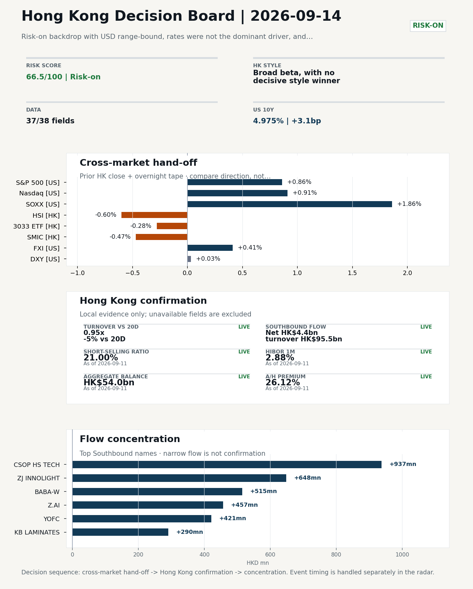
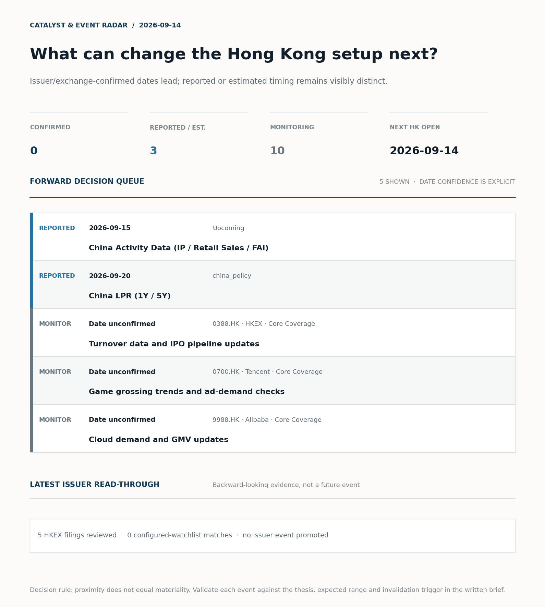

# Morning Research Workbench | 2026-09-14

> **Commute reading route:** `Layer 1 scan (5 min)` → `Layer 2 deep read` → `Layer 3 and appendix if time allows`
>
> Mode: `Week Ahead` | Use Friday's close as the baseline, lay out the week's calendar, and name the key things to watch.

_Data through: US/global `2026-09-11` | HK `2026-09-11` | A-share `2026-09-11` | Generated `2026-09-14 07:09:41`_

## Executive Summary

- **Did yesterday's call work?** NO CALL - The 2026-09-12 report published no directional call (neutral regime).
- **What changed overnight?** Semis led higher: SOXX +1.86%, NVDA -0.03%, TSMC +1.22%. HSI -0.60% and 3033.HK -0.28%.
- **What it means for AI/TMT** No decisive style winner - Broad beta, with no decisive style winner, a 0.06pp spread. Avoid forcing a growth-versus-value call; let volume, Southbound concentration, and the first-hour relative tape identify leadership.
- **What to watch today** Next scheduled catalyst: China Activity Data (IP / Retail Sales / FAI) on 2026-09-15. Confirm if SMIC and Hua Hong open in the same direction as the overnight leg and hold it through the first hour; invalidate if they track HSCEI instead.

## Layer 1 | Reset (5 min)

### 1.1 Last Session's Call
**Verdict: NO CALL.** The 2026-09-12 report published no directional call (neutral regime).

**Recent record.** 6 confirmed / 4 broken over the last 10 scoreable calls (60.0% hit rate). This is a directional close-to-close diagnostic, not a track record.

### 1.2 Opening Decision Board

**Global-to-Hong Kong signals**

_Decision-useful subset: each row states the implication and the next test. Descriptive secondary monitors are kept out of the five-minute scan._

| Signal | Last / move | Interpretation | Confirmation / invalidation |
| --- | --- | --- | --- |
| S&P 500 | 7,656.98 / +0.86% | Broad US risk rose as volatility drained out of the tape, which sets the external floor Hong Kong opens against. Falling volatility confirms lower near-term stress. | Watch whether Nasdaq and offshore-China proxies move the same way. |
| Nasdaq 100 | 29,368.44 / +0.91% | Growth tracked broad beta, so the move looks market-wide rather than duration-led. Growth advanced despite higher yields, showing momentum resilience but also higher reversal sensitivity. | 3033.HK versus HSI leadership carries the read; rising yields would undo it. |
| Hang Seng Index | 24,805.63 / -0.60% | Broad beta fell with no single driver visible in today's fields. | Southbound participation decides whether this is investable or just a print. |
| Hang Seng TECH ETF (3033.HK) | 4.2380 / -0.28% | Hong Kong growth led broad beta, improving the platform/internet style signal. | Needs a stable CNH and Southbound buying to become a duration signal. |
| Semiconductors (SOXX) | 527.07 / **+1.86%** | Semis led the Nasdaq by 0.95pp, putting the AI capex trade back in front. | SMIC and Hua Hong at the open show whether it transmits to Hong Kong. |
| US 10Y | 4.9750% / +3.1bp | The yield proxy rose, tightening the discount-rate backdrop for long-duration Hong Kong growth. | Read it through 3033.HK relative performance, not the index level. |
| USD/CNH | 6.7075 / -0.08% | A stronger offshore renminbi supports the external-risk backdrop for Hong Kong equities. | FXI and Southbound flow decide whether this reaches Hong Kong equities. |
| VIX | 15.84 / **-11.21%** | Lower implied volatility reduces near-term stress, but is supportive only if equity breadth confirms. | Falling volatility on narrowing breadth is a warning, not support. |

_Secondary monitors retained in the source bundle: SMIC (0981.HK), CSI 300, China 10Y, CN-US 10Y spread, DXY, USD/HKD, Brent crude, COMEX gold, Copper._

**Hong Kong local confirmation**

| Check | Value | Status | Source / as of | Why it matters |
| --- | --- | --- | --- | --- |
| Main Board turnover vs 20D | 0.95x \| -5% vs 20D | Live local | HKEX \| 2026-09-11 | Trailing 20-session average turnover was HK$241.5bn. |
| Southbound / Northbound net flow | Southbound Net HK$4.4bn \| turnover HK$95.5bn \| Northbound Turnover RMB291.3bn \| net not reported | Live local | HKEX Connect \| 2026-09-11 | Southbound net buy is calculated from HKEX disclosed buy and sell turnover. |
| Short-selling ratio | 21.00% | Live local | HKEX \| 2026-09-11 | Official HKEX stock-level short-selling table, aggregated as a share of total market turnover. |
| AH premium index | 26.12% | Live public | Yahoo \| 2026-09-11 | Fixed 10-name basket, equal-weighted, both legs priced on the same date; comparable across dates. Covered-pair average was +35.18% across 18 pairs. |
| USD/HKD spot vs band | 7.8412 \| band 7.7500 to 7.8500 | Live quote + local | Yahoo \| 2026-09-11 | Mid-band: 88 pips from the weak side and 912 pips from the strong side, so the peg is not an active constraint. Official Convertibility Undertakings define the linked-rate stress boundaries for USD/HKD. |
| HIBOR 1M | 2.88% | Live local | HKMA \| 2026-09-11 | 1M HIBOR is the cleanest quick read for Hong Kong funding conditions and equity-duration pressure. |
| Hong Kong leadership | Broad beta, with no decisive style winner | Proxy | HSI / HSCEI / 3033.HK ETF relative \| 2026-09-11 | Use HSI / HSCEI / 3033.HK ETF relative moves as the opening style read. |

**Risk state and evidence**

**Composite risk score:** `66.5/100` | **Regime:** `Risk-on`

| Component | Score impact | Evidence |
| --- | --- | --- |
| US beta | +5.2 | S&P 500 +0.86% |
| HK growth ETF proxy | -1.4 | 3033.HK ETF -0.28% |
| Semis complex | +9 | SOXX +1.86% |
| Offshore China proxy | +2.0 | FXI +0.41% |
| Dollar pressure | -0.3 | DXY +0.03% |
| Volatility | +10 | VIX -11.21% |
| HK short-selling | -8 | Short-selling ratio 21.00% |
| HK turnover | +0 | Turnover 0.95x 20D |

_Base 50 plus the component deltas above. Semis complex entered the score on 2026-08-22; earlier scores in the ledger exclude it._

**This Week Checklist**

1. **VIX -11.21%**
 High-frequency data | Lower volatility signals easing stress in the tape. (second-order macro context)
2. **Risk-on backdrop with USD range-bound, rates were not the dominant driver, and Nasdaq 100 outperformed FXI**
 Still-moving markets | No fresh Hong Kong cash session is assumed; use global active assets and policy/event flow to prepare the next open.
3. **China Aggregate Financing / New Loans (Past expected window (unverified))**
 Macro / policy | Credit expansion, domestic demand chains, and financials | Industries: Banks, Property chain, Infrastructure
4. **US CPI (Past expected window (unverified))**
 Macro / policy | Rates expectations, the dollar, and growth-equity valuation | Industries: Technology, Internet, Brokers

## Visual Dashboard

**Catalyst & Event Radar**

**Chart read:** No issuer/exchange-confirmed event date is populated; 3 reported or estimated timing item(s) and 10 undated trigger(s) remain explicit.

_Source: Public calendars, issuer disclosures and configured research watchlists_
## Layer 2 | Core Research (20-30 min)

### 2.1 This Week at a Glance
**Week Ahead Map**
- Week ahead (2026-09-14 to 2026-09-18) opens against a `Risk-on` backdrop, using Friday's close (2026-09-11) as the baseline.

**This Week's Key Events**

| Date | Type | Event | Why it matters |
| --- | --- | --- | --- |
| 2026-09-15 | Upcoming | China Activity Data (IP / Retail Sales / FAI) | Consumer resilience, growth expectations, and risk-asset pricing |

**This Week's Calendar**
_Market open per day: HK ✓/✗, US ✓/✗, CN ✓/✗._

| Day | Markets open | Dated catalysts |
| --- | --- | --- |
| 2026-09-14 Mon | HK✓ US✓ CN✓ | - |
| 2026-09-15 Tue | HK✓ US✓ CN✓ | China Activity Data (IP / Retail Sales / FAI) |
| 2026-09-16 Wed | HK✓ US✓ CN✓ | - |
| 2026-09-17 Thu | HK✓ US✓ CN✓ | - |
| 2026-09-18 Fri | HK✓ US✓ CN✓ | - |

**Base Case / Risk Case**
- **Base case:** Risk-on continuation: leadership stays with growth / platform names and the 3033.HK ETF proxy, supported by flows.
- **Risk case:** A hawkish macro surprise or a sharp USD/CNH leg higher unwinds the risk-on bias and rotates into defensives.

**What to Watch This Week**

| Watch | Why | Invalidation |
| --- | --- | --- |
| Open vs Friday's close (2026-09-11) | Whether the opening gap holds or fades is the first signal of the week. | The gap fades within the first session. |
| Southbound flow | Confirm the index move with local money, not offshore beta. | Southbound stays net-sell while HSI rallies. |
| HSI vs 3033.HK ETF leadership | Growth-led or value-led decides the week's style. | Reclassify the tape when either 3033.HK or HSCEI opens a sustained 0.5pp |
| USD/CNH and USD/HKD | FX stability is the precondition for a clean risk-on extension. | CNH breaks its recent range or USD/HKD tests the weak side. |
| Turnover vs 20-day | Thin participation makes any index move easier to fade. | The index move happens on turnover below 0.9x the 20-day average. |
| First catalyst: China Activity Data | Consumer resilience, growth expectations, and risk-asset pricing | The catalyst resolves against the base case. |

**Weekend Digest**

| Channel | Signal | Why |
| --- | --- | --- |
| News | Goldman picks China healthcare stocks for a post-AI trade | This can directly reshape earnings forecasts and the valuation framework |
| News | How Will Silicon Valley Rearm America? | Assess whether the story can propagate through the Industrials value chain |
| News | China's EV makers shift gears to focus on humanoids as car market slows | Assess whether the story can propagate through the Autos and EV value chain |
| Vol | VIX -11.21% | Lower volatility signals easing stress in the tape. |
| Commodities | WTI crude -2.37% | Softer oil argues for a more cautious cyclical-growth read. |
| Rates | US 10Y +3.1bp | Keep tracking it to confirm whether the core daily narrative is holding. |
| Crypto | Bitcoin +0.79% | Keep tracking it to confirm whether the core daily narrative is holding. |

**Monday Morning Questions**
- Which single dated catalyst this week is most likely to change the base case?
- Does Southbound flow confirm or contradict the overnight cross-asset tone?
- Is the week likely to be beta-led or driven by a narrow style pocket?
- What data point would invalidate the base case by mid-week?

### 2.3 Macro Transmission
**Desk read.** The week opens from Friday's close (2026-09-11) with a risk-on backdrop in place: Nasdaq 100 outperformed FXI, SOXX closed +1.86% with TSMC ADR +1.22%, VIX pulled back -11.21%, and WTI eased -2.37% to USD 100.05.

**Market sensitivity.** That combination supports HK growth/platform leadership at the open, but the week's repricing risk sits almost entirely on Tuesday's China Activity Data (IP / Retail Sales / FAI).

**HK implication.** Two prior releases (China Aggregate Financing / New Loans on 2026-09-12 and US CPI on 2026-09-12) sit in the past-expected window and are flagged as unverified, so the cleanest read is to confirm official prints before treating either as the macro anchor for the week.

**Macro watchpoints**
- Tuesday 2026-09-15 China Activity Data (IP / Retail Sales / FAI): the only scheduled macro release of the week and the cleanest read on
- Official confirmation of the 2026-09-12 US CPI and China Aggregate Financing prints before either is used as the macro anchor
- SOXX and TSMC ADR extension vs fade on Monday's open, as the cleanest external tell for HK semis and platform beta coming out of Friday's close.
- USD/CNH range integrity and USD/HKD weak-side test: FX stability is the precondition for the base case risk-on extension.

| Time | Region | Event | Status | Desk read |
| --- | --- | --- | --- | --- |
| | CN | China Aggregate Financing / New Loans | Past expected window (unverified) | Impact: Credit expansion, domestic demand chains, and financials \| Attention: 5/5 \| Industries: Banks, Property chain, Infrastructure |
| | US | US CPI | Past expected window (unverified) | Impact: Rates expectations, the dollar, and growth-equity valuation \| Attention: 5/5 \| Industries: Technology, Internet, Brokers |
| | CN | China Activity Data (IP / Retail Sales / FAI) | Upcoming | Impact: Consumer resilience, growth expectations, and risk-asset pricing \| Attention: 5/5 \| Industries: Consumer, E-commerce, Consumer discretionary |

**Positioning and risk backdrop**

- Detailed local flow evidence is covered under Flow Tracker and Attribution; keep this section focused on options, hedging, and macro-positioning risk.

### 2.4 Company Micro Research and Catalysts

| Grade | Sector | Headline | Why it matters | Horizon |
| --- | --- | --- | --- | --- |
| A | Semiconductors and AI | Goldman picks China healthcare stocks for a post-AI trade | This can directly reshape earnings forecasts and the valuation framework | Short-term catalyst |

**Company Event Takeaway**
**Desk read.** Week ahead baseline is Friday's close (2026-09-11 HK tape): a risk-on tape with USD range-bound and Nasdaq 100 outperforming FXI.
**Why it matters.** No core-coverage names report earnings this week; the earliest in our slate is China Mobile on 2026-10-20, followed by BYD on 2026-10-29, so model inputs should stay anchored to monthly prints.
**Follow-up.** The main narrative event for offshore China platforms is Goldman's post-AI healthcare rotation note (Grade A), which is more relevant for sector-pairing and earnings revision framework than for an immediate catalyst.

**LLM Quick Takes**
- **0700.HK** | Core internet holding; Friday close HKD 428.4, +0.66%, sitting at 21% of the 60-session range. Relevant headline…
- **0388.HK** | Friday close HKD 392.6, -1.11%, mid-range at 59% of 60-session band. No event this week; calendar points to 2026-11-04.…
- **1211.HK** | Friday close HKD 79.85, +0.38%, mid-range at 33%. Calendar date 2026-10-29. Watch item for the week is weekly delivery cadence…
- **1299.HK** | Friday close HKD 75.05, -0.33%, mid-range at 56%. No scheduled event this week; next checkpoint is NBV trend updates.…

Decision filter<h4>No immediate portfolio catalyst: 5 official filings were screened and the low-signal market set stays aggregated.</h4>
5 profit warnings

<strong>5</strong>Official filings

<strong>0</strong>Watchlist hits

<strong>0</strong>Actionable events

<strong>No event cleared the portfolio decision filter.</strong>

Broad-market filings remain traceable in the source appendix; they are not expanded here without a watchlist, estimate or liquidity read-through.

<strong>Coverage boundary.</strong> sell-side rating changes, IPO / grey-market monitor were not decision-grade in this run; their absence is not treated as confirmation that no event exists.

**Core coverage requiring follow-up**

**Core coverage**

| Name | Ticker | Last | 1D | Range position | Morning note |
| --- | --- | --- | --- | --- | --- |
| HKEX | 0388.HK | 392.60 | -1.11% | Mid-range | Marginally lower (-1.11%), mid-range at 59% of its 60-session band. |
| Tencent | 0700.HK | 428.40 | +0.66% | Bottom of range | Marginally higher (+0.66%), still in the bottom quartile of its 60-session range (21%). |

**Recent headlines for Tencent:**
- [Tencent's Enflame Stake Gains Nearly $3 Billion in One Day](https://finance.yahoo.com/technology/ai/articles/tencents-enflame-stake-gains-nearly-181434736.html) (GuruFocus.com)

**Priority follow-up**

| Name | Ticker | Last | 1D | Range position | Morning note |
| --- | --- | --- | --- | --- | --- |
| BYD Company | 1211.HK | 79.85 | +0.38% | Mid-range | Marginally higher (+0.38%), mid-range at 33% of its 60-session band. |
| AIA | 1299.HK | 75.05 | -0.33% | Mid-range | Marginally lower (-0.33%), mid-range at 56% of its 60-session band. |

### 2.5 Morning Meeting Questions
**Q1. The index fell but Southbound bought - is the move real?**
- **Evidence:** HSI -0.60% against Southbound net +4.4bn HKD.
- **How to answer:** Treat it as unconfirmed. Price and mainland flow disagreed, so the price move was not driven by Southbound participation; it needs another session of confirmation before being read as a trend.

## Layer 3 | Session Playbook (8-12 min)

### 3.1 Base Case and Scenario Map
**Starting posture.** Broad beta, with no decisive style winner (medium confidence); composite risk `66.5/100` (Risk-on). Avoid forcing a growth-versus-value call; let volume, Southbound concentration, and the first-hour relative tape identify leadership.

**Scenario map**

| Scenario | Observable trigger | Interpretation | Research response |
| --- | --- | --- | --- |
| Selective growth confirms | 3033.HK keeps a >0.5pp first-hour lead over HSCEI; SMIC and Hua Hong stop lagging broad beta; CNH is stable. | The prior style split has live price confirmation, but is not yet broad China risk-on. | Prioritize internet/platform relative strength; verify participation again at the close. |
| Broad beta takes over | HSI and HSCEI rise together, breadth improves and the 3033.HK lead narrows without turning negative. | Leadership is broadening from a style trade into market beta. | Expand the research set from growth leaders to financials, SOEs and index-heavy names. |
| Risk-off continuation | 3033.HK loses its lead, semis underperform HSCEI and CNH depreciation accelerates. | The prior divergence was a temporary pocket of strength rather than a durable hand-off. | Treat rebounds as unconfirmed; focus on balance-sheet, catalyst and crowding risk. |

**Clocked validation scorecard**

| Window | Check | Prior evidence | Pass condition | What it decides |
| --- | --- | --- | --- | --- |
| 09:30-10:30 | 3033.HK vs HSCEI | +0.06pp at the prior close | 3033.HK retains >0.5pp relative lead | Whether growth leadership survives the open |
| 09:30-10:30 | Semiconductor hand-off | SMIC -0.47%; Hua Hong Semiconductor -1.15% | Stabilise after the open; at least one stops underperforming HSCEI | Whether overnight semis pressure is contained locally |
| 09:30-10:30 | HSI price zone | 24,806 vs 24,500 / 25,000 reference grid | Hold above the lower grid or reclaim the upper grid with breadth | Whether broad beta is stabilising; grid is derived, not technical analysis |
| 09:30-10:30 | USD/CNH | 6.7075 \| -0.08% | No acceleration in CNH depreciation | Whether FX permits a clean Hong Kong risk extension |
| At close | Turnover | 0.95x \| -5% vs 20D | At least 1.0x the 20-session average | Whether the move had normal participation |
| At close | Southbound | Net HK$4.4bn \| turnover HK$95.5bn | Net buying remains positive and broadens beyond one or two names | Whether mainland money confirms the price move |
| At close | Short pressure | 21.00% | Falls versus the prior verified reading (21.00%) | Whether rebound conviction improved |

**Upgrade rule.** Confirm a broad-beta session only if HSI breadth and turnover improve without a sharp 3033.HK-versus-HSCEI split.
**Kill switch.** Reclassify the tape when either 3033.HK or HSCEI opens a sustained 0.5pp relative lead with flow confirmation.
**Clock discipline.** At 07:30, same-day Southbound, turnover and short-selling outcomes are not known. Use the first-hour price/FX checks provisionally and make the final classification only after the close.
**Event clock.** No same-day decision-grade item is populated; the nearest reported/estimated item is China Activity Data (IP / Retail Sales / FAI) on 2026-09-15. Verify the issuer or official calendar before relying on the date.

### 3.2 Conditional Theme Deep Dive

| Field | Read |
| --- | --- |
| Theme | AI and Compute Chain |
| Angle for the day | Track whether global AI capex, semis, cloud, and server demand are still carrying offshore China internet and hardware sentiment. |

**Theme desk read**
**Core thesis.** The AI and Compute Chain theme enters the week with a constructive but split-tape setup.
**Evidence.** Friday's close is the baseline: SOXX +1.86% and TSMC ADR +1.22% argue that global semis demand is still firm enough to give HK semis and platform beta a supportive open.
**What to test.** The relevant question for the week is whether that supportive backdrop is enough to absorb two competing pressures on offshore China names.

**Signals to keep in mind**
- Goldman picks China healthcare stocks for a post-AI trade: This can directly reshape earnings forecasts and the valuation framework
- How Will Silicon Valley Rearm America?: Assess whether the story can propagate through the Industrials value chain
- VIX -11.21%: Lower volatility signals easing stress in the tape.
- SOXX +1.86%: Semis rallied, giving HK semis and platform beta a supportive open.

**LLM watch items:**
- Tuesday China Activity Data (IP / Retail Sales / FAI): bar for domestic demand vs. the current risk-on tape
- Verify China Aggregate Financing and US CPI prints before relying on them for rates or credit-impulse reads.
- Alibaba (9988.HK) cloud/AI-spend messaging: monitor for any incremental commentary on capex-to-revenue conversion after the US$10.2bn raise and
- Tencent (0700.HK) Enflame stake follow-through: track whether the re-rating extends or fades
- SOXX and TSMC ADR follow-through into Tuesday's Asia open as the cleanest external signal for HK semis beta.

**Related names to keep close:**

| Name | Ticker | Bucket | Morning read |
| --- | --- | --- | --- |
| Tencent | 0700.HK | Core coverage | Marginally higher (+0.66%), still in the bottom quartile of its 60-session range (21%). |
| Alibaba | 9988.HK | Core coverage | Marginally higher (+0.56%), mid-range at 47% of its 60-session band. |
| AIA | 1299.HK | Priority follow-up | Marginally lower (-0.33%), mid-range at 56% of its 60-session band. |

**Upcoming catalysts tied to the theme:**
- 2026-09-15 | China Activity Data (IP / Retail Sales / FAI) | Consumer resilience, growth expectations, and risk-asset pricing

**Relevant headlines:**
- [Goldman picks China healthcare stocks for a post-AI trade](https://www.cnbc.com/2026/09/13/goldman-picks-china-healthcare-stocks-for-a-post-ai-trade.html)
- [How Will Silicon Valley Rearm America?](https://www.bloomberg.com/news/videos/2026-09-13/how-will-silicon-valley-rearm-america-video)
- [China's EV makers shift gears to focus on humanoids as car market slows](https://www.cnbc.com/2026/09/09/chinas-ev-makers-shift-gears-to-focus-on-humanoids-as-car-market-slows.html)

### 3.3 Daily One Chart
**Daily One Chart | HKEX short-selling pressure map**

**Chart read.** Market short-selling reached 21.00% of turnover.
**Why it matters.** The chart leads today because the pressure is either broad, concentrated, or acute in the top name.

_Source: HKEX Daily Quotations - Short Selling Turnover_

## Optional Appendix | Traceability and Performance (10-15 min)

### Report Metadata
> Date policy: Review date 2026-09-13 is treated as `Week Ahead`. | Global (US/Europe) data date is 2026-09-11; adapter effective date is 2026-09-11 and summary date is 2026-09-11. | Hong Kong local data date is 2026-09-11; role: last completed HK/China cash-market reference tape.
> Market data quality: Coverage: `37/38` | Missing: `1`
> Report quality: `95.6/100` | Grade `A` | Status `usable with caveats`

### Report Quality and Validation
- **Quality score:** 95.6/100 | **Grade:** A | **Status:** usable with caveats
- **Run summary:** 8 healthy | 2 caveat | 0 failed
- **Release recommendation:** Send with caveats | The report is usable, but the advisory guidance should travel with it so readers understand the data gaps.

| Source | Status | Bucket |
| --- | --- | --- |
| Macro calendar | partial | caveat |
| Risk and sentiment feed | partial | caveat |

**Desk-use guidance summary:** 0 blocking | 1 advisory

**Desk-use guidance**
- **Advisory:** Questionable narrative fields were removed; use the deterministic fallback copy and review the audit trail.

**Quality warnings**
- Narrative fact-check guardrail produced warnings; review the validation table before relying on narrative sections.

**Narrative fact-check guardrail**
- Checked 28 numeric claims; 0 numeric mismatch(es), 0 logic warning(s); 12 structured claims, 0 source/text warning(s); 0 critical, 0 review. Replaced 1 unsafe narrative field(s) with deterministic fallback copy.
- **Deterministic fallback fields:** tasks.overnight_review.drivers[2]

_Full component weights, per-source freshness, adapter status and provenance records are archived with this report under `audit/` rather than printed here._

### Historical Signal Performance
- **Readiness:** exploratory with caveats | 69 observations | 99 active signal dates | next-close entry, 10bps cost, no same-day returns.
- **Interpretation boundary:** exploratory until a benchmark reaches 252 sessions and 100 active-signal sessions.
- **Data-quality caveat:** 23 conflicting price revision(s) and 6 non-session observation(s) remain in the research ledger.
- **Daily-use boundary:** cumulative return, Sharpe and the performance chart stay out of the daily commute edition until the sample and trading-calendar gates pass; use Yesterday's Call instead.

### Source Links
- [Goldman picks China healthcare stocks for a post-AI trade](https://www.cnbc.com/2026/09/13/goldman-picks-china-healthcare-stocks-for-a-post-ai-trade.html) (cnbc_markets)
- [Tencent's Enflame Stake Gains Nearly $3 Billion in One Day](https://finance.yahoo.com/technology/ai/articles/tencents-enflame-stake-gains-nearly-181434736.html) (GuruFocus.com)
- [Alibaba and Amazon Face the Same AI Spending Question: How Quickly Does Capacity Become Cash?](https://finance.yahoo.com/technology/ai/articles/alibaba-amazon-face-same-ai-140837189.html) (Insider Monkey)
- [Alibaba (BABA)'s AI Bet Faces a $10.2 Billion Test](https://finance.yahoo.com/technology/ai/articles/alibaba-baba-ai-bet-faces-133035025.html) (Insider Monkey)
- [Meituan (MPNGF) (Q2 2026) Earnings Call Highlights: Record Revenue and Strategic AI Pivot Drive...](https://finance.yahoo.com/markets/stocks/articles/meituan-mpngf-q2-2026-earnings-190123345.html) (GuruFocus.com)
- [Meituan Returns to Profit as Food-Delivery Competition Eases](https://www.wsj.com/business/earnings/meituan-returns-to-profit-as-food-delivery-competition-eases-1026a0e9?siteid=yhoof2&yptr=yahoo) (The Wall Street Journal)
- [China Mobile (SEHK:941): A Closer Look at Valuation After Steady Share Price Gains This Year](https://finance.yahoo.com/news/china-mobile-sehk-941-closer-154022664.html) (Simply Wall St.)
- [01023.HK Profit warning / alert announcement](http://www1.hkexnews.hk/listedco/listconews/sehk/2026/0911/2026091100569.pdf) (HKEXnews)
- [00491.HK Profit warning / alert announcement](http://www1.hkexnews.hk/listedco/listconews/sehk/2026/0910/2026091001011.pdf) (HKEXnews)
- [02293.HK Profit warning / alert announcement](http://www1.hkexnews.hk/listedco/listconews/sehk/2026/0909/2026090900364.pdf) (HKEXnews)
- [08547.HK Profit warning / alert announcement](http://www1.hkexnews.hk/listedco/listconews/gem/2026/0908/2026090800520.pdf) (HKEXnews)
- [00722.HK Profit warning / alert announcement](http://www1.hkexnews.hk/listedco/listconews/sehk/2026/0904/2026090402367.pdf) (HKEXnews)
