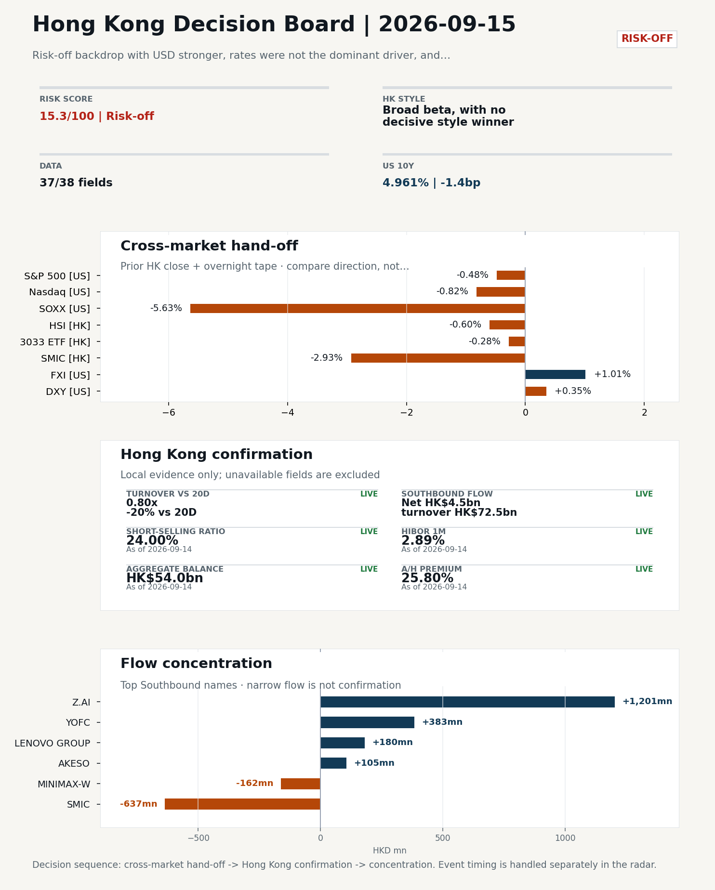
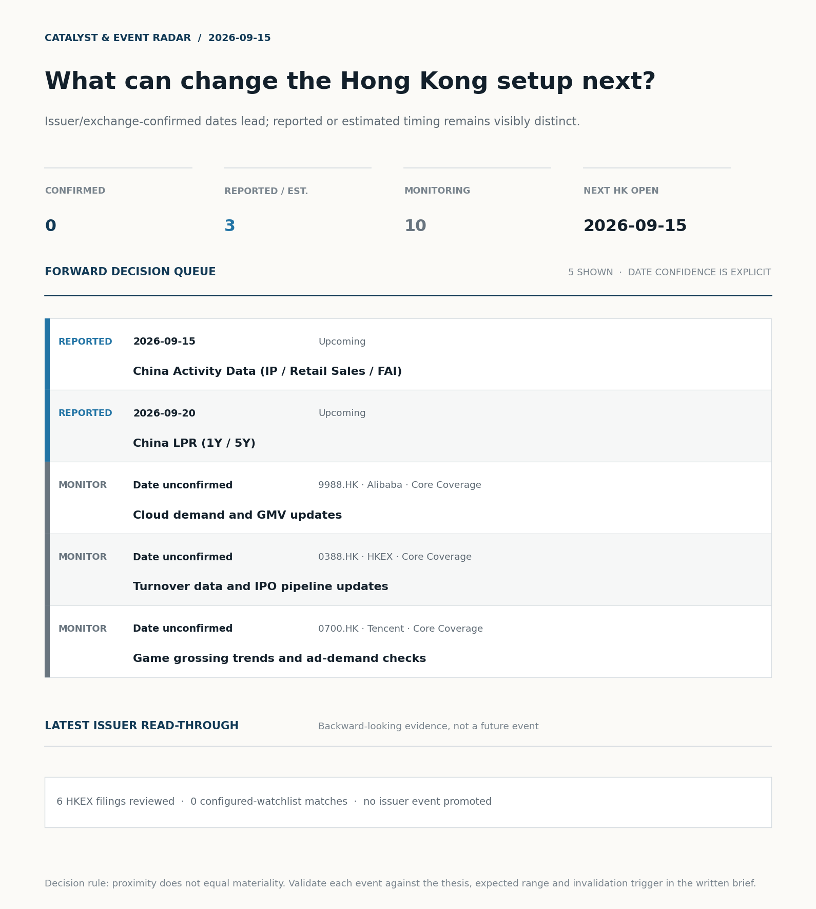
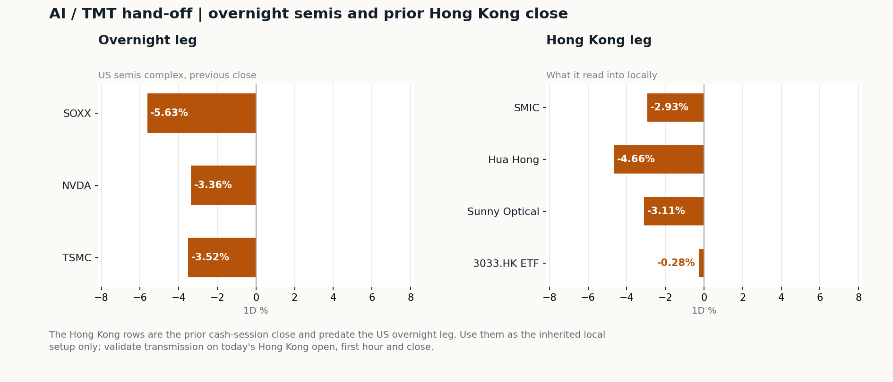
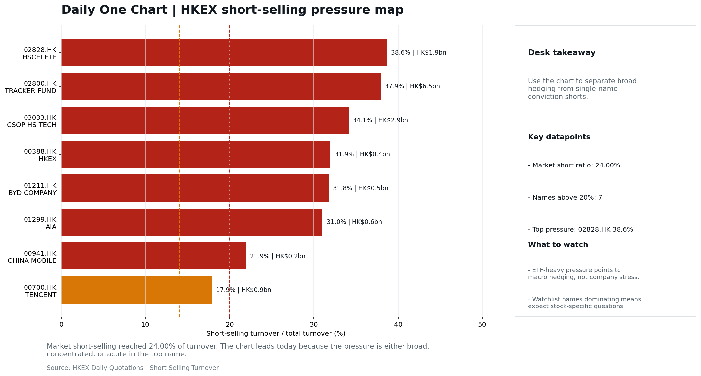

# Morning Research Workbench | 2026-09-15

> **Commute reading route:** `Layer 1 scan (5 min)` → `Layer 2 deep read` → `Layer 3 and appendix if time allows`
>
> Mode: `Trading Daily` | Keep the report execution-oriented: what mattered in the completed session, what can move Hong Kong leadership, and what needs fast follow-up.

_Data through: US/global `2026-09-14` | HK `2026-09-14` | A-share `2026-09-14` | Generated `2026-09-15 07:53:48`_

## Executive Summary

- **Did yesterday's call work?** NO CALL - The 2026-09-12 report published no directional call (neutral regime).
- **What changed overnight?** Semis led lower: SOXX -5.63%, NVDA -3.36%, TSMC -3.52%. HSI -0.60% and 3033.HK -0.28%.
- **What it means for AI/TMT** No decisive style winner - Broad beta, with no decisive style winner, a 0.06pp spread. Avoid forcing a growth-versus-value call; let volume, Southbound concentration, and the first-hour relative tape identify leadership.
- **What to watch today** China Activity Data (IP / Retail Sales / FAI). Confirm if SMIC and Hua Hong open in the same direction as the overnight leg and hold it through the first hour; invalidate if they track HSCEI instead.

## Layer 1 | Scan (5 min)

### 1.1 Yesterday's Call
**Verdict: NO CALL.** The 2026-09-12 report published no directional call (neutral regime).

**Recent record.** 6 confirmed / 4 broken over the last 10 scoreable calls (60.0% hit rate). This is a directional close-to-close diagnostic, not a track record.

### 1.2 Opening Decision Board

**Global-to-Hong Kong signals**

_Decision-useful subset: each row states the implication and the next test. Descriptive secondary monitors are kept out of the five-minute scan._

| Signal | Last / move | Interpretation | Confirmation / invalidation |
| --- | --- | --- | --- |
| S&P 500 | 7,619.98 / -0.48% | Broad US risk fell without a clear driver in today's fields; treat it as beta, not a signal. | Watch whether Nasdaq and offshore-China proxies move the same way. |
| Nasdaq 100 | 29,127.16 / -0.82% | Growth lagged broad beta, warning that headline risk-on may not transmit cleanly to the 3033.HK ETF proxy. | 3033.HK versus HSI leadership carries the read; rising yields would undo it. |
| Hang Seng Index | 24,805.63 / -0.60% | Broad beta fell tracking offshore China risk appetite, with growth and value moving together. | Southbound participation decides whether this is investable or just a print. |
| Hang Seng TECH ETF (3033.HK) | 4.2380 / -0.28% | Hong Kong growth led broad beta, improving the platform/internet style signal. | Needs a stable CNH and Southbound buying to become a duration signal. |
| Semiconductors (SOXX) | 497.40 / **-5.63%** | Semis underperformed the Nasdaq by 4.81pp, so this is a cycle move rather than broad growth weakness. | SMIC and Hua Hong at the open show whether it transmits to Hong Kong. |
| US 10Y | 4.9610% / -1.4bp | The yield proxy fell, easing the valuation headwind for duration-sensitive equities. | Read it through 3033.HK relative performance, not the index level. |
| USD/CNH | 6.6655 / -0.63% | A stronger offshore renminbi supports the external-risk backdrop for Hong Kong equities. | FXI and Southbound flow decide whether this reaches Hong Kong equities. |
| VIX | 17.10 / **+7.95%** | Higher implied volatility raises the tail-risk premium and weakens risk-on conviction. | Falling volatility on narrowing breadth is a warning, not support. |

_Secondary monitors retained in the source bundle: SMIC (0981.HK), CSI 300, China 10Y, CN-US 10Y spread, DXY, USD/HKD, Brent crude, COMEX gold, Copper._

**Hong Kong local confirmation**

| Check | Value | Status | Source / as of | Why it matters |
| --- | --- | --- | --- | --- |
| Main Board turnover vs 20D | 0.80x \| -20% vs 20D | Live local | HKEX \| 2026-09-14 | Trailing 20-session average turnover was HK$240.3bn. |
| Southbound / Northbound net flow | Southbound Net HK$4.5bn \| turnover HK$72.5bn \| Northbound Turnover RMB238.5bn \| net not reported | Live local | HKEX Connect \| 2026-09-14 | Southbound net buy is calculated from HKEX disclosed buy and sell turnover. |
| Short-selling ratio | 24.00% | Live local | HKEX \| 2026-09-14 | Official HKEX stock-level short-selling table, aggregated as a share of total market turnover. |
| AH premium index | 25.80% | Live public | Yahoo \| 2026-09-14 | Fixed 10-name basket, equal-weighted, both legs priced on the same date; comparable across dates. Covered-pair average was +32.40% across 17 pairs. |
| USD/HKD spot vs band | 7.8420 \| band 7.7500 to 7.8500 | Live quote + local | Yahoo \| 2026-09-14 | Mid-band: 80 pips from the weak side and 920 pips from the strong side, so the peg is not an active constraint. Official Convertibility Undertakings define the linked-rate stress boundaries for USD/HKD. |
| HIBOR 1M | 2.89% | Live local | HKMA \| 2026-09-14 | 1M HIBOR is the cleanest quick read for Hong Kong funding conditions and equity-duration pressure. |
| Hong Kong leadership | Broad beta, with no decisive style winner | Proxy | HSI / HSCEI / 3033.HK ETF relative \| 2026-09-14 | Use HSI / HSCEI / 3033.HK ETF relative moves as the opening style read. |

**Risk state and evidence**

**Composite risk score:** `15.3/100` | **Regime:** `Risk-off`

| Component | Score impact | Evidence |
| --- | --- | --- |
| US beta | -2.9 | S&P 500 -0.48% |
| HK growth ETF proxy | -1.4 | 3033.HK ETF -0.28% |
| Semis complex | -9 | SOXX -5.63% |
| Offshore China proxy | +5.0 | FXI +1.01% |
| Dollar pressure | -3.5 | DXY +0.35% |
| Volatility | -10 | VIX +7.95% |
| HK short-selling | -8 | Short-selling ratio 24.00% |
| HK turnover | -5 | Turnover 0.80x 20D |

_Base 50 plus the component deltas above. Semis complex entered the score on 2026-08-22; earlier scores in the ledger exclude it._

**Morning Checklist**

1. **SOXX -5.63%**
 High-frequency data | Semis sold off, so SMIC, Hua Hong and 3033.HK are the first HK names to be tested. (direct read-through to HK tech)
2. **Risk-off backdrop with USD stronger, rates were not the dominant driver, and Nasdaq 100 outperformed FXI**
 Overnight regime | Start by deciding whether the day is about Risk-off conditions or a style pivot.
3. **China Aggregate Financing / New Loans (Past expected window (unverified))**
 Macro / policy | Credit expansion, domestic demand chains, and financials | Industries: Banks, Property chain, Infrastructure
4. **US CPI (Past expected window (unverified))**
 Macro / policy | Rates expectations, the dollar, and growth-equity valuation | Industries: Technology, Internet, Brokers

## Visual Dashboard

**Catalyst & Event Radar**

**Chart read:** No issuer/exchange-confirmed event date is populated; 3 reported or estimated timing item(s) and 10 undated trigger(s) remain explicit.

_Source: Public calendars, issuer disclosures and configured research watchlists_
## Layer 2 | Core Research (20-30 min)

### 2.1 Global-to-Hong Kong Transmission
**Market Setup**
**Core tape.** Overnight US trading was risk-off: S&P 500 fell 0.48% and Nasdaq 100 dropped 0.82%, with the semis complex (SOXX -5.63%, TSM -3.52%, NVDA -3.36%) doing most of the damage and a stronger USD (DXY +0.35%) adding pressure.
**Main driver.** The driver decomposition flags short-selling pressure and HK participation as the dominant drags, with oil/geopolitics and US growth-style transmission as secondary negatives, and only modest support from a stronger CNH.
**HK relevance.** Against that, prior-HK evidence (2026-09-11) showed broad, balanced beta with no decisive style winner, so the open bias is defensive rather than directional.

**Key Drivers**
- Short-selling pressure at 24.00% (99th pct of 60 sessions) is the largest drag and raises the bar for any rebound follow-through.
- Semis-led US selloff (SOXX -5.63%, TSM -3.52%, NVDA -3.36%) is the cleanest direct read-through to HK tech.
- USD strength (DXY +0.35%) combined with softer HK turnover (0.80x 20D) reduces conviction in any leadership change at the open.
- CNH firmness (USD/CNH -0.63%) and Southbound +HK$4.5bn net buying are the only supportive cross-border signals, not enough to offset semis and dollar drags.

**Hong Kong Read-Through**
**Opening implication.** Defensive open bias: test HK semis (SMIC 0981.HK, Hua Hong 1347.HK) and 3033.HK first for overnight confirmation of the SOXX selloff. A constructive open requires HSI breadth and turnover to improve without a sustained 3033.HK-versus-HSCEI split, and either FXI follow-through or stable CNH to validate any rebound; otherwise the elevated short-selling ratio argues for fading weak opens until confirmation arrives.
_Hong Kong style leadership and flow confirmation are set out in the Hong Kong review below._

**Watch Points**
- USD composite moved higher by +0.15pct intraday, with a 0.416pct range.
- Main turning points appeared around 2026-09-14 08:05 peak / 2026-09-14 08:25 peak / 2026-09-14 08:40 peak, suggesting event-driven repricing rather than a clean one-way USD move.
- The biggest cross-asset divergence was Nasdaq 100 versus FXI, a spread of 0.529pct.
- Gold moved -0.95pct intraday with a 1.787pct high-low range.

**Curated overnight stories**
1. **SOXX -5.63% as US semis sold off overnight**
 Why it matters: Semiconductor-specific tape is the closest overnight read-through to HK tech hardware.
 HK read-through: Direct pressure on HK-listed semis and AI hardware names at the open; sets the tone for the broader tech block and any index reweighting effects.
2. ****
 Why it matters: Defines the overnight regime before the HK cash session opens and frames whether leadership will come from defensives or growth.
 HK read-through: Argues for tighter sizing, defensive tilts, and a higher hurdle for offshore-China cyclicals to lead; internet and growth names face valuation headwinds from USD strength.
3. **Goldman picks China healthcare stocks for a post-AI trade**
 Why it matters: Provides a constructive fundamental anchor and a specific sector pivot away from crowded AI/tech positioning, with a credible sell-side source.
 HK read-through: Positive read-through to HK-listed healthcare and pharma names, and a potential relative-value tailwind vs. the AI hardware block that sold off overnight.
4. **Asian stocks set to fall as US semis sell off on AI-pace concerns; key US yield tops 5%**
 Why it matters: Combines the two overnight overhangs for Asia: semis weakness and a back-up in US yields, which together pressure growth valuations and regional risk assets.
 HK read-through: Reinforces a defensive bias at the HK open; internet and growth names face dual headwinds from rates and AI-pace skepticism.
5. **Bank of America expects Q3 investment banking fees to fall more than 10%; shares slide**
 Why it matters: Signals continued weakness in capital-markets activity, which is relevant for HK brokers and any IPO/secondary issuance pipeline assumptions.
 HK read-through: Modest negative for HK brokers and financials with IB exposure; secondary effect on issuance-related sentiment for HK-listed names.

**AI / TMT hand-off**

**Overnight leg.** The overnight semis leg was risk-off at -4.17% average (SOXX -5.63%, NVDA -3.36%, TSMC -3.52%).
**Hong Kong expression.** SMIC, Hua Hong and Sunny Optical are under the most pressure at the open, and 3033.HK should be tested before the Hang Seng Index.
**Observable test.** Confirm if SMIC and Hua Hong open in the same direction as the overnight leg and hold it through the first hour; invalidate if they track HSCEI instead, which would mean local flow is overriding the global cycle.

| Name | Role in the chain | 1D | Leg |
| --- | --- | --- | --- |
| SOXX | Semis complex | -5.63% | overnight |
| NVDA | AI capex narrative | -3.36% | overnight |
| TSMC | Foundry demand | -3.52% | overnight |
| SMIC | Leading-edge / domestic substitution | -2.93% | Hong Kong |
| Hua Hong | Mature-node pricing cycle | -4.66% | Hong Kong |
| Sunny Optical | Hardware and optics supply chain | -3.11% | Hong Kong |
| 3033.HK ETF | Broad HK tech beta | -0.28% | Hong Kong |

**Clock discipline.** The Hong Kong rows are the prior cash-session close and predate the US overnight leg. Use them as the inherited local setup only; validate transmission on today's Hong Kong open, first hour and close.

### 2.2 Hong Kong Local Tape and Flow
**Local Tape Setup**
**Local read.** Hong Kong opens with a defensive bias after a risk-off US session in which the Nasdaq 100 fell 0.82% and the semis complex (SOXX -5.63%, TSM -3.52%, NVDA -3.36%) did most of the damage, against a stronger DXY (+0.35%) and a VIX up 7.95%.
**Verification point.** On the prior-HK tape (2026-09-11), leadership was balanced and unconvincing: HSI -0.60% and HSCEI -0.34% outperformed only modestly, while 3033.HK -0.28% shows growth has not decoupled.
**Risk to watch.** Local flow evidence is the binding constraint: Main Board turnover at 0.80x the 20-day average and short-selling at 24.00% raise the bar for chasing any rebound.

**Style and Local Leadership**
**Style call.** Broad beta, with no decisive style winner.
- **Evidence:** 3033.HK and HSCEI were separated by only 0.06pp (-0.28% versus -0.34%)
- **Portfolio meaning:** Avoid forcing a growth-versus-value call; let volume, Southbound concentration, and the first-hour relative tape identify leadership.
- **Cross-market read:** Hang Seng -0.60% / HSCEI -0.34% / 3033.HK ETF -0.28%. Offshore China proxy FXI +1.01% and USD/CNH -0.63% frame cross-border risk appetite. USD/HKD last traded around 7.8420, which keeps the Hong Kong funding lens in focus.

**Flow Confirmation**
Official Stock Connect evidence is available; the Flow Tracker confirms whether local money supports the price action.

**Follow-Through Checklist**
**Follow-through check.** Actionable test: at the open, check whether 3033.HK underperforms HSCEI by a meaningful margin and whether SMIC (0981.HK) / Hua Hong (1347.HK) confirm the SOXX selloff into mid-session.
**Failure condition.** Reclassify the tape when either 3033.HK or HSCEI opens a sustained 0.5pp relative lead with flow confirmation.

**Cross-asset attribution**

| Driver | Direction | Score | Evidence | HK implication |
| --- | --- | --- | --- | --- |
| Short-selling pressure | drag | 6.3 | HKEX short-selling ratio was 24.00%. | Elevated short activity argues for extra confirmation before chasing rebounds. |
| Hong Kong participation | drag | 1.98 | Main Board turnover was 0.80x the 20-session average. | Thin turnover makes index moves easier to fade. |
| Oil and geopolitics | mixed | 1.5 | Oil moved +1.87%. | Split the read between energy/cyclicals support and margin/geopolitical pressure. |
| US growth-style transmission | drag | 1.15 | Nasdaq 100 moved -0.82%. | Hong Kong growth and platform names should be tested first at the open. |
| Dollar / CNH pressure | drag | 0.95 | DXY +0.35% / USD-CNH -0.63% | A stable or softer CNH makes Hong Kong follow-through more credible. |

**Local flow evidence**

**Flow Takeaways**
- Short-selling pressure is elevated, so local rebounds need cleaner breadth and flow confirmation.
- Stock Connect Southbound: net HK$4.5bn on turnover HK$72.5bn (as of 2026-09-14).
- Stock Connect Northbound: turnover RMB238.5bn; public file provides total turnover/top active names, not full net-buy.
- AH premium: fixed 10-name basket +25.80% (comparable across dates); covered-pair average +32.40% over 17 pairs; widest premium: China Railway Construction 60.8%.

**Stock Connect Southbound Active Names**

| # | Ticker | Name | Buy | Sell | Net buy | HKEX turnover rank |
| --- | --- | --- | --- | --- | --- | --- |
| 1 | 02513.HK | Z.AI | HK$2,289.9mn | HK$1,088.7mn | HK$1,201.2mn | 1 |
| 2 | 00981.HK | SMIC | HK$941.4mn | HK$1,578.1mn | HK$-636.7mn | 1 |
| 3 | 06869.HK | YOFC | HK$1,598.9mn | HK$1,216.3mn | HK$382.6mn | 2 |
| 4 | 00992.HK | LENOVO GROUP | HK$354.0mn | HK$173.6mn | HK$180.4mn | 8 |
| 5 | 00100.HK | MINIMAX-W | HK$391.4mn | HK$553.7mn | HK$-162.3mn | 6 |

**AH Premium Dispersion**

| Name | A ticker | H ticker | Premium | As of |
| --- | --- | --- | --- | --- |
| China Railway Construction | 601186.SS | 1186.HK | +60.80% | 2026-09-14 |
| China Communications Construction | 601800.SS | 1800.HK | +56.56% | 2026-09-14 |
| China Railway | 601390.SS | 0390.HK | +52.14% | 2026-09-14 |

**HKEX Short-Selling Watch**

| Ticker | Name | Short ratio | Short turnover | Total turnover |
| --- | --- | --- | --- | --- |
| 00388.HK | HKEX | 31.95% | HK$0.4bn | HK$1.3bn |
| 00700.HK | TENCENT | 17.86% | HK$0.9bn | HK$4.9bn |
| 00941.HK | CHINA MOBILE | 21.93% | HK$0.2bn | HK$0.9bn |

- **Short-value leaders:** 02800.HK TRACKER FUND (HK$6.5bn); 02513.HK Z.AI (HK$3.1bn); 03033.HK CSOP HS TECH (HK$2.9bn); 07709.HK XL2CSOPHYNIX (HK$2.8bn).

### 2.3 Macro Transmission
**Desk read.** The macro tape for the 2026-09-15 HK session is shaped by a risk-off overnight (USD stronger, Nasdaq 100 outperforming FXI, semis and AI hardware heavyweights under pressure) and a thin verified read-through from the prior week's policy and inflation prints.

**Market sensitivity.** China August credit and US CPI for the 12 Sep window are still flagged as past-expected but unverified, so we cannot yet quantify the rates or credit impulse they imply.

**HK implication.** The single confirmed near-term catalyst is the China activity batch (IP / Retail Sales / FAI) due 15 Sep.

**Macro watchpoints**
- Verify official releases for China August credit (12 Sep) and US CPI (12 Sep) before drawing any rates or credit-impulse conclusion for the HK
- Reaction of HK semis and AI hardware proxies (SMIC, Hua Hong, 3033.HK) to the overnight SOXX -5.6% and TSMC/NVDA weakness
- China activity data (IP / Retail Sales / FAI) due 15 Sep: surprise direction will determine whether the current risk-off theme continues or
- USD direction and HIBOR follow-through from any verified US CPI print; under the peg this is the cleanest channel into HK equity duration.

| Time | Region | Event | Status | Desk read |
| --- | --- | --- | --- | --- |
| | CN | China Aggregate Financing / New Loans | Past expected window (unverified) | Impact: Credit expansion, domestic demand chains, and financials \| Attention: 5/5 \| Industries: Banks, Property chain, Infrastructure |
| | US | US CPI | Past expected window (unverified) | Impact: Rates expectations, the dollar, and growth-equity valuation \| Attention: 5/5 \| Industries: Technology, Internet, Brokers |
| | CN | China Activity Data (IP / Retail Sales / FAI) | Upcoming | Impact: Consumer resilience, growth expectations, and risk-asset pricing \| Attention: 5/5 \| Industries: Consumer, E-commerce, Consumer discretionary |
| | CN | China LPR (1Y / 5Y) | Upcoming | Impact: Watch whether it changes the day's core market narrative \| Attention: 5/5 \| Industries: Market-wide |

**Positioning and risk backdrop**

- Detailed local flow evidence is covered under Flow Tracker and Attribution; keep this section focused on options, hedging, and macro-positioning risk.

### 2.4 Company Micro Research and Catalysts

| Grade | Sector | Headline | Why it matters | Horizon |
| --- | --- | --- | --- | --- |
| A | Semiconductors and AI | Goldman picks China healthcare stocks for a post-AI trade | This can directly reshape earnings forecasts and the valuation framework | Short-term catalyst |

**LLM Quick Takes**
- **9988.HK** | Fact: closed -1.49% at 105.9, mid-range at 42% of 60-session band; two relevant headlines attached - Anthropic alleging Alibaba/DeepSeek training on Claude, and an Alibaba-vs-Amazon AI…
- **0388.HK** | Fact: closed +1.22% at 397.4, mid-range at 67% of 60-session band; no attached news. Investor read: relative strength versus the Tracker Fund and HSTECH ETF keeps it the cleanest Hong…
- **1299.HK** | Fact: closed +0.53% at 75.45, mid-range at 60% of 60-session band; no attached news. Investor read: defensive tone consistent with risk-off backdrop…
- **1211.HK** | Fact: closed +0.44% at 80.2, mid-range at 34% of 60-session band; no attached news. Investor read: range position leaves it skewed lower…

Decision filter<h4>No immediate portfolio catalyst: 6 official filings were screened and the low-signal market set stays aggregated.</h4>
6 profit warnings

<strong>6</strong>Official filings

<strong>0</strong>Watchlist hits

<strong>0</strong>Actionable events

<strong>No event cleared the portfolio decision filter.</strong>

Broad-market filings remain traceable in the source appendix; they are not expanded here without a watchlist, estimate or liquidity read-through.

<strong>Coverage boundary.</strong> sell-side rating changes, IPO / grey-market monitor were not decision-grade in this run; their absence is not treated as confirmation that no event exists.

**Core coverage requiring follow-up**

**Core coverage**

| Name | Ticker | Last | 1D | Range position | Morning note |
| --- | --- | --- | --- | --- | --- |
| Alibaba | 9988.HK | 105.90 | -1.49% | Mid-range | Marginally lower (-1.49%), mid-range at 42% of its 60-session band. |
| HKEX | 0388.HK | 397.40 | +1.22% | Mid-range | Marginally higher (+1.22%), mid-range at 67% of its 60-session band. |

**Recent headlines for Alibaba:**
- ['Freaking Insane': Daniel Newman Says Chinese AI Labs 'Lifted' US Frontier Models As Anthropic Accuses Alibaba, DeepSeek Of Training On Claude](https://tech.yahoo.com/ai/claude/articles/freaking-insane-daniel-newman-says-033008342.html) (Benzinga)

**Priority follow-up**

| Name | Ticker | Last | 1D | Range position | Morning note |
| --- | --- | --- | --- | --- | --- |
| AIA | 1299.HK | 75.45 | +0.53% | Mid-range | Marginally higher (+0.53%), mid-range at 60% of its 60-session band. |
| BYD Company | 1211.HK | 80.20 | +0.44% | Mid-range | Marginally higher (+0.44%), mid-range at 34% of its 60-session band. |

### 2.5 Morning Meeting Questions
**Q1. The index fell but Southbound bought - is the move real?**
- **Evidence:** HSI -0.60% against Southbound net +4.5bn HKD.
- **How to answer:** Treat it as unconfirmed. Price and mainland flow disagreed, so the price move was not driven by Southbound participation; it needs another session of confirmation before being read as a trend.

**Q2. Short selling was very high at 24.0% - who is positioned against this market?**
- **Evidence:** Short-selling ratio 24.0% (99th pct of the last 60 sessions, very high).
- **How to answer:** Check the concentration before reading it as bearish: ETF-heavy short turnover is macro hedging, while single-name pressure is company-specific. The HKEX short-selling table in this report separates the two.

## Layer 3 | Session Playbook (8-12 min)

### 3.1 Base Case and Scenario Map
**Starting posture.** Broad beta, with no decisive style winner (medium confidence); composite risk `15.3/100` (Risk-off). Avoid forcing a growth-versus-value call; let volume, Southbound concentration, and the first-hour relative tape identify leadership.

**Scenario map**

| Scenario | Observable trigger | Interpretation | Research response |
| --- | --- | --- | --- |
| Selective growth confirms | 3033.HK keeps a >0.5pp first-hour lead over HSCEI; SMIC and Hua Hong stop lagging broad beta; CNH is stable. | The prior style split has live price confirmation, but is not yet broad China risk-on. | Prioritize internet/platform relative strength; verify participation again at the close. |
| Broad beta takes over | HSI and HSCEI rise together, breadth improves and the 3033.HK lead narrows without turning negative. | Leadership is broadening from a style trade into market beta. | Expand the research set from growth leaders to financials, SOEs and index-heavy names. |
| Risk-off continuation | 3033.HK loses its lead, semis underperform HSCEI and CNH depreciation accelerates. | The prior divergence was a temporary pocket of strength rather than a durable hand-off. | Treat rebounds as unconfirmed; focus on balance-sheet, catalyst and crowding risk. |

**Clocked validation scorecard**

| Window | Check | Prior evidence | Pass condition | What it decides |
| --- | --- | --- | --- | --- |
| 09:30-10:30 | 3033.HK vs HSCEI | +0.06pp at the prior close | 3033.HK retains >0.5pp relative lead | Whether growth leadership survives the open |
| 09:30-10:30 | Semiconductor hand-off | SMIC -2.93%; Hua Hong Semiconductor -4.66% | Stabilise after the open; at least one stops underperforming HSCEI | Whether overnight semis pressure is contained locally |
| 09:30-10:30 | HSI price zone | 24,806 vs 24,500 / 25,000 reference grid | Hold above the lower grid or reclaim the upper grid with breadth | Whether broad beta is stabilising; grid is derived, not technical analysis |
| 09:30-10:30 | USD/CNH | 6.6655 \| -0.63% | No acceleration in CNH depreciation | Whether FX permits a clean Hong Kong risk extension |
| At close | Turnover | 0.80x \| -20% vs 20D | At least 1.0x the 20-session average | Whether the move had normal participation |
| At close | Southbound | Net HK$4.5bn \| turnover HK$72.5bn | Net buying remains positive and broadens beyond one or two names | Whether mainland money confirms the price move |
| At close | Short pressure | 24.00% | Falls versus the prior verified reading (24.00%) | Whether rebound conviction improved |

**Upgrade rule.** Confirm a broad-beta session only if HSI breadth and turnover improve without a sharp 3033.HK-versus-HSCEI split.
**Kill switch.** Reclassify the tape when either 3033.HK or HSCEI opens a sustained 0.5pp relative lead with flow confirmation.
**Clock discipline.** At 07:30, same-day Southbound, turnover and short-selling outcomes are not known. Use the first-hour price/FX checks provisionally and make the final classification only after the close.
**Event clock.** Same-day decision items: China Activity Data (IP / Retail Sales / FAI), China Activity Data (IP / Retail Sales / FAI).

### 3.2 Conditional Theme Deep Dive

| Field | Read |
| --- | --- |
| Theme | China Consumption Recovery |
| Angle for the day | Focus on whether travel, retail, internet local services, and premium consumption data still support a demand-repair narrative. |

**Theme desk read**
**Core thesis.** The China Consumption Recovery theme enters the 2026-09-15 HK session with an asymmetric setup.
**Evidence.** Yesterday's high-frequency signals point away from the theme - SOXX -5.63%, TSMC ADR -3.52% and NVDA -3.36% drag the AI capex narrative, and VIX +7.95% argues for tighter sizing - yet these are mostly sentiment and tech-supply read-throughs rather than direct hits to the travel, retail, internet local services and premium consumption bucket.
**What to test.** The cleanest test lands today: China Activity Data (IP / Retail Sales / FAI) is the first official read on whether demand repair is still alive and is the catalyst most likely to move HK consumption names.

**Signals to keep in mind**
- SOXX -5.63%: Semis sold off, so SMIC, Hua Hong and 3033.HK are the first HK names to be tested.
- VIX +7.95%: Higher volatility argues for tighter sizing and tighter stops.

**LLM watch items:**
- 2026-09-15 China Activity Data (IP / Retail Sales / FAI) - Retail Sales is the direct read on the consumption-repair narrative and the most likely
- How 3690.HK (Meituan) trades on the Retail Sales print given its mid-range, low-momentum setup - use it as a marginal information gauge rather than
- Risk management under VIX +7.95% - size and stops should be tighter into today's China data given the overnight risk-off backdrop and USD strength
- Second-order read on 2026-09-20 China LPR (1Y / 5Y) - sets the mortgage and corporate lending benchmark and is the next policy test of the
- Cross-asset spillover - if SOXX weakness extends into the HK open, watch whether it contaminates sentiment for internet local services names or

**Related names to keep close:**

| Name | Ticker | Bucket | Morning read |
| --- | --- | --- | --- |
| Meituan | 3690.HK | Core coverage | Marginally lower (-0.07%), mid-range at 36% of its 60-session band. |

**Upcoming catalysts tied to the theme:**
- 2026-09-15 | China Activity Data (IP / Retail Sales / FAI) | Consumer resilience, growth expectations, and risk-asset pricing

### 3.3 Daily One Chart
**Daily One Chart | HKEX short-selling pressure map**

**Chart read.** Market short-selling reached 24.00% of turnover.
**Why it matters.** The chart leads today because the pressure is either broad, concentrated, or acute in the top name.

_Source: HKEX Daily Quotations - Short Selling Turnover_

## Optional Appendix | Traceability and Performance (10-15 min)

### Report Metadata
> Date policy: Review date 2026-09-14 is treated as `Trading Daily`. | Global (US/Europe) data date is 2026-09-14; adapter effective date is 2026-09-14 and summary date is 2026-09-14. | Hong Kong local data date is 2026-09-14; role: same-session local cash tape.
> Market data quality: Coverage: `37/38` | Missing: `1`
> Report quality: `95.6/100` | Grade `A` | Status `usable with caveats`

### Report Quality and Validation
- **Quality score:** 95.6/100 | **Grade:** A | **Status:** usable with caveats
- **Run summary:** 8 healthy | 2 caveat | 0 failed
- **Release recommendation:** Send with caveats | The report is usable, but the advisory guidance should travel with it so readers understand the data gaps.

| Source | Status | Bucket |
| --- | --- | --- |
| Macro calendar | partial | caveat |
| Risk and sentiment feed | partial | caveat |

**Desk-use guidance summary:** 0 blocking | 1 advisory

**Desk-use guidance**
- **Advisory:** Questionable narrative fields were removed; use the deterministic fallback copy and review the audit trail.

**Quality warnings**
- Narrative fact-check guardrail produced warnings; review the validation table before relying on narrative sections.

**Narrative fact-check guardrail**
- Checked 35 numeric claims; 0 numeric mismatch(es), 0 logic warning(s); 13 structured claims, 0 source/text warning(s); 0 critical, 0 review. Replaced 6 unsafe narrative field(s) with deterministic fallback copy.
- **Deterministic fallback fields:** company_takeaway, interview_answer, selected_news[1].headline, tasks.company_commentary.paragraph, tasks.final_framing.interview_answer, tasks.news_selection.selected_news[1].headline

_Full component weights, per-source freshness, adapter status and provenance records are archived with this report under `audit/` rather than printed here._

### Historical Signal Performance
- **Readiness:** exploratory with caveats | 69 observations | 100 active signal dates | next-close entry, 10bps cost, no same-day returns.
- **Interpretation boundary:** exploratory until a benchmark reaches 252 sessions and 100 active-signal sessions.
- **Data-quality caveat:** 23 conflicting price revision(s) and 6 non-session observation(s) remain in the research ledger.
- **Daily-use boundary:** cumulative return, Sharpe and the performance chart stay out of the daily commute edition until the sample and trading-calendar gates pass; use Yesterday's Call instead.

### Source Links
- [Goldman picks China healthcare stocks for a post-AI trade](https://www.cnbc.com/2026/09/13/goldman-picks-china-healthcare-stocks-for-a-post-ai-trade.html) (cnbc_markets)
- ['Freaking Insane': Daniel Newman Says Chinese AI Labs 'Lifted' US Frontier Models As Anthropic Accuses Alibaba, DeepSeek Of Training On Claude](https://tech.yahoo.com/ai/claude/articles/freaking-insane-daniel-newman-says-033008342.html) (Benzinga)
- [Alibaba and Amazon Face the Same AI Spending Question: How Quickly Does Capacity Become Cash?](https://finance.yahoo.com/technology/ai/articles/alibaba-amazon-face-same-ai-140837189.html) (Insider Monkey)
- [Tencent's Enflame Stake Gains Nearly $3 Billion in One Day](https://finance.yahoo.com/technology/ai/articles/tencents-enflame-stake-gains-nearly-181434736.html) (GuruFocus.com)
- [Meituan (MPNGF) (Q2 2026) Earnings Call Highlights: Record Revenue and Strategic AI Pivot Drive...](https://finance.yahoo.com/markets/stocks/articles/meituan-mpngf-q2-2026-earnings-190123345.html) (GuruFocus.com)
- [Meituan Returns to Profit as Food-Delivery Competition Eases](https://www.wsj.com/business/earnings/meituan-returns-to-profit-as-food-delivery-competition-eases-1026a0e9?siteid=yhoof2&yptr=yahoo) (The Wall Street Journal)
- [China Mobile (SEHK:941): A Closer Look at Valuation After Steady Share Price Gains This Year](https://finance.yahoo.com/news/china-mobile-sehk-941-closer-154022664.html) (Simply Wall St.)
- [00862.HK Profit warning / alert announcement](http://www1.hkexnews.hk/listedco/listconews/sehk/2026/0914/2026091400428.pdf) (HKEXnews)
- [09998.HK Profit warning / alert announcement](http://www1.hkexnews.hk/listedco/listconews/sehk/2026/0914/2026091400877.pdf) (HKEXnews)
- [01023.HK Profit warning / alert announcement](http://www1.hkexnews.hk/listedco/listconews/sehk/2026/0911/2026091100569.pdf) (HKEXnews)
- [00491.HK Profit warning / alert announcement](http://www1.hkexnews.hk/listedco/listconews/sehk/2026/0910/2026091001011.pdf) (HKEXnews)
- [02293.HK Profit warning / alert announcement](http://www1.hkexnews.hk/listedco/listconews/sehk/2026/0909/2026090900364.pdf) (HKEXnews)
- [08547.HK Profit warning / alert announcement](http://www1.hkexnews.hk/listedco/listconews/gem/2026/0908/2026090800520.pdf) (HKEXnews)
