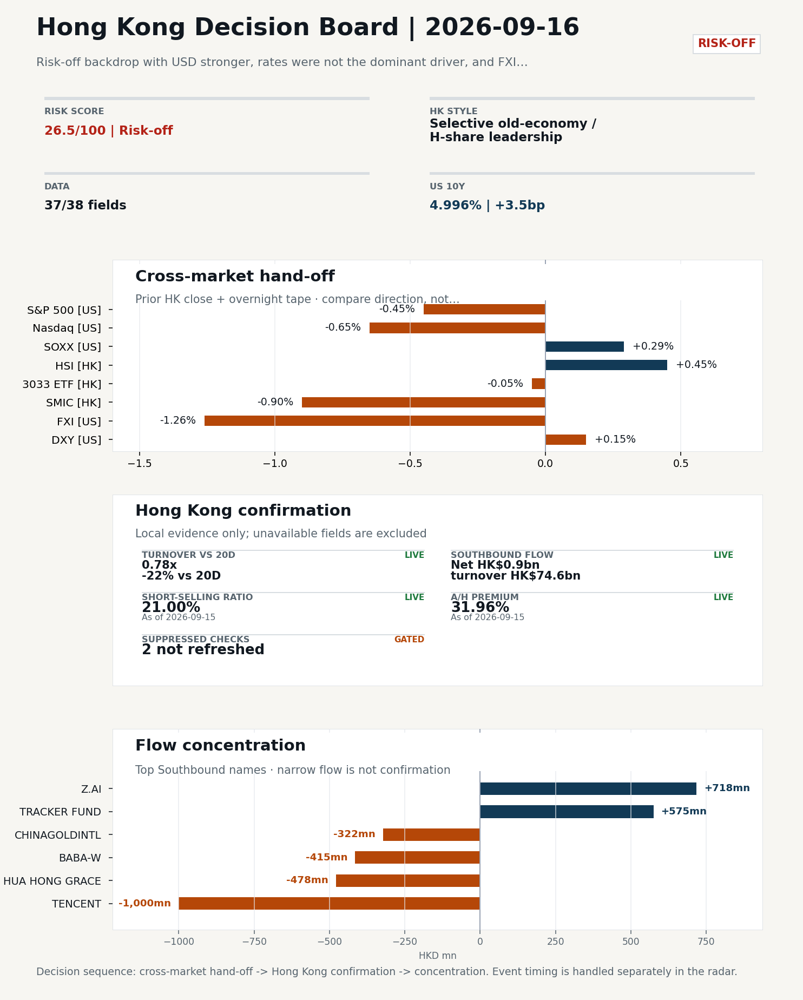
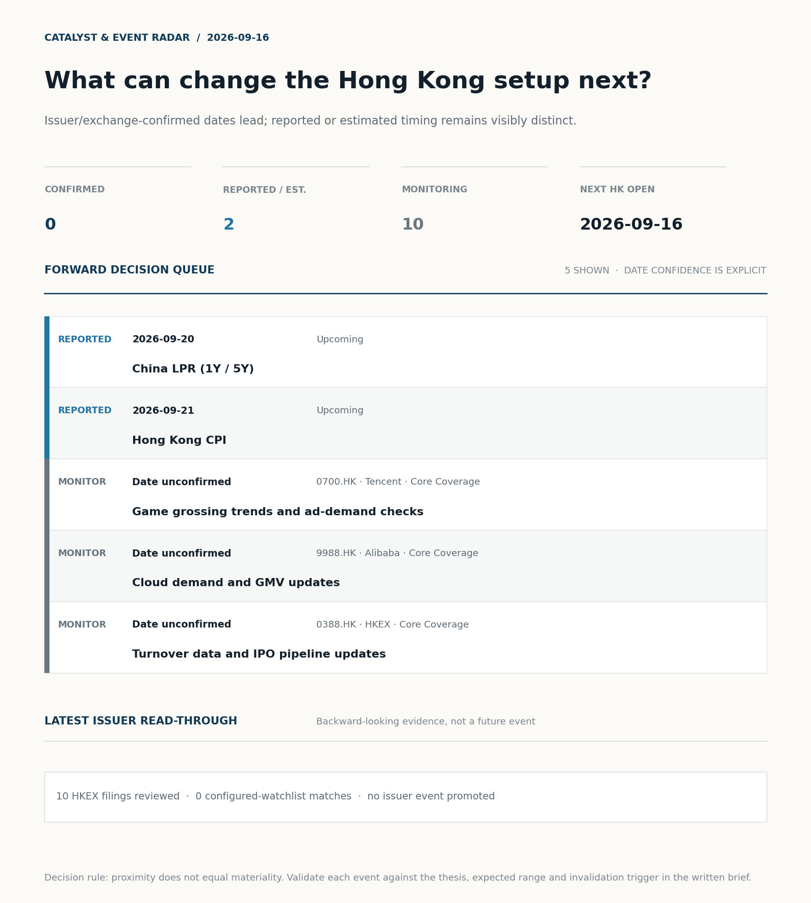
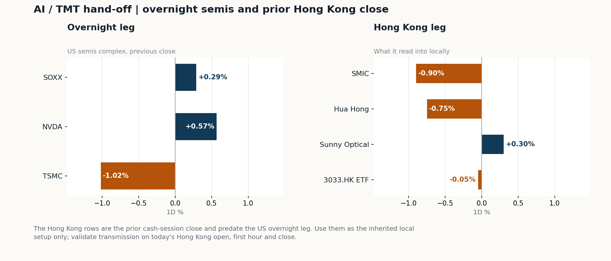
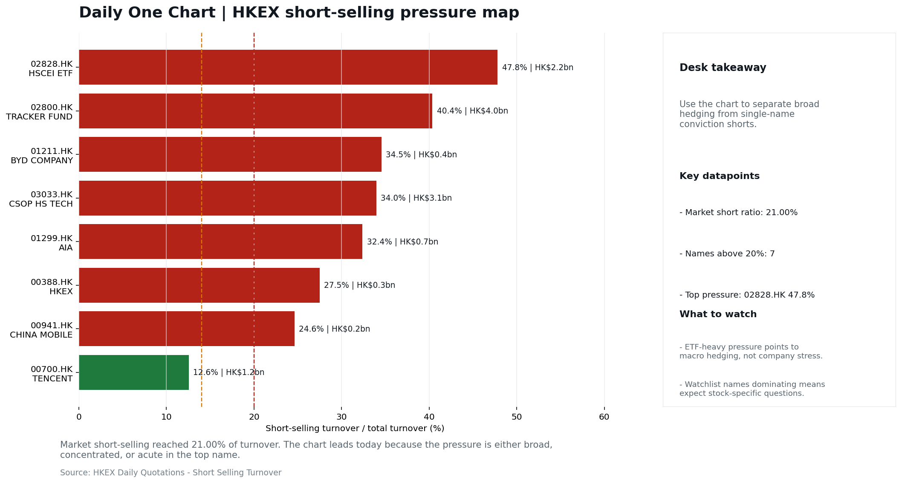

# Morning Research Workbench | 2026-09-16

> **Commute reading route:** `Layer 1 scan (5 min)` → `Layer 2 deep read` → `Layer 3 and appendix if time allows`
>
> Mode: `Trading Daily` | Keep the report execution-oriented: what mattered in the completed session, what can move Hong Kong leadership, and what needs fast follow-up.

_Data through: US/global `2026-09-15` | HK `2026-09-15` | A-share `2026-09-15` | Generated `2026-09-16 07:32:48`_

## Executive Summary

- **Did yesterday's call work?** UNRESOLVED - No comparable next close is available yet, so the call is still open.
- **What changed overnight?** Semis led lower: SOXX +0.29%, NVDA +0.57%, TSMC -1.02%. HSI +0.45% but 3033.HK -0.05%.
- **What it means for AI/TMT** Style, not beta - Selective old-economy / H-share leadership, a 0.51pp spread. Treat banks, energy, telecoms, and SOE yield as the cleaner relative expression; growth beta still needs proof.
- **What to watch today** Next scheduled catalyst: China LPR (1Y / 5Y) on 2026-09-20. Watch whether SMIC and Hua Hong trade with HSCEI rather than with the overnight semis leg.

## Layer 1 | Scan (5 min)

### 1.1 Yesterday's Call
**Verdict: UNRESOLVED.** No comparable next close is available yet, so the call is still open.

**Recent record.** 6 confirmed / 4 broken over the last 10 scoreable calls (60.0% hit rate). This is a directional close-to-close diagnostic, not a track record.

### 1.2 Opening Decision Board

**Global-to-Hong Kong signals**

_Decision-useful subset: each row states the implication and the next test. Descriptive secondary monitors are kept out of the five-minute scan._

| Signal | Last / move | Interpretation | Confirmation / invalidation |
| --- | --- | --- | --- |
| S&P 500 | 7,585.73 / -0.45% | Broad US risk fell without a clear driver in today's fields; treat it as beta, not a signal. | Watch whether Nasdaq and offshore-China proxies move the same way. |
| Nasdaq 100 | 28,937.84 / -0.65% | Growth lagged broad beta, warning that headline risk-on may not transmit cleanly to the 3033.HK ETF proxy. | 3033.HK versus HSI leadership carries the read; rising yields would undo it. |
| Hang Seng Index | 24,917.60 / +0.45% | The index was carried by old-economy and H-share names, not by broad participation: 3033.HK differs by 0.50pp. | Southbound participation decides whether this is investable or just a print. |
| Hang Seng TECH ETF (3033.HK) | 4.2360 / -0.05% | Hong Kong growth lagged, so broad-index strength is not yet a duration signal. | Needs a stable CNH and Southbound buying to become a duration signal. |
| Semiconductors (SOXX) | 498.85 / +0.29% | Semis led the Nasdaq by 0.94pp, putting the AI capex trade back in front. | SMIC and Hua Hong at the open show whether it transmits to Hong Kong. |
| US 10Y | 4.9960% / +3.5bp | The yield proxy rose, tightening the discount-rate backdrop for long-duration Hong Kong growth. | Read it through 3033.HK relative performance, not the index level. |
| USD/CNH | 6.6680 / -0.59% | A stronger offshore renminbi supports the external-risk backdrop for Hong Kong equities. | FXI and Southbound flow decide whether this reaches Hong Kong equities. |
| VIX | 17.20 / +0.58% | Higher implied volatility raises the tail-risk premium and weakens risk-on conviction. | Falling volatility on narrowing breadth is a warning, not support. |

_Secondary monitors retained in the source bundle: SMIC (0981.HK), CSI 300, China 10Y, CN-US 10Y spread, DXY, USD/HKD, Brent crude, COMEX gold, Copper._

**Hong Kong local confirmation**

_Coverage gate: 1 unavailable local checks are suppressed here and retained in validation metadata._

| Check | Value | Status | Source / as of | Why it matters |
| --- | --- | --- | --- | --- |
| Main Board turnover vs 20D | 0.78x \| -22% vs 20D | Live local | HKEX \| 2026-09-15 | Trailing 20-session average turnover was HK$239.4bn. |
| Southbound / Northbound net flow | Southbound Net HK$0.9bn \| turnover HK$74.6bn \| Northbound Turnover RMB229.7bn \| net not reported | Live local | HKEX Connect \| 2026-09-15 | Southbound net buy is calculated from HKEX disclosed buy and sell turnover. |
| Short-selling ratio | 21.00% | Live local | HKEX \| 2026-09-15 | Official HKEX stock-level short-selling table, aggregated as a share of total market turnover. |
| AH premium index | 31.96% | Live public | Yahoo \| 2026-09-15 | Equal-weighted average across 16 A/H pairs that resolved today. Composition varies by day, so the level is not comparable with prior reports (fixed basket incomplete: missing Bank of China, ICBC). [trimmed] |
| USD/HKD spot vs band | 7.8431 | Live quote | Yahoo \| 2026-09-15 | 69 pips from the weak-side CU (7.8500); monitor HKMA operations and the aggregate balance for a funding squeeze. |
| Hong Kong leadership | Selective old-economy / H-share leadership | Proxy | HSI / HSCEI / 3033.HK ETF relative \| 2026-09-15 | Use HSI / HSCEI / 3033.HK ETF relative moves as the opening style read. |

**Risk state and evidence**

**Composite risk score:** `26.5/100` | **Regime:** `Risk-off`

| Component | Score impact | Evidence |
| --- | --- | --- |
| US beta | -2.7 | S&P 500 -0.45% |
| HK growth ETF proxy | -0.2 | 3033.HK ETF -0.05% |
| Semis complex | +1.4 | SOXX +0.29% |
| Offshore China proxy | -6.3 | FXI -1.26% |
| Dollar pressure | -1.5 | DXY +0.15% |
| Volatility | -1.2 | VIX +0.58% |
| HK short-selling | -8 | Short-selling ratio 21.00% |
| HK turnover | -5 | Turnover 0.78x 20D |

_Base 50 plus the component deltas above. Semis complex entered the score on 2026-08-22; earlier scores in the ledger exclude it._

**Morning Checklist**

1. **Risk-off backdrop with USD stronger, rates were not the dominant driver, and FXI outperformed Nasdaq 100**
 Overnight regime | Start by deciding whether the day is about Risk-off conditions or a style pivot.
2. **China Aggregate Financing / New Loans (Past expected window (unverified))**
 Macro / policy | Credit expansion, domestic demand chains, and financials | Industries: Banks, Property chain, Infrastructure
3. **US CPI (Past expected window (unverified))**
 Macro / policy | Rates expectations, the dollar, and growth-equity valuation | Industries: Technology, Internet, Brokers
4. **China Activity Data (IP / Retail Sales / FAI) (Past expected window (unverified))**
 Macro / policy | Consumer resilience, growth expectations, and risk-asset pricing | Industries: Consumer, E-commerce, Consumer discretionary

## Visual Dashboard

**Catalyst & Event Radar**

**Chart read:** No issuer/exchange-confirmed event date is populated; 2 reported or estimated timing item(s) and 10 undated trigger(s) remain explicit.

_Source: Public calendars, issuer disclosures and configured research watchlists_
## Layer 2 | Core Research (20-30 min)

### 2.1 Global-to-Hong Kong Transmission
**Market Setup**
**Core tape.** Risk-off backdrop with USD stronger, rates were not the dominant driver, and FXI outperformed Nasdaq 100

**Key Drivers**
- Crude +3.98% intraday split the read.
- Prior-HK leadership was SOE / old-economy (HSCEI +0.46% vs 3033.HK -0.05%, spread -0.51pp) but conviction is limited by 0.78x turnover and a high 81st-pct 21.0% short-selling ratio.
- China-specific news mix is split: Goldman post-AI rotation into healthcare supports HK pharma/biotech.

**Hong Kong Read-Through**
**Opening implication.** For the 2026-09-16 HK session, expect a defensive / SOE-yield-led open consistent with prior-HK leadership.
_Hong Kong style leadership and flow confirmation are set out in the Hong Kong review below._

**Watch Points**
- USD composite moved higher by +0.19pct intraday, with a 0.198pct range.
- Main turning points appeared around 2026-09-15 08:05 trough / 2026-09-15 08:20 trough / 2026-09-15 08:35 peak, suggesting event-driven repricing rather than a clean one-way USD move.
- The biggest cross-asset divergence was FXI versus Nasdaq 100, a spread of 0.279pct.
- Gold moved -0.39pct intraday with a 1.066pct high-low range.

**Curated overnight stories**
1. **Goldman picks China healthcare stocks for a post-AI trade**
 Why it matters: Goldman's framing ties the highest China earnings growth in five years (per the supplied summary) to a rotation out of AI, directly reshaping the earnings and valuation…
 HK read-through: Likely supports HK healthcare and biotech leaders (innovative drug names) while applying relative pressure to crowded AI/semis longs.
2. **China's August retail sales miss forecast while investment slump deepens, piling**
 Why it matters: Soft consumption plus deepening FAI weakness, alongside Beijing's own warning of supply-demand imbalance, raises the probability of incremental policy support and reframes…
 HK read-through: Bearish read for HK consumer discretionary and e-commerce in the near term.
3. **AI stocks are rebounding. One analyst says there's no spending slowdown in sight**
 Why it matters: Multiyear chip and AI infra deal commentary underpins capex assumptions for the AI value chain, countering near-term slowdown narratives.
 HK read-through: Read-through to HK-listed semis and AI-exposed tech hardware; partially offsets any post-AI rotation headwinds implied by the Goldman healthcare call.
4. **Beijing-backed construction contractor on HK's five-year plan**
 Why it matters: Direct primary-source commentary from China State Construction International on HK's five-year plan and Greater Bay Area opportunities, framing project pipelines for…
 HK read-through: Most directly relevant to HK construction, infrastructure, and GBA-exposed property names; useful for same-session tape framing given the local-cash role of 2026-09-15.
5. **Bank of America expects Q3 investment banking fees to fall more than 10%; shares slide**
 Why it matters: Cap-markets weakness at a major US bank is a read-through to HK brokers and capital-markets revenue, particularly for names with HK/China IPO and ECM exposure.
 HK read-through: Mildly negative for HK brokers and securities names; secondary to the China-specific drivers but worth tracking given Hong Kong's reliance on ECM activity.

**AI / TMT hand-off**

**Overnight leg.** The overnight semis leg was flat (-0.05% average), so it does not set the direction for Hong Kong tech today.
**Hong Kong expression.** Let local flow and style leadership drive the tech read rather than the overnight tape.
**Observable test.** Watch whether SMIC and Hua Hong trade with HSCEI rather than with the overnight semis leg.

| Name | Role in the chain | 1D | Leg |
| --- | --- | --- | --- |
| SOXX | Semis complex | +0.29% | overnight |
| NVDA | AI capex narrative | +0.57% | overnight |
| TSMC | Foundry demand | -1.02% | overnight |
| SMIC | Leading-edge / domestic substitution | -0.90% | Hong Kong |
| Hua Hong | Mature-node pricing cycle | -0.75% | Hong Kong |
| Sunny Optical | Hardware and optics supply chain | +0.30% | Hong Kong |
| 3033.HK ETF | Broad HK tech beta | -0.05% | Hong Kong |

**Clock discipline.** The Hong Kong rows are the prior cash-session close and predate the US overnight leg. Use them as the inherited local setup only; validate transmission on today's Hong Kong open, first hour and close.

### 2.2 Hong Kong Local Tape and Flow
**Style and Local Leadership**
**Style call.** Selective old-economy / H-share leadership.
- **Evidence:** HSCEI beat 3033.HK by 0.51pp (+0.46% versus -0.05%)
- **Portfolio meaning:** Treat banks, energy, telecoms, and SOE yield as the cleaner relative expression; growth beta still needs proof.
- **Cross-market read:** Hang Seng +0.45% / HSCEI +0.46% / 3033.HK ETF -0.05%. Offshore China proxy FXI -1.26% and USD/CNH -0.59% frame cross-border risk appetite. USD/HKD last traded around 7.8431, which keeps the Hong Kong funding lens in focus.

**Flow Confirmation**
Official Stock Connect evidence is available; the Flow Tracker confirms whether local money supports the price action.

**Follow-Through Checklist**
**Follow-through check.** Confirmation test: for a defensive SOE call to hold, need 2828.HK or HSCEI to extend outperformance vs 3033.HK into the close, short-selling ratio to compress from 21.0%, and Southbound net-buy to stay positive (HK$0.9bn reference). Invalidation signal: 3033.HK retakes leadership on rising volume (above the 1.25x proxy ratio) with USD/CNH holding softer and HKMA liquidity / HIBOR data refreshing, since that would argue the overnight FXI weakness was a clean reversal rather than selective China pressure. CCASS holdings check on the highest stock-level short names (03074.HK 88.81%, 03188.HK 80.36%, 03466.HK 79.17%) is needed before treating any rebound as confirmed.
**Failure condition.** Invalidate if 3033.HK retakes leadership while CNH firms and local participation broadens.

**Cross-asset attribution**

| Driver | Direction | Score | Evidence | HK implication |
| --- | --- | --- | --- | --- |
| Short-selling pressure | drag | 4.2 | HKEX short-selling ratio was 21.00%. | Elevated short activity argues for extra confirmation before chasing rebounds. |
| Hong Kong participation | drag | 2.18 | Main Board turnover was 0.78x the 20-session average. | Thin turnover makes index moves easier to fade. |
| Oil and geopolitics | mixed | 2.06 | Oil moved +2.58%. | Split the read between energy/cyclicals support and margin/geopolitical pressure. |
| Dollar / CNH pressure | supportive | 0.89 | DXY +0.15% / USD-CNH -0.59% | A stable or softer CNH makes Hong Kong follow-through more credible. |

**Local flow evidence**

**Flow Takeaways**
- Short-selling pressure is elevated, so local rebounds need cleaner breadth and flow confirmation.
- Stock Connect Southbound: net HK$0.9bn on turnover HK$74.6bn (as of 2026-09-15).
- Stock Connect Northbound: turnover RMB229.7bn; public file provides total turnover/top active names, not full net-buy.
- AH premium: covered-pair average +31.96% over 16 pairs. Composition varies by day, so this level is not comparable with prior reports; widest premium: China Communications Construction 104.42%.

**Stock Connect Southbound Active Names**

| # | Ticker | Name | Buy | Sell | Net buy | HKEX turnover rank |
| --- | --- | --- | --- | --- | --- | --- |
| 1 | 00700.HK | TENCENT | HK$1,368.3mn | HK$2,368.4mn | HK$-1,000.1mn | 1 |
| 2 | 02513.HK | Z.AI | HK$2,375.8mn | HK$1,657.9mn | HK$717.9mn | 1 |
| 3 | 02800.HK | TRACKER FUND | HK$575.0mn | HK$0.2mn | HK$574.8mn | 9 |
| 4 | 01347.HK | HUA HONG GRACE | HK$354.5mn | HK$832.9mn | HK$-478.4mn | 7 |
| 5 | 09988.HK | BABA-W | HK$709.1mn | HK$1,124.0mn | HK$-414.9mn | 4 |

**AH Premium Dispersion**

| Name | A ticker | H ticker | Premium | As of |
| --- | --- | --- | --- | --- |
| China Communications Construction | 601800.SS | 1800.HK | +104.42% | 2026-09-15 |
| China Railway Construction | 601186.SS | 1186.HK | +58.87% | 2026-09-15 |
| China Life | 601628.SS | 2628.HK | +51.87% | 2026-09-15 |

**HKEX Short-Selling Watch**

| Ticker | Name | Short ratio | Short turnover | Total turnover |
| --- | --- | --- | --- | --- |
| 00388.HK | HKEX | 27.49% | HK$0.3bn | HK$1.2bn |
| 00700.HK | TENCENT | 12.55% | HK$1.2bn | HK$9.6bn |
| 00941.HK | CHINA MOBILE | 24.62% | HK$0.2bn | HK$0.6bn |

- **Short-value leaders:** 02800.HK TRACKER FUND (HK$4.0bn); 03033.HK CSOP HS TECH (HK$3.1bn); 02828.HK HSCEI ETF (HK$2.2bn); 07709.HK XL2CSOPHYNIX (HK$1.7bn).

### 2.3 Macro Transmission
**Desk read.** The macro agenda into the 16 September HK session is dominated by unresolved China prints.

**Market sensitivity.** If TSF and activity data come in firm, the read-through is constructive for H-share banks, property, and consumer discretionary; if soft, the credit-impulse channel points to downside risk for earnings revisions.

**HK implication.** The next concrete policy anchor is the 20 September China LPR fix, which under the HKMA peg is the cleanest test of easing intent and can directly reset HIBOR expectations.

**Macro watchpoints**
- Confirm the 15 September China activity data (IP/Retail Sales/FAI) and 12 September TSF release vs. consensus
- Watch the 20 September China LPR fix for any 1Y/5Y cut, which is the cleanest read on PBOC easing intent and feeds HIBOR via the peg.
- USD/CNH at 6.668: a break lower supports the FXI-relative-value trade; a bounce would re-strengthen the dollar headwind for HK tech.
- TSMC ADR at 413.75 (-1.02%): track for read-through to SMIC and Hua Hong at the HK open, given the direct foundry-demand channel.

| Time | Region | Event | Status | Desk read |
| --- | --- | --- | --- | --- |
| | CN | China Aggregate Financing / New Loans | Past expected window (unverified) | Impact: Credit expansion, domestic demand chains, and financials \| Attention: 5/5 \| Industries: Banks, Property chain, Infrastructure |
| | US | US CPI | Past expected window (unverified) | Impact: Rates expectations, the dollar, and growth-equity valuation \| Attention: 5/5 \| Industries: Technology, Internet, Brokers |
| | CN | China Activity Data (IP / Retail Sales / FAI) | Past expected window (unverified) | Impact: Consumer resilience, growth expectations, and risk-asset pricing \| Attention: 5/5 \| Industries: Consumer, E-commerce, Consumer discretionary |
| | CN | China LPR (1Y / 5Y) | Upcoming | Impact: Watch whether it changes the day's core market narrative \| Attention: 5/5 \| Industries: Market-wide |
| | HK | Hong Kong CPI | Upcoming | Impact: Local funding conditions, retail purchasing power, and HKD real rates \| Attention: 1/5 \| Industries: Property, Retail, Banks |

**Positioning and risk backdrop**

- Detailed local flow evidence is covered under Flow Tracker and Attribution; keep this section focused on options, hedging, and macro-positioning risk.

### 2.4 Company Micro Research and Catalysts

| Grade | Sector | Headline | Why it matters | Horizon |
| --- | --- | --- | --- | --- |
| A | Semiconductors and AI | Goldman picks China healthcare stocks for a post-AI trade | This can directly reshape earnings forecasts and the valuation framework | Short-term catalyst |
| B | Semiconductors and AI | AI stocks are rebounding. One analyst says there's no spending | Capital allocation or shareholder-return events can trigger a valuation | Medium-term trend |

**Company Event Takeaway**
**Desk read.** Risk-off session on 2026-09-15 with FXI outperforming Nasdaq 100.
**Why it matters.** No ratings actions were issued.
**Follow-up.** Earnings calendar is empty for the 16 September session; the nearest watchlist event is China Mobile on 20 October, followed by BYD on 29 October, leaving the tape driven by news flow rather than prints.

**LLM Quick Takes**
- **0700.HK** | Fact: closed +1.9% at HK$438.8, mid-range (34% of 60-session band). Headline attached flags Enflame's 84% revenue dependency on Tencent, which frames the compute-landlord thesis at the…
- **9988.HK** | Fact: closed +1.2% at HK$107.2, mid-range (46% of 60-session band). Two attached headlines: a comparative Alibaba-vs-Uber valuation piece and a state-media AI-slowdown critique alongside…
- **1211.HK** | Fact: closed -1.4% at HK$79.05, mid-range (29% of 60-session band). No attached headlines. Investor read: print is marginal; thesis unchanged. Next check…
- **1299.HK** | Fact: closed +0.8% at HK$76.05, mid-range (67% of 60-session band). No attached headlines. Investor read: no incremental information. Next check: NBV and agency productivity data points.

Decision filter<h4>No immediate portfolio catalyst: 10 official filings were screened and the low-signal market set stays aggregated.</h4>
10 profit warnings

<strong>10</strong>Official filings

<strong>0</strong>Watchlist hits

<strong>0</strong>Actionable events

<strong>No event cleared the portfolio decision filter.</strong>

Broad-market filings remain traceable in the source appendix; they are not expanded here without a watchlist, estimate or liquidity read-through.

<strong>Coverage boundary.</strong> sell-side rating changes, IPO / grey-market monitor were not decision-grade in this run; their absence is not treated as confirmation that no event exists.

**Core coverage requiring follow-up**

**Core coverage**

| Name | Ticker | Last | 1D | Range position | Morning note |
| --- | --- | --- | --- | --- | --- |
| Tencent | 0700.HK | 438.80 | +1.90% | Mid-range | Marginally higher (+1.90%), mid-range at 34% of its 60-session band. |
| Alibaba | 9988.HK | 107.20 | +1.23% | Mid-range | Marginally higher (+1.23%), mid-range at 46% of its 60-session band. |

**Recent headlines for Tencent:**
- [Enflame's 84% Revenue Dependency on Tencent Exposes the Compute Landlord Thesis at the Customer Level](https://finance.yahoo.com/technology/ai/articles/enflame-84-revenue-dependency-tencent-194023724.html) (Forkast News)
**Recent headlines for Alibaba:**
- [Alibaba vs. Uber Technologies: Which Consumer Stock Is a Better Buy in 2026?](https://www.fool.com/coverage/better-buy/2026/09/15/alibaba-vs-uber-technologies-which-consumer-stock-is-a-better-buy-in-2026/) (Motley Fool)

**Priority follow-up**

| Name | Ticker | Last | 1D | Range position | Morning note |
| --- | --- | --- | --- | --- | --- |
| BYD Company | 1211.HK | 79.05 | -1.43% | Mid-range | Marginally lower (-1.43%), mid-range at 29% of its 60-session band. |
| AIA | 1299.HK | 76.05 | +0.80% | Mid-range | Marginally higher (+0.80%), mid-range at 67% of its 60-session band. |

### 2.5 Morning Meeting Questions
No divergence, tail reading or coverage gap stood out today, so there is no obvious follow-up question beyond the base case above.

## Layer 3 | Session Playbook (8-12 min)

### 3.1 Base Case and Scenario Map
**Starting posture.** Selective old-economy / H-share leadership (medium confidence); composite risk `26.5/100` (Risk-off). Treat banks, energy, telecoms, and SOE yield as the cleaner relative expression; growth beta still needs proof.

**Scenario map**

| Scenario | Observable trigger | Interpretation | Research response |
| --- | --- | --- | --- |
| Selective growth confirms | 3033.HK keeps a >0.5pp first-hour lead over HSCEI; SMIC and Hua Hong stop lagging broad beta; CNH is stable. | The prior style split has live price confirmation, but is not yet broad China risk-on. | Prioritize internet/platform relative strength; verify participation again at the close. |
| Broad beta takes over | HSI and HSCEI rise together, breadth improves and the 3033.HK lead narrows without turning negative. | Leadership is broadening from a style trade into market beta. | Expand the research set from growth leaders to financials, SOEs and index-heavy names. |
| Risk-off continuation | 3033.HK loses its lead, semis underperform HSCEI and CNH depreciation accelerates. | The prior divergence was a temporary pocket of strength rather than a durable hand-off. | Treat rebounds as unconfirmed; focus on balance-sheet, catalyst and crowding risk. |

**Clocked validation scorecard**

| Window | Check | Prior evidence | Pass condition | What it decides |
| --- | --- | --- | --- | --- |
| 09:30-10:30 | 3033.HK vs HSCEI | -0.51pp at the prior close | 3033.HK retains >0.5pp relative lead | Whether growth leadership survives the open |
| 09:30-10:30 | Semiconductor hand-off | SMIC -0.90%; Hua Hong Semiconductor -0.75% | Stabilise after the open; at least one stops underperforming HSCEI | Whether overnight semis pressure is contained locally |
| 09:30-10:30 | HSI price zone | 24,918 vs 24,500 / 25,000 reference grid | Hold above the lower grid or reclaim the upper grid with breadth | Whether broad beta is stabilising; grid is derived, not technical analysis |
| 09:30-10:30 | USD/CNH | 6.668 \| -0.59% | No acceleration in CNH depreciation | Whether FX permits a clean Hong Kong risk extension |
| At close | Turnover | 0.78x \| -22% vs 20D | At least 1.0x the 20-session average | Whether the move had normal participation |
| At close | Southbound | Net HK$0.9bn \| turnover HK$74.6bn | Net buying remains positive and broadens beyond one or two names | Whether mainland money confirms the price move |
| At close | Short pressure | 21.00% | Falls versus the prior verified reading (21.00%) | Whether rebound conviction improved |

**Upgrade rule.** Confirm if HSCEI keeps outperforming 3033.HK with healthy turnover and broad Southbound participation.
**Kill switch.** Invalidate if 3033.HK retakes leadership while CNH firms and local participation broadens.
**Clock discipline.** At 07:30, same-day Southbound, turnover and short-selling outcomes are not known. Use the first-hour price/FX checks provisionally and make the final classification only after the close.
**Event clock.** No same-day decision-grade item is populated; the nearest reported/estimated item is China LPR (1Y / 5Y) on 2026-09-20. Verify the issuer or official calendar before relying on the date.

### 3.2 Daily One Chart
**Daily One Chart | HKEX short-selling pressure map**

**Chart read.** Market short-selling reached 21.00% of turnover.
**Why it matters.** The chart leads today because the pressure is either broad, concentrated, or acute in the top name.

_Source: HKEX Daily Quotations - Short Selling Turnover_

## Optional Appendix | Traceability and Performance (10-15 min)

### Report Metadata
> Date policy: Review date 2026-09-15 is treated as `Trading Daily`. | Global (US/Europe) data date is 2026-09-15; adapter effective date is 2026-09-15 and summary date is 2026-09-15. | Hong Kong local data date is 2026-09-15; role: same-session local cash tape.
> Market data quality: Coverage: `37/38` | Missing: `1`
> Report quality: `91.4/100` | Grade `A` | Status `usable with caveats`

### Report Quality and Validation
- **Quality score:** 91.4/100 | **Grade:** A | **Status:** usable with caveats
- **Run summary:** 8 healthy | 2 caveat | 0 failed
- **Release recommendation:** Send with caveats | The report is usable, but the advisory guidance should travel with it so readers understand the data gaps.

| Source | Status | Bucket |
| --- | --- | --- |
| Macro calendar | partial | caveat |
| Risk and sentiment feed | partial | caveat |

**Desk-use guidance summary:** 0 blocking | 1 advisory

**Desk-use guidance**
- **Advisory:** Questionable narrative fields were removed; use the deterministic fallback copy and review the audit trail.

| Weak component | Score | Read |
| --- | --- | --- |
| Hong Kong local metrics | 54.1 | 5 live, 3 proxy, 3 unavailable local checks. |

**Quality warnings**
- Hong Kong local metrics is weak: 5 live, 3 proxy, 3 unavailable local checks.
- Narrative fact-check guardrail produced warnings; review the validation table before relying on narrative sections.

**Narrative fact-check guardrail**
- Checked 15 numeric claims; 0 numeric mismatch(es), 0 logic warning(s); 13 structured claims, 0 source/text warning(s); 0 critical, 0 review. Replaced 6 unsafe narrative field(s) with deterministic fallback copy.
- **Deterministic fallback fields:** deep_read_setup, hk_review_setup, overnight_drivers[0], tasks.hk_review.paragraph, tasks.overnight_review.drivers[0], tasks.overnight_review.paragraph

_Full component weights, per-source freshness, adapter status and provenance records are archived with this report under `audit/` rather than printed here._

### Historical Signal Performance
- **Readiness:** exploratory with caveats | 69 observations | 101 active signal dates | next-close entry, 10bps cost, no same-day returns.
- **Interpretation boundary:** exploratory until a benchmark reaches 252 sessions and 100 active-signal sessions.
- **Data-quality caveat:** 23 conflicting price revision(s) and 6 non-session observation(s) remain in the research ledger.
- **Daily-use boundary:** cumulative return, Sharpe and the performance chart stay out of the daily commute edition until the sample and trading-calendar gates pass; use Yesterday's Call instead.

### Source Links
- [Goldman picks China healthcare stocks for a post-AI trade](https://www.cnbc.com/2026/09/13/goldman-picks-china-healthcare-stocks-for-a-post-ai-trade.html) (cnbc_markets)
- [AI stocks are rebounding. One analyst says there's no spending slowdown in sight.](https://www.marketwatch.com/story/ai-stocks-are-rebounding-one-analyst-says-theres-no-spending-slowdown-in-sight-8fd99c4b?mod=mw_rss_topstories) (wsj_markets)
- [Enflame's 84% Revenue Dependency on Tencent Exposes the Compute Landlord Thesis at the Customer Level](https://finance.yahoo.com/technology/ai/articles/enflame-84-revenue-dependency-tencent-194023724.html) (Forkast News)
- [Alibaba vs. Uber Technologies: Which Consumer Stock Is a Better Buy in 2026?](https://www.fool.com/coverage/better-buy/2026/09/15/alibaba-vs-uber-technologies-which-consumer-stock-is-a-better-buy-in-2026/) (Motley Fool)
- [China's State Media Calls AI Slowdown a "Cold War" Tactic. Z.AI Is Raising $5 Billion to Do the Opposite](https://finance.yahoo.com/technology/ai/articles/china-state-media-calls-ai-212953858.html) (Insider Monkey)
- [Meituan (MPNGF) (Q2 2026) Earnings Call Highlights: Record Revenue and Strategic AI Pivot Drive...](https://finance.yahoo.com/markets/stocks/articles/meituan-mpngf-q2-2026-earnings-190123345.html) (GuruFocus.com)
- [Meituan Returns to Profit as Food-Delivery Competition Eases](https://www.wsj.com/business/earnings/meituan-returns-to-profit-as-food-delivery-competition-eases-1026a0e9?siteid=yhoof2&yptr=yahoo) (The Wall Street Journal)
- [China Mobile (SEHK:941): A Closer Look at Valuation After Steady Share Price Gains This Year](https://finance.yahoo.com/news/china-mobile-sehk-941-closer-154022664.html) (Simply Wall St.)
- [00092.HK Profit warning / alert announcement](http://www1.hkexnews.hk/listedco/listconews/sehk/2026/0915/2026091501445.pdf) (HKEXnews)
- [01059.HK Profit warning / alert announcement](http://www1.hkexnews.hk/listedco/listconews/sehk/2026/0915/2026091501403.pdf) (HKEXnews)
- [01903.HK Profit warning / alert announcement](http://www1.hkexnews.hk/listedco/listconews/sehk/2026/0915/2026091500893.pdf) (HKEXnews)
- [08645.HK Profit warning / alert announcement](http://www1.hkexnews.hk/listedco/listconews/gem/2026/0915/2026091501363.pdf) (HKEXnews)
- [00862.HK Profit warning / alert announcement](http://www1.hkexnews.hk/listedco/listconews/sehk/2026/0914/2026091400428.pdf) (HKEXnews)
- [09998.HK Profit warning / alert announcement](http://www1.hkexnews.hk/listedco/listconews/sehk/2026/0914/2026091400877.pdf) (HKEXnews)
- [01023.HK Profit warning / alert announcement](http://www1.hkexnews.hk/listedco/listconews/sehk/2026/0911/2026091100569.pdf) (HKEXnews)
