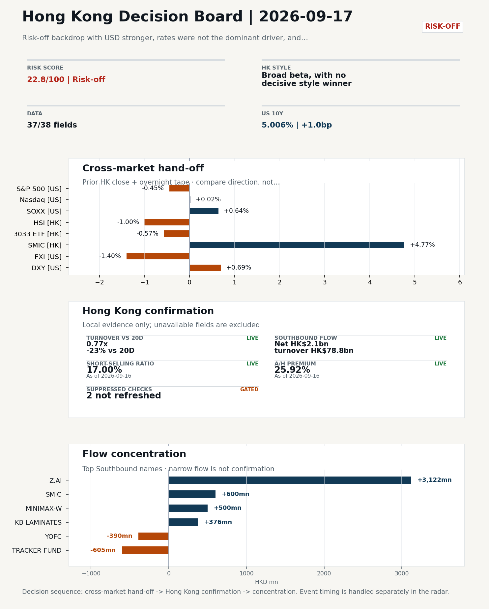
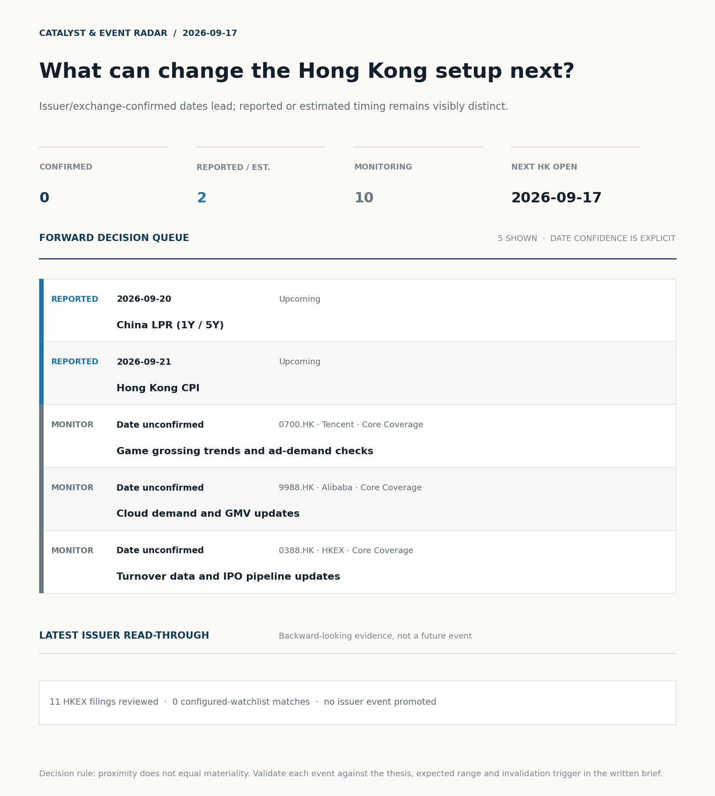
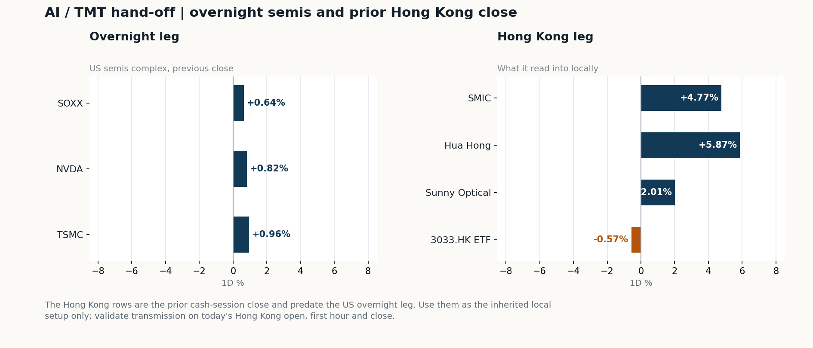
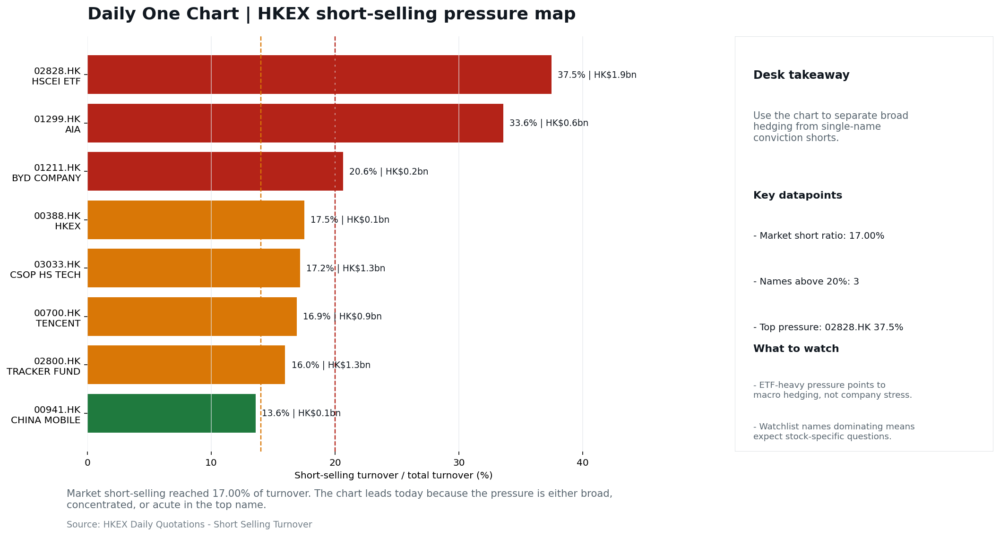

# Morning Research Workbench | 2026-09-17

> **Commute reading route:** `Layer 1 scan (5 min)` → `Layer 2 deep read` → `Layer 3 and appendix if time allows`
>
> Mode: `Trading Daily` | Keep the report execution-oriented: what mattered in the completed session, what can move Hong Kong leadership, and what needs fast follow-up.

_Data through: US/global `2026-09-16` | HK `2026-09-16` | A-share `2026-09-16` | Generated `2026-09-17 07:40:43`_

## Executive Summary

- **Did yesterday's call work?** UNRESOLVED - No comparable next close is available yet, so the call is still open.
- **What changed overnight?** Semis led higher: SOXX +0.64%, NVDA +0.82%, TSMC +0.96%. HSI -1.00% and 3033.HK -0.57%.
- **What it means for AI/TMT** No decisive style winner - Broad beta, with no decisive style winner, a 0.39pp spread. Avoid forcing a growth-versus-value call; let volume, Southbound concentration, and the first-hour relative tape identify leadership.
- **What to watch today** Next scheduled catalyst: China LPR (1Y / 5Y) on 2026-09-20. Confirm if SMIC and Hua Hong open in the same direction as the overnight leg and hold it through the first hour; invalidate if they track HSCEI instead.

## Layer 1 | Scan (5 min)

### 1.1 Yesterday's Call
**Verdict: UNRESOLVED.** No comparable next close is available yet, so the call is still open.

**Recent record.** 6 confirmed / 4 broken over the last 10 scoreable calls (60.0% hit rate). This is a directional close-to-close diagnostic, not a track record.

### 1.2 Opening Decision Board

**Global-to-Hong Kong signals**

_Decision-useful subset: each row states the implication and the next test. Descriptive secondary monitors are kept out of the five-minute scan._

| Signal | Last / move | Interpretation | Confirmation / invalidation |
| --- | --- | --- | --- |
| S&P 500 | 7,551.81 / -0.45% | Broad US risk fell without a clear driver in today's fields; treat it as beta, not a signal. | Watch whether Nasdaq and offshore-China proxies move the same way. |
| Nasdaq 100 | 28,945.06 / +0.02% | Growth outperformed broad beta, a supportive style signal for Hong Kong internet and platform names. | 3033.HK versus HSI leadership carries the read; rising yields would undo it. |
| Hang Seng Index | 24,667.24 / -1.00% | Broad beta fell helped by a firmer offshore renminbi, with growth and value moving together. | Southbound participation decides whether this is investable or just a print. |
| Hang Seng TECH ETF (3033.HK) | 4.2120 / -0.57% | Hong Kong growth led broad beta, improving the platform/internet style signal. | Needs a stable CNH and Southbound buying to become a duration signal. |
| Semiconductors (SOXX) | 502.06 / +0.64% | Semis led the Nasdaq by 0.62pp, putting the AI capex trade back in front. | SMIC and Hua Hong at the open show whether it transmits to Hong Kong. |
| US 10Y | 5.0060% / +1.0bp | The yield proxy rose, tightening the discount-rate backdrop for long-duration Hong Kong growth. | Read it through 3033.HK relative performance, not the index level. |
| USD/CNH | 6.6690 / -0.57% | A stronger offshore renminbi supports the external-risk backdrop for Hong Kong equities. | FXI and Southbound flow decide whether this reaches Hong Kong equities. |
| VIX | 17.71 / **+2.97%** | Higher implied volatility raises the tail-risk premium and weakens risk-on conviction. | Falling volatility on narrowing breadth is a warning, not support. |

_Secondary monitors retained in the source bundle: SMIC (0981.HK), CSI 300, China 10Y, CN-US 10Y spread, DXY, USD/HKD, Brent crude, COMEX gold, Copper._

**Hong Kong local confirmation**

_Coverage gate: 1 unavailable local checks are suppressed here and retained in validation metadata._

| Check | Value | Status | Source / as of | Why it matters |
| --- | --- | --- | --- | --- |
| Main Board turnover vs 20D | 0.77x \| -23% vs 20D | Live local | HKEX \| 2026-09-16 | Trailing 20-session average turnover was HK$235.9bn. |
| Southbound / Northbound net flow | Southbound Net HK$2.1bn \| turnover HK$78.8bn \| Northbound Turnover RMB264.2bn \| net not reported | Live local | HKEX Connect \| 2026-09-16 | Southbound net buy is calculated from HKEX disclosed buy and sell turnover. |
| Short-selling ratio | 17.00% | Live local | HKEX \| 2026-09-16 | Official HKEX stock-level short-selling table, aggregated as a share of total market turnover. |
| AH premium index | 25.92% | Live public | Yahoo \| 2026-09-16 | Fixed 10-name basket, equal-weighted, both legs priced on the same date; comparable across dates. Covered-pair average was +28.17% across 18 pairs. |
| USD/HKD spot vs band | 7.8445 | Live quote | Yahoo \| 2026-09-16 | 55 pips from the weak-side CU (7.8500); monitor HKMA operations and the aggregate balance for a funding squeeze. |
| Hong Kong leadership | Broad beta, with no decisive style winner | Proxy | HSI / HSCEI / 3033.HK ETF relative \| 2026-09-16 | Use HSI / HSCEI / 3033.HK ETF relative moves as the opening style read. |

**Risk state and evidence**

**Composite risk score:** `22.8/100` | **Regime:** `Risk-off`

| Component | Score impact | Evidence |
| --- | --- | --- |
| US beta | -2.7 | S&P 500 -0.45% |
| HK growth ETF proxy | -2.8 | 3033.HK ETF -0.57% |
| Semis complex | +3.2 | SOXX +0.64% |
| Offshore China proxy | -7.0 | FXI -1.40% |
| Dollar pressure | -6.9 | DXY +0.69% |
| Volatility | -5.9 | VIX +2.97% |
| HK short-selling | +0 | Short-selling ratio 17.00% |
| HK turnover | -5 | Turnover 0.77x 20D |

_Base 50 plus the component deltas above. Semis complex entered the score on 2026-08-22; earlier scores in the ledger exclude it._

**Morning Checklist**

1. **Risk-off backdrop with USD stronger, rates were not the dominant driver, and Nasdaq 100 outperformed FXI**
 Overnight regime | Start by deciding whether the day is about Risk-off conditions or a style pivot.
2. **China Activity Data (IP / Retail Sales / FAI) (Past expected window (unverified))**
 Macro / policy | Consumer resilience, growth expectations, and risk-asset pricing | Industries: Consumer, E-commerce, Consumer discretionary
3. **China LPR (1Y / 5Y) (Upcoming)**
 Macro / policy | Watch whether it changes the day's core market narrative | Industries: Market-wide
4. **[A] Goldman picks China healthcare stocks for a post-AI trade**
 News / announcements | This can directly reshape earnings forecasts and the valuation framework

## Visual Dashboard

**Catalyst & Event Radar**

**Chart read:** No issuer/exchange-confirmed event date is populated; 2 reported or estimated timing item(s) and 10 undated trigger(s) remain explicit.

_Source: Public calendars, issuer disclosures and configured research watchlists_
## Layer 2 | Core Research (20-30 min)

### 2.1 Global-to-Hong Kong Transmission
**Market Setup**
**Core tape.** Overnight US trade was risk-off but uneven across styles: the S&P 500 slipped 0.45% while the Nasdaq 100 was essentially flat at +0.02%, leaving Nasdaq 100 as the clear outperformer versus offshore China where FXI fell 1.40%.
**Main driver.** The dominant driver was a hawkish Fed action (a rate hike plus one more signaled) that pushed DXY up 0.69% and lifted VIX 2.97%, rather than rates or oil themselves.
**HK relevance.** Hong Kong's prior-session tape (HSI -1.00%, HSCEI -0.96%, 3033.HK -0.57%) was a balanced broad-beta session on light 0.77x turnover, with FXI confirming the prior-HK direction overnight.

**Key Drivers**
- Fed approves a rate hike and signals one more, pushing DXY +0.69% and VIX +2.97%.
- Soft China August retail sales and a deepening investment slump raise the odds of incremental China stimulus but pressure HK consumer, e-commerce, and property exposure; Goldman flags China healthcare as a post-AI rotation idea.
- Offshore China proxy FXI -1.40% confirms the prior HSI -1.00% direction.
- SOXX +0.64%, NVDA +0.82%, and TSMC +0.96% kept the US semis complex green even as Nasdaq 100 was flat.

**Hong Kong Read-Through**
**Opening implication.** Expect today's HK open (2026-09-17) to lean defensive given the stronger USD and weaker offshore China beta, but semis names (SMIC, Hua Hong) and potentially healthcare may offset pressure on internet and consumer discretionary.
_Hong Kong style leadership and flow confirmation are set out in the Hong Kong review below._

**Watch Points**
- USD composite moved higher by +0.69pct intraday, with a 0.787pct range.
- Main turning points appeared around 2026-09-16 08:05 peak / 2026-09-16 08:50 peak / 2026-09-16 09:05 peak, suggesting event-driven repricing rather than a clean one-way USD move.
- The biggest cross-asset divergence was Nasdaq 100 versus FXI, a spread of 0.125pct.
- Gold moved -1.36pct intraday with a 2.571pct high-low range.

**Curated overnight stories**
1. **Fed approves interest rate hike, signals one more to come this year**
 Why it matters: A confirmed hike plus an additional one signaled reframes the global rates path; USD strength and tighter financial conditions are now the dominant macro input.
 HK read-through: Negative for Hong Kong offshore China beta (FXI already underperformed Nasdaq 100); pressures internet, property, and consumer discretionary; supports defensive cash flow.
2. **China's August retail sales miss forecast while investment slump deepens, piling**
 Why it matters: Soft consumption and a deepening investment slump raise the probability of further policy support; industrial output beat alone is unlikely to offset demand-side weakness.
 HK read-through: Direct read-across to HK consumer discretionary, e-commerce, and property. Increases the odds of incremental China stimulus.
3. **Goldman picks China healthcare stocks for a post-AI trade**
 Why it matters: Goldman-cited earnings growth at the highest pace in five years provides a fresh institutional anchor for China healthcare as a post-AI rotation idea.
 HK read-through: Most relevant for HK-listed Chinese healthcare and biotech names.
4. **China's AI leaders keep quiet despite U.S. 'publicity' on tech risks**
 Why it matters: Silence from Z.ai, Moonshot, Alibaba, Tencent and others on AI risk warnings keeps the narrative elevated but does not yet change the underlying AI capex/competition story.
 HK read-through: Keeps China internet/AI in a 'monitor' bucket rather than a catalyst bucket; limited incremental price action expected but sustains headline risk for the AI-linked cohort.
5. **Bank of America expects third-quarter investment banking fees to fall more than 10%**
 Why it matters: Confirms that the China/HK deal pipeline remains weak into 3Q, an execution check on the 'capital-markets reopening' thesis.
 HK read-through: Modestly negative for HK-listed Chinese brokers and investment-banking-exposed names; reinforces a slower IPO/secondary issuance backdrop into year-end.

**AI / TMT hand-off**

**Overnight leg.** The overnight semis leg was risk-on at +0.81% average (SOXX +0.64%, NVDA +0.82%, TSMC +0.96%).
**Hong Kong expression.** SMIC, Hua Hong and Sunny Optical are best placed at the open, and 3033.HK should be tested before the Hang Seng Index.
**Observable test.** Confirm if SMIC and Hua Hong open in the same direction as the overnight leg and hold it through the first hour; invalidate if they track HSCEI instead, which would mean local flow is overriding the global cycle.

| Name | Role in the chain | 1D | Leg |
| --- | --- | --- | --- |
| SOXX | Semis complex | +0.64% | overnight |
| NVDA | AI capex narrative | +0.82% | overnight |
| TSMC | Foundry demand | +0.96% | overnight |
| SMIC | Leading-edge / domestic substitution | +4.77% | Hong Kong |
| Hua Hong | Mature-node pricing cycle | +5.87% | Hong Kong |
| Sunny Optical | Hardware and optics supply chain | +2.01% | Hong Kong |
| 3033.HK ETF | Broad HK tech beta | -0.57% | Hong Kong |

**Clock discipline.** The Hong Kong rows are the prior cash-session close and predate the US overnight leg. Use them as the inherited local setup only; validate transmission on today's Hong Kong open, first hour and close.

### 2.2 Hong Kong Local Tape and Flow
**Local Tape Setup**
**Local read.** Hong Kong opens into a risk-off tape driven by a hawkish Fed action and a stronger USD (DXY +0.69%), with offshore China proxy FXI down 1.40% confirming the prior HSI -1.00% direction rather than reversing it.
**Verification point.** Local conditions remain thin at 0.77x 20-day turnover and short-selling at 17.00% of turnover, so any style call needs confirmation from breadth, not just overnight leaders.
**Risk to watch.** The semis complex is the clearest cross-market positive, with SMIC +4.77% and Hua Hong +5.87% echoing SOXX +0.64% and TSMC +0.96% overnight.

**Style and Local Leadership**
**Style call.** Broad beta, with no decisive style winner.
- **Evidence:** 3033.HK and HSCEI were separated by only 0.39pp (-0.57% versus -0.96%)
- **Portfolio meaning:** Avoid forcing a growth-versus-value call; let volume, Southbound concentration, and the first-hour relative tape identify leadership.
- **Cross-market read:** Hang Seng -1.00% / HSCEI -0.96% / 3033.HK ETF -0.57%. Offshore China proxy FXI -1.40% and USD/CNH -0.57% frame cross-border risk appetite. USD/HKD last traded around 7.8445, which keeps the Hong Kong funding lens in focus.

**Flow Confirmation**
Official Stock Connect evidence is available; the Flow Tracker confirms whether local money supports the price action.

**Follow-Through Checklist**
**Follow-through check.** Watch whether turnover recovers above 1.0x 20D, whether 3033.HK versus HSCEI opens a sustained 0.5pp relative split, and whether USD/HKD pushes toward 7.8500 as the funding-side tell.
**Failure condition.** Reclassify the tape when either 3033.HK or HSCEI opens a sustained 0.5pp relative lead with flow confirmation.

**Cross-asset attribution**

| Driver | Direction | Score | Evidence | HK implication |
| --- | --- | --- | --- | --- |
| Oil and geopolitics | supportive | 2.33 | Oil moved -2.91%. | Split the read between energy/cyclicals support and margin/geopolitical pressure. |
| Hong Kong participation | drag | 2.32 | Main Board turnover was 0.77x the 20-session average. | Thin turnover makes index moves easier to fade. |
| Dollar / CNH pressure | drag | 1.03 | DXY +0.69% / USD-CNH -0.57% | A stable or softer CNH makes Hong Kong follow-through more credible. |

**Local flow evidence**

**Flow Takeaways**
- Turnover is light versus the 20-session baseline, so local moves have weaker conviction.
- Stock Connect Southbound: net HK$2.1bn on turnover HK$78.8bn (as of 2026-09-16).
- Stock Connect Northbound: turnover RMB264.2bn; public file provides total turnover/top active names, not full net-buy.
- AH premium: fixed 10-name basket +25.92% (comparable across dates); covered-pair average +28.17% over 18 pairs; widest premium: China Communications Construction 97.06%.

**Stock Connect Southbound Active Names**

| # | Ticker | Name | Buy | Sell | Net buy | HKEX turnover rank |
| --- | --- | --- | --- | --- | --- | --- |
| 1 | 02513.HK | Z.AI | HK$5,509.2mn | HK$2,387.4mn | HK$3,121.8mn | 1 |
| 2 | 02800.HK | TRACKER FUND | HK$0.1mn | HK$604.7mn | HK$-604.6mn | 6 |
| 3 | 00981.HK | SMIC | HK$1,780.0mn | HK$1,179.7mn | HK$600.3mn | 3 |
| 4 | 00100.HK | MINIMAX-W | HK$1,650.2mn | HK$1,150.6mn | HK$499.6mn | 3 |
| 5 | 06869.HK | YOFC | HK$1,478.6mn | HK$1,868.6mn | HK$-390.1mn | 2 |

**AH Premium Dispersion**

| Name | A ticker | H ticker | Premium | As of |
| --- | --- | --- | --- | --- |
| China Communications Construction | 601800.SS | 1800.HK | +97.06% | 2026-09-16 |
| China Railway Construction | 601186.SS | 1186.HK | +57.94% | 2026-09-16 |
| China Life | 601628.SS | 2628.HK | +52.55% | 2026-09-16 |

**HKEX Short-Selling Watch**

| Ticker | Name | Short ratio | Short turnover | Total turnover |
| --- | --- | --- | --- | --- |
| 00388.HK | HKEX | 17.53% | HK$0.1bn | HK$0.8bn |
| 00700.HK | TENCENT | 16.90% | HK$0.9bn | HK$5.5bn |
| 00941.HK | CHINA MOBILE | 13.60% | HK$0.1bn | HK$0.6bn |

- **Short-value leaders:** 02828.HK HSCEI ETF (HK$1.9bn); 03750.HK CATL (HK$1.6bn); 02800.HK TRACKER FUND (HK$1.3bn); 03033.HK CSOP HS TECH (HK$1.3bn).

### 2.3 Macro Transmission
**Desk read.** Today's Hong Kong tape opens into a risk-off global backdrop where USD strength, not rates, has been the dominant driver, and Nasdaq 100 has outperformed FXI - a pattern that argues against broad Hong Kong leadership extending at the open.

**Market sensitivity.** The near-term macro agenda is light on confirmed prints.

**HK implication.** The next high-conviction domestic catalyst is the 20 Sep China LPR fix, which sets the cleanest signal on easing intent and frames the rates leg of the H-share valuation argument.

**Macro watchpoints**
- Whether the 16 Sep China activity data print (IP / Retail / FAI) is confirmed and how it revises consumer-discretionary and e-commerce
- China LPR on 20 Sep - a cut would extend the policy-easing narrative and support H-share valuations
- TSMC ADR and NVDA overnight tone into the HK open as the most direct read on Hong Kong tech leadership versus FXI.
- VIX and WTI follow-through: a continued VIX rise plus further crude weakness would reinforce the risk-off tilt and argue for defensive

| Time | Region | Event | Status | Desk read |
| --- | --- | --- | --- | --- |
| | CN | China Activity Data (IP / Retail Sales / FAI) | Past expected window (unverified) | Impact: Consumer resilience, growth expectations, and risk-asset pricing \| Attention: 5/5 \| Industries: Consumer, E-commerce, Consumer discretionary |
| | CN | China LPR (1Y / 5Y) | Upcoming | Impact: Watch whether it changes the day's core market narrative \| Attention: 5/5 \| Industries: Market-wide |
| | HK | Hong Kong CPI | Upcoming | Impact: Local funding conditions, retail purchasing power, and HKD real rates \| Attention: 1/5 \| Industries: Property, Retail, Banks |

**Positioning and risk backdrop**

- Detailed local flow evidence is covered under Flow Tracker and Attribution; keep this section focused on options, hedging, and macro-positioning risk.

### 2.4 Company Micro Research and Catalysts

| Grade | Sector | Headline | Why it matters | Horizon |
| --- | --- | --- | --- | --- |
| A | Semiconductors and AI | Goldman picks China healthcare stocks for a post-AI trade | This can directly reshape earnings forecasts and the valuation framework | Short-term catalyst |
| B | China Internet | China's AI leaders keep quiet despite U.S. 'publicity' on tech risks | Assess whether the story can propagate through the China Internet value | Monitor |

**Company Event Takeaway**
**Desk read.** Reviewing the 2026-09-16 session: no portfolio-relevant results or rating actions were delivered, so estimate or thesis changes are not warranted on this brief.
**Why it matters.** The HKEX tape carried eight small-cap profit warnings, all graded C with headline-only parsing; none are on the watchlist, so aggregate read-through is preferred over individual write-ups.
**Follow-up.** On the news side, the Goldman note flagging Chinese earnings growth at a five-year high carries the most weight and should be mapped into internet and AI compute names.

**LLM Quick Takes**
- **0700.HK** | Fact: closed at 433.4 (-1.23%), 27% of 60-session band; attached headline notes Enflame's 84% revenue dependency on Tencent at the customer level. Investor read…
- **9988.HK** | Fact: closed at 106.2 (-0.93%), 43% of 60-session band; attached headline is about iQIYI integrating Alibaba's Wan3.0 on NadouPro. Investor read: marginal price action…
- **1299.HK** | Fact: closed at 77.0 (+1.25%), 77% of 60-session band (top quartile). Investor read: range extension without news attached warrants a marginal flag…
- **0941.HK** | Fact: closed at 79.35 (+0.38%), 70% of 60-session band; attached headline is a dated valuation piece (2025-10-02). Investor read: marginal price action only; no fresh catalyst.…

Decision filter<h4>No immediate portfolio catalyst: 11 official filings were screened and the low-signal market set stays aggregated.</h4>
11 profit warnings

<strong>11</strong>Official filings

<strong>0</strong>Watchlist hits

<strong>0</strong>Actionable events

<strong>No event cleared the portfolio decision filter.</strong>

Broad-market filings remain traceable in the source appendix; they are not expanded here without a watchlist, estimate or liquidity read-through.

<strong>Coverage boundary.</strong> sell-side rating changes, IPO / grey-market monitor were not decision-grade in this run; their absence is not treated as confirmation that no event exists.

**Core coverage requiring follow-up**

**Core coverage**

| Name | Ticker | Last | 1D | Range position | Morning note |
| --- | --- | --- | --- | --- | --- |
| Tencent | 0700.HK | 433.40 | -1.23% | Mid-range | Marginally lower (-1.23%), mid-range at 27% of its 60-session band. |
| Alibaba | 9988.HK | 106.20 | -0.93% | Mid-range | Marginally lower (-0.93%), mid-range at 43% of its 60-session band. |

**Recent headlines for Tencent:**
- [Enflame's 84% Revenue Dependency on Tencent Exposes the Compute Landlord Thesis at the Customer Level](https://finance.yahoo.com/technology/ai/articles/enflame-84-revenue-dependency-tencent-194023724.html) (Forkast News)
**Recent headlines for Alibaba:**
- [Is iQIYI's (IQ) Global AI Creator Push Quietly Rewriting Its Content Efficiency Narrative?](https://finance.yahoo.com/technology/ai/articles/iqiyi-iq-global-ai-creator-221305607.html) (Simply Wall St.)

**Priority follow-up**

| Name | Ticker | Last | 1D | Range position | Morning note |
| --- | --- | --- | --- | --- | --- |
| AIA | 1299.HK | 77.00 | +1.25% | Top of range | Marginally higher (+1.25%), in the top quartile of its 60-session range (77%). |
| China Mobile | 0941.HK | 79.35 | +0.38% | Mid-range | Marginally higher (+0.38%), mid-range at 70% of its 60-session band. |

**Recent headlines for China Mobile:**
- [China Mobile (SEHK:941): A Closer Look at Valuation After Steady Share Price Gains This Year](https://finance.yahoo.com/news/china-mobile-sehk-941-closer-154022664.html) (Simply Wall St.)

### 2.5 Morning Meeting Questions
**Q1. The index fell but Southbound bought - is the move real?**
- **Evidence:** HSI -1.00% against Southbound net +2.1bn HKD.
- **How to answer:** Treat it as unconfirmed. Price and mainland flow disagreed, so the price move was not driven by Southbound participation; it needs another session of confirmation before being read as a trend.

## Layer 3 | Session Playbook (8-12 min)

### 3.1 Base Case and Scenario Map
**Starting posture.** Broad beta, with no decisive style winner (medium confidence); composite risk `22.8/100` (Risk-off). Avoid forcing a growth-versus-value call; let volume, Southbound concentration, and the first-hour relative tape identify leadership.

**Scenario map**

| Scenario | Observable trigger | Interpretation | Research response |
| --- | --- | --- | --- |
| Selective growth confirms | 3033.HK keeps a >0.5pp first-hour lead over HSCEI; SMIC and Hua Hong stop lagging broad beta; CNH is stable. | The prior style split has live price confirmation, but is not yet broad China risk-on. | Prioritize internet/platform relative strength; verify participation again at the close. |
| Broad beta takes over | HSI and HSCEI rise together, breadth improves and the 3033.HK lead narrows without turning negative. | Leadership is broadening from a style trade into market beta. | Expand the research set from growth leaders to financials, SOEs and index-heavy names. |
| Risk-off continuation | 3033.HK loses its lead, semis underperform HSCEI and CNH depreciation accelerates. | The prior divergence was a temporary pocket of strength rather than a durable hand-off. | Treat rebounds as unconfirmed; focus on balance-sheet, catalyst and crowding risk. |

**Clocked validation scorecard**

| Window | Check | Prior evidence | Pass condition | What it decides |
| --- | --- | --- | --- | --- |
| 09:30-10:30 | 3033.HK vs HSCEI | +0.39pp at the prior close | 3033.HK retains >0.5pp relative lead | Whether growth leadership survives the open |
| 09:30-10:30 | Semiconductor hand-off | SMIC +4.77%; Hua Hong Semiconductor +5.87% | Stabilise after the open; at least one stops underperforming HSCEI | Whether overnight semis pressure is contained locally |
| 09:30-10:30 | HSI price zone | 24,667 vs 24,500 / 25,000 reference grid | Hold above the lower grid or reclaim the upper grid with breadth | Whether broad beta is stabilising; grid is derived, not technical analysis |
| 09:30-10:30 | USD/CNH | 6.669 \| -0.57% | No acceleration in CNH depreciation | Whether FX permits a clean Hong Kong risk extension |
| At close | Turnover | 0.77x \| -23% vs 20D | At least 1.0x the 20-session average | Whether the move had normal participation |
| At close | Southbound | Net HK$2.1bn \| turnover HK$78.8bn | Net buying remains positive and broadens beyond one or two names | Whether mainland money confirms the price move |
| At close | Short pressure | 17.00% | Falls versus the prior verified reading (17.00%) | Whether rebound conviction improved |

**Upgrade rule.** Confirm a broad-beta session only if HSI breadth and turnover improve without a sharp 3033.HK-versus-HSCEI split.
**Kill switch.** Reclassify the tape when either 3033.HK or HSCEI opens a sustained 0.5pp relative lead with flow confirmation.
**Clock discipline.** At 07:30, same-day Southbound, turnover and short-selling outcomes are not known. Use the first-hour price/FX checks provisionally and make the final classification only after the close.
**Event clock.** No same-day decision-grade item is populated; the nearest reported/estimated item is China LPR (1Y / 5Y) on 2026-09-20. Verify the issuer or official calendar before relying on the date.

### 3.2 Daily One Chart
**Daily One Chart | HKEX short-selling pressure map**

**Chart read.** Market short-selling reached 17.00% of turnover.
**Why it matters.** The chart leads today because the pressure is either broad, concentrated, or acute in the top name.

_Source: HKEX Daily Quotations - Short Selling Turnover_

## Optional Appendix | Traceability and Performance (10-15 min)

### Report Metadata
> Date policy: Review date 2026-09-16 is treated as `Trading Daily`. | Global (US/Europe) data date is 2026-09-16; adapter effective date is 2026-09-16 and summary date is 2026-09-16. | Hong Kong local data date is 2026-09-16; role: same-session local cash tape.
> Market data quality: Coverage: `37/38` | Missing: `1`
> Report quality: `91.4/100` | Grade `A` | Status `usable with caveats`

### Report Quality and Validation
- **Quality score:** 91.4/100 | **Grade:** A | **Status:** usable with caveats
- **Run summary:** 8 healthy | 2 caveat | 0 failed
- **Release recommendation:** Send with caveats | The report is usable, but the advisory guidance should travel with it so readers understand the data gaps.

| Source | Status | Bucket |
| --- | --- | --- |
| Macro calendar | partial | caveat |
| Risk and sentiment feed | partial | caveat |
| Weak component | Score | Read |
| --- | --- | --- |
| Hong Kong local metrics | 54.1 | 5 live, 3 proxy, 3 unavailable local checks. |

**Quality warnings**
- Hong Kong local metrics is weak: 5 live, 3 proxy, 3 unavailable local checks.

**Narrative fact-check guardrail**
- Checked 43 numeric claims; 0 numeric mismatch(es), 0 logic warning(s); 11 structured claims, 0 source/text warning(s); 0 critical, 0 review.

_Full component weights, per-source freshness, adapter status and provenance records are archived with this report under `audit/` rather than printed here._

### Historical Signal Performance
- **Readiness:** exploratory with caveats | 69 observations | 102 active signal dates | next-close entry, 10bps cost, no same-day returns.
- **Interpretation boundary:** exploratory until a benchmark reaches 252 sessions and 100 active-signal sessions.
- **Data-quality caveat:** 23 conflicting price revision(s) and 6 non-session observation(s) remain in the research ledger.
- **Daily-use boundary:** cumulative return, Sharpe and the performance chart stay out of the daily commute edition until the sample and trading-calendar gates pass; use Yesterday's Call instead.

### Source Links
- [Goldman picks China healthcare stocks for a post-AI trade](https://www.cnbc.com/2026/09/13/goldman-picks-china-healthcare-stocks-for-a-post-ai-trade.html) (cnbc_markets)
- [China's AI leaders keep quiet despite U.S. 'publicity' on tech risks](https://www.cnbc.com/2026/09/16/chinas-ai-leaders-keep-quiet-despite-us-publicity-on-tech-risks.html) (cnbc_markets)
- [Enflame's 84% Revenue Dependency on Tencent Exposes the Compute Landlord Thesis at the Customer Level](https://finance.yahoo.com/technology/ai/articles/enflame-84-revenue-dependency-tencent-194023724.html) (Forkast News)
- [Is iQIYI's (IQ) Global AI Creator Push Quietly Rewriting Its Content Efficiency Narrative?](https://finance.yahoo.com/technology/ai/articles/iqiyi-iq-global-ai-creator-221305607.html) (Simply Wall St.)
- [Meituan (MPNGF) (Q2 2026) Earnings Call Highlights: Record Revenue and Strategic AI Pivot Drive...](https://finance.yahoo.com/markets/stocks/articles/meituan-mpngf-q2-2026-earnings-190123345.html) (GuruFocus.com)
- [Meituan Returns to Profit as Food-Delivery Competition Eases](https://www.wsj.com/business/earnings/meituan-returns-to-profit-as-food-delivery-competition-eases-1026a0e9?siteid=yhoof2&yptr=yahoo) (The Wall Street Journal)
- [China Mobile (SEHK:941): A Closer Look at Valuation After Steady Share Price Gains This Year](https://finance.yahoo.com/news/china-mobile-sehk-941-closer-154022664.html) (Simply Wall St.)
- [01975.HK Profit warning / alert announcement](http://www1.hkexnews.hk/listedco/listconews/sehk/2026/0916/2026091600444.pdf) (HKEXnews)
- [08140.HK Profit warning / alert announcement](http://www1.hkexnews.hk/listedco/listconews/gem/2026/0916/2026091601061.pdf) (HKEXnews)
- [00092.HK Profit warning / alert announcement](http://www1.hkexnews.hk/listedco/listconews/sehk/2026/0915/2026091501445.pdf) (HKEXnews)
- [01059.HK Profit warning / alert announcement](http://www1.hkexnews.hk/listedco/listconews/sehk/2026/0915/2026091501403.pdf) (HKEXnews)
- [01903.HK Profit warning / alert announcement](http://www1.hkexnews.hk/listedco/listconews/sehk/2026/0915/2026091500893.pdf) (HKEXnews)
- [08645.HK Profit warning / alert announcement](http://www1.hkexnews.hk/listedco/listconews/gem/2026/0915/2026091501363.pdf) (HKEXnews)
- [00862.HK Profit warning / alert announcement](http://www1.hkexnews.hk/listedco/listconews/sehk/2026/0914/2026091400428.pdf) (HKEXnews)
- [09998.HK Profit warning / alert announcement](http://www1.hkexnews.hk/listedco/listconews/sehk/2026/0914/2026091400877.pdf) (HKEXnews)
