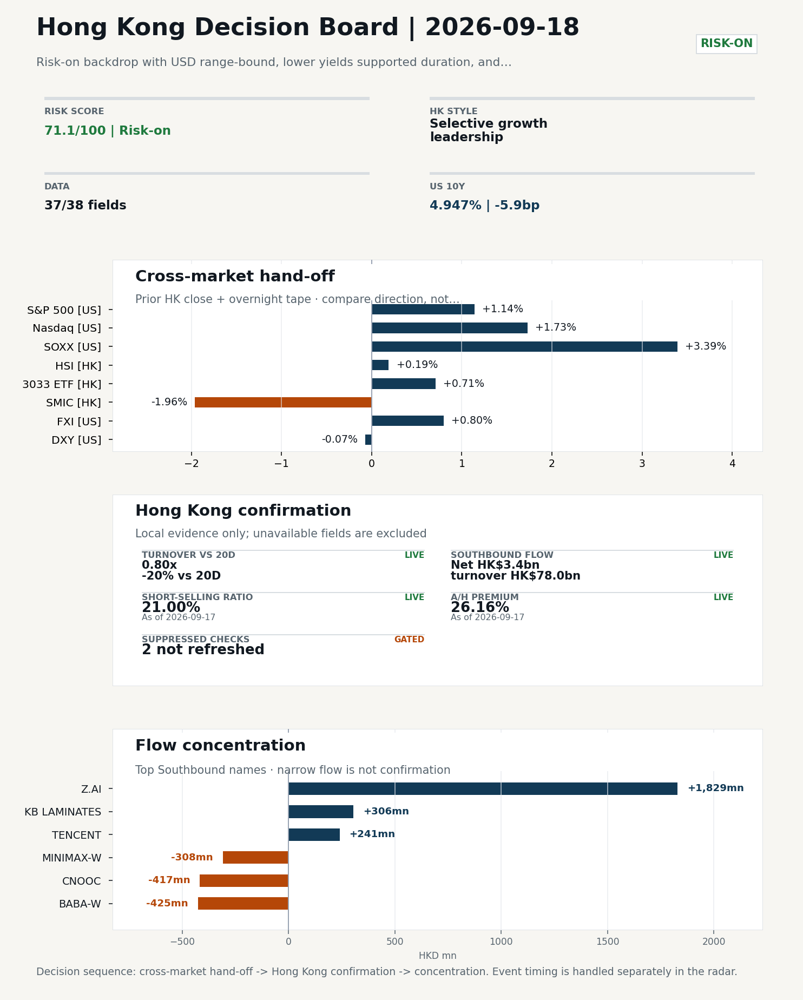
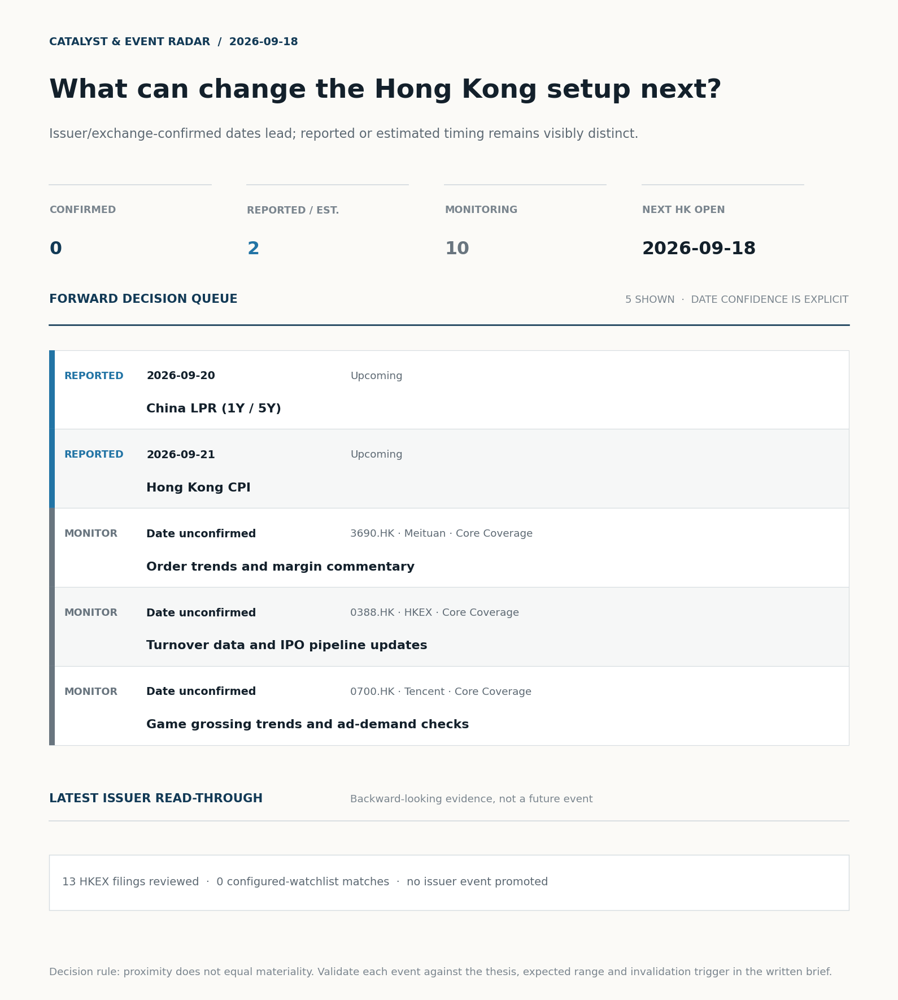
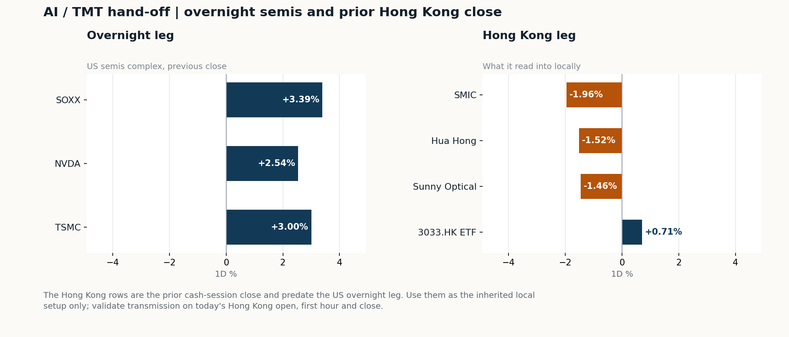
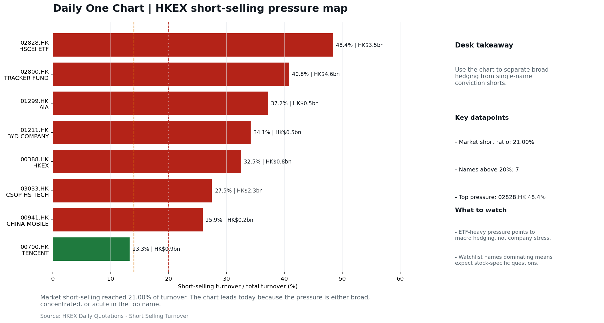

# Morning Research Workbench | 2026-09-18

> **Commute reading route:** `Layer 1 scan (5 min)` → `Layer 2 deep read` → `Layer 3 and appendix if time allows`
>
> Mode: `Trading Daily` | Keep the report execution-oriented: what mattered in the completed session, what can move Hong Kong leadership, and what needs fast follow-up.

_Data through: US/global `2026-09-17` | HK `2026-09-17` | A-share `2026-09-17` | Generated `2026-09-18 07:35:14`_

## Executive Summary

- **Did yesterday's call work?** UNRESOLVED - No comparable next close is available yet, so the call is still open.
- **What changed overnight?** Semis led higher: SOXX +3.39%, NVDA +2.54%, TSMC +3.00%. HSI +0.19% and 3033.HK +0.71%.
- **What it means for AI/TMT** Style, not beta - Selective growth leadership, a 0.69pp spread. Favor relative strength in internet/platform names, but do not treat the move as broad China risk-on until participation confirms.
- **What to watch today** Next scheduled catalyst: China LPR (1Y / 5Y) on 2026-09-20. Confirm if SMIC and Hua Hong open in the same direction as the overnight leg and hold it through the first hour; invalidate if they track HSCEI instead.

## Layer 1 | Scan (5 min)

### 1.1 Yesterday's Call
**Verdict: UNRESOLVED.** No comparable next close is available yet, so the call is still open.

**Recent record.** 6 confirmed / 4 broken over the last 10 scoreable calls (60.0% hit rate). This is a directional close-to-close diagnostic, not a track record.

### 1.2 Opening Decision Board

**Global-to-Hong Kong signals**

_Decision-useful subset: each row states the implication and the next test. Descriptive secondary monitors are kept out of the five-minute scan._

| Signal | Last / move | Interpretation | Confirmation / invalidation |
| --- | --- | --- | --- |
| S&P 500 | 7,637.76 / +1.14% | Broad US risk rose as volatility drained out of the tape, which sets the external floor Hong Kong opens against. Falling volatility confirms lower near-term stress. | Watch whether Nasdaq and offshore-China proxies move the same way. |
| Nasdaq 100 | 29,446.98 / **+1.73%** | Growth outperformed broad beta, a supportive style signal for Hong Kong internet and platform names. | 3033.HK versus HSI leadership carries the read; rising yields would undo it. |
| Hang Seng Index | 24,713.78 / +0.19% | The index was carried by growth and platform names, not by broad participation: 3033.HK differs by 0.52pp. | Southbound participation decides whether this is investable or just a print. |
| Hang Seng TECH ETF (3033.HK) | 4.2420 / +0.71% | Hong Kong growth led broad beta, improving the platform/internet style signal. | Needs a stable CNH and Southbound buying to become a duration signal. |
| Semiconductors (SOXX) | 519.10 / **+3.39%** | Semis led the Nasdaq by 1.66pp, putting the AI capex trade back in front. | SMIC and Hua Hong at the open show whether it transmits to Hong Kong. |
| US 10Y | 4.9470% / -5.9bp | The yield proxy fell, easing the valuation headwind for duration-sensitive equities. | Read it through 3033.HK relative performance, not the index level. |
| USD/CNH | 6.6605 / -0.70% | A stronger offshore renminbi supports the external-risk backdrop for Hong Kong equities. | FXI and Southbound flow decide whether this reaches Hong Kong equities. |
| VIX | 15.44 / **-12.82%** | Lower implied volatility reduces near-term stress, but is supportive only if equity breadth confirms. | Falling volatility on narrowing breadth is a warning, not support. |

_Secondary monitors retained in the source bundle: SMIC (0981.HK), CSI 300, China 10Y, CN-US 10Y spread, DXY, USD/HKD, Brent crude, COMEX gold, Copper._

**Hong Kong local confirmation**

_Coverage gate: 1 unavailable local checks are suppressed here and retained in validation metadata._

| Check | Value | Status | Source / as of | Why it matters |
| --- | --- | --- | --- | --- |
| Main Board turnover vs 20D | 0.80x \| -20% vs 20D | Live local | HKEX \| 2026-09-17 | Trailing 20-session average turnover was HK$232.3bn. |
| Southbound / Northbound net flow | Southbound Net HK$3.4bn \| turnover HK$78.0bn \| Northbound Turnover RMB259.9bn \| net not reported | Live local | HKEX Connect \| 2026-09-17 | Southbound net buy is calculated from HKEX disclosed buy and sell turnover. |
| Short-selling ratio | 21.00% | Live local | HKEX \| 2026-09-17 | Official HKEX stock-level short-selling table, aggregated as a share of total market turnover. |
| AH premium index | 26.16% | Live public | Yahoo \| 2026-09-17 | Fixed 10-name basket, equal-weighted, both legs priced on the same date; comparable across dates. Covered-pair average was +32.90% across 15 pairs. |
| USD/HKD spot vs band | 7.8441 | Live quote | Yahoo \| 2026-09-17 | 59 pips from the weak-side CU (7.8500); monitor HKMA operations and the aggregate balance for a funding squeeze. |
| Hong Kong leadership | Selective growth leadership | Proxy | HSI / HSCEI / 3033.HK ETF relative \| 2026-09-17 | Use HSI / HSCEI / 3033.HK ETF relative moves as the opening style read. |

**Risk state and evidence**

**Composite risk score:** `71.1/100` | **Regime:** `Risk-on`

| Component | Score impact | Evidence |
| --- | --- | --- |
| US beta | +6.8 | S&P 500 +1.14% |
| HK growth ETF proxy | +3.5 | 3033.HK ETF +0.71% |
| Semis complex | +9 | SOXX +3.39% |
| Offshore China proxy | +4.0 | FXI +0.80% |
| Dollar pressure | +0.7 | DXY -0.07% |
| Volatility | +10 | VIX -12.82% |
| HK short-selling | -8 | Short-selling ratio 21.00% |
| HK turnover | -5 | Turnover 0.80x 20D |

_Base 50 plus the component deltas above. Semis complex entered the score on 2026-08-22; earlier scores in the ledger exclude it._

**Morning Checklist**

1. **VIX -12.82%**
 High-frequency data | Lower volatility signals easing stress in the tape. (second-order macro context)
2. **Risk-on backdrop with USD range-bound, lower yields supported duration, and Nasdaq 100 outperformed FXI**
 Overnight regime | Start by deciding whether the day is about Risk-on conditions or a style pivot.
3. **China Activity Data (IP / Retail Sales / FAI) (Past expected window (unverified))**
 Macro / policy | Consumer resilience, growth expectations, and risk-asset pricing | Industries: Consumer, E-commerce, Consumer discretionary
4. **China LPR (1Y / 5Y) (Upcoming)**
 Macro / policy | Watch whether it changes the day's core market narrative | Industries: Market-wide

## Visual Dashboard

**Catalyst & Event Radar**

**Chart read:** No issuer/exchange-confirmed event date is populated; 2 reported or estimated timing item(s) and 10 undated trigger(s) remain explicit.

_Source: Public calendars, issuer disclosures and configured research watchlists_
## Layer 2 | Core Research (20-30 min)

### 2.1 Global-to-Hong Kong Transmission
**Market Setup**
**Core tape.** Overnight US evidence was risk-on: S&P 500 +1.14% and Nasdaq 100 +1.73%, with SOXX +3.39%, TSMC +3.00% and NVDA +2.54% driving a clear semis/AI-capex tape while FXI lagged at +0.80% and the dollar stayed range-bound (DXY -0.07%).
**Main driver.** Prior-HK evidence from 2026-09-16 showed selective growth leadership (3033.HK +0.71%) but with weak 0.80x turnover and a high 21.0% short-selling ratio, leaving participation unconvinced.
**HK relevance.** Today's cross-currents to resolve are a hawkish Fed surprise (one hike done, one signaled) which lifts the discount-rate ceiling versus a softer CNH (USD/CNH -0.70%) and stronger gold (+1.22%) that cushion offshore China beta.

**Key Drivers**
- US growth-style transmission: Nasdaq 100 +1.73% and SOXX +3.39% with TSMC +3.00% and NVDA +2.54% are the largest supportive scores, giving HK growth/internet and the semis complex a constructive starting point.
- Hawkish Fed surprise: an explicit additional hike signaled resets the global discount-rate ceiling, a bearish read for HK duration, Property/REITs and Utilities, and a cap on growth/AI multiple expansion.
- Hong Kong participation drag: Main Board turnover at 0.80x the 20D average and short-selling at 21.0% (80th percentile) argue against treating any open strength as broad China risk-on without breadth confirmation.
- FX/cross-border cushion: USD/CNH -0.70% and USD/HKD near 7.8441 (59 pips from the weak-side CU) keep the funding lens benign.

**Hong Kong Read-Through**
**Opening implication.** For the 2026-09-18 HK open, expect an initial bid in growth/internet and HK-listed semis exposure on the back of SOXX and TSMC.
_Hong Kong style leadership and flow confirmation are set out in the Hong Kong review below._

**Watch Points**
- USD composite moved lower by -0.08pct intraday, with a 0.327pct range.
- Main turning points appeared around 2026-09-17 08:05 trough / 2026-09-17 08:20 peak / 2026-09-17 08:35 peak, suggesting event-driven repricing rather than a clean one-way USD move.
- The biggest cross-asset divergence was Nasdaq 100 versus FXI, a spread of 0.264pct.
- Gold moved +1.22pct intraday with a 2.227pct high-low range.

**Curated overnight stories**
1. **Fed approves interest rate hike, signals one more to come this year**
 Why it matters: Resets the global discount-rate framework with an explicit additional hike signaled; pairs with a new statement text under Warsh.
 HK read-through: Bearish for HK duration and rate-sensitive Property/REITs and Utilities; pressures HKD real rates.
2. **Here are five key takeaways from Wednesday's Fed rate hike**
 Why it matters: Provides the granular read-through (dot plot, statement language, dissent) that will drive the front-end repricing beyond the headline.
 HK read-through: Use it to size the spillover to HK USD/HKD curve, IPO window calculus, and southbound flow appetite for high-beta names.
3. **China's AI leaders keep quiet despite U.S. 'publicity' on tech risks**
 Why it matters: Signals how China's top model labs (Z.ai, Moonshot, Alibaba, Tencent) are choosing to position around the US AI-risk narrative.
 HK read-through: Most relevant for HK-listed China Internet and AI compute names; tone matters more than substance for sentiment.
4. **China's August retail sales miss forecast while investment slump deepens, piling**
 Why it matters: Weak consumption plus deepening FAI weakness raises the odds of incremental policy support; industrial output beat does not offset the demand gap.
 HK read-through: Direct read for HK Consumer Discretionary and E-commerce; reinforces the dovish bias into the upcoming LPR fixings and the case for property/infra names.
5. **OpenAI and Anthropic are making 10 times more revenue than all Chinese AI models**
 Why it matters: Quantifies the monetization gap that frames the China AI valuation debate; useful benchmark for sizing China AI revenue upside in HK models.
 HK read-through: Bears on the 'China AI catch-up' premium in HK tech; bulls can argue the gap justifies domestic policy tailwinds and lower regulatory risk.

**AI / TMT hand-off**

**Overnight leg.** The overnight semis leg was risk-on at +2.98% average (SOXX +3.39%, NVDA +2.54%, TSMC +3.00%).
**Hong Kong expression.** SMIC, Hua Hong and Sunny Optical are best placed at the open, and 3033.HK should be tested before the Hang Seng Index.
**Observable test.** Confirm if SMIC and Hua Hong open in the same direction as the overnight leg and hold it through the first hour; invalidate if they track HSCEI instead, which would mean local flow is overriding the global cycle.

| Name | Role in the chain | 1D | Leg |
| --- | --- | --- | --- |
| SOXX | Semis complex | +3.39% | overnight |
| NVDA | AI capex narrative | +2.54% | overnight |
| TSMC | Foundry demand | +3.00% | overnight |
| SMIC | Leading-edge / domestic substitution | -1.96% | Hong Kong |
| Hua Hong | Mature-node pricing cycle | -1.52% | Hong Kong |
| Sunny Optical | Hardware and optics supply chain | -1.46% | Hong Kong |
| 3033.HK ETF | Broad HK tech beta | +0.71% | Hong Kong |

**Clock discipline.** The Hong Kong rows are the prior cash-session close and predate the US overnight leg. Use them as the inherited local setup only; validate transmission on today's Hong Kong open, first hour and close.

### 2.2 Hong Kong Local Tape and Flow
**Local Tape Setup**
**Local read.** The 2026-09-18 HK open should be read through style leadership, not index direction.
**Verification point.** Overnight US growth/AI-capex strength (Nasdaq 100 +1.73%, SOXX +3.39%, TSMC +3.00%, NVDA +2.54%) is the dominant supportive driver.
**Risk to watch.** HK-listed semis (SMIC -1.96%, Hua Hong -1.52%) actually diverged from the US SOXX move on 2026-09-17, so the cross-market transmission to the HK leg is unconfirmed rather than lagging.

**Style and Local Leadership**
**Style call.** Selective growth leadership.
- **Evidence:** 3033.HK moved +0.71% and beat HSCEI by +0.69pp and HSI by +0.52pp
- **Portfolio meaning:** Favor relative strength in internet/platform names, but do not treat the move as broad China risk-on until participation confirms.
- **Cross-market read:** Hang Seng +0.19% / HSCEI +0.02% / 3033.HK ETF +0.71%. Offshore China proxy FXI +0.80% and USD/CNH -0.70% frame cross-border risk appetite. USD/HKD last traded around 7.8441, which keeps the Hong Kong funding lens in focus.

**Flow Confirmation**
Official Stock Connect evidence is available; the Flow Tracker confirms whether local money supports the price action.

**Follow-Through Checklist**
**Follow-through check.** At the 2026-09-18 open, confirm the growth read if 3033.HK outperforms HSCEI with turnover recovering toward 1.0x the 20D average, short-selling ratio compresses from 21.0%, and USD/CNH holds soft.
**Failure condition.** Invalidate if 3033.HK loses its lead to HSCEI, or if weak turnover, rising shorts, and CNH depreciation persist together.

**Cross-asset attribution**

| Driver | Direction | Score | Evidence | HK implication |
| --- | --- | --- | --- | --- |
| Short-selling pressure | drag | 4.2 | HKEX short-selling ratio was 21.00%. | Elevated short activity argues for extra confirmation before chasing rebounds. |
| US growth-style transmission | supportive | 2.42 | Nasdaq 100 moved +1.73%. | Hong Kong growth and platform names should be tested first at the open. |
| Hong Kong participation | drag | 2.01 | Main Board turnover was 0.80x the 20-session average. | Thin turnover makes index moves easier to fade. |
| Oil and geopolitics | supportive | 1.32 | Oil moved -1.65%. | Split the read between energy/cyclicals support and margin/geopolitical pressure. |
| Global equity beta | supportive | 1.14 | S&P 500 moved +1.14%. | Broad beta matters if Hong Kong breadth confirms the overseas signal. |
| Dollar / CNH pressure | supportive | 1.05 | DXY -0.07% / USD-CNH -0.70% | A stable or softer CNH makes Hong Kong follow-through more credible. |

**Local flow evidence**

**Flow Takeaways**
- Short-selling pressure is elevated, so local rebounds need cleaner breadth and flow confirmation.
- Stock Connect Southbound: net HK$3.4bn on turnover HK$78.0bn (as of 2026-09-17).
- Stock Connect Northbound: turnover RMB259.9bn; public file provides total turnover/top active names, not full net-buy.
- AH premium: fixed 10-name basket +26.16% (comparable across dates); covered-pair average +32.90% over 15 pairs; widest premium: China Communications Construction 104.03%.

**Stock Connect Southbound Active Names**

| # | Ticker | Name | Buy | Sell | Net buy | HKEX turnover rank |
| --- | --- | --- | --- | --- | --- | --- |
| 1 | 02513.HK | Z.AI | HK$3,668.6mn | HK$1,840.0mn | HK$1,828.6mn | 1 |
| 2 | 09988.HK | BABA-W | HK$589.0mn | HK$1,014.3mn | HK$-425.3mn | 7 |
| 3 | 00883.HK | CNOOC | HK$762.0mn | HK$1,179.1mn | HK$-417.0mn | 6 |
| 4 | 00100.HK | MINIMAX-W | HK$603.1mn | HK$911.5mn | HK$-308.4mn | 5 |
| 5 | 01888.HK | KB LAMINATES | HK$1,819.0mn | HK$1,513.1mn | HK$305.8mn | 3 |

**AH Premium Dispersion**

| Name | A ticker | H ticker | Premium | As of |
| --- | --- | --- | --- | --- |
| China Communications Construction | 601800.SS | 1800.HK | +104.03% | 2026-09-17 |
| China Life | 601628.SS | 2628.HK | +51.69% | 2026-09-17 |
| China Railway | 601390.SS | 0390.HK | +50.30% | 2026-09-17 |

**HKEX Short-Selling Watch**

| Ticker | Name | Short ratio | Short turnover | Total turnover |
| --- | --- | --- | --- | --- |
| 00388.HK | HKEX | 32.48% | HK$0.8bn | HK$2.4bn |
| 00700.HK | TENCENT | 13.27% | HK$0.9bn | HK$6.9bn |
| 00941.HK | CHINA MOBILE | 25.89% | HK$0.2bn | HK$0.7bn |

- **Short-value leaders:** 02800.HK TRACKER FUND (HK$4.6bn); 02828.HK HSCEI ETF (HK$3.5bn); 03033.HK CSOP HS TECH (HK$2.3bn); 09988.HK BABA-W (HK$1.1bn).

### 2.3 Macro Transmission
**Desk read.** Today's macro tape is a completed global session reading: VIX down 12.82% to 15.44 flags a clear easing of risk premia.

**Market sensitivity.** With FXI noted as underperforming the Nasdaq 100 in the underlying theme, leadership should skew toward HK-listed semis and platform names rather than the broader H-share complex.

**HK implication.** On policy, the China Activity Data release window (Sept 15, ±2d) is flagged unverified.

**Macro watchpoints**
- Whether the unverified China Activity Data release (window +/- Sept 15) confirms or contradicts the consumer-resilience narrative underpinning
- US yield direction and DXY reaction in the Asia open, given the lower-yields / range-bound-USD backdrop that is currently supporting duration
- SOXX, TSMC ADR, and NVDA follow-through into the HK open, particularly the read into SMIC and Hua Hong as the most direct Hong Kong semis
- Pre-LPR (Sept 20) positioning: any front-running of a 1Y/5Y cut that could extend or fade the current risk-on tone before the actual fix.

| Time | Region | Event | Status | Desk read |
| --- | --- | --- | --- | --- |
| | CN | China Activity Data (IP / Retail Sales / FAI) | Past expected window (unverified) | Impact: Consumer resilience, growth expectations, and risk-asset pricing \| Attention: 5/5 \| Industries: Consumer, E-commerce, Consumer discretionary |
| | CN | China LPR (1Y / 5Y) | Upcoming | Impact: Watch whether it changes the day's core market narrative \| Attention: 5/5 \| Industries: Market-wide |
| | HK | Hong Kong CPI | Upcoming | Impact: Local funding conditions, retail purchasing power, and HKD real rates \| Attention: 1/5 \| Industries: Property, Retail, Banks |

**Positioning and risk backdrop**

- Detailed local flow evidence is covered under Flow Tracker and Attribution; keep this section focused on options, hedging, and macro-positioning risk.

### 2.4 Company Micro Research and Catalysts

| Grade | Sector | Headline | Why it matters | Horizon |
| --- | --- | --- | --- | --- |
| B | China Internet | China's AI leaders keep quiet despite U.S. 'publicity' on tech risks | Assess whether the story can propagate through the China Internet value | Monitor |

**Company Event Takeaway**
**Desk read.** Hong Kong closed mixed on 2026-09-17 with risk-on global tone (Nasdaq 100 outperforming FXI, USD range-bound, softer yields supportive of duration).
**Why it matters.** The day's HKEX tape shows eight small-cap profit warnings released between 2026-09-15 and 2026-09-17.
**Follow-up.** None of the filings have parsed magnitude, so no EPS impact should be assumed until the PDFs are read.

**LLM Quick Takes**
- **3690.HK** | Meituan closed -2.08% at HK$72.90, mid-band at 29% of the 60-session range after two positive earnings-related headlines (Q2 record revenue, food-delivery profit return).…
- **0388.HK** | HKEX closed -1.77% at HK$388.60, mid-band at 53%. Movement is marginal; treat as a turnover/IPO pipeline monitor rather than a signal. Next earnings 2026-11-04.
- **1211.HK** | BYD closed +2.46% at HK$81.15, mid-band at 39%, against a Simply Wall St note flagging the stock down ~12% over one month and ~20% YTD with fading momentum.…
- **1299.HK** | AIA closed +0.45% at HK$77.35, top quartile at 81% of range. No fresh news provided; monitor NBV/agency momentum and mainland visitor/wealth-demand data.…

Decision filter<h4>No immediate portfolio catalyst: 13 official filings were screened and the low-signal market set stays aggregated.</h4>
13 profit warnings

<strong>13</strong>Official filings

<strong>0</strong>Watchlist hits

<strong>0</strong>Actionable events

<strong>No event cleared the portfolio decision filter.</strong>

Broad-market filings remain traceable in the source appendix; they are not expanded here without a watchlist, estimate or liquidity read-through.

<strong>Coverage boundary.</strong> sell-side rating changes, IPO / grey-market monitor were not decision-grade in this run; their absence is not treated as confirmation that no event exists.

**Core coverage requiring follow-up**

**Core coverage**

| Name | Ticker | Last | 1D | Range position | Morning note |
| --- | --- | --- | --- | --- | --- |
| Meituan | 3690.HK | 72.90 | -2.08% | Mid-range | Down 2.08% on the session, mid-range at 29% of its 60-session band. |
| HKEX | 0388.HK | 388.60 | -1.77% | Mid-range | Marginally lower (-1.77%), mid-range at 53% of its 60-session band. |

**Recent headlines for Meituan:**
- [Meituan (MPNGF) (Q2 2026) Earnings Call Highlights: Record Revenue and Strategic AI Pivot Drive...](https://finance.yahoo.com/markets/stocks/articles/meituan-mpngf-q2-2026-earnings-190123345.html) (GuruFocus.com)

**Priority follow-up**

| Name | Ticker | Last | 1D | Range position | Morning note |
| --- | --- | --- | --- | --- | --- |
| BYD Company | 1211.HK | 81.15 | +2.46% | Mid-range | Up 2.46% on the session, mid-range at 39% of its 60-session band. |
| AIA | 1299.HK | 77.35 | +0.45% | Top of range | Marginally higher (+0.45%), in the top quartile of its 60-session range (81%). |

**Recent headlines for BYD Company:**
- [BYD (SEHK:1211) Following Share Price Swings Is The Supply Chain Story Still Undervalued](https://finance.yahoo.com/markets/stocks/articles/byd-sehk-1211-following-share-071138167.html) (Simply Wall St.)

### 2.5 Morning Meeting Questions
No divergence, tail reading or coverage gap stood out today, so there is no obvious follow-up question beyond the base case above.

## Layer 3 | Session Playbook (8-12 min)

### 3.1 Base Case and Scenario Map
**Starting posture.** Selective growth leadership (medium confidence); composite risk `71.1/100` (Risk-on). Favor relative strength in internet/platform names, but do not treat the move as broad China risk-on until participation confirms.

**Scenario map**

| Scenario | Observable trigger | Interpretation | Research response |
| --- | --- | --- | --- |
| Selective growth confirms | 3033.HK keeps a >0.5pp first-hour lead over HSCEI; SMIC and Hua Hong stop lagging broad beta; CNH is stable. | The prior style split has live price confirmation, but is not yet broad China risk-on. | Prioritize internet/platform relative strength; verify participation again at the close. |
| Broad beta takes over | HSI and HSCEI rise together, breadth improves and the 3033.HK lead narrows without turning negative. | Leadership is broadening from a style trade into market beta. | Expand the research set from growth leaders to financials, SOEs and index-heavy names. |
| Risk-off continuation | 3033.HK loses its lead, semis underperform HSCEI and CNH depreciation accelerates. | The prior divergence was a temporary pocket of strength rather than a durable hand-off. | Treat rebounds as unconfirmed; focus on balance-sheet, catalyst and crowding risk. |

**Clocked validation scorecard**

| Window | Check | Prior evidence | Pass condition | What it decides |
| --- | --- | --- | --- | --- |
| 09:30-10:30 | 3033.HK vs HSCEI | +0.69pp at the prior close | 3033.HK retains >0.5pp relative lead | Whether growth leadership survives the open |
| 09:30-10:30 | Semiconductor hand-off | SMIC -1.96%; Hua Hong Semiconductor -1.52% | Stabilise after the open; at least one stops underperforming HSCEI | Whether overnight semis pressure is contained locally |
| 09:30-10:30 | HSI price zone | 24,714 vs 24,500 / 25,000 reference grid | Hold above the lower grid or reclaim the upper grid with breadth | Whether broad beta is stabilising; grid is derived, not technical analysis |
| 09:30-10:30 | USD/CNH | 6.6605 \| -0.70% | No acceleration in CNH depreciation | Whether FX permits a clean Hong Kong risk extension |
| At close | Turnover | 0.80x \| -20% vs 20D | At least 1.0x the 20-session average | Whether the move had normal participation |
| At close | Southbound | Net HK$3.4bn \| turnover HK$78.0bn | Net buying remains positive and broadens beyond one or two names | Whether mainland money confirms the price move |
| At close | Short pressure | 21.00% | Falls versus the prior verified reading (21.00%) | Whether rebound conviction improved |

**Upgrade rule.** Confirm if 3033.HK keeps outperforming HSCEI with at least normal turnover, broader Southbound buying, stable CNH, and easing short pressure.
**Kill switch.** Invalidate if 3033.HK loses its lead to HSCEI, or if weak turnover, rising shorts, and CNH depreciation persist together.
**Clock discipline.** At 07:30, same-day Southbound, turnover and short-selling outcomes are not known. Use the first-hour price/FX checks provisionally and make the final classification only after the close.
**Event clock.** No same-day decision-grade item is populated; the nearest reported/estimated item is China LPR (1Y / 5Y) on 2026-09-20. Verify the issuer or official calendar before relying on the date.

### 3.2 Conditional Theme Deep Dive

| Field | Read |
| --- | --- |
| Theme | Hong Kong Market Structure and Flows |
| Angle for the day | Focus on turnover, Stock Connect, ETF flows, HKEX activity, and style leadership to understand whether Hong Kong is being driven by fundamentals or positioning. |

**Theme desk read**
**Core thesis.** Hong Kong structure remains the right lens for the session, but the tape is sending mixed messages rather than a clean positioning read.
**Evidence.** Overnight, VIX fell 12.82% and SOXX added 3.39% with TSMC +3.0% and NVDA +2.54%, which together suggest a supportive open for HK semis and platform beta; the read-through is sentiment-driven first, earnings-driven second.
**What to test.** Yet HKEX (0388.HK) closed -1.77% at 388.6 and sits mid-range at 52.9% of its 60-session band, so local turnover appetite is not yet confirming the global risk-on signal.

**Signals to keep in mind**
- VIX -12.82%: Lower volatility signals easing stress in the tape.
- SOXX +3.39%: Semis rallied, giving HK semis and platform beta a supportive open.

**LLM watch items:**
- Verify the 2026-09-15 China activity data release and read equity reaction before leaning on the risk-on narrative.
- Track HKEX (0388.HK) intraday turnover and southbound net flow on 2026-09-18 to see if the global risk-on tone reaches local microstructure.
- Position the 2026-09-20 China LPR as the primary catalyst: any cut would re-rate HK duration and rate-sensitive names
- Confirm whether BYD's (1211.HK) +2.46% extends or fades, given range position at 38.8% and the bearish 1M/12M return profile in the recent note.
- Map HK semis read-through: monitor SMIC and Hua Hong at the open against SOXX/TSMC/NVDA overnight strength to gauge how much of the move is durable.

**Related names to keep close:**

| Name | Ticker | Bucket | Morning read |
| --- | --- | --- | --- |
| HKEX | 0388.HK | Core coverage | Marginally lower (-1.77%), mid-range at 53% of its 60-session band. |
| BYD Company | 1211.HK | Priority follow-up | Up 2.46% on the session, mid-range at 39% of its 60-session band. |

**Upcoming catalysts tied to the theme:**
- 2026-09-21 | Hong Kong CPI | Local funding conditions, retail purchasing power, and HKD real rates

### 3.3 Daily One Chart
**Daily One Chart | HKEX short-selling pressure map**

**Chart read.** Market short-selling reached 21.00% of turnover.
**Why it matters.** The chart leads today because the pressure is either broad, concentrated, or acute in the top name.

_Source: HKEX Daily Quotations - Short Selling Turnover_

## Optional Appendix | Traceability and Performance (10-15 min)

### Report Metadata
> Date policy: Review date 2026-09-17 is treated as `Trading Daily`. | Global (US/Europe) data date is 2026-09-17; adapter effective date is 2026-09-17 and summary date is 2026-09-17. | Hong Kong local data date is 2026-09-17; role: same-session local cash tape.
> Market data quality: Coverage: `37/38` | Missing: `1`
> Report quality: `91.4/100` | Grade `A` | Status `usable with caveats`

### Report Quality and Validation
- **Quality score:** 91.4/100 | **Grade:** A | **Status:** usable with caveats
- **Run summary:** 8 healthy | 2 caveat | 0 failed
- **Release recommendation:** Send with caveats | The report is usable, but the advisory guidance should travel with it so readers understand the data gaps.

| Source | Status | Bucket |
| --- | --- | --- |
| Macro calendar | partial | caveat |
| Risk and sentiment feed | partial | caveat |
| Weak component | Score | Read |
| --- | --- | --- |
| Hong Kong local metrics | 54.1 | 5 live, 3 proxy, 3 unavailable local checks. |

**Quality warnings**
- Hong Kong local metrics is weak: 5 live, 3 proxy, 3 unavailable local checks.

**Narrative fact-check guardrail**
- Checked 35 numeric claims; 0 numeric mismatch(es), 0 logic warning(s); 11 structured claims, 0 source/text warning(s); 0 critical, 0 review.

_Full component weights, per-source freshness, adapter status and provenance records are archived with this report under `audit/` rather than printed here._

### Historical Signal Performance
- **Readiness:** exploratory with caveats | 69 observations | 103 active signal dates | next-close entry, 10bps cost, no same-day returns.
- **Interpretation boundary:** exploratory until a benchmark reaches 252 sessions and 100 active-signal sessions.
- **Data-quality caveat:** 23 conflicting price revision(s) and 6 non-session observation(s) remain in the research ledger.
- **Daily-use boundary:** cumulative return, Sharpe and the performance chart stay out of the daily commute edition until the sample and trading-calendar gates pass; use Yesterday's Call instead.

### Source Links
- [China's AI leaders keep quiet despite U.S. 'publicity' on tech risks](https://www.cnbc.com/2026/09/16/chinas-ai-leaders-keep-quiet-despite-us-publicity-on-tech-risks.html) (cnbc_markets)
- [Meituan (MPNGF) (Q2 2026) Earnings Call Highlights: Record Revenue and Strategic AI Pivot Drive...](https://finance.yahoo.com/markets/stocks/articles/meituan-mpngf-q2-2026-earnings-190123345.html) (GuruFocus.com)
- [Meituan Returns to Profit as Food-Delivery Competition Eases](https://www.wsj.com/business/earnings/meituan-returns-to-profit-as-food-delivery-competition-eases-1026a0e9?siteid=yhoof2&yptr=yahoo) (The Wall Street Journal)
- [Enflame's 84% Revenue Dependency on Tencent Exposes the Compute Landlord Thesis at the Customer Level](https://finance.yahoo.com/technology/ai/articles/enflame-84-revenue-dependency-tencent-194023724.html) (Forkast News)
- [Alibaba Raised $10 Billion for AI While Sitting on $30 Billion in Cash. Here's Where the Stock Could Go](https://www.tikr.com/blog/alibaba-raised-10-billion-for-ai-while-sitting-on-30-billion-in-cash-heres-where-the-stock-could-go?ref=yahoofinance) (TIKR)
- [BYD (SEHK:1211) Following Share Price Swings Is The Supply Chain Story Still Undervalued](https://finance.yahoo.com/markets/stocks/articles/byd-sehk-1211-following-share-071138167.html) (Simply Wall St.)
- [China Mobile (SEHK:941): A Closer Look at Valuation After Steady Share Price Gains This Year](https://finance.yahoo.com/news/china-mobile-sehk-941-closer-154022664.html) (Simply Wall St.)
- [00513.HK Profit warning / alert announcement](http://www1.hkexnews.hk/listedco/listconews/sehk/2026/0917/2026091700353.pdf) (HKEXnews)
- [00979.HK Profit warning / alert announcement](http://www1.hkexnews.hk/listedco/listconews/sehk/2026/0917/2026091701213.pdf) (HKEXnews)
- [02442.HK Profit warning / alert announcement](http://www1.hkexnews.hk/listedco/listconews/sehk/2026/0917/2026091701685.pdf) (HKEXnews)
- [01975.HK Profit warning / alert announcement](http://www1.hkexnews.hk/listedco/listconews/sehk/2026/0916/2026091600444.pdf) (HKEXnews)
- [08140.HK Profit warning / alert announcement](http://www1.hkexnews.hk/listedco/listconews/gem/2026/0916/2026091601061.pdf) (HKEXnews)
- [00092.HK Profit warning / alert announcement](http://www1.hkexnews.hk/listedco/listconews/sehk/2026/0915/2026091501445.pdf) (HKEXnews)
- [01059.HK Profit warning / alert announcement](http://www1.hkexnews.hk/listedco/listconews/sehk/2026/0915/2026091501403.pdf) (HKEXnews)
- [01903.HK Profit warning / alert announcement](http://www1.hkexnews.hk/listedco/listconews/sehk/2026/0915/2026091500893.pdf) (HKEXnews)
