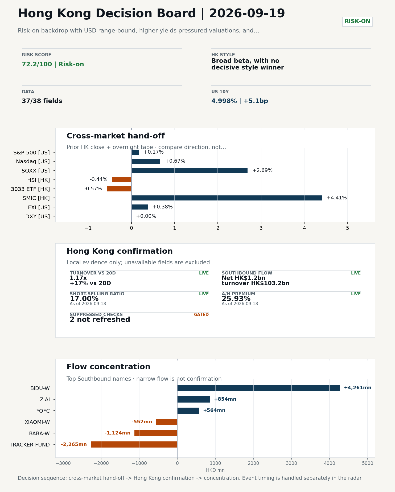
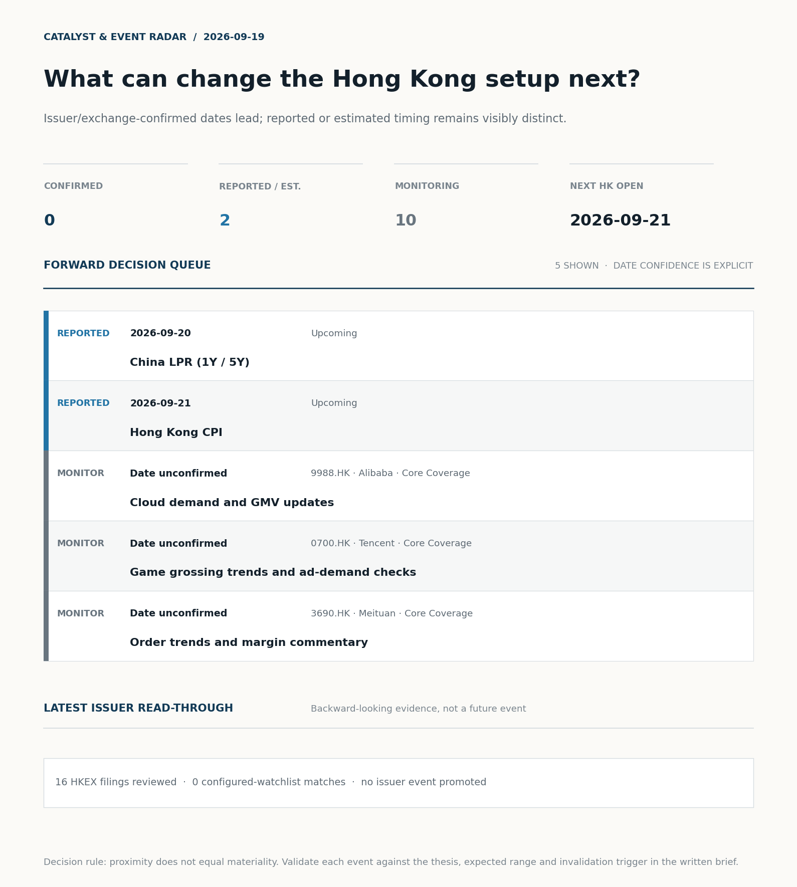
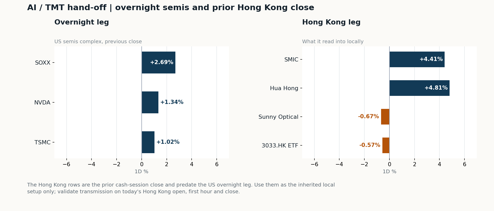

# Morning Research Workbench | 2026-09-19

> **Commute reading route:** `Layer 1 scan (5 min)` → `Layer 2 deep read` → `Layer 3 and appendix if time allows`
>
> Mode: `Trading Daily` | Review Friday's completed session; treat Saturday as a non-trading prep day.

_Data through: US/global `2026-09-18` | HK `2026-09-18` | A-share `2026-09-18` | Generated `2026-09-19 07:18:30`_

## Executive Summary

- **Did yesterday's call work?** UNRESOLVED - No comparable next close is available yet, so the call is still open.
- **What changed overnight?** Semis led higher: SOXX +2.69%, NVDA +1.34%, TSMC +1.02%. HSI -0.44% and 3033.HK -0.57%.
- **What it means for AI/TMT** No decisive style winner - Broad beta, with no decisive style winner, a 0.19pp spread. Avoid forcing a growth-versus-value call; let volume, Southbound concentration, and the first-hour relative tape identify leadership.
- **What to watch today** Next scheduled catalyst: China LPR (1Y / 5Y) on 2026-09-20. Confirm if SMIC and Hua Hong open in the same direction as the overnight leg and hold it through the first hour; invalidate if they track HSCEI instead.

## Layer 1 | Scan (5 min)

### 1.1 Yesterday's Call
**Verdict: UNRESOLVED.** No comparable next close is available yet, so the call is still open.

**Recent record.** 6 confirmed / 4 broken over the last 10 scoreable calls (60.0% hit rate). This is a directional close-to-close diagnostic, not a track record.

### 1.2 Opening Decision Board

**Global-to-Hong Kong signals**

_Decision-useful subset: each row states the implication and the next test. Descriptive secondary monitors are kept out of the five-minute scan._

| Signal | Last / move | Interpretation | Confirmation / invalidation |
| --- | --- | --- | --- |
| S&P 500 | 7,650.50 / +0.17% | Broad US risk rose as volatility drained out of the tape, which sets the external floor Hong Kong opens against. Falling volatility confirms lower near-term stress. | Watch whether Nasdaq and offshore-China proxies move the same way. |
| Nasdaq 100 | 29,644.17 / +0.67% | Growth outperformed broad beta, a supportive style signal for Hong Kong internet and platform names. Growth advanced despite higher yields, showing momentum resilience but also higher reversal sensitivity. | 3033.HK versus HSI leadership carries the read; rising yields would undo it. |
| Hang Seng Index | 24,604.29 / -0.44% | Broad beta fell helped by a firmer offshore renminbi, with growth and value moving together. | Southbound participation decides whether this is investable or just a print. |
| Hang Seng TECH ETF (3033.HK) | 4.2180 / -0.57% | Hong Kong growth lagged, so broad-index strength is not yet a duration signal. | Needs a stable CNH and Southbound buying to become a duration signal. |
| Semiconductors (SOXX) | 533.07 / **+2.69%** | Semis led the Nasdaq by 2.02pp, putting the AI capex trade back in front. | SMIC and Hua Hong at the open show whether it transmits to Hong Kong. |
| US 10Y | 4.9980% / +5.1bp | The yield proxy rose, tightening the discount-rate backdrop for long-duration Hong Kong growth. | Read it through 3033.HK relative performance, not the index level. |
| USD/CNH | 6.6520 / -0.83% | A stronger offshore renminbi supports the external-risk backdrop for Hong Kong equities. | FXI and Southbound flow decide whether this reaches Hong Kong equities. |
| VIX | 14.81 / **-4.08%** | Lower implied volatility reduces near-term stress, but is supportive only if equity breadth confirms. | Falling volatility on narrowing breadth is a warning, not support. |

_Secondary monitors retained in the source bundle: SMIC (0981.HK), CSI 300, China 10Y, CN-US 10Y spread, DXY, USD/HKD, Brent crude, COMEX gold, Copper._

**Hong Kong local confirmation**

_Coverage gate: 1 unavailable local checks are suppressed here and retained in validation metadata._

| Check | Value | Status | Source / as of | Why it matters |
| --- | --- | --- | --- | --- |
| Main Board turnover vs 20D | 1.17x \| +17% vs 20D | Live local | HKEX \| 2026-09-18 | Trailing 20-session average turnover was HK$228.2bn. |
| Southbound / Northbound net flow | Southbound Net HK$1.2bn \| turnover HK$103.2bn \| Northbound Turnover RMB333.9bn \| net not reported | Live local | HKEX Connect \| 2026-09-18 | Southbound net buy is calculated from HKEX disclosed buy and sell turnover. |
| Short-selling ratio | 17.00% | Live local | HKEX \| 2026-09-18 | Official HKEX stock-level short-selling table, aggregated as a share of total market turnover. |
| AH premium index | 25.93% | Live public | Yahoo \| 2026-09-18 | Fixed 10-name basket, equal-weighted, both legs priced on the same date; comparable across dates. Covered-pair average was +44.50% across 19 pairs. |
| USD/HKD spot vs band | 7.8441 | Live quote | Yahoo \| 2026-09-18 | 59 pips from the weak-side CU (7.8500); monitor HKMA operations and the aggregate balance for a funding squeeze. |
| Hong Kong leadership | Broad beta, with no decisive style winner | Proxy | HSI / HSCEI / 3033.HK ETF relative \| 2026-09-18 | Use HSI / HSCEI / 3033.HK ETF relative moves as the opening style read. |

**Risk state and evidence**

**Composite risk score:** `72.2/100` | **Regime:** `Risk-on`

| Component | Score impact | Evidence |
| --- | --- | --- |
| US beta | +1.0 | S&P 500 +0.17% |
| HK growth ETF proxy | -2.8 | 3033.HK ETF -0.57% |
| Semis complex | +9 | SOXX +2.69% |
| Offshore China proxy | +1.9 | FXI +0.38% |
| Dollar pressure | +0.0 | DXY -0.00% |
| Volatility | +8.2 | VIX -4.08% |
| HK short-selling | +0 | Short-selling ratio 17.00% |
| HK turnover | +5 | Turnover 1.17x 20D |

_Base 50 plus the component deltas above. Semis complex entered the score on 2026-08-22; earlier scores in the ledger exclude it._

**Morning Checklist**

1. **Risk-on backdrop with USD range-bound, higher yields pressured valuations, and Nasdaq 100 outperformed FXI**
 Overnight regime | Start by deciding whether the day is about Risk-on conditions or a style pivot.
2. **China Activity Data (IP / Retail Sales / FAI) (Past expected window (unverified))**
 Macro / policy | Consumer resilience, growth expectations, and risk-asset pricing | Industries: Consumer, E-commerce, Consumer discretionary
3. **China LPR (1Y / 5Y) (Upcoming)**
 Macro / policy | Watch whether it changes the day's core market narrative | Industries: Market-wide
4. **Hong Kong CPI (Upcoming)**
 Macro / policy | Local funding conditions, retail purchasing power, and HKD real rates | Industries: Property, Retail, Banks

## Visual Dashboard

**Catalyst & Event Radar**

**Chart read:** No issuer/exchange-confirmed event date is populated; 2 reported or estimated timing item(s) and 10 undated trigger(s) remain explicit.

_Source: Public calendars, issuer disclosures and configured research watchlists_
## Layer 2 | Core Research (20-30 min)

### 2.1 Global-to-Hong Kong Transmission
**Market Setup**
**Core tape.** Overnight US equities closed mixed-to-firmer, with growth and the AI complex leading and broader beta more muted.
**Main driver.** The 2026-09-18 US tape shows Nasdaq 100 +0.67% and S&P 500 +0.17%, with FXI +0.38% reversing the prior HSI direction of -0.44%.
**HK relevance.** Higher US yields were a valuation drag on duration-sensitive names even as softer oil and lower VIX supported the risk-on read.

**Key Drivers**
- Oil moved -5.69% intraday (WTI -6.32%), easing the energy/inflation drag and supporting growth multiples.
- US 10Y yield +5.1bp acted as a drag on valuation-sensitive sectors, partially offsetting the equity bid.
- Semis complex strength (SOXX +2.69%, NVDA +1.34%, TSM +1.02%) transmitted directly to the HK-listed semis space, where SMIC +4.41% and Hua Hong +4.81% on 2026-09-18 already priced that signal.
- DXY -0.00% and USD/CNH -0.83% framed CNH stability, making HK follow-through more credible, while VIX -4.08% signalled easing stress.

**Hong Kong Read-Through**
**Opening implication.** For the 2026-09-21 HK open, the constructive US semis tape and softer oil/VIX argue for a firmer tech-led bias, with HK-listed semis (SMIC, Hua Hong) and platform names most directly exposed to overnight signals. Confirmation requires the first-hour tape to show broad HSI participation rather than a sharp 3033.HK-versus-HSCEI split; sustained US yield rises or hawkish Warsh headlines remain the main downside risk to that open.
_Hong Kong style leadership and flow confirmation are set out in the Hong Kong review below._

**Watch Points**
- USD composite moved lower by -0.02pct intraday, with a 0.389pct range.
- Main turning points appeared around 2026-09-18 08:05 trough / 2026-09-18 08:30 peak / 2026-09-18 08:55 trough, suggesting event-driven repricing rather than a clean one-way USD move.
- The biggest cross-asset divergence was Nasdaq 100 versus FXI, a spread of 0.176pct.
- Gold moved +0.37pct intraday with a 1.275pct high-low range.

**Curated overnight stories**
1. **Three words from Kevin Warsh have Wall Street wondering how far the Fed will go with**
 Why it matters: Signals a more hawkish Fed reaction function under Chair Warsh, with implications for the USD, US yields and global risk-asset multiples.
 HK read-through: Higher US yields tend to pressure HK growth/tech valuations and support the HKD funding backdrop; HK banks and insurance are second-order beneficiaries of steeper curves.
2. **China's August retail sales miss forecast while investment slump deepens, piling**
 Why it matters: Confirms a soft consumer and weak FAI picture into 3Q, raising the probability of additional policy support (fiscal or LPR/RRR) - China LPR is on the upcoming calendar.
 HK read-through: Direct read-through to HK consumer discretionary, e-commerce, and Macau/gaming names.
3. **US and China Vie For AI Lead Before Trump - Xi Summit**
 Why it matters: Frames AI/export-control rhetoric as a core agenda item at the upcoming Trump - Xi meeting, with potential implications for chip and AI compute access.
 HK read-through: Directly relevant to HK-listed China Internet (Alibaba, Tencent, etc.) and the Hong Kong-listed AI/semis complex.
4. **OpenAI and Anthropic are making 10 times more revenue than all Chinese AI models**
 Why it matters: Quantifies the US-vs-China AI commercial gap and reinforces the 'catching up' narrative for Chinese model developers.
 HK read-through: Sets the bar for monetisation expectations on China Internet AI names; adds volatility risk around AI-related headlines into the Trump - Xi summit.
5. **China's AI leaders keep quiet despite U.S. 'publicity' on tech risks**
 Why it matters: Suggests Chinese AI labs are avoiding public sparring ahead of the summit, reducing headline risk but also signalling a defensive posture on US AI risk narratives.
 HK read-through: Lowers near-term headline volatility for China Internet AI names but caps positive catalysts.

**AI / TMT hand-off**

**Overnight leg.** The overnight semis leg was risk-on at +1.68% average (SOXX +2.69%, NVDA +1.34%, TSMC +1.02%).
**Hong Kong expression.** SMIC, Hua Hong and Sunny Optical are best placed at the open, and 3033.HK should be tested before the Hang Seng Index.
**Observable test.** Confirm if SMIC and Hua Hong open in the same direction as the overnight leg and hold it through the first hour; invalidate if they track HSCEI instead, which would mean local flow is overriding the global cycle.

| Name | Role in the chain | 1D | Leg |
| --- | --- | --- | --- |
| SOXX | Semis complex | +2.69% | overnight |
| NVDA | AI capex narrative | +1.34% | overnight |
| TSMC | Foundry demand | +1.02% | overnight |
| SMIC | Leading-edge / domestic substitution | +4.41% | Hong Kong |
| Hua Hong | Mature-node pricing cycle | +4.81% | Hong Kong |
| Sunny Optical | Hardware and optics supply chain | -0.67% | Hong Kong |
| 3033.HK ETF | Broad HK tech beta | -0.57% | Hong Kong |

**Clock discipline.** The Hong Kong rows are the prior cash-session close and predate the US overnight leg. Use them as the inherited local setup only; validate transmission on today's Hong Kong open, first hour and close.

### 2.2 Hong Kong Local Tape and Flow
**Local Tape Setup**
**Local read.** Friday's HK tape closed mixed across styles: HSI -0.44%, HSCEI -0.38% and 3033.HK -0.57% (same session as the US semis surge).
**Verification point.** Main Board turnover at 1.17x the 20D average (HK$228.2bn) and 17.00% short-selling ratio make local price action credible rather than thin.
**Risk to watch.** CNH was stable into the close (USD/CNH -0.83%), which would normally support HK follow-through; the missing piece is confirmation from CSI 300/HK growth proxies on Monday given the higher US 10Y (+5.1bp) headwind.

**Style and Local Leadership**
**Style call.** Broad beta, with no decisive style winner.
- **Evidence:** 3033.HK and HSCEI were separated by only 0.19pp (-0.57% versus -0.38%)
- **Portfolio meaning:** Avoid forcing a growth-versus-value call; let volume, Southbound concentration, and the first-hour relative tape identify leadership.
- **Cross-market read:** Hang Seng -0.44% / HSCEI -0.38% / 3033.HK ETF -0.57%. Offshore China proxy FXI +0.38% and USD/CNH -0.83% frame cross-border risk appetite. USD/HKD last traded around 7.8441, which keeps the Hong Kong funding lens in focus.

**Flow Confirmation**
Official Stock Connect evidence is available; the Flow Tracker confirms whether local money supports the price action.

**Follow-Through Checklist**
**Follow-through check.** Watch the first-hour tape for: (a) 3033.HK holding its 0.87x volume ratio while HSCEI narrows its loss - confirms breadth beyond semis.
**Failure condition.** Reclassify the tape when either 3033.HK or HSCEI opens a sustained 0.5pp relative lead with flow confirmation.

**Cross-asset attribution**

| Driver | Direction | Score | Evidence | HK implication |
| --- | --- | --- | --- | --- |
| Oil and geopolitics | supportive | 4.62 | Oil moved -5.77%. | Split the read between energy/cyclicals support and margin/geopolitical pressure. |
| Hong Kong participation | supportive | 1.68 | Main Board turnover was 1.17x the 20-session average. | Higher participation makes local price action more credible. |
| Dollar / CNH pressure | supportive | 1.24 | DXY -0.00% / USD-CNH -0.83% | A stable or softer CNH makes Hong Kong follow-through more credible. |
| Rates impulse | drag | 0.76 | US 10Y yield moved +5.1bp. | Lower yields help long-duration growth; higher yields pressure valuation-sensitive |

**Local flow evidence**

**Flow Takeaways**
- Hong Kong participation is active and short pressure is not excessive, so local confirmation looks healthier.
- Stock Connect Southbound: net HK$1.2bn on turnover HK$103.2bn (as of 2026-09-18).
- Stock Connect Northbound: turnover RMB333.9bn; public file provides total turnover/top active names, not full net-buy.
- AH premium: fixed 10-name basket +25.93% (comparable across dates); covered-pair average +44.50% over 19 pairs; widest premium: China Railway 239.21%.

**Stock Connect Southbound Active Names**

| # | Ticker | Name | Buy | Sell | Net buy | HKEX turnover rank |
| --- | --- | --- | --- | --- | --- | --- |
| 1 | 09888.HK | BIDU-W | HK$4,271.6mn | HK$10.5mn | HK$4,261.2mn | 1 |
| 2 | 02800.HK | TRACKER FUND | HK$0.4mn | HK$2,265.3mn | HK$-2,264.9mn | 4 |
| 3 | 09988.HK | BABA-W | HK$1,417.2mn | HK$2,541.0mn | HK$-1,123.8mn | 3 |
| 4 | 02513.HK | Z.AI | HK$3,168.0mn | HK$2,314.4mn | HK$853.6mn | 1 |
| 5 | 06869.HK | YOFC | HK$1,810.1mn | HK$1,245.7mn | HK$564.4mn | 6 |

**AH Premium Dispersion**

| Name | A ticker | H ticker | Premium | As of |
| --- | --- | --- | --- | --- |
| China Railway | 601390.SS | 0390.HK | +239.21% | 2026-09-18 |
| China Communications Construction | 601800.SS | 1800.HK | +106.57% | 2026-09-18 |
| China Railway Construction | 601186.SS | 1186.HK | +59.37% | 2026-09-18 |

**HKEX Short-Selling Watch**

| Ticker | Name | Short ratio | Short turnover | Total turnover |
| --- | --- | --- | --- | --- |
| 00388.HK | HKEX | 13.93% | HK$0.2bn | HK$1.6bn |
| 00700.HK | TENCENT | 11.40% | HK$1.4bn | HK$12.2bn |
| 00941.HK | CHINA MOBILE | 12.94% | HK$0.1bn | HK$0.6bn |

- **Short-value leaders:** 02800.HK TRACKER FUND (HK$4.3bn); 02828.HK HSCEI ETF (HK$2.3bn); 09888.HK BIDU-W (HK$1.7bn); 03033.HK CSOP HS TECH (HK$1.5bn).

### 2.3 Macro Transmission
**Desk read.** We are framing today's note around the China LPR setting on 2026-09-20 and Hong Kong CPI on 2026-09-21, the two releases most likely to reset the local tape before Monday's open.

**Market sensitivity.** Friday's completed session closed risk-on with a USD range-bound tone, but a -6.32% drop in WTI alongside a -4.08% decline in VIX and a +2.69% lift in SOXX suggests the leadership was narrow: semis and platform beta did the work.

**HK implication.** That combination means H-share earnings sensitivity to China's September activity data (already past the expected window) is the standing question, and the LPR is the next clean test of easing intent.

**Macro watchpoints**
- China 1Y and 5Y LPR on 2026-09-20: any cut, hold, or guidance shift relative to consensus and the prior activity data read.

| Time | Region | Event | Status | Desk read |
| --- | --- | --- | --- | --- |
| | CN | China Activity Data (IP / Retail Sales / FAI) | Past expected window (unverified) | Impact: Consumer resilience, growth expectations, and risk-asset pricing \| Attention: 5/5 \| Industries: Consumer, E-commerce, Consumer discretionary |
| | CN | China LPR (1Y / 5Y) | Upcoming | Impact: Watch whether it changes the day's core market narrative \| Attention: 5/5 \| Industries: Market-wide |
| | HK | Hong Kong CPI | Upcoming | Impact: Local funding conditions, retail purchasing power, and HKD real rates \| Attention: 1/5 \| Industries: Property, Retail, Banks |

**Positioning and risk backdrop**

- Detailed local flow evidence is covered under Flow Tracker and Attribution; keep this section focused on options, hedging, and macro-positioning risk.

### 2.4 Company Micro Research and Catalysts

| Grade | Sector | Headline | Why it matters | Horizon |
| --- | --- | --- | --- | --- |
| B | China Internet | China's AI leaders keep quiet despite U.S. 'publicity' on tech risks | Assess whether the story can propagate through the China Internet value | Monitor |

**Company Event Takeaway**
**Desk read.** Reviewing the 18 Sep session into the 21 Sep HK open.
**Why it matters.** The only portfolio-relevant tape signal is the divergence inside China Internet.
**Follow-up.** The CNBC AI-risk story on Z.ai/Moonshot/Alibaba/Tencent staying silent is a Monitor-grade narrative that maps first to the same China Internet complex ahead of the Trump-Xi summit.

**LLM Quick Takes**
- **9988.HK** | Fact: +4.00% on 18 Sep, range position 51%. Read: single-session divergence vs. the rest of China Internet…
- **0700.HK** | Fact: -1.64% on 18 Sep, range position 9% (bottom of band); next earnings 12 Nov 2026, no estimate comparison supplied. Read: positioning remains depressed…
- **3033.HK** | Fact: -0.57% on 18 Sep, range position 5.8% (bottom quartile). Read: ETF still anchored low while 9988.HK diverged higher, so the basket is not confirming Alibaba's move. Next check…
- **1299.HK** | Fact: -0.78% on 18 Sep, range position 74.5%, mid-range. Read: marginal move only. Next check: NBV/agency channel data remain the cleanest catalyst; no new information in the supplied set.

Decision filter<h4>No immediate portfolio catalyst: 16 official filings were screened and the low-signal market set stays aggregated.</h4>
16 profit warnings

<strong>16</strong>Official filings

<strong>0</strong>Watchlist hits

<strong>0</strong>Actionable events

<strong>No event cleared the portfolio decision filter.</strong>

Broad-market filings remain traceable in the source appendix; they are not expanded here without a watchlist, estimate or liquidity read-through.

<strong>Coverage boundary.</strong> sell-side rating changes, IPO / grey-market monitor were not decision-grade in this run; their absence is not treated as confirmation that no event exists.

**Core coverage requiring follow-up**

**Core coverage**

| Name | Ticker | Last | 1D | Range position | Morning note |
| --- | --- | --- | --- | --- | --- |
| Alibaba | 9988.HK | 109.30 | +4.00% | Mid-range | Up 4.00% on the session, mid-range at 51% of its 60-session band. |
| Tencent | 0700.HK | 419.00 | -1.64% | Bottom of range | Marginally lower (-1.64%), still in the bottom quartile of its 60-session range (9%). |

**Priority follow-up**

| Name | Ticker | Last | 1D | Range position | Morning note |
| --- | --- | --- | --- | --- | --- |
| AIA | 1299.HK | 76.75 | -0.78% | Mid-range | Marginally lower (-0.78%), mid-range at 74% of its 60-session band. |
| BYD Company | 1211.HK | 81.50 | +0.43% | Mid-range | Marginally higher (+0.43%), mid-range at 40% of its 60-session band. |

### 2.5 Morning Meeting Questions
**Q1. The index fell but Southbound bought - is the move real?**
- **Evidence:** HSI -0.44% against Southbound net +1.2bn HKD.
- **How to answer:** Treat it as unconfirmed. Price and mainland flow disagreed, so the price move was not driven by Southbound participation; it needs another session of confirmation before being read as a trend.

## Layer 3 | Session Playbook (8-12 min)

### 3.1 Base Case and Scenario Map
**Starting posture.** Broad beta, with no decisive style winner (medium confidence); composite risk `72.2/100` (Risk-on). Avoid forcing a growth-versus-value call; let volume, Southbound concentration, and the first-hour relative tape identify leadership.

**Scenario map**

| Scenario | Observable trigger | Interpretation | Research response |
| --- | --- | --- | --- |
| Selective growth confirms | 3033.HK keeps a >0.5pp first-hour lead over HSCEI; SMIC and Hua Hong stop lagging broad beta; CNH is stable. | The prior style split has live price confirmation, but is not yet broad China risk-on. | Prioritize internet/platform relative strength; verify participation again at the close. |
| Broad beta takes over | HSI and HSCEI rise together, breadth improves and the 3033.HK lead narrows without turning negative. | Leadership is broadening from a style trade into market beta. | Expand the research set from growth leaders to financials, SOEs and index-heavy names. |
| Risk-off continuation | 3033.HK loses its lead, semis underperform HSCEI and CNH depreciation accelerates. | The prior divergence was a temporary pocket of strength rather than a durable hand-off. | Treat rebounds as unconfirmed; focus on balance-sheet, catalyst and crowding risk. |

**Clocked validation scorecard**

| Window | Check | Prior evidence | Pass condition | What it decides |
| --- | --- | --- | --- | --- |
| 09:30-10:30 | 3033.HK vs HSCEI | -0.19pp at the prior close | 3033.HK retains >0.5pp relative lead | Whether growth leadership survives the open |
| 09:30-10:30 | Semiconductor hand-off | SMIC +4.41%; Hua Hong Semiconductor +4.81% | Stabilise after the open; at least one stops underperforming HSCEI | Whether overnight semis pressure is contained locally |
| 09:30-10:30 | HSI price zone | 24,604 vs 24,500 / 25,000 reference grid | Hold above the lower grid or reclaim the upper grid with breadth | Whether broad beta is stabilising; grid is derived, not technical analysis |
| 09:30-10:30 | USD/CNH | 6.652 \| -0.83% | No acceleration in CNH depreciation | Whether FX permits a clean Hong Kong risk extension |
| At close | Turnover | 1.17x \| +17% vs 20D | At least 1.0x the 20-session average | Whether the move had normal participation |
| At close | Southbound | Net HK$1.2bn \| turnover HK$103.2bn | Net buying remains positive and broadens beyond one or two names | Whether mainland money confirms the price move |
| At close | Short pressure | 17.00% | Falls versus the prior verified reading (17.00%) | Whether rebound conviction improved |

**Upgrade rule.** Confirm a broad-beta session only if HSI breadth and turnover improve without a sharp 3033.HK-versus-HSCEI split.
**Kill switch.** Reclassify the tape when either 3033.HK or HSCEI opens a sustained 0.5pp relative lead with flow confirmation.
**Clock discipline.** At 07:30, same-day Southbound, turnover and short-selling outcomes are not known. Use the first-hour price/FX checks provisionally and make the final classification only after the close.
**Event clock.** No same-day decision-grade item is populated; the nearest reported/estimated item is China LPR (1Y / 5Y) on 2026-09-20. Verify the issuer or official calendar before relying on the date.

### 3.2 Conditional Theme Deep Dive

| Field | Read |
| --- | --- |
| Theme | AI and Compute Chain |
| Angle for the day | Track whether global AI capex, semis, cloud, and server demand are still carrying offshore China internet and hardware sentiment. |

**Theme desk read**
**Core thesis.** The AI and Compute Chain theme remains the cleanest bridge between the overnight tape and Monday's HK open.
**Evidence.** The global signals are constructive but uneven: SOXX closed +2.69%, NVDA +1.34% and TSMC ADR +1.02% provide direct support for HK semis and platform beta.
**What to test.** Alibaba (9988.HK) closed +4.00% at the midpoint of its 60-session band.

**Signals to keep in mind**
- China's AI leaders keep quiet despite U.S. 'publicity' on tech risks: Assess whether the story can propagate through the China Internet
- When Building Wealth, Don't Be A Hedge Fund: BNY's Levine: Assess whether the story can propagate through the Financials value chain
- SOXX +2.69%: Semis rallied, giving HK semis and platform beta a supportive open.
- WTI crude -6.32%: Softer oil argues for a more cautious cyclical-growth read.

**LLM watch items:**
- China LPR (1Y/5Y) on 2026-09-20 for the cleanest read on easing intent and market-wide risk appetite.
- Alibaba (9988.HK): whether Friday's +4.00% move holds at the open and is confirmed by cloud demand or GMV commentary.
- Tencent (0700.HK) at the bottom 9% of its 60-session range as a marginal monitor for gaming and ad demand.

**Related names to keep close:**

| Name | Ticker | Bucket | Morning read |
| --- | --- | --- | --- |
| Alibaba | 9988.HK | Core coverage | Up 4.00% on the session, mid-range at 51% of its 60-session band. |
| Tencent | 0700.HK | Core coverage | Marginally lower (-1.64%), still in the bottom quartile of its 60-session range (9%). |
| AIA | 1299.HK | Priority follow-up | Marginally lower (-0.78%), mid-range at 74% of its 60-session band. |

**Upcoming catalysts tied to the theme:**
- 2026-09-21 | Hong Kong CPI | Local funding conditions, retail purchasing power, and HKD real rates

**Relevant headlines:**
- [China's AI leaders keep quiet despite U.S. 'publicity' on tech risks](https://www.cnbc.com/2026/09/16/chinas-ai-leaders-keep-quiet-despite-us-publicity-on-tech-risks.html)
- [When Building Wealth, Don't Be A Hedge Fund: BNY's Levine](https://www.bloomberg.com/news/videos/2026-09-18/when-building-wealth-don-t-be-a-hedge-fund-levine-video)
- [Diversify Capital & 'Let It Run': BNY's Levine](https://www.bloomberg.com/news/videos/2026-09-18/diversify-capital-let-it-run-bny-s-levine-video)

### 3.3 Daily One Chart
**Daily One Chart | HKEX short-selling pressure map**

**Chart read.** Market short-selling reached 17.00% of turnover.
**Why it matters.** The chart leads today because the pressure is either broad, concentrated, or acute in the top name.

_Source: HKEX Daily Quotations - Short Selling Turnover_

## Optional Appendix | Traceability and Performance (10-15 min)

### Report Metadata
> Date policy: Review date 2026-09-18 is treated as `Trading Daily`. | Global (US/Europe) data date is 2026-09-18; adapter effective date is 2026-09-18 and summary date is 2026-09-18. | Hong Kong local data date is 2026-09-18; role: same-session local cash tape.
> Market data quality: Coverage: `37/38` | Missing: `1`
> Report quality: `90.4/100` | Grade `B` | Status `usable with caveats`

### Report Quality and Validation
- **Quality score:** 90.4/100 | **Grade:** B | **Status:** usable with caveats
- **Run summary:** 8 healthy | 2 caveat | 0 failed
- **Release recommendation:** Send with caveats | The report is usable, but the advisory guidance should travel with it so readers understand the data gaps.

| Source | Status | Bucket |
| --- | --- | --- |
| Macro calendar | partial | caveat |
| Risk and sentiment feed | partial | caveat |

- **Grade capped:** 1 prose defect(s) detected: 1 severed_list.

| Weak component | Score | Read |
| --- | --- | --- |
| Hong Kong local metrics | 54.1 | 5 live, 3 proxy, 3 unavailable local checks. |

**Quality warnings**
- Hong Kong local metrics is weak: 5 live, 3 proxy, 3 unavailable local checks.

**Narrative fact-check guardrail**
- Checked 33 numeric claims; 0 numeric mismatch(es), 0 logic warning(s); 11 structured claims, 0 source/text warning(s); 0 critical, 0 review.

_Full component weights, per-source freshness, adapter status and provenance records are archived with this report under `audit/` rather than printed here._

### Historical Signal Performance
- **Readiness:** exploratory with caveats | 69 observations | 104 active signal dates | next-close entry, 10bps cost, no same-day returns.
- **Interpretation boundary:** exploratory until a benchmark reaches 252 sessions and 100 active-signal sessions.
- **Data-quality caveat:** 23 conflicting price revision(s) and 6 non-session observation(s) remain in the research ledger.
- **Daily-use boundary:** cumulative return, Sharpe and the performance chart stay out of the daily commute edition until the sample and trading-calendar gates pass; use Yesterday's Call instead.

### Source Links
- [China's AI leaders keep quiet despite U.S. 'publicity' on tech risks](https://www.cnbc.com/2026/09/16/chinas-ai-leaders-keep-quiet-despite-us-publicity-on-tech-risks.html) (cnbc_markets)
- [Meituan (MPNGF) (Q2 2026) Earnings Call Highlights: Record Revenue and Strategic AI Pivot Drive...](https://finance.yahoo.com/markets/stocks/articles/meituan-mpngf-q2-2026-earnings-190123345.html) (GuruFocus.com)
- [Meituan Returns to Profit as Food-Delivery Competition Eases](https://www.wsj.com/business/earnings/meituan-returns-to-profit-as-food-delivery-competition-eases-1026a0e9?siteid=yhoof2&yptr=yahoo) (The Wall Street Journal)
- [China Mobile (SEHK:941): A Closer Look at Valuation After Steady Share Price Gains This Year](https://finance.yahoo.com/news/china-mobile-sehk-941-closer-154022664.html) (Simply Wall St.)
- [00070.HK Profit warning / alert announcement](http://www1.hkexnews.hk/listedco/listconews/sehk/2026/0918/2026091801504.pdf) (HKEXnews)
- [01371.HK Profit warning / alert announcement](http://www1.hkexnews.hk/listedco/listconews/sehk/2026/0918/2026091801846.pdf) (HKEXnews)
- [08093.HK Profit warning / alert announcement](http://www1.hkexnews.hk/listedco/listconews/gem/2026/0918/2026091801904.pdf) (HKEXnews)
- [08156.HK Profit warning / alert announcement](http://www1.hkexnews.hk/listedco/listconews/gem/2026/0918/2026091801732.pdf) (HKEXnews)
- [00513.HK Profit warning / alert announcement](http://www1.hkexnews.hk/listedco/listconews/sehk/2026/0917/2026091700353.pdf) (HKEXnews)
- [00979.HK Profit warning / alert announcement](http://www1.hkexnews.hk/listedco/listconews/sehk/2026/0917/2026091701213.pdf) (HKEXnews)
- [02442.HK Profit warning / alert announcement](http://www1.hkexnews.hk/listedco/listconews/sehk/2026/0917/2026091701685.pdf) (HKEXnews)
- [01975.HK Profit warning / alert announcement](http://www1.hkexnews.hk/listedco/listconews/sehk/2026/0916/2026091600444.pdf) (HKEXnews)
