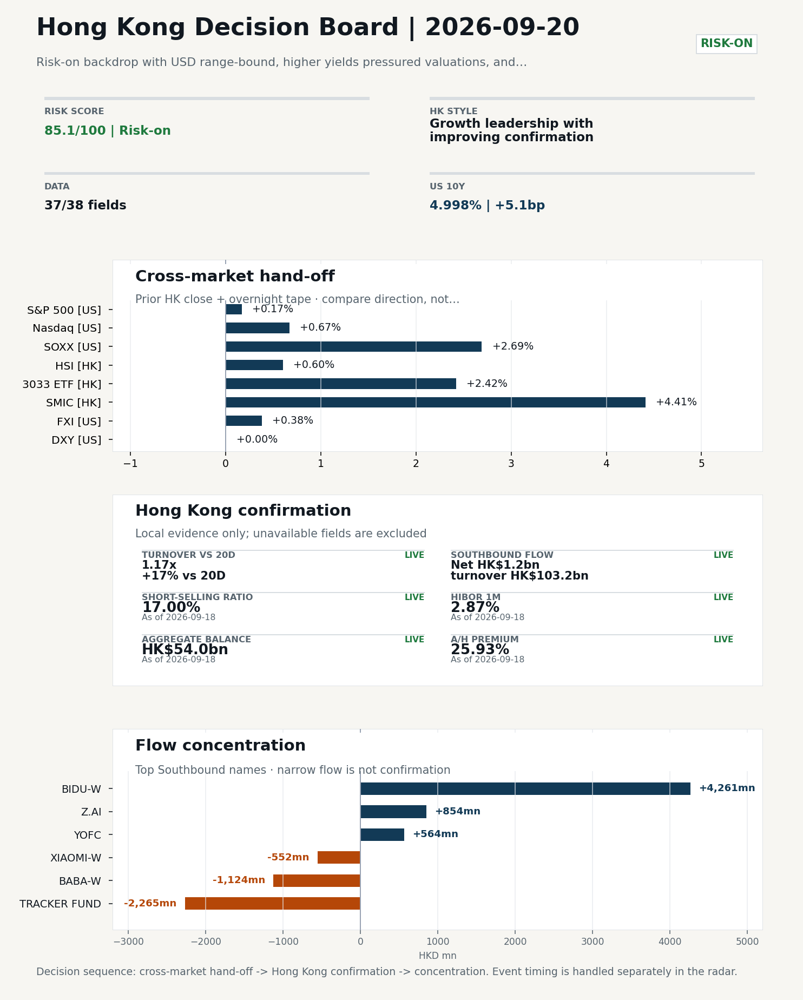
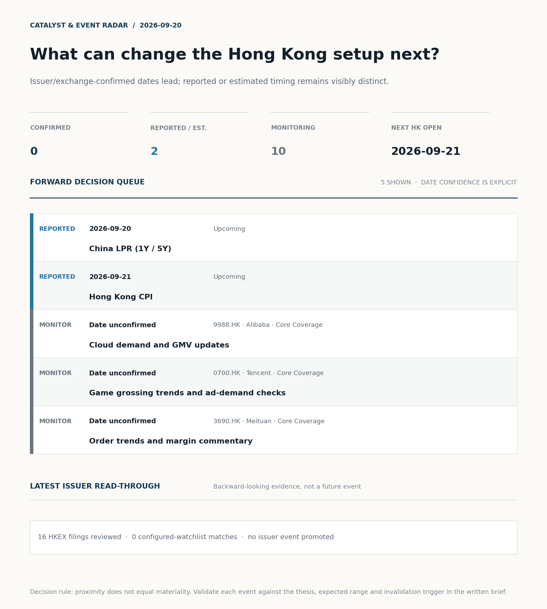
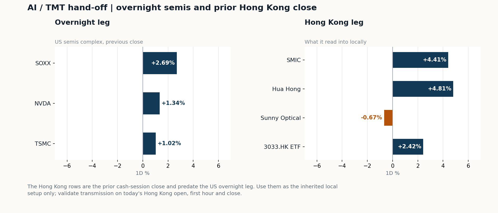
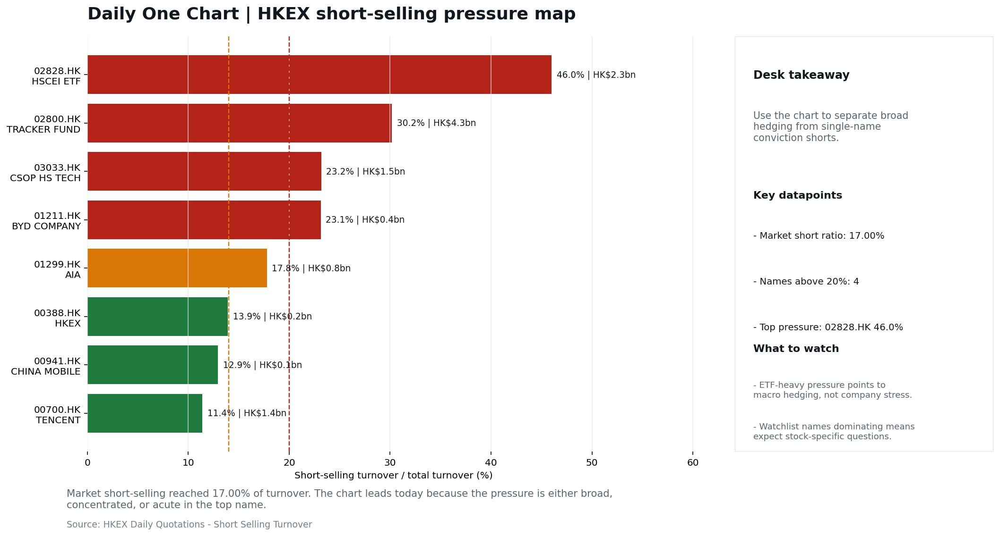
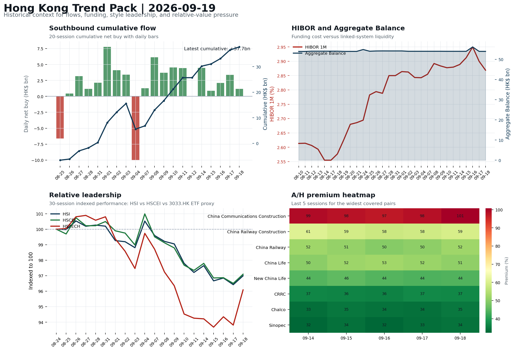

# Morning Research Workbench | 2026-09-20

> **Commute reading route:** `Layer 1 scan (5 min)` → `Layer 2 deep read` → `Layer 3 and appendix if time allows`
>
> Mode: `Weekly Review` | Synthesize the completed Hong Kong week into next-week preparation rather than treating Sunday as a fresh session.

_Data through: US/global `2026-09-18` | HK `2026-09-18` | A-share `2026-09-18` | Generated `2026-09-20 07:03:04`_

## Executive Summary

- **Did yesterday's call work?** UNRESOLVED - No comparable next close is available yet, so the call is still open.
- **What changed overnight?** Semis led higher: SOXX +2.69%, NVDA +1.34%, TSMC +1.02%. HSI +0.60% and 3033.HK +2.42%.
- **What it means for AI/TMT** Style, not beta - Growth leadership with improving confirmation, a 1.81pp spread. Favor relative strength in internet/platform names, but do not treat the move as broad China risk-on until participation confirms.
- **What to watch today** China LPR (1Y / 5Y). Confirm if SMIC and Hua Hong open in the same direction as the overnight leg and hold it through the first hour; invalidate if they track HSCEI instead.

## Layer 1 | Weekly Scan (5 min)

### 1.1 Last Week's Call
**Verdict: UNRESOLVED.** No comparable next close is available yet, so the call is still open.

**Recent record.** 6 confirmed / 4 broken over the last 10 scoreable calls (60.0% hit rate). This is a directional close-to-close diagnostic, not a track record.

### 1.2 Opening Decision Board

**Global-to-Hong Kong signals**

_Decision-useful subset: each row states the implication and the next test. Descriptive secondary monitors are kept out of the five-minute scan._

| Signal | Last / move | Interpretation | Confirmation / invalidation |
| --- | --- | --- | --- |
| S&P 500 | 7,650.50 / +0.17% | Broad US risk rose as volatility drained out of the tape, which sets the external floor Hong Kong opens against. Falling volatility confirms lower near-term stress. | Watch whether Nasdaq and offshore-China proxies move the same way. |
| Nasdaq 100 | 29,644.17 / +0.67% | Growth outperformed broad beta, a supportive style signal for Hong Kong internet and platform names. Growth advanced despite higher yields, showing momentum resilience but also higher reversal sensitivity. | 3033.HK versus HSI leadership carries the read; rising yields would undo it. |
| Hang Seng Index | 24,750.78 / +0.60% | The index was carried by growth and platform names, not by broad participation: 3033.HK differs by 1.82pp. | Southbound participation decides whether this is investable or just a print. |
| Hang Seng TECH ETF (3033.HK) | 4.3200 / **+2.42%** | Hong Kong growth led broad beta, improving the platform/internet style signal. | Needs a stable CNH and Southbound buying to become a duration signal. |
| Semiconductors (SOXX) | 533.07 / **+2.69%** | Semis led the Nasdaq by 2.02pp, putting the AI capex trade back in front. | SMIC and Hua Hong at the open show whether it transmits to Hong Kong. |
| US 10Y | 4.9980% / +5.1bp | The yield proxy rose, tightening the discount-rate backdrop for long-duration Hong Kong growth. | Read it through 3033.HK relative performance, not the index level. |
| USD/CNH | 6.7075 / -0.08% | A stronger offshore renminbi supports the external-risk backdrop for Hong Kong equities. | FXI and Southbound flow decide whether this reaches Hong Kong equities. |
| VIX | 14.81 / **-4.08%** | Lower implied volatility reduces near-term stress, but is supportive only if equity breadth confirms. | Falling volatility on narrowing breadth is a warning, not support. |

_Secondary monitors retained in the source bundle: SMIC (0981.HK), CSI 300, China 10Y, CN-US 10Y spread, DXY, USD/HKD, Brent crude, COMEX gold, Copper._

**Hong Kong local confirmation**

| Check | Value | Status | Source / as of | Why it matters |
| --- | --- | --- | --- | --- |
| Main Board turnover vs 20D | 1.17x \| +17% vs 20D | Live local | HKEX \| 2026-09-18 | Trailing 20-session average turnover was HK$228.2bn. |
| Southbound / Northbound net flow | Southbound Net HK$1.2bn \| turnover HK$103.2bn \| Northbound Turnover RMB333.9bn \| net not reported | Live local | HKEX Connect \| 2026-09-18 | Southbound net buy is calculated from HKEX disclosed buy and sell turnover. |
| Short-selling ratio | 17.00% | Live local | HKEX \| 2026-09-18 | Official HKEX stock-level short-selling table, aggregated as a share of total market turnover. |
| AH premium index | 25.93% | Live public | Yahoo \| 2026-09-18 | Fixed 10-name basket, equal-weighted, both legs priced on the same date; comparable across dates. Covered-pair average was +35.02% across 17 pairs. |
| USD/HKD spot vs band | 7.8459 \| band 7.7500 to 7.8500 | Live quote + local | Yahoo \| 2026-09-18 | 41 pips from the weak-side CU (7.8500); monitor HKMA operations and the aggregate balance for a funding squeeze. Official Convertibility Undertakings define the linked-rate stress boundaries for USD/HKD. |
| HIBOR 1M | 2.87% | Live local | HKMA \| 2026-09-18 | 1M HIBOR is the cleanest quick read for Hong Kong funding conditions and equity-duration pressure. |
| Hong Kong leadership | Growth leadership with improving confirmation | Proxy | HSI / HSCEI / 3033.HK ETF relative \| 2026-09-18 | Use HSI / HSCEI / 3033.HK ETF relative moves as the opening style read. |

**Risk state and evidence**

**Composite risk score:** `85.1/100` | **Regime:** `Risk-on`

| Component | Score impact | Evidence |
| --- | --- | --- |
| US beta | +1.0 | S&P 500 +0.17% |
| HK growth ETF proxy | +10 | 3033.HK ETF +2.42% |
| Semis complex | +9 | SOXX +2.69% |
| Offshore China proxy | +1.9 | FXI +0.38% |
| Dollar pressure | -0.0 | DXY +0.00% |
| Volatility | +8.2 | VIX -4.08% |
| HK short-selling | +0 | Short-selling ratio 17.00% |
| HK turnover | +5 | Turnover 1.17x 20D |

_Base 50 plus the component deltas above. Semis complex entered the score on 2026-08-22; earlier scores in the ledger exclude it._

**Next Week Checklist**

1. **Risk-on backdrop with USD range-bound, higher yields pressured valuations, and Nasdaq 100 outperformed FXI**
 Still-moving markets | No fresh Hong Kong cash session is assumed; use global active assets and policy/event flow to prepare the next open.
2. **China LPR (1Y / 5Y) (Upcoming)**
 Macro / policy | Watch whether it changes the day's core market narrative | Industries: Market-wide
3. **Hong Kong CPI (Upcoming)**
 Macro / policy | Local funding conditions, retail purchasing power, and HKD real rates | Industries: Property, Retail, Banks
4. **VIX -4.08%**
 High-frequency data | Lower volatility signals easing stress in the tape. (second-order macro context)

## Visual Dashboard

**Catalyst & Event Radar**

**Chart read:** No issuer/exchange-confirmed event date is populated; 2 reported or estimated timing item(s) and 10 undated trigger(s) remain explicit.

_Source: Public calendars, issuer disclosures and configured research watchlists_
## Layer 2 | Core Research (20-30 min)

### 2.1 Global-to-Hong Kong Transmission
> Weekly review mode: synthesize the completed Hong Kong week, retain the main cross-asset and policy lessons, and convert them into next-week preparation rather than treating Saturday as a fresh cash-market session.

**Market Setup**
**Core tape.** Overnight US tape closed risk-on but leadership stayed narrow: Nasdaq 100 (+0.67%) and SOXX (+2.69%) outperformed while the S&P 500 was nearly flat at +0.17%, consistent with the weekly theme of Nasdaq 100 outperforming FXI.
**Main driver.** The deterministic decomposition flags Hong Kong participation as the dominant supportive driver (1.17x 20D turnover) and US 10Y yields rising 5.1bp as a valuation drag.
**HK relevance.** With the prior Hong Kong session already in the books (HSI +0.60%, 3033.HK +2.42%, Southbound +HK$1.2bn), overnight US evidence supports next-week continuation in HK growth/internet but does not upgrade it to a broad beta call yet.

**Key Drivers**
- Hong Kong participation was the dominant supportive driver.
- US 10Y +5.1bp is the explicit valuation drag.
- Cross-asset check: Nasdaq 100 outperformed FXI by 0.176pp, Bitcoin +5.89%, VIX -4.08% all consistent with risk-on, but Euro Stoxx 50 -1.37% shows the bid was US-specific, not a global cyclical impulse.
- Funding lens: USD/HKD at 7.8459 sits 41 pips from the weak-side CU, HIBOR 1M 2.87%, Aggregate Balance HK$54.0bn - HKD liquidity is comfortable but the spot is close enough to the band to keep the linked-rate plumbing on the desk watchlist for the 21 Sep open.

**Hong Kong Read-Through**
**Opening implication.** For the 21 Sep open, treat next week as growth-led continuation conditional on confirmation.
_Hong Kong style leadership and flow confirmation are set out in the Hong Kong review below._

**Watch Points**
- USD composite moved lower by -0.02pct intraday, with a 0.389pct range.
- Main turning points appeared around 2026-09-18 08:05 trough / 2026-09-18 08:30 peak / 2026-09-18 08:55 trough, suggesting event-driven repricing rather than a clean one-way USD move.
- The biggest cross-asset divergence was Nasdaq 100 versus FXI, a spread of 0.176pct.
- Gold moved +0.57pct intraday with a 1.275pct high-low range.

**Weekly Review Map**
- Weekly review window: 2026-09-14 to 2026-09-18. Core regime: Risk-on backdrop with USD range-bound, higher yields pressured valuations, and Nasdaq 100 outperformed FXI. Hong Kong leadership: Hong Kong growth / internet led.
- Method note: Trend summary uses the latest available five observations from the Hong Kong Trend Pack inputs.

**Cross-asset weekly dashboard**

| Asset | Latest move | Weekly read |
| --- | --- | --- |
| S&P 500 | +0.17% | Risk appetite |
| Nasdaq 100 | +0.67% | Growth style |
| Hang Seng Index | +0.60% | Hong Kong beta |
| Hang Seng TECH ETF (3033.HK) | +2.42% | Hong Kong growth / internet proxy |
| DXY | +0.00% | Global liquidity |
| US 10Y Treasury Yield | +5.1bp | Rates path |
| Gold | +0.57% | Hedge / real yields |
| VIX | -4.08% | Volatility and hedging |

**Hong Kong / China weekly tape**

| Signal | Latest move | Read |
| --- | --- | --- |
| Hang Seng Index | +0.60% | Hong Kong beta |
| Hang Seng China Enterprises Index | +0.61% | China SOE / H-share tone |
| Hang Seng TECH ETF (3033.HK) | +2.42% | Hong Kong growth / internet proxy |
| China Large-Cap (FXI) | +0.38% | China sentiment |
| USD/CNH | -0.08% | China FX sentiment |
| USD/HKD | +0.02% | Hong Kong funding lens |

**Five-session trend evidence**
_Window: 2026-09-14 to 2026-09-18_

| Signal | Five-session change | Latest | Desk read |
| --- | --- | --- | --- |
| Southbound flow | +12.0bn over 5 sessions | +1.2bn | 5/5 positive sessions; cumulative buying is the flow-confirmation test for next week. |
| HKD funding | HIBOR -2bp; Aggregate Balance -0.0bn | 2.87% / HK$54.0bn | Funding stress matters if HIBOR rises while Aggregate Balance contracts. |
| HK style leadership | HSTECH led (+1.9pp); HSCEI lagged (-0.7pp) | HSTECH leadership | Use HSI / HSCEI / 3033.HK ETF spread to separate broad beta from growth-led rerating. |
| A/H premium dispersion | +0.5pp average change | 51.6% average premium | Premium narrowing can support H-share relative demand |

**Flow and attribution clues**
- :
- :

**Next-week desk questions**
- Did Southbound flow confirm the index move, or was the week mainly offshore beta without local money follow-through?
- Did HIBOR and Aggregate Balance point to benign funding, or should tighter HKD liquidity be part of next week's risk case?
- Was leadership broad enough beyond the 3033.HK ETF / platform beta proxy, or was the week concentrated in a narrow style pocket?
- Which dated macro, policy, earnings, or IPO catalyst can realistically change the next-week narrative?
- What single data point would invalidate the base-case market pulse by Monday or Tuesday morning?

**Key developments to retain**

| Bucket | Item | Why it matters |
| --- | --- | --- |
| B | China's AI leaders keep quiet despite U.S. | Assess whether the story can propagate through the China Internet value chain |
| C | AI Agents Test the Limits of Human Oversight | Assess whether the story can propagate through the Semiconductors and AI value chain |
| C | China's August retail sales miss forecast while investment | Assess whether the story can propagate through the Consumer value chain |
| Upcoming | China LPR (1Y / 5Y) | Watch whether it changes the day's core market narrative |
| Upcoming | Hong Kong CPI | Local funding conditions, retail purchasing power, and HKD real rates |

**Next-week playbook**

| Date | Catalyst | Desk read |
| --- | --- | --- |
| 2026-09-20 | China LPR (1Y / 5Y) | Watch whether it changes the day's core market narrative |
| 2026-09-21 | Hong Kong CPI | Local funding conditions, retail purchasing power, and HKD real rates |

**Curated overnight stories**
1. **Three words from Kevin Warsh have Wall Street wondering how far the Fed will go with**
 Why it matters: Warsh-era Fed guidance and the Wednesday rate-hike takeaways reset the US rates path.
 HK read-through: Higher-for-longer US yields pressure HK growth/tech valuations and the HKD real-rate backdrop.
2. **OpenAI and Anthropic are making 10 times more revenue than all Chinese AI models**
 Why it matters: Quantifies the revenue gap between US frontier AI labs and the China AI cohort, framing the competitive backdrop that drove the CNBC 'quiet China AI leaders' story.
 HK read-through: Direct read-across to HK-listed China AI/Internet names (Alibaba, Tencent, plus AI-adjacent names like Z.ai/Moonshot ecosystem proxies).
3. **A Chinese AI company just connected its model to Wall Street's leading data providers**
 Why it matters: An actionable counterpoint to the 'revenue gap' headline: a China AI lab has product-level integration with top US data vendors.
 HK read-through: Supports selective re-rating theses inside the China Internet/AI bucket.
4. **China's August retail sales miss forecast while investment slump deepens, piling**
 Why it matters: Soft consumption + deepening investment drag, against still-firm industrial output, reinforces the supply-demand imbalance warning from Beijing.
 HK read-through: Pressure on Consumer, Property, and policy-sensitive cyclicals into the 21 Sep open; pairs with the upcoming China LPR decision and Hong Kong CPI as the next-week macro trio.
5. **Warren Buffett steps down as chairman of Berkshire Hathaway**
 Why it matters: Generational leadership change at a US long-duration/quality anchor.
 HK read-through: Indirect: may colour positioning in HK-listed consumer/financial names tied to long-horizon capital allocation narratives; not a Monday market mover on its own.

**AI / TMT hand-off**

**Overnight leg.** The overnight semis leg was risk-on at +1.68% average (SOXX +2.69%, NVDA +1.34%, TSMC +1.02%).
**Hong Kong expression.** SMIC, Hua Hong and Sunny Optical are best placed at the open, and 3033.HK should be tested before the Hang Seng Index.
**Observable test.** Confirm if SMIC and Hua Hong open in the same direction as the overnight leg and hold it through the first hour; invalidate if they track HSCEI instead, which would mean local flow is overriding the global cycle.

| Name | Role in the chain | 1D | Leg |
| --- | --- | --- | --- |
| SOXX | Semis complex | +2.69% | overnight |
| NVDA | AI capex narrative | +1.34% | overnight |
| TSMC | Foundry demand | +1.02% | overnight |
| SMIC | Leading-edge / domestic substitution | +4.41% | Hong Kong |
| Hua Hong | Mature-node pricing cycle | +4.81% | Hong Kong |
| Sunny Optical | Hardware and optics supply chain | -0.67% | Hong Kong |
| 3033.HK ETF | Broad HK tech beta | +2.42% | Hong Kong |

**Clock discipline.** The Hong Kong rows are the prior cash-session close and predate the US overnight leg. Use them as the inherited local setup only; validate transmission on today's Hong Kong open, first hour and close.

### 2.2 Hong Kong Local Tape and Flow
**Local Tape Setup**
**Local read.** Week ended 18 Sep closed risk-on but narrow: Nasdaq 100 (+0.67%) and SOXX (+2.69%) outperformed.
**Verification point.** Hong Kong confirmed the same lane on Friday's cash tape: HSI +0.60%, HSCEI +0.61%, 3033.HK ETF +2.42%, Main Board turnover 1.17x 20D, Southbound net +HK$1.2bn, short ratio 17.00%.
**Risk to watch.** Decomposition flags HK participation as the dominant supportive driver (score 1.68) against a valuation drag from US 10Y +5.1bp.

**Style and Local Leadership**
**Style call.** Growth leadership with improving confirmation.
- **Evidence:** 3033.HK moved +2.42% and beat HSCEI by +1.81pp and HSI by +1.82pp
- **Portfolio meaning:** Favor relative strength in internet/platform names, but do not treat the move as broad China risk-on until participation confirms.
- **Cross-market read:** Hang Seng +0.60% / HSCEI +0.61% / 3033.HK ETF +2.42%. Offshore China proxy FXI +0.38% and USD/CNH N/A frame cross-border risk appetite. USD/HKD last traded around 7.8459, which keeps the Hong Kong funding lens in focus.

**Flow Confirmation**
Official Stock Connect evidence is available; the Flow Tracker confirms whether local money supports the price action.

**Follow-Through Checklist**
**Follow-through check.** Confirmation test for the 21 Sep open: (1) 3033.HK ETF must hold its lead over HSCEI on a session with HK Main Board turnover at or above 1.10x the 20D average.
**Failure condition.** Invalidate if 3033.HK loses its lead to HSCEI, or if weak turnover, rising shorts, and CNH depreciation persist together.

**Cross-asset attribution**

| Driver | Direction | Score | Evidence | HK implication |
| --- | --- | --- | --- | --- |
| Hong Kong participation | supportive | 1.68 | Main Board turnover was 1.17x the 20-session average. | Higher participation makes local price action more credible. |
| Rates impulse | drag | 0.76 | US 10Y yield moved +5.1bp. | Lower yields help long-duration growth; higher yields pressure valuation-sensitive |

**Local flow evidence**

**Flow Takeaways**
- Hong Kong participation is active and short pressure is not excessive, so local confirmation looks healthier.
- Stock Connect Southbound: net HK$1.2bn on turnover HK$103.2bn (as of 2026-09-18).
- Stock Connect Northbound: turnover RMB333.9bn; public file provides total turnover/top active names, not full net-buy.
- AH premium: fixed 10-name basket +25.93% (comparable across dates); covered-pair average +35.02% over 17 pairs; widest premium: China Communications Construction 100.81%.

**Stock Connect Southbound Active Names**

| # | Ticker | Name | Buy | Sell | Net buy | HKEX turnover rank |
| --- | --- | --- | --- | --- | --- | --- |
| 1 | 09888.HK | BIDU-W | HK$4,271.6mn | HK$10.5mn | HK$4,261.2mn | 1 |
| 2 | 02800.HK | TRACKER FUND | HK$0.4mn | HK$2,265.3mn | HK$-2,264.9mn | 4 |
| 3 | 09988.HK | BABA-W | HK$1,417.2mn | HK$2,541.0mn | HK$-1,123.8mn | 3 |
| 4 | 02513.HK | Z.AI | HK$3,168.0mn | HK$2,314.4mn | HK$853.6mn | 1 |
| 5 | 06869.HK | YOFC | HK$1,810.1mn | HK$1,245.7mn | HK$564.4mn | 6 |

**AH Premium Dispersion**

| Name | A ticker | H ticker | Premium | As of |
| --- | --- | --- | --- | --- |
| China Communications Construction | 601800.SS | 1800.HK | +100.81% | 2026-09-18 |
| China Railway Construction | 601186.SS | 1186.HK | +59.37% | 2026-09-18 |
| China Railway | 601390.SS | 0390.HK | +52.10% | 2026-09-18 |

**HKEX Short-Selling Watch**

| Ticker | Name | Short ratio | Short turnover | Total turnover |
| --- | --- | --- | --- | --- |
| 00388.HK | HKEX | 13.93% | HK$0.2bn | HK$1.6bn |
| 00700.HK | TENCENT | 11.40% | HK$1.4bn | HK$12.2bn |
| 00941.HK | CHINA MOBILE | 12.94% | HK$0.1bn | HK$0.6bn |

- **Short-value leaders:** 02800.HK TRACKER FUND (HK$4.3bn); 02828.HK HSCEI ETF (HK$2.3bn); 09888.HK BIDU-W (HK$1.7bn); 03033.HK CSOP HS TECH (HK$1.5bn).

### 2.3 Macro Transmission
**Desk read.** The closed Hong Kong week (2026-09-14 to 2026-09-18) closed risk-on, with USD range-bound, higher yields pressuring valuations, and Nasdaq 100 outperforming FXI.

**Market sensitivity.** Within that backdrop, the macro agenda is light but contains two distinct repricing channels.

**HK implication.** First, the China LPR on 2026-09-20 is the cleanest read on easing intent: any cut would reinforce the risk-on backdrop and likely extend H-share relative demand.

**Macro watchpoints**
- China 1Y/5Y LPR on 2026-09-20: cut vs. hold and implication for H-share relative demand vs. the 51.6% A/H premium.
- Southbound flow on 2026-09-21 open: whether the +12.0bn weekly cumulative continues or rolls, given HSTECH's 1.9pp leadership over HSCEI's
- HKD funding (HIBOR, Aggregate Balance) into Monday: any combination of rising HIBOR with contracting Aggregate Balance would stress the
- Hong Kong CPI on 2026-09-21 for Property / Retail / Banks read-through via HKD real-rate channel, while recognising limited direct equity

| Time | Region | Event | Status | Desk read |
| --- | --- | --- | --- | --- |
| | CN | China LPR (1Y / 5Y) | Upcoming | Impact: Watch whether it changes the day's core market narrative \| Attention: 5/5 \| Industries: Market-wide |
| | HK | Hong Kong CPI | Upcoming | Impact: Local funding conditions, retail purchasing power, and HKD real rates \| Attention: 1/5 \| Industries: Property, Retail, Banks |

**Positioning and risk backdrop**

- Detailed local flow evidence is covered under Flow Tracker and Attribution; keep this section focused on options, hedging, and macro-positioning risk.

### 2.4 Company Micro Research and Catalysts

| Grade | Sector | Headline | Why it matters | Horizon |
| --- | --- | --- | --- | --- |
| B | China Internet | China's AI leaders keep quiet despite U.S. 'publicity' on tech risks | Assess whether the story can propagate through the China Internet value | Monitor |

**Company Event Takeaway**
**Desk read.** Weekly review (Sep 14 - 18): The HK cash tape closed Friday with a risk-on tone, USD range-bound and higher yields pressuring valuations; Nasdaq 100 outperformed FXI, leaving the offshore China tape as a relative laggard.
**Why it matters.** Within our watchlist, Alibaba (9988.HK) was the single notable mover, +4.00% on the session to HK$109.3 and mid-range at 51% of its 60-session band - enough to test whether a catalyst can carry into the wider China Internet group.
**Follow-up.** Tencent (0700.HK) drifted marginally lower (-1.64%) and remains in the bottom quartile (9%) of its 60-session band, so we read it as a marginal-information gauge rather than a signal.

**LLM Quick Takes**
- **9988.HK** | Fact: +4.00% on the session to HK$109.3; range position 51% (mid-range). Read: Friday was the strongest single move in our watchlist and reached the 60-session midpoint. Implication…
- **0700.HK** | Fact: -1.64% to HK$419.0; range position 9% (bottom of 60-session band). Read: underperformed 9988.HK on the session and remains in the bottom quartile despite the ETF bounce.…
- **3033.HK** | Fact: +2.42% to HK$4.32; range position 21% (bottom quartile). Read: a depressed-base bounce that has not yet cleared the 60-session midpoint. Implication…
- **2828.HK** | Fact: +1.14% to HK$85.4; range position 66% (mid-range). Read: a quiet, range-bound session with no signal value. Implication: H-share leadership is not the active trade this week.…

Decision filter<h4>No immediate portfolio catalyst: 16 official filings were screened and the low-signal market set stays aggregated.</h4>
16 profit warnings

<strong>16</strong>Official filings

<strong>0</strong>Watchlist hits

<strong>0</strong>Actionable events

<article class="event-card priority-monitor">

MonitorEarnings<time>2026-10-20</time>

<h5>China Mobile · 0941.HK</h5>

Estimate comparison unavailable

Investor read
Calendar monitor only; no consensus comparison is available, so this is not yet an earnings view.

Next check
Confirm timing and obtain a consensus/KPI frame before promoting this event.

<a class="event-source" href="https://finance.yahoo.com/quote/0941.HK">Yahoo Finance ticker calendar ↗</a>
</article>

<strong>Coverage boundary.</strong> sell-side rating changes, IPO / grey-market monitor were not decision-grade in this run; their absence is not treated as confirmation that no event exists.

**Core coverage requiring follow-up**

**Core coverage**

| Name | Ticker | Last | 1D | Range position | Morning note |
| --- | --- | --- | --- | --- | --- |
| Alibaba | 9988.HK | 109.30 | +4.00% | Mid-range | Up 4.00% on the session, mid-range at 51% of its 60-session band. |
| Tencent | 0700.HK | 419.00 | -1.64% | Bottom of range | Marginally lower (-1.64%), still in the bottom quartile of its 60-session range (9%). |

**Priority follow-up**

| Name | Ticker | Last | 1D | Range position | Morning note |
| --- | --- | --- | --- | --- | --- |
| AIA | 1299.HK | 76.75 | -0.78% | Mid-range | Marginally lower (-0.78%), mid-range at 74% of its 60-session band. |
| BYD Company | 1211.HK | 81.50 | +0.43% | Mid-range | Marginally higher (+0.43%), mid-range at 40% of its 60-session band. |

### 2.5 Morning Meeting Questions
**Q1. The index was +0.60% but tech led at +2.42% - what drove the split?**
- **Evidence:** HSI +0.60% versus 3033.HK +2.42%, a 1.82pp spread.
- **How to answer:** Growth carried the session: the 1.82pp spread means the move was concentrated in platform and tech names rather than broad beta.

## Layer 3 | Session Playbook (8-12 min)

### 3.1 Base Case and Scenario Map
**Starting posture.** Growth leadership with improving confirmation (high confidence); composite risk `85.1/100` (Risk-on). Favor relative strength in internet/platform names, but do not treat the move as broad China risk-on until participation confirms.

**Scenario map**

| Scenario | Observable trigger | Interpretation | Research response |
| --- | --- | --- | --- |
| Selective growth confirms | 3033.HK keeps a >0.5pp first-hour lead over HSCEI; SMIC and Hua Hong stop lagging broad beta; CNH is stable. | The prior style split has live price confirmation, but is not yet broad China risk-on. | Prioritize internet/platform relative strength; verify participation again at the close. |
| Broad beta takes over | HSI and HSCEI rise together, breadth improves and the 3033.HK lead narrows without turning negative. | Leadership is broadening from a style trade into market beta. | Expand the research set from growth leaders to financials, SOEs and index-heavy names. |
| Risk-off continuation | 3033.HK loses its lead, semis underperform HSCEI and CNH depreciation accelerates. | The prior divergence was a temporary pocket of strength rather than a durable hand-off. | Treat rebounds as unconfirmed; focus on balance-sheet, catalyst and crowding risk. |

**Clocked validation scorecard**

| Window | Check | Prior evidence | Pass condition | What it decides |
| --- | --- | --- | --- | --- |
| 09:30-10:30 | 3033.HK vs HSCEI | +1.81pp at the prior close | 3033.HK retains >0.5pp relative lead | Whether growth leadership survives the open |
| 09:30-10:30 | Semiconductor hand-off | SMIC +4.41%; Hua Hong Semiconductor +4.81% | Stabilise after the open; at least one stops underperforming HSCEI | Whether overnight semis pressure is contained locally |
| 09:30-10:30 | HSI price zone | 24,751 vs 24,500 / 25,000 reference grid | Hold above the lower grid or reclaim the upper grid with breadth | Whether broad beta is stabilising; grid is derived, not technical analysis |
| 09:30-10:30 | USD/CNH | 6.7075 \| -0.08% | No acceleration in CNH depreciation | Whether FX permits a clean Hong Kong risk extension |
| At close | Turnover | 1.17x \| +17% vs 20D | At least 1.0x the 20-session average | Whether the move had normal participation |
| At close | Southbound | Net HK$1.2bn \| turnover HK$103.2bn | Net buying remains positive and broadens beyond one or two names | Whether mainland money confirms the price move |
| At close | Short pressure | 17.00% | Falls versus the prior verified reading (17.00%) | Whether rebound conviction improved |

**Upgrade rule.** Confirm if 3033.HK keeps outperforming HSCEI with at least normal turnover, broader Southbound buying, stable CNH, and easing short pressure.
**Kill switch.** Invalidate if 3033.HK loses its lead to HSCEI, or if weak turnover, rising shorts, and CNH depreciation persist together.
**Clock discipline.** At 07:30, same-day Southbound, turnover and short-selling outcomes are not known. Use the first-hour price/FX checks provisionally and make the final classification only after the close.
**Event clock.** Same-day decision items: China LPR (1Y / 5Y), China LPR (1Y / 5Y).

### 3.2 Conditional Theme Deep Dive

| Field | Read |
| --- | --- |
| Theme | AI and Compute Chain |
| Angle for the day | Track whether global AI capex, semis, cloud, and server demand are still carrying offshore China internet and hardware sentiment. |

**Theme desk read**
**Core thesis.** The AI and Compute Chain theme closed the Sep-14 to Sep-18 week with the right backdrop but without clear local confirmation.
**Evidence.** Global semis (SOXX +2.69%, NVDA +1.34%, TSMC ADR +1.02%) and lower VIX (-4.08%) framed a supportive tape, yet the Hong Kong reads are mixed.
**What to test.** That is enough to call it a flow-confirmed, growth-led rerating rather than pure offshore beta.

**Signals to keep in mind**
- China's AI leaders keep quiet despite U.S. 'publicity' on tech risks: Assess whether the story can propagate through the China Internet
- AI Agents Test the Limits of Human Oversight: Assess whether the story can propagate through the Semiconductors and AI value chain
- SOXX +2.69%: Semis rallied, giving HK semis and platform beta a supportive open.
- VIX -4.08%: Lower volatility signals easing stress in the tape.

**LLM watch items:**
- Sep-20 China LPR (1Y / 5Y): cleanest read on easing intent; the primary candidate to shift the AI/Compute narrative either way.
- Sep-21 Hong Kong CPI: limited direct equity impact under the peg, but feeds the HKD real-rate and retail demand read for Property/Retail/Banks.
- Southbound flow follow-through on Sep-21 open: 5/5 positive sessions and +12.0bn cumulative set the bar
- Leadership breadth beyond 3033.HK / HSTECH: HSCEI lagged by -0.7pp vs HSTECH +1.9pp, so watch whether mainland names (Tencent at 9% range, AIA at
- China AI-leader silence propagation: track any statements from Alibaba, Tencent or peers into next week

**Related names to keep close:**

| Name | Ticker | Bucket | Morning read |
| --- | --- | --- | --- |
| Alibaba | 9988.HK | Core coverage | Up 4.00% on the session, mid-range at 51% of its 60-session band. |
| Tencent | 0700.HK | Core coverage | Marginally lower (-1.64%), still in the bottom quartile of its 60-session range (9%). |
| AIA | 1299.HK | Priority follow-up | Marginally lower (-0.78%), mid-range at 74% of its 60-session band. |

**Upcoming catalysts tied to the theme:**
- 2026-09-21 | Hong Kong CPI | Local funding conditions, retail purchasing power, and HKD real rates

**Relevant headlines:**
- [China's AI leaders keep quiet despite U.S. 'publicity' on tech risks](https://www.cnbc.com/2026/09/16/chinas-ai-leaders-keep-quiet-despite-us-publicity-on-tech-risks.html)
- [AI Agents Test the Limits of Human Oversight](https://www.bloomberg.com/news/videos/2026-09-19/ai-agents-test-the-limits-of-human-oversight-video)
- [China's August retail sales miss forecast while investment slump deepens, piling pressure on Beijing](https://www.cnbc.com/2026/09/15/china-august-retail-sales-industrial-output-investment-exports-.html)

### 3.3 Daily One Chart
**Daily One Chart | HKEX short-selling pressure map**

**Chart read.** Market short-selling reached 17.00% of turnover.
**Why it matters.** The chart leads today because the pressure is either broad, concentrated, or acute in the top name.

_Source: HKEX Daily Quotations - Short Selling Turnover_

### 3.4 Hong Kong Trend Pack
**Hong Kong Trend Pack**

**Trend read.** Four historical lenses: Southbound cumulative flow, HKMA funding and liquidity, HSI/HSCEI/3033.HK ETF relative leadership, and A/H premium dispersion.

_Source: HKEX Stock Connect, HKMA liquidity data, and public Yahoo Finance quotes_

## Optional Appendix | Traceability and Performance (10-15 min)

### Report Metadata
> Date policy: Review date 2026-09-19 is treated as `Weekly Review`. | Global (US/Europe) data date is 2026-09-18; adapter effective date is 2026-09-18 and summary date is 2026-09-18. | Hong Kong local data date is 2026-09-18; role: last completed HK/China cash-market reference tape.
> Market data quality: Coverage: `37/38` | Stale items (>1d): `1` | Missing: `1`
> Report quality: `94.6/100` | Grade `B` | Status `usable with caveats`

### Report Quality and Validation
- **Quality score:** 94.6/100 | **Grade:** B | **Status:** usable with caveats
- **Run summary:** 8 healthy | 2 caveat | 0 failed
- **Release recommendation:** Send with caveats | The report is usable, but the advisory guidance should travel with it so readers understand the data gaps.

| Source | Status | Bucket |
| --- | --- | --- |
| Macro calendar | partial | caveat |
| Risk and sentiment feed | partial | caveat |

- **Grade capped:** 1 prose defect(s) detected: 1 unbalanced_bracket.

**Narrative fact-check guardrail**
- Checked 23 numeric claims; 0 numeric mismatch(es), 0 logic warning(s); 10 structured claims, 0 source/text warning(s); 0 critical, 0 review.

_Full component weights, per-source freshness, adapter status and provenance records are archived with this report under `audit/` rather than printed here._

### Historical Signal Performance
- **Readiness:** exploratory with caveats | 69 observations | 104 active signal dates | next-close entry, 10bps cost, no same-day returns.
- **Interpretation boundary:** exploratory until a benchmark reaches 252 sessions and 100 active-signal sessions.
- **Data-quality caveat:** 23 conflicting price revision(s) and 6 non-session observation(s) remain in the research ledger.
- **Daily-use boundary:** cumulative return, Sharpe and the performance chart stay out of the daily commute edition until the sample and trading-calendar gates pass; use Yesterday's Call instead.

### Source Links
- [China's AI leaders keep quiet despite U.S. 'publicity' on tech risks](https://www.cnbc.com/2026/09/16/chinas-ai-leaders-keep-quiet-despite-us-publicity-on-tech-risks.html) (cnbc_markets)
- [Meituan (MPNGF) (Q2 2026) Earnings Call Highlights: Record Revenue and Strategic AI Pivot Drive...](https://finance.yahoo.com/markets/stocks/articles/meituan-mpngf-q2-2026-earnings-190123345.html) (GuruFocus.com)
- [China Mobile (SEHK:941): A Closer Look at Valuation After Steady Share Price Gains This Year](https://finance.yahoo.com/news/china-mobile-sehk-941-closer-154022664.html) (Simply Wall St.)
- [00070.HK Profit warning / alert announcement](http://www1.hkexnews.hk/listedco/listconews/sehk/2026/0918/2026091801504.pdf) (HKEXnews)
- [01371.HK Profit warning / alert announcement](http://www1.hkexnews.hk/listedco/listconews/sehk/2026/0918/2026091801846.pdf) (HKEXnews)
- [08093.HK Profit warning / alert announcement](http://www1.hkexnews.hk/listedco/listconews/gem/2026/0918/2026091801904.pdf) (HKEXnews)
- [08156.HK Profit warning / alert announcement](http://www1.hkexnews.hk/listedco/listconews/gem/2026/0918/2026091801732.pdf) (HKEXnews)
- [00513.HK Profit warning / alert announcement](http://www1.hkexnews.hk/listedco/listconews/sehk/2026/0917/2026091700353.pdf) (HKEXnews)
- [00979.HK Profit warning / alert announcement](http://www1.hkexnews.hk/listedco/listconews/sehk/2026/0917/2026091701213.pdf) (HKEXnews)
- [02442.HK Profit warning / alert announcement](http://www1.hkexnews.hk/listedco/listconews/sehk/2026/0917/2026091701685.pdf) (HKEXnews)
- [01975.HK Profit warning / alert announcement](http://www1.hkexnews.hk/listedco/listconews/sehk/2026/0916/2026091600444.pdf) (HKEXnews)
