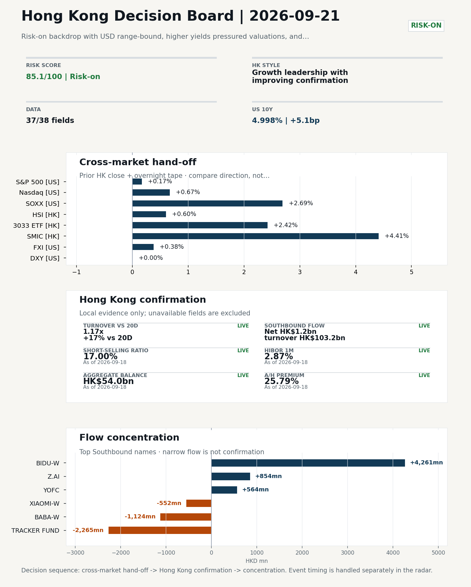
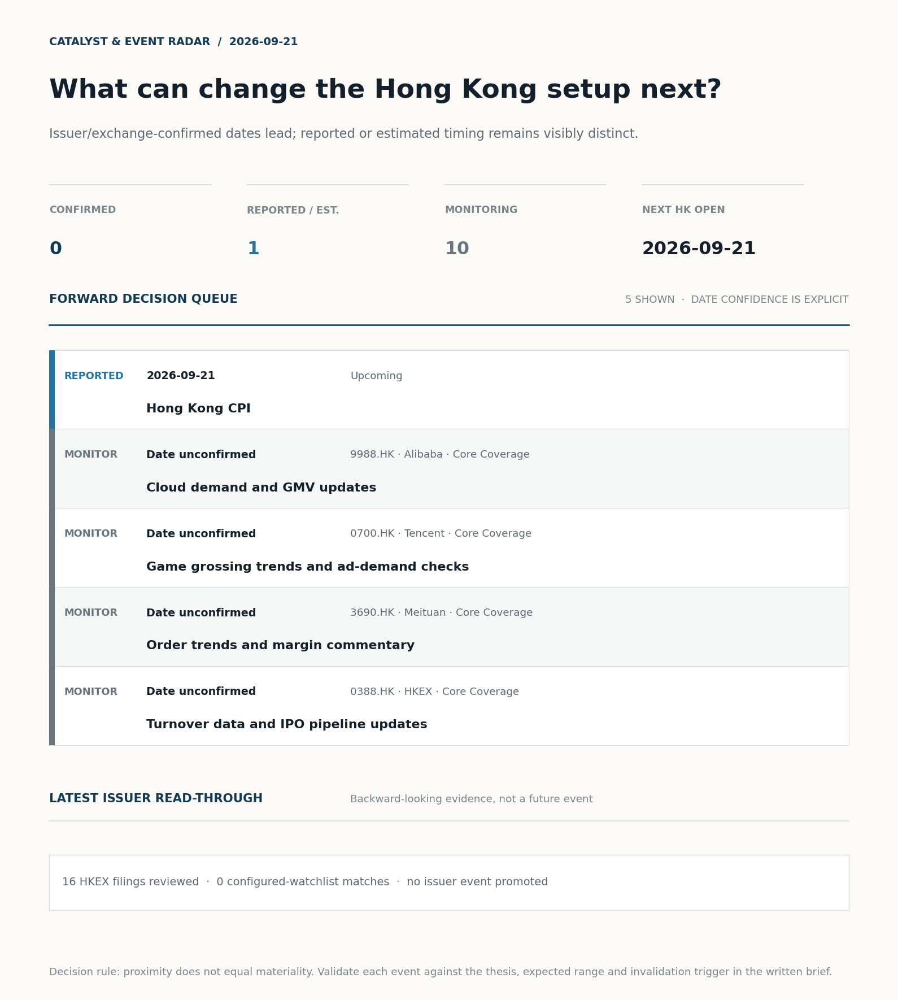

# Morning Research Workbench | 2026-09-21

> **Commute reading route:** `Layer 1 scan (5 min)` → `Layer 2 deep read` → `Layer 3 and appendix if time allows`
>
> Mode: `Week Ahead` | Use Friday's close as the baseline, lay out the week's calendar, and name the key things to watch.

_Data through: US/global `2026-09-18` | HK `2026-09-18` | A-share `2026-09-18` | Generated `2026-09-21 07:15:45`_

## Executive Summary

- **Did yesterday's call work?** UNRESOLVED - No comparable next close is available yet, so the call is still open.
- **What changed overnight?** Semis led higher: SOXX +2.69%, NVDA +1.34%, TSMC +1.02%. HSI +0.60% and 3033.HK +2.42%.
- **What it means for AI/TMT** Style, not beta - Growth leadership with improving confirmation, a 1.81pp spread. Favor relative strength in internet/platform names, but do not treat the move as broad China risk-on until participation confirms.
- **What to watch today** Hong Kong CPI. Confirm if SMIC and Hua Hong open in the same direction as the overnight leg and hold it through the first hour; invalidate if they track HSCEI instead.

## Layer 1 | Reset (5 min)

### 1.1 Last Session's Call
**Verdict: UNRESOLVED.** No comparable next close is available yet, so the call is still open.

**Recent record.** 6 confirmed / 4 broken over the last 10 scoreable calls (60.0% hit rate). This is a directional close-to-close diagnostic, not a track record.

### 1.2 Opening Decision Board

**Global-to-Hong Kong signals**

_Decision-useful subset: each row states the implication and the next test. Descriptive secondary monitors are kept out of the five-minute scan._

| Signal | Last / move | Interpretation | Confirmation / invalidation |
| --- | --- | --- | --- |
| S&P 500 | 7,650.50 / +0.17% | Broad US risk rose as volatility drained out of the tape, which sets the external floor Hong Kong opens against. Falling volatility confirms lower near-term stress. | Watch whether Nasdaq and offshore-China proxies move the same way. |
| Nasdaq 100 | 29,644.17 / +0.67% | Growth outperformed broad beta, a supportive style signal for Hong Kong internet and platform names. Growth advanced despite higher yields, showing momentum resilience but also higher reversal sensitivity. | 3033.HK versus HSI leadership carries the read; rising yields would undo it. |
| Hang Seng Index | 24,750.78 / +0.60% | The index was carried by growth and platform names, not by broad participation: 3033.HK differs by 1.82pp. | Southbound participation decides whether this is investable or just a print. |
| Hang Seng TECH ETF (3033.HK) | 4.3200 / **+2.42%** | Hong Kong growth led broad beta, improving the platform/internet style signal. | Needs a stable CNH and Southbound buying to become a duration signal. |
| Semiconductors (SOXX) | 533.07 / **+2.69%** | Semis led the Nasdaq by 2.02pp, putting the AI capex trade back in front. | SMIC and Hua Hong at the open show whether it transmits to Hong Kong. |
| US 10Y | 4.9980% / +5.1bp | The yield proxy rose, tightening the discount-rate backdrop for long-duration Hong Kong growth. | Read it through 3033.HK relative performance, not the index level. |
| USD/CNH | 6.7075 / -0.08% | A stronger offshore renminbi supports the external-risk backdrop for Hong Kong equities. | FXI and Southbound flow decide whether this reaches Hong Kong equities. |
| VIX | 14.81 / **-4.08%** | Lower implied volatility reduces near-term stress, but is supportive only if equity breadth confirms. | Falling volatility on narrowing breadth is a warning, not support. |

_Secondary monitors retained in the source bundle: SMIC (0981.HK), CSI 300, China 10Y, CN-US 10Y spread, DXY, USD/HKD, Brent crude, COMEX gold, Copper._

**Hong Kong local confirmation**

| Check | Value | Status | Source / as of | Why it matters |
| --- | --- | --- | --- | --- |
| Main Board turnover vs 20D | 1.17x \| +17% vs 20D | Live local | HKEX \| 2026-09-18 | Trailing 20-session average turnover was HK$228.2bn. |
| Southbound / Northbound net flow | Southbound Net HK$1.2bn \| turnover HK$103.2bn \| Northbound Turnover RMB333.9bn \| net not reported | Live local | HKEX Connect \| 2026-09-18 | Southbound net buy is calculated from HKEX disclosed buy and sell turnover. |
| Short-selling ratio | 17.00% | Live local | HKEX \| 2026-09-18 | Official HKEX stock-level short-selling table, aggregated as a share of total market turnover. |
| AH premium index | 25.79% | Live public | Yahoo \| 2026-09-18 | Fixed 10-name basket, equal-weighted, both legs priced on the same date; comparable across dates. Covered-pair average was +34.86% across 17 pairs. |
| USD/HKD spot vs band | 7.8459 \| band 7.7500 to 7.8500 | Live quote + local | Yahoo \| 2026-09-18 | 41 pips from the weak-side CU (7.8500); monitor HKMA operations and the aggregate balance for a funding squeeze. Official Convertibility Undertakings define the linked-rate stress boundaries for USD/HKD. |
| HIBOR 1M | 2.87% | Live local | HKMA \| 2026-09-18 | 1M HIBOR is the cleanest quick read for Hong Kong funding conditions and equity-duration pressure. |
| Hong Kong leadership | Growth leadership with improving confirmation | Proxy | HSI / HSCEI / 3033.HK ETF relative \| 2026-09-18 | Use HSI / HSCEI / 3033.HK ETF relative moves as the opening style read. |

**Risk state and evidence**

**Composite risk score:** `85.1/100` | **Regime:** `Risk-on`

| Component | Score impact | Evidence |
| --- | --- | --- |
| US beta | +1.0 | S&P 500 +0.17% |
| HK growth ETF proxy | +10 | 3033.HK ETF +2.42% |
| Semis complex | +9 | SOXX +2.69% |
| Offshore China proxy | +1.9 | FXI +0.38% |
| Dollar pressure | -0.0 | DXY +0.00% |
| Volatility | +8.2 | VIX -4.08% |
| HK short-selling | +0 | Short-selling ratio 17.00% |
| HK turnover | +5 | Turnover 1.17x 20D |

_Base 50 plus the component deltas above. Semis complex entered the score on 2026-08-22; earlier scores in the ledger exclude it._

**This Week Checklist**

1. **Risk-on backdrop with USD range-bound, higher yields pressured valuations, and Nasdaq 100 outperformed FXI**
 Still-moving markets | No fresh Hong Kong cash session is assumed; use global active assets and policy/event flow to prepare the next open.
2. **China LPR (1Y / 5Y) (Past expected window (unverified))**
 Macro / policy | Watch whether it changes the day's core market narrative | Industries: Market-wide
3. **Hong Kong CPI (Upcoming)**
 Macro / policy | Local funding conditions, retail purchasing power, and HKD real rates | Industries: Property, Retail, Banks
4. **VIX -4.08%**
 High-frequency data | Lower volatility signals easing stress in the tape. (second-order macro context)

## Visual Dashboard

**Catalyst & Event Radar**

**Chart read:** No issuer/exchange-confirmed event date is populated; 1 reported or estimated timing item(s) and 10 undated trigger(s) remain explicit.

_Source: Public calendars, issuer disclosures and configured research watchlists_
## Layer 2 | Core Research (20-30 min)

### 2.1 This Week at a Glance
**Week Ahead Map**
- Week ahead (2026-09-21 to 2026-09-25) opens against a `Risk-on` backdrop, using Friday's close (2026-09-18) as the baseline.

**This Week's Key Events**

| Date | Type | Event | Why it matters |
| --- | --- | --- | --- |
| 2026-09-21 | Upcoming | Hong Kong CPI | Local funding conditions, retail purchasing power, and HKD real rates |

**This Week's Calendar**
_Market open per day: HK ✓/✗, US ✓/✗, CN ✓/✗._

| Day | Markets open | Dated catalysts |
| --- | --- | --- |
| 2026-09-21 Mon | HK✓ US✓ CN✓ | Hong Kong CPI |
| 2026-09-22 Tue | HK✓ US✓ CN✓ | - |
| 2026-09-23 Wed | HK✓ US✓ CN✓ | - |
| 2026-09-24 Thu | HK✓ US✓ CN✓ | - |
| 2026-09-25 Fri | HK✓ US✓ CN✗ | - |

**Base Case / Risk Case**
- **Base case:** Risk-on continuation: leadership stays with growth / platform names and the 3033.HK ETF proxy, supported by flows.
- **Risk case:** A hawkish macro surprise or a sharp USD/CNH leg higher unwinds the risk-on bias and rotates into defensives.

**What to Watch This Week**

| Watch | Why | Invalidation |
| --- | --- | --- |
| Open vs Friday's close (2026-09-18) | Whether the opening gap holds or fades is the first signal of the week. | The gap fades within the first session. |
| Southbound flow | Confirm the index move with local money, not offshore beta. | Southbound stays net-sell while HSI rallies. |
| HSI vs 3033.HK ETF leadership | Growth-led or value-led decides the week's style. | Invalidate if 3033.HK loses its lead to HSCEI, or if weak turnover, rising |
| USD/CNH and USD/HKD | FX stability is the precondition for a clean risk-on extension. | CNH breaks its recent range or USD/HKD tests the weak side. |
| Turnover vs 20-day | Thin participation makes any index move easier to fade. | The index move happens on turnover below 0.9x the 20-day average. |
| First catalyst: Hong Kong CPI | Local funding conditions, retail purchasing power, and HKD real rates | The catalyst resolves against the base case. |

**Weekend Digest**

| Channel | Signal | Why |
| --- | --- | --- |
| News | China's AI leaders keep quiet despite U.S. 'publicity' on tech risks | Assess whether the story can propagate through the China Internet value chain |
| News | China's August retail sales miss forecast while investment slump | Assess whether the story can propagate through the Consumer value chain |
| Vol | VIX -4.08% | Lower volatility signals easing stress in the tape. |
| Crypto | Bitcoin +5.89% | A strong crypto tape reinforces the risk-on read. |
| Commodities | WTI crude -1.58% | Softer oil argues for a more cautious cyclical-growth read. |
| Rates | US 10Y +5.1bp | Higher yields can pressure long-duration and growth valuations. |

**Monday Morning Questions**
- Which single dated catalyst this week is most likely to change the base case?
- Does Southbound flow confirm or contradict the overnight cross-asset tone?
- Is the week likely to be beta-led or driven by a narrow style pocket?
- What data point would invalidate the base case by mid-week?

### 2.3 Macro Transmission
**Desk read.** Week ahead (2026-09-21 to 2026-09-25) opens against a Risk-on backdrop, using Friday's close (2026-09-18) as the baseline.

**Market sensitivity.** The calendar is unusually light: Hong Kong CPI on Monday (2026-09-21) is the only scheduled macro release for the week, with no flagged CN or US events in the supplied data.

**HK implication.** Friday's close already reflects a Nasdaq 100-led tape with SOXX +2.69%, NVDA +1.34%, TSMC ADR +1.02%, and VIX -4.08% to 14.81, while FXI lagged - conditions that favour HK platform and semis beta at the open.

**Macro watchpoints**
- Monday open vs Friday's close (2026-09-18) - does the gap hold or fade within the first session?
- Southbound flow direction - confirm any HSI move with local money, not just offshore beta.
- HSI vs 3033.HK ETF leadership - invalidate if 3033.HK loses lead to HSCEI on weak turnover with rising shorts and CNH depreciation.
- USD/CNH and USD/HKD - CNH breaking its recent range or USD/HKD testing the weak side would unwind the Risk-on bias.

| Time | Region | Event | Status | Desk read |
| --- | --- | --- | --- | --- |
| | CN | China LPR (1Y / 5Y) | Past expected window (unverified) | Impact: Watch whether it changes the day's core market narrative \| Attention: 5/5 \| Industries: Market-wide |
| | HK | Hong Kong CPI | Upcoming | Impact: Local funding conditions, retail purchasing power, and HKD real rates \| Attention: 1/5 \| Industries: Property, Retail, Banks |

**Positioning and risk backdrop**

- Detailed local flow evidence is covered under Flow Tracker and Attribution; keep this section focused on options, hedging, and macro-positioning risk.

### 2.4 Company Micro Research and Catalysts

| Grade | Sector | Headline | Why it matters | Horizon |
| --- | --- | --- | --- | --- |
| B | China Internet | China's AI leaders keep quiet despite U.S. 'publicity' on tech risks | Assess whether the story can propagate through the China Internet value | Monitor |

**Company Event Takeaway**
**Desk read.** Week ahead uses Friday's 2026-09-18 HK close as baseline.
**Why it matters.** With no earnings releases inside the 2026-09-21 to 2026-09-22 window, company-specific drivers are thin.
**Follow-up.** Nearest flagged events sit in late October - November.

**LLM Quick Takes**
- **9988.HK** | Core coverage internet name. No earnings inside the week; the live driver is the TIKR piece flagging RMB 44.73bn FCF burn last quarter vs 45% YoY cloud growth and a $7.3bn AI ARR run rate…
- **0700.HK** | Core coverage internet name. Bottom-quartile of the 60-session range (9%) and marginally lower on 2026-09-18 (-1.64%), so treat tape action as marginal rather than directional until a…
- **1299.HK** | Priority follow-up insurance name. Mid-range (74% of 60-session band) and marginally lower (-0.78%) on 2026-09-18. No fresh catalyst in the week…
- **1211.HK** | Priority follow-up autos name. Mid-range (40% of 60-session band), marginally higher (+0.43%) on 2026-09-18. Earnings on 2026-10-29 is the next hard event…

Decision filter<h4>No immediate portfolio catalyst: 16 official filings were screened and the low-signal market set stays aggregated.</h4>
16 profit warnings

<strong>16</strong>Official filings

<strong>0</strong>Watchlist hits

<strong>0</strong>Actionable events

<article class="event-card priority-monitor">

MonitorEarnings<time>2026-10-20</time>

<h5>China Mobile · 0941.HK</h5>

Estimate comparison unavailable

Investor read
Calendar monitor only; no consensus comparison is available, so this is not yet an earnings view.

Next check
Confirm timing and obtain a consensus/KPI frame before promoting this event.

<a class="event-source" href="https://finance.yahoo.com/quote/0941.HK">Yahoo Finance ticker calendar ↗</a>
</article>

<strong>Coverage boundary.</strong> sell-side rating changes, IPO / grey-market monitor were not decision-grade in this run; their absence is not treated as confirmation that no event exists.

**Core coverage requiring follow-up**

**Core coverage**

| Name | Ticker | Last | 1D | Range position | Morning note |
| --- | --- | --- | --- | --- | --- |
| Alibaba | 9988.HK | 109.30 | +4.00% | Mid-range | Up 4.00% on the session, mid-range at 51% of its 60-session band. |
| Tencent | 0700.HK | 419.00 | -1.64% | Bottom of range | Marginally lower (-1.64%), still in the bottom quartile of its 60-session range (9%). |

**Recent headlines for Alibaba:**
- [Alibaba Burned RMB 44.73 Billion in Free Cash Flow Last Quarter. The Numbers Tell a Messier Story.](https://www.tikr.com/blog/alibaba-burned-rmb-44-73-billion-in-free-cash-flow-last-quarter-the-numbers-tell-a-messier-story?ref=yahoofinance) (TIKR)

**Priority follow-up**

| Name | Ticker | Last | 1D | Range position | Morning note |
| --- | --- | --- | --- | --- | --- |
| AIA | 1299.HK | 76.75 | -0.78% | Mid-range | Marginally lower (-0.78%), mid-range at 74% of its 60-session band. |
| BYD Company | 1211.HK | 81.50 | +0.43% | Mid-range | Marginally higher (+0.43%), mid-range at 40% of its 60-session band. |

### 2.5 Morning Meeting Questions
**Q1. The index was +0.60% but tech led at +2.42% - what drove the split?**
- **Evidence:** HSI +0.60% versus 3033.HK +2.42%, a 1.82pp spread.
- **How to answer:** Growth carried the session: the 1.82pp spread means the move was concentrated in platform and tech names rather than broad beta.

## Layer 3 | Session Playbook (8-12 min)

### 3.1 Base Case and Scenario Map
**Starting posture.** Growth leadership with improving confirmation (high confidence); composite risk `85.1/100` (Risk-on). Favor relative strength in internet/platform names, but do not treat the move as broad China risk-on until participation confirms.

**Scenario map**

| Scenario | Observable trigger | Interpretation | Research response |
| --- | --- | --- | --- |
| Selective growth confirms | 3033.HK keeps a >0.5pp first-hour lead over HSCEI; SMIC and Hua Hong stop lagging broad beta; CNH is stable. | The prior style split has live price confirmation, but is not yet broad China risk-on. | Prioritize internet/platform relative strength; verify participation again at the close. |
| Broad beta takes over | HSI and HSCEI rise together, breadth improves and the 3033.HK lead narrows without turning negative. | Leadership is broadening from a style trade into market beta. | Expand the research set from growth leaders to financials, SOEs and index-heavy names. |
| Risk-off continuation | 3033.HK loses its lead, semis underperform HSCEI and CNH depreciation accelerates. | The prior divergence was a temporary pocket of strength rather than a durable hand-off. | Treat rebounds as unconfirmed; focus on balance-sheet, catalyst and crowding risk. |

**Clocked validation scorecard**

| Window | Check | Prior evidence | Pass condition | What it decides |
| --- | --- | --- | --- | --- |
| 09:30-10:30 | 3033.HK vs HSCEI | +1.81pp at the prior close | 3033.HK retains >0.5pp relative lead | Whether growth leadership survives the open |
| 09:30-10:30 | Semiconductor hand-off | SMIC +4.41%; Hua Hong Semiconductor +4.81% | Stabilise after the open; at least one stops underperforming HSCEI | Whether overnight semis pressure is contained locally |
| 09:30-10:30 | HSI price zone | 24,751 vs 24,500 / 25,000 reference grid | Hold above the lower grid or reclaim the upper grid with breadth | Whether broad beta is stabilising; grid is derived, not technical analysis |
| 09:30-10:30 | USD/CNH | 6.7075 \| -0.08% | No acceleration in CNH depreciation | Whether FX permits a clean Hong Kong risk extension |
| At close | Turnover | 1.17x \| +17% vs 20D | At least 1.0x the 20-session average | Whether the move had normal participation |
| At close | Southbound | Net HK$1.2bn \| turnover HK$103.2bn | Net buying remains positive and broadens beyond one or two names | Whether mainland money confirms the price move |
| At close | Short pressure | 17.00% | Falls versus the prior verified reading (17.00%) | Whether rebound conviction improved |

**Upgrade rule.** Confirm if 3033.HK keeps outperforming HSCEI with at least normal turnover, broader Southbound buying, stable CNH, and easing short pressure.
**Kill switch.** Invalidate if 3033.HK loses its lead to HSCEI, or if weak turnover, rising shorts, and CNH depreciation persist together.
**Clock discipline.** At 07:30, same-day Southbound, turnover and short-selling outcomes are not known. Use the first-hour price/FX checks provisionally and make the final classification only after the close.
**Event clock.** Same-day decision items: Hong Kong CPI, Hong Kong CPI.

### 3.2 Conditional Theme Deep Dive

| Field | Read |
| --- | --- |
| Theme | AI and Compute Chain |
| Angle for the day | Track whether global AI capex, semis, cloud, and server demand are still carrying offshore China internet and hardware sentiment. |

**Theme desk read**
**Core thesis.** The AI and Compute Chain remains the dominant cross-asset thread into the new week, with last Friday's tape leaving a supportive baseline rather than a fresh directional move.
**Evidence.** For Hong Kong, the read-through is concentrated in the offshore China internet complex and the semis/platform beta layer.
**What to test.** Alibaba (9988.HK) closed at HK$109.30, up 4.0% on the session and sitting mid-range at 51% of its 60-session band.

**Signals to keep in mind**
- China's AI leaders keep quiet despite U.S. 'publicity' on tech risks: Assess whether the story can propagate through the China Internet
- China's August retail sales miss forecast while investment slump deepens, piling pressure on Beijing
- SOXX +2.69%: Semis rallied, giving HK semis and platform beta a supportive open.
- VIX -4.08%: Lower volatility signals easing stress in the tape.

**LLM watch items:**
- Confirm the China LPR (1Y/5Y) official print and market reaction; verify easing intent before drawing a macro conclusion.
- Track follow-through from Alibaba's AI/Cloud segment print (~US$7.3bn AI annualised run-rate, 22-quarter revenue high) into 9988.HK and the wider
- Monitor Tencent (0700.HK) at the bottom of its 60-session range for game grossing and ad demand checkpoints as marginal information proxies for the
- Watch SOXX/NVDA/TSMC ADR price action overnight for confirmation that the supportive baseline holds into the next HK open
- Hong Kong CPI: limited equity impact under the peg, but use it to frame retail purchasing-power narrative and any read-across to HK

**Related names to keep close:**

| Name | Ticker | Bucket | Morning read |
| --- | --- | --- | --- |
| Alibaba | 9988.HK | Core coverage | Up 4.00% on the session, mid-range at 51% of its 60-session band. |
| Tencent | 0700.HK | Core coverage | Marginally lower (-1.64%), still in the bottom quartile of its 60-session range (9%). |
| AIA | 1299.HK | Priority follow-up | Marginally lower (-0.78%), mid-range at 74% of its 60-session band. |

**Upcoming catalysts tied to the theme:**
- 2026-09-21 | Hong Kong CPI | Local funding conditions, retail purchasing power, and HKD real rates

**Relevant headlines:**
- [China's AI leaders keep quiet despite U.S. 'publicity' on tech risks](https://www.cnbc.com/2026/09/16/chinas-ai-leaders-keep-quiet-despite-us-publicity-on-tech-risks.html)
- [China's August retail sales miss forecast while investment slump deepens, piling pressure on Beijing](https://www.cnbc.com/2026/09/15/china-august-retail-sales-industrial-output-investment-exports-.html)

### 3.3 Daily One Chart
**Daily One Chart | HKEX short-selling pressure map**

**Chart read.** Market short-selling reached 17.00% of turnover.
**Why it matters.** The chart leads today because the pressure is either broad, concentrated, or acute in the top name.

_Source: HKEX Daily Quotations - Short Selling Turnover_

## Optional Appendix | Traceability and Performance (10-15 min)

### Report Metadata
> Date policy: Review date 2026-09-20 is treated as `Week Ahead`. | Global (US/Europe) data date is 2026-09-18; adapter effective date is 2026-09-18 and summary date is 2026-09-18. | Hong Kong local data date is 2026-09-18; role: last completed HK/China cash-market reference tape.
> Market data quality: Coverage: `37/38` | Stale items (>1d): `1` | Missing: `1`
> Report quality: `95.6/100` | Grade `A` | Status `usable with caveats`

### Report Quality and Validation
- **Quality score:** 95.6/100 | **Grade:** A | **Status:** usable with caveats
- **Run summary:** 8 healthy | 2 caveat | 0 failed
- **Release recommendation:** Send with caveats | The report is usable, but the advisory guidance should travel with it so readers understand the data gaps.

| Source | Status | Bucket |
| --- | --- | --- |
| Macro calendar | partial | caveat |
| Risk and sentiment feed | partial | caveat |

**Narrative fact-check guardrail**
- Checked 29 numeric claims; 0 numeric mismatch(es), 0 logic warning(s); 9 structured claims, 0 source/text warning(s); 0 critical, 0 review.

_Full component weights, per-source freshness, adapter status and provenance records are archived with this report under `audit/` rather than printed here._

### Historical Signal Performance
- **Readiness:** exploratory with caveats | 69 observations | 104 active signal dates | next-close entry, 10bps cost, no same-day returns.
- **Interpretation boundary:** exploratory until a benchmark reaches 252 sessions and 100 active-signal sessions.
- **Data-quality caveat:** 23 conflicting price revision(s) and 6 non-session observation(s) remain in the research ledger.
- **Daily-use boundary:** cumulative return, Sharpe and the performance chart stay out of the daily commute edition until the sample and trading-calendar gates pass; use Yesterday's Call instead.

### Source Links
- [China's AI leaders keep quiet despite U.S. 'publicity' on tech risks](https://www.cnbc.com/2026/09/16/chinas-ai-leaders-keep-quiet-despite-us-publicity-on-tech-risks.html) (cnbc_markets)
- [Alibaba Burned RMB 44.73 Billion in Free Cash Flow Last Quarter. The Numbers Tell a Messier Story.](https://www.tikr.com/blog/alibaba-burned-rmb-44-73-billion-in-free-cash-flow-last-quarter-the-numbers-tell-a-messier-story?ref=yahoofinance) (TIKR)
- [Meituan (MPNGF) (Q2 2026) Earnings Call Highlights: Record Revenue and Strategic AI Pivot Drive...](https://finance.yahoo.com/markets/stocks/articles/meituan-mpngf-q2-2026-earnings-190123345.html) (GuruFocus.com)
- [China Mobile (SEHK:941): A Closer Look at Valuation After Steady Share Price Gains This Year](https://finance.yahoo.com/news/china-mobile-sehk-941-closer-154022664.html) (Simply Wall St.)
- [00070.HK Profit warning / alert announcement](http://www1.hkexnews.hk/listedco/listconews/sehk/2026/0918/2026091801504.pdf) (HKEXnews)
- [01371.HK Profit warning / alert announcement](http://www1.hkexnews.hk/listedco/listconews/sehk/2026/0918/2026091801846.pdf) (HKEXnews)
- [08093.HK Profit warning / alert announcement](http://www1.hkexnews.hk/listedco/listconews/gem/2026/0918/2026091801904.pdf) (HKEXnews)
- [08156.HK Profit warning / alert announcement](http://www1.hkexnews.hk/listedco/listconews/gem/2026/0918/2026091801732.pdf) (HKEXnews)
- [00513.HK Profit warning / alert announcement](http://www1.hkexnews.hk/listedco/listconews/sehk/2026/0917/2026091700353.pdf) (HKEXnews)
- [00979.HK Profit warning / alert announcement](http://www1.hkexnews.hk/listedco/listconews/sehk/2026/0917/2026091701213.pdf) (HKEXnews)
- [02442.HK Profit warning / alert announcement](http://www1.hkexnews.hk/listedco/listconews/sehk/2026/0917/2026091701685.pdf) (HKEXnews)
- [01975.HK Profit warning / alert announcement](http://www1.hkexnews.hk/listedco/listconews/sehk/2026/0916/2026091600444.pdf) (HKEXnews)
