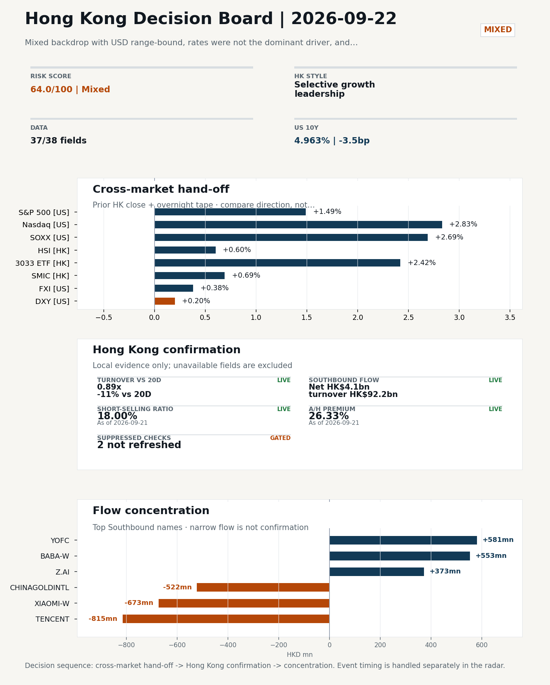
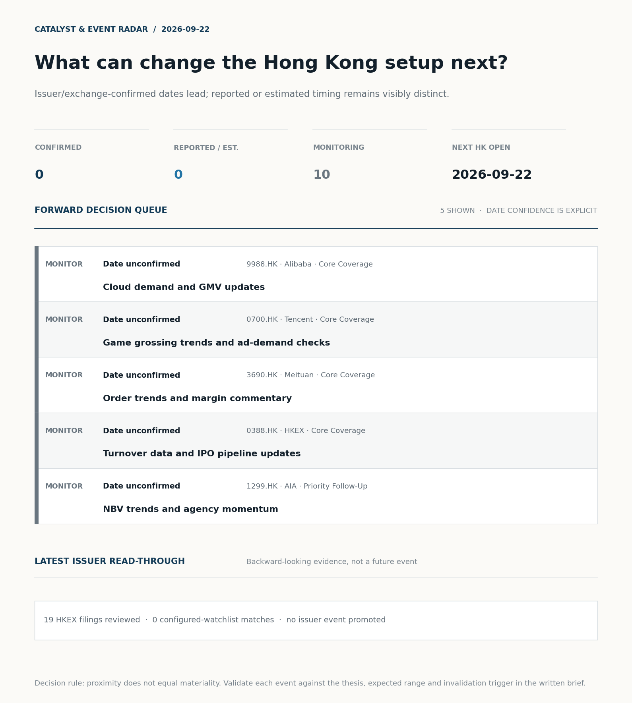
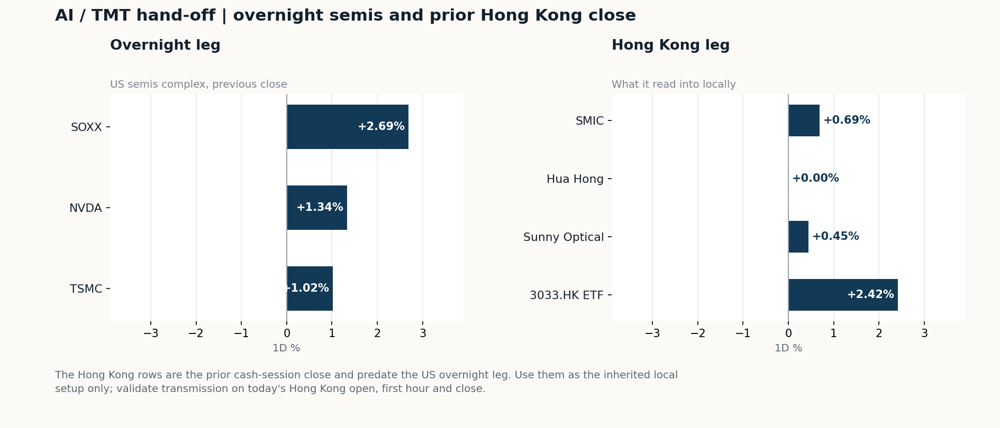
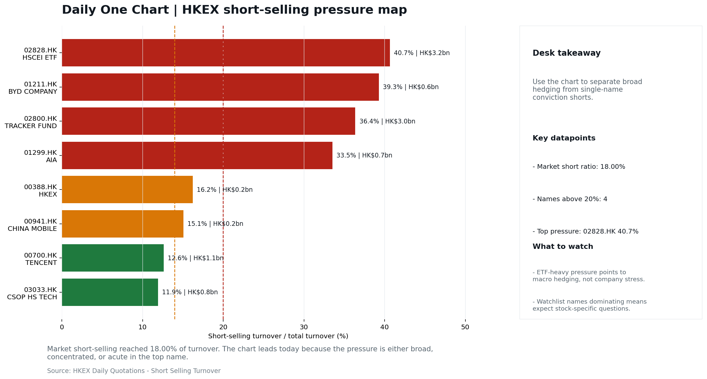

# Morning Research Workbench | 2026-09-22

> **Commute reading route:** `Layer 1 scan (5 min)` → `Layer 2 deep read` → `Layer 3 and appendix if time allows`
>
> Mode: `Trading Daily` | Keep the report execution-oriented: what mattered in the completed session, what can move Hong Kong leadership, and what needs fast follow-up.

_Data through: US/global `2026-09-21` | HK `2026-09-21` | A-share `2026-09-21` | Generated `2026-09-22 08:06:47`_

## Executive Summary

- **Did yesterday's call work?** UNRESOLVED - No comparable next close is available yet, so the call is still open.
- **What changed overnight?** Semis led higher: SOXX +2.69%, NVDA +1.34%, TSMC +1.02%. HSI +0.60% and 3033.HK +2.42%.
- **What it means for AI/TMT** Style, not beta - Selective growth leadership, a 1.81pp spread. Favor relative strength in internet/platform names, but do not treat the move as broad China risk-on until participation confirms.
- **What to watch today** Confirm if SMIC and Hua Hong open in the same direction as the overnight leg and hold it through the first hour; invalidate if they track HSCEI instead.

## Layer 1 | Scan (5 min)

### 1.1 Yesterday's Call
**Verdict: UNRESOLVED.** No comparable next close is available yet, so the call is still open.

**Recent record.** 6 confirmed / 4 broken over the last 10 scoreable calls (60.0% hit rate). This is a directional close-to-close diagnostic, not a track record.

### 1.2 Opening Decision Board

**Global-to-Hong Kong signals**

_Decision-useful subset: each row states the implication and the next test. Descriptive secondary monitors are kept out of the five-minute scan._

| Signal | Last / move | Interpretation | Confirmation / invalidation |
| --- | --- | --- | --- |
| S&P 500 | 7,764.70 / +1.49% | Broad US risk rose without a clear driver in today's fields; treat it as beta, not a signal. | Watch whether Nasdaq and offshore-China proxies move the same way. |
| Nasdaq 100 | 30,482.35 / **+2.83%** | Growth outperformed broad beta, a supportive style signal for Hong Kong internet and platform names. | 3033.HK versus HSI leadership carries the read; rising yields would undo it. |
| Hang Seng Index | 24,750.78 / +0.60% | The index was carried by growth and platform names, not by broad participation: 3033.HK differs by 1.82pp. | Southbound participation decides whether this is investable or just a print. |
| Hang Seng TECH ETF (3033.HK) | 4.3200 / **+2.42%** | Hong Kong growth led broad beta, improving the platform/internet style signal. | Needs a stable CNH and Southbound buying to become a duration signal. |
| Semiconductors (SOXX) | 533.07 / **+2.69%** | Semis moved with the Nasdaq, so the tape is broad rather than cycle-specific. | SMIC and Hua Hong at the open show whether it transmits to Hong Kong. |
| US 10Y | 4.9630% / -3.5bp | The yield proxy fell, easing the valuation headwind for duration-sensitive equities. | Read it through 3033.HK relative performance, not the index level. |
| USD/CNH | 6.6490 / -0.87% | A stronger offshore renminbi supports the external-risk backdrop for Hong Kong equities. | FXI and Southbound flow decide whether this reaches Hong Kong equities. |
| VIX | 14.87 / +0.41% | Higher implied volatility raises the tail-risk premium and weakens risk-on conviction. | Falling volatility on narrowing breadth is a warning, not support. |

_Secondary monitors retained in the source bundle: SMIC (0981.HK), CSI 300, China 10Y, CN-US 10Y spread, DXY, USD/HKD, Brent crude, COMEX gold, Copper._

**Hong Kong local confirmation**

_Coverage gate: 1 unavailable local checks are suppressed here and retained in validation metadata._

| Check | Value | Status | Source / as of | Why it matters |
| --- | --- | --- | --- | --- |
| Main Board turnover vs 20D | 0.89x \| -11% vs 20D | Live local | HKEX \| 2026-09-21 | Trailing 20-session average turnover was HK$228.6bn. |
| Southbound / Northbound net flow | Southbound Net HK$4.1bn \| turnover HK$92.2bn \| Northbound Turnover RMB283.9bn \| net not reported | Live local | HKEX Connect \| 2026-09-21 | Southbound net buy is calculated from HKEX disclosed buy and sell turnover. |
| Short-selling ratio | 18.00% | Live local | HKEX \| 2026-09-21 | Official HKEX stock-level short-selling table, aggregated as a share of total market turnover. |
| AH premium index | 26.33% | Live public | Yahoo \| 2026-09-21 | Fixed 10-name basket, equal-weighted, both legs priced on the same date; comparable across dates. Covered-pair average was +37.19% across 16 pairs. |
| USD/HKD spot vs band | 7.8447 | Live quote | Yahoo \| 2026-09-21 | 53 pips from the weak-side CU (7.8500); monitor HKMA operations and the aggregate balance for a funding squeeze. |
| Hong Kong leadership | Selective growth leadership | Proxy | HSI / HSCEI / 3033.HK ETF relative \| 2026-09-21 | Use HSI / HSCEI / 3033.HK ETF relative moves as the opening style read. |

**Risk state and evidence**

**Composite risk score:** `64.0/100` | **Regime:** `Mixed`

| Component | Score impact | Evidence |
| --- | --- | --- |
| US beta | +8.9 | S&P 500 +1.49% |
| HK growth ETF proxy | +10 | 3033.HK ETF +2.42% |
| Semis complex | +9 | SOXX +2.69% |
| Offshore China proxy | +1.9 | FXI +0.38% |
| Dollar pressure | -2.0 | DXY +0.20% |
| Volatility | -0.8 | VIX +0.41% |
| HK short-selling | -8 | Short-selling ratio 18.00% |
| HK turnover | -5 | Turnover 0.89x 20D |

_Base 50 plus the component deltas above. Semis complex entered the score on 2026-08-22; earlier scores in the ledger exclude it._

**Morning Checklist**

1. **Mixed backdrop with USD range-bound, rates were not the dominant driver, and Nasdaq 100 outperformed FXI**
 Overnight regime | Start by deciding whether the day is about Mixed conditions or a style pivot.
2. **China LPR (1Y / 5Y) (Past expected window (unverified))**
 Macro / policy | Watch whether it changes the day's core market narrative | Industries: Market-wide
3. **Hong Kong CPI (Past expected window (unverified))**
 Macro / policy | Local funding conditions, retail purchasing power, and HKD real rates | Industries: Property, Retail, Banks
4. **WTI crude -7.99%**
 High-frequency data | Softer oil argues for a more cautious cyclical-growth read. (second-order macro context)

## Visual Dashboard

**Catalyst & Event Radar**

**Chart read:** No issuer/exchange-confirmed event date is populated; 0 reported or estimated timing item(s) and 10 undated trigger(s) remain explicit.

_Source: Public calendars, issuer disclosures and configured research watchlists_
## Layer 2 | Core Research (20-30 min)

### 2.1 Global-to-Hong Kong Transmission
**Market Setup**
**Core tape.** Overnight US action was constructive for risk assets but uneven in its overseas signal: S&P 500 rose +1.49% and Nasdaq 100 led with +2.83%.
**Main driver.** Crude's sharp -7.99% drop reframed the inflation/demand narrative rather than rates, which were not the dominant driver.
**HK relevance.** For today's Hong Kong open (2026-09-22), the question is whether the semis-led US tape transmits into HK tech and platform names, or whether elevated short-selling (18.00%) and thin turnover (0.89x 20D) cap the follow-through.

**Key Drivers**
- US growth-style leadership: Nasdaq 100 +2.83% and SOXX +2.69% signal a semis-anchored risk-on tape that is the most direct positive conduit into HK tech and platform beta.
- Oil reset: WTI -7.99% eases input-cost pressure for airlines/consumer names but also embeds a softer demand read.
- Rates not the driver: USD range-bound (DXY +0.20%) and CNH firmer (USD/CNH -0.87%) mean cross-border flow is not forcing HK direction.
- China-proxy lag: FXI +0.38% versus Nasdaq 100 +2.83% confirms prior-HK growth leadership (3033.HK +2.42%) was selective rather than a broad China risk-on, consistent with the prior Hong Kong session's read.

**Hong Kong Read-Through**
**Opening implication.** Target 2026-09-22 open is more credible for HK tech/platform relative strength than for broad index beta.
_Hong Kong style leadership and flow confirmation are set out in the Hong Kong review below._

**Watch Points**
- USD composite moved higher by +0.11pct intraday, with a 0.232pct range.
- Main turning points appeared around 2026-09-21 08:10 trough / 2026-09-21 08:30 peak / 2026-09-21 08:45 peak, suggesting event-driven repricing rather than a clean one-way USD move.
- The biggest cross-asset divergence was Nasdaq 100 versus FXI, a spread of 1.386pct.
- Gold moved +0.20pct intraday with a 0.999pct high-low range.

**Curated overnight stories**
1. **SOXX +2.69% as US semis rallied overnight**
 Why it matters: Semiconductor strength overnight typically leads HK-listed semis and China platform beta at the open via sentiment and ADR linkage.
 HK read-through: Direct read-through to HK semis names and broader China tech; supportive tape for internet/platform leaders if the move holds into Asia.
2. **WTI crude -7.99%**
 Why it matters: A sharp oil decline changes the inflation and demand narrative; it can ease input cost pressure on airlines and consumer-facing names but also signals softer global demand.
 HK read-through: Mixed for HK: marginal tailwind for airlines/transport and consumer discretionary; risk-off read for upstream and cyclical industrials if it reflects demand weakness.
3. **China's AI leaders stay silent despite US 'publicity' on AI tech risks**
 Why it matters: Tests whether US-side AI risk narratives feed back into China internet/platform valuation; silence limits near-term headline damage but leaves the topic unresolved.
 HK read-through: Relevant for China internet leaders and AI-adjacent names; muted response suggests limited contagion for now, but the story remains a monitor item.
4. **China August retail sales miss with investment slump deepening; industrial output beat**
 Why it matters: Confirms a weak domestic demand / investment backdrop while supply-side metrics remain firmer, reinforcing the supply-demand imbalance narrative flagged by Beijing.
 HK read-through: Negative read for HK consumer discretionary, property and cyclicals; supports the 'policy needed' framing but does not by itself change positioning.
5. **USD range-bound; Nasdaq 100 outperformed FXI**
 Why it matters: Signals that the overnight alpha was in US tech rather than China-exposed names, and FX was not a driver of HK cross-border flows.
 HK read-through: Sets up a relative-performance gap vs. Nasdaq-tracking HK tech; HKD funding conditions likely stable, leaving stock-specific and tape dynamics as the main drivers.

**AI / TMT hand-off**

**Overnight leg.** The overnight semis leg was risk-on at +1.68% average (SOXX +2.69%, NVDA +1.34%, TSMC +1.02%).
**Hong Kong expression.** SMIC, Hua Hong and Sunny Optical are best placed at the open, and 3033.HK should be tested before the Hang Seng Index.
**Observable test.** Confirm if SMIC and Hua Hong open in the same direction as the overnight leg and hold it through the first hour; invalidate if they track HSCEI instead, which would mean local flow is overriding the global cycle.

| Name | Role in the chain | 1D | Leg |
| --- | --- | --- | --- |
| SOXX | Semis complex | +2.69% | overnight |
| NVDA | AI capex narrative | +1.34% | overnight |
| TSMC | Foundry demand | +1.02% | overnight |
| SMIC | Leading-edge / domestic substitution | +0.69% | Hong Kong |
| Hua Hong | Mature-node pricing cycle | +0.00% | Hong Kong |
| Sunny Optical | Hardware and optics supply chain | +0.45% | Hong Kong |
| 3033.HK ETF | Broad HK tech beta | +2.42% | Hong Kong |

**Clock discipline.** The Hong Kong rows are the prior cash-session close and predate the US overnight leg. Use them as the inherited local setup only; validate transmission on today's Hong Kong open, first hour and close.

### 2.2 Hong Kong Local Tape and Flow
**Local Tape Setup**
**Local read.** Hong Kong leadership for the 2026-09-22 open should be read through style, not index direction.
**Verification point.** Prior HK session growth beat SOE/HSCEI tone (3033.HK +2.42% vs HSCEI +0.61%, HSI +0.60%), and the overnight tape reinforced that style gap.
**Risk to watch.** Local liquidity is thin (Main Board turnover 0.89x 20D) and short-selling is elevated (18.00%), so any HK open that tries to extend the overnight US tech signal needs breadth confirmation, not just headline gaps.

**Style and Local Leadership**
**Style call.** Selective growth leadership.
- **Evidence:** 3033.HK moved +2.42% and beat HSCEI by +1.81pp and HSI by +1.82pp
- **Portfolio meaning:** Favor relative strength in internet/platform names, but do not treat the move as broad China risk-on until participation confirms.
- **Cross-market read:** Hang Seng +0.60% / HSCEI +0.61% / 3033.HK ETF +2.42%. Offshore China proxy FXI +0.38% and USD/CNH -0.87% frame cross-border risk appetite. USD/HKD last traded around 7.8447, which keeps the Hong Kong funding lens in focus.

**Flow Confirmation**
Official Stock Connect evidence is available; the Flow Tracker confirms whether local money supports the price action.

**Follow-Through Checklist**
**Follow-through check.** Confirm if 3033.HK keeps leading HSCEI on turnover at or above 1.0x 20D with the short-selling ratio holding near or below 18.00%; reverse the growth call if 3033.HK gives back its relative lead and turnover stays sub-0.9x 20D.
**Failure condition.** Invalidate if 3033.HK loses its lead to HSCEI, or if weak turnover, rising shorts, and CNH depreciation persist together.

**Cross-asset attribution**

| Driver | Direction | Score | Evidence | HK implication |
| --- | --- | --- | --- | --- |
| Oil and geopolitics | supportive | 5.93 | Oil moved -7.41%. | Split the read between energy/cyclicals support and margin/geopolitical pressure. |
| US growth-style transmission | supportive | 3.96 | Nasdaq 100 moved +2.83%. | Hong Kong growth and platform names should be tested first at the open. |
| Short-selling pressure | drag | 2.1 | HKEX short-selling ratio was 18.00%. | Elevated short activity argues for extra confirmation before chasing rebounds. |
| Global equity beta | supportive | 1.49 | S&P 500 moved +1.49%. | Broad beta matters if Hong Kong breadth confirms the overseas signal. |
| Dollar / CNH pressure | supportive | 1.3 | DXY +0.20% / USD-CNH -0.87% | A stable or softer CNH makes Hong Kong follow-through more credible. |
| Hong Kong participation | drag | 1.13 | Main Board turnover was 0.89x the 20-session average. | Thin turnover makes index moves easier to fade. |

**Local flow evidence**

**Flow Takeaways**
- Short-selling pressure is elevated, so local rebounds need cleaner breadth and flow confirmation.
- Stock Connect Southbound: net HK$4.1bn on turnover HK$92.2bn (as of 2026-09-21).
- Stock Connect Northbound: turnover RMB283.9bn; public file provides total turnover/top active names, not full net-buy.
- AH premium: fixed 10-name basket +26.33% (comparable across dates); covered-pair average +37.19% over 16 pairs; widest premium: China Communications Construction 101.67%.

**Stock Connect Southbound Active Names**

| # | Ticker | Name | Buy | Sell | Net buy | HKEX turnover rank |
| --- | --- | --- | --- | --- | --- | --- |
| 1 | 00700.HK | TENCENT | HK$1,275.4mn | HK$2,090.7mn | HK$-815.3mn | 2 |
| 2 | 01810.HK | XIAOMI-W | HK$683.0mn | HK$1,356.3mn | HK$-673.2mn | 5 |
| 3 | 06869.HK | YOFC | HK$1,687.4mn | HK$1,106.2mn | HK$581.2mn | 4 |
| 4 | 09988.HK | BABA-W | HK$1,536.3mn | HK$983.2mn | HK$553.1mn | 3 |
| 5 | 02099.HK | CHINAGOLDINTL | HK$103.4mn | HK$625.9mn | HK$-522.5mn | 10 |

**AH Premium Dispersion**

| Name | A ticker | H ticker | Premium | As of |
| --- | --- | --- | --- | --- |
| China Communications Construction | 601800.SS | 1800.HK | +101.67% | 2026-09-21 |
| China Railway Construction | 601186.SS | 1186.HK | +60.04% | 2026-09-21 |
| China Railway | 601390.SS | 0390.HK | +53.22% | 2026-09-21 |

**HKEX Short-Selling Watch**

| Ticker | Name | Short ratio | Short turnover | Total turnover |
| --- | --- | --- | --- | --- |
| 00388.HK | HKEX | 16.21% | HK$0.2bn | HK$1.0bn |
| 00700.HK | TENCENT | 12.61% | HK$1.1bn | HK$8.4bn |
| 00941.HK | CHINA MOBILE | 15.06% | HK$0.2bn | HK$1.1bn |

- **Short-value leaders:** 02828.HK HSCEI ETF (HK$3.2bn); 02800.HK TRACKER FUND (HK$3.0bn); 00700.HK TENCENT (HK$1.1bn); 09988.HK BABA-W (HK$0.9bn).

### 2.3 Macro Transmission
**Desk read.** Macro agenda for 2026-09-22 is dominated by two unverified items: China LPR (1Y/5Y) released on 2026-09-20 and Hong Kong CPI released on 2026-09-21.

**Market sensitivity.** Both are flagged past-window and unverified, so the first task is to confirm official prints and the market reaction before drawing conclusions.

**HK implication.** China LPR is the cleaner read on easing intent and the mortgage/corporate lending benchmark.

**Macro watchpoints**
- Verify the official China LPR (1Y/5Y) print and the 5Y change vs. prior; this is the cleanest China easing read and the main prop/financials
- Verify Hong Kong CPI release versus consensus; any surprise changes the real-rate input for HK property and retail names.
- SOXX and NVDA follow-through in the Asia session: a hold of the +2.69%/+1.34% tape supports HK semis and platform beta leadership
- WTI at -7.99% and copper +2.84% divergence: confirms or refutes the cautious-cyclical / soft-bulk-thesis split, with implications for energy

| Time | Region | Event | Status | Desk read |
| --- | --- | --- | --- | --- |
| | CN | China LPR (1Y / 5Y) | Past expected window (unverified) | Impact: Watch whether it changes the day's core market narrative \| Attention: 5/5 \| Industries: Market-wide |
| | HK | Hong Kong CPI | Past expected window (unverified) | Impact: Local funding conditions, retail purchasing power, and HKD real rates \| Attention: 1/5 \| Industries: Property, Retail, Banks |

**Positioning and risk backdrop**

- Detailed local flow evidence is covered under Flow Tracker and Attribution; keep this section focused on options, hedging, and macro-positioning risk.

### 2.4 Company Micro Research and Catalysts

| Grade | Sector | Headline | Why it matters | Horizon |
| --- | --- | --- | --- | --- |
| B | China Internet | China's AI leaders keep quiet despite U.S. 'publicity' on tech risks | Assess whether the story can propagate through the China Internet value | Monitor |

**Company Event Takeaway**
**Desk read.** Hong Kong closes a risk-on session with leadership in China Internet while old-economy proxies lag.
**Why it matters.** Alibaba (+3.0%) and Tencent (+2.6%) carried the Hang Seng TECH ETF (+2.4%), though both names still sit in the bottom quintile of their 60-session ranges, so today's move reads as a bounce off a depressed base rather than a confirmed breakout.
**Follow-up.** The Alibaba-specific catalyst was a Qwen-related U.S. public-record deployment that raised distribution but also exposed procurement and geopolitical risk.

**LLM Quick Takes**
- **9988.HK** | Up 3.02% to 112.60, mid-range at 56% of the 60-session band. Catalyst: Qwen's brief appearance on a U.S.…
- **0700.HK** | Up 2.63% to 430.0, bottom quartile of its 60-session range (15%). Read: bounce off depressed base, not a confirmed breakout…
- **3033.HK** | Hang Seng TECH ETF +2.42% to 4.32, bottom quartile (21%). Read: confirms today was an Internet-led tape; index still has to clear the range midpoint to turn the call into a regime change.
- **1299.HK** | +0.78% to 77.35, top quartile (81%). Read: marginal move, already-rich positioning limits upside surprise; use as a sentiment gauge on wealth/mainland flow rather than a directional signal.

Decision filter<h4>No immediate portfolio catalyst: 19 official filings were screened and the low-signal market set stays aggregated.</h4>
19 profit warnings

<strong>19</strong>Official filings

<strong>0</strong>Watchlist hits

<strong>0</strong>Actionable events

<article class="event-card priority-monitor">

MonitorEarnings<time>2026-10-20</time>

<h5>China Mobile · 0941.HK</h5>

Estimate comparison unavailable

Investor read
Calendar monitor only; no consensus comparison is available, so this is not yet an earnings view.

Next check
Confirm timing and obtain a consensus/KPI frame before promoting this event.

<a class="event-source" href="https://finance.yahoo.com/quote/0941.HK">Yahoo Finance ticker calendar ↗</a>
</article>

<strong>Coverage boundary.</strong> sell-side rating changes, IPO / grey-market monitor were not decision-grade in this run; their absence is not treated as confirmation that no event exists.

**Core coverage requiring follow-up**

**Core coverage**

| Name | Ticker | Last | 1D | Range position | Morning note |
| --- | --- | --- | --- | --- | --- |
| Alibaba | 9988.HK | 112.60 | +3.02% | Mid-range | Up 3.02% on the session, mid-range at 56% of its 60-session band. |
| Tencent | 0700.HK | 430.00 | +2.63% | Bottom of range | Up 2.63% on the session, still in the bottom quartile of its 60-session range (15%). |

**Recent headlines for Alibaba:**
- [Microsoft vs Alibaba: Which Cloud AI Stock Is Better Positioned?](https://finance.yahoo.com/markets/stocks/articles/microsoft-vs-alibaba-cloud-ai-153200503.html) (Zacks)

**Priority follow-up**

| Name | Ticker | Last | 1D | Range position | Morning note |
| --- | --- | --- | --- | --- | --- |
| AIA | 1299.HK | 77.35 | +0.78% | Top of range | Marginally higher (+0.78%), in the top quartile of its 60-session range (81%). |
| BYD Company | 1211.HK | 81.20 | -0.37% | Mid-range | Marginally lower (-0.37%), mid-range at 39% of its 60-session band. |

### 2.5 Morning Meeting Questions
**Q1. The index was +0.60% but tech led at +2.42% - what drove the split?**
- **Evidence:** HSI +0.60% versus 3033.HK +2.42%, a 1.82pp spread.
- **How to answer:** Growth carried the session: the 1.82pp spread means the move was concentrated in platform and tech names rather than broad beta.

## Layer 3 | Session Playbook (8-12 min)

### 3.1 Base Case and Scenario Map
**Starting posture.** Selective growth leadership (medium confidence); composite risk `64.0/100` (Mixed). Favor relative strength in internet/platform names, but do not treat the move as broad China risk-on until participation confirms.

**Scenario map**

| Scenario | Observable trigger | Interpretation | Research response |
| --- | --- | --- | --- |
| Selective growth confirms | 3033.HK keeps a >0.5pp first-hour lead over HSCEI; SMIC and Hua Hong stop lagging broad beta; CNH is stable. | The prior style split has live price confirmation, but is not yet broad China risk-on. | Prioritize internet/platform relative strength; verify participation again at the close. |
| Broad beta takes over | HSI and HSCEI rise together, breadth improves and the 3033.HK lead narrows without turning negative. | Leadership is broadening from a style trade into market beta. | Expand the research set from growth leaders to financials, SOEs and index-heavy names. |
| Risk-off continuation | 3033.HK loses its lead, semis underperform HSCEI and CNH depreciation accelerates. | The prior divergence was a temporary pocket of strength rather than a durable hand-off. | Treat rebounds as unconfirmed; focus on balance-sheet, catalyst and crowding risk. |

**Clocked validation scorecard**

| Window | Check | Prior evidence | Pass condition | What it decides |
| --- | --- | --- | --- | --- |
| 09:30-10:30 | 3033.HK vs HSCEI | +1.81pp at the prior close | 3033.HK retains >0.5pp relative lead | Whether growth leadership survives the open |
| 09:30-10:30 | Semiconductor hand-off | SMIC +0.69%; Hua Hong Semiconductor +0.00% | Stabilise after the open; at least one stops underperforming HSCEI | Whether overnight semis pressure is contained locally |
| 09:30-10:30 | HSI price zone | 24,751 vs 24,500 / 25,000 reference grid | Hold above the lower grid or reclaim the upper grid with breadth | Whether broad beta is stabilising; grid is derived, not technical analysis |
| 09:30-10:30 | USD/CNH | 6.649 \| -0.87% | No acceleration in CNH depreciation | Whether FX permits a clean Hong Kong risk extension |
| At close | Turnover | 0.89x \| -11% vs 20D | At least 1.0x the 20-session average | Whether the move had normal participation |
| At close | Southbound | Net HK$4.1bn \| turnover HK$92.2bn | Net buying remains positive and broadens beyond one or two names | Whether mainland money confirms the price move |
| At close | Short pressure | 18.00% | Falls versus the prior verified reading (18.00%) | Whether rebound conviction improved |

**Upgrade rule.** Confirm if 3033.HK keeps outperforming HSCEI with at least normal turnover, broader Southbound buying, stable CNH, and easing short pressure.
**Kill switch.** Invalidate if 3033.HK loses its lead to HSCEI, or if weak turnover, rising shorts, and CNH depreciation persist together.
**Clock discipline.** At 07:30, same-day Southbound, turnover and short-selling outcomes are not known. Use the first-hour price/FX checks provisionally and make the final classification only after the close.

### 3.2 Daily One Chart
**Daily One Chart | HKEX short-selling pressure map**

**Chart read.** Market short-selling reached 18.00% of turnover.
**Why it matters.** The chart leads today because the pressure is either broad, concentrated, or acute in the top name.

_Source: HKEX Daily Quotations - Short Selling Turnover_

## Optional Appendix | Traceability and Performance (10-15 min)

### Report Metadata
> Date policy: Review date 2026-09-21 is treated as `Trading Daily`. | Global (US/Europe) data date is 2026-09-21; adapter effective date is 2026-09-21 and summary date is 2026-09-21. | Hong Kong local data date is 2026-09-21; role: same-session local cash tape.
> Market data quality: Coverage: `37/38` | Missing: `1`
> Report quality: `91.4/100` | Grade `A` | Status `usable with caveats`

### Report Quality and Validation
- **Quality score:** 91.4/100 | **Grade:** A | **Status:** usable with caveats
- **Run summary:** 8 healthy | 2 caveat | 0 failed
- **Release recommendation:** Send with caveats | The report is usable, but the advisory guidance should travel with it so readers understand the data gaps.

| Source | Status | Bucket |
| --- | --- | --- |
| Macro calendar | partial | caveat |
| Risk and sentiment feed | partial | caveat |
| Weak component | Score | Read |
| --- | --- | --- |
| Hong Kong local metrics | 54.1 | 5 live, 3 proxy, 3 unavailable local checks. |

**Quality warnings**
- Hong Kong local metrics is weak: 5 live, 3 proxy, 3 unavailable local checks.

**Narrative fact-check guardrail**
- Checked 41 numeric claims; 0 numeric mismatch(es), 0 logic warning(s); 8 structured claims, 0 source/text warning(s); 0 critical, 0 review.

_Full component weights, per-source freshness, adapter status and provenance records are archived with this report under `audit/` rather than printed here._

### Historical Signal Performance
- **Readiness:** exploratory with caveats | 69 observations | 105 active signal dates | next-close entry, 10bps cost, no same-day returns.
- **Interpretation boundary:** exploratory until a benchmark reaches 252 sessions and 100 active-signal sessions.
- **Data-quality caveat:** 23 conflicting price revision(s) and 6 non-session observation(s) remain in the research ledger.
- **Daily-use boundary:** cumulative return, Sharpe and the performance chart stay out of the daily commute edition until the sample and trading-calendar gates pass; use Yesterday's Call instead.

### Source Links
- [China's AI leaders keep quiet despite U.S. 'publicity' on tech risks](https://www.cnbc.com/2026/09/16/chinas-ai-leaders-keep-quiet-despite-us-publicity-on-tech-risks.html) (cnbc_markets)
- [Microsoft vs Alibaba: Which Cloud AI Stock Is Better Positioned?](https://finance.yahoo.com/markets/stocks/articles/microsoft-vs-alibaba-cloud-ai-153200503.html) (Zacks)
- [Alibaba Jumps 4.3% With Qwen's Brief U.S. Government Appearance](https://finance.yahoo.com/markets/stocks/articles/alibaba-jumps-4-3-qwens-153031773.html) (GuruFocus.com)
- [Meituan (MPNGF) (Q2 2026) Earnings Call Highlights: Record Revenue and Strategic AI Pivot Drive...](https://finance.yahoo.com/markets/stocks/articles/meituan-mpngf-q2-2026-earnings-190123345.html) (GuruFocus.com)
- [China Mobile (SEHK:941): A Closer Look at Valuation After Steady Share Price Gains This Year](https://finance.yahoo.com/news/china-mobile-sehk-941-closer-154022664.html) (Simply Wall St.)
- [00178.HK Profit warning / alert announcement](http://www1.hkexnews.hk/listedco/listconews/sehk/2026/0921/2026092100476.pdf) (HKEXnews)
- [00591.HK Profit warning / alert announcement](http://www1.hkexnews.hk/listedco/listconews/sehk/2026/0921/2026092100728.pdf) (HKEXnews)
- [01130.HK Profit warning / alert announcement](http://www1.hkexnews.hk/listedco/listconews/sehk/2026/0921/2026092100684.pdf) (HKEXnews)
- [01195.HK Profit warning / alert announcement](http://www1.hkexnews.hk/listedco/listconews/sehk/2026/0921/2026092101321.pdf) (HKEXnews)
- [00070.HK Profit warning / alert announcement](http://www1.hkexnews.hk/listedco/listconews/sehk/2026/0918/2026091801504.pdf) (HKEXnews)
- [01371.HK Profit warning / alert announcement](http://www1.hkexnews.hk/listedco/listconews/sehk/2026/0918/2026091801846.pdf) (HKEXnews)
- [08093.HK Profit warning / alert announcement](http://www1.hkexnews.hk/listedco/listconews/gem/2026/0918/2026091801904.pdf) (HKEXnews)
- [08156.HK Profit warning / alert announcement](http://www1.hkexnews.hk/listedco/listconews/gem/2026/0918/2026091801732.pdf) (HKEXnews)
