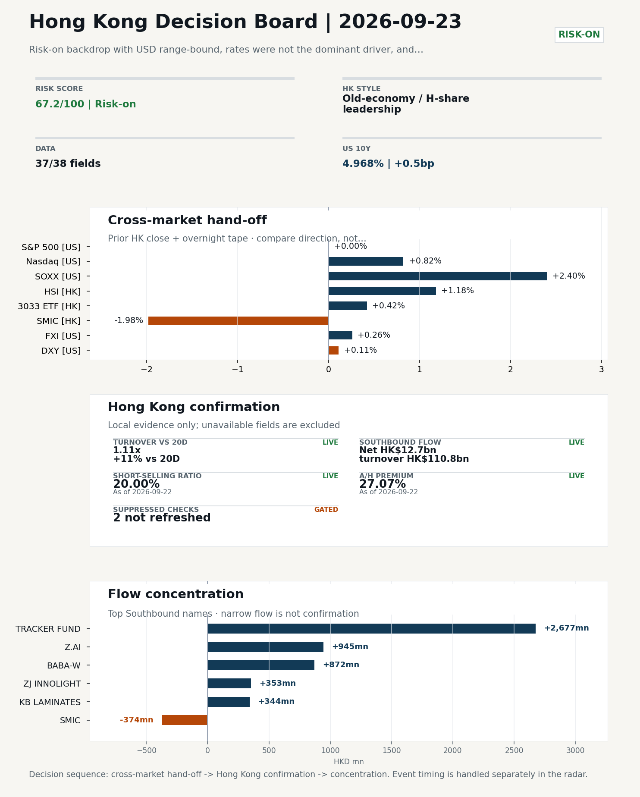
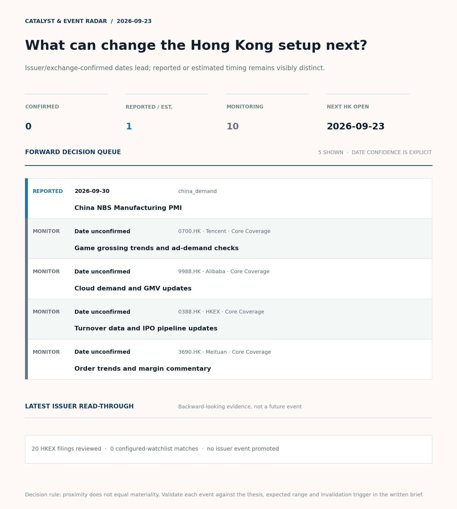
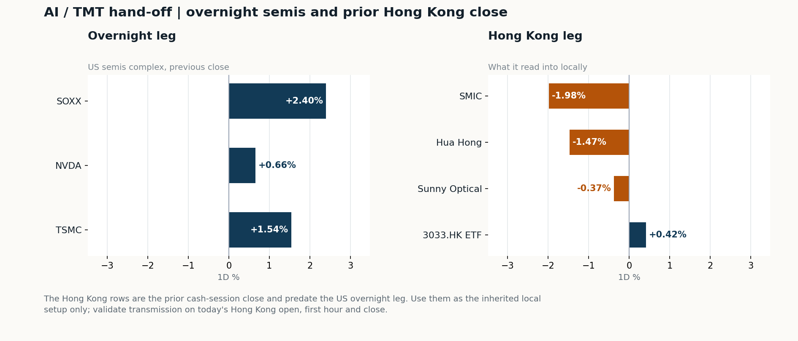
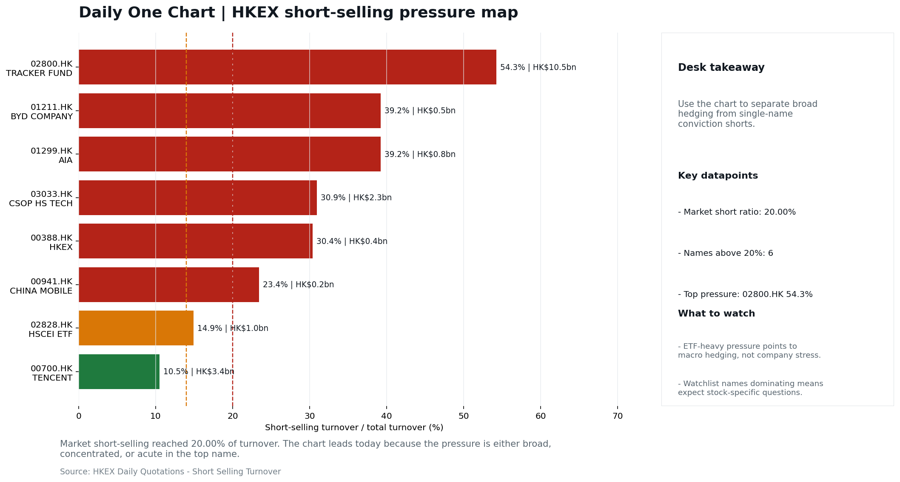

# Morning Research Workbench | 2026-09-23

> **Commute reading route:** `Layer 1 scan (5 min)` → `Layer 2 deep read` → `Layer 3 and appendix if time allows`
>
> Mode: `Trading Daily` | Keep the report execution-oriented: what mattered in the completed session, what can move Hong Kong leadership, and what needs fast follow-up.

_Data through: US/global `2026-09-22` | HK `2026-09-22` | A-share `2026-09-22` | Generated `2026-09-23 07:37:31`_

## Executive Summary

- **Did yesterday's call work?** NO CALL - The 2026-09-22 report published no directional call (neutral regime).
- **What changed overnight?** Semis led higher: SOXX +2.40%, NVDA +0.66%, TSMC +1.54%. HSI +1.18% and 3033.HK +0.42%.
- **What it means for AI/TMT** Style, not beta - Old-economy / H-share leadership, a 0.97pp spread. Treat banks, energy, telecoms, and SOE yield as the cleaner relative expression; growth beta still needs proof.
- **What to watch today** Confirm if SMIC and Hua Hong open in the same direction as the overnight leg and hold it through the first hour; invalidate if they track HSCEI instead.

## Layer 1 | Scan (5 min)

### 1.1 Yesterday's Call
**Verdict: NO CALL.** The 2026-09-22 report published no directional call (neutral regime).

**Recent record.** 6 confirmed / 4 broken over the last 10 scoreable calls (60.0% hit rate). This is a directional close-to-close diagnostic, not a track record.

### 1.2 Opening Decision Board

**Global-to-Hong Kong signals**

_Decision-useful subset: each row states the implication and the next test. Descriptive secondary monitors are kept out of the five-minute scan._

| Signal | Last / move | Interpretation | Confirmation / invalidation |
| --- | --- | --- | --- |
| S&P 500 | 7,764.64 / -0.00% | US beta was flat and offers little directional lead for Hong Kong. | Watch whether Nasdaq and offshore-China proxies move the same way. |
| Nasdaq 100 | 30,732.40 / +0.82% | Growth outperformed broad beta, a supportive style signal for Hong Kong internet and platform names. Growth advanced despite higher yields, showing momentum resilience but also higher reversal sensitivity. | 3033.HK versus HSI leadership carries the read; rising yields would undo it. |
| Hang Seng Index | 25,042.71 / +1.18% | The index was carried by old-economy and H-share names, not by broad participation: 3033.HK differs by 0.76pp. | Southbound participation decides whether this is investable or just a print. |
| Hang Seng TECH ETF (3033.HK) | 4.3380 / +0.42% | Hong Kong growth lagged, so broad-index strength is not yet a duration signal. | Needs a stable CNH and Southbound buying to become a duration signal. |
| Semiconductors (SOXX) | 572.78 / **+2.40%** | Semis led the Nasdaq by 1.58pp, putting the AI capex trade back in front. | SMIC and Hua Hong at the open show whether it transmits to Hong Kong. |
| US 10Y | 4.9680% / +0.5bp | The yield proxy rose, tightening the discount-rate backdrop for long-duration Hong Kong growth. | Read it through 3033.HK relative performance, not the index level. |
| USD/CNH | 6.6530 / -0.81% | A stronger offshore renminbi supports the external-risk backdrop for Hong Kong equities. | FXI and Southbound flow decide whether this reaches Hong Kong equities. |
| VIX | 14.21 / **-4.44%** | Lower implied volatility reduces near-term stress, but is supportive only if equity breadth confirms. | Falling volatility on narrowing breadth is a warning, not support. |

_Secondary monitors retained in the source bundle: SMIC (0981.HK), CSI 300, China 10Y, CN-US 10Y spread, DXY, USD/HKD, Brent crude, COMEX gold, Copper._

**Hong Kong local confirmation**

_Coverage gate: 1 unavailable local checks are suppressed here and retained in validation metadata._

| Check | Value | Status | Source / as of | Why it matters |
| --- | --- | --- | --- | --- |
| Main Board turnover vs 20D | 1.11x \| +11% vs 20D | Live local | HKEX \| 2026-09-22 | Trailing 20-session average turnover was HK$224.2bn. |
| Southbound / Northbound net flow | Southbound Net HK$12.7bn \| turnover HK$110.8bn \| Northbound Turnover RMB291.1bn \| net not reported | Live local | HKEX Connect \| 2026-09-22 | Southbound net buy is calculated from HKEX disclosed buy and sell turnover. |
| Short-selling ratio | 20.00% | Live local | HKEX \| 2026-09-22 | Official HKEX stock-level short-selling table, aggregated as a share of total market turnover. |
| AH premium index | 27.07% | Live public | Yahoo \| 2026-09-22 | Fixed 10-name basket, equal-weighted, both legs priced on the same date; comparable across dates. Covered-pair average was +35.34% across 18 pairs. |
| USD/HKD spot vs band | 7.8448 | Live quote | Yahoo \| 2026-09-22 | 52 pips from the weak-side CU (7.8500); monitor HKMA operations and the aggregate balance for a funding squeeze. |
| Hong Kong leadership | Old-economy / H-share leadership | Proxy | HSI / HSCEI / 3033.HK ETF relative \| 2026-09-22 | Use HSI / HSCEI / 3033.HK ETF relative moves as the opening style read. |

**Risk state and evidence**

**Composite risk score:** `67.2/100` | **Regime:** `Risk-on`

| Component | Score impact | Evidence |
| --- | --- | --- |
| US beta | -0.0 | S&P 500 -0.00% |
| HK growth ETF proxy | +2.1 | 3033.HK ETF +0.42% |
| Semis complex | +9 | SOXX +2.40% |
| Offshore China proxy | +1.3 | FXI +0.26% |
| Dollar pressure | -1.1 | DXY +0.11% |
| Volatility | +8.9 | VIX -4.44% |
| HK short-selling | -8 | Short-selling ratio 20.00% |
| HK turnover | +5 | Turnover 1.11x 20D |

_Base 50 plus the component deltas above. Semis complex entered the score on 2026-08-22; earlier scores in the ledger exclude it._

**Morning Checklist**

1. **Risk-on backdrop with USD range-bound, rates were not the dominant driver, and Nasdaq 100 outperformed FXI**
 Overnight regime | Start by deciding whether the day is about Risk-on conditions or a style pivot.
2. **China LPR (1Y / 5Y) (Past expected window (unverified))**
 Macro / policy | Watch whether it changes the day's core market narrative | Industries: Market-wide
3. **Hong Kong CPI (Past expected window (unverified))**
 Macro / policy | Local funding conditions, retail purchasing power, and HKD real rates | Industries: Property, Retail, Banks
4. **China NBS Manufacturing PMI**
 Catalysts | Watch whether it changes risk budgets or the theme-trading cadence

## Visual Dashboard

**Catalyst & Event Radar**

**Chart read:** No issuer/exchange-confirmed event date is populated; 1 reported or estimated timing item(s) and 10 undated trigger(s) remain explicit.

_Source: Public calendars, issuer disclosures and configured research watchlists_
## Layer 2 | Core Research (20-30 min)

### 2.1 Global-to-Hong Kong Transmission
**Market Setup**
**Core tape.** Overnight US trade (2026-09-22) stayed risk-on but uneven.
**Main driver.** The Euro Stoxx 50 closed +1.31% on 2026-09-21, while the prior Hong Kong session (2026-09-22) saw HSCEI +1.39% lead HSI +1.18%, with 3033.HK ETF only +0.42% and CNH -0.81% versus USD.
**HK relevance.** The cross-asset message is growth-style and AI-semis leadership in the US, with HK expressing it more through old-economy H-shares than through tech beta.

**Key Drivers**
- US growth-style leadership: Nasdaq 100 +0.82% and SOXX +2.40% point to AI/semis demand, not a broad index bid, since S&P 500 was flat.
- Rates were not dominant; the USD composite moved only +0.12% intraday with a 0.238% range, so the risk-on read is not a dollar-funding story.
- Oil -6.34% (WTI $89.71) softens the cyclical-energy leg and argues for caution on energy beta, even as it lifts growth multiples via lower input pressure.
- Prior HK session (2026-09-22) showed HSCEI beating 3033.HK by 0.97pp on 1.11x 20-day turnover and +HK$12.7bn Southbound, so local leadership was value/SOE, not tech.

**Hong Kong Read-Through**
**Opening implication.** For the 2026-09-23 HK session, the constructive read is AI/semis transmission via SMIC and Hua Hong, with BABA premarket flow adding a likely tailwind to HK China Internet. The cautious read is that prior-HK leadership was old-economy H-shares, 3033.HK only rose +0.42%, short interest is 20.00%, and FXI lagged Nasdaq 100, so a clean tech-led follow-through needs confirmation from 3033.HK, CNH holding firm near USD/CNH -0.81%, and steady turnover above 1.11x the 20-day average; if those fail, expect a rotation back into HSCEI/SOE yield. USD/HKD at 7.8448 (52 pips from the weak-side CU) keeps the funding lens active into the next HK session (2026-09-24).
_Hong Kong style leadership and flow confirmation are set out in the Hong Kong review below._

**Watch Points**
- USD composite moved higher by +0.12pct intraday, with a 0.238pct range.
- Main turning points appeared around 2026-09-22 08:05 trough / 2026-09-22 08:50 trough / 2026-09-22 09:25 peak, suggesting event-driven repricing rather than a clean one-way USD move.
- The biggest cross-asset divergence was Nasdaq 100 versus FXI, a spread of 1.097pct.
- Gold moved +0.63pct intraday with a 1.706pct high-low range.

**Curated overnight stories**
1. **Alibaba flagged among biggest US premarket movers**
 Why it matters: Alibaba (BABA) is the highest-ADV Hong Kong-China listing pair and a leadership name within HK China Internet.
 HK read-through: Direct read-through to HK-listed China Internet leaders and the broader ADR-arbitrage complex at the open.
2. **Jamie Dimon flags hyperscaler AI spending could reach $1 trillion next year**
 Why it matters: Frames AI capex as a system-level macro/earnings variable rather than a single-name story, with implications for the capex chain and for any AI-recipient China names exposed…
 HK read-through: Indirect for HK: supports AI-related China plays only insofar as they are exposed to global hyperscaler demand.
3. **Three words from Kevin Warsh move the debate on how far the Fed will hike**
 Why it matters: Rates positioning drives HK/US rate differentials, HKD liquidity, and the growth-value rotation that frames HK leadership.
 HK read-through: Repricing risk for HK duration-sensitive names (property, banks, high-multiple growth) if Warsh reads more hawkish than expected.
4. **Copper climbs toward record on signs of tightening supply in China**
 Why it matters: China physical-market tightness is a direct demand read on mainland activity and a marginal-positive signal for HK-listed metals and miners.
 HK read-through: Modest positive for Energy and Materials HK names; secondary versus tech/AI tape and unlikely to drive leadership on its own.
5. **China LPR (1Y / 5Y) sits in a past-expected window without verification**
 Why it matters: LPR is a core China policy print for banks, property, and onshore/offshore rate spreads; the unverified window means we cannot yet state a directional read.
 HK read-through: High watch-priority for HK banks and property; until verified, treat as a placeholder and avoid asserting a directional bias in this note.

**AI / TMT hand-off**

**Overnight leg.** The overnight semis leg was risk-on at +1.53% average (SOXX +2.40%, NVDA +0.66%, TSMC +1.54%).
**Hong Kong expression.** SMIC, Hua Hong and Sunny Optical are best placed at the open, and 3033.HK should be tested before the Hang Seng Index.
**Observable test.** Confirm if SMIC and Hua Hong open in the same direction as the overnight leg and hold it through the first hour; invalidate if they track HSCEI instead, which would mean local flow is overriding the global cycle.

| Name | Role in the chain | 1D | Leg |
| --- | --- | --- | --- |
| SOXX | Semis complex | +2.40% | overnight |
| NVDA | AI capex narrative | +0.66% | overnight |
| TSMC | Foundry demand | +1.54% | overnight |
| SMIC | Leading-edge / domestic substitution | -1.98% | Hong Kong |
| Hua Hong | Mature-node pricing cycle | -1.47% | Hong Kong |
| Sunny Optical | Hardware and optics supply chain | -0.37% | Hong Kong |
| 3033.HK ETF | Broad HK tech beta | +0.42% | Hong Kong |

**Clock discipline.** The Hong Kong rows are the prior cash-session close and predate the US overnight leg. Use them as the inherited local setup only; validate transmission on today's Hong Kong open, first hour and close.

### 2.2 Hong Kong Local Tape and Flow
**Local Tape Setup**
**Local read.** The 2026-09-23 Hong Kong open is set up as a confirmation test, not a one-way call.
**Verification point.** Prior session (2026-09-22) showed HSCEI +1.39% leading HSI +1.18% on 1.11x 20-day turnover and Southbound net buy of HK$12.7bn.
**Risk to watch.** Overnight US growth-style tape (Nasdaq 100 +0.82%, SOXX +2.40%) and softer CNH (-0.81% vs USD) are constructive inputs, but FXI lagged the Nasdaq 100, meaning offshore China is being asked to confirm rather than lead.

**Style and Local Leadership**
**Style call.** Old-economy / H-share leadership.
- **Evidence:** HSCEI beat 3033.HK by 0.97pp (+1.39% versus +0.42%)
- **Portfolio meaning:** Treat banks, energy, telecoms, and SOE yield as the cleaner relative expression; growth beta still needs proof.
- **Cross-market read:** Hang Seng +1.18% / HSCEI +1.39% / 3033.HK ETF +0.42%. Offshore China proxy FXI +0.26% and USD/CNH -0.81% frame cross-border risk appetite. USD/HKD last traded around 7.8448, which keeps the Hong Kong funding lens in focus.

**Flow Confirmation**
Official Stock Connect evidence is available; the Flow Tracker confirms whether local money supports the price action.

**Follow-Through Checklist**
**Follow-through check.** Watch 3033.HK opening direction vs HSCEI.
**Failure condition.** Invalidate if 3033.HK retakes leadership while CNH firms and local participation broadens.

**Cross-asset attribution**

| Driver | Direction | Score | Evidence | HK implication |
| --- | --- | --- | --- | --- |
| Short-selling pressure | drag | 3.5 | HKEX short-selling ratio was 20.00%. | Elevated short activity argues for extra confirmation before chasing rebounds. |
| Oil and geopolitics | supportive | 1.45 | Oil moved -1.81%. | Split the read between energy/cyclicals support and margin/geopolitical pressure. |
| Dollar / CNH pressure | supportive | 1.22 | DXY +0.11% / USD-CNH -0.81% | A stable or softer CNH makes Hong Kong follow-through more credible. |
| US growth-style transmission | supportive | 1.15 | Nasdaq 100 moved +0.82%. | Hong Kong growth and platform names should be tested first at the open. |
| Hong Kong participation | supportive | 1.12 | Main Board turnover was 1.11x the 20-session average. | Higher participation makes local price action more credible. |

**Local flow evidence**

**Flow Takeaways**
- Short-selling pressure is elevated, so local rebounds need cleaner breadth and flow confirmation.
- Stock Connect Southbound: net HK$12.7bn on turnover HK$110.8bn (as of 2026-09-22).
- Stock Connect Northbound: turnover RMB291.1bn; public file provides total turnover/top active names, not full net-buy.
- AH premium: fixed 10-name basket +27.07% (comparable across dates); covered-pair average +35.34% over 18 pairs; widest premium: China Communications Construction 101.95%.

**Stock Connect Southbound Active Names**

| # | Ticker | Name | Buy | Sell | Net buy | HKEX turnover rank |
| --- | --- | --- | --- | --- | --- | --- |
| 1 | 02800.HK | TRACKER FUND | HK$2,716.1mn | HK$39.4mn | HK$2,676.7mn | 5 |
| 2 | 02513.HK | Z.AI | HK$2,826.0mn | HK$1,881.3mn | HK$944.7mn | 3 |
| 3 | 09988.HK | BABA-W | HK$3,674.3mn | HK$2,802.4mn | HK$871.9mn | 2 |
| 4 | 00981.HK | SMIC | HK$1,466.8mn | HK$1,840.4mn | HK$-373.6mn | 5 |
| 5 | 03308.HK | ZJ INNOLIGHT | HK$489.5mn | HK$136.7mn | HK$352.9mn | 10 |

**AH Premium Dispersion**

| Name | A ticker | H ticker | Premium | As of |
| --- | --- | --- | --- | --- |
| China Communications Construction | 601800.SS | 1800.HK | +101.95% | 2026-09-22 |
| China Railway Construction | 601186.SS | 1186.HK | +61.21% | 2026-09-22 |
| China Railway | 601390.SS | 0390.HK | +53.96% | 2026-09-22 |

**HKEX Short-Selling Watch**

| Ticker | Name | Short ratio | Short turnover | Total turnover |
| --- | --- | --- | --- | --- |
| 00388.HK | HKEX | 30.36% | HK$0.4bn | HK$1.3bn |
| 00700.HK | TENCENT | 10.47% | HK$3.4bn | HK$32.2bn |
| 00941.HK | CHINA MOBILE | 23.43% | HK$0.2bn | HK$0.7bn |

- **Short-value leaders:** 02800.HK TRACKER FUND (HK$10.5bn); 00700.HK TENCENT (HK$3.4bn); 03033.HK CSOP HS TECH (HK$2.3bn); 09988.HK BABA-W (HK$2.3bn).

### 2.3 Macro Transmission
**Desk read.** With the global session for 2026-09-22 closed and the HK open for 2026-09-23 ahead, the macro and policy agenda is light but not neutral.

**Market sensitivity.** Two scheduled items fall into the unverified past-window bucket: China LPR (1Y/5Y) on 2026-09-20.

**HK implication.** The verified global tape is risk-on and USD range-bound, with VIX at 14.21 (-4.44%) and SOXX +2.40% alongside TSMC ADR +1.54% at 452.0, which together give HK semis and platform names a supportive opening beta.

**Macro watchpoints**
- Verify China LPR (1Y/5Y) official release and spread vs. consensus; a cut extends leadership to Property and high-beta Internet, a hold caps
- Confirm Hong Kong CPI actual vs. expectations and the resulting HKD real-rate read-through for Property, Retail and Banks.
- Track HK semis and platform beta at the open against the SOXX +2.40% and TSMC ADR +1.54% lead
- Watch whether the WTI -6.34% move pulls cyclical sentiment lower and caps rotation from tech into energy-sensitive HK names.

| Time | Region | Event | Status | Desk read |
| --- | --- | --- | --- | --- |
| | CN | China LPR (1Y / 5Y) | Past expected window (unverified) | Impact: Watch whether it changes the day's core market narrative \| Attention: 5/5 \| Industries: Market-wide |
| | HK | Hong Kong CPI | Past expected window (unverified) | Impact: Local funding conditions, retail purchasing power, and HKD real rates \| Attention: 1/5 \| Industries: Property, Retail, Banks |

**Positioning and risk backdrop**

- Detailed local flow evidence is covered under Flow Tracker and Attribution; keep this section focused on options, hedging, and macro-positioning risk.

### 2.4 Company Micro Research and Catalysts

| Grade | Sector | Headline | Why it matters | Horizon |
| --- | --- | --- | --- | --- |
| B | China Internet | Stocks making the biggest moves premarket | Assess whether the story can propagate through the China Internet value | Monitor |

**Company Event Takeaway**
**Desk read.** Session was driven by a risk-on tone in China Internet, with Tencent +5.0% on the back of a new AI image model launch and Alibaba +2.0% on its Zhenwu V900 AI chip and US$53bn cloud capex commitment through 2032.
**Why it matters.** With Nasdaq 100 outperforming FXI, the read-through for tomorrow is whether AI infrastructure news can keep leadership concentrated in the Internet complex or if it broadens into the wider H-share complex.
**Follow-up.** No estimate-changing company events were filed, and there were no rating changes in the input set, so any thesis updates should be driven by how the AI capex commentary is reflected in cloud-demand checks rather than from discrete prints.

**LLM Quick Takes**
- **0700.HK** | Fact: closed at 451.6 (+5.02%), 44% of its 60-session band, on news Tencent unveiled a new AI image model positioned against Alibaba. Investor read…
- **9988.HK** | Fact: closed at 114.8 (+1.95%), 62% of its 60-session band, after unveiling the Zhenwu V900 AI chip and a stated >US$53bn three-year cloud capex plan through 2032. Investor read…
- **1299.HK** | Fact: closed at 76.25 (-1.42%), 69% of its 60-session band, with no attached headline. Investor read: small-cap-style move on no news argues against treating it as a sector read…
- **0941.HK** | Fact: closed at 78.95 (-0.32%), 66% of its 60-session band; the one attached headline is dated 2025-10-02 and is not fresh news. Investor read: today is noise, not signal…

Decision filter<h4>No immediate portfolio catalyst: 20 official filings were screened and the low-signal market set stays aggregated.</h4>
20 profit warnings

<strong>20</strong>Official filings

<strong>0</strong>Watchlist hits

<strong>0</strong>Actionable events

<article class="event-card priority-monitor">

MonitorEarnings<time>2026-10-20</time>

<h5>China Mobile · 0941.HK</h5>

Estimate comparison unavailable

Investor read
Calendar monitor only; no consensus comparison is available, so this is not yet an earnings view.

Next check
Confirm timing and obtain a consensus/KPI frame before promoting this event.

<a class="event-source" href="https://finance.yahoo.com/quote/0941.HK">Yahoo Finance ticker calendar ↗</a>
</article>

<strong>Coverage boundary.</strong> sell-side rating changes, IPO / grey-market monitor were not decision-grade in this run; their absence is not treated as confirmation that no event exists.

**Core coverage requiring follow-up**

**Core coverage**

| Name | Ticker | Last | 1D | Range position | Morning note |
| --- | --- | --- | --- | --- | --- |
| Tencent | 0700.HK | 451.60 | +5.02% | Mid-range | Up 5.02% on the session, mid-range at 44% of its 60-session band. |
| Alibaba | 9988.HK | 114.80 | +1.95% | Mid-range | Marginally higher (+1.95%), mid-range at 62% of its 60-session band. |

**Recent headlines for Tencent:**
- [Tencent Stock Jumps After New AI Model Takes on Alibaba](https://finance.yahoo.com/technology/ai/articles/tencent-stock-jumps-ai-model-124341288.html) (GuruFocus.com)
**Recent headlines for Alibaba:**
- [Alibaba rolls out what it's touting as China's most powerful AI chip](https://finance.yahoo.com/video/alibaba-rolls-touting-chinas-most-132329685.html) (Yahoo Finance Video)

**Priority follow-up**

| Name | Ticker | Last | 1D | Range position | Morning note |
| --- | --- | --- | --- | --- | --- |
| AIA | 1299.HK | 76.25 | -1.42% | Mid-range | Marginally lower (-1.42%), mid-range at 69% of its 60-session band. |
| China Mobile | 0941.HK | 78.95 | -0.32% | Mid-range | Marginally lower (-0.32%), mid-range at 66% of its 60-session band. |

**Recent headlines for China Mobile:**
- [China Mobile (SEHK:941): A Closer Look at Valuation After Steady Share Price Gains This Year](https://finance.yahoo.com/news/china-mobile-sehk-941-closer-154022664.html) (Simply Wall St.)

### 2.5 Morning Meeting Questions
No divergence, tail reading or coverage gap stood out today, so there is no obvious follow-up question beyond the base case above.

## Layer 3 | Session Playbook (8-12 min)

### 3.1 Base Case and Scenario Map
**Starting posture.** Old-economy / H-share leadership (high confidence); composite risk `67.2/100` (Risk-on). Treat banks, energy, telecoms, and SOE yield as the cleaner relative expression; growth beta still needs proof.

**Scenario map**

| Scenario | Observable trigger | Interpretation | Research response |
| --- | --- | --- | --- |
| Selective growth confirms | 3033.HK keeps a >0.5pp first-hour lead over HSCEI; SMIC and Hua Hong stop lagging broad beta; CNH is stable. | The prior style split has live price confirmation, but is not yet broad China risk-on. | Prioritize internet/platform relative strength; verify participation again at the close. |
| Broad beta takes over | HSI and HSCEI rise together, breadth improves and the 3033.HK lead narrows without turning negative. | Leadership is broadening from a style trade into market beta. | Expand the research set from growth leaders to financials, SOEs and index-heavy names. |
| Risk-off continuation | 3033.HK loses its lead, semis underperform HSCEI and CNH depreciation accelerates. | The prior divergence was a temporary pocket of strength rather than a durable hand-off. | Treat rebounds as unconfirmed; focus on balance-sheet, catalyst and crowding risk. |

**Clocked validation scorecard**

| Window | Check | Prior evidence | Pass condition | What it decides |
| --- | --- | --- | --- | --- |
| 09:30-10:30 | 3033.HK vs HSCEI | -0.97pp at the prior close | 3033.HK retains >0.5pp relative lead | Whether growth leadership survives the open |
| 09:30-10:30 | Semiconductor hand-off | SMIC -1.98%; Hua Hong Semiconductor -1.47% | Stabilise after the open; at least one stops underperforming HSCEI | Whether overnight semis pressure is contained locally |
| 09:30-10:30 | HSI price zone | 25,043 vs 25,000 / 25,500 reference grid | Hold above the lower grid or reclaim the upper grid with breadth | Whether broad beta is stabilising; grid is derived, not technical analysis |
| 09:30-10:30 | USD/CNH | 6.653 \| -0.81% | No acceleration in CNH depreciation | Whether FX permits a clean Hong Kong risk extension |
| At close | Turnover | 1.11x \| +11% vs 20D | At least 1.0x the 20-session average | Whether the move had normal participation |
| At close | Southbound | Net HK$12.7bn \| turnover HK$110.8bn | Net buying remains positive and broadens beyond one or two names | Whether mainland money confirms the price move |
| At close | Short pressure | 20.00% | Falls versus the prior verified reading (20.00%) | Whether rebound conviction improved |

**Upgrade rule.** Confirm if HSCEI keeps outperforming 3033.HK with healthy turnover and broad Southbound participation.
**Kill switch.** Invalidate if 3033.HK retakes leadership while CNH firms and local participation broadens.
**Clock discipline.** At 07:30, same-day Southbound, turnover and short-selling outcomes are not known. Use the first-hour price/FX checks provisionally and make the final classification only after the close.
**Event clock.** No same-day decision-grade item is populated; the nearest reported/estimated item is China NBS Manufacturing PMI on 2026-09-30. Verify the issuer or official calendar before relying on the date.

### 3.2 Daily One Chart
**Daily One Chart | HKEX short-selling pressure map**

**Chart read.** Market short-selling reached 20.00% of turnover.
**Why it matters.** The chart leads today because the pressure is either broad, concentrated, or acute in the top name.

_Source: HKEX Daily Quotations - Short Selling Turnover_

## Optional Appendix | Traceability and Performance (10-15 min)

### Report Metadata
> Date policy: Review date 2026-09-22 is treated as `Trading Daily`. | Global (US/Europe) data date is 2026-09-22; adapter effective date is 2026-09-22 and summary date is 2026-09-22. | Hong Kong local data date is 2026-09-22; role: same-session local cash tape.
> Market data quality: Coverage: `37/38` | Stale items (>1d): `1` | Missing: `1`
> Report quality: `91.4/100` | Grade `A` | Status `usable with caveats`

### Report Quality and Validation
- **Quality score:** 91.4/100 | **Grade:** A | **Status:** usable with caveats
- **Run summary:** 8 healthy | 2 caveat | 0 failed
- **Release recommendation:** Send with caveats | The report is usable, but the advisory guidance should travel with it so readers understand the data gaps.

| Source | Status | Bucket |
| --- | --- | --- |
| Macro calendar | partial | caveat |
| Risk and sentiment feed | partial | caveat |
| Weak component | Score | Read |
| --- | --- | --- |
| Hong Kong local metrics | 54.1 | 5 live, 3 proxy, 3 unavailable local checks. |

**Quality warnings**
- Hong Kong local metrics is weak: 5 live, 3 proxy, 3 unavailable local checks.

**Narrative fact-check guardrail**
- Checked 31 numeric claims; 0 numeric mismatch(es), 0 logic warning(s); 9 structured claims, 0 source/text warning(s); 0 critical, 0 review.

_Full component weights, per-source freshness, adapter status and provenance records are archived with this report under `audit/` rather than printed here._

### Historical Signal Performance
- **Readiness:** exploratory with caveats | 69 observations | 106 active signal dates | next-close entry, 10bps cost, no same-day returns.
- **Interpretation boundary:** exploratory until a benchmark reaches 252 sessions and 100 active-signal sessions.
- **Data-quality caveat:** 23 conflicting price revision(s) and 6 non-session observation(s) remain in the research ledger.
- **Daily-use boundary:** cumulative return, Sharpe and the performance chart stay out of the daily commute edition until the sample and trading-calendar gates pass; use Yesterday's Call instead.

### Source Links
- [Stocks making the biggest moves premarket: Alibaba, Quest Diagnostics, On Holding, GameStop & more](https://www.cnbc.com/2026/09/22/stocks-making-the-biggest-moves-premarket-baba-dgx-onon-gme.html) (cnbc_markets)
- [Tencent Stock Jumps After New AI Model Takes on Alibaba](https://finance.yahoo.com/technology/ai/articles/tencent-stock-jumps-ai-model-124341288.html) (GuruFocus.com)
- [Alibaba rolls out what it's touting as China's most powerful AI chip](https://finance.yahoo.com/video/alibaba-rolls-touting-chinas-most-132329685.html) (Yahoo Finance Video)
- [Alibaba Group Holding (BABA) Is Up 6.4% After Major In-House AI Chip And Cloud Investment Push](https://finance.yahoo.com/technology/ai/articles/alibaba-group-holding-baba-6-232509955.html) (Simply Wall St.)
- [Meituan (MPNGF) (Q2 2026) Earnings Call Highlights: Record Revenue and Strategic AI Pivot Drive...](https://finance.yahoo.com/markets/stocks/articles/meituan-mpngf-q2-2026-earnings-190123345.html) (GuruFocus.com)
- [China Mobile (SEHK:941): A Closer Look at Valuation After Steady Share Price Gains This Year](https://finance.yahoo.com/news/china-mobile-sehk-941-closer-154022664.html) (Simply Wall St.)
- [01130.HK Profit warning / alert announcement](http://www1.hkexnews.hk/listedco/listconews/sehk/2026/0922/2026092100684.pdf) (HKEXnews)
- [01195.HK Profit warning / alert announcement](http://www1.hkexnews.hk/listedco/listconews/sehk/2026/0922/2026092200827.pdf) (HKEXnews)
- [02033.HK Profit warning / alert announcement](http://www1.hkexnews.hk/listedco/listconews/sehk/2026/0922/2026092200949.pdf) (HKEXnews)
- [08439.HK Profit warning / alert announcement](http://www1.hkexnews.hk/listedco/listconews/gem/2026/0922/2026092201073.pdf) (HKEXnews)
- [00178.HK Profit warning / alert announcement](http://www1.hkexnews.hk/listedco/listconews/sehk/2026/0921/2026092100476.pdf) (HKEXnews)
- [00591.HK Profit warning / alert announcement](http://www1.hkexnews.hk/listedco/listconews/sehk/2026/0921/2026092100728.pdf) (HKEXnews)
- [01195.HK Profit warning / alert announcement](http://www1.hkexnews.hk/listedco/listconews/sehk/2026/0921/2026092101321.pdf) (HKEXnews)
- [00070.HK Profit warning / alert announcement](http://www1.hkexnews.hk/listedco/listconews/sehk/2026/0918/2026091801504.pdf) (HKEXnews)
