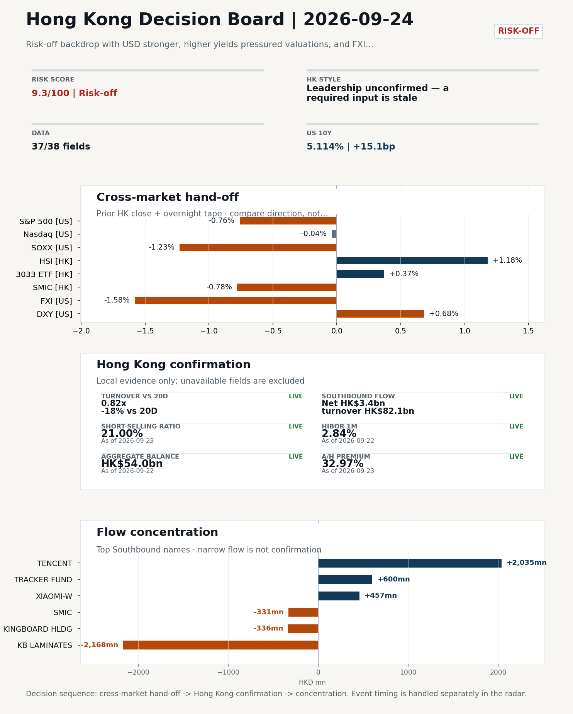
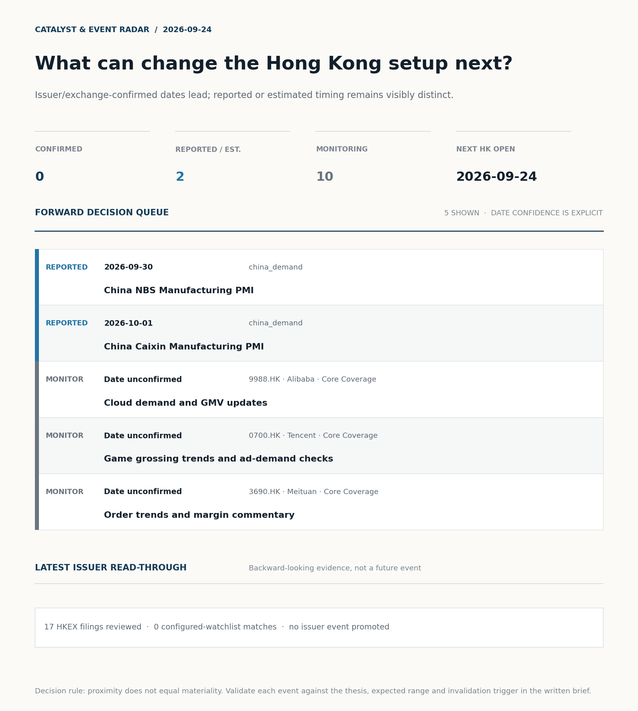
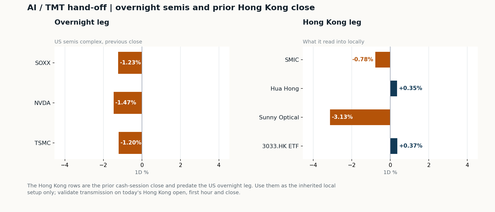
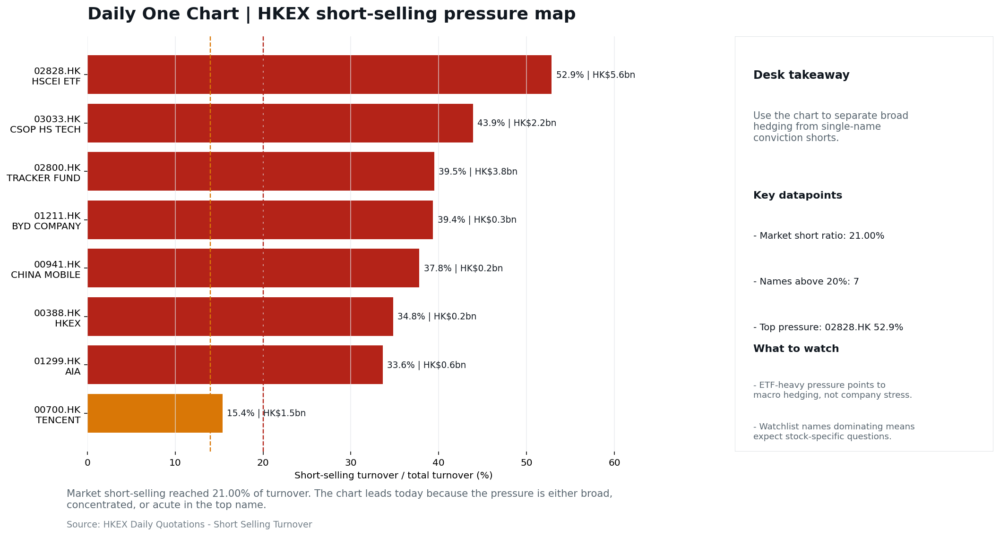

# Morning Research Workbench | 2026-09-24

> **Commute reading route:** `Layer 1 scan (5 min)` → `Layer 2 deep read` → `Layer 3 and appendix if time allows`
>
> Mode: `Trading Daily` | Keep the report execution-oriented: what mattered in the completed session, what can move Hong Kong leadership, and what needs fast follow-up.

_Data through: US/global `2026-09-23` | HK `2026-09-23` | A-share `2026-09-23` | Generated `2026-09-24 07:41:42`_

## Executive Summary

- **Did yesterday's call work?** UNRESOLVED - No comparable next close is available yet, so the call is still open.
- **What changed overnight?** Semis led lower: SOXX -1.23%, NVDA -1.47%, TSMC -1.20%.
- **What it means for AI/TMT** Style call withheld: HSCEI was stale (2 trading days old); Hang Seng Index was stale (2 trading days old); 3033.HK ETF / HSCEI comparison blocked: effective dates differ (2026-09-22 vs 2026-09-21). The stale input is excluded from the risk score.
- **What to watch today** Confirm if SMIC and Hua Hong open in the same direction as the overnight leg and hold it through the first hour; invalidate if they track HSCEI instead.

## Layer 1 | Scan (5 min)

### 1.1 Yesterday's Call
**Verdict: UNRESOLVED.** No comparable next close is available yet, so the call is still open.

**Recent record.** 6 confirmed / 4 broken over the last 10 scoreable calls (60.0% hit rate). This is a directional close-to-close diagnostic, not a track record.

### 1.2 Opening Decision Board

**Global-to-Hong Kong signals**

_Decision-useful subset: each row states the implication and the next test. Descriptive secondary monitors are kept out of the five-minute scan._

| Signal | Last / move | Interpretation | Confirmation / invalidation |
| --- | --- | --- | --- |
| S&P 500 | 7,706.03 / -0.76% | Broad US risk fell without a clear driver in today's fields; treat it as beta, not a signal. | Watch whether Nasdaq and offshore-China proxies move the same way. |
| Nasdaq 100 | 30,470.29 / -0.04% | Growth outperformed broad beta, a supportive style signal for Hong Kong internet and platform names. | 3033.HK versus HSI leadership carries the read; rising yields would undo it. |
| Hang Seng Index | 25,042.71 / +1.18% | The index was carried by old-economy and H-share names, not by broad participation: 3033.HK differs by 0.81pp. | Southbound participation decides whether this is investable or just a print. |
| Hang Seng TECH ETF (3033.HK) | 4.3540 / +0.37% | Hong Kong growth lagged, so broad-index strength is not yet a duration signal. | Needs a stable CNH and Southbound buying to become a duration signal. |
| Semiconductors (SOXX) | 565.72 / -1.23% | Semis underperformed the Nasdaq by 1.19pp, so this is a cycle move rather than broad growth weakness. | SMIC and Hua Hong at the open show whether it transmits to Hong Kong. |
| US 10Y | 5.1140% / +15.1bp | The yield proxy rose, tightening the discount-rate backdrop for long-duration Hong Kong growth. | Read it through 3033.HK relative performance, not the index level. |
| USD/CNH | 6.6830 / -0.37% | A stronger offshore renminbi supports the external-risk backdrop for Hong Kong equities. | FXI and Southbound flow decide whether this reaches Hong Kong equities. |
| VIX | 15.18 / **+2.08%** | Higher implied volatility raises the tail-risk premium and weakens risk-on conviction. | Falling volatility on narrowing breadth is a warning, not support. |

_Secondary monitors retained in the source bundle: SMIC (0981.HK), CSI 300, China 10Y, CN-US 10Y spread, DXY, USD/HKD, Brent crude, COMEX gold, Copper._

**Hong Kong local confirmation**

| Check | Value | Status | Source / as of | Why it matters |
| --- | --- | --- | --- | --- |
| Main Board turnover vs 20D | 0.82x \| -18% vs 20D | Live local | HKEX \| 2026-09-23 | Trailing 20-session average turnover was HK$224.0bn. |
| Southbound / Northbound net flow | Southbound Net HK$3.4bn \| turnover HK$82.1bn \| Northbound Turnover RMB236.5bn \| net not reported | Live local | HKEX Connect \| 2026-09-23 | Southbound net buy is calculated from HKEX disclosed buy and sell turnover. |
| Short-selling ratio | 21.00% | Live local | HKEX \| 2026-09-23 | Official HKEX stock-level short-selling table, aggregated as a share of total market turnover. |
| AH premium index | 32.97% | Live public | Yahoo \| 2026-09-23 | Equal-weighted average across 16 A/H pairs that resolved today. Composition varies by day, so the level is not comparable with prior reports (fixed basket incomplete: missing ICBC). [trimmed] |
| USD/HKD spot vs band | 7.8426 \| band 7.7500 to 7.8500 | Live quote + local | Yahoo \| 2026-09-23 | 74 pips from the weak-side CU (7.8500); monitor HKMA operations and the aggregate balance for a funding squeeze. Official Convertibility Undertakings define the linked-rate stress boundaries for USD/HKD. |
| HIBOR 1M | 2.84% | Live local | HKMA \| 2026-09-22 | 1M HIBOR is the cleanest quick read for Hong Kong funding conditions and equity-duration pressure. |
| Hong Kong leadership | Leadership unconfirmed - a required input is stale | Proxy | HSI / HSCEI / 3033.HK ETF relative \| 2026-09-23 | Use HSI / HSCEI / 3033.HK ETF relative moves as the opening style read. |

**Risk state and evidence**

**Composite risk score:** `9.3/100` | **Regime:** `Risk-off`

| Component | Score impact | Evidence |
| --- | --- | --- |
| US beta | -4.6 | S&P 500 -0.76% |
| HK growth ETF proxy | +1.9 | 3033.HK ETF +0.37% |
| Semis complex | -6.2 | SOXX -1.23% |
| Offshore China proxy | -7.9 | FXI -1.58% |
| Dollar pressure | -6.8 | DXY +0.68% |
| Volatility | -4.2 | VIX +2.08% |
| HK short-selling | -8 | Short-selling ratio 21.00% |
| HK turnover | -5 | Turnover 0.82x 20D |
| Excluded (stale) | +0.0 | Not scored: Hang Seng Index (stale 2d); HSCEI (stale 2d) |

_Base 50 plus the component deltas above. Semis complex entered the score on 2026-08-22; earlier scores in the ledger exclude it._

**Morning Checklist**

1. **Risk-off backdrop with USD stronger, higher yields pressured valuations, and FXI outperformed Nasdaq 100**
 Overnight regime | Start by deciding whether the day is about Risk-off conditions or a style pivot.
2. **China LPR (1Y / 5Y) (Past expected window (unverified))**
 Macro / policy | Watch whether it changes the day's core market narrative | Industries: Market-wide
3. **Hong Kong CPI (Past expected window (unverified))**
 Macro / policy | Local funding conditions, retail purchasing power, and HKD real rates | Industries: Property, Retail, Banks
4. **China NBS Manufacturing PMI**
 Catalysts | Watch whether it changes risk budgets or the theme-trading cadence

## Visual Dashboard

**Catalyst & Event Radar**

**Chart read:** No issuer/exchange-confirmed event date is populated; 2 reported or estimated timing item(s) and 10 undated trigger(s) remain explicit.

_Source: Public calendars, issuer disclosures and configured research watchlists_
## Layer 2 | Core Research (20-30 min)

### 2.1 Global-to-Hong Kong Transmission
**Market Setup**
**Core tape.** Risk-off backdrop with USD stronger, higher yields pressured valuations, and FXI outperformed Nasdaq 100

**Key Drivers**
- US 10Y yield +15.1bp to 5.114% pressured long-duration growth and lifted DXY +0.68%, the dominant drag on US equities despite flat NDX.
- Semis complex (SOXX -1.23%, TSMC -1.20%, NVDA -1.47%) led the de-rating, with transmission risk to HK-listed SMIC and Hua Hong at the next open.
- Offshore China proxy FXI at -1.58% outperformed Nasdaq 100 by 0.24pp, a relative-strength signal that limits how aggressively Hong Kong beta can be underweighted.
- USD/CNH firmer by 0.37% intraday and USD/HKD at 7.8426 (74 pips from the weak-side CU) keep the cross-border and funding lens live into Asia.

**Hong Kong Read-Through**
**Opening implication.** For the 2026-09-24 Hong Kong session, expect a defensive, yield-sensitive open.
_Hong Kong style leadership and flow confirmation are set out in the Hong Kong review below._

**Watch Points**
- USD composite moved higher by +0.38pct intraday, with a 0.416pct range.
- Main turning points appeared around 2026-09-23 08:05 peak / 2026-09-23 08:30 trough / 2026-09-23 08:45 peak, suggesting event-driven repricing rather than a clean one-way USD move.
- The biggest cross-asset divergence was FXI versus Nasdaq 100, a spread of 0.24pct.
- Gold moved -1.32pct intraday with a 1.625pct high-low range.

**Curated overnight stories**
1. ****
 Why it matters: Sets the regime for tomorrow's Hong Kong open: stronger USD and higher US yields typically compress HKD-asset multiples, while FXI's relative resilience vs.
 HK read-through: Drives the tape at the open; supports a barbell of yield/utility/defensive names over long-duration growth, but the FXI vs.
2. **Stocks making the biggest moves premarket/midday: Alibaba among the largest movers**
 Why it matters: BABA appearing in both the premarket and midday US move lists indicates persistent, session-long pressure on the China Internet flagship rather than a one-off print.
 HK read-through: Direct read-across to HK-listed China Internet (Tencent, Meituan, JD, NetEase, Baidu ADR) and to Hang Seng Tech.
3. **Trump-Xi meeting: Why China's self-sufficiency changes the calculus**
 Why it matters: A policy framing piece on US-China decoupling is relevant because it conditions how investors price China policy support, supply-chain reshoring beneficiaries, and the…
 HK read-through: Most relevant for semis, EV/battery, biotech, and software names exposed to export controls.
4. **Jamie Dimon says hyperscaler AI spending could hit $1 trillion next year**
 Why it matters: A $1tn order-of-magnitude figure from a high-profile banking CEO repricing the AI capex cycle affects US mega-cap tech first.
 HK read-through: Indirect via US tech sentiment into HK Tech; useful framing for AI-exposed China cloud and hardware names. Lower urgency than the China Internet tape.
5. **China LPR (1Y/5Y) and NBS/Caixin Manufacturing PMIs due in the target HK session**
 Why it matters: These are the highest-scoring macro items in the must-watch list and print inside the 2026-09-24 HK session, directly shaping onshore rates, banks, property, and cyclicals.
 HK read-through: Property, banks, industrials, and materials most sensitive to LPR; cyclicals and exporters sensitive to PMIs.

**AI / TMT hand-off**

**Overnight leg.** The overnight semis leg was risk-off at -1.30% average (SOXX -1.23%, NVDA -1.47%, TSMC -1.20%).
**Hong Kong expression.** SMIC, Hua Hong and Sunny Optical are under the most pressure at the open, and 3033.HK should be tested before the Hang Seng Index.
**Observable test.** Confirm if SMIC and Hua Hong open in the same direction as the overnight leg and hold it through the first hour; invalidate if they track HSCEI instead, which would mean local flow is overriding the global cycle.

| Name | Role in the chain | 1D | Leg |
| --- | --- | --- | --- |
| SOXX | Semis complex | -1.23% | overnight |
| NVDA | AI capex narrative | -1.47% | overnight |
| TSMC | Foundry demand | -1.20% | overnight |
| SMIC | Leading-edge / domestic substitution | -0.78% | Hong Kong |
| Hua Hong | Mature-node pricing cycle | +0.35% | Hong Kong |
| Sunny Optical | Hardware and optics supply chain | -3.13% | Hong Kong |
| 3033.HK ETF | Broad HK tech beta | +0.37% | Hong Kong |

**Clock discipline.** The Hong Kong rows are the prior cash-session close and predate the US overnight leg. Use them as the inherited local setup only; validate transmission on today's Hong Kong open, first hour and close.

### 2.2 Hong Kong Local Tape and Flow
**Style and Local Leadership**
**Style call.** Leadership unconfirmed - a required input is stale.
- **Evidence:** No same-date 3033.HK-versus-HSCEI comparison was possible because HSCEI was stale (2 trading days old); Hang Seng Index was stale (2 trading days old); 3033.HK ETF / HSCEI comparison blocked.
- **Portfolio meaning:** Do not infer Hong Kong style from the headline index alone; wait for relative price and local-flow evidence.
- **Cross-market read:** Hang Seng stale 2d / HSCEI stale 2d / 3033.HK ETF +0.37%. Offshore China proxy FXI -1.58% and USD/CNH -0.37% frame cross-border risk appetite. USD/HKD last traded around 7.8426, which keeps the Hong Kong funding lens in focus.

**Flow Confirmation**
Official Stock Connect evidence is available; the Flow Tracker confirms whether local money supports the price action.

**Follow-Through Checklist**
**Follow-through check.** Confirm at the 2026-09-24 cash open whether (1) 3033.HK holds or extends its +0.37% gain against HSCEI/2828.HK, (2) SMIC (0981.HK) and Hua Hong (1347.HK) absorb the SOXX -1.23% / TSMC -1.20% drag without breaking prior support, and (3) USD/HKD stays inside 7.8426 / 7.8500 with Main Board turnover recovering above 1.0x the 20D average. If those three confirm, treat it as confirmation of relative China-tech resilience versus the offshore-China complex; if any one fails, treat the FXI-outperformance signal as unconfirmed and lean defensive into the 2026-09-25 session, with the LPR/PMI prints inside the window as the next macro confirmation test.
**Failure condition.** Any style claim remains invalid while the required relative-performance fields are missing or stale.

**Cross-asset attribution**

| Driver | Direction | Score | Evidence | HK implication |
| --- | --- | --- | --- | --- |
| Short-selling pressure | drag | 4.2 | HKEX short-selling ratio was 21.00%. | Elevated short activity argues for extra confirmation before chasing rebounds. |
| Rates impulse | drag | 2.26 | US 10Y yield moved +15.1bp. | Lower yields help long-duration growth; higher yields pressure valuation-sensitive |
| Hong Kong participation | drag | 1.77 | Main Board turnover was 0.82x the 20-session average. | Thin turnover makes index moves easier to fade. |
| Dollar / CNH pressure | drag | 1.02 | DXY +0.68% / USD-CNH -0.37% | A stable or softer CNH makes Hong Kong follow-through more credible. |
| Global equity beta | drag | 0.76 | S&P 500 moved -0.76%. | Broad beta matters if Hong Kong breadth confirms the overseas signal. |

**Local flow evidence**

**Flow Takeaways**
- Short-selling pressure is elevated, so local rebounds need cleaner breadth and flow confirmation.
- Stock Connect Southbound: net HK$3.4bn on turnover HK$82.1bn (as of 2026-09-23).
- Stock Connect Northbound: turnover RMB236.5bn; public file provides total turnover/top active names, not full net-buy.
- AH premium: covered-pair average +32.97% over 16 pairs. Composition varies by day, so this level is not comparable with prior reports; widest premium: China Railway Construction 62.46%.

**Stock Connect Southbound Active Names**

| # | Ticker | Name | Buy | Sell | Net buy | HKEX turnover rank |
| --- | --- | --- | --- | --- | --- | --- |
| 1 | 01888.HK | KB LAMINATES | HK$1,079.1mn | HK$3,247.3mn | HK$-2,168.2mn | 3 |
| 2 | 00700.HK | TENCENT | HK$3,864.1mn | HK$1,829.0mn | HK$2,035.1mn | 2 |
| 3 | 02800.HK | TRACKER FUND | HK$601.5mn | HK$1.8mn | HK$599.7mn | 6 |
| 4 | 01810.HK | XIAOMI-W | HK$690.3mn | HK$233.3mn | HK$457.0mn | 8 |
| 5 | 00148.HK | KINGBOARD HLDG | HK$671.0mn | HK$1,007.5mn | HK$-336.5mn | 7 |

**AH Premium Dispersion**

| Name | A ticker | H ticker | Premium | As of |
| --- | --- | --- | --- | --- |
| China Railway Construction | 601186.SS | 1186.HK | +62.46% | 2026-09-23 |
| China Railway | 601390.SS | 0390.HK | +58.67% | 2026-09-23 |
| China Communications Construction | 601800.SS | 1800.HK | +57.88% | 2026-09-23 |

**HKEX Short-Selling Watch**

| Ticker | Name | Short ratio | Short turnover | Total turnover |
| --- | --- | --- | --- | --- |
| 00388.HK | HKEX | 34.81% | HK$0.2bn | HK$0.6bn |
| 00700.HK | TENCENT | 15.38% | HK$1.5bn | HK$9.9bn |
| 00941.HK | CHINA MOBILE | 37.80% | HK$0.2bn | HK$0.5bn |

- **Short-value leaders:** 02828.HK HSCEI ETF (HK$5.6bn); 02800.HK TRACKER FUND (HK$3.8bn); 03033.HK CSOP HS TECH (HK$2.2bn); 09988.HK BABA-W (HK$1.6bn).

### 2.3 Macro Transmission
**Desk read.** The macro agenda is light and stale.

**Market sensitivity.** The China LPR window (2026-09-20) and Hong Kong CPI window (2026-09-21) are both flagged as past expected window and unverified, so they do not yet qualify as a confirmed policy or inflation read.

**HK implication.** That leaves today's Hong Kong risk appetite to be driven almost entirely by the overnight global tape, where the regime is risk-off: NVDA -1.47%, SOXX -1.23%, TSMC ADR -1.20%, VIX +2.08% to 15.18.

**Macro watchpoints**
- Verify the China LPR 1Y/5Y release and any post-print CNY/CGB move before building a policy view.
- Verify the Hong Kong CPI release; under the peg it is a second-order read but it sets the tone for HK property and retail.
- US yields, DXY, and the SOXX/Nasdaq tape into the HK open; VIX 15.18 +2.08% argues for tighter sizing if it holds.
- Relative strength of FXI vs Nasdaq 100: if it persists, mainland banks and SOE names stay the leadership hedge against tech softness.

| Time | Region | Event | Status | Desk read |
| --- | --- | --- | --- | --- |
| | CN | China LPR (1Y / 5Y) | Past expected window (unverified) | Impact: Watch whether it changes the day's core market narrative \| Attention: 5/5 \| Industries: Market-wide |
| | HK | Hong Kong CPI | Past expected window (unverified) | Impact: Local funding conditions, retail purchasing power, and HKD real rates \| Attention: 1/5 \| Industries: Property, Retail, Banks |

**Positioning and risk backdrop**

- Detailed local flow evidence is covered under Flow Tracker and Attribution; keep this section focused on options, hedging, and macro-positioning risk.

### 2.4 Company Micro Research and Catalysts

| Grade | Sector | Headline | Why it matters | Horizon |
| --- | --- | --- | --- | --- |
| B | China Internet | Stocks making the biggest moves midday | Assess whether the story can propagate through the China Internet value | Monitor |
| B | China Internet | Stocks making the biggest moves premarket | Assess whether the story can propagate through the China Internet value | Monitor |

**LLM Quick Takes**
- **9988.HK** | Closed -4.36% at HK$109.80, mid-range at 46% of 60-session band. Day mix: a securities-fraud probe announcement (Portnoy Law Firm evaluation) versus a Citi constructive AI-infrastructure…
- **0700.HK** | Closed -2.35% at HK$441.00, mid-range at 30% of 60-session band. AI image model launch (2026-09-22) is a sentiment positive but did not offset the broader risk-off drag.…
- **1211.HK** | Closed -1.23% at HK$80.35, near the bottom (12%) of its 60-session range. Narrative around potential US market barriers is commentary-based, not a confirmed policy action.…
- **1299.HK** | Closed -1.18% at HK$75.35, mid-range at 59%. No fresh news attached; movement appears theme-driven (risk-off, USD stronger) rather than company-specific.…

Decision filter<h4>No immediate portfolio catalyst: 17 official filings were screened and the low-signal market set stays aggregated.</h4>
17 profit warnings

<strong>17</strong>Official filings

<strong>0</strong>Watchlist hits

<strong>0</strong>Actionable events

<article class="event-card priority-monitor">

MonitorEarnings<time>2026-10-20</time>

<h5>China Mobile · 0941.HK</h5>

Estimate comparison unavailable

Investor read
Calendar monitor only; no consensus comparison is available, so this is not yet an earnings view.

Next check
Confirm timing and obtain a consensus/KPI frame before promoting this event.

<a class="event-source" href="https://finance.yahoo.com/quote/0941.HK">Yahoo Finance ticker calendar ↗</a>
</article>

<strong>Coverage boundary.</strong> sell-side rating changes, IPO / grey-market monitor were not decision-grade in this run; their absence is not treated as confirmation that no event exists.

**Core coverage requiring follow-up**

**Core coverage**

| Name | Ticker | Last | 1D | Range position | Morning note |
| --- | --- | --- | --- | --- | --- |
| Alibaba | 9988.HK | 109.80 | -4.36% | Mid-range | Down 4.36% on the session, mid-range at 46% of its 60-session band. |
| Tencent | 0700.HK | 441.00 | -2.35% | Mid-range | Down 2.35% on the session, mid-range at 30% of its 60-session band. |

**Recent headlines for Alibaba:**
- [What Does Alibaba (BABA) Facing A Securities Fraud Probe Mean Now?](https://finance.yahoo.com/markets/stocks/articles/does-alibaba-baba-facing-securities-211806119.html) (Simply Wall St.)
**Recent headlines for Tencent:**
- [Tencent Stock Jumps After New AI Model Takes on Alibaba](https://finance.yahoo.com/technology/ai/articles/tencent-stock-jumps-ai-model-124341288.html) (GuruFocus.com)

**Priority follow-up**

| Name | Ticker | Last | 1D | Range position | Morning note |
| --- | --- | --- | --- | --- | --- |
| BYD Company | 1211.HK | 80.35 | -1.23% | Bottom of range | Marginally lower (-1.23%), still in the bottom quartile of its 60-session range (12%). |
| AIA | 1299.HK | 75.35 | -1.18% | Mid-range | Marginally lower (-1.18%), mid-range at 59% of its 60-session band. |

**Recent headlines for BYD Company:**
- [BYD (SEHK:1211) Stock Could Be Trading At A Premium As US Market Barriers Loom](https://finance.yahoo.com/markets/stocks/articles/byd-sehk-1211-stock-could-221504957.html) (Simply Wall St.)

### 2.5 Morning Meeting Questions
**Q1. Why is there no style call today?**
- **Evidence:** HSCEI was stale (2 trading days old); Hang Seng Index was stale (2 trading days old); 3033.HK ETF / HSCEI comparison blocked: effective dates differ (2026-09-22 vs 2026-09-21).
- **How to answer:** A required input was stale, so any relative-performance claim would have compared two different dates. The call is withheld rather than published on partial evidence, and the stale input is excluded from the risk score.

## Layer 3 | Session Playbook (8-12 min)

### 3.1 Base Case and Scenario Map
**Starting posture.** Leadership unconfirmed - a required input is stale (unconfirmed); composite risk `9.3/100` (Risk-off). Do not infer Hong Kong style from the headline index alone; wait for relative price and local-flow evidence.

**Scenario map**

| Scenario | Observable trigger | Interpretation | Research response |
| --- | --- | --- | --- |
| Selective growth confirms | First refresh 3033.HK and HSCEI on the same session and basis; then require a >0.5pp first-hour 3033.HK lead, stable CNH and firmer semis. | The style thesis becomes measurable only after the comparison is aligned. | Keep internet/platform leadership on watch; do not upgrade it from the stale comparison alone. |
| Broad beta confirms | HSI and HSCEI rise together with improving breadth and normal first-hour turnover. | A broad market move is observable even while the style spread remains unavailable. | Research financials, SOEs and index-heavy names alongside growth leaders. |
| Risk-off continuation | HSI and HSCEI weaken, semis lag and CNH depreciation accelerates. | Local risk appetite is deteriorating without a reliable style offset. | Treat rebounds as unconfirmed; focus on balance-sheet, catalyst and crowding risk. |

**Clocked validation scorecard**

| Window | Check | Prior evidence | Pass condition | What it decides |
| --- | --- | --- | --- | --- |
| 09:30-10:30 | 3033.HK vs HSCEI | Same-session style spread unavailable | Refresh both legs on one session/basis; only then test for a >0.5pp lead | Whether growth leadership survives the open |
| 09:30-10:30 | Semiconductor hand-off | SMIC -0.78%; Hua Hong Semiconductor +0.35% | Stabilise after the open; at least one stops underperforming HSCEI | Whether overnight semis pressure is contained locally |
| 09:30-10:30 | HSI price zone | 25,043 vs 25,000 / 25,500 reference grid | Hold above the lower grid or reclaim the upper grid with breadth | Whether broad beta is stabilising; grid is derived, not technical analysis |
| 09:30-10:30 | USD/CNH | 6.683 \| -0.37% | No acceleration in CNH depreciation | Whether FX permits a clean Hong Kong risk extension |
| At close | Turnover | 0.82x \| -18% vs 20D | At least 1.0x the 20-session average | Whether the move had normal participation |
| At close | Southbound | Net HK$3.4bn \| turnover HK$82.1bn | Net buying remains positive and broadens beyond one or two names | Whether mainland money confirms the price move |
| At close | Short pressure | 21.00% | Falls versus the prior verified reading (21.00%) | Whether rebound conviction improved |

**Upgrade rule.** Confirm only after HSI, HSCEI, 3033.HK, turnover, and Southbound evidence refresh on a comparable date.
**Kill switch.** Any style claim remains invalid while the required relative-performance fields are missing or stale.
**Clock discipline.** At 07:30, same-day Southbound, turnover and short-selling outcomes are not known. Use the first-hour price/FX checks provisionally and make the final classification only after the close.
**Event clock.** No same-day decision-grade item is populated; the nearest reported/estimated item is China NBS Manufacturing PMI on 2026-09-30. Verify the issuer or official calendar before relying on the date.

### 3.2 Conditional Theme Deep Dive

| Field | Read |
| --- | --- |
| Theme | China Exports and Supply-Chain Relocation |
| Angle for the day | Track tariffs, trade policy, shipping, and manufacturing orders to see whether export resilience is still the cleaner China macro expression. |

**Theme desk read**
**Core thesis.** The rotating theme this week is China exports and supply-chain relocation, framed against a risk-off overnight backdrop where USD firmer, UST 10Y +15.1bp to 5.114, and FXI outperforming Nasdaq 100 suggest the cleaner China expression right now is via real-economy exporters rather than long-duration tech.
**Evidence.** The question for the HK open on 2026-09-24 is whether the high-frequency tape confirms that read.
**What to test.** Within the related names, 1211.HK (BYD) sits at the bottom 12% of its 60-session range with -1.23% on the day, so it is best treated as a marginal-information read on EV export mix and price competition rather than a directional signal; 0941.HK (China Mobile) at mid-range with -0.19% continues to function as the defensive SOE hedge if the risk-off read extends.

**Signals to keep in mind**
- NVDA -1.47%: Keep tracking it to confirm whether the core daily narrative is holding.
- VIX +2.08%: Higher volatility argues for tighter sizing and tighter stops.

**LLM watch items:**
- Confirm official 2026-09-20 China LPR and 2026-09-21 HK CPI prints before treating rates/local-funding signals as live.
- Track SMIC, Hua Hong and 3033.HK at the open as the first HK test of the NVDA/SOXX/TSMC overnight softness.
- Watch whether 1211.HK stabilises at the bottom of its range or breaks, given its role as the export-mix read for EVs.
- Mark 2026-09-30 NBS Manufacturing PMI and 2026-10-01 Caixin Manufacturing PMI as the next catalysts that can validate or reject the
- Keep sizing discipline tight into the 2026-09-24 HK session while VIX is up +2.08% and UST 10Y sits at 5.114%.

**Related names to keep close:**

| Name | Ticker | Bucket | Morning read |
| --- | --- | --- | --- |
| BYD Company | 1211.HK | Priority follow-up | Marginally lower (-1.23%), still in the bottom quartile of its 60-session range (12%). |
| China Mobile | 0941.HK | Priority follow-up | Marginally lower (-0.19%), mid-range at 62% of its 60-session band. |

**Upcoming catalysts tied to the theme:**
- 2026-09-30 | China NBS Manufacturing PMI | Watch whether it changes risk budgets or the theme-trading cadence
- 2026-10-01 | China Caixin Manufacturing PMI | Watch whether it changes risk budgets or the theme-trading cadence

### 3.3 Daily One Chart
**Daily One Chart | HKEX short-selling pressure map**

**Chart read.** Market short-selling reached 21.00% of turnover.
**Why it matters.** The chart leads today because the pressure is either broad, concentrated, or acute in the top name.

_Source: HKEX Daily Quotations - Short Selling Turnover_

## Optional Appendix | Traceability and Performance (10-15 min)

### Report Metadata
> Date policy: Review date 2026-09-23 is treated as `Trading Daily`. | Global (US/Europe) data date is 2026-09-23; adapter effective date is 2026-09-23 and summary date is 2026-09-23. | Hong Kong local data date is 2026-09-23; role: same-session local cash tape.
> Market data quality: Coverage: `37/38` | Stale items (>1d): `5` | Missing: `1`
> Report quality: `95.5/100` | Grade `C` | Status `usable with caveats`

### Report Quality and Validation
- **Quality score:** 95.5/100 | **Grade:** C | **Status:** usable with caveats
- **Run summary:** 8 healthy | 2 caveat | 0 failed
- **Release recommendation:** Send with caveats | The report is usable, but the advisory guidance should travel with it so readers understand the data gaps.

| Source | Status | Bucket |
| --- | --- | --- |
| Macro calendar | partial | caveat |
| Risk and sentiment feed | partial | caveat |

**Desk-use guidance summary:** 0 blocking | 1 advisory

**Desk-use guidance**
- **Advisory:** A core instrument quote is stale; the style call is downgraded and the stale leg is excluded from scoring.
- **Advisory:** Questionable narrative fields were removed; use the deterministic fallback copy and review the audit trail.
- **Grade capped:** Stale core instrument(s): Hang Seng Index (2d), Hang Seng China Enterprises (2d)
- **Grade capped:** Hong Kong style comparison blocked: effective dates differ (2026-09-22 vs 2026-09-21)

**Quality warnings**
- Narrative fact-check guardrail produced warnings; review the validation table before relying on narrative sections.
- Core instrument quotes are stale, so the Hong Kong style call and risk score are degraded: Hang Seng Index (2d), Hang Seng China Enterprises (2d)
- Hong Kong style comparison was withheld because the input dates or bases were not aligned.

**Narrative fact-check guardrail**
- Checked 17 numeric claims; 0 numeric mismatch(es), 0 logic warning(s); 10 structured claims, 0 source/text warning(s); 0 critical, 0 review. Replaced 10 unsafe narrative field(s) with deterministic fallback copy.
- **Deterministic fallback fields:** company_takeaway, deep_read_setup, hk_review_setup, news_summary, selected_news[0].headline, tasks.company_commentary.paragraph, tasks.hk_review.paragraph, tasks.news_selection.selected_news[0].headline

_Full component weights, per-source freshness, adapter status and provenance records are archived with this report under `audit/` rather than printed here._

### Historical Signal Performance
- **Readiness:** exploratory with caveats | 69 observations | 107 active signal dates | next-close entry, 10bps cost, no same-day returns.
- **Interpretation boundary:** exploratory until a benchmark reaches 252 sessions and 100 active-signal sessions.
- **Data-quality caveat:** 23 conflicting price revision(s) and 6 non-session observation(s) remain in the research ledger.
- **Daily-use boundary:** cumulative return, Sharpe and the performance chart stay out of the daily commute edition until the sample and trading-calendar gates pass; use Yesterday's Call instead.

### Source Links
- [Stocks making the biggest moves midday: McDonald's, Cracker Barrel, Alibaba, Worthington & more](https://www.cnbc.com/2026/09/23/stocks-making-the-biggest-moves-midday-mcd-cbrl-baba-wor-.html) (cnbc_markets)
- [Stocks making the biggest moves premarket: Alibaba, Quest Diagnostics, On Holding, GameStop & more](https://www.cnbc.com/2026/09/22/stocks-making-the-biggest-moves-premarket-baba-dgx-onon-gme.html) (cnbc_markets)
- [What Does Alibaba (BABA) Facing A Securities Fraud Probe Mean Now?](https://finance.yahoo.com/markets/stocks/articles/does-alibaba-baba-facing-securities-211806119.html) (Simply Wall St.)
- [Citi Doubles Down on Alibaba Stock as AI Ambitions Accelerate](https://finance.yahoo.com/technology/ai/articles/citi-doubles-down-alibaba-stock-192856593.html) (GuruFocus.com)
- [Tencent Stock Jumps After New AI Model Takes on Alibaba](https://finance.yahoo.com/technology/ai/articles/tencent-stock-jumps-ai-model-124341288.html) (GuruFocus.com)
- [Meituan (MPNGF) (Q2 2026) Earnings Call Highlights: Record Revenue and Strategic AI Pivot Drive...](https://finance.yahoo.com/markets/stocks/articles/meituan-mpngf-q2-2026-earnings-190123345.html) (GuruFocus.com)
- [BYD (SEHK:1211) Stock Could Be Trading At A Premium As US Market Barriers Loom](https://finance.yahoo.com/markets/stocks/articles/byd-sehk-1211-stock-could-221504957.html) (Simply Wall St.)
- [China Mobile (SEHK:941): A Closer Look at Valuation After Steady Share Price Gains This Year](https://finance.yahoo.com/news/china-mobile-sehk-941-closer-154022664.html) (Simply Wall St.)
- [01010.HK Profit warning / alert announcement](http://www1.hkexnews.hk/listedco/listconews/sehk/2026/0923/2026092301607.pdf) (HKEXnews)
- [01130.HK Profit warning / alert announcement](http://www1.hkexnews.hk/listedco/listconews/sehk/2026/0922/2026092100684.pdf) (HKEXnews)
- [01195.HK Profit warning / alert announcement](http://www1.hkexnews.hk/listedco/listconews/sehk/2026/0922/2026092200827.pdf) (HKEXnews)
- [02033.HK Profit warning / alert announcement](http://www1.hkexnews.hk/listedco/listconews/sehk/2026/0922/2026092200949.pdf) (HKEXnews)
- [08439.HK Profit warning / alert announcement](http://www1.hkexnews.hk/listedco/listconews/gem/2026/0922/2026092201073.pdf) (HKEXnews)
- [00178.HK Profit warning / alert announcement](http://www1.hkexnews.hk/listedco/listconews/sehk/2026/0921/2026092100476.pdf) (HKEXnews)
- [00591.HK Profit warning / alert announcement](http://www1.hkexnews.hk/listedco/listconews/sehk/2026/0921/2026092100728.pdf) (HKEXnews)
