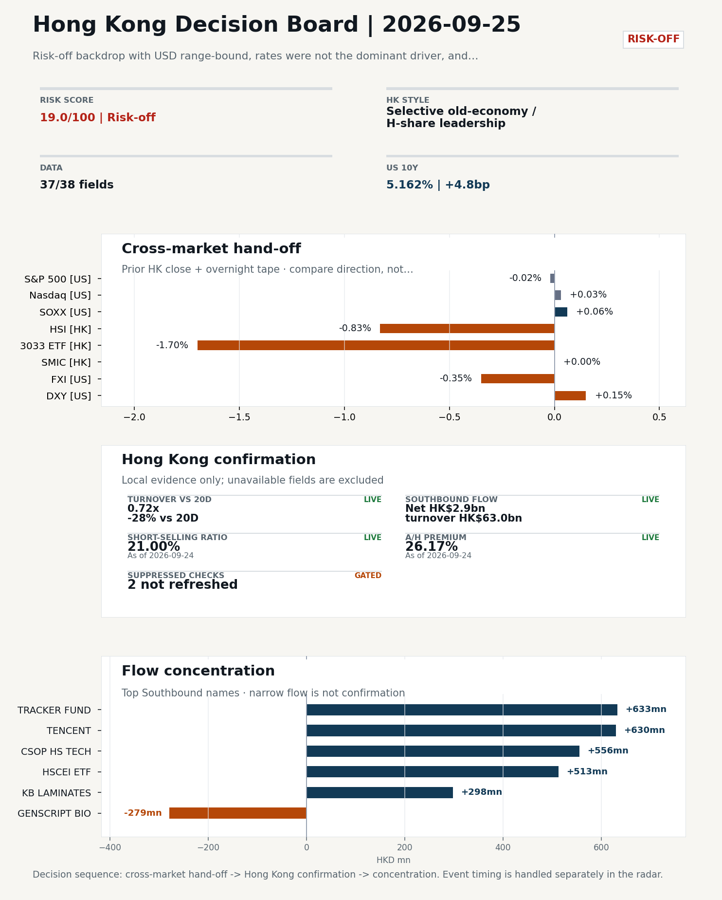
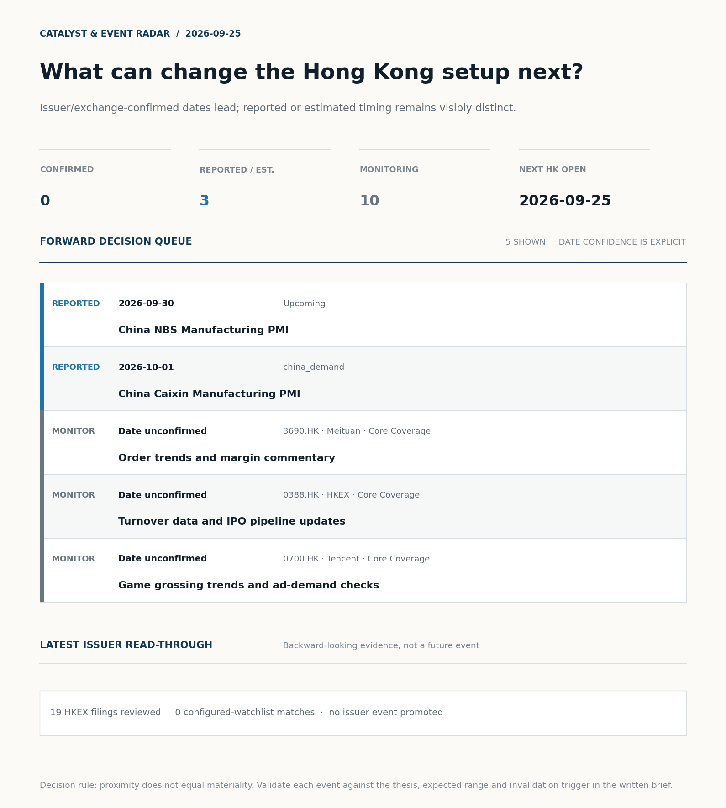
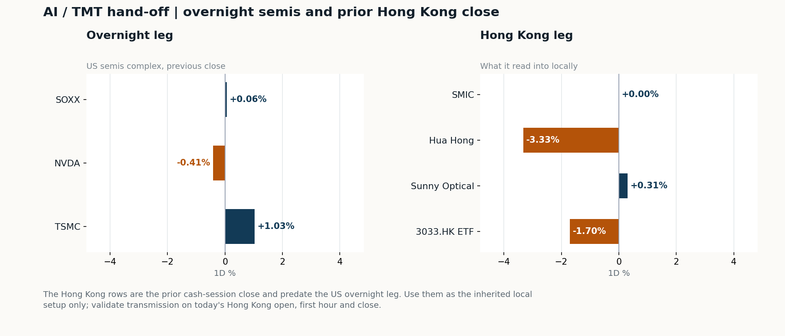
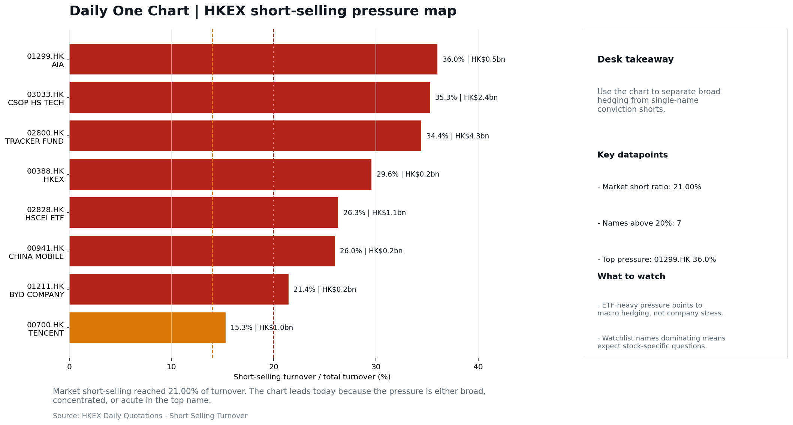

# Morning Research Workbench | 2026-09-25

> **Commute reading route:** `Layer 1 scan (5 min)` → `Layer 2 deep read` → `Layer 3 and appendix if time allows`
>
> Mode: `Trading Daily` | Keep the report execution-oriented: what mattered in the completed session, what can move Hong Kong leadership, and what needs fast follow-up.

_Data through: US/global `2026-09-24` | HK `2026-09-24` | A-share `2026-09-24` | Generated `2026-09-25 07:54:09`_

## Executive Summary

- **Did yesterday's call work?** UNRESOLVED - No comparable next close is available yet, so the call is still open.
- **What changed overnight?** Semis led higher: SOXX +0.06%, NVDA -0.41%, TSMC +1.03%. HSI -0.83% and 3033.HK -1.70%.
- **What it means for AI/TMT** Style, not beta - Selective old-economy / H-share leadership, a 0.91pp spread. Treat banks, energy, telecoms, and SOE yield as the cleaner relative expression; growth beta still needs proof.
- **What to watch today** Next scheduled catalyst: China NBS Manufacturing PMI on 2026-09-30. Watch whether SMIC and Hua Hong trade with HSCEI rather than with the overnight semis leg.

## Layer 1 | Scan (5 min)

### 1.1 Yesterday's Call
**Verdict: UNRESOLVED.** No comparable next close is available yet, so the call is still open.

**Recent record.** 6 confirmed / 4 broken over the last 10 scoreable calls (60.0% hit rate). This is a directional close-to-close diagnostic, not a track record.

### 1.2 Opening Decision Board

**Global-to-Hong Kong signals**

_Decision-useful subset: each row states the implication and the next test. Descriptive secondary monitors are kept out of the five-minute scan._

| Signal | Last / move | Interpretation | Confirmation / invalidation |
| --- | --- | --- | --- |
| S&P 500 | 7,704.13 / -0.02% | US beta was flat and offers little directional lead for Hong Kong. | Watch whether Nasdaq and offshore-China proxies move the same way. |
| Nasdaq 100 | 30,478.86 / +0.03% | Growth tracked broad beta, so the move looks market-wide rather than duration-led. | 3033.HK versus HSI leadership carries the read; rising yields would undo it. |
| Hang Seng Index | 24,834.12 / -0.83% | The index was carried by old-economy and H-share names, not by broad participation: 3033.HK differs by 0.87pp. | Southbound participation decides whether this is investable or just a print. |
| Hang Seng TECH ETF (3033.HK) | 4.2800 / **-1.70%** | Hong Kong growth lagged, so broad-index strength is not yet a duration signal. | Needs a stable CNH and Southbound buying to become a duration signal. |
| Semiconductors (SOXX) | 566.07 / +0.06% | Semis moved with the Nasdaq, so the tape is broad rather than cycle-specific. | SMIC and Hua Hong at the open show whether it transmits to Hong Kong. |
| US 10Y | 5.1620% / +4.8bp | The yield proxy rose, tightening the discount-rate backdrop for long-duration Hong Kong growth. | Read it through 3033.HK relative performance, not the index level. |
| USD/CNH | 6.6750 / -0.48% | A stronger offshore renminbi supports the external-risk backdrop for Hong Kong equities. | FXI and Southbound flow decide whether this reaches Hong Kong equities. |
| VIX | 15.67 / **+3.23%** | Higher implied volatility raises the tail-risk premium and weakens risk-on conviction. | Falling volatility on narrowing breadth is a warning, not support. |

_Secondary monitors retained in the source bundle: SMIC (0981.HK), CSI 300, China 10Y, CN-US 10Y spread, DXY, USD/HKD, Brent crude, COMEX gold, Copper._

**Hong Kong local confirmation**

_Coverage gate: 1 unavailable local checks are suppressed here and retained in validation metadata._

| Check | Value | Status | Source / as of | Why it matters |
| --- | --- | --- | --- | --- |
| Main Board turnover vs 20D | 0.72x \| -28% vs 20D | Live local | HKEX \| 2026-09-24 | Trailing 20-session average turnover was HK$220.4bn. |
| Southbound / Northbound net flow | Southbound Net HK$2.9bn \| turnover HK$63.0bn \| Northbound Turnover RMB232.5bn \| net not reported | Live local | HKEX Connect \| 2026-09-24 | Southbound net buy is calculated from HKEX disclosed buy and sell turnover. |
| Short-selling ratio | 21.00% | Live local | HKEX \| 2026-09-24 | Official HKEX stock-level short-selling table, aggregated as a share of total market turnover. |
| AH premium index | 26.17% | Live public | Yahoo \| 2026-09-24 | Fixed 10-name basket, equal-weighted, both legs priced on the same date; comparable across dates. Covered-pair average was +33.81% across 17 pairs. |
| USD/HKD spot vs band | 7.8425 | Live quote | Yahoo \| 2026-09-24 | 75 pips from the weak-side CU (7.8500); monitor HKMA operations and the aggregate balance for a funding squeeze. |
| Hong Kong leadership | Selective old-economy / H-share leadership | Proxy | HSI / HSCEI / 3033.HK ETF relative \| 2026-09-24 | Use HSI / HSCEI / 3033.HK ETF relative moves as the opening style read. |

**Risk state and evidence**

**Composite risk score:** `19.0/100` | **Regime:** `Risk-off`

| Component | Score impact | Evidence |
| --- | --- | --- |
| US beta | -0.1 | S&P 500 -0.02% |
| HK growth ETF proxy | -8.5 | 3033.HK ETF -1.70% |
| Semis complex | +0.3 | SOXX +0.06% |
| Offshore China proxy | -1.8 | FXI -0.35% |
| Dollar pressure | -1.5 | DXY +0.15% |
| Volatility | -6.5 | VIX +3.23% |
| HK short-selling | -8 | Short-selling ratio 21.00% |
| HK turnover | -5 | Turnover 0.72x 20D |

_Base 50 plus the component deltas above. Semis complex entered the score on 2026-08-22; earlier scores in the ledger exclude it._

**Morning Checklist**

1. **Risk-off backdrop with USD range-bound, rates were not the dominant driver, and Nasdaq 100 outperformed FXI**
 Overnight regime | Start by deciding whether the day is about Risk-off conditions or a style pivot.
2. **China NBS Manufacturing PMI (Upcoming)**
 Macro / policy | Growth direction, cyclicals, and manufacturing-chain pricing | Industries: Machinery, Building materials, Industrials
3. **Hong Kong CPI (Past expected window (unverified))**
 Macro / policy | Local funding conditions, retail purchasing power, and HKD real rates | Industries: Property, Retail, Banks
4. **US Non-Farm Payrolls**
 Catalysts | Watch whether it changes risk budgets or the theme-trading cadence

## Visual Dashboard

**Catalyst & Event Radar**

**Chart read:** No issuer/exchange-confirmed event date is populated; 3 reported or estimated timing item(s) and 10 undated trigger(s) remain explicit.

_Source: Public calendars, issuer disclosures and configured research watchlists_
## Layer 2 | Core Research (20-30 min)

### 2.1 Global-to-Hong Kong Transmission
**Market Setup**
**Core tape.** Risk-off backdrop with USD range-bound, rates were not the dominant driver, and Nasdaq 100 outperformed FXI

**Key Drivers**
- Nasdaq 100 +0.03% outperformed FXI -0.35% by 1.21pp, the day's cleanest divergence, indicating US resilience was sector-narrow rather than a global risk-on impulse.
- USD composite moved +0.11% intraday with event-driven turning points, keeping the dollar supportive but not regime-shifting.
- VIX rose +3.23% to 15.67 against a flat S&P 500, a quiet-higher-vol signature consistent with the risk-off bucket and caution into Asia.
- TSMC ADR +1.03% and SOXX +0.06% firmed while Hua Hong -3.33% and SMIC flat diverged, a split that limits read-through to HK semis despite positive foundry signals.

**Hong Kong Read-Through**
**Opening implication.** The 2026-09-25 HK open leans toward range-bound with a downward bias.
_Hong Kong style leadership and flow confirmation are set out in the Hong Kong review below._

**Watch Points**
- USD composite moved higher by +0.11pct intraday, with a 0.274pct range.
- Main turning points appeared around 2026-09-24 08:10 peak / 2026-09-24 08:25 trough / 2026-09-24 08:45 peak, suggesting event-driven repricing rather than a clean one-way USD move.
- The biggest cross-asset divergence was Nasdaq 100 versus FXI, a spread of 1.213pct.
- Gold moved -0.23pct intraday with a 1.151pct high-low range.

**Curated overnight stories**
1. **U.S.-China trade truce extended for two months, Bessent says, as Xi begins state visit**
 Why it matters: An official two-month extension signals a continued tariff/status-quo buffer between Washington and Beijing during the Xi-Trump state visit, lowering near-term escalation…
 HK read-through: Supports a softer risk premium on HK-listed China cyclicals, exporters, and ADRs; reduces the urgency of de-risking Hong Kong/China books into month-end.
2. **China confirms first AI talks with U.S. have taken place, hints at trade truce extension**
 Why it matters: Formal US-China AI dialogue is a new channel; its existence and tone reset expectations on chip/export-control trajectories and on collaboration frictions in AI compute.
 HK read-through: Direct read-through to HK-listed semiconductors, AI infrastructure, and China internet platforms that have been priced for tighter US curbs.
3. **Trump-Xi meeting: Why China's self-sufficiency changes the calculus**
 Why it matters: Frames the geopolitical backdrop behind the truce and AI talks: domestic substitution capacity in China alters US leverage and the durability of any deal.
 HK read-through: Relevant for HK hardware, semis, and software names with both US and China revenue exposure; argues for a longer-duration policy ceiling rather than a single-meeting bounce.
4. **Stocks making the biggest moves midday/premarket: Alibaba featured (BABA)**
 Why it matters: Alibaba is the cleanest single-name proxy for China internet sentiment in US tape; intraday moves often lead HK opens for the sector.
 HK read-through: Use to gauge whether the constructive US-China headlines are being bought in China internet.
5. **Philadelphia Fed's Anna Paulson says 'modest' rate moves likely ahead to tame inflation**
 Why it matters: Signals a Fed comfortable with gradualism rather than aggressive easing.
 HK read-through: Secondary impact for HK: shapes HKD funding conditions and the relative appeal of Hong Kong property/REITs and high-duration growth names versus US tech.

**AI / TMT hand-off**

**Overnight leg.** The overnight semis leg was flat (+0.23% average), so it does not set the direction for Hong Kong tech today.
**Hong Kong expression.** Let local flow and style leadership drive the tech read rather than the overnight tape.
**Observable test.** Watch whether SMIC and Hua Hong trade with HSCEI rather than with the overnight semis leg.

| Name | Role in the chain | 1D | Leg |
| --- | --- | --- | --- |
| SOXX | Semis complex | +0.06% | overnight |
| NVDA | AI capex narrative | -0.41% | overnight |
| TSMC | Foundry demand | +1.03% | overnight |
| SMIC | Leading-edge / domestic substitution | +0.00% | Hong Kong |
| Hua Hong | Mature-node pricing cycle | -3.33% | Hong Kong |
| Sunny Optical | Hardware and optics supply chain | +0.31% | Hong Kong |
| 3033.HK ETF | Broad HK tech beta | -1.70% | Hong Kong |

**Clock discipline.** The Hong Kong rows are the prior cash-session close and predate the US overnight leg. Use them as the inherited local setup only; validate transmission on today's Hong Kong open, first hour and close.

### 2.2 Hong Kong Local Tape and Flow
**Local Tape Setup**
**Local read.** Hong Kong opens into a risk-off tape with no clean style reversal from the prior session: 3033.HK closed -1.70% versus HSCEI -0.79% (09-23), so growth/tech lagged H-shares by ~91bp before the overnight print.
**Verification point.** Overnight, Nasdaq 100 +0.03% outperformed FXI -0.35% by ~1.2pp, confirming US resilience stayed sector-narrow rather than broadening into China, while USD/CNH firmed -0.48% to mildly ease HK funding pressure.
**Risk to watch.** HK participation was thin (Main Board turnover 0.72x the 20D average) with short-selling elevated at 21.0% of turnover, so any relief bid needs flow confirmation rather than headline-chasing.

**Style and Local Leadership**
**Style call.** Selective old-economy / H-share leadership.
- **Evidence:** HSCEI beat 3033.HK by 0.91pp (-0.79% versus -1.70%)
- **Portfolio meaning:** Treat banks, energy, telecoms, and SOE yield as the cleaner relative expression; growth beta still needs proof.
- **Cross-market read:** Hang Seng -0.83% / HSCEI -0.79% / 3033.HK ETF -1.70%. Offshore China proxy FXI -0.35% and USD/CNH -0.48% frame cross-border risk appetite. USD/HKD last traded around 7.8425, which keeps the Hong Kong funding lens in focus.

**Flow Confirmation**
Official Stock Connect evidence is available; the Flow Tracker confirms whether local money supports the price action.

**Follow-Through Checklist**
**Follow-through check.** Watch whether 3033.HK outperforms HSCEI intraday with turnover rising above 0.72x the 20D average and whether Southbound net buy extends beyond the modest HK$2.9bn 09-24 print; confirmation requires both a Tech-over-HSCEI spread and a flow rebound.
**Failure condition.** Invalidate if 3033.HK retakes leadership while CNH firms and local participation broadens.

**Cross-asset attribution**

| Driver | Direction | Score | Evidence | HK implication |
| --- | --- | --- | --- | --- |
| Short-selling pressure | drag | 4.2 | HKEX short-selling ratio was 21.00%. | Elevated short activity argues for extra confirmation before chasing rebounds. |
| Hong Kong participation | drag | 2.76 | Main Board turnover was 0.72x the 20-session average. | Thin turnover makes index moves easier to fade. |
| Oil and geopolitics | mixed | 2.37 | Oil moved +2.96%. | Split the read between energy/cyclicals support and margin/geopolitical pressure. |
| Dollar / CNH pressure | supportive | 0.72 | DXY +0.15% / USD-CNH -0.48% | A stable or softer CNH makes Hong Kong follow-through more credible. |

**Local flow evidence**

**Flow Takeaways**
- Short-selling pressure is elevated, so local rebounds need cleaner breadth and flow confirmation.
- Stock Connect Southbound: net HK$2.9bn on turnover HK$63.0bn (as of 2026-09-24).
- Stock Connect Northbound: turnover RMB232.5bn; public file provides total turnover/top active names, not full net-buy.
- AH premium: fixed 10-name basket +26.17% (comparable across dates); covered-pair average +33.81% over 17 pairs; widest premium: China Communications Construction 102.61%.

**Stock Connect Southbound Active Names**

| # | Ticker | Name | Buy | Sell | Net buy | HKEX turnover rank |
| --- | --- | --- | --- | --- | --- | --- |
| 1 | 02800.HK | TRACKER FUND | HK$653.7mn | HK$20.6mn | HK$633.1mn | 9 |
| 2 | 00700.HK | TENCENT | HK$1,814.0mn | HK$1,183.6mn | HK$630.4mn | 1 |
| 3 | 03033.HK | CSOP HS TECH | HK$588.3mn | HK$32.7mn | HK$555.6mn | 5 |
| 4 | 02828.HK | HSCEI ETF | HK$642.3mn | HK$129.3mn | HK$513.0mn | 7 |
| 5 | 01888.HK | KB LAMINATES | HK$1,527.3mn | HK$1,229.0mn | HK$298.3mn | 2 |

**AH Premium Dispersion**

| Name | A ticker | H ticker | Premium | As of |
| --- | --- | --- | --- | --- |
| China Communications Construction | 601800.SS | 1800.HK | +102.61% | 2026-09-24 |
| China Railway Construction | 601186.SS | 1186.HK | +62.32% | 2026-09-24 |
| China Railway | 601390.SS | 0390.HK | +57.16% | 2026-09-24 |

**HKEX Short-Selling Watch**

| Ticker | Name | Short ratio | Short turnover | Total turnover |
| --- | --- | --- | --- | --- |
| 00388.HK | HKEX | 29.57% | HK$0.2bn | HK$0.6bn |
| 00700.HK | TENCENT | 15.28% | HK$1.0bn | HK$6.2bn |
| 00941.HK | CHINA MOBILE | 26.00% | HK$0.2bn | HK$0.6bn |

- **Short-value leaders:** 02800.HK TRACKER FUND (HK$4.3bn); 03033.HK CSOP HS TECH (HK$2.4bn); 02828.HK HSCEI ETF (HK$1.1bn); 03750.HK CATL (HK$1.0bn).

### 2.3 Macro Transmission
**Desk read.** The macro calendar into Friday 2026-09-25 is light on Hong Kong-specific releases.

**Market sensitivity.** The next hard print with clear Hong Kong read-through is the China NBS Manufacturing PMI on 2026-09-30.

**HK implication.** With the prior session defined as risk-off, USD range-bound, rates not the dominant driver, and Nasdaq 100 leading FXI, leadership looks like a tech-versus-cyclicals rotation question rather than a rates question.

**Macro watchpoints**
- Confirmation or revision of the HK CPI release around 2026-09-21; treat as unverified until the official print is checked.
- TSMC ADR follow-through as the cleanest leading indicator for HK semis leadership into Friday's cash session.
- VIX drift from 15.67; a further leg higher would tighten sizing and stop discipline in the risk-off regime.
- Crude (93.99) and copper (6.778) reaction to confirm whether the current narrative is demand-driven or geopolitical

| Time | Region | Event | Status | Desk read |
| --- | --- | --- | --- | --- |
| | CN | China NBS Manufacturing PMI | Upcoming | Impact: Growth direction, cyclicals, and manufacturing-chain pricing \| Attention: 5/5 \| Industries: Machinery, Building materials, Industrials |
| | HK | Hong Kong CPI | Past expected window (unverified) | Impact: Local funding conditions, retail purchasing power, and HKD real rates \| Attention: 1/5 \| Industries: Property, Retail, Banks |

**Positioning and risk backdrop**

- Detailed local flow evidence is covered under Flow Tracker and Attribution; keep this section focused on options, hedging, and macro-positioning risk.

### 2.4 Company Micro Research and Catalysts

| Grade | Sector | Headline | Why it matters | Horizon |
| --- | --- | --- | --- | --- |
| B | China Internet | Stocks making the biggest moves midday | Assess whether the story can propagate through the China Internet value | Monitor |
| B | China Internet | Stocks making the biggest moves premarket | Assess whether the story can propagate through the China Internet value | Monitor |

**Company Event Takeaway**
**Desk read.** Overnight tape: a risk-off backdrop with USD range-bound and Nasdaq 100 outperforming FXI, so Hong Kong internet leadership is the most exposed to today's rotation.
**Why it matters.** China Internet news flow is mixed: Alibaba appeared in two US move-lists (midday 23-Sep and premarket 22-Sep) without an underlying earnings or guidance change disclosed, so treat as noise rather than a thesis shift.
**Follow-up.** HKEXnews had eight small-cap profit warnings between 22 - 24 Sep (NOVAUTEK, DETAI NEWENERGY, BONJOUR HOLD, SOLARTECH INT'L, SKY BLUE 11, CHINA ENV RES, KINGWELL GROUP, TIME WATCH).

**LLM Quick Takes**
- **9988.HK** | Fact: named in two US move-list articles (midday 23-Sep and premarket 22-Sep) with no disclosed fundamental change. Investor read: likely flow-driven rather than thesis-changing…
- **3690.HK** | Fact: closed -0.82% at 72.25, sitting in the bottom 2.9% of its 60-session range, with one attached Q2 recap headline from 28-Aug. Investor read…
- **1211.HK** | Fact: closed -1.06% at 79.50, in the bottom 2.8% of its 60-session range; earnings date 2026-10-29 (34 days out). Investor read…
- **1299.HK** | Fact: closed +0.60% at 75.80, mid-range at 64.1% of its 60-session band. Investor read: relative defensiveness fits an insurance proxy in a risk-off tape; thesis unchanged. Next check…

Decision filter<h4>No immediate portfolio catalyst: 19 official filings were screened and the low-signal market set stays aggregated.</h4>
19 profit warnings

<strong>19</strong>Official filings

<strong>0</strong>Watchlist hits

<strong>0</strong>Actionable events

<article class="event-card priority-monitor">

MonitorEarnings<time>2026-10-20</time>

<h5>China Mobile · 0941.HK</h5>

Estimate comparison unavailable

Investor read
Calendar monitor only; no consensus comparison is available, so this is not yet an earnings view.

Next check
Confirm timing and obtain a consensus/KPI frame before promoting this event.

<a class="event-source" href="https://finance.yahoo.com/quote/0941.HK">Yahoo Finance ticker calendar ↗</a>
</article>

<strong>Coverage boundary.</strong> sell-side rating changes, IPO / grey-market monitor were not decision-grade in this run; their absence is not treated as confirmation that no event exists.

**Core coverage requiring follow-up**

**Core coverage**

| Name | Ticker | Last | 1D | Range position | Morning note |
| --- | --- | --- | --- | --- | --- |
| Meituan | 3690.HK | 72.25 | -0.82% | Bottom of range | Marginally lower (-0.82%), still in the bottom quartile of its 60-session range (3%). |
| HKEX | 0388.HK | 393.40 | -0.61% | Mid-range | Marginally lower (-0.61%), mid-range at 51% of its 60-session band. |

**Recent headlines for Meituan:**
- [Meituan (MPNGF) (Q2 2026) Earnings Call Highlights: Record Revenue and Strategic AI Pivot Drive...](https://finance.yahoo.com/markets/stocks/articles/meituan-mpngf-q2-2026-earnings-190123345.html) (GuruFocus.com)

**Priority follow-up**

| Name | Ticker | Last | 1D | Range position | Morning note |
| --- | --- | --- | --- | --- | --- |
| BYD Company | 1211.HK | 79.50 | -1.06% | Bottom of range | Marginally lower (-1.06%), still in the bottom quartile of its 60-session range (3%). |
| AIA | 1299.HK | 75.80 | +0.60% | Mid-range | Marginally higher (+0.60%), mid-range at 64% of its 60-session band. |

### 2.5 Morning Meeting Questions
**Q1. The index fell but Southbound bought - is the move real?**
- **Evidence:** HSI -0.83% against Southbound net +2.9bn HKD.
- **How to answer:** Treat it as unconfirmed. Price and mainland flow disagreed, so the price move was not driven by Southbound participation; it needs another session of confirmation before being read as a trend.

## Layer 3 | Session Playbook (8-12 min)

### 3.1 Base Case and Scenario Map
**Starting posture.** Selective old-economy / H-share leadership (medium confidence); composite risk `19.0/100` (Risk-off). Treat banks, energy, telecoms, and SOE yield as the cleaner relative expression; growth beta still needs proof.

**Scenario map**

| Scenario | Observable trigger | Interpretation | Research response |
| --- | --- | --- | --- |
| Selective growth confirms | 3033.HK keeps a >0.5pp first-hour lead over HSCEI; SMIC and Hua Hong stop lagging broad beta; CNH is stable. | The prior style split has live price confirmation, but is not yet broad China risk-on. | Prioritize internet/platform relative strength; verify participation again at the close. |
| Broad beta takes over | HSI and HSCEI rise together, breadth improves and the 3033.HK lead narrows without turning negative. | Leadership is broadening from a style trade into market beta. | Expand the research set from growth leaders to financials, SOEs and index-heavy names. |
| Risk-off continuation | 3033.HK loses its lead, semis underperform HSCEI and CNH depreciation accelerates. | The prior divergence was a temporary pocket of strength rather than a durable hand-off. | Treat rebounds as unconfirmed; focus on balance-sheet, catalyst and crowding risk. |

**Clocked validation scorecard**

| Window | Check | Prior evidence | Pass condition | What it decides |
| --- | --- | --- | --- | --- |
| 09:30-10:30 | 3033.HK vs HSCEI | -0.91pp at the prior close | 3033.HK retains >0.5pp relative lead | Whether growth leadership survives the open |
| 09:30-10:30 | Semiconductor hand-off | SMIC +0.00%; Hua Hong Semiconductor -3.33% | Stabilise after the open; at least one stops underperforming HSCEI | Whether overnight semis pressure is contained locally |
| 09:30-10:30 | HSI price zone | 24,834 vs 24,500 / 25,000 reference grid | Hold above the lower grid or reclaim the upper grid with breadth | Whether broad beta is stabilising; grid is derived, not technical analysis |
| 09:30-10:30 | USD/CNH | 6.675 \| -0.48% | No acceleration in CNH depreciation | Whether FX permits a clean Hong Kong risk extension |
| At close | Turnover | 0.72x \| -28% vs 20D | At least 1.0x the 20-session average | Whether the move had normal participation |
| At close | Southbound | Net HK$2.9bn \| turnover HK$63.0bn | Net buying remains positive and broadens beyond one or two names | Whether mainland money confirms the price move |
| At close | Short pressure | 21.00% | Falls versus the prior verified reading (21.00%) | Whether rebound conviction improved |

**Upgrade rule.** Confirm if HSCEI keeps outperforming 3033.HK with healthy turnover and broad Southbound participation.
**Kill switch.** Invalidate if 3033.HK retakes leadership while CNH firms and local participation broadens.
**Clock discipline.** At 07:30, same-day Southbound, turnover and short-selling outcomes are not known. Use the first-hour price/FX checks provisionally and make the final classification only after the close.
**Event clock.** No same-day decision-grade item is populated; the nearest reported/estimated item is China NBS Manufacturing PMI on 2026-09-30. Verify the issuer or official calendar before relying on the date.

### 3.2 Daily One Chart
**Daily One Chart | HKEX short-selling pressure map**

**Chart read.** Market short-selling reached 21.00% of turnover.
**Why it matters.** The chart leads today because the pressure is either broad, concentrated, or acute in the top name.

_Source: HKEX Daily Quotations - Short Selling Turnover_

## Optional Appendix | Traceability and Performance (10-15 min)

### Report Metadata
> Date policy: Review date 2026-09-24 is treated as `Trading Daily`. | Global (US/Europe) data date is 2026-09-24; adapter effective date is 2026-09-24 and summary date is 2026-09-24. | Hong Kong local data date is 2026-09-24; role: same-session local cash tape.
> Market data quality: Coverage: `37/38` | Stale items (>1d): `1` | Missing: `1`
> Report quality: `91.4/100` | Grade `A` | Status `usable with caveats`

### Report Quality and Validation
- **Quality score:** 91.4/100 | **Grade:** A | **Status:** usable with caveats
- **Run summary:** 8 healthy | 2 caveat | 0 failed
- **Release recommendation:** Send with caveats | The report is usable, but the advisory guidance should travel with it so readers understand the data gaps.

| Source | Status | Bucket |
| --- | --- | --- |
| Macro calendar | partial | caveat |
| Risk and sentiment feed | partial | caveat |

**Desk-use guidance summary:** 0 blocking | 1 advisory

**Desk-use guidance**
- **Advisory:** Questionable narrative fields were removed; use the deterministic fallback copy and review the audit trail.

| Weak component | Score | Read |
| --- | --- | --- |
| Hong Kong local metrics | 54.1 | 5 live, 3 proxy, 3 unavailable local checks. |

**Quality warnings**
- Hong Kong local metrics is weak: 5 live, 3 proxy, 3 unavailable local checks.
- Narrative fact-check guardrail produced warnings; review the validation table before relying on narrative sections.

**Narrative fact-check guardrail**
- Checked 29 numeric claims; 0 numeric mismatch(es), 0 logic warning(s); 11 structured claims, 0 source/text warning(s); 0 critical, 0 review. Replaced 2 unsafe narrative field(s) with deterministic fallback copy.
- **Deterministic fallback fields:** deep_read_setup, tasks.overnight_review.paragraph

_Full component weights, per-source freshness, adapter status and provenance records are archived with this report under `audit/` rather than printed here._

### Historical Signal Performance
- **Readiness:** exploratory with caveats | 69 observations | 108 active signal dates | next-close entry, 10bps cost, no same-day returns.
- **Interpretation boundary:** exploratory until a benchmark reaches 252 sessions and 100 active-signal sessions.
- **Data-quality caveat:** 23 conflicting price revision(s) and 6 non-session observation(s) remain in the research ledger.
- **Daily-use boundary:** cumulative return, Sharpe and the performance chart stay out of the daily commute edition until the sample and trading-calendar gates pass; use Yesterday's Call instead.

### Source Links
- [Stocks making the biggest moves midday: McDonald's, Cracker Barrel, Alibaba, Worthington & more](https://www.cnbc.com/2026/09/23/stocks-making-the-biggest-moves-midday-mcd-cbrl-baba-wor-.html) (cnbc_markets)
- [Stocks making the biggest moves premarket: Alibaba, Quest Diagnostics, On Holding, GameStop & more](https://www.cnbc.com/2026/09/22/stocks-making-the-biggest-moves-premarket-baba-dgx-onon-gme.html) (cnbc_markets)
- [Meituan (MPNGF) (Q2 2026) Earnings Call Highlights: Record Revenue and Strategic AI Pivot Drive...](https://finance.yahoo.com/markets/stocks/articles/meituan-mpngf-q2-2026-earnings-190123345.html) (GuruFocus.com)
- [Tencent Stock Jumps After New AI Model Takes on Alibaba](https://finance.yahoo.com/technology/ai/articles/tencent-stock-jumps-ai-model-124341288.html) (GuruFocus.com)
- [Does UnitedHealth's New CAO Hire Reveal a Deeper Shift in Efficiency Strategy for UNH?](https://finance.yahoo.com/healthcare/articles/does-unitedhealth-cao-hire-reveal-231234809.html) (Simply Wall St.)
- [AI Chip Boom Peaking in 2028? Analyst Says That's 'Utterly Wrong' As Shortage Could Last Until 2030](https://finance.yahoo.com/technology/ai/articles/ai-chip-boom-peaking-2028-183016327.html) (Benzinga)
- [China Mobile (SEHK:941): A Closer Look at Valuation After Steady Share Price Gains This Year](https://finance.yahoo.com/news/china-mobile-sehk-941-closer-154022664.html) (Simply Wall St.)
- [00519.HK Profit warning / alert announcement](http://www1.hkexnews.hk/listedco/listconews/sehk/2026/0924/2026092402045.pdf) (HKEXnews)
- [00559.HK Profit warning / alert announcement](http://www1.hkexnews.hk/listedco/listconews/sehk/2026/0924/2026092401785.pdf) (HKEXnews)
- [00653.HK Profit warning / alert announcement](http://www1.hkexnews.hk/listedco/listconews/sehk/2026/0924/2026092401977.pdf) (HKEXnews)
- [01166.HK Profit warning / alert announcement](http://www1.hkexnews.hk/listedco/listconews/sehk/2026/0924/2026092401889.pdf) (HKEXnews)
- [01010.HK Profit warning / alert announcement](http://www1.hkexnews.hk/listedco/listconews/sehk/2026/0923/2026092301607.pdf) (HKEXnews)
- [01130.HK Profit warning / alert announcement](http://www1.hkexnews.hk/listedco/listconews/sehk/2026/0922/2026092100684.pdf) (HKEXnews)
- [01195.HK Profit warning / alert announcement](http://www1.hkexnews.hk/listedco/listconews/sehk/2026/0922/2026092200827.pdf) (HKEXnews)
- [02033.HK Profit warning / alert announcement](http://www1.hkexnews.hk/listedco/listconews/sehk/2026/0922/2026092200949.pdf) (HKEXnews)
