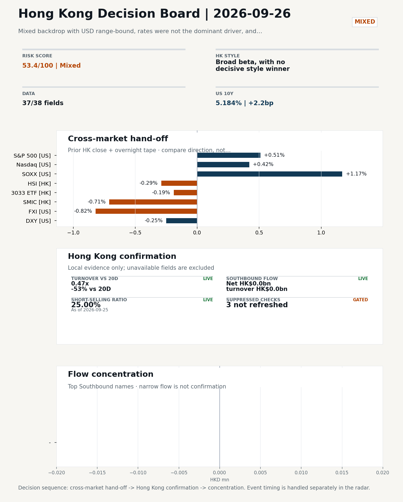
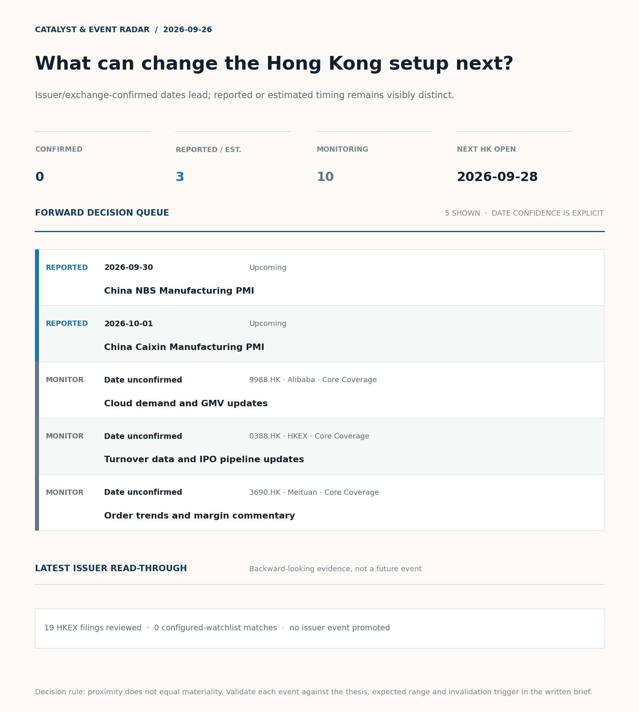
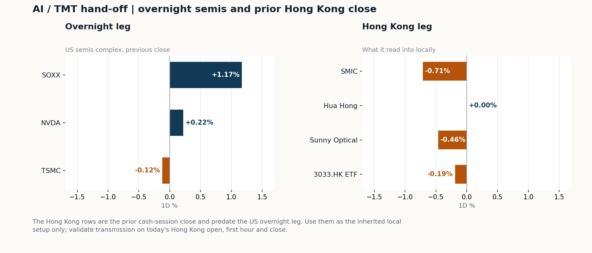
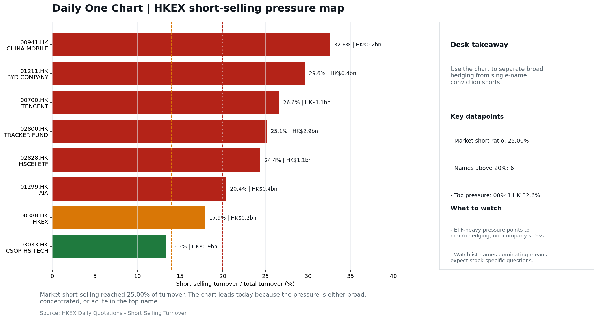

# Morning Research Workbench | 2026-09-26

> **Commute reading route:** `Layer 1 scan (5 min)` → `Layer 2 deep read` → `Layer 3 and appendix if time allows`
>
> Mode: `Trading Daily` | Review Friday's completed session; treat Saturday as a non-trading prep day.

_Data through: US/global `2026-09-25` | HK `2026-09-25` | A-share `2026-09-24` | Generated `2026-09-26 07:58:02`_

## Executive Summary

- **Did yesterday's call work?** UNRESOLVED - No comparable next close is available yet, so the call is still open.
- **What changed overnight?** Semis led higher: SOXX +1.17%, NVDA +0.22%, TSMC -0.12%. HSI -0.29% and 3033.HK -0.19%.
- **What it means for AI/TMT** No decisive style winner - Broad beta, with no decisive style winner, a 0.10pp spread. Avoid forcing a growth-versus-value call; let volume, Southbound concentration, and the first-hour relative tape identify leadership.
- **What to watch today** Next scheduled catalyst: China NBS Manufacturing PMI on 2026-09-30. Watch whether SMIC and Hua Hong trade with HSCEI rather than with the overnight semis leg.

## Layer 1 | Scan (5 min)

### 1.1 Yesterday's Call
**Verdict: UNRESOLVED.** No comparable next close is available yet, so the call is still open.

**Recent record.** 6 confirmed / 4 broken over the last 10 scoreable calls (60.0% hit rate). This is a directional close-to-close diagnostic, not a track record.

### 1.2 Opening Decision Board

**Global-to-Hong Kong signals**

_Coverage gate: 2 unavailable market fields are suppressed from the main table; source status remains in the appendix._

_Decision-useful subset: each row states the implication and the next test. Descriptive secondary monitors are kept out of the five-minute scan._

| Signal | Last / move | Interpretation | Confirmation / invalidation |
| --- | --- | --- | --- |
| S&P 500 | 7,743.41 / +0.51% | Broad US risk rose as volatility drained out of the tape, which sets the external floor Hong Kong opens against. Falling volatility confirms lower near-term stress. | Watch whether Nasdaq and offshore-China proxies move the same way. |
| Nasdaq 100 | 30,608.13 / +0.42% | Growth tracked broad beta, so the move looks market-wide rather than duration-led. Growth advanced despite higher yields, showing momentum resilience but also higher reversal sensitivity. | 3033.HK versus HSI leadership carries the read; rising yields would undo it. |
| Hang Seng Index | 24,761.13 / -0.29% | Broad beta fell helped by a firmer offshore renminbi, with growth and value moving together. | Southbound participation decides whether this is investable or just a print. |
| Hang Seng TECH ETF (3033.HK) | 4.2720 / -0.19% | Growth and broad beta moved together; there is no decisive style rotation yet. | Needs a stable CNH and Southbound buying to become a duration signal. |
| Semiconductors (SOXX) | 572.68 / +1.17% | Semis led the Nasdaq by 0.75pp, putting the AI capex trade back in front. | SMIC and Hua Hong at the open show whether it transmits to Hong Kong. |
| US 10Y | 5.1840% / +2.2bp | The yield proxy rose, tightening the discount-rate backdrop for long-duration Hong Kong growth. | Read it through 3033.HK relative performance, not the index level. |
| USD/CNH | 6.6825 / -0.37% | A stronger offshore renminbi supports the external-risk backdrop for Hong Kong equities. | FXI and Southbound flow decide whether this reaches Hong Kong equities. |
| VIX | 14.87 / **-5.11%** | Lower implied volatility reduces near-term stress, but is supportive only if equity breadth confirms. | Falling volatility on narrowing breadth is a warning, not support. |

_Secondary monitors retained in the source bundle: SMIC (0981.HK), CSI 300, DXY, USD/HKD, Brent crude, COMEX gold, Copper._

**Hong Kong local confirmation**

_Coverage gate: 2 unavailable local checks are suppressed here and retained in validation metadata._

| Check | Value | Status | Source / as of | Why it matters |
| --- | --- | --- | --- | --- |
| Main Board turnover vs 20D | 0.47x \| -53% vs 20D | Live local | HKEX \| 2026-09-25 | Trailing 20-session average turnover was HK$216.7bn. |
| Southbound / Northbound net flow | Southbound Net HK$0.0bn \| turnover HK$0.0bn \| Northbound N/A | Live local | HKEX Connect \| 2026-09-25 | Southbound net buy is calculated from HKEX disclosed buy and sell turnover. |
| Short-selling ratio | 25.00% | Live local | HKEX \| 2026-09-25 | Official HKEX stock-level short-selling table, aggregated as a share of total market turnover. |
| USD/HKD spot vs band | 7.8427 | Live quote | Yahoo \| 2026-09-25 | 73 pips from the weak-side CU (7.8500); monitor HKMA operations and the aggregate balance for a funding squeeze. |
| Hong Kong leadership | Broad beta, with no decisive style winner | Proxy | HSI / HSCEI / 3033.HK ETF relative \| 2026-09-25 | Use HSI / HSCEI / 3033.HK ETF relative moves as the opening style read. |

**Risk state and evidence**

**Composite risk score:** `53.4/100` | **Regime:** `Mixed`

| Component | Score impact | Evidence |
| --- | --- | --- |
| US beta | +3.1 | S&P 500 +0.51% |
| HK growth ETF proxy | -0.9 | 3033.HK ETF -0.19% |
| Semis complex | +5.8 | SOXX +1.17% |
| Offshore China proxy | -4.1 | FXI -0.82% |
| Dollar pressure | +2.5 | DXY -0.25% |
| Volatility | +10 | VIX -5.11% |
| HK short-selling | -8 | Short-selling ratio 25.00% |
| HK turnover | -5 | Turnover 0.47x 20D |

_Base 50 plus the component deltas above. Semis complex entered the score on 2026-08-22; earlier scores in the ledger exclude it._

**Morning Checklist**

1. **Mixed backdrop with USD range-bound, rates were not the dominant driver, and Nasdaq 100 outperformed FXI**
 Overnight regime | Start by deciding whether the day is about Mixed conditions or a style pivot.
2. **China NBS Manufacturing PMI (Upcoming)**
 Macro / policy | Growth direction, cyclicals, and manufacturing-chain pricing | Industries: Machinery, Building materials, Industrials
3. **China Caixin Manufacturing PMI (Upcoming)**
 Macro / policy | Growth direction, cyclicals, and manufacturing-chain pricing | Industries: Machinery, Building materials, Industrials
4. **US Non-Farm Payrolls**
 Catalysts | Watch whether it changes risk budgets or the theme-trading cadence

## Visual Dashboard

**Catalyst & Event Radar**

**Chart read:** No issuer/exchange-confirmed event date is populated; 3 reported or estimated timing item(s) and 10 undated trigger(s) remain explicit.

_Source: Public calendars, issuer disclosures and configured research watchlists_
## Layer 2 | Core Research (20-30 min)

### 2.1 Global-to-Hong Kong Transmission
**Market Setup**
**Core tape.** Overnight US action was a modest risk-on drift rather than a leadership signal: S&P 500 +0.51% and Nasdaq 100 +0.42% sat on a range-bound USD (+0.01% DXY composite, intraday), with VIX easing 5.11%.
**Main driver.** The clearest cross-asset divergence was Nasdaq 100 outperforming FXI (-0.82%) by 0.94pp, consistent with the theme that rates were not the dominant driver.
**HK relevance.** Prior-HK (25 Sep) closed with HSI -0.29%, HSCEI -0.09%, and 3033.HK -0.19% on turnover only 0.47x the 20-day average and a 25.0% short-selling ratio, so conviction into the 28 Sep open should be gated by flow confirmation rather than the US headline.

**Key Drivers**
- Short-selling pressure was the dominant drag on the prior-HK tape (HKEX short ratio 25.00%, 100th percentile of the last 60 sessions), so rebounds into the 28 Sep open require cleaner breadth and flow confirmation rather than headline tailwind.
- Rates and the dollar were not the lead story.
- The semis complex split: SOXX +1.17% on the US side is supportive of HK platform/AI beta.
- Soft-cyclical commodity tape: WTI -2.29% and gold +0.35% argue against reading US strength as a reflation trade.

**Hong Kong Read-Through**
**Opening implication.** Bias for the 28 Sep open is modestly constructive but not chaseable on US strength alone. Watch three confirmations: (1) USD/CNH holds below the prior close to keep the FX tailwind live.
_Hong Kong style leadership and flow confirmation are set out in the Hong Kong review below._

**Watch Points**
- USD composite moved higher by +0.01pct intraday, with a 0.379pct range.
- Main turning points appeared around 2026-09-25 08:15 peak / 2026-09-25 08:35 peak / 2026-09-25 08:55 trough, suggesting event-driven repricing rather than a clean one-way USD move.
- The biggest cross-asset divergence was Nasdaq 100 versus FXI, a spread of 0.094pct.
- Gold moved +0.35pct intraday with a 1.373pct high-low range.

**Curated overnight stories**
1. **U.S.-China trade truce extended for two months, Bessent says, as Xi begins state visit**
 Why it matters: An explicit two-month extension of the trade truce, announced during the Trump-Xi meeting, delays tariff escalation and provides a defined window for further negotiation.
 HK read-through: Direct read-through to Hong Kong exporters, tariff-sensitive industrials, and the broader offshore-China risk premium.
2. **China confirms first AI talks with U.S. have taken place, hints at trade truce extension**
 Why it matters: Confirmation of a formal US-China AI dialogue is a concrete step beyond rhetoric and was signalled just ahead of the Trump-Xi meeting.
 HK read-through: Most relevant for HK-listed China AI and semiconductor names; reduces near-term tail-risk on chip export controls and opens room for re-rating of AI-related names.
3. **China's Xi urges U.S. to cooperate on AI**
 Why it matters: Puts AI cooperation on the official bilateral agenda alongside trade, framing it as a structural issue rather than a one-off gesture.
 HK read-through: Background support for the China AI and internet complex in HK; useful as a sentiment anchor but lacks hard policy detail at this stage.
4. **Jev, an AI Model That Can't Chat, Takes On Bigger Rivals**
 Why it matters: A new low-cost AI model from a former OpenAI researcher is generating attention and could feed the 'cheaper/faster model' narrative.
 HK read-through: Indirect read for HK AI and cloud-exposed names; a useful sentiment data point but insufficient on its own to change earnings or capex assumptions.
5. **Philadelphia Fed's Anna Paulson says 'modest' rate moves likely ahead to tame inflation**
 Why it matters: Frames the Fed path as gradual rather than aggressive, consistent with the overnight mixed/range-bound USD regime.
 HK read-through: Marginal: keeps the rates backdrop from being a headwind for HK and offshore-China assets; secondary to the US-China headlines.

**AI / TMT hand-off**

**Overnight leg.** The overnight semis leg was flat (+0.42% average), so it does not set the direction for Hong Kong tech today.
**Hong Kong expression.** Let local flow and style leadership drive the tech read rather than the overnight tape.
**Observable test.** Watch whether SMIC and Hua Hong trade with HSCEI rather than with the overnight semis leg.

| Name | Role in the chain | 1D | Leg |
| --- | --- | --- | --- |
| SOXX | Semis complex | +1.17% | overnight |
| NVDA | AI capex narrative | +0.22% | overnight |
| TSMC | Foundry demand | -0.12% | overnight |
| SMIC | Leading-edge / domestic substitution | -0.71% | Hong Kong |
| Hua Hong | Mature-node pricing cycle | +0.00% | Hong Kong |
| Sunny Optical | Hardware and optics supply chain | -0.46% | Hong Kong |
| 3033.HK ETF | Broad HK tech beta | -0.19% | Hong Kong |

**Clock discipline.** The Hong Kong rows are the prior cash-session close and predate the US overnight leg. Use them as the inherited local setup only; validate transmission on today's Hong Kong open, first hour and close.

### 2.2 Hong Kong Local Tape and Flow
**Local Tape Setup**
**Local read.** Reviewing the 25 Sep HK tape against the 25 Sep US close, style leadership is unclear rather than absent.
**Verification point.** HSI -0.29%, HSCEI -0.09% and 3033.HK -0.19% effectively flat into the close, while overnight Nasdaq 100 +0.42% and SOXX +1.17% ran ahead of FXI -0.82% on a range-bound USD.
**Risk to watch.** Confirmation is incomplete: Stock Connect southbound is reported at HK$0.0bn turnover and the AH premium could not be derived, so any Southbound or A-share read-through is not yet evidenced.

**Style and Local Leadership**
**Style call.** Broad beta, with no decisive style winner.
- **Evidence:** 3033.HK and HSCEI were separated by only 0.10pp (-0.19% versus -0.09%)
- **Portfolio meaning:** Avoid forcing a growth-versus-value call; let volume, Southbound concentration, and the first-hour relative tape identify leadership.
- **Cross-market read:** Hang Seng -0.29% / HSCEI -0.09% / 3033.HK ETF -0.19%. Offshore China proxy FXI -0.82% and USD/CNH -0.37% frame cross-border risk appetite. USD/HKD last traded around 7.8427, which keeps the Hong Kong funding lens in focus.

**Flow Confirmation**
Official Stock Connect evidence is available; the Flow Tracker confirms whether local money supports the price action.

**Follow-Through Checklist**
**Follow-through check.** Confirmation test for 28 Sep: (1) 3033.HK vs HSCEI spread tightens (target 3033.HK outperforming or within ~0.2pp of HSCEI) and HK semis names (SMIC, Hua Hong) firm into the close, otherwise reclassify leadership as defensives/beta.
**Failure condition.** Reclassify the tape when either 3033.HK or HSCEI opens a sustained 0.5pp relative lead with flow confirmation.

**Cross-asset attribution**

| Driver | Direction | Score | Evidence | HK implication |
| --- | --- | --- | --- | --- |
| Short-selling pressure | drag | 7.0 | HKEX short-selling ratio was 25.00%. | Elevated short activity argues for extra confirmation before chasing rebounds. |
| Oil and geopolitics | supportive | 6.85 | Oil moved -8.56%. | Split the read between energy/cyclicals support and margin/geopolitical pressure. |
| Hong Kong participation | drag | 5.28 | Main Board turnover was 0.47x the 20-session average. | Thin turnover makes index moves easier to fade. |
| Dollar / CNH pressure | supportive | 0.55 | DXY -0.25% / USD-CNH -0.37% | A stable or softer CNH makes Hong Kong follow-through more credible. |

**Local flow evidence**

**Flow Takeaways**
- Short-selling pressure is elevated, so local rebounds need cleaner breadth and flow confirmation.
- Stock Connect Southbound: net HK$0.0bn on turnover HK$0.0bn (as of 2026-09-25).
- ETF flow anomalies were concentrated in: TLT -0.13% / volume ratio 1.45x / outflow; LQD +0.06% / volume ratio 1.37x / inflow; SPY +0.54% / volume ratio 0.73x / inflow.
- HKEX short selling: 25.00% of market turnover (HK$25.5bn short turnover, as of 2026-09-25).

**Stock Connect Southbound Active Names**

| # | Ticker | Name | Buy | Sell | Net buy | HKEX turnover rank |
| --- | --- | --- | --- | --- | --- | --- |
| 1 | | - | N/A | N/A | N/A | 1 |
| 2 | | - | N/A | N/A | N/A | 1 |

**AH Premium Dispersion**
- A/H premium dispersion was not refreshed in the current public quote set. Status: `error`.

**HKEX Short-Selling Watch**

| Ticker | Name | Short ratio | Short turnover | Total turnover |
| --- | --- | --- | --- | --- |
| 00388.HK | HKEX | 17.91% | HK$0.2bn | HK$1.3bn |
| 00700.HK | TENCENT | 26.58% | HK$1.1bn | HK$4.0bn |
| 00941.HK | CHINA MOBILE | 32.57% | HK$0.2bn | HK$0.7bn |

- **Short-value leaders:** 02800.HK TRACKER FUND (HK$2.9bn); 02828.HK HSCEI ETF (HK$1.1bn); 01810.HK XIAOMI-W (HK$1.1bn); 00700.HK TENCENT (HK$1.1bn).

### 2.3 Macro Transmission
**Desk read.** Today's brief covers the 2026-09-25 completed session and looks through to Monday 2026-09-28.

**Market sensitivity.** The overnight tape was mixed: VIX at 14.87 (-5.11%) signals easing stress, SOXX +1.17% provides a direct read-through for Hong Kong tech, while WTI crude -2.29% argues for a more cautious cyclical-growth read.

**HK implication.** USD/CNH -0.37% leaves the cross in a tight range and does not, on its own, change the Hong Kong risk setup.

**Macro watchpoints**
- US Treasury yields and DXY from the 09-25 session, which were not provided and are needed to frame Monday's HK open.
- HK cash close on 2026-09-25, also not supplied, to confirm whether tech leadership extends or fades into Monday 2026-09-28.
- China NBS Manufacturing PMI on 2026-09-30: an upside surprise would support H-share cyclicals (machinery, building materials, industrials)
- Caixin Manufacturing PMI on 2026-10-01 for divergence versus NBS, with the private-exporter skew a swing factor for southbound positioning.

| Time | Region | Event | Status | Desk read |
| --- | --- | --- | --- | --- |
| | CN | China NBS Manufacturing PMI | Upcoming | Impact: Growth direction, cyclicals, and manufacturing-chain pricing \| Attention: 5/5 \| Industries: Machinery, Building materials, Industrials |
| | CN | China Caixin Manufacturing PMI | Upcoming | Impact: Growth direction, cyclicals, and manufacturing-chain pricing \| Attention: 3/5 \| Industries: Machinery, Building materials, Industrials |

**Positioning and risk backdrop**

- Detailed local flow evidence is covered under Flow Tracker and Attribution; keep this section focused on options, hedging, and macro-positioning risk.

### 2.4 Company Micro Research and Catalysts

| Grade | Sector | Headline | Why it matters | Horizon |
| --- | --- | --- | --- | --- |
| B | China Internet | Stocks making the biggest moves midday | Assess whether the story can propagate through the China Internet value | Monitor |
| B | China Internet | Stocks making the biggest moves premarket | Assess whether the story can propagate through the China Internet value | Monitor |

**Company Event Takeaway**
**Desk read.** Reviewing Friday's completed HK session (2026-09-25) into Monday's open (2026-09-28).
**Why it matters.** Backdrop is mixed: USD range-bound, rates not the dominant driver, Nasdaq 100 outperformed FXI.
**Follow-up.** No rating changes or fresh estimate comparisons were supplied.

**LLM Quick Takes**
- **0941.HK** | Nearest earnings catalyst on the supplied calendar (2026-10-20, 24 days out, Monitor priority). Estimate comparison unavailable…
- **1211.HK** | Earnings on 2026-10-29 (Monitor). Closed at the bottom of its 60-session range (0%) with a -1.76% session move; use the print to test the EV volume, export mix, and price-competition thesis.
- **0388.HK** | Earnings on 2026-11-06 (Archive). Friday's -1.27% move with no estimate comparison available; relevant only as a turnover/IPO-pipeline proxy into results.
- **0700.HK** | Earnings on 2026-11-18 (Archive). No fresh catalyst or estimate input; remain a passive read-through into gaming and ads sentiment rather than an active call.

Decision filter<h4>No immediate portfolio catalyst: 19 official filings were screened and the low-signal market set stays aggregated.</h4>
19 profit warnings

<strong>19</strong>Official filings

<strong>0</strong>Watchlist hits

<strong>0</strong>Actionable events

<article class="event-card priority-monitor">

MonitorEarnings<time>2026-10-20</time>

<h5>China Mobile · 0941.HK</h5>

Estimate comparison unavailable

Investor read
Calendar monitor only; no consensus comparison is available, so this is not yet an earnings view.

Next check
Confirm timing and obtain a consensus/KPI frame before promoting this event.

<a class="event-source" href="https://finance.yahoo.com/quote/0941.HK">Yahoo Finance ticker calendar ↗</a>
</article>

<strong>Coverage boundary.</strong> sell-side rating changes, IPO / grey-market monitor were not decision-grade in this run; their absence is not treated as confirmation that no event exists.

**Core coverage requiring follow-up**

**Core coverage**

| Name | Ticker | Last | 1D | Range position | Morning note |
| --- | --- | --- | --- | --- | --- |
| Alibaba | 9988.HK | 108.40 | -1.45% | Mid-range | Marginally lower (-1.45%), mid-range at 39% of its 60-session band. |
| HKEX | 0388.HK | 388.40 | -1.27% | Mid-range | Marginally lower (-1.27%), mid-range at 40% of its 60-session band. |

**Recent headlines for Alibaba:**
- [Alibaba Group vs. Uber Technologies: Examining Quarterly Revenue Trends](https://www.fool.com/coverage/charts/2026/09/25/alibaba-group-vs-uber-technologies-examining-quarterly-revenue-trends/) (Motley Fool)

**Priority follow-up**

| Name | Ticker | Last | 1D | Range position | Morning note |
| --- | --- | --- | --- | --- | --- |
| AIA | 1299.HK | 73.75 | -2.70% | Mid-range | Down 2.70% on the session, mid-range at 42% of its 60-session band. |
| BYD Company | 1211.HK | 78.10 | -1.76% | Bottom of range | Marginally lower (-1.76%), still in the bottom quartile of its 60-session range (0%). |

### 2.5 Morning Meeting Questions
**Q1. Short selling was very high at 25.0% - who is positioned against this market?**
- **Evidence:** Short-selling ratio 25.0% (100th pct of the last 60 sessions, very high).
- **How to answer:** Check the concentration before reading it as bearish: ETF-heavy short turnover is macro hedging, while single-name pressure is company-specific. The HKEX short-selling table in this report separates the two.

## Layer 3 | Session Playbook (8-12 min)

### 3.1 Base Case and Scenario Map
**Starting posture.** Broad beta, with no decisive style winner (medium confidence); composite risk `53.4/100` (Mixed). Avoid forcing a growth-versus-value call; let volume, Southbound concentration, and the first-hour relative tape identify leadership.

**Scenario map**

| Scenario | Observable trigger | Interpretation | Research response |
| --- | --- | --- | --- |
| Selective growth confirms | 3033.HK keeps a >0.5pp first-hour lead over HSCEI; SMIC and Hua Hong stop lagging broad beta; CNH is stable. | The prior style split has live price confirmation, but is not yet broad China risk-on. | Prioritize internet/platform relative strength; verify participation again at the close. |
| Broad beta takes over | HSI and HSCEI rise together, breadth improves and the 3033.HK lead narrows without turning negative. | Leadership is broadening from a style trade into market beta. | Expand the research set from growth leaders to financials, SOEs and index-heavy names. |
| Risk-off continuation | 3033.HK loses its lead, semis underperform HSCEI and CNH depreciation accelerates. | The prior divergence was a temporary pocket of strength rather than a durable hand-off. | Treat rebounds as unconfirmed; focus on balance-sheet, catalyst and crowding risk. |

**Clocked validation scorecard**

| Window | Check | Prior evidence | Pass condition | What it decides |
| --- | --- | --- | --- | --- |
| 09:30-10:30 | 3033.HK vs HSCEI | -0.10pp at the prior close | 3033.HK retains >0.5pp relative lead | Whether growth leadership survives the open |
| 09:30-10:30 | Semiconductor hand-off | SMIC -0.71%; Hua Hong Semiconductor +0.00% | Stabilise after the open; at least one stops underperforming HSCEI | Whether overnight semis pressure is contained locally |
| 09:30-10:30 | HSI price zone | 24,761 vs 24,500 / 25,000 reference grid | Hold above the lower grid or reclaim the upper grid with breadth | Whether broad beta is stabilising; grid is derived, not technical analysis |
| 09:30-10:30 | USD/CNH | 6.6825 \| -0.37% | No acceleration in CNH depreciation | Whether FX permits a clean Hong Kong risk extension |
| At close | Turnover | 0.47x \| -53% vs 20D | At least 1.0x the 20-session average | Whether the move had normal participation |
| At close | Southbound | Net HK$0.0bn \| turnover HK$0.0bn | Net buying remains positive and broadens beyond one or two names | Whether mainland money confirms the price move |
| At close | Short pressure | 25.00% | Falls versus the prior verified reading (25.00%) | Whether rebound conviction improved |

**Upgrade rule.** Confirm a broad-beta session only if HSI breadth and turnover improve without a sharp 3033.HK-versus-HSCEI split.
**Kill switch.** Reclassify the tape when either 3033.HK or HSCEI opens a sustained 0.5pp relative lead with flow confirmation.
**Clock discipline.** At 07:30, same-day Southbound, turnover and short-selling outcomes are not known. Use the first-hour price/FX checks provisionally and make the final classification only after the close.
**Event clock.** No same-day decision-grade item is populated; the nearest reported/estimated item is China NBS Manufacturing PMI on 2026-09-30. Verify the issuer or official calendar before relying on the date.

### 3.2 Conditional Theme Deep Dive

| Field | Read |
| --- | --- |
| Theme | AI and Compute Chain |
| Angle for the day | Track whether global AI capex, semis, cloud, and server demand are still carrying offshore China internet and hardware sentiment. |

**Theme desk read**
**Core thesis.** The AI and Compute Chain angle stays live into the Monday 2026-09-28 HK session, with the global tape offering a modestly constructive but not decisive read-through.
**Evidence.** SOXX closed +1.17% on 2026-09-25, which should give HK semis and platform beta a supportive open, while VIX -5.11% (to 14.87) lowers the friction cost for thematic positioning.
**What to test.** Rates and USD/CNH were not the dominant drivers, so the question is whether AI capex and compute demand can continue to carry offshore China internet and hardware sentiment.

**Signals to keep in mind**
- Stocks making the biggest moves midday: McDonald's, Cracker Barrel, Alibaba, Worthington & more
- Stocks making the biggest moves premarket: Alibaba, Quest Diagnostics, On Holding, GameStop & more
- VIX -5.11%: Lower volatility signals easing stress in the tape.
- SOXX +1.17%: Semis rallied, giving HK semis and platform beta a supportive open.

**LLM watch items:**
- SOXX follow-through at the HK open on 2026-09-28; a fade would weaken the supportive read-through into HK semis and platform beta.
- Whether the Alibaba-led CNBC list flow translates into China Internet peer moves or fades as headline noise.
- Tencent (0700.HK) range position; a break out of the bottom quartile would change its role from marginal monitor to signal name.
- China NBS Manufacturing PMI on 2026-09-30 as the first hard growth print to validate or stress-test the constructive tape, with Caixin PMI on

**Related names to keep close:**

| Name | Ticker | Bucket | Morning read |
| --- | --- | --- | --- |
| Alibaba | 9988.HK | Core coverage | Marginally lower (-1.45%), mid-range at 39% of its 60-session band. |
| Tencent | 0700.HK | Core coverage | Marginally lower (-0.41%), still in the bottom quartile of its 60-session range (24%). |
| AIA | 1299.HK | Priority follow-up | Down 2.70% on the session, mid-range at 42% of its 60-session band. |

**Upcoming catalysts tied to the theme:**
- 2026-09-30 | China NBS Manufacturing PMI | Growth direction, cyclicals, and manufacturing-chain pricing
- 2026-10-01 | China Caixin Manufacturing PMI | Growth direction, cyclicals, and manufacturing-chain pricing

**Relevant headlines:**
- [Stocks making the biggest moves midday: McDonald's, Cracker Barrel, Alibaba, Worthington & more](https://www.cnbc.com/2026/09/23/stocks-making-the-biggest-moves-midday-mcd-cbrl-baba-wor-.html)
- [Stocks making the biggest moves premarket: Alibaba, Quest Diagnostics, On Holding, GameStop & more](https://www.cnbc.com/2026/09/22/stocks-making-the-biggest-moves-premarket-baba-dgx-onon-gme.html)
- [Jev, an AI Model That Can't Chat, Takes On Bigger Rivals](https://www.bloomberg.com/news/videos/2026-09-25/jev-an-ai-model-that-can-t-chat-takes-on-bigger-rivals-video)

### 3.3 Daily One Chart
**Daily One Chart | HKEX short-selling pressure map**

**Chart read.** Market short-selling reached 25.00% of turnover.
**Why it matters.** The chart leads today because the pressure is either broad, concentrated, or acute in the top name.

_Source: HKEX Daily Quotations - Short Selling Turnover_

## Optional Appendix | Traceability and Performance (10-15 min)

### Report Metadata
> Date policy: Review date 2026-09-25 is treated as `Trading Daily`. | Global (US/Europe) data date is 2026-09-25; adapter effective date is 2026-09-25 and summary date is 2026-09-25. | Hong Kong local data date is 2026-09-25; role: same-session local cash tape.
> Market data quality: Coverage: `37/38` | Missing: `1`
> Report quality: `85.0/100` | Grade `B` | Status `usable with caveats`

### Report Quality and Validation
- **Quality score:** 85.0/100 | **Grade:** B | **Status:** usable with caveats
- **Run summary:** 6 healthy | 2 caveat | 2 failed
- **Release recommendation:** Send with caveats | The report is usable, but the advisory guidance should travel with it so readers understand the data gaps.

| Source | Status | Bucket |
| --- | --- | --- |
| A/H premium | error | failed |
| China rates | error | failed |
| Macro calendar | partial | caveat |
| Risk and sentiment feed | partial | caveat |

**Desk-use guidance summary:** 0 blocking | 2 advisory

**Desk-use guidance**
- **Advisory:** Avoid strong A/H valuation-dispersion conclusions until the premium snapshot refreshes.
- **Advisory:** Be careful with China macro carry and rates-spread conclusions until the China rates adapter refreshes.

| Weak component | Score | Read |
| --- | --- | --- |
| Hong Kong local metrics | 45.0 | 4 live, 3 proxy, 4 unavailable local checks. |

**Quality warnings**
- Hong Kong local metrics is weak: 4 live, 3 proxy, 4 unavailable local checks.

**Narrative fact-check guardrail**
- Checked 37 numeric claims; 0 numeric mismatch(es), 0 logic warning(s); 11 structured claims, 0 source/text warning(s); 0 critical, 0 review.
- **Source health:** degraded | 8 healthy, 0 degraded, 2 unavailable.
- **Adapters not OK:** A/H premium (error)

_Full component weights, per-source freshness, adapter status and provenance records are archived with this report under `audit/` rather than printed here._

### Historical Signal Performance
- **Readiness:** exploratory with caveats | 69 observations | 109 active signal dates | next-close entry, 10bps cost, no same-day returns.
- **Interpretation boundary:** exploratory until a benchmark reaches 252 sessions and 100 active-signal sessions.
- **Data-quality caveat:** 23 conflicting price revision(s) and 6 non-session observation(s) remain in the research ledger.
- **Daily-use boundary:** cumulative return, Sharpe and the performance chart stay out of the daily commute edition until the sample and trading-calendar gates pass; use Yesterday's Call instead.

### Source Links
- [Stocks making the biggest moves midday: McDonald's, Cracker Barrel, Alibaba, Worthington & more](https://www.cnbc.com/2026/09/23/stocks-making-the-biggest-moves-midday-mcd-cbrl-baba-wor-.html) (cnbc_markets)
- [Stocks making the biggest moves premarket: Alibaba, Quest Diagnostics, On Holding, GameStop & more](https://www.cnbc.com/2026/09/22/stocks-making-the-biggest-moves-premarket-baba-dgx-onon-gme.html) (cnbc_markets)
- [Alibaba Group vs. Uber Technologies: Examining Quarterly Revenue Trends](https://www.fool.com/coverage/charts/2026/09/25/alibaba-group-vs-uber-technologies-examining-quarterly-revenue-trends/) (Motley Fool)
- [Alibaba vs. Coupang: Which E-Commerce Stock Is a Better Buy in 2026?](https://www.fool.com/coverage/better-buy/2026/09/25/alibaba-vs-coupang-which-e-commerce-stock-is-a-better-buy-in-2026/) (Motley Fool)
- [Meituan (MPNGF) (Q2 2026) Earnings Call Highlights: Record Revenue and Strategic AI Pivot Drive...](https://finance.yahoo.com/markets/stocks/articles/meituan-mpngf-q2-2026-earnings-190123345.html) (GuruFocus.com)
- [China Mobile (SEHK:941): A Closer Look at Valuation After Steady Share Price Gains This Year](https://finance.yahoo.com/news/china-mobile-sehk-941-closer-154022664.html) (Simply Wall St.)
- [00092.HK Profit warning / alert announcement](http://www1.hkexnews.hk/listedco/listconews/sehk/2026/0925/2026092501017.pdf) (HKEXnews)
- [00825.HK Profit warning / alert announcement](http://www1.hkexnews.hk/listedco/listconews/sehk/2026/0925/2026092500897.pdf) (HKEXnews)
- [02309.HK Profit warning / alert announcement](http://www1.hkexnews.hk/listedco/listconews/sehk/2026/0925/2026092500783.pdf) (HKEXnews)
- [00519.HK Profit warning / alert announcement](http://www1.hkexnews.hk/listedco/listconews/sehk/2026/0924/2026092402045.pdf) (HKEXnews)
- [00559.HK Profit warning / alert announcement](http://www1.hkexnews.hk/listedco/listconews/sehk/2026/0924/2026092401785.pdf) (HKEXnews)
- [00653.HK Profit warning / alert announcement](http://www1.hkexnews.hk/listedco/listconews/sehk/2026/0924/2026092401977.pdf) (HKEXnews)
- [01166.HK Profit warning / alert announcement](http://www1.hkexnews.hk/listedco/listconews/sehk/2026/0924/2026092401889.pdf) (HKEXnews)
- [01010.HK Profit warning / alert announcement](http://www1.hkexnews.hk/listedco/listconews/sehk/2026/0923/2026092301607.pdf) (HKEXnews)
