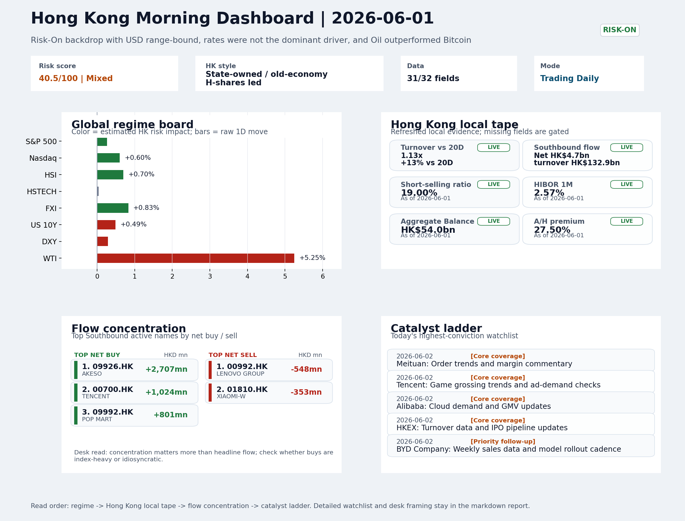

# Latest Professional Report

This is the stable GitHub entry for the newest archived report.

- Report date: `2026-06-02`
- Report mode: `Trading Daily`
- Quality: `85.8/100`
- One-line pulse: Risk-On conditions with oil strength support the HK energy and cyclical trade, but Intel's guidance reset and a 19%...
- Archived folder: [archive/2026-06-02](../archive/2026-06-02/README.md)
- Direct markdown file: [morning_briefing.md](../archive/2026-06-02/morning_briefing.md)
- Dashboard: [Open image](../archive/2026-06-02/charts/dashboard_2026-06-02.png)
- Daily One Chart: [Open image](../archive/2026-06-02/charts/daily_one_chart_2026-06-02.png)
- Trend Pack: N/A
- Raw bundle: N/A

## Dashboard Preview

## Quick start

1. Open the archived landing page for navigation and context: [archive/2026-06-02/README.md](../archive/2026-06-02/README.md)
2. Open [morning_briefing.md](../archive/2026-06-02/morning_briefing.md) if you want the full markdown report.
3. Use the chart and bundle links above when you need the production assets behind the report.
