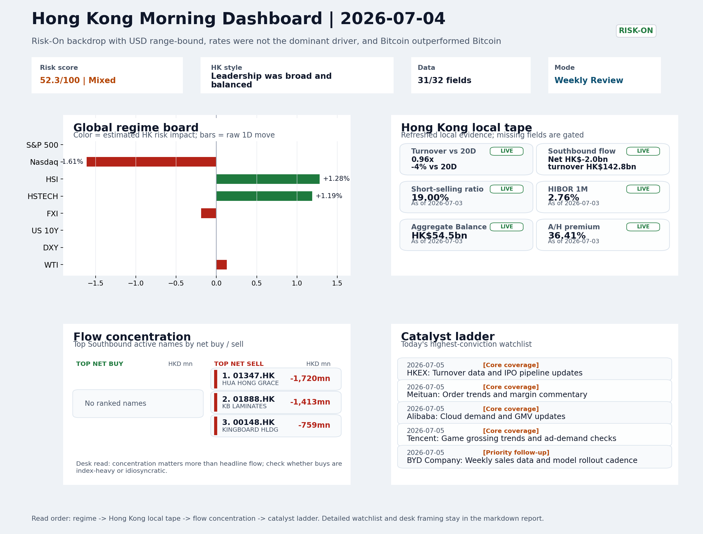

# Latest Professional Report

This is the stable GitHub entry for the newest archived report.

- Report date: `2026-07-05`
- Report mode: `Weekly Review`
- Quality: `87.4/100`
- One-line pulse: Hong Kong local indices outperformed a Risk-On week but without FXI cross-confirmation or southbound flow support,...
- Archived folder: [archive/2026-07-05](../archive/2026-07-05/README.md)
- Direct markdown file: [morning_briefing.md](../archive/2026-07-05/morning_briefing.md)
- Dashboard: [Open image](../archive/2026-07-05/charts/dashboard_2026-07-05.png)
- Daily One Chart: [Open image](../archive/2026-07-05/charts/daily_one_chart_2026-07-05.png)
- Trend Pack: [Open image](../archive/2026-07-05/charts/hk_trend_pack_2026-07-05.png)
- Raw bundle: N/A

## Dashboard Preview

## Quick start

1. Open the archived landing page for navigation and context: [archive/2026-07-05/README.md](../archive/2026-07-05/README.md)
2. Open [morning_briefing.md](../archive/2026-07-05/morning_briefing.md) if you want the full markdown report.
3. Use the chart and bundle links above when you need the production assets behind the report.
