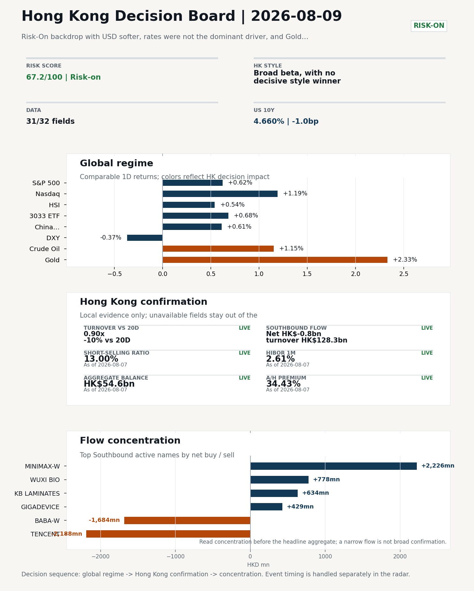

# Latest Professional Report

This is the stable GitHub entry for the newest archived report.

- Report date: `2026-08-09`
- Report mode: `Weekly Review`
- Quality: `86.2/100`
- One-line pulse: Pulse unavailable
- Archived folder: [archive/2026-08-09](../archive/2026-08-09/README.md)
- Direct markdown file: [morning_briefing.md](../archive/2026-08-09/morning_briefing.md)
- Dashboard: [Open image](../archive/2026-08-09/charts/dashboard_2026-08-09.png)
- Catalyst & Event Radar: [Open image](../archive/2026-08-09/charts/catalyst_radar_2026-08-09.png)
- Daily One Chart: [Open image](../archive/2026-08-09/charts/daily_one_chart_2026-08-09.png)
- Trend Pack: [Open image](../archive/2026-08-09/charts/hk_trend_pack_2026-08-09.png)
- Raw bundle: N/A
- Integrity manifest: [Verify SHA-256 payload](../archive/2026-08-09/manifest.json)
- Source health: `degraded`
- Backtest status: `exploratory with caveats`

## Dashboard Preview

## Quick start

1. Open the archived landing page for navigation and context: [archive/2026-08-09/README.md](../archive/2026-08-09/README.md)
2. Open [morning_briefing.md](../archive/2026-08-09/morning_briefing.md) if you want the full markdown report.
3. Use the chart and bundle links above when you need the production assets behind the report.
