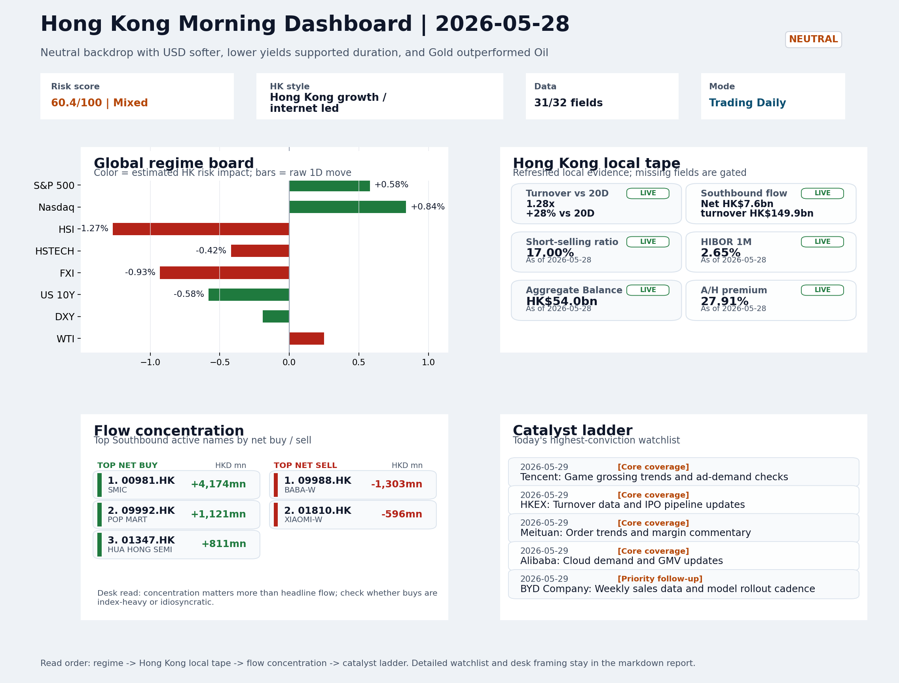

# Latest Professional Report

This is the stable GitHub entry for the newest archived report.

- Report date: `2026-05-29`
- Report mode: `Trading Daily`
- Quality: `87.4/100`
- One-line pulse: The completed session closed with Hong Kong growth style outperforming (HSTECH -0.42% vs HSCEI -1.17%) despite a mi...
- Archived folder: [archive/2026-05-29](../archive/2026-05-29/README.md)
- Direct markdown file: [morning_briefing.md](../archive/2026-05-29/morning_briefing.md)
- Dashboard: [Open image](../archive/2026-05-29/charts/dashboard_2026-05-29.png)
- Daily One Chart: [Open image](../archive/2026-05-29/charts/daily_one_chart_2026-05-29.png)
- Trend Pack: N/A
- Raw bundle: N/A

## Dashboard Preview

## Quick start

1. Open the archived landing page for navigation and context: [archive/2026-05-29/README.md](../archive/2026-05-29/README.md)
2. Open [morning_briefing.md](../archive/2026-05-29/morning_briefing.md) if you want the full markdown report.
3. Use the chart and bundle links above when you need the production assets behind the report.
